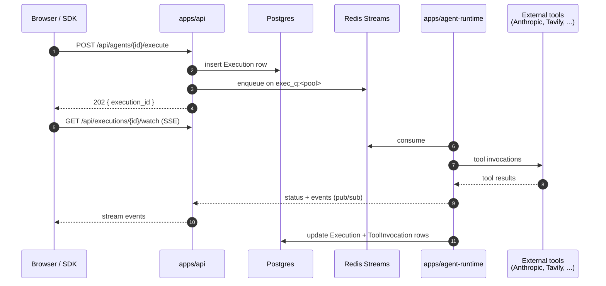
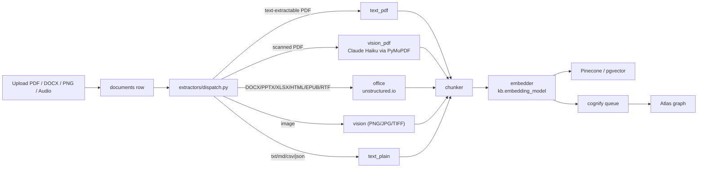

# Architecture

A map of the repo so a new contributor knows where to land.

## What ships

Five things ship from this monorepo:

1. **Abenix platform** — the core product. API, web, agent-runtime workers, background worker, edge runtimes.
2. **Standalone apps** — domain-specific UIs that proxy through the platform: `wingman/`, `industrial-iot/`, `sauditourism/`, `contractiq/`, `resolveai/`, `claimsiq/`.
3. **SDKs** — `packages/sdk/python/` is canonical, copied into every standalone app's `api/sdk/` so they can talk to the platform without a vendored HTTP client.
4. **Helm chart** — `infra/helm/abenix/` deploys the whole platform plus selected standalones to k8s.
5. **The public mirror** — `scripts/publish-public.sh` strips sensitive pieces and rewrites history to the public repo on every release.

## Top-level layout

```
.
├── apps/                      # platform services
│   ├── api/                   # FastAPI — every HTTP route, RBAC, persistence
│   ├── agent-runtime/         # the workers that execute agents (pooled)
│   ├── worker/                # background jobs (cron, webhooks, sweepers)
│   ├── web/                   # Next.js SPA (Tailwind, framer-motion)
│   ├── edge/                  # Python edge runtime (offline agent execution)
│   ├── edge-c/                # C edge runtime (constrained devices)
│   └── edge-rust/             # Rust edge runtime (medium-resource devices)
├── packages/
│   ├── db/                    # SQLAlchemy models + alembic migrations
│   ├── agent-sdk/             # Python SDK consumers import
│   └── sdk/python/abenix_sdk/ # canonical SDK source (synced to consumers)
├── contractiq/                # standalone ETRM/contracts app
├── wingman/                   # standalone commodities trading copilot
├── industrial-iot/            # standalone IoT/predictive maintenance app
├── sauditourism/              # standalone Saudi Tourism app
├── resolveai/                 # standalone customer-support app
├── claimsiq/                  # standalone insurance-claims app
├── infra/helm/abenix/         # the Helm chart that deploys everything
├── docker/                    # Dockerfiles for non-app images
├── scripts/                   # ops scripts (deploy, build, e2e, publish)
├── e2e/                       # Playwright E2E suites
├── tests/unit/                # pure-python unit tests (CI gate)
└── docs/                      # architecture, ops, release guides
```

## Request flow — agent execution



Agent code lives in `apps/agent-runtime/engine/`. Tools register themselves in `engine/tools/__init__.py`. The agent runtime pulls work from one of four Redis Streams pools (`chat`, `default`, `heavy-reasoning`, `long-running`) — pool choice is per-agent config and lets KEDA scale each pool independently.

## Data model — where things live

Everything is tenant-scoped via `tenant_id`. The model lives in [packages/db/models/](packages/db/models/). The notable tables:

| Table | What it holds |
|---|---|
| `tenants` | top of the isolation tree; tenant-level settings (DLP, retention) live in the JSONB `settings` column, which is `MutableDict`-wrapped |
| `users` | password-auth or SSO; `auth_provider` + `external_id` identifies SSO users |
| `agents` | agent definitions (system prompt, tools, model config, optional DSL) |
| `executions` | one row per run; node-result trace + token + cost accounting |
| `tool_invocations` | one row per tool call inside an execution; the source of audit data |
| `webhooks` | tenant-owned outbound HTTP endpoints; HMAC-signed deliveries logged in `webhook_deliveries` |
| `api_keys` | `af_*` keys for SDK callers; raw key shown once on create |
| `approvals` | HITL gates with signoff |
| `mcp_connections` | per-user MCP servers wired into agents at runtime |
| `code_assets`, `knowledge_bases`, `ml_models` | uploadable artifacts |
| `activity_log` | append-only audit trail |

## SSO (Google / GitHub / Microsoft)

Both auth paths share `users.id` — the JWT issued at the end is identical. The difference is only how we resolved the user.

Password flow (existing): `/api/auth/register` and `/api/auth/login` in [auth.py](apps/api/app/routers/auth.py). Stores a bcrypt hash in `users.password_hash`.

SSO flow (new in v1.11): three endpoints in [sso.py](apps/api/app/routers/sso.py):

1. `GET /api/auth/oidc/providers` — returns the list of providers the SPA should show buttons for (only those with creds in env).
2. `GET /api/auth/oidc/{provider}/start?return_to=/dashboard` — signs a short-lived state JWT (return_to + nonce + provider, 10-min expiry) and 302s to the provider's authorize endpoint.
3. `GET /api/auth/oidc/{provider}/callback?code=...&state=...` — verifies state, exchanges code, fetches userinfo, upserts the user (match by `(auth_provider, external_id)` then by email then new), issues access + refresh tokens, 302s to `${WEB_BASE_URL}/auth/callback#access_token=...&refresh_token=...&return_to=...`. The SPA's [/auth/callback page](apps/web/src/app/auth/callback/page.tsx) stashes the tokens in localStorage and forwards.

State is a signed JWT (HS256, same secret as access tokens) — no Redis needed. The `users.auth_provider` + `users.external_id` columns (added in migration `a7b8c9d0e1f2`) carry the SSO link; the pair is unique-indexed so callback resolves in one query.

End-user docs in [docs/sso.md](docs/sso.md). Per-provider setup, env vars, and the kubectl one-liner are there.

## Knowledge — KB, Atlas, PersonaKB (v2.0)

Three intertwined surfaces, all tenant-scoped, all auditable, all designed for the Fortune-500 use case of indexing tens of thousands of documents for agent consumption.

### Knowledge Bases (KB)

A KB is one collection of documents, with vectors stored either in Pinecone (default) or pgvector. Every chunk carries metadata `{tenant_id, kb_id, doc_id, page, chunk_index, char_offset_start, char_offset_end}` so retrieval results can be cited back to the exact source.



Key columns on `documents` (v2.0):

| Column | Role |
|---|---|
| `is_current` | search default filters `is_current=true`; superseded versions excluded |
| `parent_document_id` | head of the version chain |
| `version_number` | monotonic counter (1, 2, 3, …) |
| `superseded_by` | pointer to the row that replaced this one |
| `cognified_at` | per-doc timestamp for incremental cognify |
| `last_cognify_job_id` | idempotency key for retries |
| `extraction_method` | `text_pdf` / `vision_pdf` / `office` / `text_plain` / `vision_image` |
| `extraction_quality` | 0.0-1.0 inferred from chars-per-page, flag low-quality docs |

Document-level ACL (`document_grants`) pre-filters the vector candidate pool BEFORE similarity scoring, with a 60s Redis cache keyed on `(user, kb_id)`. A KB shared at the collection level can still partition individual docs across teams.

Hybrid retrieval — vector similarity + graph traversal + reranker — lives in `apps/api/app/services/knowledge/hybrid_search.py`. The reranker hook in `services/reranker.py` plugs Cohere `rerank-english-v3.0` (when `COHERE_API_KEY` is set) or Claude Haiku scoring (fallback). Every returned chunk carries a `Citation{document_id, page, chunk_index, char_offset_start/end, anchor_url}`.

### Atlas — the typed knowledge graph

Atlas lives in **Neo4j** (graph structure) with mirror rows in Postgres (`atlas_graphs`, `atlas_nodes`, `atlas_edges`) for ACL and audit. Five starter ontologies ship in `ATLAS_STARTERS`: FIBO Core, FIX Protocol, EMIR, ISDA, ETRM EOD. New ontologies are a YAML drop.

**Six agent tools** access Atlas:

| Tool | What it does | When agents pick it |
|---|---|---|
| `atlas_describe` | get a node + 1-hop neighbourhood by name/ID | "tell me what we know about counterparty X" |
| `atlas_query` | typed pattern query against the graph | "find contracts where notional > $50M with >3 unconfirmed trades" |
| `atlas_traverse` | walk N hops along typed edges | "trace the supply chain from raw material to finished product" |
| `atlas_search_grounded` | hybrid keyword + embedding search over node properties | "find the clause about late delivery" |
| `atlas_cypher` *(v2.0)* | **read-only Cypher sandbox**. Validator rejects CREATE/MERGE/DELETE/SET/REMOVE/LOAD CSV/CALL apoc. Auto-injects `$abenix_tenant_id` and `$abenix_graph_id`. Row cap 1000, timeout 10s | "MATCH (p:Person)-[r:WORKS_FOR]->(c:Company) WHERE c.revenue > 1B RETURN p, r, c" |
| `atlas_as_of` *(v2.0)* | **bi-temporal query** at any timestamp | "what did we know about contract X on 2025-01-15?" |

**Bi-temporal columns** (v2.0) on `atlas_nodes` and `atlas_edges`:

- `valid_from` — when the fact became true in the world
- `valid_to` — when it stopped being true (NULL = current)
- `recorded_at` — when we learned it
- `source_anchors` — JSONB array of `[{document_id, page, chunk_id, confidence}, …]` per source

When a document is replaced, edges derived from the old version close out (`valid_to = supersede_time`) and new edges open with `valid_from = now`. Default Cypher uses `WHERE valid_to IS NULL` so routine queries see only current state.

### Cognify — the document → graph pipeline

Stages:
1. **Extractor pool** — text + vision + office adapters (see KB section).
2. **Entity proposer** — LLM-driven against the active ontology, with per-tenant `auto_accept_threshold`.
3. **Relationship proposer** — types edges between proposed entities.
4. **Schema validator** — proposal must conform to the active ontology, else rejected.
5. **Human review or auto-accept** — above-threshold proposals land directly; the rest queue in `cognify_conflicts` for `/settings/cognify` resolution.
6. **Graph writer** — MERGE-by-canonical-name with the v2 bi-temporal columns set.

**Per-tenant `cognify_configs`**:

| Field | Default | Notes |
|---|---|---|
| `auto_accept_threshold` | 0.85 | proposals at this confidence land without review |
| `conflict_action` | `flag` | also: `split`, `lower_conf_wins`, `higher_conf_wins` |
| `max_parallel_docs` | 8 | in-job `asyncio.gather + Semaphore(N)` |
| `daily_budget_usd` | unset | hard cap on extraction LLM spend per tenant per day |

**Incremental cognify** (v2.0) only fetches `documents` where `cognified_at IS NULL OR updated_at > cognified_at`. Adding 100 new docs to a 10k-doc KB no longer re-processes the entire corpus.

### PersonaKB — per-user memory

Each user owns a ring-fenced KB scoped by `persona_scope`. Stored in `persona_items` with the user_id, scope (`self` / `meeting_<id>` / custom), kind (note / file / meeting_context), and Pinecone vector IDs. Authorization happens at query time via the meeting's `persona_scopes` whitelist — agents can only read scopes they were granted.

v2.0 additions:
- `deleted_at` / `deleted_by` for soft-delete (used by the GDPR cascade).
- `encrypted` + `key_version` for at-rest encryption via `core/crypto.py` (per-tenant DEK derived from cluster KEK `ABENIX_DATA_KEY_KEK_BASE64`).

### GDPR cascade

`POST /api/gdpr/users/{id}/purge` cascades across five stores: postgres (soft-delete), Pinecone (vectors by metadata filter, retried 3×), Neo4j (DETACH DELETE nodes with the user_id property), `/data` blobs, and trajectory memory. Every per-store attempt writes a `gdpr_purge_log` row. `GET /api/gdpr/users/{id}/receipts` exposes the audit trail for regulators.

### Migration story

`packages/db/bootstrap.py` runs as an init container before the api pod starts:

- **Fresh DB**: detects no tables + no `alembic_version` → `Base.metadata.create_all` + `alembic stamp heads`.
- **Drift recovery**: detects tables exist + no `alembic_version` → `create_all` (adds new tables idempotently) + column-by-column inspector pass that issues `ALTER TABLE ADD COLUMN` for every column the ORM declares that's missing in the live schema → `stamp heads`.
- **Healthy install**: `alembic_version` exists → no-op, then `alembic upgrade head` runs any new migrations.

So `bash scripts/deploy-azure.sh deploy` on a fresh AKS cluster works end-to-end with no manual SQL.

### Source map — knowledge stack

| What | Where |
|---|---|
| KB REST | [`apps/api/app/routers/knowledge.py`](apps/api/app/routers/knowledge.py) (prefix `/api/knowledge-bases`) |
| v2 admin endpoints (versioning, reembed, cognify config, conflicts) | [`apps/api/app/routers/knowledge_v2.py`](apps/api/app/routers/knowledge_v2.py) (prefix `/api/knowledge`) |
| Document grants | [`apps/api/app/routers/document_grants.py`](apps/api/app/routers/document_grants.py) |
| Doc-level ACL pre-filter | [`apps/api/app/services/document_access.py`](apps/api/app/services/document_access.py) |
| Atlas REST | [`apps/api/app/routers/atlas.py`](apps/api/app/routers/atlas.py) |
| Cognify REST | [`apps/api/app/routers/knowledge_engine.py`](apps/api/app/routers/knowledge_engine.py) |
| Cognify pipeline | [`apps/api/app/services/knowledge_engine/cognify_pipeline.py`](apps/api/app/services/knowledge_engine/cognify_pipeline.py) |
| Extractors | [`apps/api/app/services/extractors/`](apps/api/app/services/extractors/) |
| Reranker + Citation | [`apps/api/app/services/reranker.py`](apps/api/app/services/reranker.py) |
| GDPR | [`apps/api/app/services/gdpr_purge.py`](apps/api/app/services/gdpr_purge.py), [`apps/api/app/routers/gdpr.py`](apps/api/app/routers/gdpr.py) |
| Persona | [`apps/api/app/routers/persona.py`](apps/api/app/routers/persona.py) |
| Crypto | [`apps/api/app/core/crypto.py`](apps/api/app/core/crypto.py) |
| Atlas tools (incl. cypher + as_of) | [`apps/agent-runtime/engine/tools/atlas_tools.py`](apps/agent-runtime/engine/tools/atlas_tools.py), [`apps/agent-runtime/engine/tools/atlas_cypher.py`](apps/agent-runtime/engine/tools/atlas_cypher.py) |
| KB re-embed worker | [`apps/worker/worker/tasks/kb_reembed.py`](apps/worker/worker/tasks/kb_reembed.py) |
| Pinecone vacuum worker | [`apps/worker/worker/tasks/pinecone_vacuum.py`](apps/worker/worker/tasks/pinecone_vacuum.py) |
| Bootstrap (drift recovery) | [`packages/db/bootstrap.py`](packages/db/bootstrap.py) |
| db-migrate init container | [`infra/helm/api/templates/deployment.yaml`](infra/helm/api/templates/deployment.yaml) |
| Models | [`packages/db/models/knowledge_base.py`](packages/db/models/knowledge_base.py), [`atlas.py`](packages/db/models/atlas.py), [`meeting.py`](packages/db/models/meeting.py) (PersonaItem), [`document_grant.py`](packages/db/models/document_grant.py), [`cognify_config.py`](packages/db/models/cognify_config.py), [`gdpr_purge_log.py`](packages/db/models/gdpr_purge_log.py) |
| Full v2 reference doc | [`docs/02-runtime/15-v2-knowledge-enterprise.md`](docs/02-runtime/15-v2-knowledge-enterprise.md) |
| User-facing versioning explainer | [`docs/document-versioning.md`](docs/document-versioning.md) |

## Routers — where each feature lives

| Feature | File |
|---|---|
| Email+password auth | [apps/api/app/routers/auth.py](apps/api/app/routers/auth.py) |
| SSO (Google/GitHub/Microsoft) | [apps/api/app/routers/sso.py](apps/api/app/routers/sso.py) |
| Agent CRUD + execute | [apps/api/app/routers/agents.py](apps/api/app/routers/agents.py) |
| Pipeline DSL run | [apps/api/app/routers/pipelines.py](apps/api/app/routers/pipelines.py) |
| Knowledge bases | [apps/api/app/routers/knowledge.py](apps/api/app/routers/knowledge.py) |
| ML models | [apps/api/app/routers/ml_models.py](apps/api/app/routers/ml_models.py) |
| Code assets | [apps/api/app/routers/code_assets.py](apps/api/app/routers/code_assets.py) |
| MCP connect + install | [apps/api/app/routers/mcp.py](apps/api/app/routers/mcp.py) |
| Webhooks | [apps/api/app/routers/webhook_config.py](apps/api/app/routers/webhook_config.py) |
| Approvals (HITL) | [apps/api/app/routers/approvals.py](apps/api/app/routers/approvals.py) |
| Edge | [apps/api/app/routers/edge.py](apps/api/app/routers/edge.py) |
| Tools registry | [apps/api/app/routers/tools.py](apps/api/app/routers/tools.py) |
| Tool runtime invoke | [apps/api/app/routers/tool_runtime.py](apps/api/app/routers/tool_runtime.py) |
| Tenant settings (DLP, retention, sandbox) | [apps/api/app/routers/settings.py](apps/api/app/routers/settings.py) |

## How to add a new...

**A new tool**: drop a single Python file under `apps/agent-runtime/engine/tools/`. Inherit from `BaseTool`, register in `engine/tools/__init__.py`. The tool will surface in the registry, the agent picker, the Builder palette, and `/api/tools` automatically.

**A new LLM provider**: mirror `_run_anthropic` / `_run_gemini` / `_run_openai` in [apps/api/app/routers/bpm_analyzer.py](apps/api/app/routers/bpm_analyzer.py). Provider keys go in env, surfaced via `/settings/integrations`.

**A new endpoint**: create the router under `apps/api/app/routers/`, register it in `apps/api/app/main.py`. Always return `success()` / `error()` from `app.core.responses` so the envelope is consistent. Add at least one happy-path test in `tests/unit/`.

**A new standalone app**: copy an existing standalone (`wingman/` is the cleanest reference), update `api/main.py` to set `app.title` and `app.routes`, point its SDK at the platform via `ABENIX_BASE_URL` + `ABENIX_API_KEY`, add a helm sub-chart under `infra/helm/`.

## Build + deploy — the part that bites new contributors

- **Image tags are derived from the git commit SHA** — `your-acr.azurecr.io/api:<sha>`. The Helm chart pins a single tag per image across all deployments using that image.
- **`scripts/deploy-azure.sh build --only=<service>` rewrites the helm template** to the latest SHA for ALL deployments — not just the one you built. This is the [`--only` trap](docs/06-deployment/deploy-only-trap.md): if you build only `api`, helm still rewrites `agent-runtime` and `worker` deployments to a tag that doesn't exist, and those pods go ImagePullBackOff while the old replicas keep serving.
- **Recovery**: rebuild the missing services with the current SHA, or `kubectl set image deploy/X ...` back to the last known good tag, or `helm rollback`.
- **The safe pattern**: do `bash scripts/deploy-azure.sh build` (no `--only`) on any change that touches Dockerfiles or shared code. Use `--only` only when you're certain the helm template won't fan out.

## Tests

- `tests/unit/` — pure-Python primitives (failure-code classifier, pipeline parser, response envelopes, security, moderation, tool registry). Runs in CI. **No live services.**
- `e2e/` — Playwright suites. Run against a deployed cluster (or a local dev stack). Three headline files:
  - `uat_enterprise_edge.spec.ts` — settings, JSONB persistence, RBAC edges
  - `uat_critical_paths.spec.ts` — auth, agents, pipelines, KBs, ML, webhooks, approvals, observability
  - `uat_ui_journeys.spec.ts` — browser-driven user journeys across the SPA
- `apps/*/tests/` — older live-DB suites, kept for future revival.

## Where to start as a new contributor

1. Read this file.
2. Read [CONTRIBUTING.md](CONTRIBUTING.md) for the contribution mechanics.
3. Read [ONBOARDING.md](ONBOARDING.md) for the 30-minute local setup.
4. Look at a recent PR that touched code near what you want to change — git blame is the cheapest way to learn local conventions.
5. Open a draft PR early and ask in the description what feedback you want.
