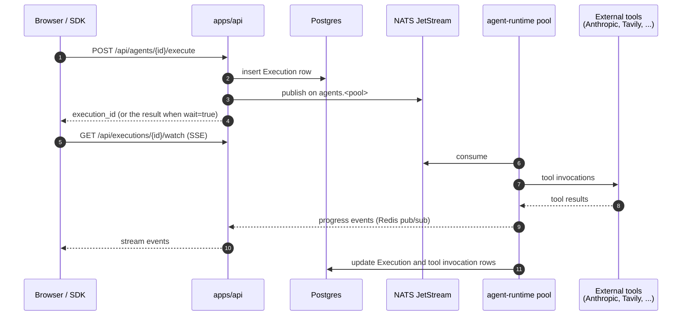
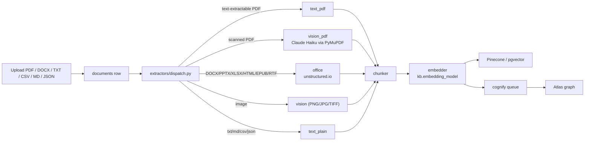

# Architecture

A map of the repo so a new contributor knows where to land. For what the product parts are and how they relate (agents, pipelines, tools, knowledge, decisions, approvals, autonomy, improvements, runs), read [How Abenix fits together](docs/00-how-abenix-fits-together.md) first.

## What ships

Five things ship from this monorepo:

1. **Abenix platform**, the core product. API, web, agent-runtime pools, the Celery worker, warm code runners, edge runtimes.
2. **Standalone apps**, domain UIs that call the platform through the SDK: `contractiq/`, `wingman/`, `industrial-iot/`, `mideasttourism/`, `resolveai/`, `pharmavigil/`, and `claimsiq/` (Java and Vaadin).
3. **SDKs**. `packages/sdk/python/abenix_sdk/` is canonical. `scripts/sync-sdks.sh` copies it into `packages/agent-sdk/` and every Python standalone's `api/sdk/`, and `--check` fails on drift. `packages/sdk/js/` is the TypeScript SDK (`@abenix/sdk`) and `packages/sdk/react/` holds React bindings.
4. **Helm chart**. `infra/helm/abenix/` deploys the platform. Standalone apps deploy from their own `<app>/k8s/` manifests.
5. **The public mirror**. `scripts/publish-public.sh` strips sensitive pieces and rewrites history to the public repo on every release.

## Top-level layout

```
.
├── apps/                      # platform services
│   ├── api/                   # FastAPI, every HTTP route, RBAC, persistence, the scheduler
│   ├── agent-runtime/         # engine/ (executor, pipelines, tools, decisions), consumer.py per pool
│   ├── worker/                # Celery: document processing, cognify, KB re-embed
│   ├── web/                   # Next.js app (Tailwind, framer-motion)
│   ├── code-runner/           # warm runner gateway for code assets
│   ├── edge-runtime/          # Python edge runtime (offline agent execution)
│   ├── edge-runtime-c/        # C edge runtime (constrained devices)
│   └── edge-runtime-rust/     # Rust edge runtime (medium-resource devices)
├── packages/
│   ├── db/                    # SQLAlchemy models, alembic migrations, seeds
│   ├── sdk/                   # python/ (canonical), js/, react/
│   ├── agent-sdk/             # synced copy of the Python SDK
│   ├── mcp-servers/           # MCP servers (BigQuery, Exasol, migration, SQL transform)
│   └── shared/                # shared TypeScript package
├── contractiq/ wingman/ industrial-iot/ mideasttourism/ resolveai/ pharmavigil/ claimsiq/
├── infra/helm/abenix/         # the Helm chart and its values-*.yaml
├── docker/                    # Dockerfile.api, .web, .worker, .agent-runtime, .model-serving
├── scripts/                   # deploy, dev, lint, UAT, load and publish scripts
├── e2e/                       # Playwright specs (uat_*.spec.ts) and fixtures
├── tests/                     # unit/ (CI gate), integration/, load/
└── docs/                      # developer docs, also served in-app at /docs
```

## Request flow, agent execution



Agent code lives in `apps/agent-runtime/engine/`. Tools are registered in `_ensure_tool_classes()` in `engine/agent_executor.py`. Each agent has a `runtime_pool`: `default`, `chat`, `heavy-reasoning` or `long-running` run on their own consumer Deployment so KEDA can scale each one on queue depth, and `inline` runs on the API pod for the lowest streaming latency. Queued runs need NATS JetStream (`scaling.queueBackend: nats`), which `values-local.yaml` and `values-azure.yaml` set. The chart refuses `scaling.execRemote` or pools with the default `celery`, and Celery then only runs document, cognify and KB jobs. With `scaling.execRemote` off every run is inline.

Spend caps sit on the agent row. `daily_cost_limit` and `daily_budget_usd` are checked before any run starts on every path, including a2a and batch, which now write execution rows like every other run, and a refusal is 429 `BUDGET_EXCEEDED`. `per_execution_cost_limit` stops a run when it wants another step after reaching the limit, leaving a `budget_stop` step in the Flight Recorder. A pipeline run's cost is the sum over every step, failed and retried ones included. See [docs/02-runtime/00-agent-execution.md](docs/02-runtime/00-agent-execution.md#spend-caps).

Delivery is at least once. The runtime acks a message only after the run ends and holds a lease on the execution row (`runner_id`, `lease_expires_at`, `delivery_attempts`) while it runs. If the pod dies, another pod reruns the agent from the start once the lease expires, so tool side effects can repeat. After 3 pickups the run fails with `STALE_SWEEP`. The W3C `traceparent` rides in the message and on child-agent calls, so one trace covers API, queue, runtime and child runs. See [docs/02-runtime/08-queue-scaling.md](docs/02-runtime/08-queue-scaling.md#at-least-once-delivery).

Every run carries a risk tier and checks the tenant's kill switches before it starts and at each tool call, see [Governance and risk](#governance-and-risk-25) below.

## Data model — where things live

Everything is tenant-scoped via `tenant_id`. The model lives in [packages/db/models/](packages/db/models/). The notable tables:

| Table | What it holds |
|---|---|
| `tenants` | top of the isolation tree. Tenant-level settings (DLP, retention) live in the JSONB `settings` column, which is `MutableDict`-wrapped |
| `users` | password-auth or SSO. `auth_provider` + `external_id` identifies SSO users |
| `agents` | agent definitions (system prompt, tools, model config, optional DSL) |
| `executions` | one row per run, node-result trace + token + cost accounting |
| `tool_invocations` | one row per tool call inside an execution, the source of audit data |
| `webhooks` | event subscriptions, each a signed webhook or an agent or pipeline to start. Deliveries live in `webhook_deliveries`, pending events in `event_outbox` |
| `api_keys` | `af_*` keys for SDK callers, raw key shown once on create |
| `approvals` | HITL gates with signoff |
| `user_mcp_connections` | per-user MCP servers wired into agents at runtime |
| `code_assets`, `knowledge_collections`, `ml_models` | uploadable artifacts |
| `activity_logs` | append-only audit trail, hash-chained per tenant |
| `decision_models`, `decision_versions`, `decision_tests`, `decision_evaluations`, `reference_sets`, `reference_set_versions` | versioned business rules, golden tests, recorded evaluations and named value lists |
| `eval_suites`, `eval_cases`, `eval_runs`, `eval_results` | evaluation suites and their scored runs |
| `watch_sources`, `source_snapshots`, `source_changes` | Source Watch |
| `risk_policies`, `kill_switches`, `permission_sets`, `permission_assignments`, `execution_config_snapshots` | governance |
| `action_types`, `autonomy_grants`, `autonomy_changes`, `agent_actions` | earned autonomy: what an agent may do, its level per action, level history and the action ledger |
| `feedback`, `lessons`, `lesson_clusters`, `improvement_proposals` | self-improvement: thumbs and corrections, the lessons drawn from them, groups of lessons and the fixes proposed for them |
| `moderation_policies`, `moderation_events`, `moderation_reviews` | moderation: policies, what each check saw, and content held for a person to review |
| `meetings`, `meeting_deferrals`, `persona_items` | meetings the bot joins, questions it handed back, and each user's Persona KB |
| `tenant_tool_credentials`, `platform_settings` | tool configuration saved per tenant, and platform-wide settings including `tool.credential.*` and the marketplace and monetization switches |

## SSO (Google / GitHub / Microsoft)

Both auth paths share `users.id` — the JWT issued at the end is identical. The difference is only how we resolved the user.

Password flow (existing): `/api/auth/register` and `/api/auth/login` in [auth.py](apps/api/app/routers/auth.py). Stores a bcrypt hash in `users.password_hash`.

SSO flow: three endpoints in [sso.py](apps/api/app/routers/sso.py):

1. `GET /api/auth/oidc/providers` — returns the list of providers the SPA should show buttons for (only those with creds in env).
2. `GET /api/auth/oidc/{provider}/start?return_to=/dashboard` — signs a short-lived state JWT (return_to + nonce + provider, 10-min expiry) and 302s to the provider's authorize endpoint.
3. `GET /api/auth/oidc/{provider}/callback?code=...&state=...` — verifies state, exchanges code, fetches userinfo, upserts the user (match by `(auth_provider, external_id)` then by email then new), issues access + refresh tokens, 302s to `${WEB_BASE_URL}/auth/callback#access_token=...&refresh_token=...&return_to=...`. The SPA's [/auth/callback page](apps/web/src/app/auth/callback/page.tsx) stashes the tokens in localStorage and forwards.

State is a signed JWT (HS256, same secret as access tokens) — no Redis needed. The `users.auth_provider` + `users.external_id` columns (added in migration `a7b8c9d0e1f2`) carry the SSO link. The pair is unique-indexed so callback resolves in one query.

Per-provider setup and env vars are in [docs/09-reference/05-sso.md](docs/09-reference/05-sso.md).

## Knowledge — KB, Atlas, PersonaKB (v2.0)

Three linked surfaces, all tenant-scoped and audited, built to index tens of thousands of documents for agents.

### Knowledge Bases (KB)

A KB is one collection of documents, with vectors stored in Pinecone (the default) or pgvector, set per collection by `vector_backend`. Every chunk carries metadata `{tenant_id, kb_id, doc_id, page, chunk_index, char_offset_start, char_offset_end}` so retrieval results can be cited back to the exact source.



Key columns on `documents` (v2.0):

| Column | Role |
|---|---|
| `is_current` | `true` on the newest version only. Search and Cognify use current versions |
| `parent_document_id` | head of the version chain |
| `version_number` | monotonic counter (1, 2, 3, …) |
| `superseded_by` | pointer to the row that replaced this one |
| `cognified_at` | per-doc timestamp for incremental cognify |
| `last_cognify_job_id` | idempotency key for retries |
| `extraction_method` | `text_pdf` / `vision_pdf` / `office` / `text_plain` / `vision_image` |
| `extraction_quality` | 0.0-1.0 inferred from chars-per-page, flag low-quality docs |

Ingest records `extraction_method` and `extraction_quality`, and each chunk keeps its page number. Vision OCR needs PyMuPDF and `ANTHROPIC_API_KEY` on the worker.

Document-level ACL (`document_grants`) is checked before similarity scoring. A document with no grants is visible to everyone who can read the collection. The first grant restricts it to its grantees (users or agents), tenant admins, the collection creator and holders of WRITE or ADMIN on the collection. The document list hides restricted documents too. Only collection editors add or remove grants.

Hybrid retrieval, vector similarity plus graph traversal plus reranker, lives in `apps/agent-runtime/engine/knowledge/hybrid_search.py`. The reranker in `engine/knowledge/reranker.py` runs Cohere `rerank-english-v3.0` when `COHERE_API_KEY` is set, and the Claude Haiku scorer only with `RERANKER_PROVIDER=llm`. Every chunk hit carries `metadata.citation` with `document_id`, `page`, `chunk_index` and character offsets.

Each collection embeds with its own `embedding_model`, one of `text-embedding-3-small`, `text-embedding-3-large` (at 1536 dimensions), `text-embedding-ada-002` or `local-hashing-v1`. `POST /api/knowledge/{kb}/reembed` re-reads and re-chunks every document with the new model, then switches the collection in one step. `GET` on the same path reports progress.

### Atlas — the typed knowledge graph

Atlas lives in **Neo4j** (graph structure) with mirror rows in Postgres (`atlas_graphs`, `atlas_nodes`, `atlas_edges`) for ACL and audit. Five starter ontologies ship in `ATLAS_STARTERS` in `apps/api/app/routers/atlas.py`: FIBO Core, FIX Protocol, EMIR, ISDA, ETRM EOD. A new starter is one more entry in that dict.

**Five agent tools** access Atlas:

| Tool | What it does | When agents pick it |
|---|---|---|
| `atlas_describe` | get a node + 1-hop neighbourhood by name/ID | "tell me what we know about counterparty X" |
| `atlas_query` | typed pattern query against the graph | "find contracts where notional > $50M with >3 unconfirmed trades" |
| `atlas_traverse` | walk N hops along typed edges | "trace the supply chain from raw material to finished product" |
| `atlas_search_grounded` | hybrid keyword + embedding search over node properties | "find the clause about late delivery" |
| `atlas_as_of` *(v2.0)* | the graph as it stood at a past moment, from the newest snapshot at or before it, or the live graph when nothing changed since. Inputs `graph_id`, `as_of`, `label_like`, `kind`, `limit` | "what did the ontology say about counterparties on 2025-01-15?" |

**Bi-temporal columns** (v2.0) on `atlas_nodes` and `atlas_edges`:

- `valid_from` — when the fact became true in the world
- `valid_to` — when it stopped being true (NULL = current)
- `recorded_at` — when we learned it
- `source_anchors` — JSONB array of `[{document_id, page, chunk_id, confidence}, …]` per source

`atlas_as_of` keeps live rows inside their `valid_from` and `valid_to`.

### Cognify — the document → graph pipeline

Stages:
1. **Extractor pool** — text + vision + office adapters (see KB section).
2. **Entity proposer** — LLM-driven against the active ontology, with per-tenant `auto_accept_threshold`.
3. **Relationship proposer** — types edges between proposed entities.
4. **Schema validator** — proposal must conform to the active ontology, else rejected.
5. **Threshold and conflicts** — proposals below `auto_accept_threshold` are left out of the graph and counted in the job report. When sources disagree on an entity's type, `conflict_action` decides, and with `flag` an open row lands in `cognify_conflicts` for `/settings/cognify`. Resolving it writes the chosen type to the graph.
6. **Graph writer** — MERGE-by-canonical-name with the v2 bi-temporal columns set.

**Per-tenant `cognify_configs`**:

| Field | Default | Notes |
|---|---|---|
| `auto_accept_threshold` | 0.85 | proposals below it stay out of the graph |
| `conflict_action` | `flag` | for entity-type disagreements. Also `split`, `lower_conf_wins`, `higher_conf_wins` |
| `max_parallel_docs` | 8 | documents processed at once in a job |
| `daily_budget_usd` | unset | once the tenant's Cognify spend for the UTC day reaches it, jobs stop taking documents |

**Incremental cognify** (v2.0) only fetches `documents` where `cognified_at IS NULL OR updated_at > cognified_at`. Adding 100 new docs to a 10k-doc KB no longer re-processes the entire corpus.

### PersonaKB — per-user memory

Each user owns a ring-fenced KB scoped by `persona_scope`. Stored in `persona_items` with the user_id, scope (`self` / `meeting_<id>` / custom), kind (note / file / meeting_context), and Pinecone vector IDs. Authorization happens at query time via the meeting's `persona_scopes` whitelist — agents can only read scopes they were granted.

v2.0 additions:
- `deleted_at` / `deleted_by` for soft-delete (used by the GDPR cascade).
- `encrypted` + `key_version` for at-rest encryption via `core/crypto.py` (per-tenant DEK derived from cluster KEK `ABENIX_DATA_KEY_KEK_BASE64`).

### GDPR cascade

`POST /api/gdpr/users/{id}/purge` cascades across five stores for a user in the caller's tenant: postgres (persona items soft-deleted, agent memories only for agents the person created, the user row scrubbed, every message in the person's conversations and their conversation titles replaced with `[erased]`, their runs' input, output and traces cleared, audit rows keeping their salted digest with the salt dropped), Pinecone (the person's persona vectors, retried 3 times), Neo4j (Cognify entities naming the person by email, or by full name on person entities, plus their Postgres graph rows), blobs (code asset archives and ML model files the person uploaded and nothing still uses, the person's storage folder, and their cloned voice at the provider), and trajectory memory (records from the person's runs). Every per-store attempt writes a `gdpr_purge_log` row with `affected_count`. `GET /api/gdpr/users/{id}/receipts` exposes the audit trail, and `/settings/gdpr` shows the count as Removed.

### Migration story

`packages/db/bootstrap.py` runs as an init container before the api pod starts:

- **Fresh DB**: detects no tables + no `alembic_version` → `Base.metadata.create_all` + `alembic stamp heads`.
- **Drift recovery**: detects tables exist + no `alembic_version` → `create_all` (adds new tables idempotently) + column-by-column inspector pass that issues `ALTER TABLE ADD COLUMN` for every column the ORM declares that's missing in the live schema → `stamp heads`.
- **Healthy install**: `alembic_version` exists → no-op, then `alembic upgrade head` runs any new migrations.

So `bash scripts/deploy-azure.sh deploy` on a fresh AKS cluster works end-to-end with no manual SQL.

### Source map — knowledge stack

| What | Where |
|---|---|
| KB REST | [`apps/api/app/routers/knowledge.py`](apps/api/app/routers/knowledge.py) (prefix `/api/knowledge-bases`) |
| v2 admin endpoints (versioning, reembed, cognify config, conflicts) | [`apps/api/app/routers/knowledge_v2.py`](apps/api/app/routers/knowledge_v2.py) (prefix `/api/knowledge`) |
| Document grants | [`apps/api/app/routers/document_grants.py`](apps/api/app/routers/document_grants.py) |
| Doc-level ACL pre-filter | [`apps/agent-runtime/engine/knowledge/document_acl.py`](apps/agent-runtime/engine/knowledge/document_acl.py), [`apps/api/app/services/document_access.py`](apps/api/app/services/document_access.py) |
| Atlas REST | [`apps/api/app/routers/atlas.py`](apps/api/app/routers/atlas.py) |
| Cognify REST | [`apps/api/app/routers/knowledge_engine.py`](apps/api/app/routers/knowledge_engine.py) |
| Cognify pipeline | [`apps/agent-runtime/engine/knowledge/cognify_pipeline.py`](apps/agent-runtime/engine/knowledge/cognify_pipeline.py) |
| Extractors | [`apps/agent-runtime/engine/knowledge/extractors/`](apps/agent-runtime/engine/knowledge/extractors/) |
| Reranker + Citation | [`apps/agent-runtime/engine/knowledge/reranker.py`](apps/agent-runtime/engine/knowledge/reranker.py) |
| GDPR | [`apps/api/app/services/gdpr_purge.py`](apps/api/app/services/gdpr_purge.py), [`apps/api/app/routers/gdpr.py`](apps/api/app/routers/gdpr.py) |
| Persona | [`apps/api/app/routers/persona.py`](apps/api/app/routers/persona.py) |
| Crypto | [`apps/api/app/core/crypto.py`](apps/api/app/core/crypto.py) |
| Atlas tools (incl. as_of) | [`apps/agent-runtime/engine/tools/atlas_tools.py`](apps/agent-runtime/engine/tools/atlas_tools.py) |
| KB re-embed worker | [`apps/worker/worker/tasks/kb_reembed.py`](apps/worker/worker/tasks/kb_reembed.py) |
| Pinecone vacuum worker, queued daily at 02:30 UTC | [`apps/worker/worker/tasks/pinecone_vacuum.py`](apps/worker/worker/tasks/pinecone_vacuum.py) |
| Embedding models | [`packages/db/embedding_models.py`](packages/db/embedding_models.py) |
| Bootstrap (drift recovery) | [`packages/db/bootstrap.py`](packages/db/bootstrap.py) |
| db-migrate init container | [`infra/helm/api/templates/deployment.yaml`](infra/helm/api/templates/deployment.yaml) |
| Models | [`packages/db/models/knowledge_base.py`](packages/db/models/knowledge_base.py), [`atlas.py`](packages/db/models/atlas.py), [`meeting.py`](packages/db/models/meeting.py) (PersonaItem), [`document_grant.py`](packages/db/models/document_grant.py), [`cognify_config.py`](packages/db/models/cognify_config.py), [`gdpr_purge_log.py`](packages/db/models/gdpr_purge_log.py) |
| Full v2 reference doc | [`docs/02-runtime/15-v2-knowledge-enterprise.md`](docs/02-runtime/15-v2-knowledge-enterprise.md) |
| User-facing versioning explainer | [`docs/document-versioning.md`](docs/document-versioning.md) |

## Rules, governance and the 2.5 surfaces

### Decisions

Versioned business rules evaluated by the ZEN engine, so the same facts and version always give the same answer with a trace. Each version applies over a period and can be asked as of any date and as known on any date. Drafts go through check, propose, sign-off by risk tier and publish. Agents and pipelines call them through the `decision_*` tools, apps through `forge.decisions`. Evaluation is stateless in every API pod, compiled decisions are cached by content hash and publishing tells every pod over Redis. See [docs/08-howto/09-decisions.md](docs/08-howto/09-decisions.md).

### Governance and risk (2.5)

Every agent, pipeline, tool, decision, source and code asset has a risk tier, `low` to `critical`. Each tenant has a policy per tier (sign-offs, what happens when a run calls a tool above its tier, allowed models, whether an output schema and passing evaluation suites are required). Kill switches stop a scope or one target, and runtime pods pick them up within five seconds. Capabilities such as `killswitch.manage` come from role defaults plus permission sets. The activity log is hash-chained and verified nightly, and each run records the configuration it ran with so it can be replayed. Code is in `apps/api/app/routers/governance.py`, `apps/api/app/core/capabilities.py`, `apps/agent-runtime/engine/risk.py` and `engine/governance.py`. See [docs/01-architecture/07-governance.md](docs/01-architecture/07-governance.md) and [docs/08-howto/11-governance.md](docs/08-howto/11-governance.md).

### Evaluation suites

Golden cases with assertions, run through the agent's normal execute path inside the API, scored, compared run to run, and used as a publish gate for tiers whose policy requires it. Code is in `apps/api/app/routers/evals.py` and `apps/api/app/services/eval_*.py`. See [docs/08-howto/10-evals.md](docs/08-howto/10-evals.md).

### Source Watch and events

The API scheduler checks due sources every 30 seconds, keeps immutable snapshots and records changes. Changes, decision versions, approvals, kill switches, finished runs and finished eval runs are written to `event_outbox` in the same transaction as the change. A dispatcher job every two seconds fans them out to subscriptions and delivers HMAC-signed webhooks (`X-Abenix-Signature`) or starts an agent or pipeline, with retries and a dead state. See [docs/08-howto/12-source-watch-and-events.md](docs/08-howto/12-source-watch-and-events.md).

### Warm code runners

A `code_asset` call can run in a warm pod that holds one tenant's build of one asset version, called over NATS request and reply, instead of a one-off Job. `CODE_RUNNER_MODE` picks `auto`, `warm` or `job`. The gateway is `apps/code-runner/`, the controller `apps/agent-runtime/engine/code_runners.py`, the chart values `codeRunners.*`. See [docs/02-runtime/16-warm-code-runners.md](docs/02-runtime/16-warm-code-runners.md).

### Earned autonomy

An agent earns the right to act on its own one kind of action at a time. Each action type has five levels: Off, Watching, Asks first, Acts within limits, Acts and reports. Every call is scored in the `agent_actions` ledger. Promotion needs a person who did not build the agent and goes through **Approvals**, demotion is automatic when the record slips. Code is in `apps/api/app/routers/autonomy.py`, `apps/api/app/services/autonomy.py` and `apps/agent-runtime/engine/autonomy.py`. See [docs/02-runtime/21-earned-autonomy.md](docs/02-runtime/21-earned-autonomy.md) and [docs/08-howto/13-earned-autonomy.md](docs/08-howto/13-earned-autonomy.md).

### Lessons and governed self-improvement

Thumbs down with a correction, failed runs, rejected or edited actions and harm flags become lessons. Similar lessons are grouped and each group suggests test cases. A group can get one proposed fix, which is proven offline against the agent's own tests and history, approved by a person, released as a new revision and watched against the old one. Worse means an automatic rollback with the reason. Code is in `apps/api/app/services/lessons.py`, `apps/api/app/services/improvements.py` and the `lessons` and `improvements_proposals` routers. See [docs/02-runtime/22-lessons-and-improvements.md](docs/02-runtime/22-lessons-and-improvements.md) and [docs/02-runtime/23-governed-self-improvement.md](docs/02-runtime/23-governed-self-improvement.md).

### Wayfinding: Start here, Needs you, Essentials

The web app keeps a new person oriented. **Start here** on the dashboard is a role checklist from `GET /api/me/journey` (`journey.py`). **Needs you** (`/inbox`) counts everything waiting on the person from `GET /api/me/inbox-counts` (`inbox.py`). The sidebar starts in **Essentials** and saves the choice through `/api/me/ui-prefs`. Every page opens with `PageHeader` (purpose, primary action, How this works, Docs link) and shows `NextSteps` after a success. `e2e/uat_lostness_gate.spec.ts` and `e2e/uat_first_use_tasks.spec.ts` hold the line. See [docs/05-ui/00-app-shell.md](docs/05-ui/00-app-shell.md).

### Tool configuration

A tool declares the keys it needs as `config_fields` and reads them through `self.cfg()`. Values resolve from a tenant value, a platform value, the environment, `packages/db/seeds/tool_defaults.yaml`, then the declared default. **Admin -> Tool Configuration** is generated from the declarations, and `scripts/check-tool-config.py` keeps tools honest in CI. See [docs/08-howto/08-tool-configuration.md](docs/08-howto/08-tool-configuration.md).

## Routers — where each feature lives

| Feature | File |
|---|---|
| Email+password auth | [apps/api/app/routers/auth.py](apps/api/app/routers/auth.py) |
| SSO (Google/GitHub/Microsoft) | [apps/api/app/routers/sso.py](apps/api/app/routers/sso.py) |
| Agent CRUD + execute | [apps/api/app/routers/agents.py](apps/api/app/routers/agents.py) |
| Pipeline DSL run | [apps/api/app/routers/pipelines.py](apps/api/app/routers/pipelines.py) |
| Knowledge bases | [apps/api/app/routers/knowledge.py](apps/api/app/routers/knowledge.py) |
| ML models | [apps/api/app/routers/ml_models.py](apps/api/app/routers/ml_models.py) |
| Code assets | [apps/api/app/routers/code_assets.py](apps/api/app/routers/code_assets.py) |
| MCP connect + install | [apps/api/app/routers/mcp.py](apps/api/app/routers/mcp.py) |
| Event subscriptions and webhooks | [apps/api/app/routers/webhook_config.py](apps/api/app/routers/webhook_config.py) |
| Decisions and reference sets | [apps/api/app/routers/decisions.py](apps/api/app/routers/decisions.py) |
| Governance (risk, kill switches, permission sets, audit) | [apps/api/app/routers/governance.py](apps/api/app/routers/governance.py) |
| Evaluation suites | [apps/api/app/routers/evals.py](apps/api/app/routers/evals.py) |
| Source Watch | [apps/api/app/routers/sources.py](apps/api/app/routers/sources.py) |
| Tool configuration (admin) | [apps/api/app/routers/admin_tool_config.py](apps/api/app/routers/admin_tool_config.py) |
| Approvals (HITL) | [apps/api/app/routers/approvals.py](apps/api/app/routers/approvals.py) |
| Edge | [apps/api/app/routers/edge.py](apps/api/app/routers/edge.py) |
| Tools registry | [apps/api/app/routers/tools.py](apps/api/app/routers/tools.py) |
| Tool runtime invoke | [apps/api/app/routers/tool_runtime.py](apps/api/app/routers/tool_runtime.py) |
| Tenant settings (DLP, retention, sandbox) | [apps/api/app/routers/settings.py](apps/api/app/routers/settings.py) |
| Earned autonomy | [apps/api/app/routers/autonomy.py](apps/api/app/routers/autonomy.py) |
| Feedback and lessons | [apps/api/app/routers/lessons.py](apps/api/app/routers/lessons.py) |
| Improvement proposals | [apps/api/app/routers/improvements_proposals.py](apps/api/app/routers/improvements_proposals.py) |
| Needs you counts and sidebar mode | [apps/api/app/routers/inbox.py](apps/api/app/routers/inbox.py) |
| Start here journey | [apps/api/app/routers/journey.py](apps/api/app/routers/journey.py) |
| Moderation policies and held content | [apps/api/app/routers/moderation.py](apps/api/app/routers/moderation.py) |
| Marketplace | [apps/api/app/routers/marketplace.py](apps/api/app/routers/marketplace.py) |
| Marketplace and monetization switches | [apps/api/app/routers/platform_features.py](apps/api/app/routers/platform_features.py) |
| Meetings | [apps/api/app/routers/meetings.py](apps/api/app/routers/meetings.py) |
| Connectors | [apps/api/app/routers/connectors.py](apps/api/app/routers/connectors.py) |
| Cluster view | [apps/api/app/routers/admin_cluster.py](apps/api/app/routers/admin_cluster.py) |

## How to add a new...

**A new tool**: one Python file under `apps/agent-runtime/engine/tools/`. Inherit from `BaseTool`, set `name`, `description`, `input_schema`, `risk_tier` and any `config_fields`, and register it in `_ensure_tool_classes()` in `engine/agent_executor.py`. It then shows up in the registry, the builder palette, `/api/tools` and, if it declares keys, **Admin -> Tool Configuration**. Walkthrough in [docs/08-howto/01-add-a-tool.md](docs/08-howto/01-add-a-tool.md).

**A new LLM provider**: subclass `LLMProvider` in [apps/agent-runtime/engine/llm_router.py](apps/agent-runtime/engine/llm_router.py), next to `AnthropicProvider`, `OpenAIProvider`, `GoogleProvider` and `AzureOpenAIProvider`, and declare its key in `PROVIDER_CONFIG_FIELDS` in `engine/provider_credentials.py` so it appears on the Tool Configuration screen.

**A new endpoint**: create the router under `apps/api/app/routers/`, register it in `apps/api/app/main.py`. Return `success()` / `error()` from `app.core.responses` so the envelope is consistent. Gate it with `require_capability("<key>")` from `app.core.capabilities` when it belongs to a capability. Add at least one test in `tests/unit/`.

**A new standalone app**: copy an existing one (`wingman/` is the cleanest reference), point its SDK client at the platform with an API URL and key from its environment, add its manifest under `<app>/k8s/`, and add it to `APP_REGISTRY` in `scripts/lib/select-apps.sh` so `dev-local.sh` and `deploy.sh` offer it.

## Build + deploy — the part that bites new contributors

- **Image tags are derived from the git commit SHA**, `IMAGE_TAG` defaults to `git rev-parse --short HEAD`. The Helm chart pins a single tag per image across all deployments using that image.
- **`scripts/deploy-azure.sh build --only=<service>` rewrites the helm template** to the latest SHA for ALL deployments — not just the one you built. This is the [`--only` trap](docs/06-deployment/deploy-only-trap.md): if you build only `api`, helm still rewrites `agent-runtime` and `worker` deployments to a tag that doesn't exist, and those pods go ImagePullBackOff while the old replicas keep serving.
- **Recovery**: rebuild the missing services with the current SHA, or `kubectl set image deploy/X ...` back to the last known good tag, or `helm rollback`.
- **The safe pattern**: `bash scripts/deploy-azure.sh redeploy` with no `--only`, which builds every image and lands schemas, seeds and helm together.

## Tests

- `tests/unit/` is pure Python with no live services and gates CI, along with `apps/agent-runtime/tests/` and the lint scripts (`lint-agent-seeds.py`, `check-tool-config.py`, `gen-tool-docs.py --check` and others).
- `e2e/` holds 89 `uat_*.spec.ts` Playwright specs that run against a local stack or a deployed cluster. `scripts/uat.sh` runs the 13 that form the deploy gate. `uat_lostness_gate` and `uat_first_use_tasks` are the wayfinding release gate, run by hand before a release.
- `apps/api/tests/` needs a reachable Postgres, `tests/integration/` needs a running API and `ABENIX_INTEGRATION=1`.

Details, env vars and the CI matrix are in [docs/08-howto/05-testing.md](docs/08-howto/05-testing.md).

## Where to start as a new contributor

1. Read [How Abenix fits together](docs/00-how-abenix-fits-together.md), then this file.
2. Read [CONTRIBUTING.md](CONTRIBUTING.md) for the contribution mechanics.
3. Read [ONBOARDING.md](ONBOARDING.md) for the 30-minute local setup.
4. Look at a recent PR that touched code near what you want to change — git blame is the cheapest way to learn local conventions.
5. Open a draft PR early and ask in the description what feedback you want.
