<p align="center">
  
</p>

<h1 align="center">Abenix</h1>

<h3 align="center">The open-source AI agent platform that thinks in graphs, not chunks.</h3>

<p align="center">
  <a href="#-quick-start"><strong>Quick start</strong></a> &nbsp;·&nbsp;
  <a href="#-what-makes-abenix-different"><strong>Why Abenix</strong></a> &nbsp;·&nbsp;
  <a href="#%EF%B8%8F-architecture"><strong>Architecture</strong></a> &nbsp;·&nbsp;
  <a href="#-deploy-anywhere"><strong>Deploy</strong></a> &nbsp;·&nbsp;
  <a href="#-contributing"><strong>Contribute</strong></a>
</p>

<p align="center">
  <a href="LICENSE"></a>
  
  
  
  
</p>

---

## TL;DR

Most AI agent platforms give your agents amnesia — they retrieve documents, forget context, and re-derive the world model on every turn.

**Abenix gives them a brain.** A typed graph that lives next to your knowledge base, agents that traverse it like a researcher follows citations, and a canvas where humans and agents shape it together.

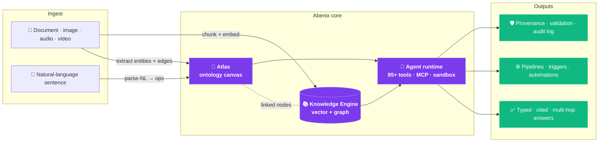

<p align="center">
  
  <br/><em>The Abenix Dashboard — agents, executions, cost, and observability in one place</em>
</p>

> **Mostly Enterprise-ready.(Littlebit workin progress)** Multi-tenant by design with hard SQL-level isolation. RBAC + per-resource sharing + actAs delegation for SaaS multiplexing. SHA-256-hashed API keys with per-key scopes + revocation. Pre-/post-LLM moderation with DLP redaction. Per-tenant + per-user budget caps. GDPR-friendly retention with hard purge. SOC 2 telemetry stack pre-wired (Prometheus + Grafana + structured failure codes + Slack/email fan-out). Helm chart deploys to AKS + minikube today (single chart; the same chart runs on EKS / GKE with a values override — not bundled as scripts yet).

---

## 🥊 How is this different from n8n / Zapier / LangChain?

Short answer: **n8n is a an advanced workflow tool with agents in the mix that learned to call an LLM. Abenix is a platform whose smallest unit is an agent.** Striving to keep the changes of every layer underneath — the runtime, the knowledge model, the failure model, the deployment shape.

n8n / Zapier / LangChain are excellent at what they were built for. n8n's 400+ pre-built integrations and visual editor will beat Abenix any day for *"when a Salesforce row changes, drop a Slack message and update HubSpot"*. LangChain's library catalog is unmatched for one-off Python research scripts. Zapier's SaaS catalog is the broadest in the industry. Use them when the problem is integration-shaped.

**Abenix earns its place when the problem is agent-shaped** — long-running reasoning, shared knowledge, real tenant isolation, audit-grade traceability, and a runtime you actually run inside your own cluster. Five honest points where Abenix is built for that and the others aren't:

#### 1. The unit of deployment is an agent, not a workflow

In n8n, an LLM is one node among hundreds, the workflow is the deployable. In Abenix, every agent is a typed entity with its own system prompt, model config, tool grants, RBAC scopes, **its own pod pool, its own KEDA scaler, its own queue, its own budget cap, its own telemetry channel**. Want a heavy-reasoning agent on using Gemini model with 5-minute timeouts and a $50/day cap, while your chat agent runs on Anthropic model with 4 replicas? That's two checkboxes — see [`infra/helm/abenix/templates/agent-runtime-pools.yaml`](infra/helm/abenix/templates/agent-runtime-pools.yaml) and [`/admin/scaling`](apps/web/src/app/(app)/admin/scaling/page.tsx). The economics of agentic workloads (bursty, expensive, occasionally hours-long) need primitives sized for them, "another node in a workflow" is the wrong primitive.

#### 2. Knowledge is a graph + KB merged, not a vector store you bolt on

The standard playbook for n8n + LangChain agents is: pick a vector DB (Pinecone, Weaviate, Chroma), embed your docs, hope cosine similarity finds the right chunk. Abenix ships [Atlas](apps/web/src/app/(app)/atlas/page.tsx) — a unified ontology canvas where concepts, instances, relations and the underlying KB live in the same data plane. Agents have four typed tools (`atlas_describe`, `atlas_query`, `atlas_traverse`, `atlas_search_grounded`) so they can answer *"every supplier within two hops of contract X that breached SLA last quarter"* by **graph traversal**, not vector lottery. Postgres + Neo4j, no extra vector DB to operate.

#### 3. Multi-tenancy is real, not "run another instance"

n8n self-hosted is one workspace per process — multi-customer SaaS means N copies of n8n. Abenix has `tenant_id` on every row, signup auto-creates a tenant, per-user quotas, per-feature flags, [`ResourceShare`](packages/db/models/resource_share.py) for cross-tenant grants, and [`actAs` delegation](packages/db/models/subject_policy.py) so a downstream app (e.g. the example app) can call Abenix on behalf of *its* end users without leaking tenant boundaries. Five real apps in this repo — the example app, Saudi Tourism, Industrial-IoT, ResolveAI, ClaimsIQ — ship on top of this exact path. It's not whiteboard-ware.

#### 4. Failures are first-class — self-healing pipelines + a typed workflow shell

In n8n, when a node fails, the workflow stops and you read a log. Abenix pipelines capture a **structured failure diff** and the [Pipeline Surgeon](apps/api/app/routers/pipeline_healing.py) — a dedicated agent — proposes a JSON-Patch (RFC 6902) fix you can review, apply, or reject from the [`/agents/{id}/healing`](apps/web/src/app/(app)/agents/[id]/healing/page.tsx) page. Failures across all runs surface in [`/executions`](apps/web/src/app/(app)/executions/page.tsx) with stable `failure_code` badges (`LLM_RATE_LIMIT`, `SANDBOX_TIMEOUT`, `BUDGET_EXCEEDED`, `MODERATION_BLOCKED`, …) so the operator sees patterns instead of noise. On top sits a [workflow shell REPL](apps/web/src/app/(app)/agents/[id]/shell/page.tsx) — a typed verb grammar driven by a live verb registry (`help`, `show workflow`, `show runs`, plus mutating verbs that draft a Healing patch instead of editing the DSL directly). Think "kubectl for pipelines" instead of "open the editor and click around."

#### 5. The deployment artifact is a single Helm chart with observability inside

n8n + LangChain leave production hardening to you: pick a vector DB, pick a queue, pick a metrics stack, pick an alerting fan-out, pick an autoscaler, glue it all together. Abenix's [`infra/helm/abenix`](infra/helm/abenix/) chart deploys api + web + workers + per-agent-pool runtimes + Postgres + Redis + Neo4j + NATS + KEDA + Prometheus + Grafana + ingress, in one `helm install`. Every pod exposes `/metrics`. The [`/alerts`](apps/web/src/app/(app)/alerts/page.tsx) page groups failures by `failure_code` so the operator sees patterns, not noise. Slack webhook fan-out works out of the box; SMTP fan-out + the `email_sender` agent tool require `SMTP_HOST/PORT/USER/PASS/FROM` env vars on the runtime pods (no admin UI yet). Reference deploys today: [`scripts/deploy-azure.sh`](scripts/deploy-azure.sh) (AKS) and [`scripts/deploy.sh`](scripts/deploy.sh) (minikube). The same chart runs on EKS/GKE with a values override; bundled deploy scripts for those are on the roadmap.

**TL;DR:** if you'd describe your problem as *"chain these APIs together with 1 or more LLM step,"* use n8n. If you'd describe it as *"agents that share knowledge, scale per-pool, isolate by tenant, and ship as a self-hostable platform,"* maybe you can give this a try.

---

## ⚡ Quick start

Pick the path that matches what you want to do:

| Goal | Command |
|---|---|
| **Localhost in ~60 s** — docker-compose for Postgres / Redis / Neo4j / NATS, then npm dev for api + web + agent runtime | `bash scripts/dev-local.sh` |
| **Production-shape on your laptop** — full Helm chart on a local minikube cluster | `bash scripts/deploy.sh local` |
| **Minikube fast-demo** — auto-starts minikube and forwards every service to localhost | `bash scripts/dev-minikube.sh` |
| **AKS (Azure)** — provisions RG + ACR + AKS, builds + pushes images, helm-installs the stack, runs migrations + seeds | `bash scripts/deploy-azure.sh all` |
| **AKS port-forwards** — bring an already-deployed AKS cluster to `localhost:*` (firewall-safe) | `bash scripts/portforward-azure.sh` |

```bash
git clone https://github.com/sarkar4777/abenix.git
cd abenix
cp .env.example .env       # local-dev defaults; fill in LLM keys (Anthropic / OpenAI / Google)
bash scripts/dev-local.sh
```

Open http://localhost:3000 and sign in as `admin@abenix.dev` / `Admin123456`.

The shipped [`.env.example`](.env.example) documents every env var the platform reads — Postgres / Redis / Neo4j / NATS connection strings (with sensible local-dev defaults), CORS origins, LLM provider keys, Stripe (optional), object storage (S3 or Azure Blob), search providers (Tavily / Brave / SerpAPI / Serper), tool-specific keys (FRED, Alpha Vantage, ENTSO-E, EIA, NewsAPI, Mediastack), and the `SMTP_*` block that powers the `email_sender` agent tool. For Kubernetes deploys, set the same keys in [`infra/helm/abenix/values-*.yaml`](infra/helm/abenix/) under `secrets:` and `configMap:`.

---

## ✨ What makes Abenix different

Five things you won't find together anywhere else.

### 1. Atlas — the unified ontology + knowledge-base canvas

<p align="center">
  
</p>

Every other ontology tool (Protégé, Stardog, Neo4j Bloom, Tana) treats the schema and the documents as separate artefacts. Atlas collapses them. **One canvas. Documents are nodes. Concepts are nodes. Edges are first-class.** Agents read the graph; they don't grep paragraphs.

Five mechanics no competitor combines:
- **Drop a document** → multimodal extraction (PDF / image / audio / video / DOCX / text) proposes nodes + edges with confidence scores
- **Type a sentence** → "Counterparty has many Trades" parses into structured ops with cardinality inference
- **Ghost-cursor agent** → flags missing inverses, possible duplicates, orphan concepts in real time
- **Time slider** → every save snapshots the entire graph; one-click restore
- **Live KB binding** → bind a concept to a knowledge collection; the right-rail "Instances" lens shows live document rows

Five curated starter ontologies ship in the box: **FIBO Core**, **FIX Protocol**, **EMIR Reporting**, **ISDA Master Agreement**, **ETRM EOD**. Drag in to bootstrap a financial domain in 5 minutes.

<p align="center">
  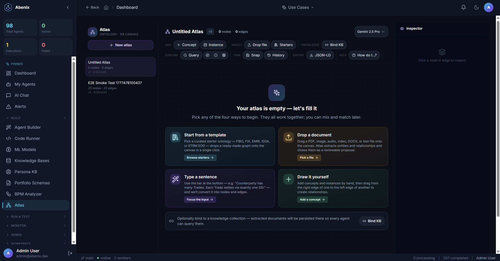
  <br/><em>Brand-new atlas — four concrete ways to begin, plus optional KB binding</em>
</p>

### 2. Knowledge Engine — graph-aware retrieval, not just vectors

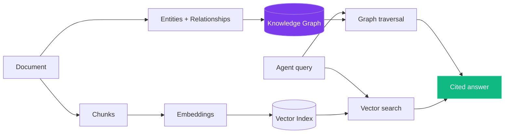

Upload your documents. Abenix doesn't just chunk and embed them — it reads them, extracts every person, company, concept, and technology, maps how they relate, and builds a **knowledge graph** that your agents traverse like citations.

| Question | Vanilla RAG | Abenix |
|---|---|---|
| "What caused the Q3 revenue drop?" | 3 similar paragraphs | `Q3 Report → mentions → supply chain delays → CAUSED_BY → chip shortage → AFFECTED → production` |
| "Find counterparties with > 5 unconfirmed trades in 7 days" | Cosine miss | Pattern walk over the typed graph, structured rows back |
| "Why is this contract risky?" | Generic clause text | Path from clause → similar past clauses → flagged outcomes |

Token cost typically drops **5–10×** because agents read curated evidence, not noisy near-neighbours.

<p align="center">
  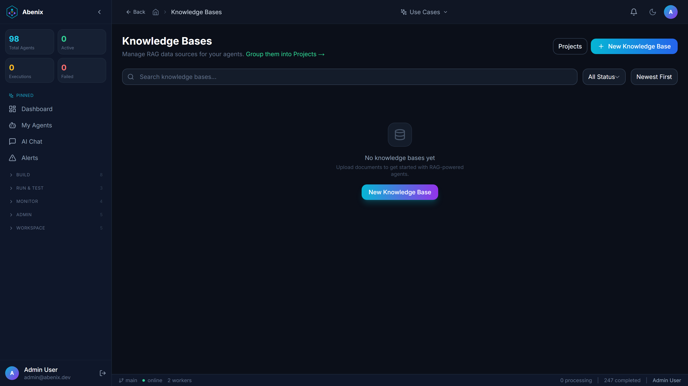
</p>

### 3. Pipelines + 85+ built-in tools

<p align="center">
  
  <br/><em>Visual pipeline builder — drag-and-drop agents, tools, knowledge bases, switch nodes, loops, and sandboxed code-assets.</em>
</p>

A pipeline is a DAG of agents and tools wired up in the visual builder. Switch nodes branch on output. Loop nodes iterate. Code-asset nodes execute sandboxed Python / Node / Go / Rust / Java / Ruby. Every step gets logged, metered, and replayable.

**Real example — a multi-agent contract triage pipeline:**

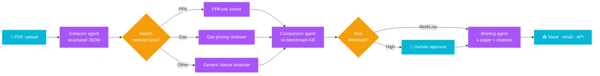

Six agents, two switch nodes, one human-in-the-loop gate, structured JSON between every stage, every step replayable from the Executions page. Built in the visual canvas; runs on the same NATS-routed pool that handles your other agents.

<p align="center">
  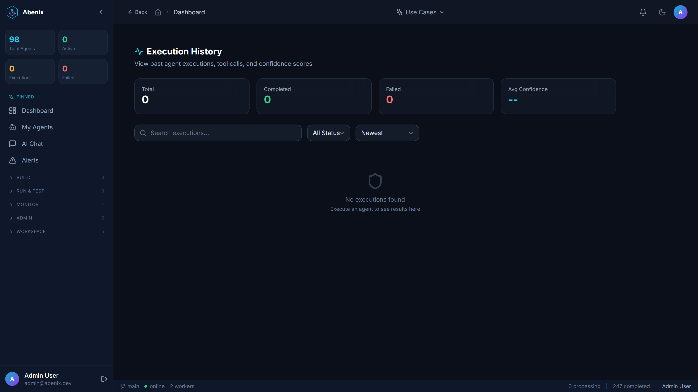
  <br/><em>Pipeline execution detail — per-step duration, tokens, cost, switch-branch chosen, every input + output captured.</em>
</p>

Built-in tools, no install required:

- **Web** — search, scrape, structured extraction
- **Knowledge** — search, ingest, graph-walk
- **Code** — execute, file-system, package install
- **Data** — Postgres, S3, JSON, CSV, Parquet
- **Comms** — Slack, email, webhook
- **Productivity** — Linear, Jira, Notion, GitHub
- **Vision + audio** — image analysis, transcription
- **MCP** — connect any external Model Context Protocol server

…and more. See the [tool catalogue](apps/agent-runtime/engine/tools/) for the full list.

### 4. Multimodal end-to-end

<p align="center">
  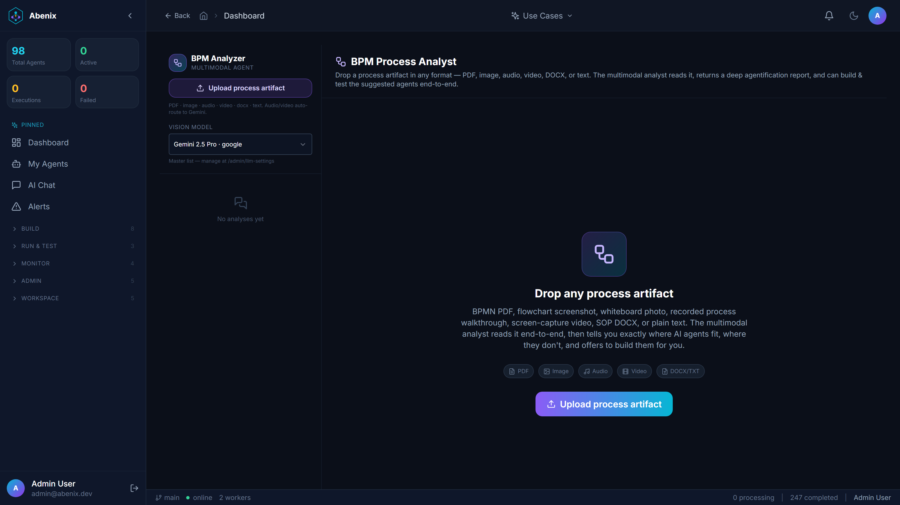
</p>

Drop a **PDF**, **image**, **audio recording**, **video walkthrough**, **DOCX**, or **text file** anywhere Abenix accepts uploads. The platform routes the modality to the right provider:

- Images and PDFs → any vision model (Claude / Gemini / GPT-4o)
- Audio and video → Gemini (auto-routed even if the user picked a different model)
- DOCX and text → extracted to text, embedded in the prompt

The **BPM Analyzer** demonstrates this end-to-end: drop any process artefact, get a multi-page agentification report with markdown tables and a one-click "Build Agents" wizard that generates synthetic test data, creates draft agents, and smoke-tests them in front of you.

### 5. Self-healing pipelines — they fix themselves

Every other workflow tool fails when an upstream API renames a field, a regex stops matching, or a model output shape drifts. Abenix captures a structured failure-diff on every node crash and proposes a JSON-Patch (RFC 6902) that fixes the pipeline DSL.

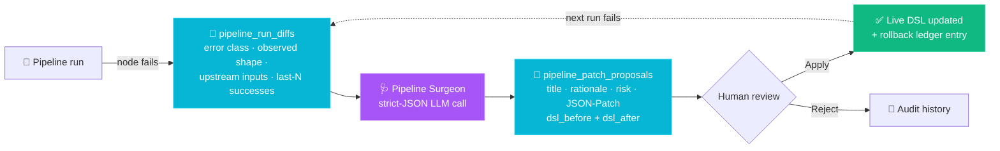

The Surgeon writes minimal patches — typically one or two ops: a fallback default for a missing field, an `on_error: continue` on a non-critical step, or a defensive `coerce-shape` node before the failing one. Patches **never apply automatically**; every change is human-approved with one-click rollback to `dsl_before`.

A few real shapes the Surgeon handles well:
- `KeyError: 'counterparty'` after an upstream extractor changes its schema → "add fallback default"
- A switch node never matches because the classifier model started returning `Unknown` → "add catch-all branch"
- An external HTTP node times out 8 of 10 runs → "set `on_error: continue` and route through the error branch"

Configurable model under **Admin → Settings → `pipeline_surgeon.model`** so the same governance surface applies to every LLM-using primitive in Abenix.

### 6. Talk-to-workflow shell — drive pipelines by typing

Most platforms make you click through a canvas to inspect, mutate, or replay a pipeline. Abenix gives you a typed verb grammar — over 30 verbs across five intents — and a REPL that runs every change through the same JSON-Patch + audit + rollback machinery as the Surgeon.

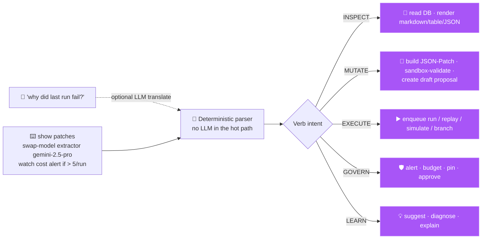

**The grammar at a glance:**

| Intent | Verbs | What they do |
|---|---|---|
| INSPECT | `show`, `describe`, `diff`, `why`, `list` | Read the workflow object — DSL, runs, failures, costs, schedule, patches, history. |
| MUTATE | `add`, `remove`, `rename`, `set`, `swap-model`, `add-fallback`, `attach` | Compile to JSON-Patch ops. Always create a draft proposal — never live-edit. |
| EXECUTE | `run`, `replay`, `simulate`, `branch`, `merge`, `rollback` | Drive runs. `simulate` is idempotent (dry-run, no external side-effects); `branch` creates a sandbox version. |
| GOVERN | `watch`, `budget`, `pin`, `unpin`, `approve`, `reject` | Alert thresholds, budgets, model pins, patch decisions. |
| LEARN | `suggest`, `diagnose`, `explain`, `help` | Ask the shell for ideas, run the Surgeon, explain costs/latency/routing. |

```bash
# A few real one-liners
> show failures
> diff last last-2
> why last
> swap-model extractor gemini-2.5-pro       # → draft patch, awaits approval
> add-fallback extractor counterparty UNKNOWN
> watch cost alert if > 5/run
> simulate fixture:weekend-batch
```

Tab completion comes from the live verb registry. Up/down recalls history. Mutating verbs draft a `pipeline_patch_proposal` you Apply or Reject from the Healing tab — same ledger, same rollback semantics. Configurable model under `workflow_shell.model` (only used to translate freeform NL into a verb invocation; the parser itself is deterministic).

### 7. Per-agent pod scaling — opt-in dedicated runtime

Most of your agents are network-bound on the LLM API and run beautifully on a shared pool. But for the long tail — a noisy extraction agent, a finetuned model with a 4 GB checkpoint, an agent that needs the Murex SDK, or one with strict tenant-isolation needs — you want its own pod.

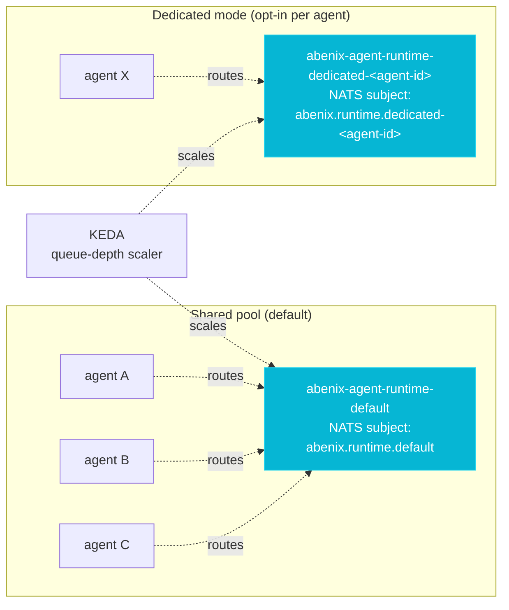

Toggle is a single field `agents.dedicated_mode` and a one-click button on `/admin/scaling`:

| Field | Effect |
|---|---|
| `dedicated_mode = false` (default) | Routes through the shared pool named in `runtime_pool` (`default`, `chat`, `heavy-reasoning`, `gpu`, `long-running`, `inline`). |
| `dedicated_mode = true` | Routes through `dedicated-<agent-id>` — its own NATS subject, its own Deployment, its own KEDA ScaledObject keyed off its own queue depth. |

A cost projection endpoint (`GET /api/admin/scaling/agents/{id}/cost-projection`) returns three scenarios (shared / dedicated / peak) computed from the trailing-24h execution rate × per-run avg cost × replica count, plus an explicit infra baseline — so you can see what flipping the toggle costs *before* you flip it.

When **not** to flip it on:
- Stateless LLM-API callers — 200 in one pod scale identically to 200 in 200 pods at much higher control-plane overhead.
- Agents that finish in under 2 seconds — the shared `chat` pool is already kept warm for them.

When to flip it on:
- Noisy-neighbour isolation (a runaway extraction agent must not slow chat down).
- Per-agent resource limits (memory, GPU, custom node pools).
- Distinct image dependencies (proprietary SDKs, region-specific binaries).
- Cleaner reasoning — `kubectl top` per-agent.

### 9. Self-hostable, fully open

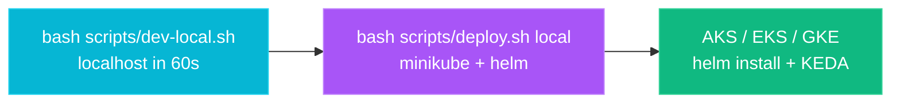

One codebase. One Docker stack. Zero vendor lock-in. The same Helm chart runs on minikube, AKS, EKS, or GKE. Bring your own LLM keys (or run a local model via the MCP integration).

---

## 🏗️ Architecture

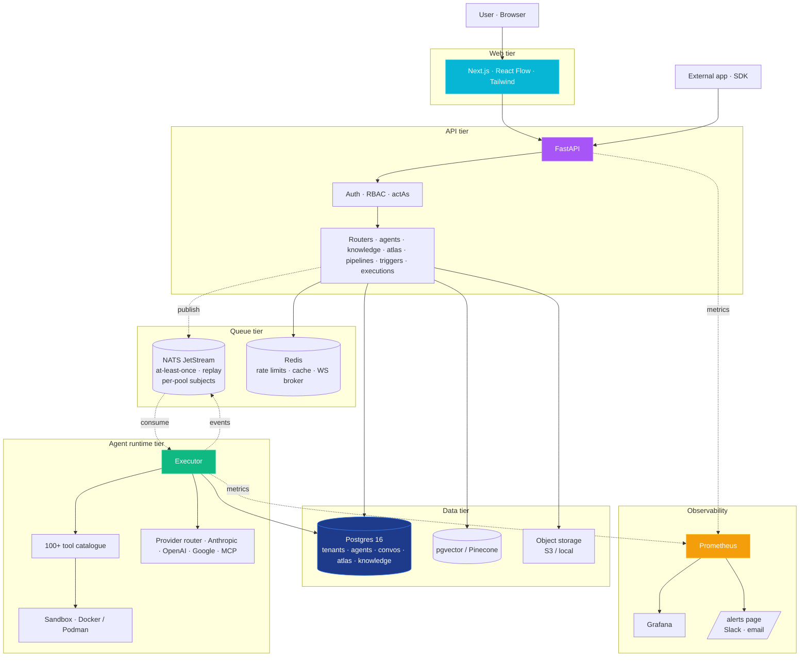

Three independently scalable tiers, one shared Postgres. The agent runtime can scale horizontally per agent type (chat / default / long-running / heavy-reasoning pools) via KEDA queue-depth scaling.

---

## 📈 Scaling — NATS-routed runtime pools

The default Helm chart deploys an **`abenix-nats`** StatefulSet alongside the API + runtime. Production traffic flows API → NATS → runtime; the API never executes agent code itself when `RUNTIME_MODE=remote`.

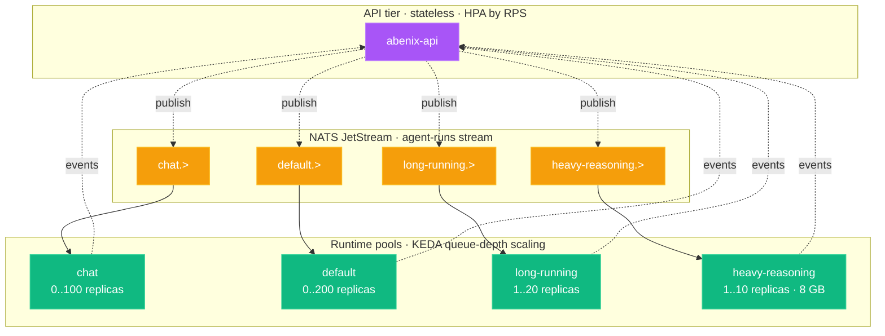

**Why NATS over Redis lists:**
- **At-least-once delivery** — runtime pod crashes mid-execution → NATS redelivers → another pod retries. No work loss.
- **Replay** — re-stream a window of executions to a debug consumer without re-running them.
- **Per-pool subjects** — each pool consumes its own subject with its own ack-wait + max-deliver settings; chat agents can't starve heavy-reasoning agents.
- **Built-in metrics** — `abenix_nats_*` metrics land in Grafana alongside runtime gauges.

**Operating knobs:**
- `RUNTIME_MODE` — `remote` (production, NATS-routed) or `embedded` (laptop dev, agent runs in-API).
- `QUEUE_BACKEND=nats` — default in this chart. Switch to `celery` for a simpler dev stack.
- `NATS_URL=nats://abenix-nats:4222` — connection string; auth via `NATS_USER` + `NATS_PASSWORD`.
- KEDA `listLength` per pool — target items per pod; tune down for lower latency, up to save cost.
- Stream replicas — `nats stream edit agent-runs --replicas 3` for HA.

**The full operator guide on scaling** — sizing tables, Postgres scaling (read replicas, pgvector → Pinecone migration), Redis cluster mode, sandbox image pre-warming, multi-region, per-tenant fairness, RUNTIME_MODE deep dive — lives at `/help` in any running instance under the **Scale & operate** category.

---

## 🚀 Feature highlights

### The Builder — visual, AI-assisted

Build agents and pipelines on a canvas. Drag tools from the catalogue. Drop knowledge collections. Wire up switch nodes for branching, loop nodes for iteration. The AI Builder generates a draft from a one-line description and then opens it for editing.

### Atlas — ontology + KB canvas

The unique differentiator. Drop documents, type relationships, draw connections, import starter ontologies, run visual queries, restore from snapshots. See [the Atlas API surface](apps/api/app/routers/atlas.py).

### BPM Analyzer

Drop a process diagram, SOP, recording, or screencast. Get a deep agentification report. The wizard builds + smoke-tests draft agents from your business process — end-to-end, in front of you.

### Code Runner — bring your own repo

Upload a zip or git URL. Abenix analyzes the repo, extracts the entry points, and exposes runnable artefacts as `code_asset` tools that pipelines can call. Supports Python, Node, Go, Rust, Ruby, Java.

### MCP — connect any external tool

The Model Context Protocol lets you wire in third-party servers (filesystem, browser, database, custom). Register the URL — Abenix introspects the manifest and exposes the tools to every agent.

### Triggers — cron, webhook, schedule

Run any agent or pipeline on a schedule, on incoming webhooks, or via the SDK. The Triggers page wires it all up; the Executions page shows every run with full traceability.

### Observability — Grafana out of the box

Prometheus + Grafana ship with `scripts/deploy.sh`. Failure codes are stable (`LLM_RATE_LIMIT`, `SANDBOX_TIMEOUT`, `BUDGET_EXCEEDED`, …). The `/alerts` page groups failures so the operator sees the patterns, not the noise. Slack + email fan-out is one env var.

<p align="center">
  
</p>

### Enterprise ready

| Concern | What ships |
|---|---|
| **Tenant isolation** | Every row carries `tenant_id`; `TenantMiddleware` resolves it once per request; cross-tenant reads return `404` (not `403`) so you can't enumerate other tenants. Vector backends (pgvector / Pinecone) enforce the same filter at the index level. |
| **RBAC** | 3 roles (admin / creator / user) + per-feature flags resolved via `/api/me/permissions`. `ResourceShare` grants for cross-team handoffs without elevating roles. The frontend renders the sidebar from the resolved map; the backend enforces every endpoint independently. |
| **Multi-app multiplexing** | The **actAs** pattern lets a SaaS app holding a platform key serve N end-users via `X-Abenix-Subject` per request. Subjects can't escape the agent's tenant — row-level RBAC at the SQL layer. |
| **Auth** | Email + password with bcrypt for user accounts; JWT with refresh; per-key scopes (`execute`, `read`, `write`, `can_delegate`); API keys SHA-256-hashed at rest; plaintext shown once at creation. |
| **Moderation + DLP** | Tenant-scoped, non-bypassable. Pre-LLM gate on input + post-LLM gate on output. Actions: `block`, `redact`, `flag`, `allow`. Custom regex patterns + OpenAI omni-moderation. Configurable fail-open vs fail-closed. |
| **Quotas + budgets** | Per-tenant + per-user monthly USD cap, executions/day, tokens/day. Overage returns `BUDGET_EXCEEDED` cleanly. Per-execution cost cap on every agent. |
| **Audit log** | Every execution, tool call, KB query, atlas mutation, role change. Tenant-scoped. Configurable retention (default 730 days). Integrity-hashed. |
| **GDPR / data residency** | Per-tenant data export. Soft delete + scheduled hard purge. Per-tenant retention windows for executions / messages / audit logs. Pinecone / pgvector picked per-collection so EU-only tenants stay in-region. |
| **Observability** | Prometheus + Grafana bundled. Stable failure codes (`LLM_RATE_LIMIT`, `SANDBOX_TIMEOUT`, `MODERATION_BLOCKED` …). `/alerts` page groups failures by code with one-line remediation hints. Slack + email fan-out via env var. SOC 2 control-friendly. |
| **High availability** | Stateless API + web tiers. Per-pool agent runtimes with KEDA queue-depth autoscaling. NATS JetStream for at-least-once delivery + replay. Stale-execution sweeper (5-min APScheduler with Postgres advisory lock) recovers from runtime crashes. |
| **Self-hostable** | One Helm chart. Reference deploys today: AKS via `scripts/deploy-azure.sh`, minikube via `scripts/deploy.sh`. The same chart runs on EKS/GKE with a values override (deploy scripts on the roadmap). Bring your own LLM keys. No vendor lock-in. MIT license — fork it, ship products on top. |

### Multi-tenancy & access control

Abenix is multi-tenant by design. The model is intentionally simple:

```
Tenant   (your organisation; total isolation from every other tenant)
  └── Users      (3 roles: admin · creator · user)
       └── feature flags     (resolved per-user via /api/me/permissions)
            └── ResourceShare  (per-agent/KB/atlas grants for cross-team handoffs)
```

**How tenants are created:** automatically when someone signs up. There is no global super-admin who provisions tenants — each registration mints a fresh `Tenant` row and makes that user its first `admin`. To run N organisations on one Abenix instance, have one person from each org register; they never see each other's data.

**Adding users to a tenant:** the `admin` of a tenant invites teammates from `Settings → Team` (`POST /api/team/invite` for the email-link flow, or `POST /api/team/dev-create-member` for immediate provisioning in dev/E2E). All invites are hard-scoped to the caller's tenant — no cross-tenant invites.

**Roles:** `admin` (full control inside the tenant), `creator` (can publish to marketplace), `user` (default). Change via `PUT /api/team/members/{id}/role`.

**Per-user quotas:** monthly USD, executions/day, tokens/day. `PUT /api/team/members/{id}/quota`.

**Per-feature gating:** every sidebar item is gated by a feature flag (`view_dashboard`, `use_atlas`, `manage_team`…) returned by `/api/me/permissions`. Tenant settings can override flags for the whole tenant; the backend enforces every endpoint regardless of the UI.

**Per-resource sharing:** `ResourceShare` grants `READ` or `EDIT` on a specific agent / KB / atlas / pipeline to a specific user. Used for cross-team handoffs without elevating the user's role.

**Multiplexing many end-users through one tenant:** standalone apps holding a platform API key pass `X-Abenix-Subject: <end-user-id>` per request (the **actAs** pattern). The API enforces row-level RBAC as if the subject were calling. Rows still belong to the agent's tenant, so cross-app reads stay impossible at the SQL layer.

**What's not in the platform today:**
- No global super-admin cockpit that lists/creates/manages all tenants.
- No SSO / SAML / SCIM.
- No "my organisations" picker (one user = one tenant).

The full operator guide — every API path, every permission check, every screenshot of `Settings → Team` — lives at `/help` in any running instance.

---

## 🔌 Build on top of Abenix

Abenix is the platform. Domain apps go on top.

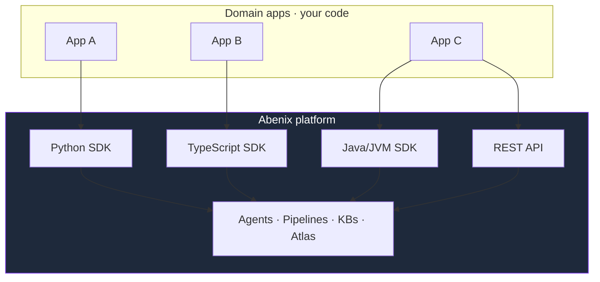

Three SDKs ship with the platform:

- **Python** — [`packages/sdk/python`](packages/sdk/python). Used by the example app, Saudi Tourism, Industrial-IoT, and ResolveAI in this repo.
- **TypeScript** — [`packages/sdk/js`](packages/sdk/js).
- **Java / JVM** — [`claimsiq/sdk`](claimsiq/sdk). Stdlib-only public surface so Kotlin and Scala consumers get zero glue. JDK 21 `HttpClient` for HTTP + SSE; Jackson is the only runtime dep besides SLF4J. Public types: [`Abenix`](claimsiq/sdk/src/main/java/com/abenix/sdk/Abenix.java) (entry point), [`ActingSubject`](claimsiq/sdk/src/main/java/com/abenix/sdk/ActingSubject.java) (delegation header), [`ExecutionResult`](claimsiq/sdk/src/main/java/com/abenix/sdk/ExecutionResult.java), [`WatchStream`](claimsiq/sdk/src/main/java/com/abenix/sdk/WatchStream.java) + [`SseWatchStream`](claimsiq/sdk/src/main/java/com/abenix/sdk/SseWatchStream.java) (live DAG snapshots from a running execution), [`DagSnapshot`](claimsiq/sdk/src/main/java/com/abenix/sdk/DagSnapshot.java), [`AbenixException`](claimsiq/sdk/src/main/java/com/abenix/sdk/AbenixException.java). [ClaimsIQ](claimsiq/) is the reference consumer — its [`ClaimsService`](claimsiq/app/src/main/java/com/abenix/claimsiq/service/ClaimsService.java) calls `Abenix.execute(...)` for every adjudication and the [Live DAG view](claimsiq/app/src/main/java/com/abenix/claimsiq/ui/LiveDagView.java) subscribes to `Abenix.watch(...)` for SSE updates.

```java
// Minimal Java usage — taken from claimsiq/app's ClaimsService.
try (Abenix forge = Abenix.builder()
        .baseUrl(System.getenv("ABENIX_API_URL"))
        .apiKey(System.getenv("CLAIMSIQ_ABENIX_API_KEY"))
        .actAs(new ActingSubject("claimsiq", userId, email, name))  // tenant-isolated delegation
        .build()) {

    ExecutionResult res = forge.execute("claimsiq-adjudicate",
        Map.of("claim_id", claimId, "claim_type", "auto"));

    System.out.println(res.output());                  // textual response
    System.out.println(res.cost() + " (" + res.tokens() + " tokens)");
}
```

The `actAs` pattern lets your app pass the end-user identity through to Abenix so the platform's tenant isolation, RBAC, and audit log all attribute to the right user. Same wire format across all three SDKs (`X-Abenix-Subject` HTTP header).

---

## 📦 Deploy anywhere

### Local development

```bash
bash scripts/dev-local.sh                  # docker-compose + npm dev
bash scripts/dev-local.sh --stop           # tear it all down
```

### Minikube — production architecture on your laptop

```bash
bash scripts/dev-minikube.sh               # auto-start minikube + forward every service
bash scripts/deploy.sh local               # full helm install on minikube
bash scripts/deploy.sh local --no-obs      # skip Prometheus + Grafana
```

### Azure AKS

```bash
bash scripts/deploy-azure.sh all                            # provision + build + deploy + seed + smoke
bash scripts/deploy-azure.sh redeploy --only=api,web        # incremental rebuild + roll
bash scripts/portforward-azure.sh                           # bring AKS services to localhost:*
bash scripts/portforward-azure.sh status                    # health check
bash scripts/portforward-azure.sh stop                      # tear down forwards
```

`deploy-azure.sh` handles ACR provisioning, image build + push, AKS `get-credentials`, helm install, KEDA install, neo4j password setup, and a smoke test. Idempotent — re-run any phase. `portforward-azure.sh` wraps `kubectl port-forward` with auto-reconnect for all 6 services and works around corporate firewalls that block the public ingress IP.

### Other clouds

Use the Helm chart directly:

```bash
helm install abenix ./infra/helm/abenix \
  -n abenix --create-namespace \
  --set image.tag=latest \
  --set ingress.host=abenix.your-domain.com
```

Tested on AKS, EKS, GKE, and bare metal.

---

## 🛠️ Tech stack

| Layer | Stack |
|---|---|
| Web | Next.js 14, React 18, Tailwind, React Flow, Mermaid, Framer Motion |
| API | FastAPI, SQLAlchemy 2 async, Alembic, asyncpg, Pydantic 2 |
| Runtime | Python 3.12, Celery, NATS (optional), Docker / Podman sandbox |
| Data | Postgres 16 (with pgvector), Redis 7, Pinecone (optional), S3-compatible storage |
| Observability | Prometheus, Grafana, structlog, OpenTelemetry |
| Deploy | Helm, KEDA, Azure CLI / kubectl |

---

## 📚 Documentation

- **In-app help** — every running instance has a `/help` page with the full user guide
- **API reference** — every running instance has `/docs` (FastAPI Swagger)
- **Atlas API** — see [apps/api/app/routers/atlas.py](apps/api/app/routers/atlas.py)
- **SDK examples** — see [examples/](examples/)

---

## 🤝 Contributing

We welcome contributions. See [CONTRIBUTING.md](CONTRIBUTING.md) for the quick start, and [CODE_OF_CONDUCT.md](CODE_OF_CONDUCT.md) for community guidelines.

Good first issues: new tools, new Atlas starter ontologies, new connectors.

---

## 🛡️ Security

Found a vulnerability? See [SECURITY.md](SECURITY.md). **Please don't open a public issue.**

---

## 📄 License

[MIT](LICENSE) — use it, fork it, ship products on top.

---

<p align="center">
  <em>Built by people who got tired of agents that forget.</em>
</p>
