<p align="center">
  
</p>

<h1 align="center">Abenix</h1>

<h3 align="center">The open-source AI agent platform for problems chatbots can't solve.</h3>

<p align="center">
  <em>Graph-grounded knowledge · governed decisions · production-grade orchestration · cloud or edge.</em>
</p>

<p align="center">
  <a href="#why-abenix"><strong>Why Abenix</strong></a> &nbsp;·&nbsp;
  <a href="#architecture"><strong>Architecture</strong></a> &nbsp;·&nbsp;
  <a href="#quick-start"><strong>Quick start</strong></a> &nbsp;·&nbsp;
  <a href="#showcase-apps"><strong>Showcase apps</strong></a> &nbsp;·&nbsp;
  <a href="#deploy-anywhere"><strong>Deploy</strong></a> &nbsp;·&nbsp;
  <a href="#enterprise-readiness"><strong>Enterprise readiness</strong></a>
</p>

<p align="center">
  <a href="LICENSE"></a>
  
  
  
  
</p>

---

> **Run it now** on a laptop with Docker, minikube, kubectl and Helm. One command builds and starts everything, see [Quick start](#quick-start) for what you need first.
>
> ```bash
> git clone https://github.com/sarkar4777/abenix.git && cd abenix && bash scripts/deploy.sh local
> ```

## 🧭 Contents

- [Why Abenix](#why-abenix)
- [Architecture](#architecture)
- [Quick start](#quick-start)
  - [What you need first](#what-you-need-first)
  - [One command on minikube](#one-command-on-minikube)
  - [Other ways to run it](#other-ways-to-run-it)
  - [Where everything lives](#where-everything-lives)
  - [Required env vars](#required-env-vars)
- [Showcase apps](#showcase-apps)
  - [OracleNet — strategic decision-analysis](#oraclenet-strategic-decision-analysis)
  - [Mideast Tourism — Vision-2030 analytics](#mideast-tourism-vision-2030-analytics)
  - [ClaimsIQ — insurance claim adjudication (Java)](#claimsiq-insurance-claim-adjudication-java)
  - [Industrial-IoT — predictive maintenance + cold chain + edge](#industrial-iot-predictive-maintenance-cold-chain-edge)
  - [ResolveAI — customer-resolution case management](#resolveai-customer-resolution-case-management)
  - [ContractIQ — energy contract intelligence](#contractiq-energy-contract-intelligence)
  - [PharmaVigil — drug-safety intelligence](#pharmavigil-drug-safety-intelligence)
  - [Wingman — commodities trading desk](#wingman-commodities-trading-desk)
- [Edge runtimes](#edge-runtimes)
  - [How a cloud agent reaches the edge](#how-a-cloud-agent-reaches-the-edge)
  - [Pick a variant](#pick-a-variant)
  - [Signing keys, fail closed](#signing-keys-fail-closed)
  - [Lifecycle](#lifecycle)
- [Deploy anywhere](#deploy-anywhere)
- [Build on top of Abenix](#build-on-top-of-abenix)
- [Enterprise readiness](#enterprise-readiness)
- [Tech stack](#tech-stack)
- [Documentation](#documentation)
- [Contributing](#contributing)
- [License](#license)

---

<a id="the-story"></a>
## The story

Most AI agent platforms give your agents amnesia — they retrieve documents, forget context, and re-derive the world model on every turn. Most also assume "agent" means "a chatbot in the cloud talking to OpenAI." That's fine for support tickets. It's not fine for a wind turbine, a refrigerated trailer, a contract worth seven figures, or a control room with a 50 ms hard limit.

**Abenix gives agents a brain, a body, and a rulebook.** A typed graph that lives next to the knowledge base so agents traverse evidence like a researcher follows citations. A deterministic rule engine that makes the decisions an agent should not make on its own, with risk tiers that decide who signs off and what an agent may touch. Per-agent runtime pools, multi-signoff approvals, idempotency, and a dead-letter queue so you actually trust them in production. And lean edge runtimes — Python, Rust, or C — that take the same agent definition, sign it into a 12–80 MB bundle, and run it next to the equipment.

Same agent. Same definition. Cloud or edge. Built for the long-running, knowledge-heavy, accountability-mandatory work that workflow tools choke on.

<p align="center">
  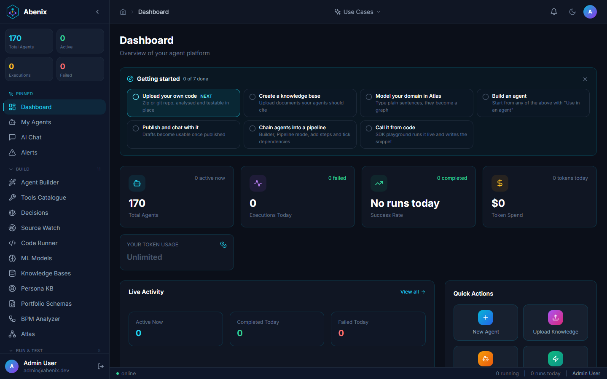
  <br/><em>A fresh install, first sign in: the getting-started checklist, live activity, and a prompt to connect a model before the first run</em>
</p>

---

<a id="why-abenix"></a>
## ✨ Why Abenix

Nine things that, taken together, you do not get anywhere else open-source:

### 1. Graph-grounded knowledge — Atlas + Knowledge Engine

Documents and concepts live on the same canvas. Drop a PDF → multimodal extraction proposes typed nodes and edges with confidence scores. Type a sentence → cardinality inference. Time-slider snapshots the whole graph on every save. Five starter ontologies in the box (FIBO Core, FIX Protocol, EMIR, ISDA, ETRM EOD).

Agents query the graph through four typed tools — `atlas_describe`, `atlas_query`, `atlas_traverse`, `atlas_search_grounded` — and get back **paths of cited evidence**, not three similar paragraphs. The vanilla-RAG comparison:

| Question | Vanilla RAG | Abenix |
|---|---|---|
| *"What caused the Q3 revenue drop?"* | 3 similar paragraphs | `Q3 Report → mentions → supply chain delays → CAUSED_BY → chip shortage` |
| *"Counterparties with > 5 unconfirmed trades in 7 days"* | Cosine miss | Pattern walk over the typed graph, structured rows back |
| *"Why is this contract risky?"* | Generic clause text | Path from clause → similar past clauses → flagged outcomes |

Token cost typically drops **5–10×** because agents read curated evidence, not noisy near-neighbours. Postgres + Neo4j — no extra vector DB to operate.

### 2. Agents that reason, rules that decide — governed by risk tier

A language model is very good at reading a contract, a claim or a shipment note and pulling out the facts. It should not be the last word on whether a surcharge applies, a claim is covered or a trade breaches a limit. Abenix splits the job. **The agent gathers the facts. A deterministic rule engine makes the call. The platform records which rule version decided, and why.** Every change to those rules, and every risky thing an agent does, goes through controls set by a risk tier.

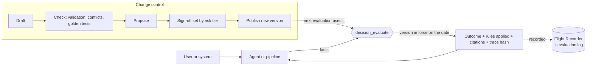
```mermaid
flowchart LR
    U[User or system] --> A[Agent or pipeline]
    A -- facts --> D{{decision_evaluate}}
    D -- version in force on the date --> R[Outcome + rules applied + citations + trace hash]
    R --> A
    R -.recorded.-> F[(Flight Recorder<br/>+ evaluation log)]
    subgraph Change control
      W[Draft] --> C[Check: validation, conflicts, golden tests]
      C --> P[Propose] --> S[Sign-off set by risk tier] --> V[Publish new version]
    end
    V -.next evaluation uses it.-> D
```

**The rule engine** runs on [GoRules ZEN](https://gorules.io) (MIT, Rust core), wrapped in a full decision service:

- **Rules a business owner can read.** The no-code builder writes each rule as a sentence while you build it. A decision table takes rows pasted from Excel. The ZEN flow view handles larger graphs. All three edit the same model, and JSON import and export keeps it in Git if you want.
- **The same answer every time.** The same facts against the same version give the same result and the same trace hash, on any pod, today or in a year.
- **It never guesses.** A missing or wrongly typed fact comes back as `missing_facts` or `invalid_facts`, naming the field, so the agent asks for it instead of inventing it.
- **Time travel built in.** Versions carry the dates they apply from. Ask what applied on 1 March (`as_of`), or what applied on 1 March as the rules were known then (`known_at`), for audits and back-dated cases.
- **Safe to change.** Drafts, field-level validation, rule conflict checks, golden tests, a diff against what is live, two authors merging edits, then propose, sign-off and publish. A publish under load switches versions cleanly, with no caller seeing a mix of old and new.
- **Callable from everywhere.** A `decision_evaluate` tool for agents, a decision step in pipelines, REST, the Python and TypeScript SDKs, and batch evaluation.
- **Fast.** One API pod with 2 CPUs answers about 1,300 evaluations a second with 500 callers at once, and scales out with more pods.
- **Accountable.** A decision made inside a run is stored with its version, the rules that applied, their citations and the trace hash, and shows in the run's Flight Recorder.

A rule, exactly as the builder shows it:

> When `shipment.date` is on or after 2026-01-01, `shipment.postcode` is in `REMOTE_POSTCODES` and `shipment.weightKg` is more than 50, then `surcharge` is `REMOTE_AREA_SURCHARGE`. *Source: Carrier tariff 2026, section 4.2.*

And an agent using it, with no extra glue:

```python
result = await abenix.decisions.evaluate(
    "freight.remote.surcharge",
    {"shipment": {"date": "2026-03-01", "postcode": "IV27", "weightKg": 120}},
)
# result["outcome"] == "decided", result["result"]["surcharge"] == "REMOTE_AREA_SURCHARGE"
# result["applied_rules"], result["trace_hash"], result["version"]
```

**Risk tiers** attach to agents, pipelines, tools and decisions. A run starts at its agent's tier and rises, never falls, when it calls a riskier tool, and the reason for each rise is kept on the run. Each tier has a policy, and a tenant can change any of it under **Admin → Risk & Controls**, effective for new runs within five seconds:

| Tier | Sign-offs to publish a change | When a lower-tier run calls a tool at this tier | Output schema | Evaluation suite must pass | Escalate a waiting approval |
|---|---|---|---|---|---|
| **Low** | none | allowed | optional | no | off |
| **Medium** | none | allowed | optional | no | off |
| **High** | 1, not the author | waits for human approval | required | yes, on the exact config | after 24 h |
| **Critical** | 2, not the author | waits for human approval | required | yes, on the exact config | after 4 h |

Around that sit the controls an auditor asks for:

- **Separation of duties.** Who may sign comes from capabilities in permission sets, and the author of a change cannot approve it at high or critical tier. Reviewers approve, deny, or return a change with a note that sends it back to draft.
- **Evaluation gate.** A high-tier agent cannot be published until its golden-case suite passes against the exact configuration being published.
- **Kill switches.** Stop a tool, an agent, a pipeline, a model or a trigger for a tenant, or everything at once. Work already running stops at its next tool call.
- **Tamper-evident audit.** Audit rows form a hash chain checked every night, with an alert if it breaks.
- **Provenance and replay.** Every run stores the configuration it ran with and its hash, so it can be replayed and compared later.

### 3. The unit of deployment is an agent — not a workflow

Every agent has its own pod pool, KEDA queue-depth scaler, NATS subject, budget cap, and telemetry channel. Flip `dedicated_mode = true` and a single agent gets its own Deployment + ScaledObject. The `/admin/scaling` page projects shared / dedicated / peak cost before you flip.

**Three scaling layers** — three admin screens, no overlap:

| Layer | Bottleneck it solves | Admin UI |
|---|---|---|
| 1. Agents + pods | "the api pod is doing too much agent work" | `/admin/scaling` — per-agent `runtime_pool`, replicas, qps, daily-$-budget |
| 2. Tools | "50 callers each hit Yahoo at the same time" | `/admin/tool-scaling` — per-tool cache, semaphore, qps, breaker, daily call-budget, `inline` vs `runtime` dispatch |
| 3. Pipelines | "which node in this 10-step pipeline is slow?" | `/admin/pipeline-scaling` — DAG view, every node resolved to its pool / tool / control class |

Pipelines don't have their own runtime — they compose Layer 1 (agent nodes route to their own pool) and Layer 2 (tool nodes go through the gate). Full architecture in [`docs/02-runtime/08-queue-scaling.md`](docs/02-runtime/08-queue-scaling.md).

n8n / Zapier / LangGraph are excellent when the problem is *integration-shaped* — "Salesforce row changed, drop a Slack message." Abenix earns its place when the problem is *agent-shaped*, meaning long-running reasoning, shared knowledge, audit-grade traceability, and isolation per tenant under load.

### 4. Real multi-tenancy + actAs delegation

`tenant_id` on every row. Cross-tenant reads return `404`, not `403`. Vector backends enforce the same filter at the index level. Three roles (admin / creator / user) plus per-feature flags via `/api/me/permissions`. `ResourceShare` for cross-team grants.

The killer feature is **actAs**: a SaaS app holding a single platform key serves N end-users by passing `X-Abenix-Subject` on each request. Quotas, audit log, and data isolation all attribute to the right user. Five showcase apps in this repo ride this exact path.

**Sign-in**: email + password works out of the box. Drop in OIDC creds for **Google**, **GitHub**, or **Microsoft** and the login page renders the matching button. SSO-provisioned users get their own tenant on first sign-in. Both flows can coexist on the same email — link a password account to SSO and either continues to work. See [`docs/sso.md`](docs/sso.md) for the 5-minute setup per provider.

**Enterprise knowledge (v2.0)**: document-level ACL on a shared KB, document versioning + supersedes, incremental Cognify, bi-temporal Atlas with as-of queries, embedding-model swap without downtime, OCR + table extraction for scanned docs, GDPR cascade delete with audit receipts, per-tenant encryption at rest. Read-only Cypher tool for agents. The 16-feature v2 reference: [`docs/02-runtime/15-v2-knowledge-enterprise.md`](docs/02-runtime/15-v2-knowledge-enterprise.md).

### 5. Failure-first ops — Pipeline Surgeon, DLQ, idempotency, alerts

Failures are first-class citizens, not exception traces in a log file:

- **Stable `failure_code` taxonomy** (`LLM_RATE_LIMIT`, `SANDBOX_TIMEOUT`, `MODERATION_BLOCKED`, `BUDGET_EXCEEDED`…) on every execution. The `/alerts` page groups by code, with Slack and email fan-out set by env var.
- **Pipeline Surgeon** — every node crash captures a structured failure-diff. The Surgeon proposes a JSON-Patch (RFC 6902) you Apply or Reject from `/agents/{id}/healing`. Never auto-applied. One-click rollback to `dsl_before`.
- **`Idempotency-Key` header** on `/api/agents/{id}/execute` — replay returns the cached payload for 24 h.
- **Dead-letter queue** at `/admin/dlq` — failed executions land here with one-click replay or discard.
- **Workflow shell** — a 30-verb REPL ("kubectl for pipelines") that drives every change through the same JSON-Patch ledger so audits remain coherent.

### 6. Production primitives, in the box

Connect agents to the systems enterprise ops actually run on, without burning a sprint per integration:

| Primitive | What it lets an agent do |
|---|---|
| **Connector framework + 8 presets** | Call SAP PM / ServiceNow / Maximo / Workday / Sensitech / Carrier Lynx / DTN Weather / BNEF with one tool node + secret-ref auth + `/test` button. |
| **Self-describing tool configuration** | Every tool declares the keys it needs on its class. `/admin/tool-config` is generated from those declarations: one card per provider, save a key and agents use it within 30 seconds, no redeploy, encrypted at rest. A lint in CI fails any tool that reads the environment privately, so the screen is complete by construction. `/tools` and the builder show a badge per tool, and a missing key comes back to the user as one sentence naming the key and the screen. |
| **Multi-signoff approval gates** | Block a $40k claim until N humans sign off, with a TTL enforced and a real inbox at `/approvals`. Return for changes, escalation, and a sign-off floor set by the run's risk tier. |
| **Warm code runners over NATS** | Bring-your-own code assets run in a warm per-version runner called over NATS. A warm call adds about 3 ms over the code itself, idle runners scale to zero, and a cold call falls back to a one-off Job while the runner warms. |
| **Source Watch** | Watch web pages, PDFs, spreadsheets, CSV, JSON and feeds on a schedule. Each change is an immutable snapshot with a text or row diff, a materiality hint and a `source.changed` event, and can feed a knowledge base with citations. |
| **Outbound events** | A transactional outbox delivers platform events to signed webhooks with retries, a dead-letter state and replay, and to a NATS subject for internal consumers. |
| **Time-series + MQTT** | TimescaleDB hypertable, mosquitto broker, plus `tsdb_query` · `mqtt_publish` · `subscribed_feed` · `windowed_state` palette tools. |
| **Idempotency + DLQ + audit** | Replay-safe execute, dead-letter inbox, integrity-hashed audit log per tenant. |
| **Bidirectional writes** | OPC-UA write, MQTT publish, CMMS create-work-order — agents can push setpoints, not just read sensors. |

### 7. Edge runtimes — Python · Rust · C

Cloud-built agents, edge-deployed pods. Mark an agent **Edge eligible** in the Builder, the platform compiles a signed `.agent` bundle (RSA-PSS over a deterministic tar) and ships it over MQTT to a runtime sitting next to the equipment. Three runtime variants for three classes of plant hardware:

| Variant | Image size | Targets | When |
|---|---|---|---|
| **Python** (reference) | ~80 MB | x86_64 / arm64 | Default. Easiest to extend with new tool shims. |
| **Rust** (single static binary) | ~25 MB | x86_64 / arm64 / armv7 | Rugged industrial PCs — Moxa UC-8580, Siemens RUGGEDCOM, Beckhoff CX, NVIDIA Jetson. No Python needed on the box. |
| **C** (musl static) | ~12 MB | armv7 / arm64 / x86_64 | Ultra-constrained gateways — Phoenix Contact PLCnext, Allen-Bradley CompactLogix, OpenWRT, ARM Cortex-A7 with 256 MB RAM. |

Same `.agent` bundle, same MQTT delivery topic, same HTTP contract. Tool budget on edge: `mqtt_publish, mqtt_subscribe, current_time, windowed_state, connector_call, code_executor`. OTA updates via one MQTT message. Bundle tampering refuses to load. The bit nobody else ships.

### 8. Multimodal end-to-end

Drop a PDF, image, audio, video, DOCX, DWG/DXF, GeoJSON, or text file anywhere Abenix accepts uploads. The platform routes the modality to the right provider (Claude / Gemini / GPT-4o for vision, Gemini for audio + video). Field technicians dictate work-order closeouts, vision models read damage photos, and agents reason over chart-shaped diagrams.

### 9. One Helm chart, observability inside

`helm install abenix ./infra/helm/abenix` deploys api + web + workers + per-agent-pool runtimes + Postgres + Redis + Neo4j + NATS + KEDA + mosquitto + TimescaleDB + Prometheus + Grafana + ingress. Every pod exposes `/metrics`. The `/alerts` page groups by `failure_code`. Slack + email fan-out via env var.

Same chart on AKS, EKS, GKE, minikube, bare metal. MIT license. Self-host without vendor handcuffs.

---

<a id="architecture"></a>
## 🏗 Architecture

Three independently scalable tiers that share one Postgres, plus an optional edge fleet:

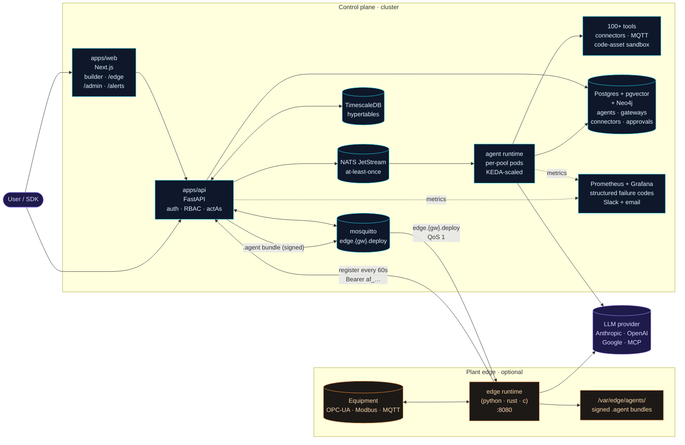
```mermaid
flowchart LR
    subgraph CTRL["Control plane · cluster"]
        WEB["apps/web<br/>Next.js<br/>builder · /edge<br/>/admin · /alerts"]
        API["apps/api<br/>FastAPI<br/>auth · RBAC · actAs"]
        EXEC["agent runtime<br/>per-pool pods<br/>KEDA-scaled"]
        TOOLS["100+ tools<br/>connectors · MQTT<br/>code-asset sandbox"]
        DB[("Postgres + pgvector<br/>+ Neo4j<br/>agents · gateways<br/>connectors · approvals")]
        MQ[("mosquitto<br/>edge.{gw}.deploy")]
        TSDB[("TimescaleDB<br/>hypertables")]
        NATS[("NATS JetStream<br/>at-least-once")]
        OBS["Prometheus + Grafana<br/>structured failure codes<br/>Slack + email"]
        WEB --> API --> NATS --> EXEC --> TOOLS
        API --> DB
        EXEC --> DB
        API <--> MQ
        API <--> TSDB
        EXEC -.metrics.-> OBS
        API -.metrics.-> OBS
    end

    subgraph EDGE["Plant edge · optional"]
        RT["edge runtime<br/>(python · rust · c)<br/>:8080"]
        BUNDLES["/var/edge/agents/<br/>signed .agent bundles"]
        EQUIP[("Equipment<br/>OPC-UA · Modbus · MQTT")]
        EQUIP <--> RT --> BUNDLES
    end

    USER([User / SDK]) --> WEB
    USER --> API
    EXEC --> LLM[("LLM provider<br/>Anthropic · OpenAI<br/>Google · MCP")]
    API -- ".agent bundle (signed)" --> MQ
    MQ -- "edge.{gw}.deploy<br/>QoS 1" --> RT
    RT -- "register every 60s<br/>Bearer af_…" --> API
    RT --> LLM

    classDef ctl fill:#0f172a,stroke:#22d3ee,color:#e0f2fe;
    classDef edge fill:#1c1917,stroke:#fb923c,color:#fed7aa;
    classDef ext fill:#1e1b4b,stroke:#a78bfa,color:#ddd6fe;
    class WEB,API,EXEC,TOOLS ctl;
    class DB,MQ,TSDB,NATS,OBS ctl;
    class RT,BUNDLES,EQUIP edge;
    class LLM,USER ext;
```

**Control plane.** Stateless API + web tiers in front. The agent runtime scales horizontally per agent type via KEDA queue-depth scaling on NATS — when `RUNTIME_MODE=remote` the API never executes agent code itself, it publishes a job and waits.

**Transport.** NATS for at-least-once internal delivery + replay. mosquitto for MQTT triggers, agent-published topics, and signed bundle delivery to edge gateways. TimescaleDB for time-series ingest the agents read with `tsdb_query`.

**Edge fleet.** One helm install per gateway. The runtime registers itself with the platform every 60 seconds, subscribes to `edge.{gateway_id}.deploy`, and hot-loads any signed bundle for an agent the platform has flagged `edge_compatible`. RSA-PSS signature verification gates every load.

---

<a id="quick-start"></a>
## ⚡ Quick start

<a id="what-you-need-first"></a>
### What you need first

| Tool | Notes |
|---|---|
| Docker Desktop (or Docker Engine) | Running, with at least 12 GB of memory and 4 CPUs for it |
| minikube | Any recent version, the script starts the cluster for you |
| kubectl and Helm 3 | On your PATH |
| Git and bash | On Windows use Git Bash, on macOS and Linux any terminal |
| Disk | About 40 GB free for the images and the cluster |

<a id="one-command-on-minikube"></a>
### One command on minikube

```bash
git clone https://github.com/sarkar4777/abenix.git
cd abenix
bash scripts/deploy.sh local
```

That starts minikube, builds every image, installs the Helm chart, runs the migrations and seeds, and forwards the ports. The first run takes 30 to 60 minutes, mostly image builds. It asks which use-case apps to include and starts all of them if you do not answer.

You do not need a `.env` to start. To give agents a model, either put at least one of `ANTHROPIC_API_KEY`, `OPENAI_API_KEY` or `GOOGLE_API_KEY` in `.env` (copy it from `.env.example`) before you run the command, or add a key afterwards under Admin, Tool Configuration.

Then open http://localhost:3000 and sign in with `admin@abenix.dev` / `Admin123456`.

<a id="other-ways-to-run-it"></a>
### Other ways to run it

| Goal | Command | Time |
|---|---|---|
| **Production-shape on your laptop**, full Helm chart on minikube | `bash scripts/deploy.sh local` | 30 to 60 min first run |
| **Localhost**, docker-compose for infra, then npm dev for api, web and the standalone apps | `bash scripts/dev-local.sh` | ~5 min first run |
| **Minikube with auto port forward** | `bash scripts/dev-minikube.sh` | 30 to 60 min first run |
| **Azure AKS**, provisions the resource group, registry and cluster, builds and pushes images, installs the chart, runs migrations and seeds | `bash scripts/deploy-azure.sh deploy` | ~25 min |

**No API key?** If you have a Claude Pro or Max subscription and are signed in
with Claude Code on the same machine, run `bash scripts/sync-claude-subscription.sh`
instead of filling in a key. It copies the current credential into the platform,
switches on subscription mode, and verifies it. Every feature then routes through
the subscription and records tokens at zero cost. The credential rotates, so
re-run the script whenever agent runs start failing with
`OAuth access token has been revoked`.

**Port 3000 already taken?** The minikube path takes `WEB_PORT`, for example
`WEB_PORT=3100 bash scripts/deploy.sh local`. Use `bash scripts/deploy.sh forwards`
to re-establish every port forward after a pod restart, and
`bash scripts/deploy.sh reload <service>` to rebuild and restart a single
service without a full redeploy.

<a id="where-everything-lives"></a>
### Where everything lives

Local runs have no ingress, so every surface is a port forward. On AKS each one
gets a hostname under the ingress load balancer's IP via `nip.io`.

| Surface | Local | Azure | Credential |
|---|---|---|---|
| Abenix core | http://localhost:3000 | `http://<ip>.nip.io` | `admin@abenix.dev` / `Admin123456` |
| Abenix API | http://localhost:8000/docs | `http://api.<ip>.nip.io` | same |
| ContractIQ | http://localhost:3001 | `http://ciq.<ip>.nip.io` | `test@contractiq.com` / `TestPass123!` |
| Mideast Tourism | http://localhost:3002 | `http://tourism.<ip>.nip.io` | `test@mideasttourism.gov` / `TestPass123!` |
| Industrial-IoT | http://localhost:3003 | `http://iot.<ip>.nip.io` | platform login |
| ResolveAI | http://localhost:3004 | `http://care.<ip>.nip.io` | `agent@resolveai.local` / `agent123` |
| ClaimsIQ | http://localhost:3005 | `http://claims.<ip>.nip.io` | no login — open UI |
| Wingman | http://localhost:3006 | `http://wm.<ip>.nip.io` | platform login |
| PharmaVigil | http://localhost:3007 | `http://safety.<ip>.nip.io` | no login — open UI |
| Grafana | http://localhost:3030 | `http://grafana.<ip>.nip.io` | `admin` / `abenix-admin` |
| Prometheus | http://localhost:9090 | `http://prom.<ip>.nip.io` | none |

`<ip>` is the ingress controller's load-balancer address. You do not have to
look it up — `bash scripts/deploy-azure.sh status` prints every URL, and the
deploy caches the hostname in `.azure-endpoint`.

Same accounts work on both.

<a id="required-env-vars"></a>
### Required env vars

At least one LLM key — Anthropic (recommended), OpenAI, or Google. The full list lives in `.env.example`. For Kubernetes, set the same keys in `infra/helm/abenix/values-*.yaml`.

Every other key a tool needs can be added later, at run time, by an admin under **Admin -> Tool Configuration**. The screen lists them all, grouped by provider, with a signup link and a Test button, and says which tools each one unlocks. Nothing has to be redeployed. Reference: [`docs/08-howto/08-tool-configuration.md`](docs/08-howto/08-tool-configuration.md).

---

<a id="showcase-apps"></a>
## 🎯 Showcase apps

Seven standalone apps ship in this repo, plus OracleNet which lives inside the core UI. Each one is a real product surface — every line of business logic flows through the platform via the SDK + actAs pattern. They all auto-start with `dev-local.sh` and auto-deploy with `deploy-azure.sh`.

<a id="oraclenet-strategic-decision-analysis"></a>
### OracleNet — strategic decision-analysis

A 7-agent pipeline inside the main web app. Type a strategic decision in plain English, get back a **Decision Brief** with 6 tabs (Summary · Stakeholders · Scenarios · Risks · Cascade · Provenance) plus a recommendation card and a confidence score. A `depth_router` Python node prunes the DAG to 3 / 5 / 7 agents based on `context.depth`. Exports as PDF / DOCX / Markdown.

*Why it's interesting.* Big decisions usually fail because nobody seriously simulated who would oppose them. OracleNet bakes Stakeholder Sim, Second-Order, and Contrarian into every brief.

<p align="center">
  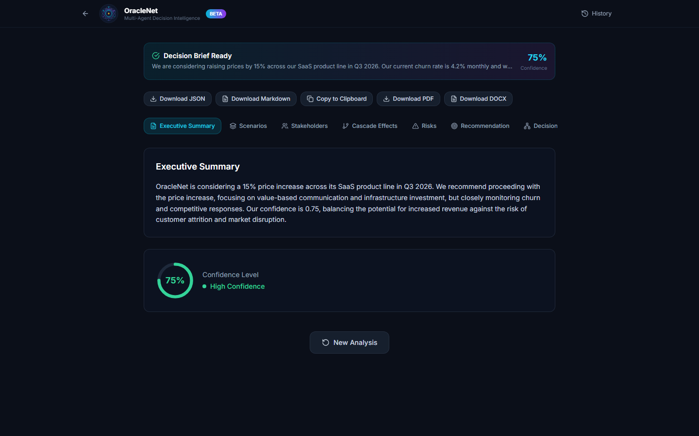
  <br/><em>OracleNet Decision Brief — confidence + recommendation card, 6 tabs</em>
</p>

<a id="mideast-tourism-vision-2030-analytics"></a>
### Mideast Tourism — Vision-2030 analytics

A standalone analytics app for the Gulf Ministry of Tourism. 5 agents, 7 pages (Dashboard · Regional · Analytics · Chat NLQ · Reports · Simulations · Upload), 5 report templates, 5 simulator presets. Test data is baked into the API image — no manual seed.

*Why it's interesting.* Vision-2030 ministries need to track 100M-visitor targets, regional revenue, and seasonal demand against the actual data they already have — without a year-long BI buildout.

<p align="center">
  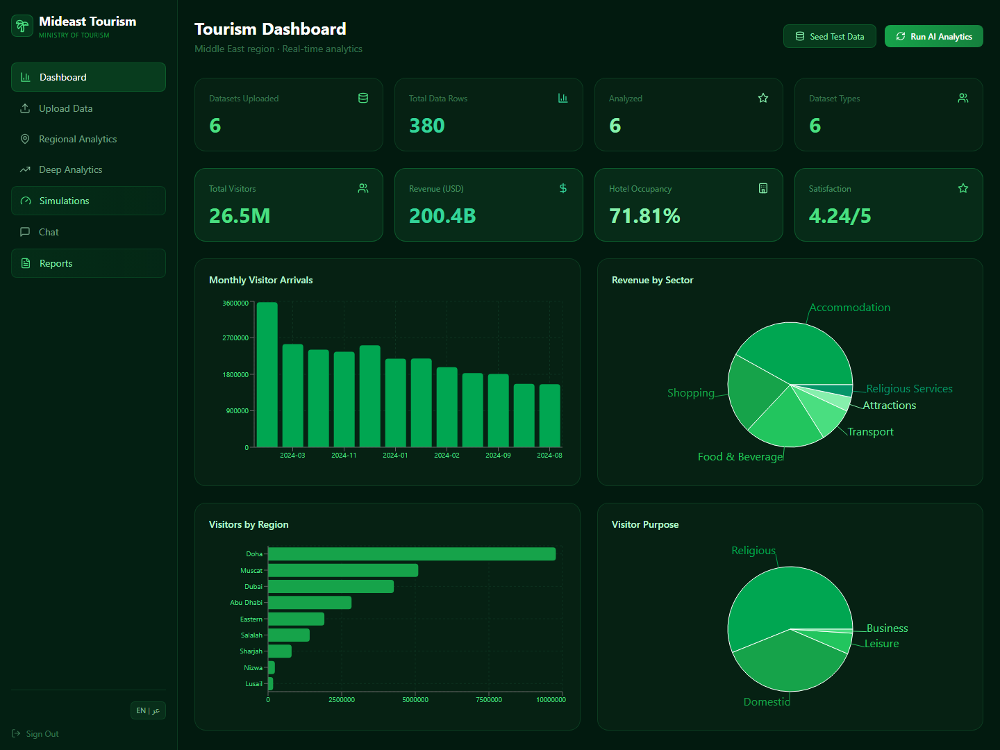
  <br/><em>Mideast Tourism dashboard — KPIs computed live from baked test data</em>
</p>

<a id="claimsiq-insurance-claim-adjudication-java"></a>
### ClaimsIQ — insurance claim adjudication (Java)

A Java/Vaadin showcase that proves the **Java SDK is feature-complete**. 6-stage `claimsiq-adjudicate` pipeline (FNOL Intake → Policy Match → Damage Assess → Fraud Screen → Valuator → Claim Decider) with photo upload routed to vision models and a live DAG view streaming over SSE.

*Why it's interesting.* Claim shops want explainable adjudication — every decision must cite the policy clause it relied on. The Java SDK's public surface is stdlib-only (JDK 21 `HttpClient`, Jackson, SLF4J) so Kotlin and Scala consumers get zero glue.

<p align="center">
  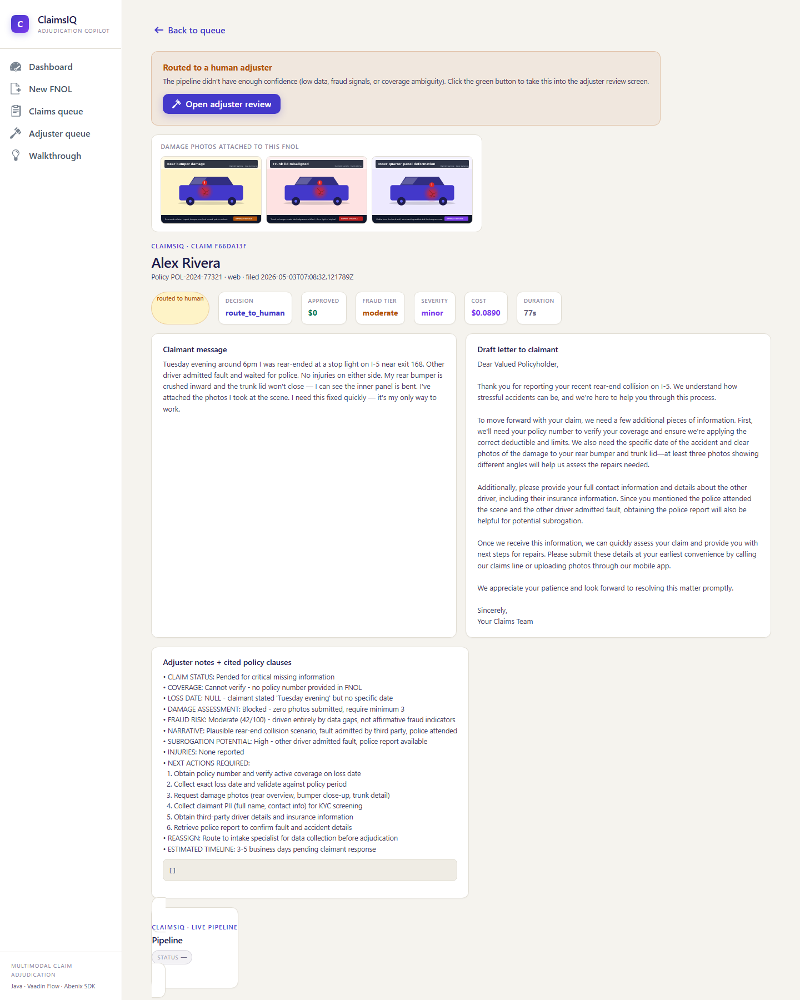
  <br/><em>ClaimsIQ — final adjudication with cited clauses, fraud score, live DAG</em>
</p>

<a id="industrial-iot-predictive-maintenance-cold-chain-edge"></a>
### Industrial-IoT — predictive maintenance + cold chain + edge

Six tabs covering the highest-frequency industrial use cases:

- **Pump Vibration** — DSP feature extractor + RUL regressor (sandboxed Python code-assets), severity classifier, work-order drafter. Plus a **Run on the edge** section that compiles + signs + ships a Haiku agent to a Rust gateway and runs FFT/RMS through `code_executor` locally.
- **Cold Chain** — excursion corrector (Python code-asset), excursion adjudicator over pharma SOP KB, partial-loss claim drafter. CMMS connector picker for live mode.
- **Design Studio** — engineering & EPC copilot with 9-node DAG, deterministic CapEx/LCOE recompute, 3 ranked design scenarios.
- **Field Guide** — wind-farm maintenance copilot with photo-upload damage assessment, OEM-cited repair procedure, OR-tools 7-day technician scheduler.
- **Alarm Desk** — ops control-room alarm triage with SCADA-severity override, cascade banner, 4-stage safe-reset advisor behind a 2-signoff approval gate.
- **Architecture** — in-product UAT guide, where every scenario card links its seeded pipeline and KB collection.

*Why it's interesting.* Two adjacent industrial domains, one platform. Every tab has a **Live mode** toggle that flips it from synthetic data to live MQTT + connector + TSDB feeds. The Pump tab is the end-to-end edge demo — bundle digest, agent slug, gateway, latency comparison vs cloud pipeline.

<p align="center">
  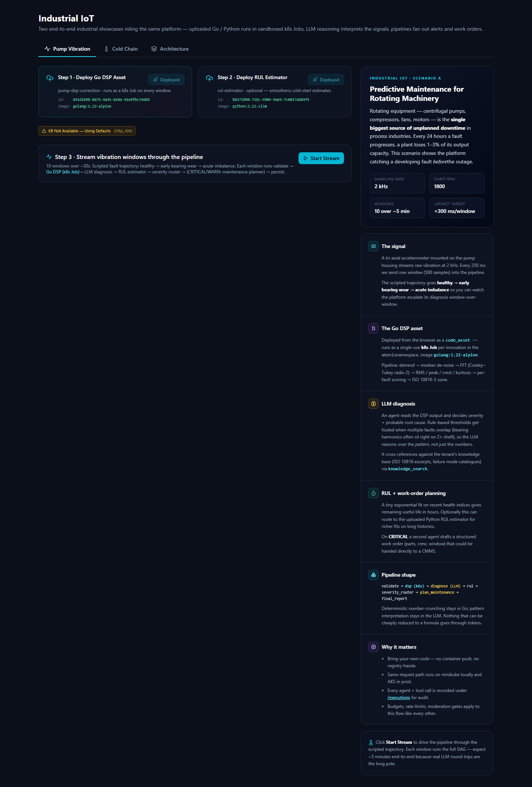
  <br/><em>Industrial-IoT — pump tab after both code assets deployed, with edge runtime panel</em>
</p>

<a id="resolveai-customer-resolution-case-management"></a>
### ResolveAI — customer-resolution case management

Four pipelines on the same case data: Inbound Resolution (6-agent), SLA Sweep (cron), Post-QA (on case close), Trend Mining (weekly). Refund tiers + escalation paths + tone guidelines live in a seeded KB.

*Why it's interesting.* Customer-service teams drown in repetitive triage, and their highest-leverage moves (deflection, tone calibration, trend detection) get neglected. ResolveAI runs all four loops continuously while a human stays in approve / takeover mode.

<p align="center">
  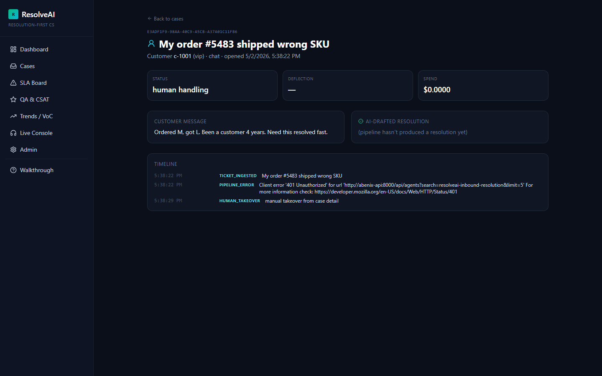
  <br/><em>ResolveAI — case detail with inbound-resolution DAG and cited policy</em>
</p>

---

<a id="contractiq-energy-contract-intelligence"></a>
### ContractIQ — energy contract intelligence

Ingests LNG and power contracts, extracts the terms that matter (volumes,
indexation, take-or-pay, force majeure), values the book against live curves,
and benchmarks a clause against comparable deals. 19 agents behind an Insights
Hub, with a delegation model where every run is stamped with the ContractIQ
user who triggered it rather than a shared service account.

<p align="center">
  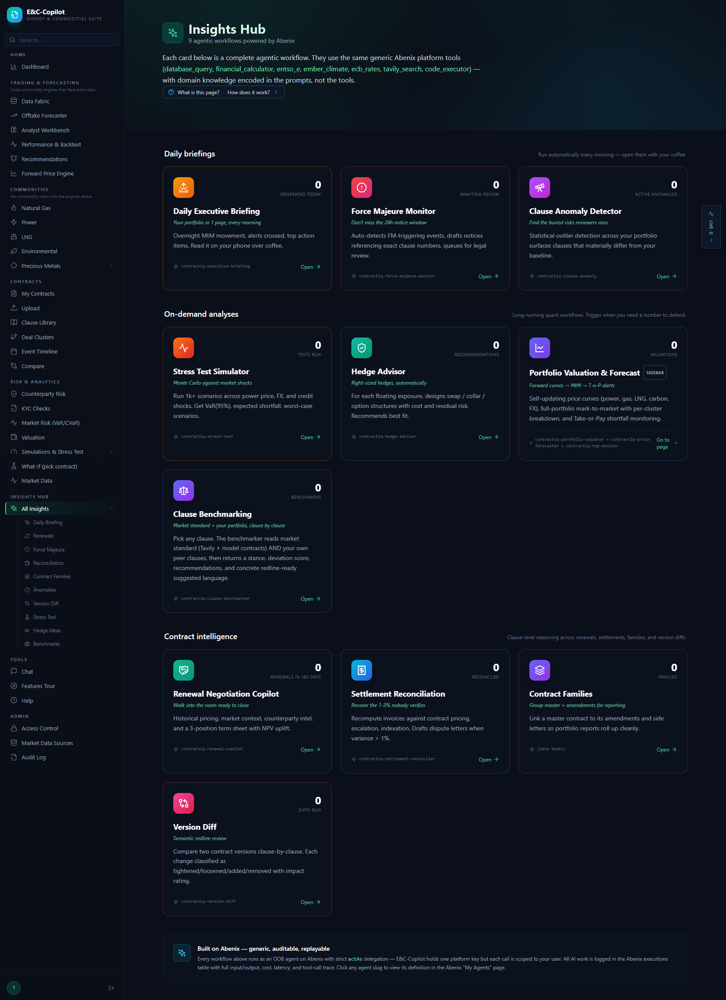
  <br/><em>ContractIQ — the Insights Hub, nine agentic workflows over the contract portfolio</em>
</p>

<a id="pharmavigil-drug-safety-intelligence"></a>
### PharmaVigil — drug-safety intelligence

Adverse-event intake through to a regulatory narrative: MedDRA coding, CIOMS
seriousness, WHO-UMC and Naranjo causality, disproportionality signal detection
and a medical-review gate. Nine nodes, seven agents, two code assets and a
trained model.

*Why it's interesting.* It is the clearest example of putting each job on the
right tool. The disproportionality maths is a code asset because it is a
formula — a first cut that trained a classifier to predict the same threshold
scored level with the arithmetic and was dropped. What stayed a model is
predicting which cases a reviewer escalates, which beats a hand-written rule
over the same features by 7.6 points of accuracy and 0.20 of AUC.

<p align="center">
  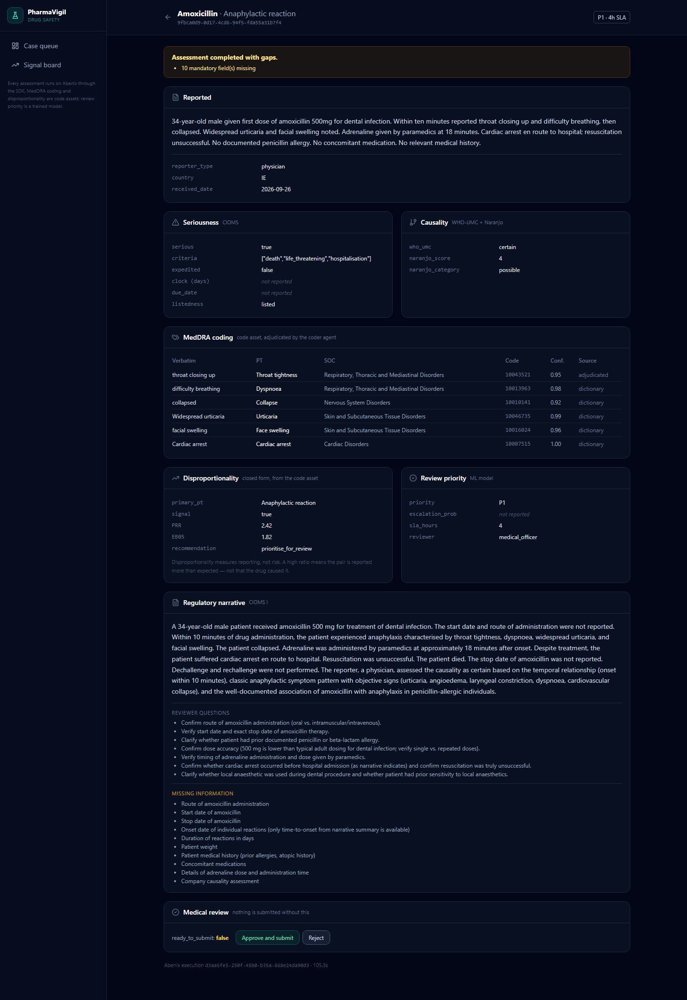
  <br/><em>PharmaVigil case detail — coded terms, seriousness criteria, causality, disproportionality and the review gate</em>
</p>

<a id="wingman-commodities-trading-desk"></a>
### Wingman — commodities trading desk

A trader workbench over freight arbitrage. Encodes a strategy in plain English,
replays it on real history, prices the risk through a deployed Go Monte Carlo,
and routes activation through an approval gate. The Mispricing Lens pairs a
BayesianRidge fair-value model with an IsolationForest anomaly score and asks an
LLM for the thesis, then raises a trade card for a human to accept or refuse.
Nothing on the page is synthesised — when an agent fails the UI says the data is
unavailable rather than showing a number nobody produced.

<p align="center">
  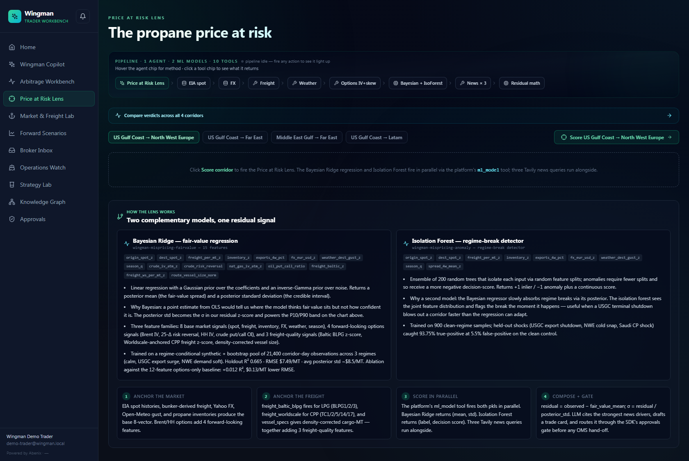
  <br/><em>Wingman — the Price at Risk Lens, Bayesian Ridge fair value beside the Isolation Forest regime-break detector</em>
</p>

<a id="edge-runtimes"></a>
## 🛰 Edge runtimes

The edge story in three lines: download a runtime → mint an `af_` token → helm-install on the gateway. The pod registers within 60 seconds and shows up on the platform's `/edge` page.

<a id="how-a-cloud-agent-reaches-the-edge"></a>
### How a cloud agent reaches the edge

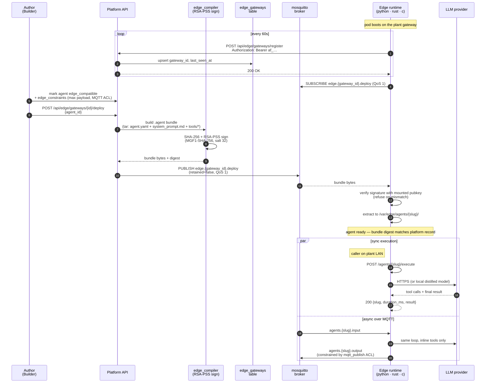
```mermaid
sequenceDiagram
    autonumber
    participant Author as Author<br/>(Builder)
    participant API as Platform API
    participant Compiler as edge_compiler<br/>(RSA-PSS sign)
    participant DB as edge_gateways<br/>table
    participant MQTT as mosquitto<br/>broker
    participant Edge as Edge runtime<br/>(python · rust · c)
    participant LLM as LLM provider

    Note over Edge: pod boots on the plant gateway
    loop every 60s
      Edge->>API: POST /api/edge/gateways/register<br/>Authorization: Bearer af_…
      API->>DB: upsert gateway_id, last_seen_at
      API-->>Edge: 200 OK
    end
    Edge->>MQTT: SUBSCRIBE edge.{gateway_id}.deploy (QoS 1)

    Author->>API: mark agent edge_compatible<br/>+ edge_constraints (max payload, MQTT ACL)
    Author->>API: POST /api/edge/gateways/{id}/deploy<br/>{agent_id}
    API->>Compiler: build .agent bundle<br/>(tar: agent.yaml + system_prompt.md + tools/*)
    Compiler->>Compiler: SHA-256 + RSA-PSS sign<br/>(MGF1-SHA-256, salt 32)
    Compiler-->>API: bundle bytes + digest
    API->>MQTT: PUBLISH edge.{gateway_id}.deploy<br/>(retained=false, QoS 1)
    MQTT-->>Edge: bundle bytes
    Edge->>Edge: verify signature with mounted pubkey<br/>(refuse on mismatch)
    Edge->>Edge: extract to /var/edge/agents/{slug}/

    Note over Edge: agent ready — bundle digest matches platform record

    par sync execution
      Note left of Edge: caller on plant LAN
      Edge->>Edge: POST /agents/{slug}/execute
      Edge->>LLM: HTTPS (or local distilled model)
      LLM-->>Edge: tool calls + final result
      Edge-->>Edge: 200 {slug, duration_ms, result}
    and async over MQTT
      MQTT->>Edge: agents.{slug}.input
      Edge->>LLM: same loop, inline tools only
      Edge->>MQTT: agents.{slug}.output<br/>(constrained by mqtt_publish ACL)
    end
```

**The cohesive story.** Cloud authoring, signed delivery, edge execution. The `.agent` bundle is the *only* mutable artefact crossing the trust boundary — it's RSA-PSS signed at compile time, verified at every load, and constrained by a tool whitelist that's enforced twice (once by the compiler, once by the runtime). MQTT is the default transport because plants already have a broker, and HTTP is the fallback when MQTT publish fails. Tool budget on edge is deliberately small — `mqtt_publish, mqtt_subscribe, current_time, windowed_state, connector_call, code_executor` — so an agent that needs `knowledge_search` or `atlas_*` can't accidentally be edge-deployed and stall on a missing dependency. Every gateway re-registers on a 60-second loop, so a network blip just delays the next OTA update — nothing is permanently broken by an offline window.

<a id="pick-a-variant"></a>
### Pick a variant

The `/edge` page renders three colour-coded cards with copy-to-clipboard install commands, or hit the unauthenticated `GET /api/edge/runtime/download` for the JSON manifest.

```bash
# Python (default — works everywhere with python3.12+)
helm install abenix-edge ./infra/helm/edge-runtime -n abenix-edge \
  --set platform.url=$PLATFORM_URL \
  --set platform.token=$EDGE_TOKEN \
  --set gateway.id=$GATEWAY_ID

# Rust (rugged industrial PCs — single static binary)
helm install abenix-edge-rust ./infra/helm/edge-runtime-rust -n abenix-edge ...

# C (low-RAM PLCs / OpenWRT — musl static)
helm install abenix-edge-c ./infra/helm/edge-runtime-c -n abenix-edge ...
```

Bare-docker install (no Kubernetes on the gateway):

```bash
docker run -d --name abenix-edge \
  -e PLATFORM_URL=$PLATFORM_URL \
  -e PLATFORM_TOKEN=$EDGE_TOKEN \
  -e GATEWAY_ID=$GATEWAY_ID \
  -e MQTT_URL=mqtt://mqtt.your-plant:1883 \
  -e ANTHROPIC_API_KEY=$ANTHROPIC_API_KEY \
  -e TENANT_ID=$TENANT_ID \
  -v /etc/edge:/etc/edge:ro \             # signing_pub.pem lives here
  -p 8080:8080 \
  agentforge/edge-runtime:latest          # or :rust, :c — variant in the image name
```

<a id="signing-keys-fail-closed"></a>
### Signing keys, fail closed

Bundles are RSA-PSS signed and the chain refuses rather than degrades. Outside dev the API returns `503` on compile, deploy and token mint until `EDGE_SIGNING_KEY_PEM` is set, it never mints a key into `/tmp`. A gateway refuses to start without the matching public key and refuses any unsigned, tampered or foreign-tenant bundle, keeping the previous bundle running. `EDGE_ALLOW_UNSIGNED=true` is the only bypass and it is logged on every load.

```bash
openssl genpkey -algorithm RSA -pkeyopt rsa_keygen_bits:2048 -out edge_signing_priv.pem
openssl pkey -in edge_signing_priv.pem -pubout -out edge_signing_pub.pem
EDGE_SIGNING_KEY_FILE=./edge_signing_priv.pem EDGE_SIGNING_PUBKEY_FILE=./edge_signing_pub.pem \
  bash scripts/deploy-azure.sh redeploy
curl -s $PLATFORM_URL/api/edge/signing-key | jq -r .data.public_key_pem > /etc/edge/signing_pub.pem
```

Local dev keeps working without any of this. The API mints one dev key under the data dir and warns once, and `values-local.yaml` allows unsigned bundles. Details in [`docs/06-deployment/05-edge-runtime.md`](docs/06-deployment/05-edge-runtime.md).

<a id="lifecycle"></a>
### Lifecycle

| Step | Where | What happens |
|---|---|---|
| 1. Mint token | platform UI → API Keys | `af_…` key with scopes `agents:execute, edge:register` |
| 2. Helm-install | plant gateway | runtime calls `POST /api/edge/gateways/register` every 60 s with `Authorization: Bearer af_…` |
| 3. Mark agent edge-eligible | Builder → Advanced | tool whitelist + `edge_constraints` (max payload, max runtime, MQTT topic ACLs) |
| 4. Deploy | `/edge` → gateway card → Deploy agent | platform compiles signed `.agent` bundle, publishes to `edge.{gateway_id}.deploy` |
| 5. Hot-load | runtime | RSA-PSS verify → extract to `/var/edge/agents/{slug}/` → ready to execute |
| 6. Call | sync `POST {gateway}/agents/{slug}/execute` or async via MQTT topic `agents.{slug}.input` | tool calls run locally and only `mqtt_publish` ACL'd topics escape the edge |

The full bundle format (manifest schema, signing math, failure modes) is documented in-product at `/help → Edge runtimes`.

---

<a id="deploy-anywhere"></a>
## 📦 Deploy anywhere

```bash
# Local development — docker-compose + npm dev + 5 standalones
bash scripts/dev-local.sh

# Minikube — full Helm chart, production architecture on your laptop
bash scripts/deploy.sh local

# Azure AKS — provision + build + deploy + seed + smoke (idempotent, re-run any phase)
bash scripts/deploy-azure.sh deploy

# Any other cloud — same chart on EKS / GKE / bare metal.
# postgresql and redis come from bitnami, and the rest are local path
# subcharts, so register the repo and package them once first.
helm repo add bitnami https://charts.bitnami.com/bitnami
helm repo update
helm dependency build ./infra/helm/abenix
helm install abenix ./infra/helm/abenix -n abenix --create-namespace \
  --set image.tag=latest \
  --set ingress.host=abenix.your-domain.com
```

The base chart installs the simple embedded posture — agents run inside the API
pod, with NATS, KEDA and the ML-model volume switched off. Turn those on with
`--set scaling.enabled=true --set scaling.execRemote=true --set nats.enabled=true`,
or start from `values-local.yaml` (minikube) or `values-azure.yaml` (AKS), which
set them for you.

`deploy-azure.sh` handles ACR provisioning, image build + push, AKS credentials, helm install, KEDA install, neo4j password setup, agent + KB seeds, standalone-key reconciliation, and a smoke test. `bash scripts/portforward-azure.sh` brings any AKS deployment to `localhost:*` for firewall-safe local browsing.

To deploy a particular edge runtime variant alongside the platform, set `EDGE_RUNTIME_VARIANT={python|rust|c}` (default `python`) or `EDGE_RUNTIME_ALL_VARIANTS=true` to install all three. The edge runtime images are pinned by version in each chart's `values.yaml` (currently `1.1.0`) and are built once per release — the deploy script does NOT rebuild them every run. Set `EDGE_IMAGE_TAG=1.2.0` only when you've manually pushed a new edge image.

Every `deploy-azure.sh deploy` / `redeploy` ends with a **Phase 6 reconcile** step that sweeps the cluster: reaps Completed/Failed and `curl-exec-*` debug pods, waits up to `RECONCILE_WAIT_SECS` (default 300s) for any leftover pods to settle, then classifies and reports anything still bad (stale-image / crashloop / pending). The script exits non-zero if the cluster isn't clean. Orphan helm releases are reported but not deleted by default — pass `REAPER_DELETE_ORPHANS=true` to also uninstall them.

---

<a id="build-on-top-of-abenix"></a>
## 🔌 Build on top of Abenix

Three SDKs ship in the box — Python, TypeScript, and Java. Same wire format (`X-Abenix-Subject` for actAs delegation) so a SaaS app holding one platform key can serve N end-users with full quota and audit isolation.

```java
try (Abenix forge = Abenix.builder()
        .baseUrl(System.getenv("ABENIX_API_URL"))
        .apiKey(System.getenv("CLAIMSIQ_ABENIX_API_KEY"))
        .actAs(new ActingSubject("claimsiq", userId, email, name))
        .build()) {
    ExecutionResult res = forge.execute("claimsiq-adjudicate",
        Map.of("claim_id", claimId, "claim_type", "auto"));
    System.out.println(res.output());
}
```

The Java SDK's public surface is stdlib-only (JDK 21 `HttpClient`, Jackson, SLF4J) — Kotlin and Scala consumers need zero glue. ClaimsIQ in this repo is the reference consumer.

---

<a id="enterprise-readiness"></a>
## 🛡 Enterprise readiness

| Concern | What ships |
|---|---|
| **Tenant isolation** | `tenant_id` on every row, and cross-tenant reads return `404`, not `403`. Vector backends enforce the same filter at the index level. |
| **RBAC + multiplexing** | 3 roles (admin / creator / user) + per-feature flags via `/api/me/permissions`. `ResourceShare` for cross-team grants. **actAs** delegation for SaaS apps. |
| **Auth** | Email + bcrypt, JWT with refresh, per-key scopes (`execute`, `read`, `write`, `can_delegate`), API keys SHA-256-hashed at rest. |
| **Moderation + DLP** | Pre-LLM gate on input + post-LLM gate on output. Actions: `block`, `redact`, `flag`, `allow`. Tenant-scoped, non-bypassable. |
| **Quotas + budgets** | Per-tenant + per-user monthly USD cap, executions/day, tokens/day. Overage returns `BUDGET_EXCEEDED`. |
| **Approvals** | Multi-signoff `approval_gate` with TTL — block any agent action behind N humans. Real inbox at `/approvals`. The risk tier sets the floor: how many sign, whether the author may, and which capability signs. Return for changes and escalation included. |
| **Risk tiers + kill switches** | Four tiers on agents, pipelines, tools and decisions, each with a tenant policy. Kill switches per tool, agent, pipeline, model, trigger or tenant, enforced at the next tool call. |
| **Capabilities** | Fine-grained capabilities on top of the three roles, granted through permission sets under Admin, Permissions. |
| **Tamper-evident audit + provenance** | Audit rows are hash-chained with a salted PII digest and verified nightly, with an alert on a break. Every run stores its config snapshot and hash, and runs can be replayed and compared. |
| **Audit log + GDPR** | Every execution, tool call, KB query, atlas mutation, role change — tenant-scoped, integrity-hashed. Per-tenant data export, soft delete + scheduled hard purge, configurable retention. v2.0 adds `POST /api/gdpr/users/{id}/purge` — one call, five stores (postgres / pinecone / neo4j / blob / trajectory), every attempt logged to `gdpr_purge_log` for regulator-provable receipts. |
| **At-rest encryption** | Sensitive PersonaItem + AgentMemory fields wrap with AES-256-GCM (v2.0). Cluster-wide KEK lives in `ABENIX_DATA_KEY_KEK_BASE64` — sourced from Azure Key Vault / AWS KMS / Vault, never the DB. Per-tenant DEK derives deterministically as `HMAC-SHA256(KEK, tenant_id)` so every pod agrees without persisting key rows. Ciphertext is versioned (`key_version`) for rotation. **Missing KEK = encryption is a silent no-op** — set it in production. Setup: [`docs/08-howto/06-encryption-setup.md`](docs/08-howto/06-encryption-setup.md). |
| **Observability** | Prometheus + Grafana bundled. Stable failure codes (`LLM_RATE_LIMIT`, `SANDBOX_TIMEOUT`, `MODERATION_BLOCKED`). `/alerts` page groups by code. Slack + email fan-out via env var. **v1.4 adds per-resource invocation log:** every `code_asset` pod run + `ml_model` prediction + `knowledge_search` query persists to dedicated tables with input/output/duration/cost/predicted-class — Invocations tab on `/code-runner` and `/ml-models` streams new rows live via SSE. Tempo-backed distributed traces (v1.5+) link agent → tool → LLM spans end-to-end. |
| **Archives** | Recording tables (invocations / executions / messages / activity_logs) auto-archive nightly to gzip'd JSONL on a hostPath PV. Admin-editable retention per table (defaults: 30d invocations, 60d executions, 90d audit). Manifest + sha256 in `archive_runs`. Manual trigger + download at `/admin/archives`. |
| **Idempotency + DLQ** | `Idempotency-Key` header → 24 h replay cache. Failed executions land in `/admin/dlq` with one-click replay. |
| **Edge security** | RSA-PSS / SHA-256 signed `.agent` bundles. Tampering refuses to load. Tool whitelist enforced at compile and load. MQTT publish constrained by per-agent ACL. |
| **HA + self-host** | Stateless API and web, per-pool runtimes with KEDA autoscaling, NATS for at-least-once delivery and replay, plus a stale-execution sweeper. One Helm chart on AKS / minikube / EKS / GKE. MIT license. |

<p align="center">
  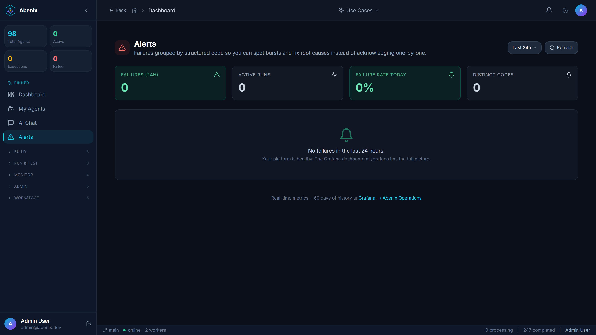
  <br/><em>Alerts page — every failure_code grouped, ack'd, and routable</em>
</p>

---

<a id="tech-stack"></a>
## 🛠 Tech stack

| Layer | Stack |
|---|---|
| Web | Next.js 14, React 18, Tailwind, React Flow, Mermaid, Framer Motion |
| API | FastAPI, SQLAlchemy 2 async, Alembic, asyncpg, Pydantic 2 |
| Runtime | Python 3.12, NATS, Docker / Podman sandbox |
| Edge | Python 3.12 / Rust 1.86 / C (alpine + musl) |
| Data | Postgres 16 (with pgvector), Redis 7, Neo4j, TimescaleDB, mosquitto, S3-compatible storage |
| Observability | Prometheus, Grafana, structlog, OpenTelemetry |
| Deploy | Helm, KEDA, Azure CLI / kubectl |

---

<a id="documentation"></a>
## 📚 Documentation

- **Docs** — [`docs/`](docs/README.md) covers architecture, runtime, SDKs, data model, UI, deployment, how-tos and reference. New in 2.5: [governance](docs/01-architecture/07-governance.md), [decisions](docs/08-howto/09-decisions.md), [warm code runners](docs/02-runtime/16-warm-code-runners.md), [Source Watch](docs/02-runtime/17-source-watch.md), [evaluation suites](docs/02-runtime/18-evaluation-suites.md), [outbound events](docs/02-runtime/19-outbound-events.md), [tool configuration](docs/08-howto/08-tool-configuration.md)
- **In-app help** — every running instance has a `/help` route with the full user guide
- **API reference** — every running instance has `/docs` (FastAPI Swagger)
- **Roadmap** — `NEXT_PLANS.md` in this repo (private mirror)

---

<a id="contributing"></a>
## 🤝 Contributing

We welcome contributions. See `CONTRIBUTING.md` for the quick start, and `CODE_OF_CONDUCT.md` for community guidelines. Good first issues: new tools, new Atlas starter ontologies, new connectors, new edge runtime tool shims.

Found a vulnerability? See `SECURITY.md`. Please don't open a public issue.

---

<a id="license"></a>
## 📄 License

[MIT](LICENSE) — use it, fork it, ship products on top.

---

<p align="center">
  <em>Built by people who got tired of agents that forget.</em>
</p>
