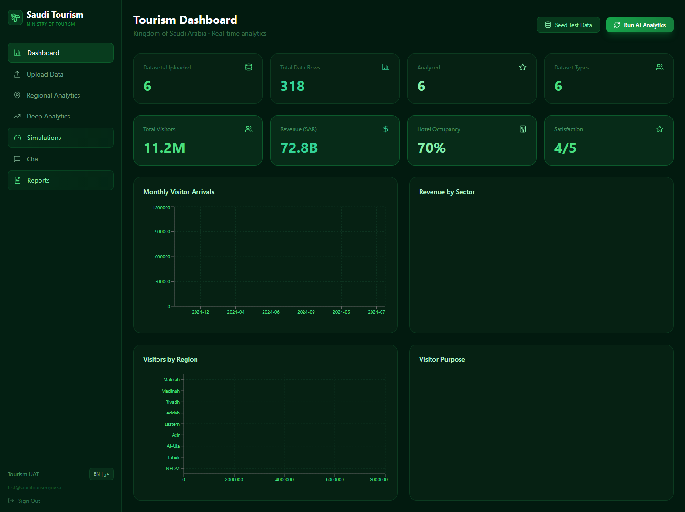
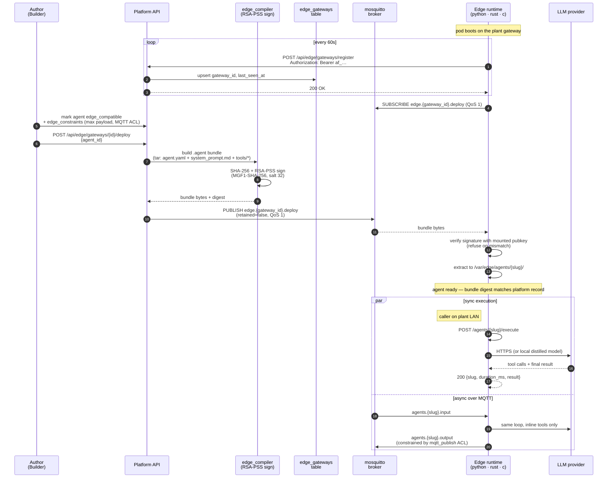

<p align="center">
  
</p>

<h1 align="center">Abenix</h1>

<h3 align="center">The open-source AI agent platform for problems chatbots can't solve.</h3>

<p align="center">
  <em>Graph-grounded knowledge · production-grade orchestration · cloud or edge.</em>
</p>

<p align="center">
  <a href="#why-abenix"><strong>Why Abenix</strong></a> &nbsp;·&nbsp;
  <a href="#architecture"><strong>Architecture</strong></a> &nbsp;·&nbsp;
  <a href="#quick-start"><strong>Quick start</strong></a> &nbsp;·&nbsp;
  <a href="#showcase-apps"><strong>Showcase apps</strong></a> &nbsp;·&nbsp;
  <a href="#deploy-anywhere"><strong>Deploy</strong></a> &nbsp;·&nbsp;
  <a href="#enterprise-readiness"><strong>Enterprise readiness</strong></a>
</p>

<p align="center">
  <a href="LICENSE"></a>
  
  
  
  
</p>

---

## The story

Most AI agent platforms give your agents amnesia — they retrieve documents, forget context, and re-derive the world model on every turn. Most also assume "agent" means "a chatbot in the cloud talking to OpenAI." That's fine for support tickets. It's not fine for a wind turbine, a refrigerated trailer, a contract worth seven figures, or a control room with a 50 ms hard limit.

**Abenix gives agents a brain — and a body.** A typed graph that lives next to the knowledge base so agents traverse evidence like a researcher follows citations. Per-agent runtime pools, multi-signoff approvals, idempotency, and a dead-letter queue so you actually trust them in production. And lean edge runtimes — Python, Rust, or C — that take the same agent definition, sign it into a 12–80 MB bundle, and run it next to the equipment.

Same agent. Same definition. Cloud or edge. Built for the long-running, knowledge-heavy, accountability-mandatory work that workflow tools choke on.

<p align="center">
  
  <br/><em>The Abenix Dashboard — agents, executions, cost, and observability in one place</em>
</p>

---

<a id="why-abenix"></a>
## ✨ Why Abenix

Eight things that, taken together, you do not get anywhere else open-source:

### 1. Graph-grounded knowledge — Atlas + Knowledge Engine

Documents and concepts live on the same canvas. Drop a PDF → multimodal extraction proposes typed nodes and edges with confidence scores. Type a sentence → cardinality inference. Time-slider snapshots the whole graph on every save. Five starter ontologies in the box (FIBO Core, FIX Protocol, EMIR, ISDA, ETRM EOD).

Agents query the graph through four typed tools — `atlas_describe`, `atlas_query`, `atlas_traverse`, `atlas_search_grounded` — and get back **paths of cited evidence**, not three similar paragraphs. The vanilla-RAG comparison:

| Question | Vanilla RAG | Abenix |
|---|---|---|
| *"What caused the Q3 revenue drop?"* | 3 similar paragraphs | `Q3 Report → mentions → supply chain delays → CAUSED_BY → chip shortage` |
| *"Counterparties with > 5 unconfirmed trades in 7 days"* | Cosine miss | Pattern walk over the typed graph, structured rows back |
| *"Why is this contract risky?"* | Generic clause text | Path from clause → similar past clauses → flagged outcomes |

Token cost typically drops **5–10×** because agents read curated evidence, not noisy near-neighbours. Postgres + Neo4j — no extra vector DB to operate.

### 2. The unit of deployment is an agent — not a workflow

Every agent has its own pod pool, KEDA queue-depth scaler, NATS subject, budget cap, and telemetry channel. Flip `dedicated_mode = true` and a single agent gets its own Deployment + ScaledObject. The `/admin/scaling` page projects shared / dedicated / peak cost before you flip.

**Three scaling layers** — three admin screens, no overlap:

| Layer | Bottleneck it solves | Admin UI |
|---|---|---|
| 1. Agents + pods | "the api pod is doing too much agent work" | `/admin/scaling` — per-agent `runtime_pool`, replicas, qps, daily-$-budget |
| 2. Tools | "50 callers each hit Yahoo at the same time" | `/admin/tool-scaling` — per-tool cache, semaphore, qps, breaker, daily call-budget, `inline` vs `runtime` dispatch |
| 3. Pipelines | "which node in this 10-step pipeline is slow?" | `/admin/pipeline-scaling` — DAG view, every node resolved to its pool / tool / control class |

Pipelines don't have their own runtime — they compose Layer 1 (agent nodes route to their own pool) and Layer 2 (tool nodes go through the gate). Full architecture in [`docs/02-runtime/08-queue-scaling.md`](docs/02-runtime/08-queue-scaling.md).

n8n / Zapier / LangGraph are excellent when the problem is *integration-shaped* — "Salesforce row changed, drop a Slack message." Abenix earns its place when the problem is *agent-shaped*: long-running reasoning, shared knowledge, audit-grade traceability, and isolation per tenant under load.

### 3. Real multi-tenancy + actAs delegation

`tenant_id` on every row. Cross-tenant reads return `404`, not `403`. Vector backends enforce the same filter at the index level. Three roles (admin / creator / user) plus per-feature flags via `/api/me/permissions`. `ResourceShare` for cross-team grants.

The killer feature is **actAs**: a SaaS app holding a single platform key serves N end-users by passing `X-Abenix-Subject` on each request. Quotas, audit log, and data isolation all attribute to the right user. Five showcase apps in this repo ride this exact path.

**Sign-in**: email + password works out of the box. Drop in OIDC creds for **Google**, **GitHub**, or **Microsoft** and the login page renders the matching button. SSO-provisioned users get their own tenant on first sign-in. Both flows can coexist on the same email — link a password account to SSO and either continues to work. See [`docs/sso.md`](docs/sso.md) for the 5-minute setup per provider.

**Enterprise knowledge (v2.0)**: document-level ACL on a shared KB, document versioning + supersedes, incremental Cognify, bi-temporal Atlas with as-of queries, embedding-model swap without downtime, OCR + table extraction for scanned docs, GDPR cascade delete with audit receipts, per-tenant encryption at rest. Read-only Cypher tool for agents. The 16-feature v2 reference: [`docs/02-runtime/15-v2-knowledge-enterprise.md`](docs/02-runtime/15-v2-knowledge-enterprise.md).

### 4. Failure-first ops — Pipeline Surgeon, DLQ, idempotency, alerts

Failures are first-class citizens, not exception traces in a log file:

- **Stable `failure_code` taxonomy** (`LLM_RATE_LIMIT`, `SANDBOX_TIMEOUT`, `MODERATION_BLOCKED`, `BUDGET_EXCEEDED`…) on every execution. The `/alerts` page groups by code; Slack + email fan-out via env var.
- **Pipeline Surgeon** — every node crash captures a structured failure-diff. The Surgeon proposes a JSON-Patch (RFC 6902) you Apply or Reject from `/agents/{id}/healing`. Never auto-applied. One-click rollback to `dsl_before`.
- **`Idempotency-Key` header** on `/api/agents/{id}/execute` — replay returns the cached payload for 24 h.
- **Dead-letter queue** at `/admin/dlq` — failed executions land here with one-click replay or discard.
- **Workflow shell** — a 30-verb REPL ("kubectl for pipelines") that drives every change through the same JSON-Patch ledger so audits remain coherent.

### 5. Production primitives, in the box

Connect agents to the systems enterprise ops actually run on, without burning a sprint per integration:

| Primitive | What it lets an agent do |
|---|---|
| **Connector framework + 8 presets** | Call SAP PM / ServiceNow / Maximo / Workday / Sensitech / Carrier Lynx / DTN Weather / BNEF with one tool node + secret-ref auth + `/test` button. |
| **Multi-signoff approval gates** | Block a $40k claim until N humans sign off; TTL enforced; real inbox at `/approvals`. |
| **Time-series + MQTT** | TimescaleDB hypertable, mosquitto broker, plus `tsdb_query` · `mqtt_publish` · `subscribed_feed` · `windowed_state` palette tools. |
| **Idempotency + DLQ + audit** | Replay-safe execute, dead-letter inbox, integrity-hashed audit log per tenant. |
| **Bidirectional writes** | OPC-UA write, MQTT publish, CMMS create-work-order — agents can push setpoints, not just read sensors. |

### 6. Edge runtimes — Python · Rust · C

Cloud-built agents, edge-deployed pods. Mark an agent **Edge eligible** in the Builder, the platform compiles a signed `.agent` bundle (RSA-PSS over a deterministic tar) and ships it over MQTT to a runtime sitting next to the equipment. Three runtime variants for three classes of plant hardware:

| Variant | Image size | Targets | When |
|---|---|---|---|
| **Python** (reference) | ~80 MB | x86_64 / arm64 | Default. Easiest to extend with new tool shims. |
| **Rust** (single static binary) | ~25 MB | x86_64 / arm64 / armv7 | Rugged industrial PCs — Moxa UC-8580, Siemens RUGGEDCOM, Beckhoff CX, NVIDIA Jetson. No Python needed on the box. |
| **C** (musl static) | ~12 MB | armv7 / arm64 / x86_64 | Ultra-constrained gateways — Phoenix Contact PLCnext, Allen-Bradley CompactLogix, OpenWRT, ARM Cortex-A7 with 256 MB RAM. |

Same `.agent` bundle, same MQTT delivery topic, same HTTP contract. Tool budget on edge: `mqtt_publish, mqtt_subscribe, current_time, windowed_state, connector_call, code_executor`. OTA updates via one MQTT message. Bundle tampering refuses to load. The bit nobody else ships.

### 7. Multimodal end-to-end

Drop a PDF, image, audio, video, DOCX, DWG/DXF, GeoJSON, or text file anywhere Abenix accepts uploads. The platform routes the modality to the right provider (Claude / Gemini / GPT-4o for vision, Gemini for audio + video). Field technicians dictate work-order closeouts; vision models read damage photos; agents reason over chart-shaped diagrams.

### 8. One Helm chart, observability inside

`helm install abenix ./infra/helm/abenix` deploys api + web + workers + per-agent-pool runtimes + Postgres + Redis + Neo4j + NATS + KEDA + mosquitto + TimescaleDB + Prometheus + Grafana + ingress. Every pod exposes `/metrics`. The `/alerts` page groups by `failure_code`. Slack + email fan-out via env var.

Same chart on AKS, EKS, GKE, minikube, bare metal. MIT license. Self-host without vendor handcuffs.

---

<a id="architecture"></a>
## 🏗 Architecture

Three independently scalable tiers that share one Postgres, plus an optional edge fleet:


```mermaid
flowchart LR
    subgraph CTRL["Control plane · cluster"]
        WEB["apps/web<br/>Next.js<br/>builder · /edge<br/>/admin · /alerts"]
        API["apps/api<br/>FastAPI<br/>auth · RBAC · actAs"]
        EXEC["agent runtime<br/>per-pool pods<br/>KEDA-scaled"]
        TOOLS["100+ tools<br/>connectors · MQTT<br/>code-asset sandbox"]
        DB[("Postgres + pgvector<br/>+ Neo4j<br/>agents · gateways<br/>connectors · approvals")]
        MQ[("mosquitto<br/>edge.{gw}.deploy")]
        TSDB[("TimescaleDB<br/>hypertables")]
        NATS[("NATS JetStream<br/>at-least-once")]
        OBS["Prometheus + Grafana<br/>structured failure codes<br/>Slack + email"]
        WEB --> API --> NATS --> EXEC --> TOOLS
        API --> DB
        EXEC --> DB
        API <--> MQ
        API <--> TSDB
        EXEC -.metrics.-> OBS
        API -.metrics.-> OBS
    end

    subgraph EDGE["Plant edge · optional"]
        RT["edge runtime<br/>(python · rust · c)<br/>:8080"]
        BUNDLES["/var/edge/agents/<br/>signed .agent bundles"]
        EQUIP[("Equipment<br/>OPC-UA · Modbus · MQTT")]
        EQUIP <--> RT --> BUNDLES
    end

    USER([User / SDK]) --> WEB
    USER --> API
    EXEC --> LLM[("LLM provider<br/>Anthropic · OpenAI<br/>Google · MCP")]
    API -- ".agent bundle (signed)" --> MQ
    MQ -- "edge.{gw}.deploy<br/>QoS 1" --> RT
    RT -- "register every 60s<br/>Bearer af_…" --> API
    RT --> LLM

    classDef ctl fill:#0f172a,stroke:#22d3ee,color:#e0f2fe;
    classDef edge fill:#1c1917,stroke:#fb923c,color:#fed7aa;
    classDef ext fill:#1e1b4b,stroke:#a78bfa,color:#ddd6fe;
    class WEB,API,EXEC,TOOLS ctl;
    class DB,MQ,TSDB,NATS,OBS ctl;
    class RT,BUNDLES,EQUIP edge;
    class LLM,USER ext;
```

**Control plane.** Stateless API + web tiers in front. The agent runtime scales horizontally per agent type via KEDA queue-depth scaling on NATS — when `RUNTIME_MODE=remote` the API never executes agent code itself, it publishes a job and waits.

**Transport.** NATS for at-least-once internal delivery + replay. mosquitto for MQTT triggers, agent-published topics, and signed bundle delivery to edge gateways. TimescaleDB for time-series ingest the agents read with `tsdb_query`.

**Edge fleet.** One helm install per gateway. The runtime registers itself with the platform every 60 seconds, subscribes to `edge.{gateway_id}.deploy`, and hot-loads any signed bundle for an agent the platform has flagged `edge_compatible`. RSA-PSS signature verification gates every load.

---

<a id="quick-start"></a>
## ⚡ Quick start

| Goal | Command | Time |
|---|---|---|
| **Localhost** — docker-compose for infra, then npm dev for api + web + 5 standalone apps | `bash scripts/dev-local.sh` | ~5 min first run |
| **Production-shape on your laptop** — full Helm chart on minikube | `bash scripts/deploy.sh local` | ~10 min |
| **Minikube + auto-port-forward** | `bash scripts/dev-minikube.sh` | ~10 min |
| **Azure AKS** — provisions RG + ACR + AKS, builds + pushes images, helm-installs the stack, runs migrations + seeds | `bash scripts/deploy-azure.sh deploy` | ~25 min |

```bash
git clone https://github.com/sarkar4777/abenix.git
cd abenix
cp .env.example .env       # fill in at least one of ANTHROPIC / OPENAI / GOOGLE
bash scripts/dev-local.sh
```

Open http://localhost:3000 and sign in with `admin@abenix.dev` / `Admin123456`.

### Demo credentials

| App | URL (local) | Credential |
|---|---|---|
| Abenix core | http://localhost:3000 | `admin@abenix.dev` / `Admin123456` |
| Saudi Tourism | http://localhost:3002 | `test@sauditourism.gov.sa` / `TestPass123!` |
| Industrial-IoT | http://localhost:3003 | platform login |
| ResolveAI | http://localhost:3004 | `agent@resolveai.local` / `agent123` |
| ClaimsIQ | http://localhost:3005 | platform login |

Same accounts work on the AKS UAT cluster.

### Required env vars

At least one LLM key — Anthropic (recommended), OpenAI, or Google. The full list lives in `.env.example`. For Kubernetes, set the same keys in `infra/helm/abenix/values-*.yaml`.

---

<a id="showcase-apps"></a>
## 🎯 Showcase apps

Five reference apps ship in this repo. Each one is a real product surface — every line of business logic flows through the platform via the SDK + actAs pattern. All five auto-start with `dev-local.sh` and auto-deploy with `deploy-azure.sh`.

### OracleNet — strategic decision-analysis

A 7-agent pipeline inside the main web app. Type a strategic decision in plain English, get back a **Decision Brief** with 6 tabs (Summary · Stakeholders · Scenarios · Risks · Cascade · Provenance) plus a recommendation card and a confidence score. A `depth_router` Python node prunes the DAG to 3 / 5 / 7 agents based on `context.depth`. Exports as PDF / DOCX / Markdown.

*Why it's interesting.* Big decisions usually fail because nobody seriously simulated who would oppose them. OracleNet bakes Stakeholder Sim, Second-Order, and Contrarian into every brief.

<p align="center">
  
  <br/><em>OracleNet Decision Brief — confidence + recommendation card, 6 tabs</em>
</p>

### Saudi Tourism — Vision-2030 analytics

A standalone analytics app for the Saudi Ministry of Tourism. 5 agents, 7 pages (Dashboard · Regional · Analytics · Chat NLQ · Reports · Simulations · Upload), 5 report templates, 5 simulator presets. Test data is baked into the API image — no manual seed.

*Why it's interesting.* Vision-2030 ministries need to track 100M-visitor targets, regional revenue, and seasonal demand against the actual data they already have — without a year-long BI buildout.

<p align="center">
  
  <br/><em>Saudi Tourism dashboard — KPIs computed live from baked test data</em>
</p>

### ClaimsIQ — insurance claim adjudication (Java)

A Java/Vaadin showcase that proves the **Java SDK is feature-complete**. 6-stage `claimsiq-adjudicate` pipeline (FNOL Intake → Policy Match → Damage Assess → Fraud Screen → Valuator → Claim Decider) with photo upload routed to vision models and a live DAG view streaming over SSE.

*Why it's interesting.* Claim shops want explainable adjudication — every decision must cite the policy clause it relied on. The Java SDK's public surface is stdlib-only (JDK 21 `HttpClient`, Jackson, SLF4J) so Kotlin and Scala consumers get zero glue.

<p align="center">
  
  <br/><em>ClaimsIQ — final adjudication with cited clauses, fraud score, live DAG</em>
</p>

### Industrial-IoT — predictive maintenance + cold chain + edge

Six tabs covering the highest-frequency industrial use cases:

- **Pump Vibration** — DSP feature extractor + RUL regressor (sandboxed Python code-assets), severity classifier, work-order drafter. Plus a **Run on the edge** section that compiles + signs + ships a Haiku agent to a Rust gateway and runs FFT/RMS through `code_executor` locally.
- **Cold Chain** — excursion corrector (Python code-asset), excursion adjudicator over pharma SOP KB, partial-loss claim drafter. CMMS connector picker for live mode.
- **Design Studio** — engineering & EPC copilot with 9-node DAG, deterministic CapEx/LCOE recompute, 3 ranked design scenarios.
- **Field Guide** — wind-farm maintenance copilot with photo-upload damage assessment, OEM-cited repair procedure, OR-tools 7-day technician scheduler.
- **Alarm Desk** — ops control-room alarm triage with SCADA-severity override, cascade banner, 4-stage safe-reset advisor behind a 2-signoff approval gate.
- **Architecture** — in-product UAT guide; every scenario card links its seeded pipeline + KB collection.

*Why it's interesting.* Two adjacent industrial domains, one platform. Every tab has a **Live mode** toggle that flips it from synthetic data to live MQTT + connector + TSDB feeds. The Pump tab is the end-to-end edge demo — bundle digest, agent slug, gateway, latency comparison vs cloud pipeline.

<p align="center">
  
  <br/><em>Industrial-IoT — pump tab after both code assets deployed, with edge runtime panel</em>
</p>

### ResolveAI — customer-resolution case management

Four pipelines on the same case data: Inbound Resolution (6-agent), SLA Sweep (cron), Post-QA (on case close), Trend Mining (weekly). Refund tiers + escalation paths + tone guidelines live in a seeded KB.

*Why it's interesting.* Customer-service teams drown in repetitive triage; their highest-leverage moves (deflection, tone calibration, trend detection) get neglected. ResolveAI runs all four loops continuously while a human stays in approve / takeover mode.

<p align="center">
  
  <br/><em>ResolveAI — case detail with inbound-resolution DAG and cited policy</em>
</p>

---

## 🛰 Edge runtimes

The edge story in three lines: download a runtime → mint an `af_` token → helm-install on the gateway. The pod registers within 60 seconds and shows up on the platform's `/edge` page.

### How a cloud agent reaches the edge


```mermaid
sequenceDiagram
    autonumber
    participant Author as Author<br/>(Builder)
    participant API as Platform API
    participant Compiler as edge_compiler<br/>(RSA-PSS sign)
    participant DB as edge_gateways<br/>table
    participant MQTT as mosquitto<br/>broker
    participant Edge as Edge runtime<br/>(python · rust · c)
    participant LLM as LLM provider

    Note over Edge: pod boots on the plant gateway
    loop every 60s
      Edge->>API: POST /api/edge/gateways/register<br/>Authorization: Bearer af_…
      API->>DB: upsert gateway_id, last_seen_at
      API-->>Edge: 200 OK
    end
    Edge->>MQTT: SUBSCRIBE edge.{gateway_id}.deploy (QoS 1)

    Author->>API: mark agent edge_compatible<br/>+ edge_constraints (max payload, MQTT ACL)
    Author->>API: POST /api/edge/gateways/{id}/deploy<br/>{agent_id}
    API->>Compiler: build .agent bundle<br/>(tar: agent.yaml + system_prompt.md + tools/*)
    Compiler->>Compiler: SHA-256 + RSA-PSS sign<br/>(MGF1-SHA-256, salt 32)
    Compiler-->>API: bundle bytes + digest
    API->>MQTT: PUBLISH edge.{gateway_id}.deploy<br/>(retained=false, QoS 1)
    MQTT-->>Edge: bundle bytes
    Edge->>Edge: verify signature with mounted pubkey<br/>(refuse on mismatch)
    Edge->>Edge: extract to /var/edge/agents/{slug}/

    Note over Edge: agent ready — bundle digest matches platform record

    par sync execution
      Note left of Edge: caller on plant LAN
      Edge->>Edge: POST /agents/{slug}/execute
      Edge->>LLM: HTTPS (or local distilled model)
      LLM-->>Edge: tool calls + final result
      Edge-->>Edge: 200 {slug, duration_ms, result}
    and async over MQTT
      MQTT->>Edge: agents.{slug}.input
      Edge->>LLM: same loop, inline tools only
      Edge->>MQTT: agents.{slug}.output<br/>(constrained by mqtt_publish ACL)
    end
```

**The cohesive story.** Cloud authoring, signed delivery, edge execution. The `.agent` bundle is the *only* mutable artefact crossing the trust boundary — it's RSA-PSS signed at compile time, verified at every load, and constrained by a tool whitelist that's enforced twice (once by the compiler, once by the runtime). MQTT is the default transport because plants already have a broker; HTTP is the fallback when MQTT publish fails. Tool budget on edge is deliberately small — `mqtt_publish, mqtt_subscribe, current_time, windowed_state, connector_call, code_executor` — so an agent that needs `knowledge_search` or `atlas_*` can't accidentally be edge-deployed and stall on a missing dependency. Every gateway re-registers on a 60-second loop, so a network blip just delays the next OTA update — nothing is permanently broken by an offline window.

### Pick a variant

The `/edge` page renders three colour-coded cards with copy-to-clipboard install commands, or hit the unauthenticated `GET /api/edge/runtime/download` for the JSON manifest.

```bash
# Python (default — works everywhere with python3.12+)
helm install abenix-edge ./infra/helm/edge-runtime -n abenix-edge \
  --set platform.url=$PLATFORM_URL \
  --set platform.token=$EDGE_TOKEN \
  --set gateway.id=$GATEWAY_ID

# Rust (rugged industrial PCs — single static binary)
helm install abenix-edge-rust ./infra/helm/edge-runtime-rust -n abenix-edge ...

# C (low-RAM PLCs / OpenWRT — musl static)
helm install abenix-edge-c ./infra/helm/edge-runtime-c -n abenix-edge ...
```

Bare-docker install (no Kubernetes on the gateway):

```bash
docker run -d --name abenix-edge \
  -e PLATFORM_URL=$PLATFORM_URL \
  -e PLATFORM_TOKEN=$EDGE_TOKEN \
  -e GATEWAY_ID=$GATEWAY_ID \
  -e MQTT_URL=mqtt://mqtt.your-plant:1883 \
  -e ANTHROPIC_API_KEY=$ANTHROPIC_API_KEY \
  -p 8080:8080 \
  agentforge/edge-runtime:latest          # or :rust, :c — variant in the image name
```

### Lifecycle

| Step | Where | What happens |
|---|---|---|
| 1. Mint token | platform UI → API Keys | `af_…` key with scopes `agents:execute, edge:register` |
| 2. Helm-install | plant gateway | runtime calls `POST /api/edge/gateways/register` every 60 s with `Authorization: Bearer af_…` |
| 3. Mark agent edge-eligible | Builder → Advanced | tool whitelist + `edge_constraints` (max payload, max runtime, MQTT topic ACLs) |
| 4. Deploy | `/edge` → gateway card → Deploy agent | platform compiles signed `.agent` bundle, publishes to `edge.{gateway_id}.deploy` |
| 5. Hot-load | runtime | RSA-PSS verify → extract to `/var/edge/agents/{slug}/` → ready to execute |
| 6. Call | sync `POST {gateway}/agents/{slug}/execute` or async via MQTT topic `agents.{slug}.input` | tool calls run locally; only `mqtt_publish` ACL'd topics escape the edge |

The full bundle format (manifest schema, signing math, failure modes) is documented in-product at `/help → Edge runtimes`.

---

<a id="deploy-anywhere"></a>
## 📦 Deploy anywhere

```bash
# Local development — docker-compose + npm dev + 5 standalones
bash scripts/dev-local.sh

# Minikube — full Helm chart, production architecture on your laptop
bash scripts/deploy.sh local

# Azure AKS — provision + build + deploy + seed + smoke (idempotent, re-run any phase)
bash scripts/deploy-azure.sh deploy

# Any other cloud — same chart on EKS / GKE / bare metal
helm install abenix ./infra/helm/abenix -n abenix --create-namespace \
  --set image.tag=latest \
  --set ingress.host=abenix.your-domain.com
```

`deploy-azure.sh` handles ACR provisioning, image build + push, AKS credentials, helm install, KEDA install, neo4j password setup, agent + KB seeds, standalone-key reconciliation, and a smoke test. `bash scripts/portforward-azure.sh` brings any AKS deployment to `localhost:*` for firewall-safe local browsing.

To deploy a particular edge runtime variant alongside the platform, set `EDGE_RUNTIME_VARIANT={python|rust|c}` (default `python`) or `EDGE_RUNTIME_ALL_VARIANTS=true` to install all three.

---

## 🔌 Build on top of Abenix

Three SDKs ship in the box — Python, TypeScript, and Java. Same wire format (`X-Abenix-Subject` for actAs delegation) so a SaaS app holding one platform key can serve N end-users with full quota and audit isolation.

```java
try (Abenix forge = Abenix.builder()
        .baseUrl(System.getenv("ABENIX_API_URL"))
        .apiKey(System.getenv("CLAIMSIQ_ABENIX_API_KEY"))
        .actAs(new ActingSubject("claimsiq", userId, email, name))
        .build()) {
    ExecutionResult res = forge.execute("claimsiq-adjudicate",
        Map.of("claim_id", claimId, "claim_type", "auto"));
    System.out.println(res.output());
}
```

The Java SDK's public surface is stdlib-only (JDK 21 `HttpClient`, Jackson, SLF4J) — Kotlin and Scala consumers need zero glue. ClaimsIQ in this repo is the reference consumer.

---

<a id="enterprise-readiness"></a>
## 🛡 Enterprise readiness

| Concern | What ships |
|---|---|
| **Tenant isolation** | `tenant_id` on every row; cross-tenant reads return `404`, not `403`. Vector backends enforce the same filter at the index level. |
| **RBAC + multiplexing** | 3 roles (admin / creator / user) + per-feature flags via `/api/me/permissions`. `ResourceShare` for cross-team grants. **actAs** delegation for SaaS apps. |
| **Auth** | Email + bcrypt, JWT with refresh, per-key scopes (`execute`, `read`, `write`, `can_delegate`), API keys SHA-256-hashed at rest. |
| **Moderation + DLP** | Pre-LLM gate on input + post-LLM gate on output. Actions: `block`, `redact`, `flag`, `allow`. Tenant-scoped, non-bypassable. |
| **Quotas + budgets** | Per-tenant + per-user monthly USD cap, executions/day, tokens/day. Overage returns `BUDGET_EXCEEDED`. |
| **Approvals** | Multi-signoff `approval_gate` with TTL — block any agent action behind N humans. Real inbox at `/approvals`. |
| **Audit log + GDPR** | Every execution, tool call, KB query, atlas mutation, role change — tenant-scoped, integrity-hashed. Per-tenant data export, soft delete + scheduled hard purge, configurable retention. |
| **Observability** | Prometheus + Grafana bundled. Stable failure codes (`LLM_RATE_LIMIT`, `SANDBOX_TIMEOUT`, `MODERATION_BLOCKED`). `/alerts` page groups by code. Slack + email fan-out via env var. **v1.4 adds per-resource invocation log:** every `code_asset` pod run + `ml_model` prediction + `knowledge_search` query persists to dedicated tables with input/output/duration/cost/predicted-class — Invocations tab on `/code-runner` and `/ml-models` streams new rows live via SSE. Tempo-backed distributed traces (v1.5+) link agent → tool → LLM spans end-to-end. |
| **Archives** | Recording tables (invocations / executions / messages / activity_logs) auto-archive nightly to gzip'd JSONL on a hostPath PV. Admin-editable retention per table (defaults: 30d invocations, 60d executions, 90d audit). Manifest + sha256 in `archive_runs`. Manual trigger + download at `/admin/archives`. |
| **Idempotency + DLQ** | `Idempotency-Key` header → 24 h replay cache. Failed executions land in `/admin/dlq` with one-click replay. |
| **Edge security** | RSA-PSS / SHA-256 signed `.agent` bundles. Tampering refuses to load. Tool whitelist enforced at compile and load. MQTT publish constrained by per-agent ACL. |
| **HA + self-host** | Stateless API + web; per-pool runtimes with KEDA autoscaling; NATS for at-least-once + replay; stale-execution sweeper. One Helm chart on AKS / minikube / EKS / GKE. MIT license. |

<p align="center">
  
  <br/><em>Alerts page — every failure_code grouped, ack'd, and routable</em>
</p>

---

## 🛠 Tech stack

| Layer | Stack |
|---|---|
| Web | Next.js 14, React 18, Tailwind, React Flow, Mermaid, Framer Motion |
| API | FastAPI, SQLAlchemy 2 async, Alembic, asyncpg, Pydantic 2 |
| Runtime | Python 3.12, NATS, Docker / Podman sandbox |
| Edge | Python 3.12 / Rust 1.86 / C (alpine + musl) |
| Data | Postgres 16 (with pgvector), Redis 7, Neo4j, TimescaleDB, mosquitto, S3-compatible storage |
| Observability | Prometheus, Grafana, structlog, OpenTelemetry |
| Deploy | Helm, KEDA, Azure CLI / kubectl |

---

## 📚 Documentation

- **In-app help** — every running instance has a `/help` route with the full user guide
- **API reference** — every running instance has `/docs` (FastAPI Swagger)
- **Roadmap** — `NEXT_PLANS.md` in this repo (private mirror)

---

## 🤝 Contributing

We welcome contributions. See `CONTRIBUTING.md` for the quick start, and `CODE_OF_CONDUCT.md` for community guidelines. Good first issues: new tools, new Atlas starter ontologies, new connectors, new edge runtime tool shims.

Found a vulnerability? See `SECURITY.md`. Please don't open a public issue.

---

## 📄 License

[MIT](LICENSE) — use it, fork it, ship products on top.

---

<p align="center">
  <em>Built by people who got tired of agents that forget.</em>
</p>
