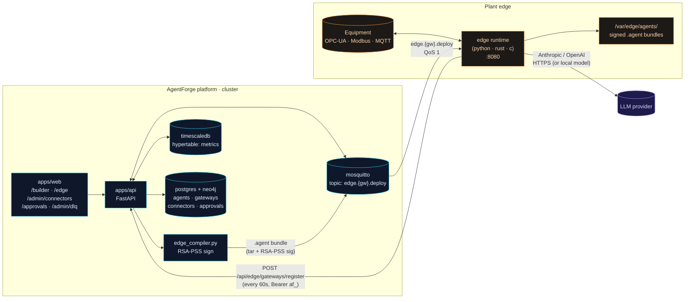
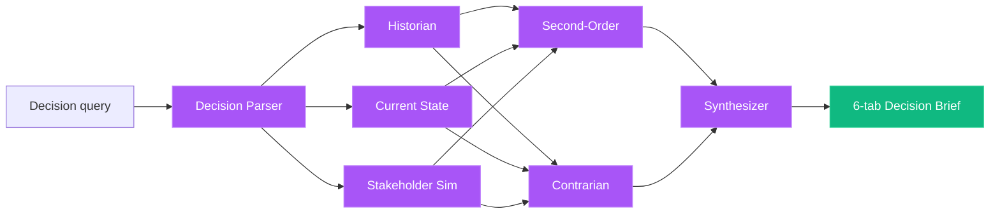
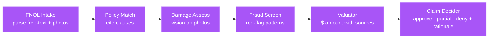
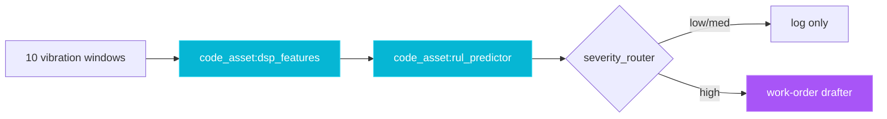
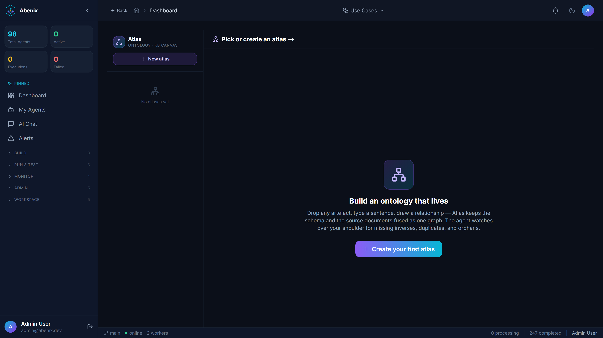
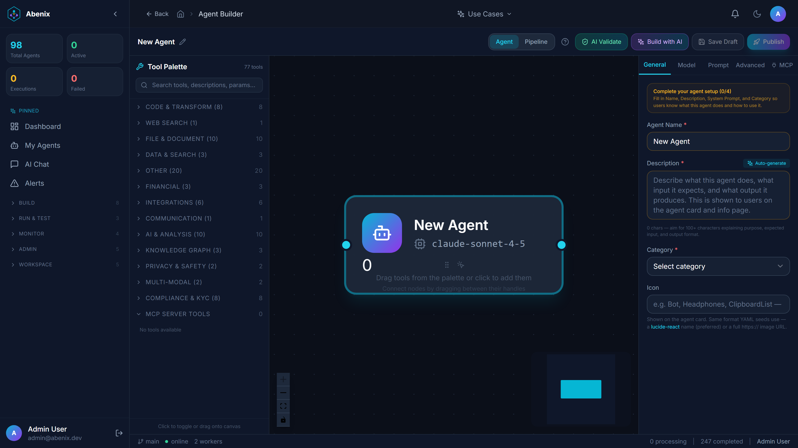
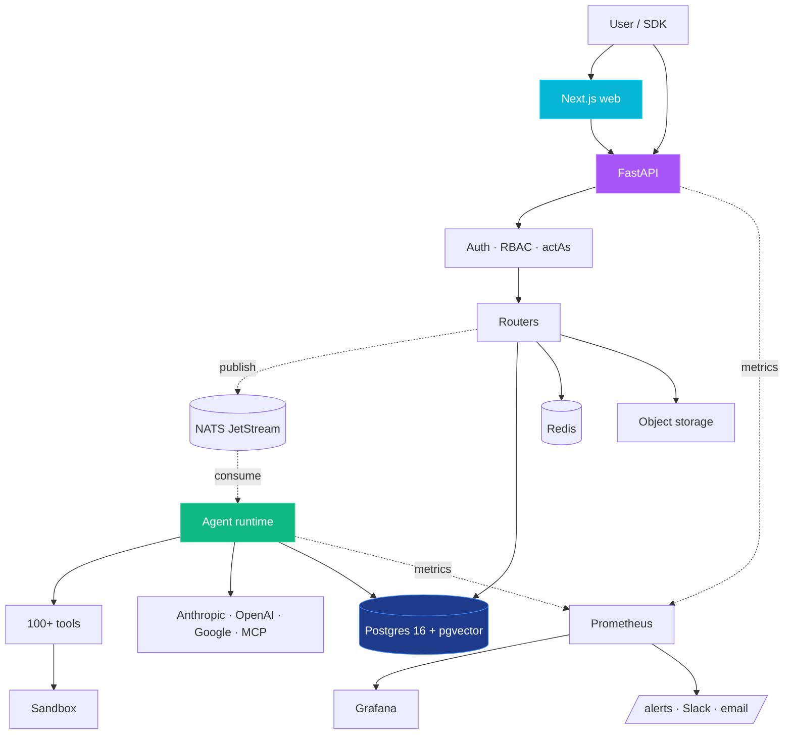

<p align="center">
  
</p>

<h1 align="center">Abenix</h1>

<h3 align="center">The open-source AI agent platform — graph-grounded knowledge, production-grade orchestration, cloud or edge.</h3>

<p align="center">
  <a href="#-highlights"><strong>Highlights</strong></a> &nbsp;·&nbsp;
  <a href="#-architecture"><strong>Architecture</strong></a> &nbsp;·&nbsp;
  <a href="#-quick-start"><strong>Quick start</strong></a> &nbsp;·&nbsp;
  <a href="#-edge-runtimes"><strong>Edge runtimes</strong></a> &nbsp;·&nbsp;
  <a href="#-what-makes-abenix-different"><strong>Why Abenix</strong></a> &nbsp;·&nbsp;
  <a href="#-showcase-apps"><strong>Showcase apps</strong></a> &nbsp;·&nbsp;
  <a href="#-deploy-anywhere"><strong>Deploy</strong></a>
</p>

<p align="center">
  <a href="LICENSE"></a>
  
  
  
  
</p>

---

## TL;DR

Most AI agent platforms give your agents amnesia — they retrieve documents, forget context, and re-derive the world model on every turn. Most also assume "agent" means "a chatbot in the cloud talking to OpenAI." That's fine for support tickets. It's not fine for a wind turbine, a refrigerated trailer, or a control room with a 50 ms hard limit.

**Abenix gives agents a brain — and a body.** A typed graph that lives next to your knowledge base, agents that traverse it like a researcher follows citations, multi-signoff approval gates and dead-letter replay so you actually trust them in production, *and* lean edge runtimes (Python / Rust / C) that take any agent flagged "edge-eligible," compile it into a signed `.agent` bundle, and run it next to the equipment. Same agent definition. Cloud or edge.

<p align="center">
  
  <br/><em>The Abenix Dashboard — agents, executions, cost, and observability in one place</em>
</p>

> **Enterprise-ready.** Multi-tenant by design with hard SQL-level isolation. RBAC + per-resource sharing + actAs delegation for SaaS multiplexing. SHA-256-hashed API keys with per-key scopes + revocation. Pre-/post-LLM moderation with DLP redaction. Per-tenant + per-user budget caps. GDPR-friendly retention with hard purge. SOC 2 telemetry stack pre-wired (Prometheus + Grafana + structured failure codes + Slack/email fan-out). Helm chart deploys to AKS + minikube today, the same chart runs on EKS / GKE with a values override. Connectors, multi-signoff approvals, idempotency, dead-letter replay, time-series + MQTT primitives, and signed edge-bundle delivery are all in the box.

---

## ✨ Highlights

Five things ship together — each one is what someone hits when they try to put an LLM agent in front of real ops:

| Primitive | The reason | Where it lives |
|---|---|---|
| **Connector framework + 8 presets** | "How do I call SAP PM / ServiceNow / Maximo / Workday from an agent without burning a sprint per integration?" Secret-ref auth, `/test` button, retry policy, drop-down inside the agent builder. | `/admin/connectors` · `connector_call` palette tool · 8 YAMLs in [`packages/db/seeds/connector_presets/`](packages/db/seeds/connector_presets/) |
| **Multi-signoff approval gates** | "An agent is about to file a $40k claim — I need two humans to sign off, and the gate has to expire if they don't." Pipeline node, real inbox at `/approvals`, TTL enforced. | `/approvals` · `approval_gate` palette tool |
| **Time-series + MQTT primitives** | "My agent needs to read 24 h of pump vibration, publish a setpoint to a topic, and subscribe to a third-party feed." TimescaleDB hypertable, mosquitto broker, `tsdb_query` + `mqtt_publish` + `subscribed_feed` + `windowed_state` palette tools. | `tsdb_query` · `mqtt_publish` · `windowed_state` · `subscribed_feed` |
| **Idempotency + DLQ** | "I retried because the network blipped — I do NOT want two work orders." `Idempotency-Key` header → 24h replay; failed executions land in `/admin/dlq` with one-click replay. | every `/execute` endpoint · `/admin/dlq` |
| **Edge runtimes — Python · Rust · C** | "I want this agent on the SCADA VLAN with no internet, on a Moxa UC-8580, or on a Phoenix Contact PLC with 256 MB of RAM." Signed `.agent` bundle, OTA via MQTT, three runtime variants for three classes of plant hardware. | `/edge` · [`apps/edge-runtime/`](apps/edge-runtime/) · [`apps/edge-runtime-rust/`](apps/edge-runtime-rust/) · [`apps/edge-runtime-c/`](apps/edge-runtime-c/) |

Plus: live-mode toggles on every IoT showcase tab (synthetic ↔ live MQTT/TSDB/connectors), and a fully-wired pump-vibration-on-edge demo that compiles + signs + ships a Haiku agent to a Rust pod and runs FFT/RMS through `code_executor` locally.

Full release notes: [`RELEASE_NOTES_PENDING.md`](RELEASE_NOTES_PENDING.md). In-product docs: **/help → Production tools**.

---

## 🏗 Architecture


```mermaid
flowchart LR
    subgraph CTRL["AgentForge platform · cluster"]
        WEB["apps/web<br/>/builder · /edge<br/>/admin/connectors<br/>/approvals · /admin/dlq"]
        API["apps/api<br/>FastAPI"]
        COMP["edge_compiler.py<br/>RSA-PSS sign"]
        MQTT[("mosquitto<br/>topic: edge.{gw}.deploy")]
        TSDB[("timescaledb<br/>hypertable: metrics")]
        DB[("postgres + neo4j<br/>agents · gateways<br/>connectors · approvals")]
        WEB --> API
        API --> COMP
        API --> DB
        API <--> MQTT
        API <--> TSDB
    end

    subgraph EDGE["Plant edge"]
        RT["edge runtime<br/>(python · rust · c)<br/>:8080"]
        BUNDLES["/var/edge/agents/<br/>signed .agent bundles"]
        EQUIP[("Equipment<br/>OPC-UA · Modbus · MQTT")]
        RT --> BUNDLES
        EQUIP <--> RT
    end

    COMP -- ".agent bundle<br/>(tar + RSA-PSS sig)" --> MQTT
    MQTT -- "edge.{gw}.deploy<br/>QoS 1" --> RT
    RT -- "POST /api/edge/gateways/register<br/>(every 60s, Bearer af_)" --> API
    RT -- "Anthropic / OpenAI<br/>HTTPS (or local model)" --> LLM[("LLM provider")]

    classDef ctl fill:#0f172a,stroke:#22d3ee,color:#e0f2fe;
    classDef edge fill:#1c1917,stroke:#fb923c,color:#fed7aa;
    classDef ext fill:#1e1b4b,stroke:#a78bfa,color:#ddd6fe;
    class WEB,API,COMP ctl;
    class MQTT,TSDB,DB ctl;
    class RT,BUNDLES,EQUIP edge;
    class LLM ext;
```

Three-layer model: **control plane** (web + api + signing + state), **transport** (MQTT for OTA + telemetry, TSDB for time-series), **edge fleet** (one helm install per gateway, runs the same `.agent` regardless of the runtime variant). Bundle delivery is MQTT-first with HTTP fallback. Auth uses `af_`-prefixed API keys via `Authorization: Bearer`.

---

## ⚡ Quick start

Pick the path that matches what you want to do:

| Goal | Command | Time |
|---|---|---|
| **Localhost in ~60 s** — docker-compose for Postgres / Redis / Neo4j / NATS, then npm dev for api + web + 5 standalone apps | `bash scripts/dev-local.sh` | ~5 min first run |
| **Production-shape on your laptop** — full Helm chart on a local minikube cluster | `bash scripts/deploy.sh local` | ~10 min |
| **Minikube fast-demo** — auto-starts minikube and forwards every service to localhost | `bash scripts/dev-minikube.sh` | ~10 min |
| **AKS (Azure)** — provisions RG + ACR + AKS, builds + pushes images, helm-installs the stack, runs migrations + seeds + standalone-key reconcile | `bash scripts/deploy-azure.sh deploy` | ~25 min |
| **AKS port-forwards** — bring an already-deployed AKS cluster to `localhost:*` (firewall-safe) | `bash scripts/portforward-azure.sh` | <30 s |

```bash
git clone https://github.com/sarkar4777/abenix.git
cd abenix
cp .env.example .env       # local-dev defaults; fill in LLM keys
bash scripts/dev-local.sh
```

Open http://localhost:3000 and sign in.

### Run with infra

`dev-local.sh` now also boots two new services that the production-tooling primitives depend on:

| Service | Image | Local port | Used by |
|---|---|---|---|
| **mosquitto** (MQTT broker) | `eclipse-mosquitto:2` | `1883` | MQTT triggers, MQTT publish tool, edge runtime upstream |
| **timescaledb** (time-series DB) | `timescale/timescaledb:latest-pg16` | `5433` | `tsdb_query` tool, IoT showcase live-mode |

Both come up as part of the same `docker-compose up` invocation `dev-local.sh` issues. Port `5433` is used so the new TSDB doesn't collide with the platform Postgres on `5432`. First boot pulls ~80 MB of additional images.

To wire connectors locally, open `/admin/connectors` after sign-in, click **+ New connector**, pick a kind (cmms / hris / telematics / standards / market-data / custom), point at any reachable URL (the bundled mock servers under `infra/mocks/` cover SAP / ServiceNow / Sensitech / BNEF for offline development), and click **Test**. The connector then becomes selectable in the agent Builder under the **Knowledge → Connectors** sub-tab.

## 🛰 Edge runtimes

Three runtime variants ship — same `.agent` bundle format, same MQTT delivery topic, same HTTP contract. Pick the one that matches the plant hardware:

| Variant | Image | Size | Targets | When to use |
|---|---|---|---|---|
| **Python** (reference) | `agentforge/edge-runtime` | ~80 MB | `x86_64-linux`, `arm64-linux` | Default. Best LLM SDK ergonomics, easiest to extend with new tool shims. Runs on any box that already has python3.12+. |
| **Rust** (single static binary) | `agentforge/edge-runtime-rust` | ~25 MB | `x86_64-linux`, `arm64-linux`, `armv7-linux` | Rugged industrial PCs (Moxa UC-8580, Siemens RUGGEDCOM, Beckhoff CX series), NVIDIA Jetson. No Python interpreter required on the box. |
| **C** (musl static) | `agentforge/edge-runtime-c` | ~12 MB | `armv7-linux`, `arm64-linux`, `x86_64-linux` | Ultra-constrained gateways (Allen-Bradley CompactLogix, Phoenix Contact PLCnext, OpenWRT routers, ARM Cortex-A7 with 256–512 MB RAM). |

### Download / install

The platform exposes `GET /api/edge/runtime/download` (no auth) — returns the helm-install command + docker-pull command for each variant. The `/edge` page in the web UI renders this as three cards with copy-to-clipboard buttons. Manual install:

```bash
# Python (default — works everywhere)
helm install abenix-edge ./infra/helm/edge-runtime -n abenix-edge \
  --set platform.url=$PLATFORM_URL --set platform.token=$EDGE_TOKEN --set gateway.id=$GW

# Rust (rugged industrial PCs)
helm install abenix-edge-rust ./infra/helm/edge-runtime-rust -n abenix-edge \
  --set platform.url=$PLATFORM_URL --set platform.token=$EDGE_TOKEN --set gateway.id=$GW

# C (low-RAM PLCs / OpenWRT)
helm install abenix-edge-c ./infra/helm/edge-runtime-c -n abenix-edge \
  --set platform.url=$PLATFORM_URL --set platform.token=$EDGE_TOKEN --set gateway.id=$GW
```

Without Helm (bare docker on a plant gateway):

```bash
docker run -d --name abenix-edge \
  -e PLATFORM_URL=$PLATFORM_URL \
  -e PLATFORM_TOKEN=$EDGE_TOKEN \
  -e GATEWAY_ID=$GW \
  -e MQTT_URL=mqtt://mqtt.your-plant:1883 \
  -e ANTHROPIC_API_KEY=$ANTHROPIC_API_KEY \
  -p 8080:8080 \
  agentforge/edge-runtime:latest          # or :rust, :c — variant suffix lives in the image name
```

### How a gateway gets created in AgentForge

1. **Mint a registration token.** From the platform UI: **API Keys → New key**, scopes `agents:execute, edge:register`. The `af_…` value is the gateway's `PLATFORM_TOKEN`.
2. **Helm-install the runtime variant** (commands above) with `platform.token` set to that key. The pod boots, calls `POST /api/edge/gateways/register` every 60 s with `Authorization: Bearer af_…`. The first call inserts a row in `edge_gateways`; subsequent calls bump `last_seen_at`. The gateway shows up immediately in the platform UI under `/edge` → **Registered gateways**.
3. **Pick an agent → Compile bundle → Deploy.** From `/edge`, click a gateway card → **Deploy agent** → pick from the list of `edge_compatible: true` agents. The platform compiles the `.agent` bundle (RSA-PSS signed), publishes to `edge.{gateway_id}.deploy` over MQTT (HTTP POST fallback if MQTT publish fails), and the runtime hot-loads it. The bundle digest appears next to the agent slug.

### How interactions work (control plane ↔ edge)

| What | Where | Direction | Auth |
|---|---|---|---|
| Gateway registers itself | `POST /api/edge/gateways/register` | edge → platform | `Authorization: Bearer af_…` |
| Operator deploys an agent | `POST /api/edge/gateways/{id}/deploy` | UI → platform → MQTT | platform JWT |
| Bundle delivery (default) | MQTT topic `edge.{gateway_id}.deploy` (QoS 1) | platform → edge | RSA-PSS signature on the bundle |
| Bundle delivery (fallback) | `POST {endpoint_url}/agents/{slug}/bundle` | platform → edge | none (signature still verified) |
| Sync execution | `POST {endpoint_url}/agents/{slug}/execute` | caller → edge runtime | none in dev, mTLS recommended in prod |
| Async execution | MQTT topic `agents.{slug}.input` | publisher → edge runtime | constrained by `edge_constraints.mqtt_subscribe[]` ACL |

Bundle format, signing math (RSA-PSS / SHA-256 / MGF1-SHA-256 / salt-len 32), manifest schema, and the failure modes the runtime guards against are documented in [`infra/edge-runtime/AGENT_BUNDLE_FORMAT.md`](infra/edge-runtime/AGENT_BUNDLE_FORMAT.md). Smoke script: [`scripts/edge-smoke.sh`](scripts/edge-smoke.sh).

### Required vs optional env vars

| Variable | Required? | Used for |
|---|---|---|
| `ANTHROPIC_API_KEY` | one of three | Default agent model (Claude). Recommended. |
| `OPENAI_API_KEY` | one of three | OpenAI models + omni-moderation gate |
| `GOOGLE_API_KEY` (a.k.a. `GEMINI_API_KEY`) | one of three | Vision-on-PDF, audio/video, fallback |
| `TAVILY_API_KEY` | optional | `web_search` tool (set `SEARCH_PROVIDER=tavily`) |
| `BRAVE_SEARCH_API_KEY` / `SERPAPI_API_KEY` / `SERPER_API_KEY` | optional | Alternate search providers |
| `AWS_ACCESS_KEY_ID` + `AWS_SECRET_ACCESS_KEY` | optional | S3 storage backend (`STORAGE_BACKEND=s3`) |
| `STORAGE_AZURE_CONNECTION_STRING` | optional | Azure Blob storage (`STORAGE_BACKEND=azure`) |
| `PINECONE_API_KEY` | optional | Hosted vector store (default is local pgvector) |
| `SMTP_HOST`, `SMTP_PORT`, `SMTP_USER`, `SMTP_PASSWORD`, `SMTP_FROM` | optional | `email_sender` agent tool + alert fan-out |
| `NEO4J_PASSWORD`, `NEO4J_URI` | only when overriding | Knowledge graph (default = embedded local) |

The full list lives in [`.env.example`](.env.example) — Postgres / Redis / Neo4j / NATS strings, CORS origins, all LLM provider keys, Stripe (optional), object storage, search providers, tool-specific keys (FRED, Alpha Vantage, ENTSO-E, EIA, NewsAPI, Mediastack), and the `SMTP_*` block. For Kubernetes deploys, set the same keys in [`infra/helm/abenix/values-*.yaml`](infra/helm/abenix/) under `secrets:` and `configMap:`.

### Demo credentials (one place — used everywhere)

| App | URL (local dev) | Credential |
|---|---|---|
| Abenix core | http://localhost:3000 | `admin@abenix.dev` / `Admin123456` |
| Saudi Tourism | http://localhost:3002 | `test@sauditourism.gov.sa` / `TestPass123!` |
| Industrial-IoT | http://localhost:3003 | uses platform login |
| ResolveAI | http://localhost:3004 | `agent@resolveai.local` / `agent123` |
| ClaimsIQ | http://localhost:3005 | uses platform login |

Same accounts work on the AKS UAT cluster (`admin@abenix.dev` / `Admin123456`).

### Run the UAT probes

Every showcase app has a Playwright probe that drives the real UI, captures screenshots into `logs/uat/apps/<app>-screens/`, and writes a markdown report.

```bash
npx tsx scripts/uat-oraclenet-ui.ts        # 7-agent Decision Brief flow
npx tsx scripts/uat-sauditourism-ui.ts     # KPIs, NLQ chat, 5 reports, simulator
npx tsx scripts/uat-claimsiq-ui.ts         # FNOL → 6-stage adjudicate
npx tsx scripts/uat-industrial-iot-ui.ts   # pump + cold-chain code-asset deploys
npx tsx scripts/uat-resolveai-ui.ts        # 4 pipelines + SLA sweep + trends
```

For the all-in deploy gate (111 tests, sanity + deep + industrial), run `bash scripts/uat.sh`.

---

## 🥊 How is this different from n8n / Zapier / LangChain?

Short answer: **n8n is an advanced workflow tool with agents in the mix that learned to call an LLM. Abenix is a platform whose smallest unit is an agent.** The runtime, the knowledge model, the failure model, and the deployment shape are all sized for that.

n8n / Zapier / LangChain are excellent for *"when a Salesforce row changes, drop a Slack message and update HubSpot."* Use them when the problem is integration-shaped.

**Abenix earns its place when the problem is agent-shaped** — long-running reasoning, shared knowledge, real tenant isolation, audit-grade traceability, and a runtime you actually run inside your own cluster.

1. **The unit of deployment is an agent, not a workflow.** Every agent has its own pod pool, KEDA scaler, queue, budget cap, and telemetry channel. See [`infra/helm/abenix/templates/agent-runtime-pools.yaml`](infra/helm/abenix/templates/agent-runtime-pools.yaml) and the admin UI under `/admin/scaling`.
2. **Knowledge is graph + KB merged.** [Atlas](apps/web/src/app/(app)/atlas/page.tsx) is one ontology canvas, agents have four typed tools (`atlas_describe`, `atlas_query`, `atlas_traverse`, `atlas_search_grounded`) and answer multi-hop questions by graph traversal — not vector lottery. Postgres + Neo4j, no extra vector DB to operate.
3. **Multi-tenancy is real.** `tenant_id` on every row, [`ResourceShare`](packages/db/models/resource_share.py) for cross-tenant grants, [`actAs` delegation](packages/db/models/subject_policy.py) for SaaS multiplexing. The five showcase apps below all ride this exact path.
4. **Failures are first-class.** Structured failure-diff on every node crash → [Pipeline Surgeon](apps/api/app/routers/pipeline_healing.py) proposes a JSON-Patch (RFC 6902) you can review and apply from `/agents/{id}/healing`. Stable `failure_code` badges on `/executions`. A typed [workflow shell REPL](apps/web/src/app/(app)/agents/[id]/shell/page.tsx) — *"kubectl for pipelines"* — drives the same machinery.
5. **One Helm chart with observability inside.** [`infra/helm/abenix`](infra/helm/abenix/) deploys api + web + workers + per-agent-pool runtimes + Postgres + Redis + Neo4j + NATS + KEDA + Prometheus + Grafana + ingress. Every pod exposes `/metrics`. The [`/alerts`](apps/web/src/app/(app)/alerts/page.tsx) page groups by `failure_code`. Slack + email fan-out via env var.
6. **Edge is a first-class deployment target, not a port.** Mark an agent **Edge eligible** in the Builder, the platform compiles a signed `.agent` bundle and ships it to an 80 MB runtime that runs next to the equipment. MQTT triggers, whitelisted tools, RSA-PSS signing, OTA updates. See [Edge runtime](#-edge-runtimes) above — that's the bit nobody else ships.

**TL;DR:** if the problem is *"chain these APIs together with an LLM step,"* use n8n. If it's *"agents that share knowledge, scale per-pool, isolate by tenant, run cloud-or-edge from the same definition, and ship as a self-hostable platform,"* try this.

---

## 🎯 Showcase apps

Five reference apps ship in this repo — each on top of Abenix via the same SDK + actAs pattern. All five auto-start with `bash scripts/dev-local.sh` and auto-deploy with `bash scripts/deploy-azure.sh deploy`.

| App | Lives at | Runs at (local) | Demo creds |
|---|---|---|---|
| [OracleNet](#1-oraclenet--decision-analysis) | `/oraclenet` inside Abenix web | `:3000/oraclenet` | platform login |
| [Saudi Tourism](#2-saudi-tourism--ksa-vision-2030-analytics) | `sauditourism/` | API `:8002` · Web `:3002` | `test@sauditourism.gov.sa` / `TestPass123!` |
| [ClaimsIQ](#3-claimsiq--insurance-claim-adjudication-java) | `claimsiq/` | `:3005` (one process) | platform login |
| [Industrial-IoT](#4-industrial-iot--predictive-maintenance--cold-chain) | `industrial-iot/` | API `:8003` · Web `:3003` | platform login |
| [ResolveAI](#5-resolveai--customer-resolution-case-management) | `resolveai/` | API `:8004` · Web `:3004` | `agent@resolveai.local` / `agent123` |

---

### 1. OracleNet — decision-analysis

**What it is.** An inline tool inside the main Abenix web app at [`/oraclenet`](apps/web/src/app/oraclenet/page.tsx). You type a strategic decision in plain English, OracleNet runs a 7-agent pipeline against it, and you get back a **Decision Brief** with 6 tabs (Summary · Stakeholders · Scenarios · Risks · Cascade · Provenance) plus a recommendation card and a confidence score.

**Business problem solved.** Big decisions usually fail because nobody seriously simulated who would oppose them, what the second-order effects were, and what an honest contrarian would say. OracleNet bakes those three voices into every brief.

**Pipeline.**


```mermaid
flowchart LR
    Q[Decision query] --> DP[Decision Parser]
    DP --> H[Historian]
    DP --> CS[Current State]
    DP --> SS[Stakeholder Sim]
    H --> SO[Second-Order]
    CS --> SO
    SS --> SO
    H --> CN[Contrarian]
    CS --> CN
    SS --> CN
    SO --> SY[Synthesizer]
    CN --> SY
    SY --> BRIEF[6-tab Decision Brief]

    classDef agent fill:#a855f7,stroke:#c084fc,color:#fff;
    classDef out fill:#10b981,stroke:#34d399,color:#fff;
    class DP,H,CS,SS,SO,CN,SY agent;
    class BRIEF out;
```

**Depth tri-state.** A `depth_router` Python node reads `context.depth` and prunes the DAG:

| Depth | Agents | What runs |
|---|---|---|
| `quick` | 3 | Decision Parser → Current State → Synthesizer |
| `standard` | 5 | + Historian + Stakeholder Sim |
| `deep` | 7 | + Second-Order + Contrarian |

Pruned agents are marked `status="skipped"`; downstream synthesizer template variables resolve to `[not available]` so the prompt stays valid.

**Tools + KB.** `web_search` (Tavily / Brave / SerpAPI), `kb_search` against the OracleNet collection (seeded by `seed_kb.py`), `atlas_traverse` for stakeholder maps, plus the seven agent seeds in [`packages/db/seeds/agents/oraclenet_*.yaml`](packages/db/seeds/agents/).

**Exports.** `POST /api/oraclenet/export?format=pdf|docx|markdown` returns a streaming download (PDF via reportlab, DOCX via python-docx). The UI exposes JSON / Markdown / PDF / DOCX / Copy buttons.

**Try it now (5 minutes).**

```bash
bash scripts/dev-local.sh                    # platform + 5 standalones
open http://localhost:3000/oraclenet         # already inside Abenix web
# Type: "Should our consumer-fintech startup pivot to B2B underwriting in Q3?"
# Pick depth: standard. Click Analyze.
# When the brief renders, click each of the 6 tabs, then Download PDF.
```

<p align="center">
  
  <br/><em>OracleNet Decision Brief — confidence + recommendation card, 6 tabs</em>
</p>

**Cluster.** `bash scripts/deploy-azure.sh deploy` — OracleNet ships inside the main web image, no separate service.

---

### 2. Saudi Tourism — KSA Vision-2030 analytics

**What it is.** A standalone analytics app for the Saudi Ministry of Tourism. Web on `:3002`, API on `:8002`. Ships with a green-and-white theme, an Arabic-friendly font stack, and 7 pages (Dashboard, Regional, Analytics, Chat NLQ, Reports, Simulations, Upload).

**Business problem solved.** Vision-2030 ministries need to track 100M-visitor targets, regional revenue attribution, and seasonal demand against the actual data they already have — without a year-long BI buildout.

**Agents (5).** `sauditourism-data-extractor` (CSV/XLSX → typed tables), `sauditourism-analytics` (KPI computation), `sauditourism-chat` (NLQ), `sauditourism-report-generator` (5 templates: executive, regional, segmentation, revenue, seasonal), `sauditourism-simulator` (5 presets: mega-event, off-peak push, sector mix shift, infra stress, currency shock).

**Tools + KB.** `tabular_query`, `chart_render`, `kb_search` against `sauditourism` collection seeded from [`packages/db/seeds/kb/`](packages/db/seeds/kb/). Test data is **baked into the API image** under `sauditourism/test-data/` — no manual seed required.

**Try it now.**

```bash
bash scripts/dev-local.sh
open http://localhost:3002
# Click "Try it now" on the landing page → auto-creates demo session
# Dashboard renders KPIs from baked test data
# Chat tab: ask "Which region grew the most in Q2?"
# Reports tab: pick "Regional Comparison Report" → PDF in ~30s
# Simulations tab: pick "Mega-event uplift" preset → projection chart
```

<p align="center">
  
  <br/><em>Saudi Tourism dashboard — KPIs computed live from baked test data</em>
</p>

**Cluster.** `scripts/deploy-azure.sh deploy` builds + deploys `sauditourism-api` + `sauditourism-web` images, reconciles `SAUDITOURISM_ABENIX_API_KEY`, and exposes both behind the Abenix ingress under `/sauditourism/*`.

---

### 3. ClaimsIQ — insurance claim adjudication (Java)

**What it is.** A Java/Vaadin claim-adjudication showcase. Spring Boot 3 + Vaadin 24, served on a single port `:3005`. Demonstrates that **the Java SDK is feature-complete** — every adjudication delegates to Abenix via [`Abenix.execute(...)`](claimsiq/sdk/src/main/java/com/abenix/sdk/Abenix.java), and the live DAG view subscribes to `Abenix.watch(...)` over SSE.

**Business problem solved.** Claim shops want explainable adjudication — every decision must cite the policy clause it relied on, every fraud flag must show what triggered it, and every dollar amount must be auditable. Black-box LLM responses are unshippable.

**Pipeline.** 6-stage `claimsiq-adjudicate`:


```mermaid
flowchart LR
    F[FNOL Intake<br/>parse free-text + photos] --> P[Policy Match<br/>cite clauses]
    P --> D[Damage Assess<br/>vision on photos]
    D --> FR[Fraud Screen<br/>red-flag patterns]
    FR --> V[Valuator<br/>$ amount with sources]
    V --> DC[Claim Decider<br/>approve · partial · deny + rationale]

    classDef agent fill:#a855f7,stroke:#c084fc,color:#fff;
    class F,P,D,FR,V,DC agent;
```

**Tools + KB.** `kb_search` against the `claimsiq-policies` collection ([`seeds/kb/claimsiq-policies.yaml`](packages/db/seeds/kb/claimsiq-policies.yaml)) — clauses, exclusions, deductibles. Photos uploaded as base64 are routed to the vision-capable model. Live DAG snapshots stream over SSE so the user watches each stage flip from `pending` → `running` → `complete`.

**Try it now.**

```bash
bash scripts/dev-local.sh                    # auto-builds + starts ClaimsIQ
open http://localhost:3005/fnol
# Fill: "2026 Honda Civic, rear-end at intersection, third-party at fault"
# Upload one of the sample photos in claimsiq/app/src/main/resources/sample-photos/
# Submit → land on /claims/{id} → live DAG renders
# Final card shows: decision + amount + cited policy clauses + fraud score
```

<p align="center">
  
  <br/><em>Final adjudication — decision, amount, cited clauses, live DAG</em>
</p>

**Cluster.** `scripts/deploy-azure.sh deploy` builds the bootJar, packages it as `claimsiq:latest`, and deploys it as a single-container service under `/claimsiq/*`.

---

### 4. Industrial-IoT — predictive maintenance + cold chain

**What it is.** A standalone showcase for two adjacent industrial domains. Web on `:3003`, API on `:8003`. Two showcase tabs:

- **Pump tab** — deploys two Code Assets (DSP feature extractor + RUL regressor), then streams 10 vibration windows through them, severity classifier triages each window, final output is a work-order draft for any window flagged `high`.
- **Cold Chain tab** — deploys one Code Asset (excursion corrector), streams 20 SFO→LAX waypoints, runs an excursion adjudicator against pharma SOP KB, final output is a partial-loss claim draft.
- **Design Studio tab** — engineering & EPC copilot. Pick a site template (Dogger Bank, German North Sea, US East Coast) or enter capacity/water-depth/distance-to-shore/soil/wind-class/grid voltage. The 9-node DAG validates the brief, configures 3 ranked design scenarios via `iot-valueedge-scenario-configurator`, recomputes deterministic CapEx + LCOE, runs `iot-valueedge-ve-optimizer` and `iot-valueedge-compliance-checker` in parallel, then conditionally invokes `iot-valueedge-rfi-drafter` for any blocker / major findings. Knowledge base: `rwe-valueedge-design-standards` (IEC 61400-3 / NEC 690 / IEEE 1547 / EPC excerpts). Internal slugs keep the original `valueedge` prefix from the design-spec.
- **Field Guide tab** — wind-farm maintenance copilot + scheduler. Pick a turbine, dictate or type the issue (or attach a photo of the damage for multimodal reasoning), get back an OEM-cited repair procedure with similar past WOs and a safety gate. Voice-close-out converts free text into a structured WO; the OR-tools scheduler (with greedy fallback) re-optimises the 7-day technician matrix on demand. Includes a synthetic-trained Random Forest failure classifier (98.33% test accuracy) at `industrial-iot/scaffolding/fieldedge/ml-models/`.
- **Alarm Desk tab** — operations control-room alarm triage. A 30-alarm replay streams into the queue; the AI overrides SCADA severity, surfaces the cascade banner when correlated alarms fire, and the safe-reset advisor enforces a 4-stage gate (hard gates → authority matrix → context preconditions → minimum-privilege command) before recommending a remote reset. Two-step modal confirmation for any reset; "Generate EOD shift report" composes a Markdown-formatted handover.

**Business problem solved.** Two of the highest-frequency industrial use cases (rotating-equipment maintenance, pharma cold-chain excursion handling) need ML inference + LLM reasoning + structured downstream artefacts (work orders, claim drafts) in the same flow. Industrial-IoT shows the Abenix [Code Runner](#code-runner--bring-your-own-repo) primitive carrying the ML weight while agents handle reasoning.

**Pipeline (Pump).**


```mermaid
flowchart LR
    SEED[10 vibration windows] --> DSP[code_asset:dsp_features]
    DSP --> RUL[code_asset:rul_predictor]
    RUL --> SEV{severity_router}
    SEV -->|low/med| LOG[log only]
    SEV -->|high| WO[work-order drafter]

    classDef code fill:#06b6d4,stroke:#22d3ee,color:#fff;
    classDef agent fill:#a855f7,stroke:#c084fc,color:#fff;
    class DSP,RUL code;
    class WO agent;
```

**Tools + KB.** `code_asset` (Python sandboxed jobs), `kb_search` against `industrial-iot-knowledge` ([`seeds/kb/industrial-iot-knowledge.yaml`](packages/db/seeds/kb/industrial-iot-knowledge.yaml)) — SOPs, FAA AC 120-78, GDP guidelines, plus three new RWE-aligned collections: `rwe-valueedge-design-standards`, `rwe-fieldedge-oem-manuals`, `rwe-bedrocc-sop-procedures`. Each tab renders its own execution DAG (`<PipelineDagViz />`) so end users can inspect every node + the routing conditions live.

**Help section.** The Architecture tab inside the Industrial-IoT app doubles as the in-product UAT guide — every scenario card lists the click-by-click steps, the seeded pipeline slug, and the linked KB collection. Bring-your-own assets live in [`industrial-iot/scaffolding/`](industrial-iot/scaffolding/) (per-app images with source + license, sample data, Python code-assets, ML models).

**Try it now.**

```bash
bash scripts/dev-local.sh
open http://localhost:3003
# Pump tab → click "Deploy DSP + RUL" (~20s — code-asset compile + register)
# Click "Stream 10 windows" → DAG animates; final window flagged high
# Cold Chain tab → click "Deploy Corrector"
# Click "Stream SFO→LAX" → 20 waypoints, 1 excursion, claim draft below
```

<p align="center">
  
  <br/><em>Industrial-IoT — pump tab after both code assets deployed</em>
</p>

**Cluster.** `scripts/deploy-azure.sh deploy` builds + deploys both images and seeds the KB.

---

### 5. ResolveAI — customer-resolution case management

**What it is.** A standalone customer-service ops surface. Web on `:3004`, API on `:8004`. Four pipelines run on the same case data:

| Pipeline | Trigger | Agents in order |
|---|---|---|
| **Inbound Resolution** | new case | Triage → Policy Research → Resolution Planner → Deflection Scorer → Tone → Action Executor |
| **SLA Sweep** | cron / button | scans open cases, escalates breaches |
| **Post-QA** | on case close | scores agent performance, drafts coaching note |
| **Trend Mining** | weekly / button | clusters resolved cases, surfaces emerging issues |

**Business problem solved.** Customer-service teams drown in repetitive triage, their highest-leverage moves (deflection, tone calibration, trend detection) get neglected because nobody has time. ResolveAI runs all four loops continuously while a human stays in approve / takeover mode.

**Tools + KB.** `kb_search` over `resolveai-policy` ([`seeds/kb/resolveai-policy.yaml`](packages/db/seeds/kb/resolveai-policy.yaml)) — refund tiers, escalation paths, tone guidelines. Persona + precedent collections are seeded on first deploy. Action Executor uses `webhook` and `email_sender` tools (latter requires `SMTP_*` env).

**Try it now.**

```bash
bash scripts/dev-local.sh
open http://localhost:3004
# Login as agent@resolveai.local / agent123
# Cases tab → "Try It Now" → 4 sample cases run inbound-resolution end-to-end
# Click any case → see the 6-step DAG with cited policy clauses
# SLA tab → "Run Sweep" → breaches escalate
# QA tab → "Run Post-QA" on a closed case → coaching note
# Trends tab → "Mine Trends" → cluster summary
```

<p align="center">
  
  <br/><em>ResolveAI — case detail with inbound-resolution DAG and cited policy</em>
</p>

**Cluster.** `scripts/deploy-azure.sh deploy` builds + deploys both images and seeds policy + persona + precedent collections.

---

## 🛠️ Phase A platform improvements

Five hardening landings over the last sprint that every showcase app benefits from:

| Landing | What changed |
|---|---|
| **Standalone API-key bootstrap is automatic** | [`scripts/seed-standalone-keys.sh`](scripts/seed-standalone-keys.sh) reconciles `*_ABENIX_API_KEY` rows in `api_keys` on every deploy. No more `kubectl patch secret` round-trips. Wired into `deploy-azure.sh deploy`, `deploy-azure.sh seed`, and `dev-local.sh`. |
| **SDK drift pre-flight (Phase 0)** | Every deploy + every `dev-local.sh` boot calls [`scripts/sync-sdks.sh --check`](scripts/sync-sdks.sh) — fails fast if any of the 5 vendored copies of `abenix_sdk` drifts from `packages/sdk/python`. `SKIP_SDK_SYNC_CHECK=1` to bypass (not recommended). |
| **`/api/agents/{slug}/self-check` endpoint** | Validates an agent's seed YAML, model availability, tool grants, and KB bindings without running it. Used by the deploy gate. Schema enforced by [`packages/db/seeds/agent_seed_schema.py`](packages/db/seeds/agent_seed_schema.py), lint by [`scripts/lint-agent-seeds.py`](scripts/lint-agent-seeds.py). |
| **`seed_kb.py` populates 6 KB collections on every deploy** | [`packages/db/seeds/seed_kb.py`](packages/db/seeds/seed_kb.py) reads everything in [`packages/db/seeds/kb/`](packages/db/seeds/kb/) (claimsiq-policies, industrial-iot-knowledge, resolveai-policy, plus oraclenet, sauditourism collections) and idempotently upserts them. |
| **Tools return structured warnings instead of silent empties** | Every tool now returns `{output, warnings: [...]}`; the runtime surfaces warnings into the execution trace. The `wait=True` server-side default for X-API-Key callers + the SDK's `Abenix.execute()` wait-for-completion default kill the silent-empty-output failure mode end-to-end. |

---

## 🏭 Production-grade tooling

The five Industrial-IoT showcases are wired against thirteen production primitives — every one of them has an end-user help section under `/help` → **Production tools**.

| # | Primitive | What it does |
|---|---|---|
| 1 | [Streaming triggers (MQTT, Kafka)](apps/web/src/app/(app)/help/page.tsx#streaming-triggers) | Wake an agent the instant a vibration packet, telemetry waypoint, or SCADA alarm lands on the broker — no polling. Wildcards + QoS supported. |
| 2 | [Bidirectional tools (OPC-UA write, MQTT publish, CMMS write)](apps/web/src/app/(app)/help/page.tsx#bidirectional-tools) | Three palette tools that let an agent push a setpoint to a PLC, publish a command topic, or create a SAP-style work order. |
| 3 | [Connector framework](apps/web/src/app/(app)/help/page.tsx#connector-framework) | Generic `connector_call` tool + presets for CMMS (SAP/ServiceNow/Maximo), HRIS (Workday), telematics (Sensitech/Geotab), market data (BNEF), weather (ECMWF/Open-Meteo). |
| 4 | [Sliding-window state](apps/web/src/app/(app)/help/page.tsx#sliding-window-state) | Per-asset Redis-backed memory: append, query, count, pattern-match. Powers cascade detection and short-term temporal correlation. |
| 5 | [Backend approvals](apps/web/src/app/(app)/help/page.tsx#backend-approvals) | `approval_gate` blocks an execution server-side until N humans sign off. New `/approvals` page in the sidebar; Slack + email notifications. |
| 6 | [Time-series store (`tsdb_query`)](apps/web/src/app/(app)/help/page.tsx#time-series-store) | TimescaleDB sidecar (port 5433) + `tsdb_query` tool with hypertables, `time_bucket` aggregates, and presets for the IoT showcase tables. |
| 7 | [Idempotency keys + DLQ](apps/web/src/app/(app)/help/page.tsx#idempotency-dlq) | `Idempotency-Key` header on `/api/agents/{id}/execute` (24h TTL). Stale-swept executions land on `/admin/dlq` with one-click replay. |
| 8 | [Subscribed feeds](apps/web/src/app/(app)/help/page.tsx#subscribed-feeds) | Register a slow-changing data source once with a refresh interval; agents read from a TTL cache. Weather, FX, BNEF cost coefficients ship as presets. |
| 9 | [Audio STT](apps/web/src/app/(app)/help/page.tsx#audio-stt) | Deepgram-backed transcription tool for field-tech voice closeouts, shift reports, call recordings. Falls back to Gemini on no-key. |
| 10 | [Edge runtime + `.agent` bundles](apps/web/src/app/(app)/help/page.tsx#edge-runtime) | ~80 MB container that runs an Abenix agent at the gateway, queues while disconnected, signed `.agent` bundle deploy from the `/edge` page. |
| 11 | DWG/DXF + GeoJSON parsers | Two new file kinds the document ingest pipeline understands. IFC/RVT marked Phase-2. |
| 12 | Atlas `branch_scenario` op | Versioned scenario branching at the Atlas API layer for what-if analysis. UI tree deferred to Phase-2. |
| 13 | Regulated-environment flag | Per-tenant feature flag that forces approvals on every bidirectional write, full audit-log integrity hashing, and PII-redacted prompts. Full FedRAMP/HIPAA control set is Phase-2. |

The five Industrial-IoT showcases each have a new **Live mode** toggle that wires the tab end-to-end through the new primitives — see [`industrial-iot/`](industrial-iot/) and the matching help section.

---

## ✨ What makes Abenix different

### Atlas — unified ontology + KB canvas

<p align="center">
  
</p>

Other ontology tools (Protégé, Stardog, Neo4j Bloom) treat the schema and the documents as separate artefacts. Atlas collapses them: **one canvas, documents are nodes, concepts are nodes, edges are first-class.** Drop a document → multimodal extraction proposes nodes + edges with confidence scores. Type a sentence → cardinality inference. Time slider → every save snapshots the whole graph. Five starter ontologies ship in the box: FIBO Core, FIX Protocol, EMIR Reporting, ISDA Master Agreement, ETRM EOD.

### Knowledge Engine — graph-aware retrieval

| Question | Vanilla RAG | Abenix |
|---|---|---|
| "What caused the Q3 revenue drop?" | 3 similar paragraphs | `Q3 Report → mentions → supply chain delays → CAUSED_BY → chip shortage` |
| "Counterparties with > 5 unconfirmed trades in 7 days" | Cosine miss | Pattern walk over the typed graph, structured rows back |
| "Why is this contract risky?" | Generic clause text | Path from clause → similar past clauses → flagged outcomes |

Token cost typically drops **5–10×** because agents read curated evidence, not noisy near-neighbours.

### Pipelines + 100+ built-in tools

<p align="center">
  
</p>

A pipeline is a DAG of agents and tools. Switch nodes branch on output, loop nodes iterate, code-asset nodes execute sandboxed Python / Node / Go / Rust / Java / Ruby. Every step is logged, metered, and replayable. Tool families: web (search · scrape · structured extract), knowledge (search · ingest · graph-walk), code (execute · file-system), data (Postgres · S3 · CSV · Parquet · TimescaleDB), comms (Slack · email · webhook), productivity (Linear · Jira · Notion · GitHub), vision + audio, MCP, plus the production tooling block (MQTT/Kafka triggers, OPC-UA write, connector framework, sliding-window state, approvals, time-series, idempotency, subscribed feeds, audio STT, edge runtime). See the full [tool catalogue](apps/agent-runtime/engine/tools/).

### Multimodal end-to-end + self-healing + workflow shell

- **Multimodal** — drop a PDF, image, audio, video, DOCX, or text file anywhere Abenix accepts uploads, the platform routes the modality to the right provider (Claude/Gemini/GPT-4o for vision, Gemini for audio+video).
- **Self-healing** — node crashes capture a structured failure-diff, the [Pipeline Surgeon](apps/api/app/routers/pipeline_healing.py) proposes a JSON-Patch (RFC 6902) you Apply or Reject from `/agents/{id}/healing`. Never auto-applied, one-click rollback to `dsl_before`.
- **Talk-to-workflow shell** — 30+ verbs across five intents (INSPECT · MUTATE · EXECUTE · GOVERN · LEARN) drive every change through the same JSON-Patch ledger:
  ```bash
  > show failures
  > diff last last-2
  > swap-model extractor gemini-2.5-pro       # → draft patch, awaits approval
  > add-fallback extractor counterparty UNKNOWN
  > simulate fixture:weekend-batch
  ```
- **Per-agent pod scaling** — flip `agents.dedicated_mode = true` and the agent gets its own NATS subject, Deployment, and KEDA ScaledObject. `GET /api/admin/scaling/agents/{id}/cost-projection` shows shared / dedicated / peak before you flip.

---

## 🏗️ Architecture


```mermaid
flowchart TB
    USER[User / SDK] --> NEXT[Next.js web]
    USER --> FAPI[FastAPI]
    NEXT --> FAPI
    FAPI --> AUTH[Auth · RBAC · actAs] --> ROUT[Routers]
    ROUT -.publish.-> NATS[(NATS JetStream)]
    NATS -.consume.-> EXEC[Agent runtime]
    EXEC --> TOOLS[100+ tools] --> SAND[Sandbox]
    EXEC --> LLM[Anthropic · OpenAI · Google · MCP]
    ROUT --> PG[(Postgres 16 + pgvector)]
    ROUT --> REDIS[(Redis)]
    ROUT --> STOR[Object storage]
    EXEC --> PG
    FAPI -.metrics.-> PROM[Prometheus] --> GRAF[Grafana]
    EXEC -.metrics.-> PROM
    PROM --> ALERT[/alerts · Slack · email/]

    style NEXT fill:#06b6d4,stroke:#22d3ee,color:#fff
    style FAPI fill:#a855f7,stroke:#c084fc,color:#fff
    style EXEC fill:#10b981,stroke:#34d399,color:#fff
    style PG fill:#1e3a8a,stroke:#3b82f6,color:#fff
```

Three independently scalable tiers, one shared Postgres. The agent runtime scales horizontally per agent type via KEDA queue-depth scaling. Production traffic flows API → NATS → runtime, the API never executes agent code itself when `RUNTIME_MODE=remote`. Full operator guide (sizing tables, read replicas, pgvector → Pinecone migration, Redis cluster mode, multi-region) lives at `/help` under **Scale & operate**.

---

## 🔌 Build on top of Abenix

Three SDKs ship with the platform:

- **Python** — [`packages/sdk/python`](packages/sdk/python). Used by Saudi Tourism, Industrial-IoT, and ResolveAI in this repo. `Abenix.execute()` defaults to wait-for-completion via the new server-side tri-state.
- **TypeScript** — [`packages/sdk/js`](packages/sdk/js).
- **Java / JVM** — [`claimsiq/sdk`](claimsiq/sdk). Stdlib-only public surface. JDK 21 `HttpClient` for HTTP + SSE; Jackson is the only runtime dep besides SLF4J. [ClaimsIQ](claimsiq/) is the reference consumer.

```java
// From claimsiq/app/src/main/java/com/abenix/claimsiq/service/ClaimsService.java
try (Abenix forge = Abenix.builder()
        .baseUrl(System.getenv("ABENIX_API_URL"))
        .apiKey(System.getenv("CLAIMSIQ_ABENIX_API_KEY"))
        .actAs(new ActingSubject("claimsiq", userId, email, name))
        .build()) {
    ExecutionResult res = forge.execute("claimsiq-adjudicate",
        Map.of("claim_id", claimId, "claim_type", "auto"));
    System.out.println(res.output());
}
```

The `actAs` pattern lets your app pass the end-user identity through to Abenix so the platform's tenant isolation, RBAC, and audit log all attribute to the right user. Same wire format across all three SDKs (`X-Abenix-Subject` HTTP header).

---

## 📦 Deploy anywhere

### Local development

```bash
bash scripts/dev-local.sh                  # docker-compose + npm dev + 5 standalones
bash scripts/dev-local.sh --stop           # tear it all down
bash scripts/dev-local.sh --status         # health check every service
```

### Minikube — production architecture on your laptop

```bash
bash scripts/dev-minikube.sh               # auto-start minikube + forward every service
bash scripts/deploy.sh local               # full helm install on minikube
bash scripts/deploy.sh local --no-obs      # skip Prometheus + Grafana
```

### Azure AKS

```bash
bash scripts/deploy-azure.sh deploy                         # provision + build + deploy + seed + key-reconcile + smoke
bash scripts/deploy-azure.sh redeploy --only=api,web        # incremental rebuild + roll
bash scripts/deploy-azure.sh seed                           # reseed agents/users/KB + reconcile standalone keys
bash scripts/deploy-azure.sh seed-keys                      # one-shot standalone-key reconciliation
bash scripts/portforward-azure.sh                           # bring AKS services to localhost:*
bash scripts/portforward-azure.sh status                    # health check
bash scripts/portforward-azure.sh stop                      # tear down forwards
```

`deploy-azure.sh` handles ACR provisioning, image build + push, AKS `get-credentials`, helm install, KEDA install, neo4j password setup, agent + KB seeds, standalone-key reconciliation, and a smoke test. Idempotent — re-run any phase.

### Other clouds

```bash
helm install abenix ./infra/helm/abenix \
  -n abenix --create-namespace \
  --set image.tag=latest \
  --set ingress.host=abenix.your-domain.com
```

Tested on AKS, EKS, GKE, and bare metal.

---

## 🛡️ Enterprise readiness

| Concern | What ships |
|---|---|
| **Tenant isolation** | `tenant_id` on every row, cross-tenant reads return `404` (not `403`). Vector backends enforce the same filter at the index level. |
| **RBAC + multiplexing** | 3 roles (admin/creator/user) + per-feature flags via `/api/me/permissions`. `ResourceShare` for cross-team grants. **actAs** lets a SaaS app holding a platform key serve N end-users via `X-Abenix-Subject` per request. |
| **Auth** | Email+bcrypt, JWT with refresh, per-key scopes (`execute`, `read`, `write`, `can_delegate`), API keys SHA-256-hashed at rest. |
| **Moderation + DLP** | Pre-LLM gate on input + post-LLM gate on output. Actions: `block`, `redact`, `flag`, `allow`. Tenant-scoped, non-bypassable. |
| **Quotas + budgets** | Per-tenant + per-user monthly USD cap, executions/day, tokens/day. Overage returns `BUDGET_EXCEEDED`. |
| **Audit log + GDPR** | Every execution, tool call, KB query, atlas mutation, role change — tenant-scoped, integrity-hashed. Per-tenant data export, soft delete + scheduled hard purge, per-tenant retention windows. |
| **Observability** | Prometheus + Grafana bundled. Stable failure codes (`LLM_RATE_LIMIT`, `SANDBOX_TIMEOUT`, `MODERATION_BLOCKED`). `/alerts` page groups by code. Slack + email fan-out via env var. |
| **HA + self-host** | Stateless API + web tiers, per-pool runtimes with KEDA autoscaling, NATS for at-least-once + replay, stale-execution sweeper. One Helm chart on AKS / minikube / EKS / GKE. MIT license. |

<p align="center">
  
</p>

---

## 🛠️ Tech stack

| Layer | Stack |
|---|---|
| Web | Next.js 14, React 18, Tailwind, React Flow, Mermaid, Framer Motion |
| API | FastAPI, SQLAlchemy 2 async, Alembic, asyncpg, Pydantic 2 |
| Runtime | Python 3.12, Celery, NATS, Docker / Podman sandbox |
| Data | Postgres 16 (with pgvector), Redis 7, Neo4j, Pinecone (optional), S3-compatible storage |
| Observability | Prometheus, Grafana, structlog, OpenTelemetry |
| Deploy | Helm, KEDA, Azure CLI / kubectl |

---

## 📚 Documentation

- **In-app help** — every running instance has `/help` with the full user guide
- **API reference** — every running instance has `/docs` (FastAPI Swagger)
- **Atlas API** — see [apps/api/app/routers/atlas.py](apps/api/app/routers/atlas.py)
- **Python SDK** — see [packages/sdk/python/README.md](packages/sdk/python/README.md)
- **Roadmap** — see [NEXT_PLANS.md](NEXT_PLANS.md)

---

## 🤝 Contributing

We welcome contributions. See [CONTRIBUTING.md](CONTRIBUTING.md) for the quick start, and [CODE_OF_CONDUCT.md](CODE_OF_CONDUCT.md) for community guidelines.

Good first issues: new tools, new Atlas starter ontologies, new connectors.

---

## 🛡️ Security

Found a vulnerability? See [SECURITY.md](SECURITY.md). **Please don't open a public issue.**

---

## 📄 License

[MIT](LICENSE) — use it, fork it, ship products on top.

---

<p align="center">
  <em>Built by people who got tired of agents that forget.</em>
</p>
