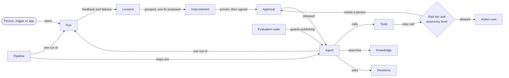

# How Abenix fits together

> Read this first. It names the core objects, shows how they connect, says what each role does, gives a first path per role and explains every word the app uses. Everything else in these docs goes deeper on one part.

Abenix is a platform for building AI agents, running them under control and letting them earn more freedom as they prove themselves. People build agents, give them tools and knowledge, run them from chat, a schedule or an API call, and watch every run. Rules, risk tiers and human approvals decide what an agent may do on its own.

---

## The core objects

| Object | What it is | Where you see it | Developer doc |
|---|---|---|---|
| **Agent** | A model with instructions, tools and optional knowledge that does one job. Has versions, a risk tier and a runtime pool | **Agents**, **Agent Builder** | [Agent execution](02-runtime/00-agent-execution.md), [Add an agent](08-howto/02-add-an-agent.md) |
| **Pipeline** | Several steps (agents, tools, decisions, switches, loops, human gates) wired as a graph. Stored and run like an agent | **Agent Builder**, pipeline mode | [Pipelines](02-runtime/01-pipelines.md) |
| **Tool** | One thing an agent can do: search the web, query a database, call a connector, run code, write to a device. Each declares its risk tier and the keys it needs | **Tools Catalogue**, **Admin -> Tool Configuration** | [Tools](02-runtime/02-tools.md), [Tool configuration](08-howto/08-tool-configuration.md) |
| **Knowledge** | Documents an agent can search and cite. Knowledge bases for shared documents, Persona KB for your own notes, Atlas for a typed graph of concepts | **Knowledge**, **Persona KB**, **Atlas** | [Atlas and the knowledge engine](01-architecture/06-atlas-knowledge-engine.md) |
| **Decision** | Versioned business rules that give the same answer for the same facts, every time. Agents gather facts, the decision makes the call | **Decisions** | [Decisions how-to](08-howto/09-decisions.md), [Decision service](02-runtime/20-decision-service.md) |
| **Run** | One execution of an agent or pipeline. Records every model call, tool call, cost, who started it and what it ran with | **Monitor** (`/executions`), **Live Debug**, the Flight Recorder | [State machines](02-runtime/09-state-machines.md), [Streaming and tracing](02-runtime/04-streaming-tracing.md) |
| **Approval** | Work waiting for a person to sign: a risky action, a promotion, a rule change, a proposed fix, a pipeline gate | **Approvals**, **Needs you** | [Approvals and HITL](02-runtime/05-approvals-hitl.md) |
| **Autonomy** | How much an agent may do on its own for one kind of action, on a five step ladder it climbs by its record | **Autonomy** | [Earned autonomy](02-runtime/21-earned-autonomy.md), [how-to](08-howto/13-earned-autonomy.md) |
| **Improvement** | Lessons from feedback and failures, grouped, turned into one proposed fix, proven, approved, released and watched | **Improvements**, an agent's Improvements tab | [Lessons](02-runtime/22-lessons-and-improvements.md), [Governed self-improvement](02-runtime/23-governed-self-improvement.md) |

Around them sit the parts that start, check and connect work:

| Part | What it does | Where |
|---|---|---|
| **Trigger** | Starts a run on a schedule or a webhook | **Triggers** |
| **Evaluation suite** | Test cases with checks. A gating suite must pass before a riskier agent can publish | **Evaluations** |
| **Risk tier** | Low, medium, high or critical. Sets who signs a change, what happens when a run calls a riskier tool, which models are allowed | **Admin -> Risk & Controls** |
| **Kill switch** | Stops everything, or one agent, pipeline, tool, trigger, model, decision or watched source, at the next tool call | **Admin -> Risk & Controls** |
| **Moderation policy** | Checks what goes into and comes out of agents. Can block, redact, flag or hold for review | **Moderation**, **Review inbox** |
| **Source Watch** | Watches pages, files and feeds, keeps every version, raises a change event | **Source Watch** |
| **Event subscription** | Sends a platform event to a URL, or starts an agent or pipeline | **Admin -> Events** |
| **Connector** | A configured link to an outside system (CMMS, HRIS, weather and the like) that a tool node can call | **Admin -> Connectors** |
| **Marketplace** | Lets people list agents for others to install, after an admin reviews them. Monetization adds prices and payouts. Both are switches for the whole deployment | **Marketplace**, **Creator Hub**, **Admin -> Marketplace & Billing** |
| **Meeting** | A bot that joins a call for you, rehearsed first in text | **Meetings** |
| **Edge gateway** | A small runtime next to equipment that runs signed agent bundles offline | **Edge** |

### The life of one run

1. Someone starts a run: a person in chat, a trigger, an event, an app through the SDK, or a parent pipeline.
2. The run takes its agent's risk tier and checks the kill switches.
3. The agent calls the model, then tools. It may search knowledge and evaluate decisions.
4. A tool call above the run's tier raises the tier and may need an approval. An action enrolled in Autonomy is gated by the agent's level for that action: watched only, asked first, or allowed within limits.
5. Moderation checks the input, the output and tool output.
6. The run ends with an output, a failure code if it failed, its cost, and a record of what it ran with (model, agent revision, prompt and config hashes), so it can be replayed.
7. A thumbs down, a correction, a failed run or a rejected action becomes a lesson. Lessons group, a fix is proposed, proven, approved and released, and the release is watched.

---

## Who does what

Abenix has three roles. **Permission sets** add capabilities to anyone on top of their role, from **Admin -> Permissions**.

| Role | Called in the API | Usually does | Gets by default |
|---|---|---|---|
| **Admin** | `admin` | Sets up the workspace: connects models, invites people, sets risk policies and moderation, manages keys, switches and the cluster | Everything (`*`) |
| **Creator** | `creator` | Builds agents and pipelines, adds knowledge, tests, enrols actions in Autonomy, reviews what agents learned, lists agents in the marketplace | Author decisions, manage evaluation suites, sources and events, manage autonomy, view and propose improvements, publish to the marketplace |
| **Member** | `user` | Uses the agents the team built, chats, gives feedback, answers watching reviews | View and evaluate decisions, run evaluations, replay runs, view autonomy, review agent actions, give feedback |

Members can still open the builder and most build pages from **Show all tools**. What they cannot do by default is author decisions, manage suites, sources or events, manage autonomy, propose improvements, publish to the marketplace, or touch admin pages.

Some jobs come from a capability, not a role:

| Job | Capability |
|---|---|
| Sign approvals | `approvals.sign` (admins and creators sign by role) |
| Approve an agent's promotion | `autonomy.grant`, and not the agent's author |
| Approve a proposed fix | `improvements.approve`, and not the agent's author, except on the sample agent or for a builder working alone |
| Release or reject held content | `moderation.review` |
| Publish a decision | `decisions.publish` |
| Use kill switches | `killswitch.manage` |

The full list is in [Governance](01-architecture/07-governance.md) and [Tenants and RBAC](01-architecture/01-tenants-rbac.md).

---

## Where do I start

**Admin**, about 15 minutes. Home shows these as **Start here** steps.

1. **Admin -> Tool Configuration**: add a model key. Agents cannot answer until one is set.
2. **Settings -> Team**: invite people as creators or members.
3. **Admin -> Risk & Controls**: read the four tier policies and decide which actions need a person.
4. **Moderation**: turn a policy on. Choose **Hold for review** where a person should check before content goes out.
5. Keep **Needs you** open. It counts what is waiting on you.

**Creator**, about 30 minutes.

1. **Agent Builder**: describe the job, pick a model and tools, save.
2. Try it in chat. The run shows in **Monitor**.
3. **Knowledge**: add a knowledge base and give the agent access.
4. **Evaluations**: add a suite with a few cases, or save a good run as a case.
5. **Autonomy**: enrol one of the agent's actions. It starts in Watching.
6. **Improvements**: after some feedback, read the lessons and propose a fix.

**Member**, about 5 minutes.

1. **AI Chat**: pick an agent and ask a real question.
2. Ask a follow-up in the same chat. The agent remembers the thread.
3. Rate the answer with a thumb. Say what it should have said. That becomes a lesson.

**Developer** extending the platform: [ONBOARDING.md](../ONBOARDING.md) for a local stack, [Finding your way around](08-howto/07-finding-your-way-around.md) for the repo, [ARCHITECTURE.md](../ARCHITECTURE.md) for the code map, then the how-tos in section 8.

**Operator** running it: [Deploy overview](06-deployment/00-overview.md), [Observability](06-deployment/04-observability.md), [Debugging](08-howto/04-debugging.md).

**App builder** using Abenix from outside: [SDK overview](03-sdk/00-overview.md) and [Building an app on Abenix](07-standalone-apps/00-pattern.md).

---

## Finding your way in the app

- **Start here** on Home is a checklist for your role. Each step links to the exact place and ticks itself from real data. Hide it, and bring it back with the **Show the Start here guide** link.
- **Needs you** (`/inbox`) is one inbox for everything waiting on you, with a count in the sidebar. Tabs: Approvals, Proposals, Watching reviews, Held content, Marketplace submissions and Alerts. You only see the tabs you can act on.
- **The sidebar** starts in **Essentials**: Needs you, Home, Agents, AI Chat, Knowledge and Monitor, plus Review inbox for reviewers, Agent Builder, Autonomy and Improvements for creators and admins, and an Admin entry for admins. **Show all tools** opens the full grouped list. The choice follows you to other devices. A page opened from elsewhere shows under "You are here".
- **Every page** opens with a title, one line on what it is for, its main action and a **How this works** panel that is open on your first visit. The **Docs** link opens the matching developer doc.
- **After a success**, a "Done. What next?" card offers two to four next steps.
- **Ctrl+K** (Cmd+K on a Mac) finds any page, agent or knowledge base.
- **Help** (`/help`) explains every screen. **Developer docs** (`/docs`) are these pages, with search.

How this is built is in [App shell](05-ui/00-app-shell.md). Two release-gate tests keep it honest, see [Testing](08-howto/05-testing.md#the-wayfinding-release-gate).

---

## Words you will see in the app

| Word | Meaning |
|---|---|
| **Acts and reports** | The top autonomy level. The agent acts on its own and tells you after |
| **Acts within limits** | The fourth autonomy level. The agent acts on its own inside hard limits, otherwise it asks |
| **Action** | One consequential tool call an agent makes, such as issuing a refund or resetting a device. Autonomy is earned per kind of action |
| **Admin** | The role that sets up and runs the workspace |
| **Agent** | A model with instructions, tools and optional knowledge that does one job |
| **Agent Builder** | The canvas where you build an agent or a pipeline, by hand or by describing it to the AI builder |
| **Alerts** | Failures grouped by cause, so a burst stands out |
| **API key** | A key an app uses to call Abenix. Shown once when created |
| **Approval** | Work waiting for a person to approve, deny or return for changes |
| **Asks first** | The third autonomy level. The agent prepares the action and a person approves, edits or rejects it |
| **Atlas** | A canvas of typed concepts and links that agents can query and cite |
| **Audit log** | The tamper-evident record of who did what. Each row is chained to the one before |
| **Autonomy** | How much an agent may do on its own for one kind of action |
| **Cluster Health** | The admin view of nodes, services and pods, with warnings and reasons |
| **Code asset** | Your own code, uploaded as a zip or git repo, that agents call as a tool in a sandbox |
| **Cognify** | Turning documents into graph facts for Atlas |
| **Connector** | A configured link to an outside system. Its secret is write-only: never shown again, and encrypted when the cluster has a data key. Calls to private or internal addresses are refused |
| **Creator** | The role that builds agents, pipelines and knowledge |
| **Creator Hub** | Where creators list agents in the marketplace and track installs, and earnings when monetization is on |
| **Dead Letter Queue** | Runs that failed past their retries, ready to replay |
| **Decision** | Versioned business rules that make a call from facts, with a trace of the rule that applied |
| **Demote** | Move an agent down an autonomy level. Happens on its own after harm, falling accuracy or a changed prompt or model |
| **Edge** | Gateways next to equipment that run signed agent bundles offline |
| **Enrol** | Put one of an agent's actions under Autonomy. It starts at Watching |
| **Essentials** | The short sidebar list for daily work |
| **Evaluation suite** | Test cases with checks for one agent. A gating suite must pass before publishing at tiers that need it |
| **Events** | Subscriptions that send platform events to a URL or start a run |
| **Feedback** | A thumbs up or down on an answer in chat, on a run or on an action card, optionally with what it should have said |
| **Flight Recorder** | The page for one run: every step, tool call, cost, decision and what the run used |
| **Golden test** | A saved case for a decision with the expected answer. All must pass before a change is proposed |
| **Group (of lessons)** | Lessons about the same mistake. One group gets at most one proposed fix at a time |
| **Harm flag** | A report that an action did damage. Demotes the agent at once |
| **Held content** | A message a moderation policy stopped until a person releases, redacts or rejects it |
| **Hold for review** | The moderation action that holds content instead of blocking it |
| **How this works** | The short steps panel at the top of each page |
| **Improvements** | Where lessons, suggested tests, proposed fixes and releases live |
| **Kill switch** | Stops an agent, pipeline, tool, trigger, model, decision, source or everything, at the next tool call |
| **Knowledge base** | Documents an agent can search and cite. An agent needs access granted to use one |
| **Lesson** | One thing an agent got wrong or right, from feedback, a failed run, a review or a flag |
| **Live Debug** | Runs happening now, streaming |
| **Live join** | Opening the real meeting room from the browser to watch or talk with the bot |
| **Marketplace** | Agents other people listed, checked by an admin, ready to install. On by default, an admin can turn it off for the whole deployment |
| **Member** | The role that uses agents, chats and gives feedback. `user` in the API |
| **Moderation** | Policies that check input, output and tool output |
| **Monetization** | The switch that adds prices, Stripe checkout, creator payouts and the Billing tab to the marketplace. Off by default |
| **Monitor** | Run history, with filters by status and by what started a run |
| **Needs you** | Your inbox of everything waiting on you |
| **Off** | The first autonomy level. The agent may not take the action |
| **Permission set** | A named bundle of capabilities an admin gives to people |
| **Persona KB** | Your own notes and files, only your agents can read them |
| **Pipeline** | Steps wired as a graph and run as one |
| **Pipeline Surgeon** | Proposes a patch after a pipeline step fails. You apply or reject it |
| **Promote** | Move an agent up an autonomy level. Needs a person who did not build it, except on the sample or for a builder working alone |
| **Proof** | The offline replay of a proposed fix against the agent's tests and history |
| **Proposal** | One proposed fix for a group of lessons |
| **Provenance** | What a run used: model, agent revision, prompt and config hashes. Shown as "What this run used" on the Flight Recorder |
| **Rehearse** | Practise a meeting with the bot by typing or dictating questions, with no real room. Needs at least one allowed topic |
| **Release** | A proven and approved fix going live as a new agent revision |
| **Replay** | Run again exactly as it ran, or on the agent as it is now |
| **Review inbox** | The queue for held content and, for admins, marketplace submissions |
| **Risk tier** | Low, medium, high or critical. Sets the controls on agents, tools, pipelines and decisions |
| **Rollback** | Going back to the previous revision. Automatic when a watched release does worse |
| **Sample** | A built-in example to learn from: the sample plant in Autonomy, the sample agent in Improvements |
| **Show all tools** | The switch from Essentials to the full sidebar |
| **Source Watch** | Pages, files and feeds watched for changes |
| **Start here** | The role checklist on Home |
| **Started by** | What started a run: chat, a trigger, an API call or a parent run |
| **Suggested case** | A test case written from a lesson. Runs only after a person accepts it |
| **Tool** | One thing an agent can do |
| **Tool Configuration** | The admin page for the keys and settings tools need |
| **Trigger** | Starts a run on a schedule or from a webhook |
| **Watch (release)** | Comparing a released fix with the old version before keeping it |
| **Watching** | The second autonomy level. The agent says what it would do, a person says if they agree, nothing runs |
| **Watching reviews** | Watching actions waiting for a person to answer |

The developer glossary, with table and column names, is [Glossary](09-reference/03-glossary.md).

---

## See also

- [Developer docs index](README.md)
- [System overview](01-architecture/00-overview.md)
- [Page catalogue](05-ui/03-page-catalogue.md), every route and who sees it
