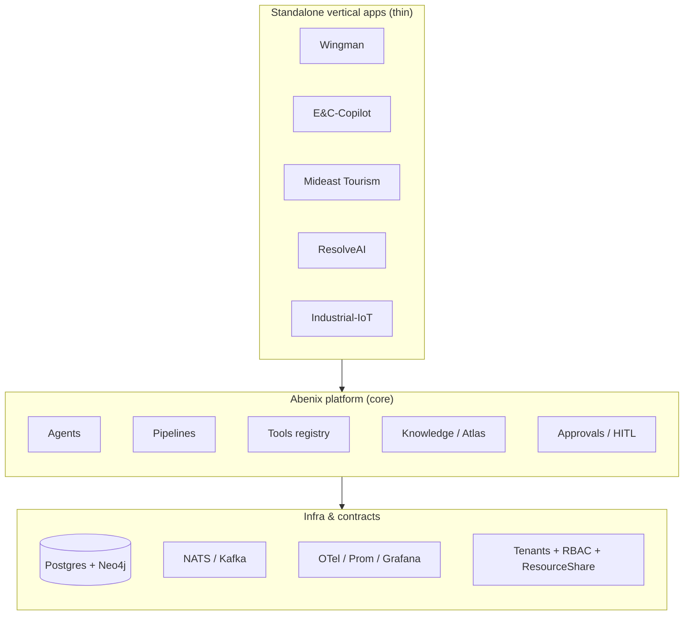
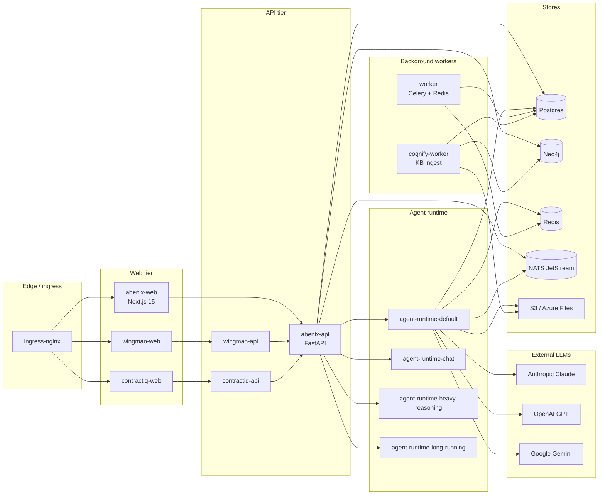

# System overview

> Read this first. Everything else assumes you know the service graph and the request lifecycle.

Abenix is an **open-source AI agent platform**. It lets a tenant define agents (LLM + tools + system prompt), wire them into pipelines (multi-step DAGs), feed them knowledge (documents + a typed ontology graph), and run them end-to-end with full audit trails. On top of that core sit **standalone vertical apps** (Wingman, E&C-Copilot, etc.) that compose the platform's primitives into industry-specific workflows.

The platform is multi-tenant, polyglot (Python / TypeScript / Java SDKs), and runs on Kubernetes. Everything is open source.

---

## The 30-second mental model

Three concentric circles.

**Key idea:** the vertical apps own almost no business logic. They render data, take user input, and **delegate** to platform agents via the SDK using the [`actAs` pattern](../03-sdk/00-overview.md#the-actas-pattern). The platform owns the heavy lifting — LLM calls, tool execution, knowledge retrieval, persistence, audit.

> **Why** — this lets one production deployment serve many vertical apps with shared identity, sharing, observability, and ML infrastructure. New verticals ship fast because they only need UI + a handful of agent definitions.

---

## Service graph

### Service responsibilities

| Service | Language | Responsibility | Source |
|---|---|---|---|
| **abenix-web** | TypeScript / Next.js | Browser UI — agents, pipelines, knowledge, marketplace, admin | [`apps/web/`](../../apps/web/) |
| **abenix-api** | Python / FastAPI | REST surface — agents CRUD, executions, knowledge, RBAC, billing, audit | [`apps/api/`](../../apps/api/) |
| **agent-runtime** | Python / FastAPI | Agent execution loop — calls LLMs, dispatches tools, streams events | [`apps/agent-runtime/`](../../apps/agent-runtime/) |
| **worker** | Python / Celery | Long-running jobs — pipeline orchestration, batch inference, scheduled triggers | [`apps/worker/`](../../apps/worker/) |
| **cognify-worker** | Python / Celery | Knowledge-base ingestion — parse, chunk, embed, extract graph | [`apps/cognify-worker/`](../../apps/cognify-worker/) |
| **edge-runtime** | Rust / C | Edge-side agents for low-latency / on-prem deployments | [`apps/edge-runtime*`](../../apps/) |
| **wingman-* / contractiq-* / etc.** | Python + TypeScript | Vertical apps — see [07-standalone-apps](../07-standalone-apps/00-pattern.md) | per-app directories |

### Why so many `agent-runtime-*` pods?

There are **four pools** (`default`, `chat`, `heavy-reasoning`, `long-running`) and each is an independent Deployment with its own KEDA ScaledObject. Each agent is pinned to a pool via its `model_config.runtime_pool`. This isolates a misbehaving 30-minute heavy-reasoning run from starving a 200-rps chat agent. See [06-deployment/03-keda](../06-deployment/03-keda.md).

---

## Request lifecycle (cheat-sheet version)

A complete walkthrough lives at [01-architecture/02-request-lifecycle](02-request-lifecycle.md). One-paragraph version:

> Browser → ingress-nginx → abenix-web (Next.js) → abenix-api (FastAPI) → agent-runtime (one of four pools, chosen by the agent's `runtime_pool`) → LLM provider + tool calls (each tool may hit Postgres, Neo4j, S3, an external API, or a deployed ML model) → events stream back as SSE through abenix-api → web → browser. The execution row in Postgres is the source of truth. everything else is a derivative view.

---

## What's open / closed source

Everything in this repo is open source under MIT. The standalone vertical apps are bundled into the same repo because they double as reference implementations of the thin-app pattern — feel free to fork them as starting points.

> **Trap** — there's also a *public mirror* (`sarkar4777/abenix`) that is a curated subset of the private repo, published via [`scripts/publish-public.sh`](../../scripts/publish-public.sh) on each release. The private repo contains a few extra demo-data fixtures and customer-specific tweaks that aren't in the public mirror. If you're reading this on `sarkar4777/abenix` you're seeing the curated version.

---

## Key architectural patterns

These are the recurring patterns. Recognising them is most of the battle when reading the code.

### 1. Tenant-scoped everything
Every row in every table has a `tenant_id`. Every JWT and API key carries a tenant. Middleware ([`apps/api/app/core/middleware.py`](../../apps/api/app/core/middleware.py)) sets a context variable on every request. routers + queries use it implicitly. **You should almost never write a query without a tenant filter.** See [01-architecture/01-tenants-rbac](01-tenants-rbac.md).

### 2. Polyglot SDK with one wire format
The Python, TypeScript, and Java SDKs all wrap the same REST endpoints. They share the same execution model (`execute(slug, input, wait=…)`), the same error envelope, the same streaming format. The wire is HTTP+SSE. There's no gRPC. See [03-sdk/00-overview](../03-sdk/00-overview.md).

### 3. actAs (delegated subject) pattern
A standalone app calls the platform with its own API key BUT sets `X-Abenix-Subject: wingman:demo-trader`. RBAC + audit + sharing all attribute the action to that subject. The vertical app's API key acts like a service account that can speak on behalf of any of its users. See [03-sdk/00-overview](../03-sdk/00-overview.md#the-actas-pattern).

### 4. JSONB everywhere it matters
`agents.model_config_`, `executions.payload`, `executions.output`, `pipeline_steps.config`, `atlas_nodes.properties` — all JSONB. The schema is intentionally permissive at the data layer. structural validation happens at the API/SDK boundary. **Don't add columns for fields you only sometimes use** — extend the JSONB block.

### 5. Polymorphic resource sharing
One table — `resource_shares` — handles sharing for agents, pipelines, ML models, code assets, knowledge bases, saved tools. A `(resource_type, resource_id, shared_with_user_id)` tuple plus a permission level. Backend gates every share endpoint with the same predicate helper. See [04-data-model/04-resource-shares](../04-data-model/04-resource-shares.md).

### 6. Thin standalone apps, fat platform
Vertical apps own auth (sometimes) and UI. They own NO business logic — every interesting computation lands in a platform agent. The wingman app has a 2000-line FastAPI but ~80% of its endpoints are "submit input to agent X via the SDK. cache + return the result." This is enforced by review. If you find yourself writing business logic in a standalone app, stop and ask why it's not an agent. See [07-standalone-apps/00-pattern](../07-standalone-apps/00-pattern.md).

---

## Where to go next

- **You're an architect** → [Request lifecycle](02-request-lifecycle.md), then [Service inventory](03-services.md), then [Data stores](04-data-stores.md).
- **You're going to code** → [Local setup](../08-howto/00-local-setup.md), then either [Add a tool](../08-howto/01-add-a-tool.md) or [Add a UI page](../08-howto/03-add-a-page.md).
- **You're debugging** → [Debugging guide](../08-howto/04-debugging.md) covers logs, traces, and the dozen most-common failure modes.
