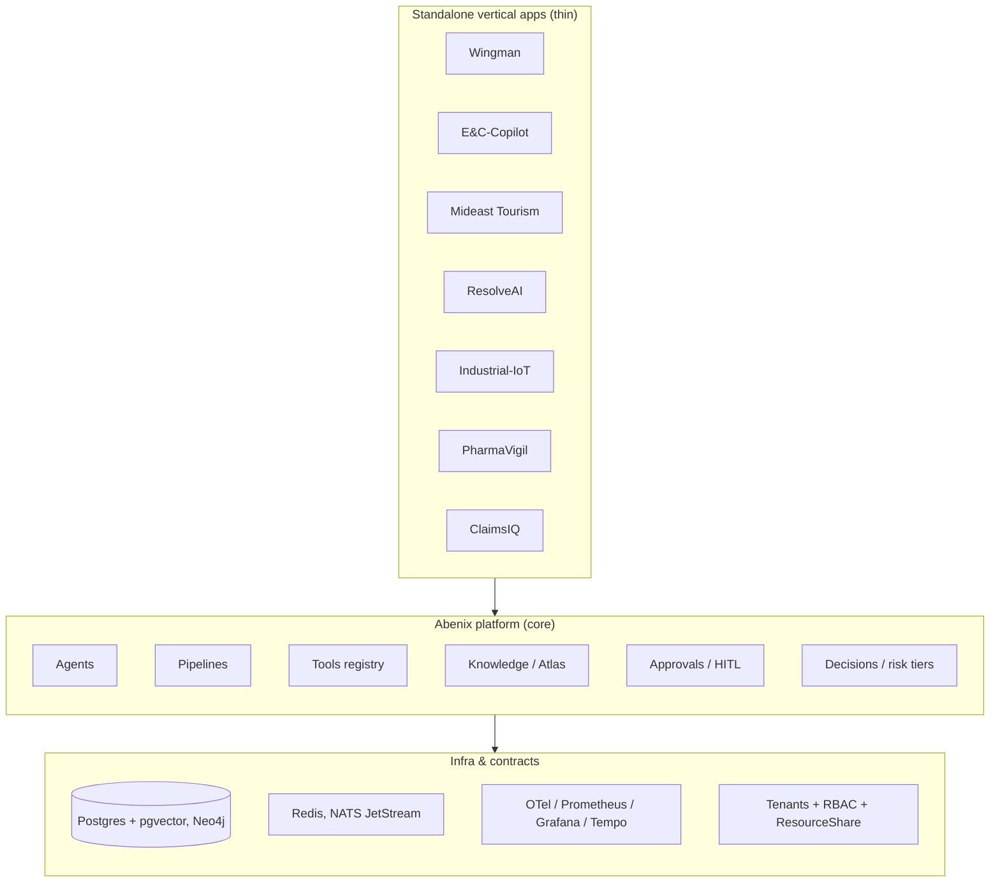
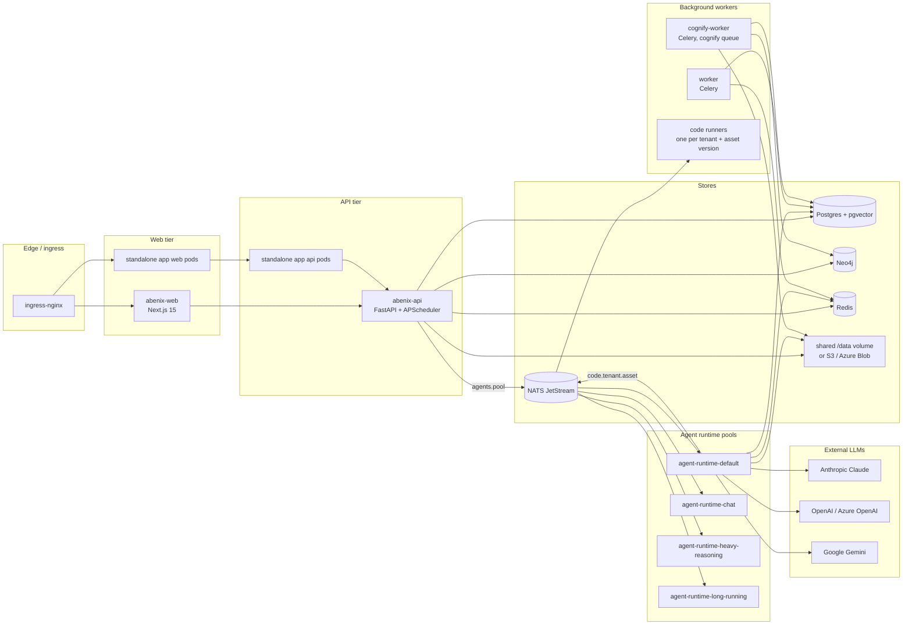

# System overview

> Read this first. Everything else assumes you know the service graph and the request lifecycle.
>
> New to Abenix? Start with [How Abenix fits together](../00-how-abenix-fits-together.md), a one-page map of the pieces, then come back here.

Abenix is an **open-source AI agent platform**. It lets a tenant define agents (LLM + tools + system prompt), wire them into pipelines (multi-step DAGs), feed them knowledge (documents + a typed ontology graph) and run them with an audit trail. On top of that core sit **standalone vertical apps** (Wingman, E&C-Copilot, Mideast Tourism, ResolveAI, Industrial-IoT, PharmaVigil, ClaimsIQ) that build industry workflows from the platform's parts.

The platform is multi-tenant, has Python, TypeScript and Java SDKs, and runs on Kubernetes.

---

## The 30-second mental model

Three concentric circles.

**Key idea:** the vertical apps own almost no business logic. They render data, take user input and **delegate** to platform agents through the SDK, using the [`actAs` pattern](../03-sdk/00-overview.md#the-actas-pattern). The platform does the LLM calls, tool execution, knowledge retrieval, persistence and audit.

> **Why.** One deployment serves many vertical apps with shared identity, sharing, observability and ML infrastructure. A new vertical needs only a UI and a handful of agent definitions.

---

## Service graph

This is the Azure posture (`values-azure.yaml`). The base chart is smaller, see [Service inventory](03-services.md) for what each overlay turns on.

Agents run in the API pod (`runtimeMode: embedded`, `runtime_pool: inline`) or on a pool pod when `scaling.execRemote` is on. Execution events travel back over Redis pub/sub, not NATS. Kafka is not deployed. The only Kafka code is the `kafka_consumer` tool, which reads from a broker you set with `KAFKA_BOOTSTRAP_SERVERS`.

### Service responsibilities

| Service | Language | Responsibility | Source |
|---|---|---|---|
| **abenix-web** | TypeScript / Next.js | Browser UI for agents, pipelines, knowledge, marketplace, admin | [`apps/web/`](../../apps/web/) |
| **abenix-api** | Python / FastAPI | REST + SSE surface, inline agent runs, and the in-process APScheduler ([`scheduler.py`](../../apps/api/app/core/scheduler.py)): due triggers, stale-run sweeper, eval schedules, event dispatch, source watch, audit chain linking and nightly verify, approval escalation, autonomy outcome checks, lesson grouping, improvement watch, nightly archive | [`apps/api/`](../../apps/api/) |
| **agent-runtime pools** | Python | `consumer.py` drains one NATS subject per pool and runs agents and pipelines | [`apps/agent-runtime/`](../../apps/agent-runtime/) |
| **worker** | Python / Celery | Document ingest, cognify, re-embedding and Pinecone clean-up from the `documents` and `cognify` queues. Agent runs go over NATS, not Celery | [`apps/worker/`](../../apps/worker/) |
| **cognify-worker** | Python / Celery | Same image, consumes only the `cognify` queue so graph extraction does not block ingest | [`apps/worker/`](../../apps/worker/) |
| **code runners** | Python gateway + per-language exec image | Warm runners for code assets, one Deployment per tenant and asset version, called over NATS. Optional | [`apps/code-runner/`](../../apps/code-runner/) |
| **edge-runtime** | Python, with Rust and C ports | Runs compiled `.agent` bundles on gateways and registers with the API | [`apps/edge-runtime/`](../../apps/edge-runtime/) |
| **standalone apps** | Python + TypeScript, ClaimsIQ is Java | Vertical apps, see [07-standalone-apps](../07-standalone-apps/00-pattern.md) | per-app directories |

### Why so many `agent-runtime-*` pods?

The Azure overlay defines **four pools** (`default`, `chat`, `heavy-reasoning`, `long-running`). Each is its own Deployment with its own KEDA ScaledObject. An agent is pinned to a pool by the `agents.runtime_pool` column, set from `/admin/scaling` or the agent YAML. `inline` keeps the run on the API pod. This isolates a misbehaving 30-minute heavy-reasoning run from starving a chat agent. The base chart ships no pools and local dev runs only `default`. See [06-deployment/03-keda](../06-deployment/03-keda.md).

---

## Request lifecycle (cheat-sheet version)

A complete walkthrough lives at [01-architecture/02-request-lifecycle](02-request-lifecycle.md). One-paragraph version:

> Browser → ingress-nginx → abenix-web → abenix-api inserts the `executions` row → either runs the agent in-process, or publishes to NATS subject `agents.<pool>` for a pool pod → LLM provider + tool calls (each tool may hit Postgres, Neo4j, the shared volume, an external API, a code runner or a deployed ML model) → events go to Redis channel `exec:events:<execution_id>` → abenix-api relays them as SSE → browser. The execution row in Postgres is the source of truth. Everything else is a derivative view.

---

## Governance, autonomy and review

These subsystems sit on top of agents and pipelines. Each has its own page.

| Subsystem | What it does | Read |
|---|---|---|
| Risk tiers, kill switches, capabilities, audit chain | Tenant controls on what runs and who may change it | [Governance](07-governance.md) |
| Decision service | Versioned business rules that agents, pipelines and the API evaluate | [02-runtime/20](../02-runtime/20-decision-service.md) |
| Source Watch | Fetches watched pages, files and feeds, stores each version and reports changes | [02-runtime/17](../02-runtime/17-source-watch.md) |
| Evaluation suites | Golden cases scored against an agent, pipeline or decision, and the release gate | [02-runtime/18](../02-runtime/18-evaluation-suites.md) |
| Outbound events | Event catalogue, outbox, signed webhook delivery and the NATS bus | [02-runtime/19](../02-runtime/19-outbound-events.md) |
| Earned autonomy | Agents earn the right to act alone, action by action, from their track record | [02-runtime/21](../02-runtime/21-earned-autonomy.md) |
| Lessons | Failures, feedback and corrections captured and grouped per agent | [02-runtime/22](../02-runtime/22-lessons-and-improvements.md) |
| Governed self-improvement | Proposes a fix for a lesson group, proves it, waits for approval, releases and watches it | [02-runtime/23](../02-runtime/23-governed-self-improvement.md) |

Two inboxes collect what waits on a person.

- **Needs you** (`/inbox`) gathers approvals, improvement proposals, watching reviews, held content, marketplace submissions and alerts for the signed-in user. Counts come from `GET /api/me/inbox-counts` in [`inbox.py`](../../apps/api/app/routers/inbox.py). See [App shell](../05-ui/00-app-shell.md#needs-you-inbox).
- **Review inbox** (`/review-queue`) is the reviewer view of content a moderation policy held and agents waiting to join the marketplace. See [Moderation gate](../02-runtime/13-moderation-gate.md).

---

## What's open source

Everything in this repo is MIT licensed. The standalone vertical apps live in the same repo because they double as reference implementations of the thin-app pattern. Fork them as starting points.

> **Trap.** The public mirror (`sarkar4777/abenix`) is a filtered copy of the private repo, published by the private repo's `scripts/publish-public.sh` on each release. A few paths are left out of it.

---

## Key architectural patterns

Recognising these makes the code much easier to read. More are in [Architectural patterns](05-architectural-patterns.md).

### 1. Tenant-scoped everything
Almost every domain table carries `tenant_id` (`TenantMixin`). Every JWT and API key carries a tenant. `TenantMiddleware` ([`apps/api/app/core/middleware.py`](../../apps/api/app/core/middleware.py)) puts it on `request.state.tenant_id`, and handlers filter on `user.tenant_id` from `get_current_user`. **Almost never write a query without a tenant filter.** See [01-architecture/01-tenants-rbac](01-tenants-rbac.md).

### 2. Polyglot SDK with one wire format
The Python, TypeScript and Java SDKs wrap the same REST endpoints, with the same execution model (`execute(slug, message, …)`), error envelope and streaming format. The wire is HTTP + SSE. There is no gRPC. See [03-sdk/00-overview](../03-sdk/00-overview.md).

### 3. actAs (delegated subject) pattern
A standalone app calls the platform with its own API key and sets `X-Abenix-Subject: {"subject_type": "wingman", "subject_id": "demo-trader"}`. The key needs the `can_delegate` scope, otherwise the API answers 403. Executions record the subject in `subject_type` and `subject_id`. The app's key works like a service account that speaks for any of its users. See [Tenants and RBAC](01-tenants-rbac.md#actas--the-delegation-chain). See [03-sdk/00-overview](../03-sdk/00-overview.md#the-actas-pattern).

### 4. JSONB everywhere it matters
`agents.model_config` (`model_config_` on the ORM class, pipelines live in it as `pipeline_config`), `executions.tool_calls`, `executions.node_results`, `executions.provenance`, `atlas_nodes.properties` are all JSONB. The data layer is permissive on purpose. Validation happens at the API and SDK boundary. **Don't add columns for fields you only sometimes use.** Extend the JSONB block.

### 5. Polymorphic resource sharing
One table, `resource_shares`, handles sharing for agents, pipelines, ML models, code assets, knowledge bases, saved tools and Atlas graphs. A `(resource_type, resource_id, shared_with_user_id)` tuple plus a permission level, `VIEW`, `EXECUTE` or `EDIT`. Reads go through `accessible_resource_ids` in [`apps/api/app/core/permissions.py`](../../apps/api/app/core/permissions.py). See [04-data-model/04-resource-shares](../04-data-model/04-resource-shares.md).

### 6. Thin standalone apps, fat platform
Vertical apps own UI and sometimes auth. They own no business logic. Every real computation runs in a platform agent. Most Wingman API endpoints submit input to an agent through the SDK, cache the result and return it. If you find yourself writing business logic in a standalone app, ask why it is not an agent. See [07-standalone-apps/00-pattern](../07-standalone-apps/00-pattern.md).

---

## Where to go next

- **You're an architect** → [Request lifecycle](02-request-lifecycle.md), then [Service inventory](03-services.md), then [Data stores](04-data-stores.md).
- **You're going to code** → [Local setup](../08-howto/00-local-setup.md), then either [Add a tool](../08-howto/01-add-a-tool.md) or [Add a UI page](../08-howto/03-add-a-page.md).
- **You're looking at controls** → [Governance](07-governance.md) for risk tiers, kill switches, capabilities and the audit chain.
- **You're debugging** → [Debugging guide](../08-howto/04-debugging.md) covers logs, traces and the most common failure modes.
