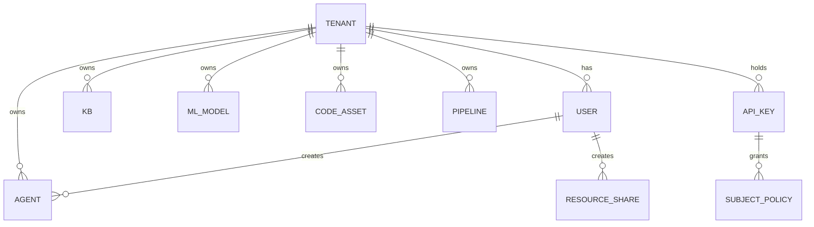
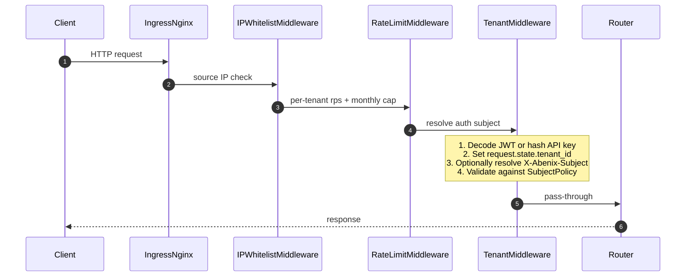
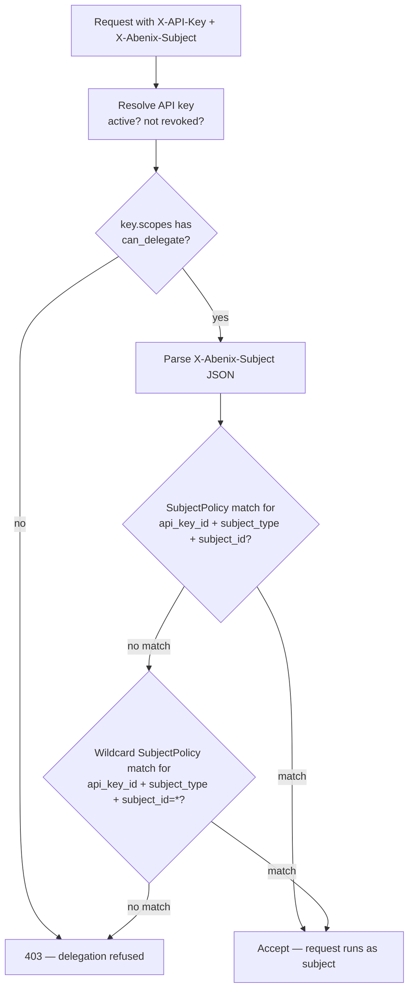
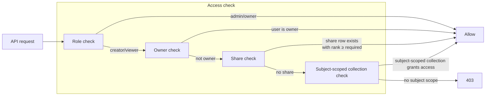

# Tenants, RBAC, and the actAs delegation chain

> Every row, every query, every JWT is scoped to a tenant. Inside a tenant, every action attributes to a *subject* — and the subject is not always the authenticated user. This page explains both layers, in depth, including the parts of the chain that are easy to skim past on first read.

---

## The tenant model

A **tenant** is an organisation. A tenant has many **users**, many **agents**, many **knowledge bases**, etc. Tenants are isolated. Under no circumstance does a user in tenant A see data from tenant B.



Tenant IDs are UUIDs. The first tenant is created by the platform installer. Subsequent tenants are created via the marketplace signup flow or by an admin via [`POST /api/admin/tenants`](../09-reference/00-rest-api.md#tenants).

The invariant is simple and load-bearing — **every domain row has a non-null `tenant_id`**. The catchup migration in `packages/db/alembic/versions/x4y5z6a7b8c9_schema_drift_catchup.py` checks this against every table on every fresh install. If you add a model and forget the column, the verify-schema gate fails the deploy.

> **Why multi-tenancy from day one** — we never have to retrofit isolation. The cost is verbose queries. The payoff is that SaaS, on-prem single-customer, and marketplace multi-customer cloud all run the exact same code.

---

## How a request finds its tenant

Three middlewares run, in order. Only the third is interesting.



`TenantMiddleware` lives in [`apps/api/app/core/middleware.py`](../../apps/api/app/core/middleware.py). It accepts three credential forms.

| Form | Header | Source | Lifetime |
|---|---|---|---|
| **JWT** | `Authorization: Bearer ey…` | issued by `/api/auth/login` | session (24h default) |
| **API key** | `X-API-Key: af_…` | issued via `/api/api-keys` | long-lived, revocable |
| **API key + actAs** | `X-API-Key: af_…` + `X-Abenix-Subject: {…}` | API key with `can_delegate` scope | per request |

After the middleware, every route handler reads `user: User = Depends(get_current_user)`. `user.tenant_id` is the source of truth.

> **Trap** — never trust a `tenant_id` from a request body. The only authoritative source is the resolved JWT or API key.

---

## actAs — the delegation chain

This pattern is the heart of every standalone-app integration. The surface area looks tiny — one header, one SDK helper. The semantics around it are not.

### What problem it solves

A standalone app like Wingman has its own users (traders). It owns a service-account API key on the platform. When Alice clicks *Scan corridor*, three different things want her identity for three different reasons.

- The platform's **audit log** wants `subject = wingman:trader-alice` so a forensic query later can answer "who ran this scan?"
- The platform's **RBAC predicate** wants the subject so a per-subject share row is honoured if one exists.
- The standalone app's own **notification system** wants the platform to echo the subject back on stream events so the UI can route the result to Alice's session, not to a co-trader on the same desk.

The platform never holds Alice as a row. Wingman does. We carry her identity as a *delegated subject* on the API call.

### Anatomy of an ActingSubject

```python
# apps/api/app/core/acting_subject.py
@dataclass
class ActingSubject:
    subject_type: str        # "wingman", "contractiq", "external", "user", "webhook"
    subject_id: str          # the third-party system's user ID
    email: str | None = None
    display_name: str | None = None
    metadata: dict | None = None
```

Wire format on the request:

```
X-Abenix-Subject: {"subject_type":"wingman","subject_id":"trader-alice","email":"alice@desk.io","display_name":"Alice — Crude"}
```

The header is JSON, not a tagged string. Older docs and example code sometimes show `wingman:trader-alice` shorthand. That shorthand is a *display* convention. The wire is always JSON.

### Who is allowed to delegate

Two predicates gate every actAs call. Both have to pass.

1. **The API key itself must carry the `can_delegate` scope.** This is a single bit on `api_keys.scopes` (JSON column). The check lives in [`apps/api/app/core/acting_subject.py:48-56`](../../apps/api/app/core/acting_subject.py#L48-L56).
2. **A SubjectPolicy row must exist** that either matches the (subject_type, subject_id) explicitly or matches `subject_id = "*"` for that subject_type. SubjectPolicy lives in [`packages/db/models/subject_policy.py`](../../packages/db/models/subject_policy.py) and is indexed on `(api_key_id, subject_type, subject_id)` for lookup speed.



The wildcard tier (`subject_id = "*"`) is what lets a service-account key cover "every Wingman trader" without a row per trader. The explicit tier is what lets a desk-admin **scope down** a specific trader (e.g. `subject_id = "trader-bob"` with `rules = {"deny_corridors": ["MEG-FE"]}` would let the API recognise Bob but limit what he sees).

The `rules` JSON column on SubjectPolicy is the extension point. Today the platform reads only `deny_corridors`, `allowed_actions`, and `quota_per_day` from it. Anything you add there is observable but not enforced unless the matching route reads it. There is intentionally no global predicate that auto-applies rules — every endpoint that wants to honour a rule has to opt in. This is what keeps the surface area honest. A rule that isn't being checked is one the next reviewer can delete.

### Where the subject lives during a request

After middleware accepts the request, the resolved subject hangs off `request.state.acting_subject` (or `None` if the request was plain JWT). Every audit-log emitter reads it via:

```python
log_action(
    db, tenant_id=user.tenant_id,
    user_id=user.id,
    actor_subject_type=acting_subject.subject_type if acting_subject else "user",
    actor_subject_id=acting_subject.subject_id if acting_subject else str(user.id),
    action="agent.execute", resource_type="agent", resource_id=agent.id,
)
```

The `audit_logs` table has both a `user_id` (the API-key owner — who *holds* the credential) and an `actor_subject_*` pair (who the API-key holder claimed to be acting for). Compliance queries can filter on either axis. The pair is the source of truth for *attribution*.

### Re-delegation — can a subject delegate further?

**No.** The chain has depth exactly one. An incoming request can carry `X-Abenix-Subject` but the resulting agent run cannot turn around and call another agent with a new subject. The `invoke_agent` tool ([details below](#agent-to-agent-calls-and-subjects)) reuses the *root* execution's subject for every nested call. This is deliberate. Allowing re-delegation would let one compromised SDK consumer impersonate users across subject types, and the policy table would explode in size to cover the cross product.

If you genuinely need a "user impersonates another user" path (rare — almost always a smell), do it server-side: the standalone app's own auth code re-issues a request with a different X-Abenix-Subject after running its own access check.

### Subject-type taxonomy

Each standalone app picks a subject_type and stays in that lane.

| subject_type | Used by | Example subject_id |
|---|---|---|
| `wingman` | Wingman energy trading | `trader-alice`, `demo-trader` |
| `contractiq` | E&C-Copilot contracts | `user-7afd…` (the CIQ DB user UUID) |
| `mideasttourism` | Mideast Tourism Ministry | `gov-employee-22` |
| `resolveai` | ResolveAI customer service | `agent-bob` |
| `industrial-iot` | Industrial IoT | `operator-shift-3` |
| `claimsiq` | ClaimsIQ FNOL | `adjuster-1701` |
| `external` | Generic third-party | partner-system user IDs |
| `user` | Platform's own users (rare in actAs path) | platform user UUID |
| `webhook` | Inbound webhook source | `slack:team-T0345` |

The platform does not validate the type against a fixed enum. It uses the type+id verbatim as the audit-log actor and as the routing key for any notification the platform echoes back. New apps should pick a stable, kebab-case slug and stick with it — re-naming after rows exist will fragment the audit trail.

### Where the subject affects RBAC reads

Inside the API server, the subject changes what the `resolve_agent_collections` and `user_can` predicates return. The function in `apps/api/app/services/collection_access.py` adds a "subject-scoped collection" leg to the query whenever an acting subject is present. The collection name follows the convention `{subject_type}-{subject_id}` and is auto-created on first reference. This is the mechanism that lets Wingman keep per-trader memory without writing one row per trader in `tenant_settings`.

### Where the subject does NOT affect RBAC

The role gate (admin / creator / viewer) is **based on the API-key owner, not the subject**. A delegated subject inherits whatever the key-holder can do. If the key-holder is a creator and Alice is "just a user" in Wingman's world, Alice gets creator-level access on the platform side. The platform has no concept of Alice's role at Wingman — that is the standalone app's responsibility to gate before issuing the platform call.

In practice the standalone app does both checks:
1. Its own gate ("does Alice have permission to scan?").
2. The platform call.

The platform only ever does (2).

### actAs from the SDK

Python:

```python
from abenix_sdk import Abenix, ActingSubject

client = Abenix(
    api_url=os.environ["ABENIX_API_URL"],
    api_key=os.environ["WINGMAN_ABENIX_API_KEY"],
)
subject = ActingSubject(
    subject_type="wingman",
    subject_id="trader-alice",
    email="alice@desk.io",
    display_name="Alice — Crude",
)
result = await client.with_subject(subject).execute(
    "wingman-mispricing-extractor",
    {"corridor": "USGC-NWE"},
)
```

TypeScript:

```ts
const sdk = new Abenix({ apiUrl, apiKey })
const result = await sdk
  .withSubject({ subject_type: "contractiq", subject_id: userId, email })
  .execute("contractiq-clause-extractor", { document_id })
```

`with_subject()` is a clone-and-bind operation. The returned client is a thin shim that adds the header on every call. The original client (no subject) is unchanged — useful when one process serves several users.

### Agent-to-agent calls and subjects

When an agent calls another agent via the `invoke_agent` tool, the runtime opens a fresh HTTP request to `/api/agents/{slug}/execute` from inside the runtime pod. That request carries the platform's *internal* service key — not the original X-Abenix-Subject. The subject is implicit: the new sub-execution inherits the *parent_execution_id* and the platform looks up the root execution to find the original subject. Cost and audit roll up to the root.

This means a fan-out across five sub-agents produces five audit rows, all attributed to the same subject, all linked by `parent_execution_id` to the root.

See [02-runtime/06-agent-to-agent](../02-runtime/06-agent-to-agent.md) for the full lifecycle.

---

## Logout and refresh-token revocation

`POST /api/auth/logout` records a server-side cutoff for the calling user. The cutoff lives in Redis under `auth:rt_revoke_before:{user_id}` and stores the unix timestamp of the logout call with a 90-day TTL.

`POST /api/auth/refresh` inspects the inbound refresh-token `iat` claim. If `iat` is older than the recorded cutoff, the call is rejected with 401. Access tokens stay valid until they expire on their own short window (default 15 minutes), refresh stops working immediately.

The web app calls logout on the in-app sign-out button and on every detected 401. CLI callers should mirror the same flow when an operator rotates their own credentials.

Forced cluster-wide invalidation (compromised KEK, mass password rotation) is a runbook step. Bump the Redis key for every active user, or flush the `auth:rt_revoke_before:*` keyspace and rely on the access-token short lifetime.

---

## Roles

There are 4 roles on a tenant. Each user has exactly one.

| Role | Can | Cannot |
|---|---|---|
| **owner** | Everything | (nothing — owner is the root) |
| **admin** | Manage users, billing, settings, all resources | Transfer ownership |
| **creator** | Create agents, pipelines, KBs, ML models. Share their own resources. | Manage other users. See other users' private resources. |
| **viewer** | Read shared resources. Run agents shared with `use` permission. | Create or modify anything. |

The role is stored in `users.role` as a Postgres enum. Endpoint-level gates use `is_admin(user)` and similar helpers from [`apps/api/app/core/permissions.py`](../../apps/api/app/core/permissions.py). There is a per-resource override via the `resource_shares` table.

---

## Resource sharing

Sharing lets a creator grant another user in the same tenant access to a single resource without elevating their role.

Permissions are three-tier and **strictly ranked**.

| Permission | Numeric rank | What the recipient can do |
|---|---|---|
| **view** | 1 | See it in their list. Cannot run or change it. |
| **use** | 2 | Call / run / query the resource. Cannot modify its definition. |
| **edit** | 3 | Full editor — change config, schema, version. |

Sharing is **polymorphic** — one table handles every resource type. `resource_shares.resource_type` is a string tag (`agent`, `pipeline`, `ml_model`, `code_asset`, `knowledge_base`, `saved_tool`). `resource_id` is the target UUID. A unique constraint on `(tenant_id, resource_type, resource_id, shared_with_user_id)` means each (resource, recipient) pair has at most one row — re-sharing upgrades the permission in place.

### The access predicate



The predicate lives in `user_can()` in [`apps/api/app/core/permissions.py`](../../apps/api/app/core/permissions.py). Endpoints call it as:

```python
if not await user_can(user, db, action="execute", resource=("agent", agent_id)):
    raise HTTPException(403, "Not allowed to execute this agent")
```

### Share expiry

`resource_shares.expires_at` is nullable. When set, the share is filtered out at query time by adding `WHERE expires_at IS NULL OR expires_at > NOW()` to every list query in the share resolution path. **There is no background sweeper that prunes expired rows.** They stay in the table indefinitely for audit. If you query `resource_shares` directly without the expiry clause you will see them, which is by design — auditors should be able to see "Alice once had edit access from 2025-03-01 to 2025-03-15".

### Revocation

Hard-delete a share row to revoke. Soft-delete is not used here. The associated audit trail (`audit_logs` with `action = 'share.revoked'`) is the durable record.

### UI

The generic `ResourceShareDialog` ([`apps/web/src/components/share/ResourceShareDialog.tsx`](../../apps/web/src/components/share/ResourceShareDialog.tsx)) is mounted on ML Models, Code Runner, Knowledge Bases, and agent detail. Every resource type uses the same dialog. The dialog calls `/api/me/shares` (polymorphic) — not the legacy `/api/agents/{id}/shares` router which still exists for backward compatibility.

> **Trap** — new code must use `/api/me/shares`. The legacy router is not reachable from the new ResourceShareDialog and will stay deprecated until the next major bump.

---

## Audit trail

Every mutating endpoint emits an `audit_logs` row via `log_action()`. The row is append-only. Compliance can export per tenant.

The schema is intentionally wide.

```
audit_logs
├── tenant_id              (the tenant)
├── user_id                (the API-key owner / JWT user)
├── actor_subject_type     (e.g. "wingman")  — null if no actAs
├── actor_subject_id       (e.g. "trader-alice")
├── action                 ("agent.execute", "kb.update", "share.create", ...)
├── resource_type          ("agent", "kb", "ml_model", ...)
├── resource_id            (target UUID)
├── metadata               JSONB — free-form context (input slug, output execution_id, etc.)
├── created_at             timestamptz
├── ip_address             (when available)
└── request_id             (correlation ID for the wider trace)
```

Notable consequences.

- A standalone-app integration **must** know that the audit row attributes to `(actor_subject_type, actor_subject_id)`, not to `user_id`. Queries that group by `user_id` will report every Wingman action as coming from the service-account key holder. That is almost never what you want.
- `metadata` is JSONB. Treat it as observation, not source of truth. The columns above it are the ones the compliance team queries against.
- `created_at` is timestamptz UTC. The standalone app may be presenting wall-clock time to a user in a different zone. Conversion is the app's job.

---

## Cross-tenant access

There is no API surface for cross-tenant reads. Even the platform owner cannot read another tenant's data through the public API. The only path is the platform installer's direct DB access. This is enforced at the predicate level — `user_can()` adds `AND tenant_id = :user_tenant` to every join, and there is no escape hatch in the routers.

The one exception is the marketplace listing — agents published with `is_public = true` are visible across tenants for *read* (browse, preview). Executing a published agent always runs in the caller's tenant against the caller's connected data sources. The publisher never sees the executor's data.

---

## Common patterns to avoid

1. **Storing tenant_id in JSON metadata.** Use the column. Predicates do not look in metadata.
2. **Reading user.role to gate a write that has resource-share semantics.** Use `user_can()` so admins and recipients with `edit` rights both pass.
3. **Trusting the subject for security decisions.** The subject is for attribution and routing. Real security decisions belong on the standalone-app side or on the API-key scope.
4. **Caching share-resolution results.** The share table changes when revocations happen. The predicate is cheap. Do not cache it.

---

## See also

- [04-data-model/04-resource-shares](../04-data-model/04-resource-shares.md) — table schema and indices
- [05-ui/02-api-client](../05-ui/02-api-client.md) — how the frontend handles 403 and the share dialog
- [03-sdk/00-overview](../03-sdk/00-overview.md#the-actas-pattern) — actAs from the SDK side
- [02-runtime/06-agent-to-agent](../02-runtime/06-agent-to-agent.md) — how invoke_agent inherits the subject
- [07-standalone-apps/00-pattern](../07-standalone-apps/00-pattern.md) — the third-party app perspective
