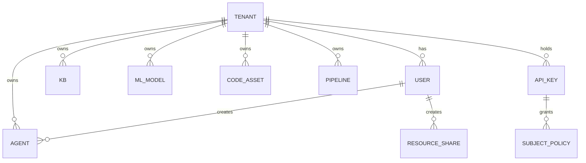
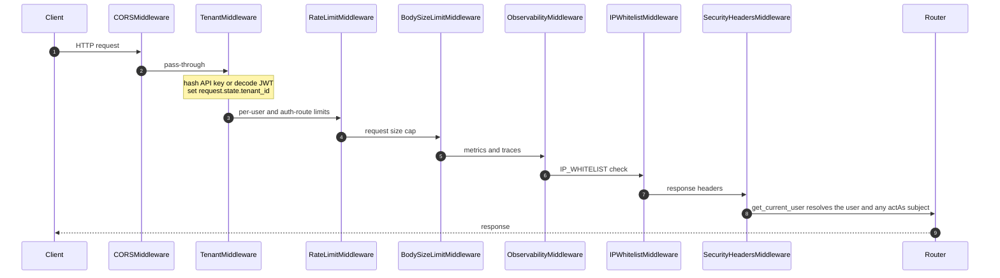
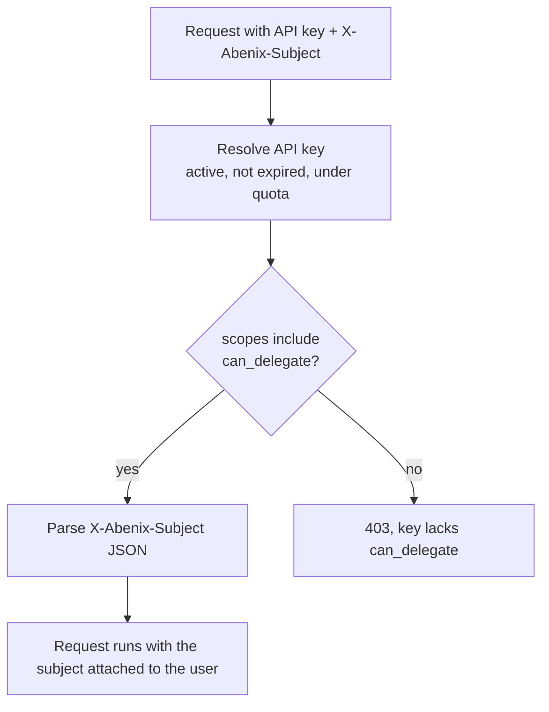
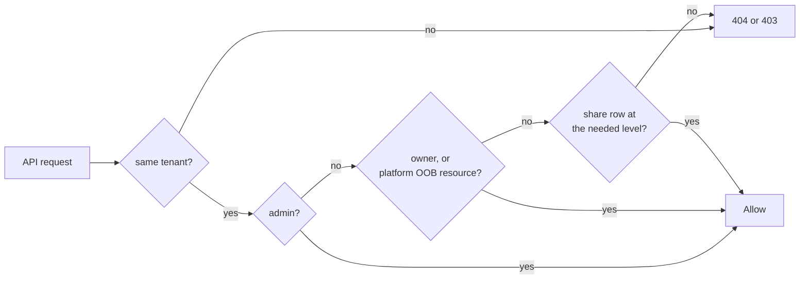

# Tenants, RBAC, and the actAs delegation chain

> Every row, every query, every JWT is scoped to a tenant. Inside a tenant, a run can be attributed to a *subject* that is not the authenticated user. This page covers both layers.

---

## The tenant model

A **tenant** is an organisation. A tenant has many **users**, many **agents**, many **knowledge bases**, etc. Tenants are isolated. A user in tenant A never sees data from tenant B.



Tenant IDs are UUIDs. The seed script creates the first tenant. Every new sign-up through [`POST /api/auth/register`](../09-reference/00-rest-api.md#auth-and-sso), or a first SSO sign-in, creates a fresh tenant with that user as its admin. People join an existing tenant only by invite, from the Team page.

Almost every domain table carries a non-null `tenant_id` through `TenantMixin` ([`packages/db/models/base.py`](../../packages/db/models/base.py)). A few child tables are scoped through their parent instead, for example `subject_policies` hangs off `api_keys`.

> **Why multi-tenancy from day one.** Isolation never has to be retrofitted. The cost is a tenant filter on every query. The payoff is that SaaS, single-customer on-prem and marketplace multi-customer cloud all run the same code.

---

## How a request finds its tenant

The API stacks its middlewares in [`apps/api/app/main.py`](../../apps/api/app/main.py). From the outside in:



`TenantMiddleware` in [`apps/api/app/core/middleware.py`](../../apps/api/app/core/middleware.py) only works out the tenant. The user, and the delegated subject if there is one, are resolved per route by `get_current_user` in [`apps/api/app/core/deps.py`](../../apps/api/app/core/deps.py). It accepts three credential forms.

| Form | Header | Source | Lifetime |
|---|---|---|---|
| **JWT** | `Authorization: Bearer ey…` | issued by `/api/auth/login` | 15 min access token, renewed through `/api/auth/refresh` (7 day refresh token) |
| **API key** | `X-API-Key: af_…` or `Authorization: Bearer af_…` | issued via `/api/api-keys` | long-lived, revocable, optional expiry and monthly token or cost cap |
| **API key + actAs** | API key + `X-Abenix-Subject: {…}` | API key with the `can_delegate` scope | per request |

Every route handler reads `user: User = Depends(get_current_user)`. `user.tenant_id` is the source of truth.

> **Trap.** Never trust a `tenant_id` from a request body. The only authoritative source is the resolved JWT or API key.

---

## actAs — the delegation chain

This pattern is the heart of every standalone-app integration. The surface is one header and one SDK option.

### What problem it solves

A standalone app like Wingman has its own users (traders). It holds a service-account API key on the platform. When Alice clicks *Scan corridor*, the platform should know the run was for Alice even though the key belongs to Wingman.

- The execution row records `subject_type = wingman` and `subject_id = trader-alice`, so a later query can answer "who ran this scan?"
- Standalone-app proxies match run ownership on `subject_id`, so Alice sees her runs and not a co-trader's.
- Knowledge lookups add a per-subject collection when one exists (see [below](#where-the-subject-affects-knowledge-reads)).

The platform never holds Alice as a user row. Wingman does. Her identity travels as a *delegated subject* on the API call.

### Anatomy of an ActingSubject

```python
# apps/api/app/core/acting_subject.py
@dataclass
class ActingSubject:
    subject_type: str        # e.g. "wingman", "contractiq", "external", "user"
    subject_id: str          # the third-party system's user ID
    email: str | None = None
    display_name: str | None = None
    metadata: dict | None = None
```

Wire format on the request:

```
X-Abenix-Subject: {"subject_type":"wingman","subject_id":"trader-alice","email":"alice@desk.io","display_name":"Alice (Crude)"}
```

The header is JSON. `wingman:trader-alice` is only a display shorthand. A header that is not valid JSON, or has no `subject_id`, is ignored with a warning.

### Who is allowed to delegate

The API key must carry the `can_delegate` scope. `can_delegate()` in [`acting_subject.py`](../../apps/api/app/core/acting_subject.py) accepts three shapes of `api_keys.scopes`: `{"can_delegate": true}`, `{"allowed_actions": ["can_delegate", ...]}` or a bare list. If the key lacks the scope and the request still sends `X-Abenix-Subject`, `get_current_user` answers 403 rather than dropping the header.



### Subject policies

`subject_policies` ([`packages/db/models/subject_policy.py`](../../packages/db/models/subject_policy.py)) stores per-key rules for a subject, keyed by `(api_key_id, subject_type, subject_id)`. `subject_id = "*"` is a wildcard for every subject of that type. The `rules` JSON holds an `agents` block (`mode` of `all`, `allowlist` or `denylist`, with `slugs` or `ids`) and a `knowledge_bases` list with an `access_mode` per KB.

Policies are managed through `/api/access-control/policies`, and `POST /api/access-control/test` reports what a subject would be allowed, preferring an exact `subject_id` over the wildcard. The request path does not read these rows today. Delegation is gated by `can_delegate` alone, so a standalone app must still do its own per-user checks.

### Where the subject lives during a request

`get_current_user` puts the resolved subject on `user._acting_subject` (or leaves it unset for a plain JWT). `subject_columns_for(user)` in `acting_subject.py` returns the `(subject_id, subject_type)` pair, and the routes that create `executions` rows stamp it into `executions.subject_id` and `executions.subject_type`. Agent runs also pass the subject to the runtime in the execution context.

The activity log (`activity_logs`, written by `log_action()`) records `user_id`, the owner of the API key. It has no subject columns. Use `executions.subject_*` when you need per-end-user attribution of runs.

### Agent-to-agent calls and subjects

The subject is not passed down a call tree. When an agent calls another through the `invoke_agent` tool, the runtime signs a short-lived JWT for the calling user (or falls back to the platform key, limited to the tenant) and calls `/api/agents/{id}/execute` with `parent_execution_id` set. The child row links to its parent, but its own `subject_*` columns stay empty. Nesting is capped at depth 3 (`MAX_DELEGATION_DEPTH`).

If you need "act as another end user" inside a standalone app, do it server-side. The app runs its own access check, then sends a new request with a different `X-Abenix-Subject`.

See [02-runtime/06-agent-to-agent](../02-runtime/06-agent-to-agent.md) for the full lifecycle.

### Subject types in use

Each standalone app picks a `subject_type` and stays with it.

| subject_type | Used by |
|---|---|
| `wingman` | Wingman energy trading |
| `contractiq` | E&C-Copilot contracts |
| `mideasttourism` | Mideast Tourism |
| `resolveai` | ResolveAI customer service |
| `industrial-iot` | Industrial-IoT (`INDUSTRIALIOT_ACTING_SUBJECT_TYPE` overrides it) |
| `pharmavigil` | PharmaVigil |
| `external` | Default when the header has no `subject_type` |

The platform does not check the type against a fixed list. New apps should pick a stable, kebab-case slug. Renaming it after rows exist splits the history.

### Where the subject affects knowledge reads

`resolve_agent_collections()` in [`apps/api/app/services/collection_access.py`](../../apps/api/app/services/collection_access.py) returns the collections an agent may query. With a subject present, it also adds a READY collection in the tenant named `{subject_type}-{subject_id}`, if one exists. It does not create one. Apps create them ahead of time, for example with the SDK's `ensure_subject_collection()`.

### Where the subject does NOT affect access

Role and capability checks use the API-key owner, not the subject. A delegated subject gets whatever the key's user can do. If the key belongs to a creator, every Wingman trader acts with creator rights on the platform. The platform knows nothing about Alice's role inside Wingman, so the standalone app gates her actions before it calls the platform.

### actAs from the SDK

Python ([`packages/sdk/python/abenix_sdk`](../../packages/sdk/python/abenix_sdk/__init__.py)):

```python
import json, os
from abenix_sdk import Abenix, ActingSubject

client = Abenix(
    api_key=os.environ["WINGMAN_ABENIX_API_KEY"],
    base_url=os.environ["ABENIX_API_URL"],
)
subject = ActingSubject(
    subject_type="wingman",
    subject_id="trader-alice",
    email="alice@desk.io",
    display_name="Alice (Crude)",
)
result = await client.execute(
    "wingman-mispricing-extractor",
    json.dumps({"corridor": "USGC-NWE"}),
    act_as=subject,
)
```

TypeScript ([`packages/sdk/js/src/index.ts`](../../packages/sdk/js/src/index.ts)):

```ts
import { Abenix } from '@abenix/sdk'

const sdk = new Abenix({ apiKey, baseUrl })
const result = await sdk.execute('contractiq-extractor', JSON.stringify({ document_id }), {
  actAs: { subjectType: 'contractiq', subjectId: userId, email },
})
```

Pass `act_as` / `actAs` per call, or set a default on the constructor or with `set_act_as()` / `setActAs()`. One client can serve many users by passing the subject per call.

---

## Roles

Each user has exactly one of three roles, stored in `users.role` (`UserRole` in [`packages/db/models/user.py`](../../packages/db/models/user.py)).

| Role | Can | Cannot |
|---|---|---|
| **admin** | Manage users, settings and every resource in the tenant. Holds every capability | |
| **creator** | Everything a user can, plus publish to the marketplace and author ontology schemas | Manage the team or settings. See other users' private resources |
| **user** | Build and run their own agents, pipelines, KBs, ML models and code assets. Use what is shared with them | Publish to the marketplace, manage the team or settings |

The person who registers a tenant becomes its admin. `is_admin(user)` in [`apps/api/app/core/permissions.py`](../../apps/api/app/core/permissions.py) is the hard admin check. Finer abilities, such as signing approvals or using kill switches, are capabilities on top of the role, see [Governance](07-governance.md#capabilities-and-permission-sets).

### Feature flags

`ROLE_FEATURES` in [`apps/api/app/core/permissions.py`](../../apps/api/app/core/permissions.py) is the single source for per-feature access. `features_for(user)` merges the `user` row with the role override and `/api/me/permissions` returns the result. Every flag has a consumer, either a sidebar item in `Sidebar.tsx` or an API read. `tests/unit/test_feature_flags_wired.py` fails when a flag is added without one.

| Flag | user | creator | admin | Read by |
|---|---|---|---|---|
| `view_dashboard` | yes | yes | yes | Sidebar, Dashboard |
| `create_agents` | yes | yes | yes | Sidebar, My Agents / Manage agents |
| `use_builder` | yes | yes | yes | Sidebar, Agent Builder / Tools Catalogue / BPM Analyzer |
| `create_pipelines` | yes | yes | yes | Sidebar, Portfolio Schemas |
| `use_chat` | yes | yes | yes | Sidebar, AI Chat |
| `use_kb` | yes | yes | yes | Sidebar, Knowledge Bases / Atlas |
| `use_persona` | yes | yes | yes | Sidebar, Persona KB |
| `use_ml_models` | yes | yes | yes | Sidebar, ML Models |
| `use_code_runner` | yes | yes | yes | Sidebar, Code Runner |
| `use_meetings` | yes | yes | yes | Sidebar, Meetings |
| `use_triggers` | yes | yes | yes | Sidebar, Triggers |
| `view_executions` | yes | yes | yes | Sidebar, Observability / Executions / Live Debug |
| `view_analytics` | yes | yes | yes | Sidebar, Analytics |
| `view_alerts` | yes | yes | yes | Sidebar, Alerts / Moderation |
| `use_marketplace` | yes | yes | yes | Sidebar, Marketplace |
| `use_sdk_playground` | yes | yes | yes | Sidebar, SDK Playground |
| `use_load_playground` | yes | yes | yes | Sidebar, Load Playground |
| `manage_api_keys` | yes | yes | yes | Sidebar, API Keys |
| `manage_mcp` | yes | yes | yes | Sidebar, MCP Servers |
| `manage_ontology` | no | yes | yes | `ontology_schemas.py` schema editor routes |
| `publish_to_marketplace` | no | yes | yes | Sidebar, Creator Hub and `can_publish_agent()` |
| `review_queue` | no | no | yes | Sidebar, Review inbox (also shown to holders of `moderation.review`) |
| `manage_team` | no | no | yes | Sidebar, Team |
| `manage_settings` | no | no | yes | Sidebar, Model Selection / Tool Configuration / LLM Pricing / Connectors / Marketplace & Billing / Integrations |
| `see_other_users_resources` | no | no | yes | `sees_other_users_resources()` widens `apply_resource_scope()` to the whole tenant |

The sidebar is a UX hint, the API re-checks role and flag on every route. Platform operations under `/admin/*` (cluster, scaling, archives, DLQ) stay hard admin gates and are not flags.

---

## Resource sharing

Sharing gives another user in the same tenant access to one resource without changing their role.

Permissions are three-tier and ranked. The database enum is `share_permission`. The API takes lower-case names, and `use` and `execute` both map to `EXECUTE`.

| Stored | API | What the recipient can do |
|---|---|---|
| `VIEW` | `view` | See it in their list. Cannot run or change it |
| `EXECUTE` | `use` or `execute` | Run or query the resource. Cannot change its definition |
| `EDIT` | `edit` | Change config, schema and version |

Sharing is polymorphic. `resource_shares.resource_type` is a string tag, one of `agent`, `pipeline`, `ml_model`, `code_asset`, `knowledge_base`, `saved_tool` or `atlas_graph` (`_SHAREABLE_KINDS` in [`apps/api/app/routers/me.py`](../../apps/api/app/routers/me.py)). `resource_id` is the target UUID. A unique constraint on `(resource_type, resource_id, shared_with_user_id)` keeps one row per resource and recipient, so sharing again changes the permission in place. The recipient must already be in the tenant.

Atlas graphs follow the same rule. A member lists their own graphs, platform graphs and graphs shared with them, admins list the tenant. `view` and `use` shares can read, query and export. An `edit` share can change nodes, edges, bindings, layout and snapshots. Only the owner or an admin can delete or re-share a graph.

### The access check



The helpers live in [`apps/api/app/core/permissions.py`](../../apps/api/app/core/permissions.py).

- `accessible_resource_ids(db, user, kind=..., minimum_permission=...)` returns the ids shared with the user at or above a level.
- `apply_resource_scope(query, model, user, kind=..., scope=...)` adds the tenant filter and the `mine`, `shared` or `all` scope to a list query. Admins, through `see_other_users_resources`, see the whole tenant.
- `assert_can_access`, `assert_can_edit` and `assert_can_delete` check a single row. Delete is owner or admin only.
- `can_access_agent` adds platform (OOB) agents and marketplace subscriptions to the rule.

```python
ids = await accessible_resource_ids(db, user, kind="ml_model")
if not assert_can_access(model, user, accessible_ids=ids):
    return error("Not found", 404)
```

### Share expiry

`resource_shares.expires_at` is stored and returned by the share list endpoints, but no access check reads it today. A share with a past `expires_at` still grants access until it is revoked.

### Revocation

Revoking hard-deletes the share row (`DELETE /api/me/shares/{id}`). The sharer, the resource owner or an admin may revoke.

### UI

The generic `ResourceShareDialog` ([`apps/web/src/components/share/ResourceShareDialog.tsx`](../../apps/web/src/components/share/ResourceShareDialog.tsx)) is mounted on ML Models, Code Runner, Knowledge Bases and Atlas. It calls `/api/me/shares`. Agents use their own `ShareDialog` ([`apps/web/src/components/agent/ShareDialog.tsx`](../../apps/web/src/components/agent/ShareDialog.tsx)), which calls `/api/agents/{id}/share` and `/api/agents/{id}/shares` in [`agent_sharing.py`](../../apps/api/app/routers/agent_sharing.py). Both write to `resource_shares`.

---

## Deleting shared work

Agents, code assets and knowledge bases expose `GET .../dependents`, which lists the pipelines, agents, triggers and Atlas graphs that use them, scoped to the tenant and capped at 50 per group. A delete with dependents is refused with `409 IN_USE` and the list, unless the caller passes `force=true`. The UI shows the list and only then offers Delete anyway.

A deleted agent is archived, not removed. Its triggers are switched off with `last_status = "agent deleted"`, and pipeline steps that use it fail with a message naming the step. `GET /api/agents/deleted` lists archived agents the caller can restore, and `POST /api/agents/{id}/restore` brings back the agent's previous status and its triggers. Bulk delete follows the same rules agent by agent and reports what it skipped and why.

Triggers belong to whoever created them and to the agent's owner. Members only list and manage those, because a webhook URL is the secret that fires the agent. Admins see every trigger in the tenant.

## Audit trail

Mutating endpoints write an `activity_logs` row through `log_action()` in [`apps/api/app/core/audit.py`](../../apps/api/app/core/audit.py). The table is append-only and hash-chained per tenant. Admins read it under Admin, Audit log, and `GET /api/governance/audit/export` streams it. See [Governance](07-governance.md#tamper-evident-audit-log).

```
activity_logs
├── tenant_id
├── user_id        the JWT user or API-key owner
├── action         e.g. "kill_switch.set"
├── details        JSONB with resource_type, resource_id, old_value, new_value
├── ip_address, user_agent
├── created_at     timestamptz
└── audit_seq, prev_hash, row_hash, chain_pos, pii_salt, pii_digest   (the chain)
```

Things to know.

- There are no subject columns. Every action taken through a standalone app's key is logged under the key owner's `user_id`. Per-end-user attribution of runs lives on `executions.subject_*`.
- `details` is free-form. Filter on `action` and `tenant_id`.
- `created_at` is UTC. Converting to a user's zone is the app's job.

---

## Cross-tenant access

There is no API for cross-tenant reads. Every list query goes through `apply_resource_scope()`, which always adds the caller's `tenant_id`. The only other path is direct database access.

Two exceptions. Platform (OOB) agents with no creator are visible to every member. Marketplace agents (`agents.is_published`) can be viewed and run by tenants with an active subscription, and `can_access_agent()` allows that up to `EXECUTE`.

---

## Common patterns to avoid

1. **Storing tenant_id in JSON.** Use the column. The scope helpers do not look inside JSON.
2. **Reading `user.role` to gate access to a shared resource.** Use the helpers in `permissions.py` so owners, admins and share recipients all pass.
3. **Trusting the subject for security decisions.** The subject is for attribution and routing. Real checks belong in the standalone app or on the API-key scope.
4. **Caching share lookups.** Revocations change the table. The lookup is cheap. Do not cache it.

---

## See also

- [04-data-model/04-resource-shares](../04-data-model/04-resource-shares.md), table schema and indices
- [05-ui/02-api-client](../05-ui/02-api-client.md), how the frontend handles 403
- [03-sdk/00-overview](../03-sdk/00-overview.md#the-actas-pattern), actAs from the SDK side
- [02-runtime/06-agent-to-agent](../02-runtime/06-agent-to-agent.md), how `invoke_agent` runs a child agent
- [07-standalone-apps/00-pattern](../07-standalone-apps/00-pattern.md), the third-party app view
