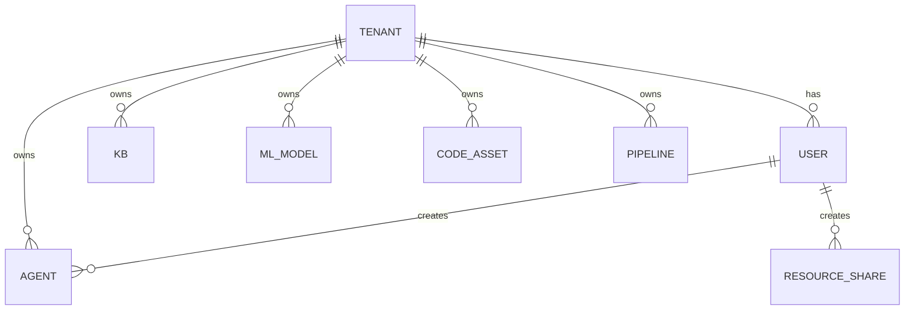
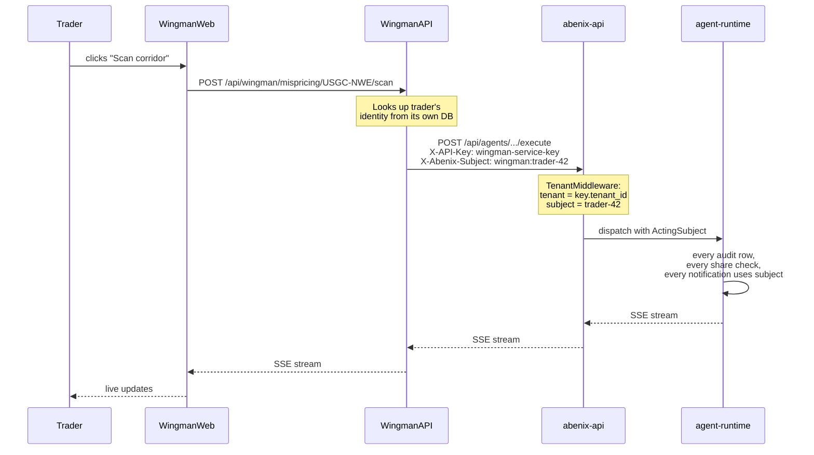
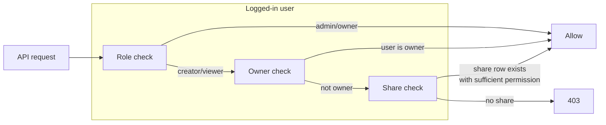

# Tenants, RBAC, and resource sharing

> Every row, every query, every JWT is scoped to a tenant. This is the invariant the entire codebase relies on.

---

## The tenant model

A **tenant** is an organisation. A tenant has many **users**, many **agents**, many **knowledge bases**, etc. Tenants are isolated — under no circumstance does a user in tenant A see data from tenant B.



Tenant IDs are UUIDs. The first tenant is created by the platform installer. subsequent tenants are created via the marketplace signup flow or by an admin via [`POST /api/admin/tenants`](../09-reference/00-rest-api.md#tenants).

> **Why** — multi-tenancy from day one means we never have to retrofit isolation. The cost is that every query is more verbose. the benefit is that a SaaS deployment, an on-prem dedicated deployment, and a marketplace-style multi-customer cloud all run the same code.

---

## How the tenant is established on every request

Three middlewares run in order. The third is the one you care about.

```mermaid
sequenceDiagram
  autonumber
  Client->>+IngressNginx: HTTP request
  IngressNginx->>+IPWhitelistMiddleware: check source IP
  IPWhitelistMiddleware->>+RateLimitMiddleware: ok
  RateLimitMiddleware->>+TenantMiddleware: ok
  TenantMiddleware->>TenantMiddleware: decode JWT or API key
  TenantMiddleware->>TenantMiddleware: set request.state.tenant_id<br/>+ request.state.user
  TenantMiddleware-->>-Router: pass-through
  Router-->>-Client: response
```

`TenantMiddleware` lives in [`apps/api/app/core/middleware.py`](../../apps/api/app/core/middleware.py). It accepts three forms of credentials:

1. **JWT** (`Authorization: Bearer ey…`) — issued by `/api/auth/login`, encodes `user_id`, `tenant_id`, `role`. Standard browser flow.
2. **API key** (`X-API-Key: af_…`) — long-lived, issued via [`/api/api-keys`](../09-reference/00-rest-api.md#api-keys). One key belongs to one tenant. can optionally be scoped to a single user (otherwise it acts as the tenant's service account).
3. **API key + actAs header** — see below.

After the middleware, every route handler can access the active subject via the `user: User = Depends(get_current_user)` dependency. `user.tenant_id` is the source of truth.

> **Trap** — never trust a `tenant_id` from a request body. The only authoritative source is the resolved JWT/API key.

---

## The actAs (delegated subject) pattern

This is the most-used pattern in the standalone-apps codebase. Worth understanding deeply.

### Problem
Wingman has its own users (traders). Wingman is not a tenant per se — it's a vertical app that ships with one tenant's worth of agents. When a trader does something in Wingman, we want the platform's audit log, RBAC, and sharing to attribute the action to **that trader**, not to "Wingman the service account."

### Solution



The header is `X-Abenix-Subject: <subject_type>:<subject_id>`. Common subject types:
- `wingman` — Wingman trader user
- `example_app` — the example app user
- `sauditourism`, `resolveai`, `industrial-iot`, `claimsiq` — their respective verticals
- `webhook` — for inbound webhooks where the subject is the source system

The platform doesn't validate the subject string format. It uses the type+id as the audit-log actor and as the recipient for any notifications routed through the platform.

### Code

Python:
```python
from abenix_sdk import Abenix, ActingSubject

client = Abenix(api_url="https://abenix.example.com", api_key=os.environ["WINGMAN_ABENIX_API_KEY"])
subject = ActingSubject(
    subject_type="wingman",
    subject_id="trader-42",
    email="alice@trading-desk.com",
    display_name="Alice — Crude Desk",
)
result = await client.with_subject(subject).execute("wingman-mispricing-extractor", {"corridor": …})
```

TypeScript:
```ts
const sdk = new Abenix({ apiUrl, apiKey });
const result = await sdk
  .withSubject({ subject_type: "example_app", subject_id: userId, email })
  .execute("example_app-clause-extractor", { document_id });
```

The SDK simply adds the `X-Abenix-Subject` header — there's no extra round-trip.

> **Why** — keeps RBAC + audit honest without requiring each standalone app to own a synced user-ID space inside the platform. The standalone apps' user DBs are the source of truth for *who Wingman thinks the user is*. the platform records the subject string verbatim.

---

## Roles

There are 4 roles on a tenant. Each user has exactly one.

| Role | Can | Cannot |
|---|---|---|
| **owner** | Everything | (nothing — owner is the root) |
| **admin** | Manage users, billing, settings, all resources | Transfer ownership |
| **creator** | Create agents, pipelines, KBs, ML models. share their own resources | Manage other users, see other users' private resources |
| **viewer** | Read shared resources. run agents shared with `use` permission | Create or modify anything |

The role is stored in `users.role` (Postgres enum). Endpoint-level gates use [`is_admin(user)`](../../apps/api/app/core/permissions.py) and similar helpers. There's a per-resource override via `resource_shares`.

---

## Resource sharing

Sharing lets a creator grant another user in the same tenant access to a single resource (one agent, one KB, etc.) without elevating their role.

Permissions are three-tier:

| Permission | What the recipient can do |
|---|---|
| **view** | See it in their list. cannot run or change it. |
| **use** | Call / run / query the resource. cannot modify its definition. |
| **edit** | Full editor — change config, schema, version. |

Sharing is **polymorphic** — one table handles every resource type. See [04-data-model/04-resource-shares](../04-data-model/04-resource-shares.md) for the schema.



The predicate lives in [`apps/api/app/core/permissions.py`](../../apps/api/app/core/permissions.py). endpoints call it like:

```python
if not await user_can(user, db, action="execute", resource=("agent", agent_id)):
    raise HTTPException(403, "Not allowed to execute this agent")
```

UI surfaces sharing via the generic `ResourceShareDialog` ([`apps/web/src/components/share/ResourceShareDialog.tsx`](../../apps/web/src/components/share/ResourceShareDialog.tsx)) mounted on ML Models, Code Runner, Knowledge Bases, and agent detail.

> **Trap** — the agent-specific `agent_sharing.py` router still exists for backward-compat alongside the polymorphic `me.py` router. New share UIs should use `/api/me/shares` (polymorphic), not `/api/agents/{id}/shares` (legacy).

---

## See also

- [04-data-model/04-resource-shares](../04-data-model/04-resource-shares.md) — schema
- [05-ui/02-api-client](../05-ui/02-api-client.md) — how the frontend handles 403 + share dialog
- [03-sdk/00-overview](../03-sdk/00-overview.md#the-actas-pattern) — actAs from the SDK side
