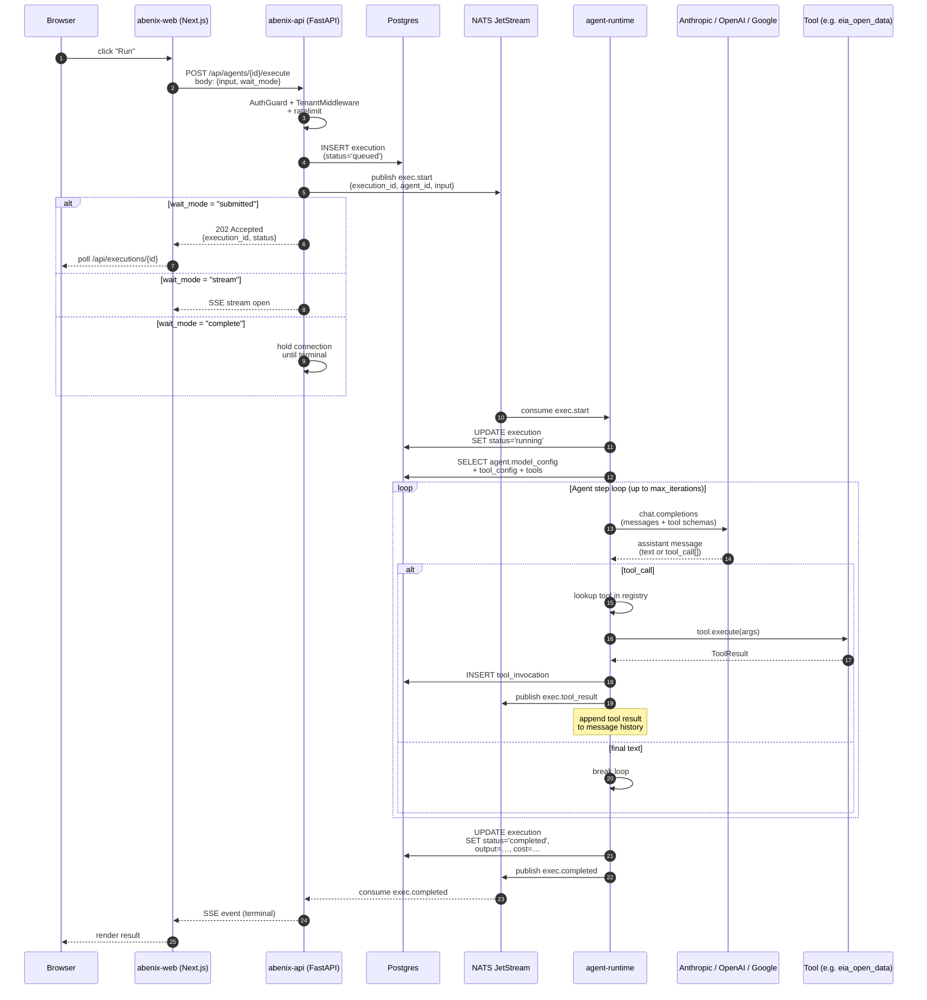
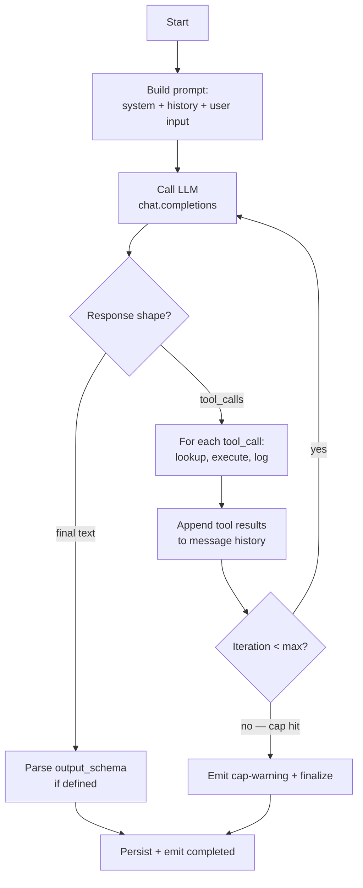
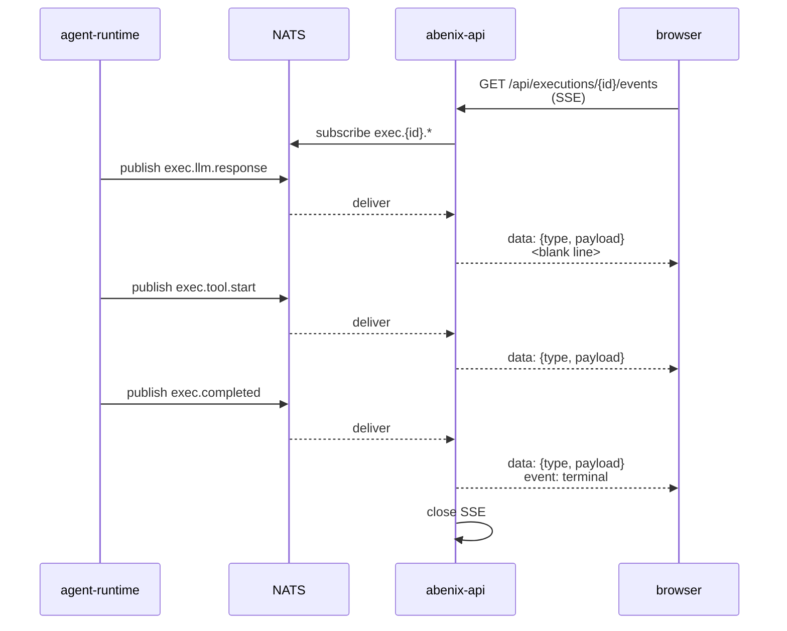

# Request lifecycle

> What happens between "user clicks Run" and "result appears on screen." Every hop, every queue, every database write.

This is the doc most worth reading end-to-end. Once you've internalised this sequence, the rest of the codebase reads naturally.

---

## The canonical example: "User clicks 'Run' on an agent"



20 numbered steps. Some collapse together (the agent loop often runs in 200ms with no tool call). others fan out (a single agent run can do 30 tool calls before terminating).

---

## Step-by-step deep dive

### 1-3. Auth + rate limit + tenant resolution

The first three middlewares run in a fixed order, defined in [`apps/api/app/main.py:100-122`](../../apps/api/app/main.py#L100-L122):

```python
app.add_middleware(IPWhitelistMiddleware)       # 1. block listed IPs
app.add_middleware(ObservabilityMiddleware)     # 2. start OTel span, emit metrics
app.add_middleware(BodySizeLimitMiddleware)     # 3. cap request body size
app.add_middleware(RateLimitMiddleware)         # 4. per-tenant rps cap
app.add_middleware(TenantMiddleware)            # 5. JWT/API-key -> tenant_id
```

By the time the route handler runs, `request.state.tenant_id` and `request.state.user` are set. The handler uses the `user: User = Depends(get_current_user)` dependency to access them.

> **Why** — middleware order matters. Body-size limit must come *before* rate-limit so a 10GB request is rejected before counting against the cap. Tenant resolution must come last because it's the most expensive step (DB lookup for API keys).

### 4. Execution row creation

The handler at [`apps/api/app/routers/agents.py`](../../apps/api/app/routers/agents.py) creates an `executions` row immediately. The status starts as `queued`. The execution_id (UUID) is the **stable identifier** that flows through every subsequent hop — every log line, every metric, every event references it.

```python
execution = Execution(
    tenant_id=user.tenant_id,
    agent_id=agent.id,
    actor_id=user.id,
    subject=acting_subject,        # actAs pattern
    input_payload=body.input,
    status=ExecutionStatus.QUEUED,
)
db.add(execution)
await db.commit()
```

### 5. Enqueue to NATS

```python
await nats.publish("exec.start", {
    "execution_id": str(execution.id),
    "tenant_id": str(user.tenant_id),
    "agent_slug": agent.slug,
    "runtime_pool": agent.model_config_.get("runtime_pool", "default"),
})
```

The `runtime_pool` field determines which agent-runtime pool consumes the message. KEDA scales each pool based on the queue depth for its subject — see [06-deployment/03-keda](../06-deployment/03-keda.md).

### 6-7. Response negotiation

The same endpoint supports three `wait_mode` values:

| `wait_mode` | Behaviour |
|---|---|
| `submitted` (default) | Returns `202 Accepted` with the `execution_id`. Client polls `/api/executions/{id}` or subscribes to the event stream separately. |
| `stream` | Returns an SSE stream from `/api/executions/{id}/events`. |
| `complete` | Holds the connection open until the execution reaches a terminal status. Has a hard 300s timeout. |

The SDK exposes this as `client.execute(slug, input, wait="…")`. See [03-sdk/00-overview](../03-sdk/00-overview.md).

### 8-9. Agent runtime picks up

The agent-runtime pod for the assigned pool consumes from NATS. It:
1. Sets the OTel span context from the message headers (distributed tracing carries across the queue).
2. Updates `executions.status = 'running'`.
3. Loads the full agent definition from Postgres — `system_prompt`, `model_config`, declared tools, `mcp_extensions`, `pipeline_config` if any.

The `agent_runtime_id` (set by the pod) is recorded on the execution row for forensic purposes.

### 10. The agent loop



Key parameters that govern the loop, all on `model_config`:

| Field | Default | Effect |
|---|---|---|
| `max_iterations` | 10 | Hard cap on tool-call rounds. Hit = `status='completed'` with a warning. |
| `max_tokens` | 8192 | Per-call generation cap. |
| `temperature` | 0.2 | LLM creativity. |
| `tools` | `[]` | List of tool slugs the agent can call. |
| `tool_config` | `{}` | Per-tool overrides — `parameter_defaults`, `max_calls`, `require_approval`, `usage_instructions`. |
| `output_schema` | `null` | If set, the final assistant message must parse as JSON matching this schema. otherwise the runtime retries the final step. |
| `mcp_extensions` | `null` | Adds MCP servers as tool sources — see [02-runtime/03-mcp](../02-runtime/03-mcp.md). |

### 11-12. Tool calls

Every tool call goes through the registry at [`apps/agent-runtime/engine/tools/__init__.py`](../../apps/agent-runtime/engine/tools/__init__.py). The registry maps `tool_slug → ToolClass`, instantiates with tenant + execution context, and calls `await tool.execute(args)`. See [02-runtime/02-tools](../02-runtime/02-tools.md) for the full framework.

Every successful or failed tool call writes a `ml_model_invocations` / `tool_invocations` row. The `/executions/{id}` page renders these as the **trace waterfall**.

### 13-14. Streaming events

Throughout the loop, the runtime emits events to NATS (the same execution_id is the partitioning key). Event types:

- `exec.iteration.start` — new loop iteration
- `exec.llm.request` / `exec.llm.response` — LLM round-trip
- `exec.tool.start` / `exec.tool.end` — tool call
- `exec.text` — assistant text fragment (for streaming UIs)
- `exec.completed` / `exec.failed` — terminal

The API server consumes the same subject on behalf of the connected SSE client. The flow:



### 15. Persist results

The terminal step in the runtime is two writes:

```python
async with db.begin():
    execution.status = ExecutionStatus.COMPLETED
    execution.output = final_output           # parsed against output_schema
    execution.duration_ms = elapsed_ms
    execution.cost_usd = sum_of_llm_costs
    await db.commit()
await nats.publish("exec.completed", {...})
```

These happen in a single Postgres transaction. The NATS publish happens *after* the commit, so a reader subscribing to NATS for `exec.completed` will always find a row at terminal state.

> **Trap** — if the runtime pod dies between the commit and the publish, the execution row is consistent but no `exec.completed` event ever fires. The reconciler job (in `worker`) catches these stragglers every 60s and emits the missing event.

### 16. Stragglers + sweeper

A Celery beat job in [`apps/worker/jobs/executions_reconcile.py`](../../apps/worker/jobs/) runs every 60s and:

1. Finds executions with `status='running'` and `updated_at` older than `agent.timeout`.
2. Marks them `failed` with `failure_code='runtime_died_or_timeout'`.
3. Emits the missing `exec.completed`.

This is what unsticks the dashboard when an agent-runtime pod gets OOM-killed mid-loop.

---

## Where the data lives at each stage

| Stage | Postgres tables touched | NATS subjects | Other |
|---|---|---|---|
| 1-3 Middleware | none (token decode) | none | (Redis for rate-limit counters) |
| 4 Insert | `executions` | none | |
| 5 Enqueue | none | `exec.start` | |
| 8-9 Pickup | `executions` (status update), `agents`, `tool_configs` | none | |
| 11-12 Tool | `tool_invocations`, `ml_model_invocations` | none | Tool-specific stores (S3, Neo4j, external) |
| 13-14 Stream | none | `exec.*` (many) | |
| 15 Terminal | `executions` (final), `audit_logs` | `exec.completed` | |

---

## Variant: pipeline execution

When the agent's `model_config.mode = 'pipeline'`, the runtime delegates to the **pipeline engine** instead of running a single LLM loop. The pipeline engine is a topo-sorted DAG executor that runs each node (which itself may be a single-LLM agent, a tool call, a switch, a for-each, or a sub-pipeline). See [02-runtime/01-pipelines](../02-runtime/01-pipelines.md).

The lifecycle around the engine (4-7 + 15-16) is identical — only the loop inside step 10 differs.

---

## Variant: approval gate fires

If a tool in the loop is `approval_gate`, the runtime:

1. Inserts an `approvals` row with `status='pending'`.
2. Emits `exec.approval.requested` to NATS.
3. **Pauses** by writing `executions.status='waiting_approval'` and exiting the runtime loop.

The execution is durable in Postgres. When a human signs off via the Approvals page, the API:

1. Updates the approval row.
2. If signoffs >= required: emits `exec.resume` to NATS.

A runtime pod consumes `exec.resume`, restores the saved message history from Postgres, and resumes from where it left off.

> **Why** — durably pausing in the database (not in-memory) means we can OOM-kill the runtime pod, restart it from a fresh image, and resume the agent. Critical for long-running compliance workflows.

See [02-runtime/05-approvals-hitl](../02-runtime/05-approvals-hitl.md).

---

## Where to go next

- The runtime's internals → [02-runtime/00-agent-execution](../02-runtime/00-agent-execution.md)
- Tools — what they look like, how to add one → [02-runtime/02-tools](../02-runtime/02-tools.md)
- Observability — how to trace a slow execution → [06-deployment/04-observability](../06-deployment/04-observability.md)
- Common failure modes → [08-howto/04-debugging](../08-howto/04-debugging.md)
