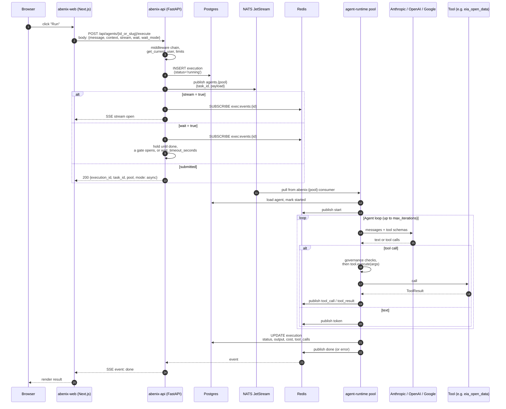
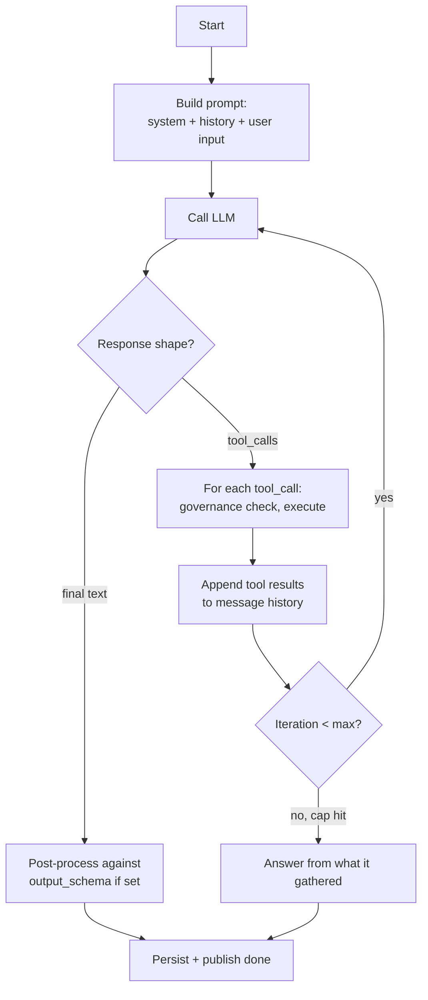
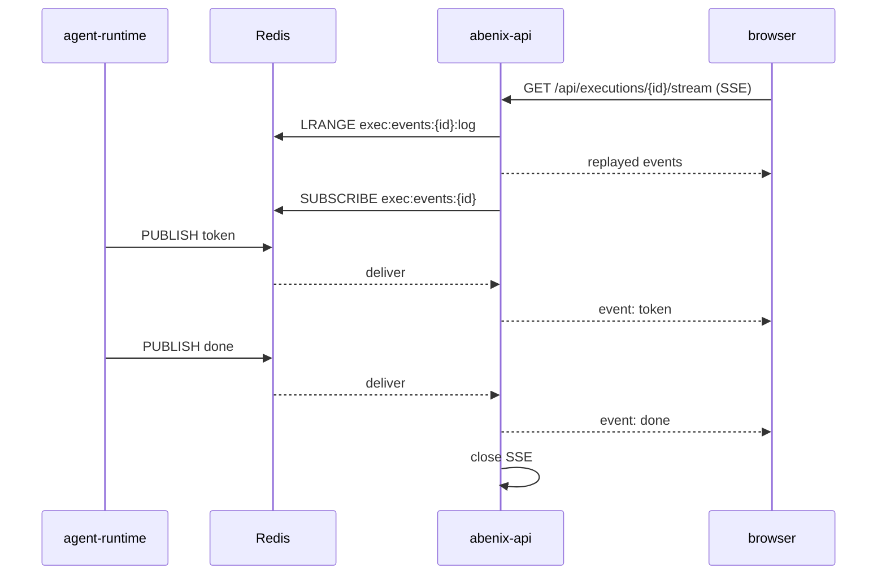

# Request lifecycle

> What happens between "user clicks Run" and "result appears on screen". Every hop, every queue, every database write.

Read this one end to end. Most of the codebase hangs off this sequence.

---

## The canonical example: "User clicks 'Run' on an agent"

This is the pool path, used when `scaling.execRemote` is on (local and Azure overlays) and the agent's `runtime_pool` is not `inline`. The inline path is the same up to step 5, then the API runs the loop itself, see [inline execution](#variant-inline-execution).



Some steps collapse (an agent loop with no tool call is one LLM round trip). Others fan out (one run can make dozens of tool calls).

---

## Step by step

### 1-3. Middleware, auth and limits

The middlewares are registered in [`apps/api/app/main.py`](../../apps/api/app/main.py):

```python
app.add_middleware(SecurityHeadersMiddleware)
app.add_middleware(IPWhitelistMiddleware)
app.add_middleware(ObservabilityMiddleware)
app.add_middleware(BodySizeLimitMiddleware)
app.add_middleware(RateLimitMiddleware)
app.add_middleware(TenantMiddleware)
app.add_middleware(CORSMiddleware, ...)
```

Starlette makes the last one registered the outermost. A request passes CORS, then `TenantMiddleware`, `RateLimitMiddleware`, `BodySizeLimitMiddleware`, `ObservabilityMiddleware`, `IPWhitelistMiddleware`, `SecurityHeadersMiddleware`, and then the route. CORS is outermost on purpose, so 401, 403, 429 and 5xx responses still carry the CORS headers.

- `TenantMiddleware` reads `X-API-Key` (keys start with `af_`, looked up by hash and cached) or the JWT and sets `request.state.tenant_id`.
- `RateLimitMiddleware` applies a sliding window per user (per IP when there is no user) in Redis under `abenix:ratelimit:*`. Auth routes get a stricter per-IP window on top.
- The handler gets the user from `Depends(get_current_user)`. That dependency also honours `X-Abenix-Subject` when the API key has the `can_delegate` scope.

Inside `execute_agent` ([`apps/api/app/routers/agents.py`](../../apps/api/app/routers/agents.py)) the handler resolves the agent by UUID or slug, checks share access, applies an `Idempotency-Key` header if present, then `check_limit` (the tenant's daily execution cap for its plan) and `check_user_quota` (monthly token and cost allowance). Either one refuses with 429 before the execution row is written. An archived agent answers 410 `AGENT_DELETED`.

### 4. Execution row creation

The handler creates the `executions` row before anything runs. It starts as `running`. The `ExecutionStatus` enum has only `running`, `completed`, `failed` and `cancelled`. The handler also records where the run came from (`trigger_kind`, shown as "Started by"). A database trigger stamps provenance on insert, see [governance](07-governance.md#run-provenance).

```python
execution = Execution(
    tenant_id=user.tenant_id,
    agent_id=agent.id,
    user_id=user.id,
    subject_id=_subj_id,          # actAs
    subject_type=_subj_type,
    input_message=sanitized_message,
    status=ExecutionStatus.RUNNING,
    model_used=model if not is_pipeline else "pipeline",
    model_requested=model if not is_pipeline else "pipeline",
    started_at=datetime.now(timezone.utc),
    parent_execution_id=parent_execution_id,
)
db.add(execution)
await db.commit()
```

The execution id is the stable identifier for every later hop, log line, metric and event.

### 5. Enqueue

```python
agent_pool = getattr(agent, "runtime_pool", None) or "default"
if settings.scaling_exec_remote and agent_pool != "inline":
    backend = get_queue_backend()
    task_id = await backend.submit(agent_pool, payload)
```

`payload` carries `execution_id`, `agent_id`, `tenant_id`, `user_id`, `role`, `api_key_id`, `message`, `history`, `context`, `is_pipeline`, `parent_execution_id`, `delegation_depth`, `model_override` and `conversation_id`. The NATS backend ([`apps/agent-runtime/engine/queue_backend.py`](../../apps/agent-runtime/engine/queue_backend.py)) publishes it to `agents.<pool>` on the JetStream stream `agents`, with the W3C `traceparent` in the envelope's `trace` field so the runtime continues the API's trace. Queued runs need NATS. The Celery backend refuses to enqueue agents. If the enqueue fails for any reason the API falls back to running the agent inline.

KEDA scales each pool on the lag of its consumer, see [06-deployment/03-keda](../06-deployment/03-keda.md).

### 6-7. Response negotiation

`ExecuteRequest` ([`apps/api/app/schemas/agents.py`](../../apps/api/app/schemas/agents.py)) has `stream` (default `true`), `wait` (tri-state) and `wait_mode`.

An optional `conversation_id` names a chat thread the caller owns. The API loads that thread's earlier messages ([`apps/api/app/core/chat_history.py`](../../apps/api/app/core/chat_history.py)), keeps the newest that fit in about 8,000 tokens and drops the oldest first, then hands them to the agent as prior turns ahead of the new message. Inline, queued and runtime-pod runs all receive the same list. A thread that does not exist or belongs to someone else answers 404. Pipeline agents ignore it. Runs with history skip the response cache, since the answer depends on the thread.

| Request | Behaviour |
|---|---|
| `stream: true` | SSE stream of the run's events, ending with `done` or `error` |
| `wait: true` or `wait_mode: "completed"` | Holds the connection until the run ends, up to `wait_timeout_seconds` (default 180, max 1800). A run that fails still answers 200 with `status: "failed"` and the `execution_id`. A wait that times out while the run is still going answers 202 with `status: "running"`, `wait_timed_out: true` and the `execution_id` to follow. The SDKs keep polling it. On the pool path the body has `mode: "sync_via_queue"` |
| `wait_mode: "until_gate"` | Like `completed`, but returns early with `status: "paused"` and `paused_at` when a human approval gate opens |
| `wait: false` or `wait_mode: "submitted"` | Returns at once with `execution_id`. On the pool path the body also has `task_id`, `pool` and `mode: "async"` |

When `wait` is omitted, API-key callers (the SDKs) get `wait: true` and `stream: false`. Browser callers keep the stream. The SDK exposes this as `execute(slug, message, wait=...)`, see [03-sdk/00-overview](../03-sdk/00-overview.md).

### 8-9. Agent runtime picks up

The pool pod runs [`apps/agent-runtime/consumer.py`](../../apps/agent-runtime/consumer.py). It pulls messages from its durable consumer with up to `AGENT_CONCURRENCY` runs in flight (8 when unset). It acks a message only once the run has finished, been skipped or been given up. For each run it:

1. Claims a lease on the execution row (`lease_expires_at`, `CONSUMER_LEASE_SECONDS`, default 25). A heartbeat renews the lease and tells JetStream the message is still in progress.
2. Loads the execution and the agent (system prompt, `model_config`, tools, MCP extensions, `pipeline_config`), and the tenant's moderation gate.
3. Sets `started_at` and publishes a `start` event.
4. Builds `AgentExecutor` or `PipelineExecutor`, which opens a governance run context at the agent's risk tier, see [governance](07-governance.md).

### 10. The agent loop



Fields on `model_config` that govern the loop:

| Field | Default | Effect |
|---|---|---|
| `model` | `claude-sonnet-4-5-20250929` | LLM to call, subject to the tier's allowed models |
| `max_iterations` | 10 | Cap on loop rounds. When hit, the agent answers from what it gathered. Inline runs fall back to the platform setting `agent.max_iterations` (default 10) |
| `max_tokens` | 4096 | Per-call generation cap |
| `temperature` | 0.7 | Sampling temperature |
| `tools` | `[]` | Tool names the agent can call |
| `tool_config` | `{}` | Per-tool settings such as `parameter_defaults` |
| `output_schema` | none | Validates and normalises the final output. Problems ride on the `done` event as `validation_warnings`, there is no retry |
| `mcp_extensions` | none | Adds MCP servers as tool sources, see [02-runtime/03-mcp](../02-runtime/03-mcp.md) |
| `risk_tier` | unset, treated as `low` | The run's starting tier |

### 11-12. Tool calls

`build_tool_registry` in [`apps/agent-runtime/engine/agent_executor.py`](../../apps/agent-runtime/engine/agent_executor.py) maps tool names to classes and instantiates them with tenant and execution context into a `ToolRegistry` ([`engine/tools/base.py`](../../apps/agent-runtime/engine/tools/base.py)). Every `execute` goes through one wrapper that checks kill switches and the tool's risk tier first. See [02-runtime/02-tools](../02-runtime/02-tools.md).

The run's tool calls end up in `executions.tool_calls`. ML model, code asset and KB query tools also write a row each to `ml_model_invocations`, `code_asset_invocations` and `kb_query_invocations`. The `/executions/{id}` page renders the trace from these.

### 13-14. Streaming events

Events go to Redis, not NATS. Both the API ([`apps/api/app/core/execution_bus.py`](../../apps/api/app/core/execution_bus.py)) and the consumer publish to the channel `exec:events:<execution_id>` and append to the list `exec:events:<execution_id>:log`, capped at 500 events with a 1 h TTL.

Event names on that channel:

- `start`: the runtime picked the run up
- `token`: assistant text
- `tool_call` / `tool_result`: a tool round trip
- `node_trace`: one tool's result and timing, for the trace view
- `node_start` / `node_complete`: pipeline nodes
- `moderation`: the moderation gate acted
- `done` / `error`: terminal



`GET /api/executions/{id}/stream` replays the log and then follows live. `GET /api/executions/{id}/watch` streams DAG snapshots for pipelines. Tool-level narration for a whole agent tree goes on a separate channel, `progress:<root_execution_id>`, see [05-architectural-patterns](05-architectural-patterns.md#16-sse-bridge-over-redis-pubsub).

### 15. Persist results

When the loop ends the consumer writes the terminal state (`status`, `output_message`, `cost` and the per-provider costs, tokens, `duration_ms`, `tool_calls`, `failure_code`, `trace_id`) and only then publishes `done` or `error`. A subscriber that sees `done` always finds the row at its terminal state. A database trigger on `executions` then writes an `execution.completed` or `execution.failed` row to `event_outbox` for webhook subscribers, whichever code path finished the run.

> **Trap**: the runtime acks the NATS message only after the run ends. If the pod dies mid-run, JetStream redelivers it once the ack window lapses, and another pod takes over when the run's lease on the row has expired. The takeover reruns the agent from the start, so tool side effects can repeat. After 3 pickups (`CONSUMER_MAX_ATTEMPTS`) the run fails with `STALE_SWEEP`. See [08-queue-scaling](../02-runtime/08-queue-scaling.md#at-least-once-delivery).

### 16. Stragglers + sweeper

`sweep_stale_executions` in [`apps/api/app/core/scheduler.py`](../../apps/api/app/core/scheduler.py) runs every 5 minutes in the API pod, one replica at a time under an advisory lock. It:

1. Finds executions still `running` whose `created_at` is older than `STALE_EXECUTION_MAX_MINUTES` (default 10).
2. Skips runs parked on a human approval gate (`hitl:waiting:<id>` in Redis) and runs whose queue lease (`lease_expires_at`) is still live.
3. Marks the rest `failed` with `failure_code='STALE_SWEEP'`, then notifies the owners in-app.

This is what unsticks the dashboard when a pod gets OOM-killed mid-loop.

---

## Where the data lives at each stage

| Stage | Postgres tables touched | Queues and channels | Other |
|---|---|---|---|
| 1-3 Middleware | `api_keys` on a cache miss | none | Redis rate-limit counters |
| 4 Insert | `executions`, `execution_config_snapshots` (trigger), `execution_idempotency` if keyed | none | |
| 5 Enqueue | none | NATS `agents.<pool>` | |
| 8-9 Pickup | `executions` (lease claim), `agents`, `moderation_policies` | none | |
| 11-12 Tool | `*_invocations` for ML, code asset and KB tools | `progress:<root>` | Tool-specific stores |
| 13-14 Stream | none | Redis `exec:events:<id>` | |
| 15 Terminal | `executions`, `event_outbox` (trigger) | Redis `done` / `error` | |

---

## Variant: inline execution

A run stays inline when `scaling.execRemote` is off, when the agent has `runtime_pool: inline`, or when the enqueue fails. With `runtimeMode: embedded` (the base default, also set in the Azure overlay) the API pod runs `AgentExecutor` itself. With `runtimeMode: remote` the API streams an inline agent run over HTTP from the `agent-runtime` service at `RUNTIME_URL` (port 8001). With `stream: true` the SSE goes straight to the browser. Otherwise the request holds until the run ends. The row, the governance checks and the terminal write match the pool path.

## Variant: pipeline execution

When `model_config.mode = 'pipeline'`, the runtime hands the run to `PipelineExecutor` ([`apps/agent-runtime/engine/pipeline.py`](../../apps/agent-runtime/engine/pipeline.py)) instead of a single LLM loop. It is a topologically sorted DAG executor whose nodes are tools, agent steps, conditions, switches, for-each loops, merges or sub-pipelines. See [02-runtime/01-pipelines](../02-runtime/01-pipelines.md).

The lifecycle around it (steps 4-7 and 15-16) is identical. Only step 10 differs, and pipelines publish `node_start` and `node_complete` instead of tokens.

---

## Variant: approval gate fires

Approval gates block inside the running pod. They do not save the loop and exit.

- **`approval_gate` tool**: creates an `approvals` row through `POST /api/approvals`, then polls it every 2 s until it leaves `pending` or expires.
- **`human_approval` tool and tier escalation**: when a run calls a tool above its tier and the tier policy says ask a person, the tool wrapper opens a `human_approval` gate. It writes `hitl:approval:<execution_id>:<gate_id>` and `hitl:pending:<tenant>` in Redis and polls every 2 s until someone decides on the Approvals page or the timeout passes (default 3600 s, at most 7200 s).

Both set `hitl:waiting:<execution_id>` so the stale sweeper leaves the run alone while it waits. The run stays `running` the whole time. SDK callers that do not want to block on a person use `wait_mode: "until_gate"`.

See [02-runtime/05-approvals-hitl](../02-runtime/05-approvals-hitl.md).

---

## Where to go next

- The runtime's internals → [02-runtime/00-agent-execution](../02-runtime/00-agent-execution.md)
- Tools, what they look like and how to add one → [02-runtime/02-tools](../02-runtime/02-tools.md)
- Observability, how to trace a slow execution → [06-deployment/04-observability](../06-deployment/04-observability.md)
- Common failure modes → [08-howto/04-debugging](../08-howto/04-debugging.md)
