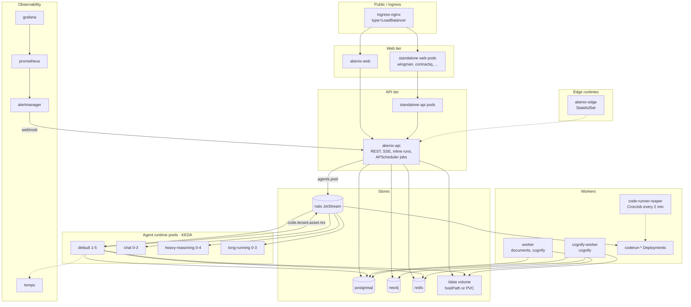

# Service inventory

> Every workload the platform runs, what it does, how it scales, and where its source lives. Checked against `infra/helm/abenix` and `scripts/deploy-azure.sh`.

This is a reference doc. Skim the tables, deep-read only the entries relevant to your task.

The chart has three main postures. The base `values.yaml` installs the simple embedded setup with most extras off. `values-local.yaml` (minikube) and `values-azure.yaml` (AKS) switch on NATS, the runtime pools, KEDA and the code runners. `values-local-runtime.yaml` and `values-production.yaml` are extra overlays that `scripts/deploy.sh` uses. Where a component depends on a flag, the flag is named below.

---

## Bird's-eye topology

Azure posture. Dashed edges are optional or created on demand.



---

## Core platform services

### `abenix-api`: REST, SSE and the scheduler
- **Language**: Python 3.12 / FastAPI, `uvicorn app.main:app` on 8000 with `API_WORKERS` processes (default 2)
- **Source**: [`apps/api/`](../../apps/api/)
- **Image**: [`docker/Dockerfile.api`](../../docker/Dockerfile.api). It also copies `apps/agent-runtime`, so the API can run agents in-process.
- **Replicas**: base chart 3, HPA 3-10 on CPU. Azure runs 1 with autoscaling off.
- **Responsibility**: Every REST endpoint the browser and SDKs hit, auth + RBAC, SSE event streams, inline agent runs (an agent with `runtime_pool: inline`, or every run when `scaling.execRemote` is off). It also enqueues pool runs on NATS when `scaling.execRemote` is on.
- **Scheduled jobs**: every API process runs APScheduler ([`apps/api/app/core/scheduler.py`](../../apps/api/app/core/scheduler.py)), not Celery beat. Jobs that must run once per cluster take a Postgres advisory lock or claim rows with `SKIP LOCKED`. Times are UTC.

| Job | Schedule | What it does |
|---|---|---|
| `check_due_triggers` | every 30 s | Fires due cron triggers on agents |
| `ping_models` | every 60 min | LLM availability probes |
| `sweep_stale_executions` | every 5 min | Marks runs still `running` after `STALE_EXECUTION_MAX_MINUTES` (default 10) as failed with `STALE_SWEEP`, skipping runs parked on an approval and runs whose queue lease is still live |
| `eval_schedules` | every 60 s | Scheduled and model-change evaluation runs |
| `reconcile_active_executions_gauge` | every 5 min | Re-syncs the active executions gauge to the database |
| `score_drift_backlog` | every `DRIFT_SCAN_INTERVAL_SECONDS` (default 300) | Scores finished runs the drift hooks missed |
| `announce_finished_runs` | every 15 s | Tells owners about runs a runtime pool finished, bell, Slack and email, once per run |
| `reset_monthly_quotas` | 1st of the month, 00:00 UTC | Resets monthly token and cost quotas |
| `link_audit_chain` | every 30 s | Links new `activity_logs` rows into the hash chain |
| `dispatch_events` | every 2 s | Fans `event_outbox` rows out to subscriptions and delivers webhooks |
| `watch_sources` | every 30 s | Checks watched sources that are due |
| `prune_events` | daily 04:05 | Drops delivered webhooks after 30 days and dispatched outbox rows after 7 |
| `verify_audit_chain` | daily 03:15 | Verifies every tenant's audit chain |
| `escalate_approvals` | every 15 min | Escalates tiered approvals nobody has acted on |
| `observe_actions` | every 30 s | Reads due action outcomes, scores them and moves autonomy levels |
| `moderation_review_tick` | every 15 s | Tells reviewers about held content and applies review time limits |
| `moderation_retention` | every 60 min | Purges moderation data past each tenant's retention |
| `group_lessons` | every 2 min | Turns new failures and feedback into lessons and groups them |
| `improvements_tick` | every 15 s | Proposes fixes for lesson groups over the threshold and drains the proof queue |
| `improvements_watch` | every 5 min | Compares released fixes with the old revision, keeps or rolls back |
| `lesson_retention` | every 60 min | Purges lessons and feedback past each tenant's retention |
| `nightly_archive` | daily 02:00 | Archives recording tables past retention |
| `pinecone_vacuum` | daily 02:30 | Queues the Pinecone orphan vacuum on the worker's `documents` queue |

- **Key envs**: `DATABASE_URL`, `REDIS_URL`, `NATS_URL` / `NATS_USER` / `NATS_PASSWORD`, `QUEUE_BACKEND`, `SCALING_EXEC_REMOTE`, `RUNTIME_MODE`, `RUNTIME_URL`, `ML_MODELS_DIR`, `PROMETHEUS_URL`, `ALERTMANAGER_URL`.
- **Where to look first**: [`apps/api/app/main.py`](../../apps/api/app/main.py) for router wiring and startup.

### `abenix-web`: the browser UI
- **Language**: TypeScript / Next.js 15 (App Router), `node apps/web/server.js` on 3000
- **Source**: [`apps/web/`](../../apps/web/)
- **Image**: [`docker/Dockerfile.web`](../../docker/Dockerfile.web)
- **Replicas**: base chart 2, HPA 2-8 on CPU. Azure runs 1.
- **Responsibility**: Renders every UI page. The `(app)/` folder is the authenticated app.
- **Talks to**: `abenix-api` only. Never queries the DB directly.
- **Build-time inlining**: `NEXT_PUBLIC_*` env vars (`NEXT_PUBLIC_API_URL`, `NEXT_PUBLIC_GRAFANA_URL`) are baked into the client bundle at build. To change them, rebuild the image. `kubectl set env` on the Deployment does nothing. `deploy-azure.sh` passes the Grafana URL as a build argument when it knows the ingress host.

### `abenix-agent-runtime-<pool>`: the runtime pools
- **Language**: Python 3.12. The pod runs `python3 consumer.py`, not the image's default uvicorn.
- **Source**: [`apps/agent-runtime/consumer.py`](../../apps/agent-runtime/consumer.py), template [`agent-runtime-pools.yaml`](../../infra/helm/abenix/templates/agent-runtime-pools.yaml)
- **Image**: [`docker/Dockerfile.agent-runtime`](../../docker/Dockerfile.agent-runtime)
- **Enabled by**: `scaling.enabled` with entries in `scaling.pools`. Off in the base chart. Local runs only `default`. Azure runs four. `AGENT_CONCURRENCY` comes from each pool's `concurrency_per_replica`.

| Pool (Azure) | Replicas | `AGENT_CONCURRENCY` |
|---|---|---|
| `default` | 1-5 | 3 |
| `chat` | 0-3 | 6 |
| `heavy-reasoning` | 0-4 | 2 |
| `long-running` | 0-3 | 1, scales on a single queued job |

- **Responsibility**: pulls from JetStream stream `agents`, subject `agents.<pool>`, durable consumer `abenix-<pool>-consumer`. Runs the agent or pipeline, writes the execution row, publishes events to Redis. It acks a message only after the run ends and holds a lease on the execution row meanwhile, see [08-queue-scaling](../02-runtime/08-queue-scaling.md#at-least-once-delivery). Pools need `scaling.queueBackend: nats`. With anything else the pod exits at startup and the chart refuses to render pools. A second loop in the same pod, [`tool_stream_consumer.py`](../../apps/agent-runtime/tool_stream_consumer.py), runs tool jobs the API puts on the Redis stream `tools:queue`.
- **Scaling**: a KEDA ScaledObject per pool when `scaling.keda.enabled`. Triggers are JetStream consumer lag, plus a p95 duration query when `scaling.keda.prometheusUrl` is set. See [06-deployment/03-keda](../06-deployment/03-keda.md).
- **Pool selection**: the `agents.runtime_pool` column, default `default`. `inline` keeps the run on the API pod.

The `agent-runtime` subchart (one Deployment running `uvicorn server:app` on 8001) is on in the base chart and off in the local and Azure overlays. The API calls it only with `runtimeMode: remote`, for agent runs that stay inline, at `RUNTIME_URL`.

### `worker`: Celery jobs
- **Language**: Python / Celery. The image runs `celery -A worker.celery_app worker --concurrency=2 -Q documents,cognify,agents` and the chart keeps that command.
- **Source**: [`apps/worker/`](../../apps/worker/)
- **Image**: [`docker/Dockerfile.worker`](../../docker/Dockerfile.worker)
- **Replicas**: base chart 2, HPA 2-5 on CPU. Azure runs 1.
- **Broker**: Redis. The chart sets `CELERY_BROKER_URL` to db 0 and `CELERY_RESULT_BACKEND` to db 1.
- **No beat schedule.** Every periodic job lives in the API scheduler above.
- **No agent task.** Queued agent runs go over NATS to the agent-runtime pools. The worker still subscribes to `agents`, but nothing is routed there.

| Task | Queue | Started by |
|---|---|---|
| `worker.tasks.document_processor.process_document` | `documents` | KB uploads. Parse, chunk, embed |
| `worker.tasks.cognify_task.run_cognify_job` | `cognify` | Cognify runs. Entity and relationship extraction into Neo4j |
| `worker.tasks.kb_reembed.run` | `documents` | Re-embedding a collection after an embedding model change |
| `worker.tasks.pinecone_vacuum.run` | `documents` | Daily Pinecone orphan clean-up, queued at 02:30 UTC by the API scheduler |

### `cognify-worker`: graph extraction
- **Source**: same image as the worker, template [`cognify-worker-deployment.yaml`](../../infra/helm/abenix/templates/cognify-worker-deployment.yaml)
- **Enabled by**: `cognifyWorker.enabled`, on by default. 1 replica, concurrency 2 (1 on Azure). Its HPA is off by default.
- **Responsibility**: consumes only the `cognify` queue. A large document can pin a worker for minutes, so this takes most cognify work off the main worker, which also listens on `cognify`.

### Code runners: warm runners for code assets
- **Source**: [`apps/code-runner/runner.py`](../../apps/code-runner/runner.py) (`prepare`, `exec` and `gateway` roles), orchestration in [`apps/agent-runtime/engine/code_runners.py`](../../apps/agent-runtime/engine/code_runners.py), template [`code-runners.yaml`](../../infra/helm/abenix/templates/code-runners.yaml)
- **Enabled by**: `codeRunners.enabled`. Off in the base chart, on locally and on Azure. Requires `scaling.queueBackend: nats`, the chart refuses to render otherwise.
- **How it works**: the `code_asset` tool sends a NATS request to `code.<tenant>.<asset>.<revision>` (with `.net` when the call asks for network). The Deployment `coderun-<tenant8>-<asset8>-<revision>` (with `-net` for network access) is created on the first call, one per tenant and asset version. Each pod has an init `prepare` container, an `exec` container that runs the code, and a `gateway` container that holds the NATS login and serves `/metrics` on 9464. With nobody listening and `mode: auto`, the tool falls back to a one-off Job and starts the runner in the background.
- **Chart objects**: the `<release>-code-runner-nats` Secret, two NetworkPolicies (`none` and `open` network, plus `<release>-api-from-code-runners` when `networkPolicy.enabled`), and the `code-runner-reaper` CronJob (`*/2 * * * *`, `python3 -m engine.code_runners reap`) that drains old versions and scales idle runners to zero after `idleSeconds` (900).
- **Scaling**: KEDA on runner load when `codeRunners.keda.enabled` (Azure), CPU HPA otherwise.
- See [02-runtime/16-warm-code-runners](../02-runtime/16-warm-code-runners.md).

### `improvements-proof`: proof pool for self-improvement
- **Source**: the API image running `python -m app.workers.improvements_proof`, template [`improvements-proof-pool.yaml`](../../infra/helm/abenix/templates/improvements-proof-pool.yaml)
- **Enabled by**: `improvements.proofPool.enabled`. Off in the base chart and not set in the local or Azure overlays.
- **Responsibility**: proves proposed agent fixes apart from live traffic. With it off, the API pods drain the proof queue from `improvements_tick`. KEDA scales it 0-4 on queue depth when `improvements.proofPool.keda.enabled`. See [governed self-improvement](../02-runtime/23-governed-self-improvement.md).

### In-process services (no pod of their own)

| Service | Runs in | Source | Doc |
|---|---|---|---|
| Decision service (ZEN engine, `zen-engine` 2.1.2) | API pod for `/api/decisions`, and wherever the agent runs for the `decision_*` tools | [`apps/agent-runtime/engine/decisions/`](../../apps/agent-runtime/engine/decisions/) | [Decision service](../02-runtime/20-decision-service.md), [author view](../08-howto/09-decisions.md) |
| Outbound events | API scheduler, `dispatch_events` | [`apps/api/app/services/events.py`](../../apps/api/app/services/events.py) | [Outbound events](../02-runtime/19-outbound-events.md) |
| Source watch | API scheduler, `watch_sources` | [`apps/api/app/services/source_watch.py`](../../apps/api/app/services/source_watch.py) | [Source watch](../02-runtime/17-source-watch.md) |
| Evaluation runner | API scheduler and asyncio tasks in the API pod | [`apps/api/app/services/eval_runner.py`](../../apps/api/app/services/eval_runner.py) | [Evaluation suites](../02-runtime/18-evaluation-suites.md) |
| Governance snapshot | every API and runtime pod | [`apps/agent-runtime/engine/governance.py`](../../apps/agent-runtime/engine/governance.py) | [Governance](07-governance.md) |
| Audit chain | API scheduler, `link_audit_chain` and `verify_audit_chain` | [`apps/api/app/services/audit_chain.py`](../../apps/api/app/services/audit_chain.py) | [Governance](07-governance.md#tamper-evident-audit-log) |
| Archiver | API scheduler, `nightly_archive` | [`apps/api/app/services/archiver.py`](../../apps/api/app/services/archiver.py) | [Retention](04-data-stores.md#retention) |
| Earned autonomy | API scheduler, `observe_actions` | [`apps/api/app/services/autonomy.py`](../../apps/api/app/services/autonomy.py) | [Earned autonomy](../02-runtime/21-earned-autonomy.md) |
| Lessons and improvements | API scheduler, `group_lessons`, `improvements_*`, `lesson_retention` | [`apps/api/app/services/lessons.py`](../../apps/api/app/services/lessons.py), [`improvements.py`](../../apps/api/app/services/improvements.py) | [Lessons](../02-runtime/22-lessons-and-improvements.md) |
| Moderation review | API scheduler, `moderation_review_tick`, `moderation_retention` | [`apps/api/app/services/moderation_review.py`](../../apps/api/app/services/moderation_review.py) | [Moderation gate](../02-runtime/13-moderation-gate.md) |

Events are written to `event_outbox` in the same transaction as the change. The dispatcher claims rows with `FOR UPDATE SKIP LOCKED`, matches them to `webhooks` subscriptions, writes `webhook_deliveries`, and retries failed deliveries with backoff up to 8 attempts. When `NATS_URL` is set it also publishes each event to `abenix.events.<tenant>.<type>`, best effort.

Source watch claims due `watch_sources` rows with `FOR UPDATE SKIP LOCKED`, so replicas never fetch the same source twice. Each eval run is an asyncio task in the API pod that calls the normal execute path once per case.

---

## Standalone vertical apps

Each app ships its own manifest under `<app>/k8s/` and `deploy-azure.sh` applies it with `kubectl apply`, not helm. They follow the **thin-app pattern**, see [07-standalone-apps/00-pattern](../07-standalone-apps/00-pattern.md).

| App | Domain | Deployments | Container ports (web / api) |
|---|---|---|---|
| **Wingman** | Energy commodity trading | `wingman-web`, `wingman-api` | 3006 / 8006 |
| **E&C-Copilot** | Contract intelligence | `contractiq-web`, `contractiq-api` | 3001 / 8001 |
| **Mideast Tourism** | Tourism analytics | `mideasttourism-web`, `mideasttourism-api` | 3002 / 8002 |
| **Industrial-IoT** | Equipment health + alarm desk | `industrial-iot-web`, `industrial-iot-api` | 3003 / 8003 |
| **ResolveAI** | Customer-support automation | `resolveai-web`, `resolveai-api` | 3004 / 8004 |
| **PharmaVigil** | Drug-safety intelligence | `pharmavigil-web`, `pharmavigil-api` | 3007 / 8007 |
| **ClaimsIQ** | Insurance claims triage | `claimsiq`, one Java app serving UI and API | 3005 |

Each app holds a platform API key (`<APP>_ABENIX_API_KEY`) and calls `abenix-api` through the SDK with an `X-Abenix-Subject` header.

---

## Edge runtimes

For gateways and plant floors where a round trip to the cloud is too slow. Each variant is its own helm chart (`infra/helm/edge-runtime*`) and runs as a StatefulSet named after the gateway. `deploy-azure.sh` installs the Python one unless `EDGE_RUNTIME_ENABLED=false`, and the Rust or C one when `EDGE_RUNTIME_VARIANT` asks for it.

| Edge runtime | Language | Use case |
|---|---|---|
| `edge-runtime` | Python | Default. Runs signed `.agent` bundles locally |
| `edge-runtime-rust` | Rust | Same wire contract, smaller and faster |
| `edge-runtime-c` | C | Ultra-constrained gateways that cannot take Python or Rust |

All three register with the platform every 60 s, take bundle deploys on MQTT topic `edge.<gateway_id>.deploy`, verify the RSA signature, and serve `/agents/<slug>/execute` on 8080. See [06-deployment/05-edge-runtime](../06-deployment/05-edge-runtime.md).

---

## Data and infrastructure services

| Service | Kind | Replicas | Installed by | Notes |
|---|---|---|---|---|
| `postgresql` (Bitnami 15.5.38) | StatefulSet | base: primary, 1 read replica and pgpool. Azure: 1 standalone | chart dependency | Primary database. The base values use a Postgres 16 image with pgvector, Azure uses `bitnamilegacy/postgresql` |
| `redis` (Bitnami 19.6.4) | StatefulSet | 1 master | chart dependency | Celery broker, event bus, rate limits, caches |
| `neo4j` 5.20 | StatefulSet | 1 | chart dependency, always installed | Cognify knowledge graph |
| `nats` 2.10 JetStream | StatefulSet | 1, `nats.cluster.replicas` to scale | rendered when `scaling.queueBackend: nats` | Agent queue, code runner requests, event copies |
| `alertmanager` 0.27 | Deployment | 1 | chart, `alerting.alertmanager.enabled` (on) | Posts alerts to `/api/admin/alerts/webhook` |
| `prometheus` 2.55 | Deployment | 1 | `infra/observability/prometheus.yaml`, applied by `deploy-azure.sh` | Scrapes the API service, the runtime services and code runner pods. Loads the chart's alert rule ConfigMaps |
| `grafana` 11.3 | Deployment | 1 | `infra/observability/grafana.yaml` | Dashboards from `infra/observability/dashboards` |
| `tempo` 2.6 | Deployment | 1 | `infra/observability/tempo.yaml` | Trace backend, OTLP on 4317 (gRPC) and 4318 (HTTP) |
| `mosquitto` | helm release `abenix-mosquitto` | 1 | `deploy-azure.sh` | MQTT broker for streaming tools and edge deploys |
| `timescaledb` | helm release `abenix-timescaledb` | 1 | `deploy-azure.sh` | Separate TSDB for the `tsdb_*` tools, not the main database |
| `livekit` | `infra/k8s/livekit-dev.yaml` | 1 | `deploy-azure.sh` | Meeting tools |

Created at run time, not by the chart:

- **Model-serving Deployments**, one per deployed ML model, image `ML_MODEL_SERVING_IMAGE` ([`docker/Dockerfile.model-serving`](../../docker/Dockerfile.model-serving)), created by [`apps/api/app/routers/ml_models.py`](../../apps/api/app/routers/ml_models.py).
- **Sandboxed Jobs** from the `sandboxed_job` and `code_asset` tools. [`sandboxed-job-rbac.yaml`](../../infra/helm/abenix/templates/sandboxed-job-rbac.yaml) grants the default ServiceAccount Job and pod rights, plus the extra rights code runners need when they are on.

Optional chart objects, all off in the base values:

- **Backups** (`backup.enabled`, on in Azure). CronJob `<release>-pg-backup` at 02:00 runs `pg_dump` and keeps 7 daily and 4 weekly dumps, uploaded to S3 with `boto3` when `objectStorage.type` is `s3`. `backup.neo4j.enabled` adds `<release>-neo4j-backup` at 03:00, an APOC Cypher export over Bolt. Both write to the `<release>-backup` PVC when `backup.persistentVolume.enabled`. See [04-data-stores](04-data-stores.md#backup--dr).
- **ServiceMonitors** (`monitoring.enabled`) for clusters that run the Prometheus operator.
- **Network policies** (`networkPolicy.enabled`).

On by default: the cluster view RBAC (`clusterView.rbac.enabled`), a read-only ClusterRole and namespace Role for the `/admin/cluster` page.

---

## How services find each other

In-cluster discovery is Kubernetes DNS. With the release name `abenix` the chart and the observability manifests give these hosts:

```
abenix-api:8000
abenix-postgresql:5432
abenix-redis-master:6379
abenix-nats:4222           # monitor on 8222
abenix-neo4j:7687
abenix-alertmanager:9093
abenix-prometheus:9090
abenix-tempo:4317
abenix-agent-runtime:8001  # only when the subchart is on
```

Credentials (`DATABASE_URL`, `REDIS_URL`, `CELERY_BROKER_URL`, `NATS_PASSWORD`) come from the `abenix-secrets` Secret ([`secrets.yaml`](../../infra/helm/abenix/templates/secrets.yaml)). Everything else (`NATS_URL`, `NEO4J_URI`, `QUEUE_BACKEND`, storage paths, code runner settings) comes from the `abenix-config` ConfigMap ([`configmap.yaml`](../../infra/helm/abenix/templates/configmap.yaml)).

### NATS logins

NATS runs one JetStream account `A` plus the system account, with separate users:

| User | Password from | Can do |
|---|---|---|
| `abenix` | `NATS_PASSWORD` in `abenix-secrets` | Everything in account `A`, used by the API and the runtime pools |
| `coderun` (`codeRunners.nats.user`) | `password` in `<release>-code-runner-nats` | Subscribe to `code.>` and publish only to `_INBOX.>` replies. Present only when code runners are on |
| `sys` | `NATS_SYS_PASSWORD` in `abenix-secrets` | System account |

All three passwords are generated on first install and kept across upgrades. A value in `secrets.natsPassword`, `secrets.natsSysPassword` or `codeRunners.nats.password` wins. The passwords reach NATS as env vars, so none sit in the ConfigMap.

---

## Capacity guidance

These are ballparks from a small AKS cluster under demo load, not a benchmark. Measure your own workload.

| Service | Bottleneck |
|---|---|
| `abenix-api` | Postgres pool, and inline runs share the pod |
| `agent-runtime-*` | LLM latency dominates |
| `worker` | Job-specific, large PDFs and embeddings |
| `postgresql` | Disk IOPS on writes |

> **Trap**: every pod opens its own Postgres pool. The API uses `DB_POOL_SIZE` (10) plus `DB_MAX_OVERFLOW` (5). The runtime uses `RUNTIME_DB_POOL_SIZE` (5) plus `RUNTIME_DB_MAX_OVERFLOW` (5). With scaled replicas this can hit `max_connections` before any service feels CPU pressure. The Azure overlay raises `max_connections` to 400.

---

## See also

- [04-data-stores](04-data-stores.md): per-store overview
- [06-deployment/02-helm](../06-deployment/02-helm.md): how these are templated
- [06-deployment/03-keda](../06-deployment/03-keda.md): autoscaling rules per pool
- [06-deployment/04-observability](../06-deployment/04-observability.md): Prometheus, Grafana, Tempo, alerts

---

## Source map

| Service | Source | Dockerfile | Helm |
|---|---|---|---|
| `abenix-api` | [`apps/api/`](../../apps/api/) | [`docker/Dockerfile.api`](../../docker/Dockerfile.api) | subchart [`infra/helm/api`](../../infra/helm/api/) |
| `abenix-web` | [`apps/web/`](../../apps/web/) | [`docker/Dockerfile.web`](../../docker/Dockerfile.web) | subchart [`infra/helm/web`](../../infra/helm/web/) |
| runtime pools | [`apps/agent-runtime/`](../../apps/agent-runtime/) | [`docker/Dockerfile.agent-runtime`](../../docker/Dockerfile.agent-runtime) | [`templates/agent-runtime-pools.yaml`](../../infra/helm/abenix/templates/agent-runtime-pools.yaml) |
| `worker` | [`apps/worker/`](../../apps/worker/) | [`docker/Dockerfile.worker`](../../docker/Dockerfile.worker) | subchart [`infra/helm/worker`](../../infra/helm/worker/) |
| `cognify-worker` | [`apps/worker/`](../../apps/worker/) | shares the worker image | [`templates/cognify-worker-deployment.yaml`](../../infra/helm/abenix/templates/cognify-worker-deployment.yaml) |
| `improvements-proof` | [`apps/api/`](../../apps/api/) | shares the API image | [`templates/improvements-proof-pool.yaml`](../../infra/helm/abenix/templates/improvements-proof-pool.yaml) |
| code runners | [`apps/code-runner/`](../../apps/code-runner/) | [`Dockerfile.python`](../../apps/code-runner/Dockerfile.python), [`Dockerfile.node`](../../apps/code-runner/Dockerfile.node) | [`templates/code-runners.yaml`](../../infra/helm/abenix/templates/code-runners.yaml) |
| NATS | `nats:2.10-alpine` | n/a | [`templates/nats-jetstream.yaml`](../../infra/helm/abenix/templates/nats-jetstream.yaml) |
| Neo4j | `neo4j:5.20.0` | n/a | subchart [`infra/helm/neo4j`](../../infra/helm/neo4j/) |
| Postgres, Redis | Bitnami charts | n/a | `charts/postgresql-15.5.38.tgz`, `charts/redis-19.6.4.tgz` |
| Alertmanager | `prom/alertmanager:v0.27.0` | n/a | [`templates/alertmanager-*.yaml`](../../infra/helm/abenix/templates/) |
| Prometheus, Grafana, Tempo | upstream images | n/a | [`infra/observability/`](../../infra/observability/) |
| Edge runtimes | [`apps/edge-runtime/`](../../apps/edge-runtime/), [`apps/edge-runtime-rust/`](../../apps/edge-runtime-rust/), [`apps/edge-runtime-c/`](../../apps/edge-runtime-c/) | per-variant Dockerfile | [`infra/helm/edge-runtime*`](../../infra/helm/) |

**Env vars per service**: [09-reference/01-env-vars](../09-reference/01-env-vars.md).

**Adding a new service**: [`scripts/deploy-azure.sh`](../../scripts/deploy-azure.sh) lists every image built per release. Add your service to the build list, a helm template, and the values overlays.
