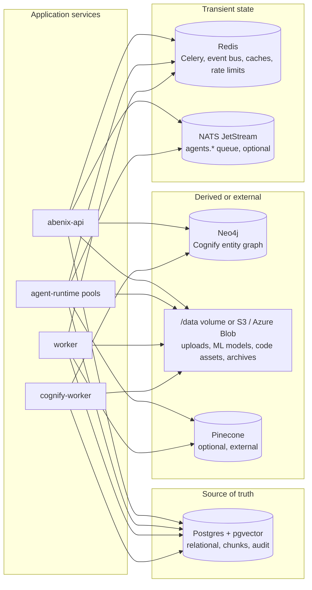

# Data stores

> One Postgres (with pgvector) for the relational truth, one Neo4j for the Cognify knowledge graph, one Redis for hot state and events, NATS JetStream for the agent queue, and a shared `/data` volume or a bucket for files.

---

## At-a-glance



The rule is **Postgres is authoritative** for anything that needs to survive a restart. Neo4j is rebuilt by re-running Cognify. Redis holds nothing you cannot lose. A NATS message that is lost leaves a `running` execution row that the stale sweeper later marks failed.

---

## Postgres

The relational source of truth. The chart installs the Bitnami `postgresql` chart (15.5.38). The base values use a Postgres 16 image with pgvector layered in. The Azure overlay runs a single standalone primary on the `bitnamilegacy/postgresql` image with `max_connections = 400`. Local `docker-compose.yml` uses `pgvector/pgvector:pg16`.

There is no TimescaleDB in the main database. `deploy-azure.sh` installs a separate `abenix-timescaledb` release, but only the `tsdb_*` tools talk to it, through `TSDB_URL`.

### Schema groups

`packages/db/models` defines 117 ORM tables. The main groups, with real table names:

1. **Identity and tenancy**: `tenants`, `users`, `api_keys`, `team_invites`, `workspaces`, `subject_policies`.
2. **Agents and pipelines**: `agents` (a pipeline is an agent with `model_config.mode = "pipeline"` and its DAG in `model_config.pipeline_config`), `agent_revisions`, `agent_comments`, `agent_favorites`, `agent_triggers`, `agent_shares`, `pipeline_states`, `pipeline_run_diffs`, `pipeline_patch_proposals`.
3. **Execution**: `executions`, `execution_idempotency`, `execution_config_snapshots`, `dead_letter_executions`, `drift_alerts`, `conversations`, `messages`. Per-call logs: `tool_invocations` (tool playground calls), `ml_model_invocations`, `code_asset_invocations`, `kb_query_invocations`. An agent run's own tool calls live in `executions.tool_calls`.
4. **Knowledge**: `knowledge_collections`, `knowledge_projects`, `documents`, `document_grants`, `agent_collection_grants`, `user_collection_grants`, `cognify_jobs`, `cognify_configs`, `graph_entities`, `graph_relationships`, plus the raw-SQL `chunks` table (pgvector, `vector(1536)`, HNSW index when the pgvector build supports it) that `main.py` creates at startup. If the database role cannot run `CREATE EXTENSION vector`, the table is skipped and knowledge search reports "vector store unavailable".
5. **Atlas**: `atlas_graphs`, `atlas_nodes`, `atlas_edges`, `atlas_snapshots`. Atlas lives in Postgres, see [06-atlas-knowledge-engine](06-atlas-knowledge-engine.md).
6. **ML models and code assets**: `ml_models`, `ml_model_deployments`, `code_assets`.
7. **Approvals and HITL**: `approvals` (sign-offs live in its `signoffs` JSONB column), `moderation_reviews` for held content.
8. **Decisions**: `decision_models`, `decision_versions`, `decision_tests`, `decision_evaluations`, `reference_sets`, `reference_set_versions`.
9. **Governance**: `risk_policies`, `kill_switches`, `permission_sets`, `permission_assignments`, `execution_config_snapshots`.
10. **Events, sources, evals**: `event_outbox`, `webhooks`, `webhook_deliveries`, `watch_sources`, `source_snapshots`, `source_changes`, `eval_suites`, `eval_cases`, `eval_runs`, `eval_results`.
11. **Sharing and audit**: `resource_shares`, `activity_logs` (the hash-chained audit log), `notifications`, `gdpr_purge_log`.
12. **Marketplace and billing**: `reviews`, `subscriptions`, `payouts`, `usage_records`, `llm_model_pricing`.
13. **Admin and retention**: `platform_settings`, `retention_policies`, `archive_runs`, `tool_runtime_config`, `tenant_tool_credentials`, `moderation_policies`, `moderation_events`.
14. **Autonomy and self-improvement**: `action_types`, `agent_actions`, `autonomy_grants`, `autonomy_changes`, `feedback`, `lessons`, `lesson_clusters`, `improvement_proposals`.
15. **Memory and meetings**: `agent_memories`, the `memory_*` tables, `persona_items`, `persona_chunks`, `meetings`, `meeting_deferrals`.

See [04-data-model/00-overview](../04-data-model/00-overview.md) for the ERD.

### Retention
There are no hypertables. The `nightly_archive` job (API scheduler, 02:00) dumps rows past retention to `archives/<tenant>/<run>.jsonl.gz` in object storage and deletes them, one tenant and table at a time, recorded in `archive_runs`. Default retention is 30 days for the three `*_invocations` tables, 60 days for `executions` and `messages`, and 90 days for `activity_logs`. Tenants override it in `retention_policies`. Archiving `activity_logs` only removes a linked prefix of the audit chain, see [07-governance](07-governance.md#tamper-evident-audit-log).

### Connection pooling
- The API uses SQLAlchemy async with `asyncpg`, `DB_POOL_SIZE` 10 plus `DB_MAX_OVERFLOW` 5 per process ([`apps/api/app/core/deps.py`](../../apps/api/app/core/deps.py)).
- The runtime uses its own pool, `RUNTIME_DB_POOL_SIZE` 5 plus `RUNTIME_DB_MAX_OVERFLOW` 5 ([`apps/agent-runtime/engine/db_pool.py`](../../apps/agent-runtime/engine/db_pool.py)).
- Celery tasks in the worker use `psycopg2` (sync).
- Watch `pg_stat_activity` when scaling replicas.

### Migrations
Alembic, in [`packages/db/alembic/versions/`](../../packages/db/alembic/versions/). The repo has more than one migration head, so always upgrade to `heads`:

```bash
kubectl exec -n abenix <api-pod> -- bash -c 'cd /app/packages/db && python -m alembic upgrade heads'
```

`deploy-azure.sh` first runs `python -m bootstrap` (creates the schema and stamps `heads` on an empty database, a no-op otherwise), then this, then checks the sentinel columns in `scripts/_schema-sentinels.sh`. The API also applies a short list of idempotent `ADD COLUMN IF NOT EXISTS` statements at startup under an advisory lock. See [06-deployment/00-overview](../06-deployment/00-overview.md).

---

## Neo4j

Neo4j 5.20 with APOC, one StatefulSet from the in-repo `neo4j` subchart. The chart always installs it, there is no enabled flag.

### What it holds
The Cognify knowledge graph. The cognify worker writes `Entity` nodes and typed relationships extracted from a collection's documents, keyed by `kb_id` and `canonical_name` ([`apps/agent-runtime/engine/knowledge/graph_writer.py`](../../apps/agent-runtime/engine/knowledge/graph_writer.py)). Graph search and memify read them back through [`neo4j_client.py`](../../apps/agent-runtime/engine/knowledge/neo4j_client.py) and [`hybrid_search.py`](../../apps/agent-runtime/engine/knowledge/hybrid_search.py). Postgres keeps a copy in `graph_entities` and `graph_relationships`.

### Isolation
Every query matches on `kb_id`. Collections belong to one tenant, and access to a collection is checked in Postgres before any graph query runs. Never write a Cypher query that does not filter on `kb_id`.

### Without Neo4j
Ingest and vector search keep working. Cognify and graph search fail. `GET /api/health/ready` reports the Neo4j check.

---

## Vector store

Each collection has a `vector_backend`. New collections default to `pgvector` and store embeddings in the `chunks` table. Older rows default to `pinecone`, which is an external service reached with `PINECONE_API_KEY` and `PINECONE_INDEX_NAME`.

Embeddings come from Azure OpenAI when its key and endpoint are set, then OpenAI. With neither, or with `ABENIX_LOCAL_EMBEDDINGS=1`, both ingest and query use the local hashing embedder in [`packages/db/local_embeddings.py`](../../packages/db/local_embeddings.py). It is lexical, not semantic, and produces 1536 dimensions to fit the same column.

---

## Redis

The Bitnami `redis` chart (19.6.4), standalone, one master. The Azure overlay runs it without auth.

| DB | Used for |
|---|---|
| `0` | `REDIS_URL` (no db suffix) for the app, and the Celery broker (`CELERY_BROKER_URL`) |
| `1` | Celery results (`CELERY_RESULT_BACKEND`) |

The chart sets no eviction policy, so the Bitnami default applies. Don't put anything you cannot lose in Redis.

Key and channel names in use:

| Key or channel | Owner | What |
|---|---|---|
| `exec:events:<execution_id>` | API and runtime | Pub/sub channel for one run's events |
| `exec:events:<execution_id>:log` | API and runtime | Replay list, last 500 events, 1 h TTL |
| `progress:<root_execution_id>`, `parent:<child_id>` | runtime | Tool-level progress for a whole agent tree. Prefixes come from `PROGRESS_CHANNEL_PREFIX` and `PROGRESS_PARENT_KEY_PREFIX` |
| `hitl:approval:<execution_id>:<gate_id>`, `hitl:pending:<tenant>`, `hitl:waiting:<execution_id>` | runtime and API | Human approval gates. `waiting` tells the stale sweeper to leave the run alone |
| `abenix:ratelimit:*` | API | Sliding-window rate limits |
| `tools:queue`, `tools:result:<job>` | API and runtime | Stream for tool jobs routed to runtime pods, and their replies |
| `invocations:*` | runtime | Live feed of ML model, code asset and KB query calls |
| `ws:fanout` | API | Notification fan-out across API replicas |
| `coderun:last:<runner>`, `coderun:calls:<runner>` | runtime | Code runner idle and hot tracking |
| `kbsearch:<tenant>:*`, `abenix:exact:<tenant>:*` | runtime, the API invalidates | Search and exact-match caches |

Tenant-scoped keys carry the tenant id.

---

## NATS JetStream

Optional. The chart renders it only when `scaling.queueBackend` is `nats`, which the local and Azure overlays set. One StatefulSet, `nats:2.10-alpine`, file store on a PVC (`nats.jetstream.fileStorage.size`, 5Gi on Azure).

### Streams and subjects
- Stream `agents`, subjects `agents.>`. The API publishes one message per pool run to `agents.<pool>`. Each pool has a durable pull consumer `abenix-<pool>-consumer`, which is also what KEDA reads for lag. The runtime acks a message only after the run ends and holds a lease on the execution row meanwhile. If a pod dies mid-run, JetStream redelivers and another pod takes the run over once the lease lapses, see [08-queue-scaling](../02-runtime/08-queue-scaling.md#at-least-once-delivery).
- `code.<tenant>.<asset>.<revision>` request/reply for warm code runners. Core NATS, not JetStream.
- `abenix.events.<tenant>.<type>`, a best-effort copy of every outbound platform event for internal consumers.

Execution events do not go over NATS. They go over Redis, see above.

### Logins
User `abenix` for platform services, `coderun` limited to `code.>` for code runners, `sys` for the system account. See [03-services](03-services.md#nats-logins).

---

## Files and object storage

`objectStorage.type` (`STORAGE_BACKEND`) picks `local`, `s3` or `azure`. The default is `local`, which writes under the shared `/data` mount.

| Path | What |
|---|---|
| `/data/uploads/<tenant>/<kb>/<file>` | KB document originals (`UPLOAD_DIR`) |
| `/data/exports` | Files tools hand back for download (`EXPORT_DIR`) |
| `/data/ml-models/<tenant>/<file_id>_<filename>` | ML model files (`ML_MODELS_DIR`) |
| `/data/code-assets`, `/data/code-asset-cache` | Code asset archives and the build cache |
| `/data/trajectories` | Past runs the `recall_trajectory` tool reads (`TRAJECTORY_DIR`) |
| `archives/<tenant>/<run>.jsonl.gz` | Nightly archive dumps, through the object storage backend |
| `sources/<tenant>/raw/...`, `sources/<tenant>/text/...` | Source watch snapshots, through the object storage backend |

Volumes that back `/data`:

| Volume | Flag | Notes |
|---|---|---|
| hostPath `sharedDataHostPath` (`/var/lib/abenix/data`) | default | Fine on a single node |
| PVC `abenix-shared-data` | `sharedData.usePVC` | Must be ReadWriteMany on multi-node clusters. Azure uses `azurefile-csi`, 20Gi |
| PVC `ml-models-storage` | `mlModels.enabled` | Mounted at `/data/ml-models`. Azure uses `azurefile-csi` RWX so the API and the runtime pools see the same files |
| PVC `abenix-archives` | `archives.pvc.enabled` (with `api.archivesPVC.enabled`) | Only rendered for the `local` backend. RWX on Azure |

Two abstractions sit over this: [`apps/agent-runtime/engine/storage/service.py`](../../apps/agent-runtime/engine/storage/service.py) for the runtime and [`apps/api/app/core/object_storage.py`](../../apps/api/app/core/object_storage.py) for archives and source snapshots.

> **Trap on Azure Files SMB**: `shutil.copy2` and `shutil.copy` call `chmod` and `utime` under the hood. Both fail on SMB mounts. The seed scripts use `shutil.copyfile` (bytes-only) for that reason. See [`packages/db/seeds/seed_ml_models.py`](../../packages/db/seeds/seed_ml_models.py).

---

## Backup + DR

All optional, off in the base values, on in the Azure overlay.

| Store | Mechanism | Schedule |
|---|---|---|
| Postgres | CronJob `<release>-pg-backup`, `pg_dump --format=custom` to `abenix-pg-<ts>.dump`, restore with `pg_restore`. Keeps 7 daily and 4 weekly dumps. When `objectStorage.type` is `s3` a second container uploads each dump with `boto3` to `s3://BUCKET/backups/daily/` (and `weekly/` on Sundays), BUCKET being `backup.s3Bucket` or `objectStorage.bucket`, and prunes to 7 daily and 4 weekly there | `backup.schedule`, 02:00 |
| Neo4j | CronJob `<release>-neo4j-backup`, APOC Cypher export over Bolt to `/backup/neo4j/abenix-neo4j-<ts>.cypher.gz` (Community has no online backup), keeps `backup.neo4j.keep` (7). Restore by piping into `cypher-shell` on an empty database | `backup.neo4j.schedule`, 03:00 |
| Redis | None, transient | n/a |
| NATS | None | n/a |
| Files | Whatever the volume or bucket provides | n/a |

The backup volume is the PVC `<release>-backup`, which the chart creates when `backup.persistentVolume.enabled` and keeps on uninstall. Otherwise it is an `emptyDir` lost with the pod. Use `ReadWriteMany` on multi-node clusters.

There is no tenant-wide export endpoint. `POST /api/account/export` exports the calling user's own data, and `GET /api/governance/audit/export` streams the tenant's audit log.

---

## Source map

| What | Where |
|---|---|
| **SQLAlchemy models** | [`packages/db/models/`](../../packages/db/models/) |
| **Alembic migrations** | [`packages/db/alembic/versions/`](../../packages/db/alembic/versions/) |
| **Async DB engine config** | [`apps/api/app/core/deps.py`](../../apps/api/app/core/deps.py) |
| **Execution event bus (Redis)** | [`apps/api/app/core/execution_bus.py`](../../apps/api/app/core/execution_bus.py) |
| **Neo4j client** | [`apps/agent-runtime/engine/knowledge/neo4j_client.py`](../../apps/agent-runtime/engine/knowledge/neo4j_client.py) |
| **Queue backends (NATS, Celery)** | [`apps/agent-runtime/engine/queue_backend.py`](../../apps/agent-runtime/engine/queue_backend.py) |
| **NATS consumer** | [`apps/agent-runtime/consumer.py`](../../apps/agent-runtime/consumer.py) |
| **Storage abstractions** | [`engine/storage/service.py`](../../apps/agent-runtime/engine/storage/service.py), [`app/core/object_storage.py`](../../apps/api/app/core/object_storage.py) |
| **Archiver** | [`apps/api/app/services/archiver.py`](../../apps/api/app/services/archiver.py) |
| **Backup CronJobs** | [`infra/helm/abenix/templates/backup-cronjob.yaml`](../../infra/helm/abenix/templates/backup-cronjob.yaml) |
| **Disaster-recovery runbook** | [06-deployment/disaster-recovery](../06-deployment/disaster-recovery.md) |
| **Per-service env vars** | [09-reference/01-env-vars](../09-reference/01-env-vars.md) |
