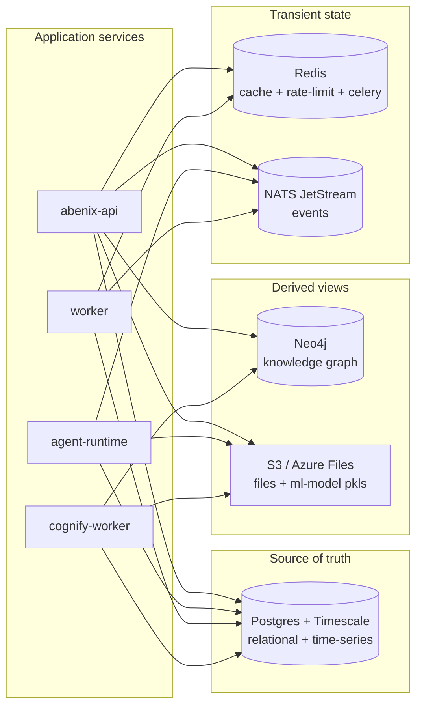

# Data stores

> One Postgres for the relational truth, one Neo4j for the knowledge graph, one Redis for hot state, NATS JetStream for events, S3 for blobs.

---

## At-a-glance



The rule is **Postgres is authoritative** for anything that needs to survive a restart. Neo4j, Redis, and the file blobs are all derivable from Postgres + ingestion sources (S3 originals, agent definitions, etc.). NATS messages are at-least-once but expected to be re-derivable from Postgres if dropped.

---

## Postgres + TimescaleDB

The relational source of truth. ~80 tables.

### Schema groups
1. **Identity**: `tenants`, `users`, `api_keys`, `sessions`, `password_resets`.
2. **Agents**: `agents`, `agent_revisions`, `agent_comments`, `agent_favorites`.
3. **Pipelines**: `pipelines`, `pipeline_steps` (often inlined as JSONB on `agents.model_config_.pipeline_config`).
4. **Execution**: `executions`, `tool_invocations`, `ml_model_invocations`, `pipeline_runs`. Time-series — `executions` is a Timescale hypertable on `created_at`.
5. **Knowledge**: `knowledge_bases`, `knowledge_documents`, `kb_chunks`, `kb_grants`.
6. **Atlas**: `atlas_nodes`, `atlas_edges`, `atlas_instances`.
7. **ML models**: `ml_models`, `ml_model_deployments`.
8. **Code assets**: `code_assets`, `code_asset_invocations`.
9. **Approvals**: `approvals`, `approval_signoffs`.
10. **Sharing + audit**: `resource_shares`, `audit_logs`, `notifications`.
11. **Marketplace / billing**: `marketplace_listings`, `reviews`, `invoices`, `usage_meters`.
12. **Admin**: `tenant_settings`, `rate_limit_rules`, `archive_runs`.

See [04-data-model/00-overview](../04-data-model/00-overview.md) for the ERD.

### Why TimescaleDB
The `executions` table is a hypertable on `created_at`. After 90 days, rows are compressed (~80% size reduction). After 365 days, they're moved to cold storage via the archives job. This keeps the hot index small even under sustained 100-exec/sec load.

### Connection pooling
- Each app pod uses `asyncpg` with a per-pod pool of 10 connections (env: `DB_POOL_SIZE`).
- With HPA-scaled replicas the pool can saturate Postgres' `max_connections=200`. Watch the `pg_stat_activity` count when scaling.
- We use `psycopg2` (sync) for migrations only.

### Migrations
Alembic. [`packages/db/alembic/versions/`](../../packages/db/alembic/versions/). Run on deploy via `kubectl exec` into the api pod:

```bash
kubectl exec deploy/abenix-api -- alembic upgrade head
```

The deploy script does this automatically — see [06-deployment/00-overview](../06-deployment/00-overview.md).

---

## Neo4j

The Atlas knowledge graph. Stores ontology nodes + relationships extracted from documents.

### What it holds
- **Atlas nodes** — Concepts (abstract types), Instances (specific entities), Documents (source pointers).
- **Atlas edges** — typed relationships (`mentions`, `instance_of`, `derived_from`, etc.).

### Why a separate graph DB
Cypher queries for "find all clauses linked to a counterparty rated below BBB" are 2-3 lines and 50ms. The same in pure Postgres recursive CTE is 30 lines and 500ms.

### Optional
Neo4j is **optional**. A deployment without it loses the Atlas page and the Cognify pipeline. everything else (agents, basic RAG, tools, deployment) works fine. The helm chart sets `neo4j.enabled=false` by default.

### Schema rules
- Every node carries `tenant_id` as a property AND lives in a tenant-named label namespace. Both filters are applied on every query — defense in depth.
- Tenant filter is enforced in [`apps/api/app/routers/atlas.py`](../../apps/api/app/routers/atlas.py) — never write a raw Cypher query that doesn't filter by tenant.

---

## Redis

Three roles in one Redis. Each on a separate logical DB:

| DB | Purpose |
|---|---|
| `0` | Celery broker (worker + cognify-worker) |
| `1` | Hot cache — agent config lookups, rate-limit counters, session metadata |
| `2` | Lock manager — execution sweeper, beat scheduler ownership |

**Eviction**: `allkeys-lru` with a 512MB cap. Don't put anything you can't lose in Redis.

**Key conventions**: every key carries a tenant prefix when it's tenant-scoped. e.g. `cache:agents:{tenant_id}:{agent_id}`.

---

## NATS JetStream

The async event bus. Used for the streaming execution lifecycle, pipeline messaging, and webhook delivery.

### Streams
- `exec` — execution lifecycle events. Subjects: `exec.{execution_id}.start`, `exec.{execution_id}.iteration`, `exec.{execution_id}.tool`, `exec.{execution_id}.completed`.
- `pipeline` — pipeline orchestration messages.
- `webhook-out` — outbound webhook deliveries (3 retries with exponential backoff).
- `keda-triggers` — the queues KEDA scales agent-runtime on.

### Retention
- `exec`: 24h (long enough to debug a stuck SSE client. full history is in Postgres).
- `pipeline`: 24h.
- `webhook-out`: 7 days (so retries survive long pauses).

### Why JetStream over plain pub/sub
We need at-least-once delivery (a missed `exec.completed` event leaves the UI hanging forever). JetStream's persistent streams with explicit ack provide that. Plain pub/sub would not.

> **Trap** — JetStream consumers must explicitly ack messages. If a consumer crashes mid-handler, the message is redelivered after `ack_wait` (default 30s). Make handlers idempotent — almost all our writes use `INSERT ... ON CONFLICT DO NOTHING` or check existence before writing.

---

## S3 / Azure Files

Blob storage for:
- **ML model files** (`.pkl`, `.onnx`, `.pt`) — `ml-models/{tenant_id}/{file_id}_{filename}`
- **Code asset zips + git mirrors** — `code-assets/{tenant_id}/{file_id}.zip`
- **KB document originals** — `kb/{tenant_id}/{kb_id}/{doc_id}.pdf`
- **Pipeline artifacts** (intermediate outputs that exceed 1MB inline) — `artifacts/{tenant_id}/{exec_id}/{step_id}.json`
- **Marketplace screenshots** — public bucket

The platform abstracts the storage backend behind [`apps/agent-runtime/engine/storage/service.py`](../../apps/agent-runtime/engine/storage/service.py). Same code works against AWS S3, Azure Blob, MinIO, or a local filesystem (for `npm run dev`).

> **Trap on Azure Files SMB** — `shutil.copy2` and `shutil.copy` call `chmod` and `utime` under the hood. Both fail on SMB mounts. The seed scripts use `shutil.copyfile` (bytes-only) for that reason. See [`packages/db/seeds/seed_ml_models.py`](../../packages/db/seeds/seed_ml_models.py).

---

## Backup + DR

| Store | Backup mechanism | RPO |
|---|---|---|
| Postgres | Continuous WAL-archive to S3 (via pgbackrest). nightly full | 5 min |
| Neo4j | Nightly dump to S3 | 24h |
| Redis | None (transient) | n/a |
| NATS | None (24h retention is the implicit "backup") | n/a |
| S3 | Cross-region replication (cloud-provider level) | continuous |

Tenant export (for self-service backup or migration) is at `POST /api/admin/tenants/{id}/export` — produces a single tarball of every tenant-scoped row + blob.

---

## Source map

| What | Where |
|---|---|
| **SQLAlchemy models** | [`packages/db/models/`](../../packages/db/models/) — one file per table |
| **Alembic migrations** | [`packages/db/alembic/versions/`](../../packages/db/alembic/versions/) |
| **Async DB engine config** | [`apps/api/app/core/deps.py`](../../apps/api/app/core/deps.py) |
| **Redis client + pool config** | [`apps/api/app/core/execution_bus.py`](../../apps/api/app/core/execution_bus.py) |
| **Neo4j client (Atlas)** | [`apps/api/app/services/atlas/`](../../apps/api/app/services/) — search for `neo4j_client.py` |
| **NATS JetStream consumer wiring** | [`apps/agent-runtime/consumer.py`](../../apps/agent-runtime/consumer.py) |
| **Blob storage abstraction (S3 / Azure Files / local /data)** | [`apps/agent-runtime/engine/storage/service.py`](../../apps/agent-runtime/engine/storage/service.py) |
| **Backup CronJobs** | [`infra/helm/abenix/templates/`](../../infra/helm/abenix/templates/) — search for `pg-backup`, `data-backup`, `neo4j-backup` |
| **Disaster-recovery runbook** | [06-deployment/disaster-recovery](../06-deployment/disaster-recovery.md) |
| **Per-service env vars (DATABASE_URL, REDIS_URL, NATS_URL, NEO4J_URI)** | [09-reference/01-env-vars](../09-reference/01-env-vars.md) |
