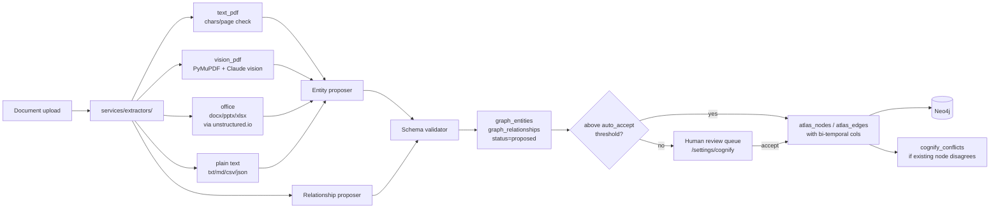

# Atlas + Knowledge Engine

Abenix's distinguishing feature — agents that traverse a typed graph of evidence instead of guessing from cosine-near paragraphs. Two systems working together:

- **Atlas** — the ontology canvas. A typed graph of nodes (entities) and edges (relationships) with confidence scores, time-slider snapshots, and five starter ontologies (FIBO Core, FIX Protocol, EMIR, ISDA, ETRM EOD).
- **Knowledge Engine (Cognify)** — the pipeline that turns raw documents into Atlas nodes + edges. Multimodal extraction (PDF, images, text), confidence-scored proposals, and a human-in-the-loop accept/reject flow.

Together: drop a PDF, get typed nodes + edges with citations back to the source page. Agents query the graph through four typed tools and get back paths of cited evidence, not three similar paragraphs.

## Why this matters for a contributor

Most RAG systems do `embed(query) → top-k chunks → stuff into prompt`. The cost is high, the answer is fuzzy, the citations are weak.

Abenix does `query → typed graph traversal → curated path → LLM`. Token cost typically drops 5-10× because the agent reads 8-15 highly-relevant graph nodes instead of 20 noisy near-neighbours, and the citations are exact paths.

You can extend either layer. Adding a new ontology is a YAML drop. Adding a new extraction backend (handwriting, audio) is a single module in the Cognify pipeline.

## The six typed tools agents use

| Tool | What it does | When an agent picks it |
|---|---|---|
| `atlas_describe` | get a node + its 1-hop neighbourhood by name or ID | "tell me what we know about counterparty X" |
| `atlas_query` | run a parameterised typed query against the graph (no Cypher syntax leaks into the agent prompt) | "find every contract where notional > $50M and counterparty has > 3 unconfirmed trades" |
| `atlas_traverse` | walk N hops along typed edges from a starting node | "trace the supply chain from raw material to finished product" |
| `atlas_search_grounded` | hybrid keyword + embedding search, but **only over node properties** | "find the clause about late delivery" |
| `atlas_cypher` *(v2.0)* | direct read-only Cypher for power agents — when the four typed tools aren't expressive enough | "ad-hoc traversal proving a multi-hop policy violation" |
| `atlas_as_of` *(v2.0)* | query the graph as it existed at a given ISO-8601 timestamp using bi-temporal edges | "what did we know on 2025-01-15?" — forensic + audit replays |

All six return structured rows the agent can post-process. None of them return free-text paragraphs.

### Safety of `atlas_cypher`

A server-side validator rejects any write token (`CREATE`, `MERGE`, `DELETE`, `DETACH DELETE`, `SET`, `REMOVE`, `DROP`, `LOAD CSV`, `CALL apoc.*`, `CALL dbms.*`, `CALL db.*`, `FOREACH`, `;`). Query length is capped at 8 KB and execution at 10 seconds. The agent's tenant_id and graph_id are auto-injected as `$abenix_tenant_id` and `$abenix_graph_id` so a hand-crafted query can never escape the caller's scope. Result rows are capped at 1000.

### Bi-temporal queries via `atlas_as_of`

Every Atlas edge carries four timestamp/source columns (added in v2.0):

| Column | Meaning |
|---|---|
| `valid_from` | when the fact became true in the world |
| `valid_to` | when it stopped being true (`NULL` = still current) |
| `recorded_at` | when we learned the fact |
| `source_anchors` | JSONB array of `{document_id, page, chunk_id, confidence}` — every supporting citation |

Default Cypher templates use `WHERE r.valid_to IS NULL` so routine traversal returns only the current state. `atlas_as_of(as_of=<timestamp>)` rewrites the WHERE clause to filter on `valid_from <= ts AND (valid_to IS NULL OR valid_to > ts)` — the agent gets a coherent snapshot of the graph as it was on that date.

## The data model

Atlas lives in **Neo4j**, not Postgres. The Postgres rows are pointers:

| Table | Role |
|---|---|
| `atlas_graphs` | one row per tenant-owned graph |
| `atlas_nodes` | row per node — properties live in Neo4j, this is the audit + ACL surface. Carries `valid_from`, `valid_to`, `recorded_at`, `source_anchors` |
| `atlas_edges` | row per edge — same bi-temporal columns as `atlas_nodes` |
| `ontology_schemas` | the type system — what entity types exist, what edges they can have |
| `cognify_jobs` | one row per indexing job |
| `cognify_reports` | the job's findings (entities found, edges proposed, confidence) |
| `cognify_configs` *(v2.0)* | per-tenant `auto_accept_threshold`, `conflict_action`, `max_parallel_docs`, `daily_budget_usd` |
| `cognify_conflicts` *(v2.0)* | open conflicts where two sources disagree on the same entity property — surfaced at `/settings/cognify` |
| `graph_entities`, `graph_relationships` | the Cognify-stage proposals before human accept |
| `document_grants` *(v2.0)* | per-document ACL `(document_id, subject_type, subject_id, permission)` — pre-filters the candidate set before similarity search |
| `gdpr_purge_log` *(v2.0)* | per-store row per user-purge attempt — provable audit trail for regulators |

The split lets us use Neo4j for graph queries (where it shines) and Postgres for ACL + audit + cross-tenant isolation (where it shines). The `document_grants` table is the **only** table read on the hot search path — every other v2.0 surface is async / settings-page.

## Cognify — the indexing pipeline



Stages:

1. **Extractor dispatch** — [`services/extractors/dispatch.py`](../../apps/api/app/services/extractors/dispatch.py) routes by MIME:
   - `pdf` → `text_pdf` first, and if chars/page < 50 it falls through to `vision_pdf` (PyMuPDF rasterization + Claude vision)
   - `docx`/`pptx`/`xlsx`/`html`/`epub`/`rtf` → `office` (unstructured.io)
   - `png`/`jpg`/`tiff` → vision
   - `txt`/`md`/`csv`/`json` → plain
   - Every doc records `extraction_method` + `extraction_quality` on the `documents` row so a customer can audit "which docs needed OCR" (typically 30-50% of a contract archive).
2. **Entity proposer** — looks at the extracted text + the active ontology schema, proposes typed entities with confidence scores.
3. **Relationship proposer** — proposes typed edges between proposed entities (and existing nodes when there's a name match).
4. **Schema validator** — every proposal must conform to the active `ontology_schema`. A proposal that claims an unsupported edge type gets rejected at this gate, not at human review.
5. **Auto-accept gate (v2.0)** — proposals at or above the tenant's `auto_accept_threshold` (default `0.85`, see `cognify_configs`) land directly in `atlas_nodes` / `atlas_edges`. Lower-confidence proposals queue for review in the UI.
6. **Conflict surface (v2.0)** — when an accepted proposal disagrees with an existing node on the same property, a `cognify_conflicts` row is created. The `conflict_action` config (`flag` / `split` / `lower_conf_wins` / `higher_conf_wins`) chooses the resolution policy.
7. **Job modes (v2.0)** — `incremental` (default, new and updated docs only), `full` (every doc — use when ontology changes), `selective` (explicit `document_ids`). Incremental drops re-indexing cost ~100× for steady-state archives.

The whole pipeline is observable: every Cognify job emits a `CognifyReport` with the breakdown of entities-by-type, top entities by mention count, and the relationship-type histogram. Daily spend can be hard-capped via `daily_budget_usd` on the config.

## Adding a starter ontology

The five ontologies that ship live in `apps/api/app/routers/atlas.py` under `ATLAS_STARTERS`. To add a sixth (e.g. "Healthcare" or "Maritime"):

1. Sketch the entity types and edge types your domain needs.
2. Add a dict to `ATLAS_STARTERS` with the schema:
   ```python
   "healthcare": {
       "name": "Healthcare",
       "description": "Patient → encounter → diagnosis → procedure → outcome",
       "entity_types": [...],
       "relationship_types": [...],
       "default_visibility": "tenant",
   }
   ```
3. Add a small e2e in `e2e/uat_atlas_*.spec.ts` that creates a graph from the starter and asserts the right node types appear.

That's it — the UI's "Create graph" flow picks up the new starter automatically.

## Adding a new extraction backend

The Cognify pipeline reads from [`apps/api/app/services/extractors/`](../../apps/api/app/services/extractors/) (moved from the old `cognify/extractors/` path in v2.0). Each extractor implements the `BaseExtractor` protocol in [`base.py`](../../apps/api/app/services/extractors/base.py) and returns `(blocks, method, quality_score)`. Adding handwriting:

1. New module: `extractors/handwriting.py` with a class implementing `BaseExtractor`.
2. Register it in `dispatch.py` keyed by MIME type or extension.
3. The rest of the pipeline (entity proposer, relationship proposer, validator) sees normalized blocks and doesn't care where they came from.

## Document-level ACL (v2.0)

`document_grants(document_id, subject_type, subject_id, permission)` makes a single KB safe to share across teams without losing graph traversal. The pre-filter runs **before similarity search** — a forbidden doc never enters the candidate pool, so the top-K returned to the agent is honest. The check is cached per-(subject, kb_id) in Redis with a 60s TTL. Grant and revoke invalidate the cache automatically.

Pair this with `atlas_search_grounded` and you get team-partitioned knowledge that still gives the agent a coherent cross-team graph view via `atlas_describe` / `atlas_traverse` on the nodes themselves.

## Document versioning (v2.0)

`POST /api/knowledge/{kb}/documents/{doc}/replace` marks the old row `is_current=false, superseded_by=<new_id>`. Three consumers update automatically:

- **Hybrid search** filters `documents.is_current = true` before similarity scoring.
- **Atlas edges** derived from the new doc carry `valid_from = now`. Edges from the superseded doc get `valid_to = supersede_time`.
- **Cognify** incremental jobs only fetch `is_current = true AND (cognified_at IS NULL OR updated_at > cognified_at)`.

A `?include_superseded=true` query param surfaces the old chunks for audit / diff. See [`document-versioning.md`](../document-versioning.md) for the full lifecycle.

## Reranking + citations (v2.0)

[`services/reranker.py`](../../apps/api/app/services/reranker.py) reorders the top-50 candidates from hybrid search through:

- Cohere `rerank-english-v3.0` when `COHERE_API_KEY` is set
- Claude Haiku scoring fallback when only `ANTHROPIC_API_KEY` is set
- Passthrough when neither is set

Every hit carries a `Citation` with `{document_id, page, chunk_index, char_offset_start/end, document_name, anchor_url}`. Agents emit deep-link citations like `contract.pdf · page 42 · chunk 3` verbatim.

## Embedding-model swap (v2.0)

Three-step operation, never read-from-wrong-model again:

1. `POST /api/knowledge/{kb}/reembed?dry_run=true` — cost estimate + ETA
2. `POST /api/knowledge/{kb}/reembed` with `embedding_model: "voyage-3"` — enqueues the worker, returns `job_id`
3. The [`kb_reembed`](../../apps/worker/worker/tasks/kb_reembed.py) worker streams chunks to a staging Pinecone namespace, atomic alias flip on completion, old namespace marked `deletable_at = now + 24h` for rollback safety

The query path always reads `kb.embedding_model` and embeds with that model — never assumes OpenAI.

## GDPR cascade purge (v2.0)

`POST /api/gdpr/users/{id}/purge` ([`services/gdpr_purge.py`](../../apps/api/app/services/gdpr_purge.py)) hits five stores: postgres (soft-delete `persona_items` + `agent_memories`), pinecone (filter by `metadata.user_id`, retry 3× then queue vacuum), neo4j (`DETACH DELETE` nodes with `user_id` property), blob (`/data/users/<id>/*`), trajectory (tombstone sweep). Every per-store attempt writes a `gdpr_purge_log` row. `GET /api/gdpr/users/{id}/receipts` returns the audit trail.

## Persona encryption (v2.0)

Sensitive `PersonaItem` + `AgentMemory` fields wrap with AES-256-GCM via [`core/crypto.py`](../../apps/api/app/core/crypto.py). The cluster KEK lives in `ABENIX_DATA_KEY_KEK_BASE64` (Azure Key Vault / AWS KMS / Vault). Per-tenant DEK derives deterministically as `HMAC-SHA256(KEK, tenant_id)` so all pods agree without persisting per-tenant key rows. Missing KEK → encryption is a no-op (plaintext) and a warning logs once — production must set it.

## Pinecone vacuum (v2.0)

Daily Celery beat at 02:00 UTC ([`worker/tasks/pinecone_vacuum.py`](../../apps/worker/worker/tasks/pinecone_vacuum.py)). Walks every tenant namespace, diffs vector IDs against `persona_items.pinecone_ids` + chunk references, deletes orphans in batches of 1000. Each orphan is ~6 KB on per-dim pricing — material savings on high-churn tenants.

## Where to look in the code

- Atlas REST API: [`apps/api/app/routers/atlas.py`](../../apps/api/app/routers/atlas.py)
- Cognify REST API (v1): [`apps/api/app/routers/knowledge_engine.py`](../../apps/api/app/routers/knowledge_engine.py)
- Cognify v2 endpoints (config / conflicts / reembed / versioning): [`knowledge_v2.py`](../../apps/api/app/routers/knowledge_v2.py)
- Document grants: [`document_grants.py`](../../apps/api/app/routers/document_grants.py)
- GDPR: [`gdpr.py`](../../apps/api/app/routers/gdpr.py)
- The six typed tools: `apps/agent-runtime/engine/tools/atlas_tools.py` (4) + [`atlas_cypher.py`](../../apps/agent-runtime/engine/tools/atlas_cypher.py) (2)
- Neo4j bindings: `apps/api/app/services/atlas/neo4j_client.py`
- Models: [`atlas.py`](../../packages/db/models/atlas.py), [`knowledge_base.py`](../../packages/db/models/knowledge_base.py), [`cognify_config.py`](../../packages/db/models/cognify_config.py), [`document_grant.py`](../../packages/db/models/document_grant.py), [`gdpr_purge_log.py`](../../packages/db/models/gdpr_purge_log.py)
- Migration: [`b8c9d0e1f2g3_v2_knowledge_atlas_persona.py`](../../packages/db/alembic/versions/b8c9d0e1f2g3_v2_knowledge_atlas_persona.py)
- UI: [`/settings/cognify`](../../apps/web/src/app/(app)/settings/cognify/page.tsx), [`/settings/gdpr`](../../apps/web/src/app/(app)/settings/gdpr/page.tsx)

## Related

- [`02-runtime/02-tools.md`](../02-runtime/02-tools.md) — atlas tool cookbook with example invocations
- [`02-runtime/15-v2-knowledge-enterprise.md`](../02-runtime/15-v2-knowledge-enterprise.md) — full v2.0 feature reference (16 capabilities)
- [`04-data-model/03-knowledge.md`](../04-data-model/03-knowledge.md) — KB + Atlas + Cognify ERD with bi-temporal columns
- [`document-versioning.md`](../document-versioning.md) — replace lifecycle in depth
- [`07-standalone-apps/02-contractiq.md`](../07-standalone-apps/02-contractiq.md) — E&C-Copilot uses Atlas heavily for clause traceability
