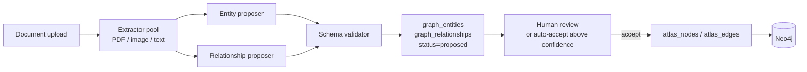

# Atlas + Knowledge Engine

Abenix's distinguishing feature — agents that traverse a typed graph of evidence instead of guessing from cosine-near paragraphs. Two systems working together:

- **Atlas** — the ontology canvas. A typed graph of nodes (entities) and edges (relationships) with confidence scores, time-slider snapshots, and five starter ontologies (FIBO Core, FIX Protocol, EMIR, ISDA, ETRM EOD).
- **Knowledge Engine (Cognify)** — the pipeline that turns raw documents into Atlas nodes + edges. Multimodal extraction (PDF, images, text), confidence-scored proposals, and a human-in-the-loop accept/reject flow.

Together: drop a PDF, get typed nodes + edges with citations back to the source page. Agents query the graph through four typed tools and get back paths of cited evidence, not three similar paragraphs.

## Why this matters for a contributor

Most RAG systems do `embed(query) → top-k chunks → stuff into prompt`. The cost is high, the answer is fuzzy, the citations are weak.

Abenix does `query → typed graph traversal → curated path → LLM`. Token cost typically drops 5-10× because the agent reads 8-15 highly-relevant graph nodes instead of 20 noisy near-neighbours, and the citations are exact paths.

You can extend either layer. Adding a new ontology is a YAML drop. Adding a new extraction backend (handwriting, audio) is a single module in the Cognify pipeline.

## The four typed tools agents use

| Tool | What it does | When an agent picks it |
|---|---|---|
| `atlas_describe` | get a node + its 1-hop neighbourhood by name or ID | "tell me what we know about counterparty X" |
| `atlas_query` | run a typed Cypher query against the graph | "find every contract where notional > $50M and counterparty has > 3 unconfirmed trades" |
| `atlas_traverse` | walk N hops along typed edges from a starting node | "trace the supply chain from raw material to finished product" |
| `atlas_search_grounded` | hybrid keyword + embedding search, but **only over node properties** | "find the clause about late delivery" |

All four return structured rows the agent can post-process. None of them return free-text paragraphs.

## The data model

Atlas lives in **Neo4j**, not Postgres. The Postgres rows are pointers:

| Table | Role |
|---|---|
| `atlas_graphs` | one row per tenant-owned graph |
| `atlas_nodes` | row per node — properties live in Neo4j, this is the audit + ACL surface |
| `atlas_edges` | row per edge — same |
| `ontology_schemas` | the type system — what entity types exist, what edges they can have |
| `cognify_jobs` | one row per indexing job |
| `cognify_reports` | the job's findings (entities found, edges proposed, confidence) |
| `graph_entities`, `graph_relationships` | the Cognify-stage proposals before human accept |

The split lets us use Neo4j for graph queries (where it shines) and Postgres for ACL + audit + cross-tenant isolation (where it shines).

## Cognify — the indexing pipeline



Stages:

1. **Extractor pool** — PDF rasterization + vision LLM for layout-sensitive docs, plain text for the rest. Audio + handwriting are pluggable backends (not shipped, easy to add).
2. **Entity proposer** — looks at the extracted text + the active ontology schema, proposes typed entities with confidence scores.
3. **Relationship proposer** — proposes typed edges between proposed entities (and existing nodes when there's a name match).
4. **Schema validator** — every proposal must conform to the active `ontology_schema`. A proposal that claims an unsupported edge type gets rejected at this gate, not at human review.
5. **Human review or auto-accept** — proposals above the tenant's auto-accept confidence threshold land directly in `atlas_nodes` / `atlas_edges`. The rest queue for review in the UI.

The whole pipeline is observable: every Cognify job emits a `CognifyReport` with the breakdown of entities-by-type, top entities by mention count, and the relationship-type histogram.

## Adding a starter ontology

The five ontologies that ship live in `apps/api/app/routers/atlas.py` under `ATLAS_STARTERS`. To add a sixth (e.g. "Healthcare" or "Maritime"):

1. Sketch the entity types and edge types your domain needs.
2. Add a dict to `ATLAS_STARTERS` with the schema:
   ```python
   "healthcare": {
       "name": "Healthcare",
       "description": "Patient → encounter → diagnosis → procedure → outcome",
       "entity_types": [...],
       "relationship_types": [...],
       "default_visibility": "tenant",
   }
   ```
3. Add a small e2e in `e2e/uat_atlas_*.spec.ts` that creates a graph from the starter and asserts the right node types appear.

That's it — the UI's "Create graph" flow picks up the new starter automatically.

## Adding a new extraction backend

The Cognify pipeline reads from `apps/api/app/services/cognify/extractors/`. Each extractor is a class that takes a `Document` row and yields `(text, page_number)` tuples. Adding handwriting:

1. New module: `extractors/handwriting.py` with a class implementing the `Extractor` protocol.
2. Register it in `extractors/__init__.py` keyed by MIME type or extension.
3. The rest of the pipeline (entity proposer, relationship proposer, validator) sees plain text and doesn't care where it came from.

## Where to look in the code

- Atlas REST API: [`apps/api/app/routers/atlas.py`](../../apps/api/app/routers/atlas.py)
- Cognify REST API: [`apps/api/app/routers/knowledge_engine.py`](../../apps/api/app/routers/knowledge_engine.py)
- The four typed tools: `apps/agent-runtime/engine/tools/atlas_*.py`
- Neo4j bindings: `apps/api/app/services/atlas/neo4j_client.py`
- Models: `packages/db/models/atlas.py`, `packages/db/models/knowledge_engine.py`

## Related

- [`02-runtime/02-tools.md`](../02-runtime/02-tools.md) — how the four atlas tools are wired into the runtime
- [`04-data-model/00-overview.md`](../04-data-model/00-overview.md) — full ERD
- [`07-standalone-apps/02-contractiq.md`](../07-standalone-apps/02-contractiq.md) — ContractIQ uses Atlas heavily for clause traceability
