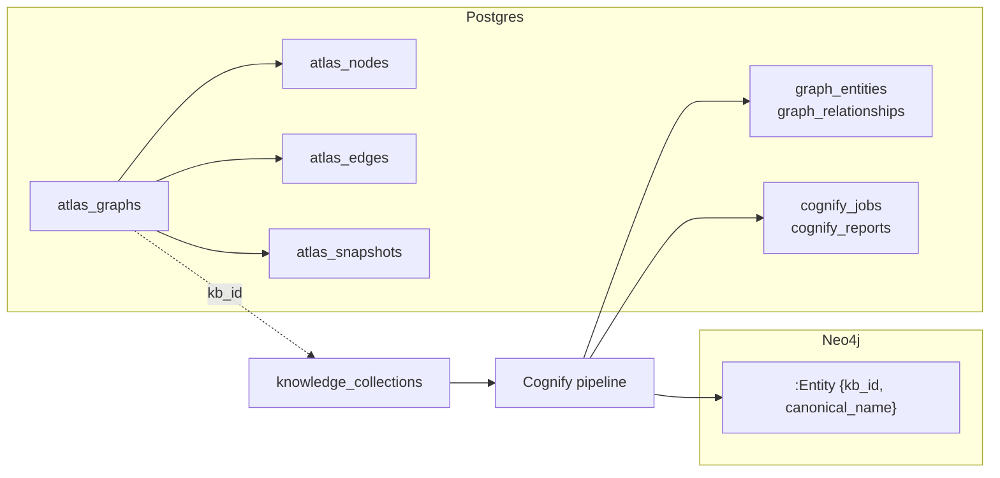

# Atlas + Knowledge Engine

Two separate graph systems sit next to each other. They can share a knowledge collection but not a store.

- **Atlas** is the ontology canvas. Graphs, typed nodes and edges, snapshots and bindings to live data, all in Postgres tables. It ships five starter ontologies (FIBO Core, FIX Protocol, EMIR Reporting, ISDA Master Agreement, ETRM EOD Workflow).
- **Knowledge Engine (Cognify)** turns the documents of a knowledge collection into an entity graph in Neo4j. Each node is an `:Entity` keyed by `kb_id` and `canonical_name`. Hybrid search reads that graph next to the vector store.

An Atlas graph can be bound to a knowledge collection (`atlas_graphs.kb_id`), which lets the canvas show the collection's documents and lets agents reach both. Atlas never writes to Neo4j and Cognify never writes Atlas rows.

## Atlas

The canvas is the **Atlas** page at `/atlas`.

### Data model

| Table | Holds |
|---|---|
| `atlas_graphs` | One row per graph. Owner, name, optional `kb_id` binding, `version`, node and edge counts, `settings` |
| `atlas_nodes` | Label, `kind` (`concept`, `instance`, `document` or `property`), description, `properties` (JSONB), canvas position, optional `document_id`, `source`, `confidence`, tags, and the bi-temporal columns |
| `atlas_edges` | `from_node_id`, `to_node_id`, label, `cardinality_from` and `cardinality_to`, `inverse_edge_id`, `is_directed`, `properties`, `source`, `confidence`, and the bi-temporal columns |
| `atlas_snapshots` | A JSONB copy of the graph per version, saved automatically or by hand (`auto`), for the time slider and restore |

Bi-temporal columns on nodes and edges:

| Column | Meaning |
|---|---|
| `valid_from` | When the fact became true in the world |
| `valid_to` | When it stopped being true. `NULL` means still current |
| `recorded_at` | When the platform learned it |
| `source_anchors` | JSONB list of supporting citations |

Models live in [`packages/db/models/atlas.py`](../../packages/db/models/atlas.py). Column detail is in [04-data-model/03-knowledge](../04-data-model/03-knowledge.md).

### REST

All under `/api/atlas` in [`routers/atlas.py`](../../apps/api/app/routers/atlas.py):

| Route | Does |
|---|---|
| `GET/POST /graphs`, `GET/PATCH/DELETE /graphs/{id}` | Graph CRUD |
| `POST /graphs/{id}/nodes`, `PATCH/DELETE /graphs/{id}/nodes/{node_id}` | Node CRUD |
| `POST /graphs/{id}/edges`, `PATCH/DELETE /graphs/{id}/edges/{edge_id}` | Edge CRUD |
| `POST /graphs/{id}/parse-nl` | A sentence becomes a list of graph ops |
| `POST /graphs/{id}/extract` | A dropped document, image, audio, video or text file becomes proposed nodes and edges |
| `POST /graphs/{id}/apply` | Applies the ops from `parse-nl` or `extract` |
| `GET /graphs/{id}/suggestions` | Likely duplicates, missing inverse edges and orphan nodes |
| `GET/POST /graphs/{id}/snapshots`, `POST /graphs/{id}/snapshots/{snapshot_id}/restore` | List and save snapshots, restore one |
| `GET /graphs/{id}/export?format=json-ld` | JSON-LD (the default) or plain JSON with `format=json` |
| `POST /graphs/{id}/bind-kb`, `/sync-kb`, `/persist-to-kb` | Bind a collection, project its documents onto the canvas as document nodes, write a dropped file into the bound collection |
| `POST /graphs/{id}/query` | Matches a small graph pattern |
| `PATCH /graphs/{id}/nodes/{node_id}/binding`, `GET /graphs/{id}/nodes/{node_id}/instances` | Binds a node to a live data source and lists its instances |
| `GET /starters`, `POST /graphs/{id}/import-starter` | The starter ontologies |
| `POST /graphs/{id}/relayout` | Recomputes the canvas layout |

### Agent tools

The five tools in [`engine/tools/atlas_tools.py`](../../apps/agent-runtime/engine/tools/atlas_tools.py) read the Atlas tables over their own small asyncpg pool on `DATABASE_URL`. They only see graphs in the run's tenant, and only the graphs in `model_config.atlas_graphs` when the agent sets that list. With no `graph_id` they use the most recently updated graph they can see.

| Tool | Does |
|---|---|
| `atlas_describe` | Counts per kind, top edge labels and the most connected concepts of a graph |
| `atlas_query` | Finds nodes by label substring and optional `kind` |
| `atlas_traverse` | One hop out from a node, in and out edges with the nodes on the other end |
| `atlas_search_grounded` | Finds concept nodes whose label contains `near_label`, then returns the document nodes linked to them and their collection document ids |
| `atlas_as_of` | The graph as it stood at a past moment (see below) |

All five return structured JSON, not paragraphs. Their input schemas are in [02-runtime/02-tools](../02-runtime/02-tools.md).

`atlas_as_of` takes `graph_id`, `as_of`, `label_like`, `kind` and `limit`. If the graph has not changed since `as_of`, it reads the live rows and honours `valid_from` and `valid_to`. Otherwise it reads the newest `atlas_snapshots` row saved at or before `as_of`, and says so when there is none.

### Adding a starter ontology

Starters are the `ATLAS_STARTERS` dict in [`routers/atlas.py`](../../apps/api/app/routers/atlas.py), keyed by id (`fibo-core`, `fix`, `emir`, `isda`, `etrm-eod`). An entry has a `name`, a `description` and a list of `ops` (`add_node` and `add_edge`, the same ops `/apply` takes). `GET /api/atlas/starters` lists it with its node and edge counts, and the canvas import flow picks it up with no UI change.

## Knowledge Engine (Cognify)

### Pipeline

`POST /api/knowledge-engines/{kb_id}/cognify` creates a `cognify_jobs` row and sends the worker task [`cognify_task.py`](../../apps/worker/worker/tasks/cognify_task.py) to the `cognify` queue. The task runs `run_cognify` in [`engine/knowledge/cognify_pipeline.py`](../../apps/agent-runtime/engine/knowledge/cognify_pipeline.py). The job takes every `ready` document in the collection, or only those named in `doc_ids`. Superseded document versions are not filtered out.

1. **Budget check.** If the tenant's `daily_budget_usd` is already spent, the job fails without calling a model.
2. **Skip check.** If none of the chosen documents was created after the collection's `last_cognified_at`, the job ends as `skipped`.
3. **Ontology prior.** The project's active ontology schema, when there is one, is passed to the extractor as a typing hint.
4. **Extract.** `entity_extractor.extract_from_document` asks the configured model for entities and relationships, up to `max_parallel_docs` documents at a time, flushing progress to the job row.
5. **Resolve.** `entity_resolver.resolve_entities` merges duplicates across documents and against entities already in the collection, and applies `conflict_action` when sources disagree on a type.
6. **Write the graph.** `graph_writer.write_entities` and `write_relationships` `MERGE` into Neo4j as `(:Entity {kb_id, canonical_name})` with typed relationships carrying `kb_id`, so reruns update instead of duplicating.
7. **Postgres metadata.** Conflicts go to `cognify_conflicts`, `graph_entities` and `graph_relationships` rows are upserted, `last_cognified_at` is set, and the job gets a `cognify_reports` row: entities by type, top entities by mentions, relationship types.

If Neo4j is not reachable the job fails before extraction with "Neo4j is not available". `GET /api/knowledge-engines/{kb_id}/graph-stats` reports `neo4j_available`. Text extraction from uploaded files happens earlier, in the worker's `document_processor` through the extractors below, when documents are chunked and embedded.

### Reading the graph

| Reader | Uses |
|---|---|
| `hybrid_search.py` | Vector hits plus a graph expansion over `:Entity` nodes for the same `kb_id`, weighted by `graph_weight` (default 0.4) and `graph_depth` (default 2) |
| `knowledge_search` tool | Hybrid search for an agent with a granted collection |
| `graph_explorer` tool | Looks up an entity and its neighbours in Neo4j |
| `GET /api/knowledge-engines/{kb_id}/graph` | The graph for the UI |
| `memify_pipeline.py` | Adjusts the graph from usage signals and retrieval feedback |

Connection settings are `NEO4J_URI`, `NEO4J_USER`, `NEO4J_PASSWORD` and `NEO4J_DATABASE`, read in [`engine/knowledge/neo4j_client.py`](../../apps/agent-runtime/engine/knowledge/neo4j_client.py). `graph_writer.delete_kb_graph` removes a collection's entities.

## v2.0 knowledge features

| Feature | State in code |
|---|---|
| Document versioning, `POST /api/knowledge/{kb}/documents/{doc}/replace` | Adds a new `documents` row one `version_number` higher and marks the old row `is_current = false` with `superseded_by` set. Only the current head can be replaced. The call does not queue the new file for processing, and search and Cognify do not read `is_current`. See [document-versioning](../document-versioning.md) |
| Document grants, `document_grants(document_id, subject_type, subject_id, permission, expires_at)` | A document with no live grants is visible to everyone who can read the collection. The first grant restricts it to its grantees (users or agents), tenant admins, the collection creator and holders of WRITE or ADMIN on the collection. Search drops restricted documents before ranking and the document list hides them. Only collection editors add or remove grants. Rule in [`engine/knowledge/document_acl.py`](../../apps/agent-runtime/engine/knowledge/document_acl.py) |
| Cognify config, `GET/PUT /api/knowledge/cognify-config` | `auto_accept_threshold`, `conflict_action`, `max_parallel_docs`, `daily_budget_usd` per tenant. The pipeline enforces all four. Proposals below the threshold stay out of the graph and are counted in the job report. Edited on **Settings > Cognify config** (`/settings/cognify`) |
| Cognify conflicts, `GET /api/knowledge/cognify-conflicts`, `POST /api/knowledge/cognify-conflicts/{id}/resolve` | A row is written when sources disagree on an entity's type. With `conflict_action` `flag` it stays `open` until someone resolves it, which writes the chosen type to the graph. `split`, `higher_conf_wins` and `lower_conf_wins` record it already settled |
| Re-embed, `GET/POST /api/knowledge/{kb}/reembed` | GET returns the model, the allowed models and job progress. POST is admin only. With `dry_run: true` it estimates, without it queues `kb_reembed`, which re-reads and re-chunks every document, then switches the collection in one step. Nothing changes on failure |
| GDPR purge, `POST /api/gdpr/users/{id}/purge`, `GET /api/gdpr/users/{id}/receipts` | [`services/gdpr_purge.py`](../../apps/api/app/services/gdpr_purge.py) covers postgres, pinecone, neo4j, blob and trajectory and writes a `gdpr_purge_log` row per store with `affected_count`. The neo4j step deletes Cognify entities naming the person and their Postgres graph rows. UI at `/settings/gdpr`. See [15-v2-knowledge-enterprise](../02-runtime/15-v2-knowledge-enterprise.md#gdpr-cascade) |
| At-rest encryption | AES-256-GCM in [`core/crypto.py`](../../apps/api/app/core/crypto.py) under `ABENIX_DATA_KEY_KEK_BASE64`, with per-tenant keys derived by HMAC. It covers tool credentials, the tenant Slack webhook URL, the approval webhook secret, MCP secrets and held moderation text. Persona items and agent memories are not encrypted yet. Without a KEK values are stored as entered. See [06-encryption-setup](../08-howto/06-encryption-setup.md) |
| Extractors, [`engine/knowledge/extractors/`](../../apps/agent-runtime/engine/knowledge/extractors/) | `text_pdf`, `vision_pdf` and `office` behind `dispatch.extract_document`, called by the worker on ingest. It records `extraction_method` and `extraction_quality` and chunks carry page numbers. Vision OCR needs PyMuPDF and `ANTHROPIC_API_KEY` on the worker |
| Reranker, [`engine/knowledge/reranker.py`](../../apps/agent-runtime/engine/knowledge/reranker.py) | Wired into search. Cohere when `COHERE_API_KEY` is set, the Haiku scorer only with `RERANKER_PROVIDER=llm`. Hits carry `metadata.citation` |
| Pinecone vacuum, [`worker/tasks/pinecone_vacuum.py`](../../apps/worker/worker/tasks/pinecone_vacuum.py) | Queued daily at 02:30 UTC by the API scheduler on the `documents` queue. Deletes namespaces of deleted collections, vectors past a document's chunk count and persona vectors of deleted items |

## Where to look in the code

- Atlas API: [`apps/api/app/routers/atlas.py`](../../apps/api/app/routers/atlas.py)
- Atlas tools: [`atlas_tools.py`](../../apps/agent-runtime/engine/tools/atlas_tools.py)
- Cognify API: [`knowledge_engine.py`](../../apps/api/app/routers/knowledge_engine.py), v2 routes in [`knowledge_v2.py`](../../apps/api/app/routers/knowledge_v2.py), grants in [`document_grants.py`](../../apps/api/app/routers/document_grants.py)
- Cognify pipeline and Neo4j: [`apps/agent-runtime/engine/knowledge/`](../../apps/agent-runtime/engine/knowledge/)
- Worker tasks: [`apps/worker/worker/tasks/`](../../apps/worker/worker/tasks/)
- Models: [`atlas.py`](../../packages/db/models/atlas.py), [`knowledge_engine.py`](../../packages/db/models/knowledge_engine.py), [`knowledge_base.py`](../../packages/db/models/knowledge_base.py), [`cognify_config.py`](../../packages/db/models/cognify_config.py), [`document_grant.py`](../../packages/db/models/document_grant.py), [`gdpr_purge_log.py`](../../packages/db/models/gdpr_purge_log.py)
- UI: [`/atlas`](../../apps/web/src/app/(app)/atlas/page.tsx), [`/settings/cognify`](../../apps/web/src/app/(app)/settings/cognify/page.tsx), [`/settings/gdpr`](../../apps/web/src/app/(app)/settings/gdpr/page.tsx)

## Related

- [02-runtime/02-tools](../02-runtime/02-tools.md), the atlas and knowledge tools with their schemas
- [02-runtime/15-v2-knowledge-enterprise](../02-runtime/15-v2-knowledge-enterprise.md)
- [04-data-model/03-knowledge](../04-data-model/03-knowledge.md)
- [document-versioning](../document-versioning.md)
