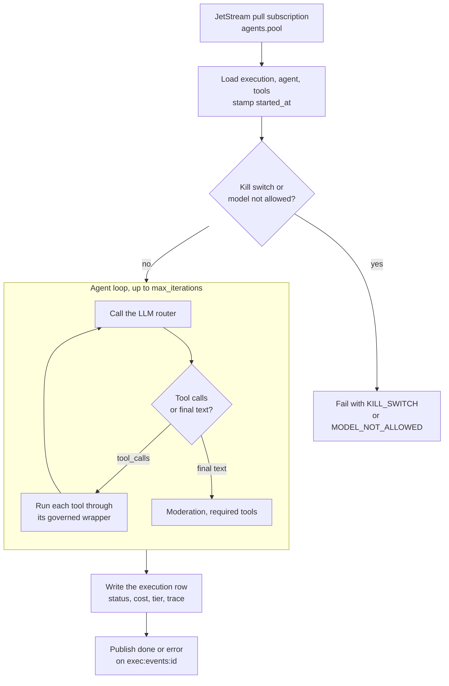

# Agent execution — the loop in detail

> Read [01-architecture/02-request-lifecycle](../01-architecture/02-request-lifecycle.md) first. This doc zooms into the *runtime*: what happens from the moment a run is picked up to the moment its terminal row is written.

---

## Two places a run executes

The same `AgentExecutor` runs in two places.

| Path | When | Who writes the row |
|---|---|---|
| Queue | The API enqueues to the agent's pool and an agent-runtime pod consumes it | `apps/agent-runtime/consumer.py` |
| Inline | The API runs the executor in its own process, for streaming chat and the older paths | `apps/api/app/routers/agents.py` |

The rest of this page follows the queue path. The inline path builds the executor with the same arguments and maps the result to the row the same way.

## The runtime is a queue consumer plus a loop



The pod runs `python consumer.py` with `RUNTIME_MODE=remote`. It:

1. Pulls jobs from JetStream subject `agents.<RUNTIME_POOL>` with durable consumer `abenix-<pool>-consumer`, one message per fetch. With `QUEUE_BACKEND` other than `nats` the consumer logs that queued agents need NATS and exits.
2. Runs up to `AGENT_CONCURRENCY` (or `CONSUMER_MAX_CONCURRENCY`, default 8) jobs at once.
3. Serves `/health` and `/metrics` on `HEALTH_PORT` (default 8001).
4. Starts the tool stream consumer alongside, unless `TOOL_WORKER_ENABLED=0`.

A message is acked only after the run ends. Before running, the consumer claims a lease on the execution row (`runner_id`, `lease_expires_at`, `delivery_attempts`) and renews it, along with an `in_progress` heartbeat to JetStream, while the run lives. A duplicate for a finished run is dropped, a live lease makes the duplicate wait, and an expired lease means the first runner died, so this one reruns the agent from the start. After `CONSUMER_MAX_ATTEMPTS` pickups the run fails with `STALE_SWEEP`. See [08-queue-scaling](08-queue-scaling.md#at-least-once-delivery).

On SIGTERM the consumer sets a stop flag and leaves its loop when the next message arrives. Jobs already running are not drained. Their messages stay unacked, so another pod picks them up once the lease runs out.

## Building the executor

For each job the consumer:

1. Loads the execution row, the agent and its `model_config`. A missing row publishes an `error` event and stops.
2. Stamps `started_at` and sets the credential tenant.
3. Builds the tool registry from `model_config.tools`, with MCP connections resolved when the agent has any. Context tools such as `human_approval` get the execution id, tenant and agent name.
4. Applies `tool_config`: `parameter_defaults` (hidden from the model and locked unless `locked_defaults: false`), `max_calls` and `require_approval`. See [02-tools](02-tools.md).
5. Appends tool configuration notes and MCP warnings to the system prompt.
6. Loads the tenant's moderation gate, `require_knowledge_search` and `require_tools`.

Model settings come from `model_config`: `model` (default `claude-sonnet-4-5-20250929`, or the job's `model_override`), `temperature` (0.7), `max_iterations` (10), `max_tokens` (4096).

The consumer drives `executor.stream()`, so every token, tool call, tool result and node trace is published to Redis channel `exec:events:<execution_id>` as it happens, and appended to a replay log of the last 500 events kept for an hour. See [04-streaming-tracing](04-streaming-tracing.md).

---

## Governance at run start

Before any token is spent the executor opens a governed run and checks it ([`engine/governance.py`](../../apps/agent-runtime/engine/governance.py), [`engine/risk.py`](../../apps/agent-runtime/engine/risk.py)).

1. **Starting tier.** The highest of the tier passed in, the agent's stored `model_config.risk_tier`, and, for a nested agent, the tier of the run that called it. A nested agent never runs below its caller. A start above low adds a reason `{tier, source: "agent"}`.
2. **Kill switches.** `governance.check()` for scope `agent` with the agent id, then scope `model` with the model id. A hit refuses the run with `failure_code: KILL_SWITCH` and the message "The agent <id> is stopped by a kill switch. Reason given: …".
3. **Allowed models.** If the tier policy's `allowed_models` is not empty and the model is not on it (exact id, or a prefix ending `*`), the run is refused with `MODEL_NOT_ALLOWED`.

A refused run is written as `failed`, with the refusal message as output and error, and `ExecutionResult.governance_refusal` set to `{code, message, scope, target}`.

Checks read an in-memory snapshot of `risk_policies`, active `kill_switches` and agents above low tier, refreshed every 5 seconds behind the caller, so a check never waits on the database. Switches match on the tenant first, then platform-wide switches with no tenant, and on `(scope, "*")` or `(scope, target)` or `("all", "*")`.

Kill switch scopes are `all`, `agent`, `pipeline`, `tool`, `model`, `trigger`, `decision` and `source`.

## The loop

Each iteration:

1. Checks the sandbox timeout. Over budget ends the run with "Execution timed out." (`SANDBOX_TIMEOUT` on the queue path).
2. Calls the LLM router with the conversation, the system prompt and every registered tool. The router may swap the model (`model_resolver`), walks the provider chain, gives the first provider 3 attempts and each fallback provider one, and reports which model actually served the call. See [LLM provider abstraction](#llm-provider-abstraction).
3. With no tool calls, the reply is final. It goes through the post-LLM moderation check, then the required-tools check, and the run ends.
4. With tool calls, each one is run in order and its result appended for the next iteration.
5. After the tool results are added, an estimate of the conversation size (characters / 4) above 180,000 tokens stops the run with what it has.

The sandbox defaults are 300 seconds (`SANDBOX_TIMEOUT_SECONDS`, or the admin setting `sandbox.timeout_seconds`) and 50 tool calls per run. When `max_iterations` is above 10 both scale up by `max_iterations / 10`. Past the call cap each further call gets "Tool call limit exceeded".

### The step limit

When `max_iterations` runs out, `invoke()` makes one more LLM call telling the model to stop calling tools and answer from what it gathered. If that fails the output is "Max iterations reached." The `stream()` path, which the queue consumer uses, has no extra turn and ends with whatever text was streamed. Neither sets a failure code.

---

## Tool dispatch

Every tool's `execute` is wrapped once per class by `BaseTool.__init_subclass__` in [`engine/tools/base.py`](../../apps/agent-runtime/engine/tools/base.py). For each call the wrapper:

1. Refreshes the credential snapshot.
2. If no governed tool call is already in progress, refreshes the governance snapshot and runs `_govern`. Nested wrappers (a `_DefaultedTool` around the real tool) are checked once, at the outermost call.
3. Sets the tool's own tenant when it was built with one.
4. Runs the tool. A `ToolNeedsConfiguration` raise becomes the standard "X is not configured. An admin can add it under Admin -> Tool Configuration." result.

`_govern` checks, in order:

- Kill switch scope `tool` for the tool name.
- For every run in the chain, the current one and its parents, kill switch scope `agent` or `pipeline` for its id. A switch set while a run is going stops it at its next tool call, nested runs included.

A hit returns an error result with `metadata.stopped = {scope, target}`. The model sees the message and the loop goes on.

### Risk tier during a run

Each tool class declares `risk_tier` (default `low`). When a tool's tier is above the run's current tier (`risk.above`), the tenant's policy for the tool's tier decides through `tool_call_action`:

| Action | Default for | Effect |
|---|---|---|
| `allow` | low, medium | The call runs and the run is raised to the tool's tier, reason `tool:<name>` |
| `approval` | high, critical | A `human_approval` gate opens, `call <tool> (<tier> risk)` with the arguments as details. Approved, the run is raised with the reviewer in the reason. Rejected or timed out, the call returns an error with `metadata.risk_approval` |
| `block` | none | The call returns an error with `metadata.risk_blocked = {tool_tier, run_tier}` and a message to raise the agent's tier |

`RunContext.raise_to(tier, source, detail)` only ever raises, and appends `{tier, source, detail}` to the run's reasons. When a nested agent or pipeline ends, its final tier is raised onto the parent with source `agent:<name>` or `pipeline:<id>`.

The final tier and reasons come back as `ExecutionResult.risk_tier` and `risk_reasons` (and on the stream's `done` payload) and are written to `executions.risk_tier` and `executions.risk_reasons`. See [05-approvals-hitl](05-approvals-hitl.md#gating-another-tool) and [Governance](../01-architecture/07-governance.md).

### What the model sees

The tool result goes back to the model through `_model_visible_content`:

- Metadata the model would never see is appended as one line, `[tool notes] a | b`. It takes `metadata.warnings`, `metadata.sources_skipped` (as "sources not queried: …"), a `needs_configuration` key and a `skipped` reason.
- With notes, an `[instruction]` line asks the model to pass each note on to the user. For a missing configuration it names the exact wording to repeat.
- The result is capped at `MAX_TOOL_RESULT_CHARS` (12,000). A longer one keeps the first and last 6,000 characters with `[... truncated N chars ...]` between.

### What is recorded

Each tool call entry on the run keeps `name`, `arguments`, `result`, `is_error`, `duration_ms`, an `output_summary`, and a `decision_record` when the tool returned one. `result` is cut to `TOOL_RESULT_PERSIST_CHARS` (default 8,000) with "[N more characters not kept]". Each call also gets a `tool.<name>` OpenTelemetry span and a node trace with the first 500 characters of the result and its metadata.

An unknown tool name returns "Unknown tool: <name>" to the model.

---

## Required tools

`model_config.require_tools` lists tools the run must call. `require_knowledge_search: true` adds `knowledge_search` to the list. A run that ends without calling every listed tool fails:

| Missing | Output | `failure_code` |
|---|---|---|
| Only `knowledge_search` | `Grounded-response agent completed without invoking knowledge_search; output cannot be certified as grounded.` | `GROUNDING_REQUIRED_VIOLATION` |
| Anything else, on the stream path | `[required tools not called: a, b]` appended | `REQUIRED_TOOLS_VIOLATION` |

The `done` payload carries `missing_tools`. The non-streaming `invoke()` path reports any miss as `GROUNDING_REQUIRED_VIOLATION`. A cache hit counts as no tool calls, so it fails the check too.

A run with tools available that called none gets the warning "completed without calling any tool although tools were available" on its trace.

## Output schema

When `model_config.output_schema` is set, the consumer runs `engine/post_process.py` over the final output. It parses the JSON, normalises obvious enum drift and, when that works, stores the cleaned JSON. Problems become `validation_warnings` on the `done` event. There is no retry and no failure code for a schema miss. A per-agent post-processor registered for the agent's slug runs after it.

Tier policies with `require_output_schema` refuse to activate an agent that has none. That check is at publish time, not run time.

---

## Provenance

A database trigger, `executions_provenance`, runs `BEFORE INSERT` on `executions`, so no insert path can skip it. For a row with an `agent_id` and no `provenance` yet it:

1. Hashes the agent's `system_prompt` and `model_config` together (SHA-256) into `config_hash`.
2. Stores that pair in `execution_config_snapshots`, keyed by the hash, once.
3. Sets `prompt_hash` (SHA-256 of the system prompt), `agent_revision` (the highest revision number) and the starting `risk_tier` from the agent's `model_config.risk_tier`, unless the insert gave one.
4. Writes `provenance` as `{config_hash, agent_version, model, temperature, tools, risk_tier}`.

The run's final tier overwrites `risk_tier` at the end. `GET /api/governance/runs/{execution_id}/provenance` returns these fields, the snapshot, and `changed_since`, the keys that differ from the agent now. `POST /api/governance/runs/{execution_id}/replay` reruns an agent execution on its recorded input, `pinned` to the snapshot or on the `current` agent. Both need `runs.replay`. Evaluation suites use `config_hash` for the publish gate, see [18-evaluation-suites](18-evaluation-suites.md#publish-gate).

---

## LLM provider abstraction

The runtime supports Anthropic, OpenAI, Azure OpenAI and Google out of the box, plus a Claude subscription provider. Every implementation lives in one file, [`apps/agent-runtime/engine/llm_router.py`](../../apps/agent-runtime/engine/llm_router.py).

Cost is split by model prefix for the per-provider columns: `claude*` is Anthropic, `gpt*`, `o1*` and `chatgpt*` are OpenAI, `gemini*` is Google, anything else is other.

To add a new provider:
1. Subclass `LLMProvider` in `llm_router.py`. There is no separate providers
   package, every provider class lives in that file.
2. Add it to `_PROVIDER_DEFAULT_MODEL` and teach `_provider_configured()` which
   credential proves it is usable. `candidate_chain()` reads both to build the
   fallback order.
3. Add pricing rows so cost roll-ups work. Pricing is seeded by an alembic
   migration into `llm_model_pricing`, with a hardcoded fallback in the router
   for when the table has not been seeded yet.

See [02-runtime/02-tools](02-tools.md) for adding tools (similar pattern).

---

## Claude subscription mode

A Claude Pro or Max subscription can serve the platform instead of per-call API
billing. `ClaudeSubscriptionProvider` subclasses `AnthropicProvider` and swaps
the credential: it authenticates with `Authorization: Bearer <oauth token>` plus
the `anthropic-beta: oauth-2025-04-20` header rather than `x-api-key`.

Configure it at Admin -> LLM Settings, or set `CLAUDE_SUBSCRIPTION_TOKEN`. The
stored setting wins over the environment variable.

**Cost is recorded as zero, not as unknown.** The provider reports `0.0` while
still emitting token metrics, so a subscription run shows real token counts
against `cost = 0.000000`. A NULL cost means the value was never captured, which
is a different condition.

### Exclusive mode

With `llm.subscription.exclusive` on, `map_model()` pins every request to the
configured subscription model, including requests that already name a Claude
model. That is the point of the setting: one plan's rate limits are predictable,
whereas letting each agent pick its own tier makes them impossible to reason
about.

`effective_model()` is the function to call when you need to know what will
actually run. Anything that branches on the raw configured model rather than the
effective one will quietly bypass the subscription.

### The token rotates

The subscription credential is an OAuth access token that expires within hours,
and whoever minted it may rotate it sooner. The platform stores a copy and
cannot renew it, so a token that worked yesterday returns:

```
Error code: 401 - authentication_error: OAuth access token has been revoked.
```

That is a stale copy, not a platform fault. Run
`bash scripts/sync-claude-subscription.sh` to refresh it, or check
`POST /api/admin/settings/subscription/verify` to confirm the stored token is
still live. When the subscription is enabled but unusable, the router falls
through to any other configured provider and says so in the final error rather
than surfacing the downstream provider's message on its own.

---

## Approval gates

A gate does not suspend the run. The `human_approval` or `approval_gate` tool call blocks inside the loop and polls every 2 seconds until someone decides or the gate times out, then returns a normal tool result. The run keeps its runtime slot the whole time. A `hitl:waiting:<execution_id>` key in Redis keeps the stale sweeper away from it. See [05-approvals-hitl](05-approvals-hitl.md).

---

## Cost roll-up

Each LLM response carries its cost. The executor adds them up, plus the final-answer turn when there is one, and splits them by provider. On the terminal write the consumer stores `cost` (rounded to 6 places, 0 written as 0 rather than left NULL), the token counts, `model_used`, `duration_ms` and `trace_id`, and debits the API key's and user's usage counters.

These are the numbers the Analytics page rolls up.

## Spend caps

Two daily caps on the agent row are checked before a run starts, in [`engine/agent_budget.py`](../../apps/agent-runtime/engine/agent_budget.py).

| Column | Caps |
|---|---|
| `daily_cost_limit` | What the agent spends per UTC day, across every caller and tenant |
| `daily_budget_usd` | What one tenant spends on that agent per UTC day |

Who sets them:

- `daily_budget_usd`: the agent's author in the builder (Advanced, Daily budget), or an admin under Admin, Scaling. The builder sends the value with the agent and the API writes it to the column with the same checks as the Scaling page. An empty field sends `null`, which removes the cap.
- The builder's other runtime fields reach their columns the same way. Rate limit (whole requests per second, 1 to 10,000) is open to the author. Runtime pool, replicas and concurrency per replica cost money, so the API applies them only for admins, and the builder shows them read only to everyone else.
- Opening an agent in the builder shows the column values, so an edit made on the Scaling page is what the author sees.

A value of 0 or less means no cap. Spend is the sum of `executions.cost` for the agent since midnight UTC, plus the cost of steps where a pipeline ran this agent through `agent_step` (read from the pipeline row's `node_results` by `metadata.billed_agent_id`).

The daily caps apply before any run starts, on every path: the agent page and `POST /api/agents/{id}/execute`, triggers, the `/api/pipelines/{id}/execute*` routes, pipeline steps, meetings, OracleNet, governance replays, `POST /api/a2a/agents/{id}/invoke` and `POST /api/batch/execute`. A refused API call gets HTTP 429 with `error_code: BUDGET_EXCEEDED`, a plain message with today's spend (UTC) and who can raise the cap (the agent's owner for `daily_cost_limit`, an admin under Admin, Scaling for `daily_budget_usd`), and `details` holding `limit`, `cap_usd` and `spent_today_usd`. A triggered run (webhook, schedule, Run now) is written as `failed` with that code and message, and the trigger owner is notified. An `agent_step` whose saved agent is over its cap returns an error result with `failure_code: BUDGET_EXCEEDED`. A meeting bot over its cap does not join and the meeting log says why. A batch checks once before it is queued and again before each input, so inputs after the cap is reached come back failed with `BUDGET_EXCEEDED`.

A saved agent run as a pipeline step counts toward its own daily caps as well as the pipeline's bill. Its spend is read from the pipeline row's `node_results`, so it counts once the pipeline run finishes, and the organization totals are not counted twice because the step has no execution row of its own.

### Per-run cost limit

`per_execution_cost_limit` caps one run. After each model call the executor checks what the run has spent. Once spend reaches the limit and the model asks for another step, the run stops with `failure_code: BUDGET_EXCEEDED`. The answer so far and every step stay in the Flight Recorder, ending with a `budget_stop` step that records the limit and the spend. A final answer that crosses the limit is kept, since no further step was asked for. Pipelines apply the same limit across their steps: before each node the pipeline compares the spend so far with the limit and fails the node once it is reached. An API caller can pass `cost_limit` in the request body (pipelines, a2a, batch), which can only tighten the agent's limit, never raise it.

### Pipeline run cost

A pipeline row's `cost`, `input_tokens` and `output_tokens` are the sum over every node, completed or failed. A node's spend is read from its `metadata.cost` (what `agent_step` and `llm_call` report), falling back to a `cost` field in its output. A node that is retried keeps the spend of its failed attempts, added into its `metadata.cost` with the part from earlier attempts in `metadata.earlier_attempts_cost`. `pipeline_usage` in [`engine/pipeline.py`](../../apps/agent-runtime/engine/pipeline.py) does the sum and `serialize_pipeline_result` returns it, so the inline API paths, the `/api/pipelines` routes, the queue consumer and the daily caps all see the same number. A failed pipeline's spend is also debited from the API key's and user's monthly counters.

---

## What happens when things break

| Failure mode | What the runtime does | What you'll see |
|---|---|---|
| LLM error | The first provider gets 3 attempts, each fallback provider in the chain gets one | `model_used` and `model_fallback_reason` show what served the call |
| Kill switch at start | Refused before the first LLM call | `failure_code=KILL_SWITCH` |
| Model not on the tier's list | Refused before the first LLM call | `failure_code=MODEL_NOT_ALLOWED` |
| Kill switch during the run | The next tool call returns an error result, the loop continues | `metadata.stopped` on the tool call |
| Tool raises or returns `is_error` | The model sees the error text in the next iteration | `is_error: true` on the tool call |
| Moderation blocks input or output | The run ends with the block message | `failure_code=MODERATION_BLOCKED` |
| Required tool not called | The run fails after the final answer | `GROUNDING_REQUIRED_VIOLATION` or `REQUIRED_TOOLS_VIOLATION` |
| Sandbox timeout | The run ends at the next iteration check | `failure_code=SANDBOX_TIMEOUT` |
| `max_iterations` hit | One final-answer turn on `invoke()`, none on `stream()` | Completed, no failure code |
| Context estimate over 180,000 tokens | The run stops with what it has | Completed, no failure code |
| Unhandled exception | The row is failed with a code from `classify_exception` and a dead letter is written | `failure_code` such as `LLM_RATE_LIMIT`, `INFRA_CRASH`, `UNKNOWN_ERROR` |
| Pod dies mid-run | On a pool, JetStream redelivers and another pod reruns the agent from the start once the lease (`CONSUMER_LEASE_SECONDS`, 25) expires. Tool side effects can repeat. After `CONSUMER_MAX_ATTEMPTS` (3) pickups the run is failed. An inline run stays `running` until the API's sweeper fails `running` rows older than `STALE_EXECUTION_MAX_MINUTES` (default 10), skipping runs on a HITL gate or with a live lease | A second attempt in the logs, or `failure_code=STALE_SWEEP` |

Every terminal outcome increments `abenix_executions_failed_total{failure_code=…}` or the completed counter. The full list of codes is in [09-state-machines](09-state-machines.md#failure-codes).

---

## See also

- [02-runtime/01-pipelines](01-pipelines.md) — when the agent IS a pipeline
- [02-runtime/02-tools](02-tools.md) — the tool framework
- [02-runtime/04-streaming-tracing](04-streaming-tracing.md) — events + OTel
- [02-runtime/05-approvals-hitl](05-approvals-hitl.md) — the full HITL flow
- [08-howto/04-debugging](../08-howto/04-debugging.md) — common failure modes + traces

---

## Source map

| What | Where |
|---|---|
| **Queue consumer** | [`apps/agent-runtime/consumer.py`](../../apps/agent-runtime/consumer.py) — `main`, `_run_one`, `_mark_done` |
| **Executor loop** | [`apps/agent-runtime/engine/agent_executor.py`](../../apps/agent-runtime/engine/agent_executor.py) — `AgentExecutor`, `_model_visible_content`, `_persisted_result` |
| **Governance snapshot, kill switches, run tier** | [`apps/agent-runtime/engine/governance.py`](../../apps/agent-runtime/engine/governance.py) |
| **Tier policies** | [`apps/agent-runtime/engine/risk.py`](../../apps/agent-runtime/engine/risk.py) |
| **Per-call wrapper** | [`apps/agent-runtime/engine/tools/base.py`](../../apps/agent-runtime/engine/tools/base.py) — `BaseTool.__init_subclass__`, `_govern` |
| **Sandbox limits** | [`apps/agent-runtime/engine/sandbox.py`](../../apps/agent-runtime/engine/sandbox.py) |
| **Provenance trigger** | [`packages/db/alembic/versions/c1d2e3f4a5b6_governance_core.py`](../../packages/db/alembic/versions/c1d2e3f4a5b6_governance_core.py) |
| **Provenance and replay endpoints** | [`apps/api/app/routers/governance.py`](../../apps/api/app/routers/governance.py) |
| **Failure codes** | [`apps/api/app/core/failure_codes.py`](../../apps/api/app/core/failure_codes.py) |
| **Stale sweeper** | [`apps/api/app/core/scheduler.py`](../../apps/api/app/core/scheduler.py) — `sweep_stale_executions` |
