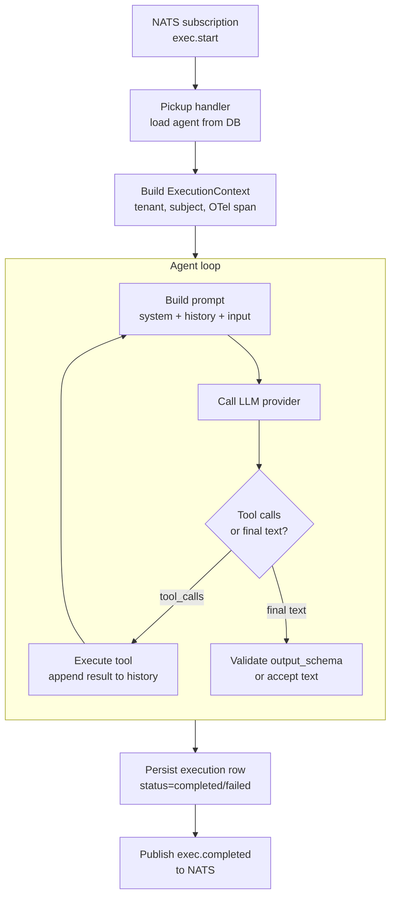
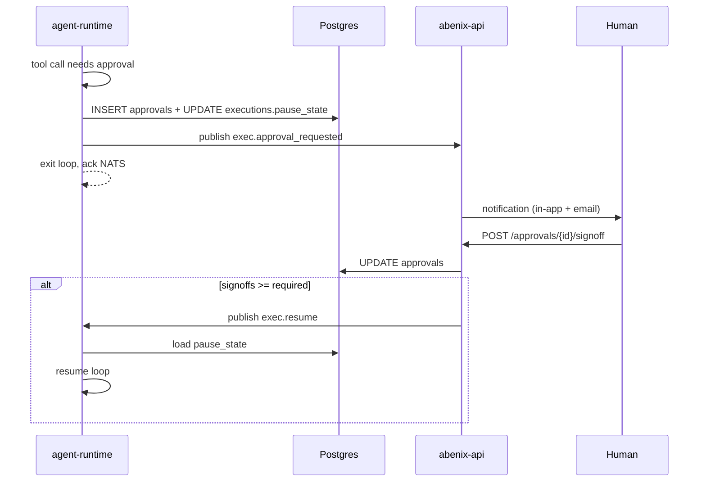

# Agent execution — the loop in detail

> Read [01-architecture/02-request-lifecycle](../01-architecture/02-request-lifecycle.md) first. This doc zooms into the *runtime*'s loop — what happens inside a single agent-runtime pod from the moment it picks up `exec.start` to the moment it persists the terminal result.

---

## The runtime is a NATS consumer + a loop



The agent-runtime pod runs `apps/agent-runtime/main.py` which starts:
1. A NATS consumer subscribed to `exec.{pool}.>`.
2. An HTTP server on `:8001` exposing `/health` + `/metrics`.
3. A graceful-shutdown handler that drains the consumer before terminating.

When SIGTERM arrives (rolling deploy), the handler:
1. Unsubscribes the consumer (no new messages).
2. Lets any in-flight loops finish up to `agent.timeout` seconds.
3. Force-stops anything still running and lets Postgres' uncommitted-tx be rolled back by the connection close.

---

## ExecutionContext — everything a tool needs

When the runtime picks up a message, it builds an `ExecutionContext` that gets threaded through every tool call:

```python
@dataclass
class ExecutionContext:
    execution_id: UUID
    tenant_id: UUID
    agent_id: UUID
    subject: ActingSubject | None     # actAs identity
    actor_id: UUID                    # platform user who triggered (often = subject.user_id)
    started_at: datetime
    otel_span: Span                   # current OpenTelemetry span — children attach here
    db_url: str
    blob_url: str
    redis_url: str
    nats: NatsClient                  # for event emission
    inputs: dict                      # original input payload
    history: list[Message]            # mutable — the loop appends here
    cost_so_far_usd: float            # rolled up across LLM calls
```

Tools accept this context as a constructor argument and use it to:
- Connect to the tenant-scoped DB.
- Emit events (`ctx.nats.publish(...)`).
- Open OTel child spans (`with ctx.otel_span.start_child(...)`).
- Append to history (rare — usually only the runtime touches `history`).

> **Why** — tools are stateless. All session state lives on the context. This makes tools trivial to test in isolation: build a fake context, call `tool.execute()`, assert on the result.

---

## Building the prompt

Each loop iteration starts by building the LLM messages:

```python
messages = [
    {"role": "system", "content": agent.system_prompt},
    *agent.example_prompts_messages,    # few-shot examples if any
    *ctx.history,
    {"role": "user", "content": json.dumps(ctx.inputs)},
]
tool_schemas = [
    registry.get(slug).schema_for_llm(ctx)
    for slug in agent.model_config_["tools"]
]
```

`schema_for_llm` produces the per-tool JSONSchema the LLM provider expects. For Anthropic this is the `tools` array on the `messages.create` call. for OpenAI it's `tools` on `chat.completions.create`. The runtime has provider-specific shims in [`apps/agent-runtime/engine/llm_router.py`](../../apps/agent-runtime/engine/llm_router.py).

---

## Tool dispatch

When the LLM returns `tool_calls`, the runtime iterates:

```python
for call in response.tool_calls:
    tool = registry.instantiate(call.tool_slug, ctx)
    cfg = ctx.tool_config.get(call.tool_slug, {})

    # Apply per-tool param defaults (from agent's tool_config block)
    args = {**cfg.get("parameter_defaults", {}), **call.arguments}

    # Approval gate?
    if cfg.get("require_approval") and not _is_approved(ctx, call):
        await _request_approval_and_pause(ctx, call)
        return  # the loop suspends; resumed later by exec.resume

    # max_calls cap?
    if not _within_call_cap(ctx, call.tool_slug, cfg.get("max_calls")):
        result = ToolResult(content="Tool call cap reached", is_error=True)
    else:
        # Real call
        with ctx.otel_span.start_child(f"tool.{call.tool_slug}"):
            result = await tool.execute(args)

    # Log invocation
    await _log_invocation(ctx, call, result)

    # Emit streaming event
    await ctx.nats.publish(f"exec.{ctx.execution_id}.tool", {
        "tool_slug": call.tool_slug,
        "args": args,
        "result_preview": str(result.content)[:500],
        "is_error": result.is_error,
    })

    # Append to history for the next LLM iteration
    ctx.history.append(_tool_result_to_message(call, result))
```

The full registry + framework is documented in [02-runtime/02-tools](02-tools.md).

---

## Iteration limit + output schema

Two safety nets at the end of the loop:

### `max_iterations`
- Default 10. Set on `model_config.max_iterations`.
- If we hit it, the runtime emits `exec.iteration_cap_hit`, marks the execution `completed` with `failure_code='iteration_cap'`, and returns whatever the LLM said last.
- The cap is a hard cost-protection — without it a stuck agent in a tool-call loop could burn hundreds of dollars.

### `output_schema`
- Optional. JSONSchema-shaped object on `model_config.output_schema`.
- When the LLM finally produces text (no tool call), the runtime attempts to parse it as JSON and validate against the schema.
- On validation failure: one **retry with feedback** — the runtime appends an assistant message + a user message: "Your previous reply did not match the required schema. Here are the errors: …. Reply only with valid JSON."
- After one retry, if still invalid: emits `exec.output_invalid`, marks execution `completed` with `failure_code='output_schema'` and returns the raw text as `output.raw`.

> **Why the retry** — empirical evidence shows ~70% of schema failures self-correct on a single retry with the validator output. More retries don't help. the LLM either gets it or stays stuck.

---

## LLM provider abstraction

The runtime supports Anthropic, OpenAI, Azure OpenAI and Google out of the box, plus a Claude subscription provider. Every implementation lives in one file, [`apps/agent-runtime/engine/llm_router.py`](../../apps/agent-runtime/engine/llm_router.py):

```python
class ChatProvider(Protocol):
    async def chat(
        self,
        model: str,
        messages: list[Message],
        tools: list[ToolSchema],
        temperature: float,
        max_tokens: int,
    ) -> ChatResponse: ...

    def estimate_cost(self, model: str, prompt_tokens: int, completion_tokens: int) -> float: ...
```

The runtime picks a provider by inspecting `model_config.model`:
- `claude-*` → Anthropic
- `gpt-*` → OpenAI
- `gemini-*` → Google

To add a new provider:
1. Subclass `LLMProvider` in `llm_router.py`. There is no separate providers
   package, every provider class lives in that file.
2. Add it to `_PROVIDER_DEFAULT_MODEL` and teach `_provider_configured()` which
   credential proves it is usable. `candidate_chain()` reads both to build the
   fallback order.
3. Add pricing rows so cost roll-ups work. Pricing is seeded by an alembic
   migration into `llm_model_pricing`, with a hardcoded fallback in the router
   for when the table has not been seeded yet.

See [02-runtime/02-tools](02-tools.md) for adding tools (similar pattern).

---

## Claude subscription mode

A Claude Pro or Max subscription can serve the platform instead of per-call API
billing. `ClaudeSubscriptionProvider` subclasses `AnthropicProvider` and swaps
the credential: it authenticates with `Authorization: Bearer <oauth token>` plus
the `anthropic-beta: oauth-2025-04-20` header rather than `x-api-key`.

Configure it at Admin -> LLM Settings, or set `CLAUDE_SUBSCRIPTION_TOKEN`. The
stored setting wins over the environment variable.

**Cost is recorded as zero, not as unknown.** The provider reports `0.0` while
still emitting token metrics, so a subscription run shows real token counts
against `cost = 0.000000`. A NULL cost means the value was never captured, which
is a different condition.

### Exclusive mode

With `llm.subscription.exclusive` on, `map_model()` pins every request to the
configured subscription model, including requests that already name a Claude
model. That is the point of the setting: one plan's rate limits are predictable,
whereas letting each agent pick its own tier makes them impossible to reason
about.

`effective_model()` is the function to call when you need to know what will
actually run. Anything that branches on the raw configured model rather than the
effective one will quietly bypass the subscription.

### The token rotates

The subscription credential is an OAuth access token that expires within hours,
and whoever minted it may rotate it sooner. The platform stores a copy and
cannot renew it, so a token that worked yesterday returns:

```
Error code: 401 - authentication_error: OAuth access token has been revoked.
```

That is a stale copy, not a platform fault. Run
`bash scripts/sync-claude-subscription.sh` to refresh it, or check
`POST /api/admin/settings/subscription/verify` to confirm the stored token is
still live. When the subscription is enabled but unusable, the router falls
through to any other configured provider and says so in the final error rather
than surfacing the downstream provider's message on its own.

---

## Resumable execution (approval gates)

If a tool with `require_approval=True` fires, the runtime doesn't keep waiting. It:

1. Inserts an `approvals` row with `status='pending'` and `payload={tool_slug, args, agent_id, execution_id}`.
2. Snapshots the current `history` + `cost_so_far_usd` + iteration count into `executions.pause_state` (JSONB).
3. Updates `executions.status='waiting_approval'`.
4. Publishes `exec.{id}.approval_requested` (consumed by abenix-api which emits notifications + SSE).
5. **Exits the loop and acks the NATS message.** The runtime pod is now free.

When the approval is decided:
- API publishes `exec.{id}.resume` if approved.
- Runtime consumer picks up the resume message, loads `pause_state` from Postgres, rebuilds `ctx.history`, and re-enters the loop from where it left off.



> **Why** — a 30-minute pending approval should not pin a pod for 30 minutes. By exiting and re-entering, a single 4-replica pool can hold thousands of paused executions cheaply.

---

## Cost roll-up

After each LLM call, the runtime calls `provider.estimate_cost(...)` and accumulates into `ctx.cost_so_far_usd`. On terminal write:

```python
execution.cost_usd = ctx.cost_so_far_usd
execution.duration_ms = (now - ctx.started_at).total_seconds() * 1000
```

These are the numbers the Analytics page rolls up. The `tool_invocations.cost_usd` on individual tool rows is set when a tool *itself* incurs external API cost (e.g. a tavily-search call) — most tools have cost=0 because they're DB or local.

---

## What happens when things break

| Failure mode | What the runtime does | What you'll see |
|---|---|---|
| LLM 5xx | Retry with exp backoff up to 3 times | extra latency. `execution.cost_usd` excludes retried tokens |
| LLM rate-limit | Retry-after honored. one retry | execution.duration_ms includes the wait |
| Tool exception | Caught. `ToolResult(is_error=True)` written. agent sees the error message in next iteration | tool_invocations.is_error=true |
| Tool timeout | killed at `tool.timeout` seconds (default 60). same as exception | failure_code='tool_timeout' |
| `output_schema` invalid | one retry. then `failure_code='output_schema'` | execution completes with output.raw populated, output.parsed=None |
| `max_iterations` hit | abort. `failure_code='iteration_cap'` | execution completes with output = last LLM text |
| Pod OOM-killed mid-loop | Reconciler sweeper (in worker) marks failed after agent.timeout | failure_code='runtime_died_or_timeout' |
| NATS message redelivery | Idempotent — runtime checks executions.status before starting. skips if not 'queued' | none visible |

Every failure increments a Prometheus counter `abenix_executions_failed_total{failure_code=…}`. The `/help` page → "Alerts" lists the codes worth paging on.

---

## See also

- [02-runtime/01-pipelines](01-pipelines.md) — when the agent IS a pipeline
- [02-runtime/02-tools](02-tools.md) — the tool framework
- [02-runtime/04-streaming-tracing](04-streaming-tracing.md) — events + OTel
- [02-runtime/05-approvals-hitl](05-approvals-hitl.md) — the full HITL flow
- [08-howto/04-debugging](../08-howto/04-debugging.md) — common failure modes + traces
