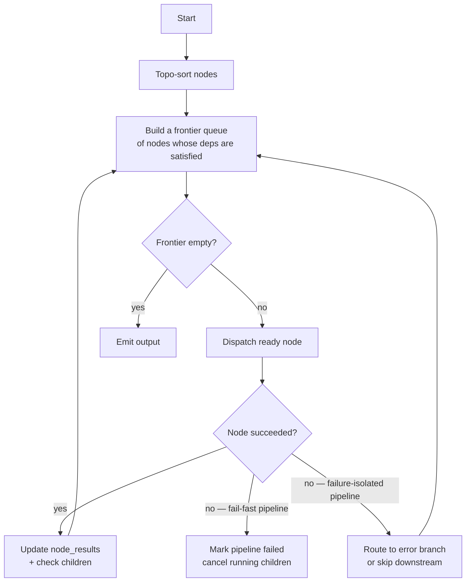

# Pipelines — the DAG engine

> When a single agent isn't enough — chain agents together with branching, looping, error-routing, and parallel fan-out. The pipeline engine is a topo-sorted DAG executor with first-class support for these patterns.

---

## Why pipelines (and when not to)

A single agent is right when:
- One LLM call (with a few tool calls) is enough to produce the answer.
- The answer fits in one prompt's context window.
- You don't need branching or retry-per-step semantics.

A pipeline is right when:
- You need to chain multiple agents (`extract_clauses → classify → flag_risks`).
- You need branching based on a step's output (`if classify=='breach' then escalate else log`).
- You need to fan out over a list (for each clause, run the risk-extractor).
- You need a step that can fail independently and roll back.

> **Trap** — pipelines add 200-500ms of orchestration overhead per step. For a 3-step pipeline where each step is a 200ms LLM call, the orchestration is ~50% of total latency. If you don't need branching/looping, do it in one agent with a tighter system prompt.

---

## Anatomy of a pipeline

A pipeline lives on `agents.model_config_.pipeline_config` (JSONB). Shape:

```yaml
pipeline_config:
  nodes:
    - id: step-1
      type: agent
      agent_slug: wingman-broker-classifier
      inputs:
        text: "{{context.broker_email_body}}"
    - id: step-2
      type: switch
      condition: "{{step-1.intent}} == 'offer'"
      branches:
        true: step-3-parse
        false: step-3-ignore
    - id: step-3-parse
      type: agent
      agent_slug: wingman-broker-parser
      inputs:
        text: "{{context.broker_email_body}}"
    - id: step-3-ignore
      type: tool
      tool_slug: log
      arguments:
        message: "Non-offer email; no action."
  edges:
    - {from: step-1, to: step-2}
    - {from: step-2, to: step-3-parse}
    - {from: step-2, to: step-3-ignore}
  output:
    from: step-3-parse
    field: parsed_offer
```

**Nodes** are units of work. **Edges** wire output → input. **Output** picks the final result.

### Node types

| `type` | Purpose | Key fields |
|---|---|---|
| `agent` | Run another agent (single LLM loop) | `agent_slug`, `inputs` |
| `pipeline` | Run another pipeline (recursion allowed) | `pipeline_slug`, `inputs` |
| `tool` | Run a single tool directly (no LLM) | `tool_slug`, `arguments` |
| `switch` | Branch based on a condition | `condition`, `branches` |
| `for_each` | Fan out over a list | `over`, `as`, `body` |
| `parallel` | Run N children concurrently, merge results | `children`, `merge` |
| `human` | Pause for an approval gate (same as a tool but DAG-aware) | `required_signoffs`, `expires_seconds` |
| `code` | Run a code asset | `asset_id`, `input_data` |
| `ml_predict` | Call an ML model deployment | `model_name`, `input_data` |

### Templating

`{{...}}` is the templating syntax. Available variables:
- `context.*` — original pipeline inputs.
- `<step_id>.*` — the JSON output of that step.
- `iteration` — when inside a `for_each`, the current item.
- `now` — current ISO timestamp.

Templates are eagerly resolved at step start (no lazy evaluation).

---

## Execution model

The engine is in [`apps/agent-runtime/engine/pipelines/`](../../apps/agent-runtime/engine/pipelines/). It runs in the same pod as a single-agent execution — it's just a different path on the runtime.



Important behaviours:
- **Parallelism**: a node enters the dispatch queue as soon as ALL its predecessors complete. Independent branches run concurrently up to `pipeline.max_concurrency` (default 4).
- **Fail-fast vs failure-isolated**: configurable per pipeline. Fail-fast aborts on first error. isolated routes errors via `onError` edges and keeps others alive.
- **Cancellation**: when a pipeline is force-cancelled, in-flight nodes get a `cancel` signal via NATS. tool implementations should honour it.

---

## The pipeline_runs row vs the executions row

Both exist. They serve different purposes:

| Row | Purpose | Granularity |
|---|---|---|
| `executions` | One per top-level pipeline run. treats the whole pipeline as one execution | parent |
| `pipeline_runs` | One per pipeline run | parent (1:1 with executions when pipeline) |
| `pipeline_step_runs` | One per node execution inside a pipeline | child |

For a 10-node pipeline, you get 1 execution row + 1 pipeline_run row + 10 step_run rows.

Why two parent rows: `executions` is the unified surface for the trace waterfall (agent + pipeline + future modes). `pipeline_runs` carries pipeline-specific fields (max_concurrency, isolation_mode, etc.) without bloating `executions`.

---

## Builder support

The frontend Pipeline Builder ([`apps/web/src/components/builder/pipeline/`](../../apps/web/src/components/builder/pipeline/)) is a React Flow canvas. Nodes drag in from a left palette. edges drag between handles. Save serialises to `pipeline_config` JSON.

The builder validates client-side using [`PipelineStore.validate()`](../../apps/web/src/components/builder/pipeline/usePipelineStore.ts) — checks for cycles, unknown tools, dangling edges, missing template vars. Server-side validation is identical and runs on save (defence in depth).

See [05-ui/01-builder-canvas](../05-ui/01-builder-canvas.md) for the UI patterns.

---

## Common pipeline patterns

### Pattern 1 — Extract → Classify → Route
The most common. One pipeline, three agents, one switch.
Used by: ContractIQ clause review, Wingman broker inbox triage.

### Pattern 2 — Map / for-each
Fan a per-item agent over a list. E.g. for each clause in a contract, run risk analysis.
```yaml
- id: per-clause
  type: for_each
  over: "{{extract.clauses}}"
  as: clause
  body:
    type: agent
    agent_slug: clause-risk-analyzer
    inputs:
      clause: "{{clause}}"
```
The `for_each` runs up to `max_concurrency` items concurrently.

### Pattern 3 — Parallel fan-out, merge
Run 3 perspectives concurrently, merge.
```yaml
- id: perspectives
  type: parallel
  children:
    - {id: legal, type: agent, agent_slug: legal-reviewer, ...}
    - {id: risk, type: agent, agent_slug: risk-reviewer, ...}
    - {id: ops, type: agent, agent_slug: ops-reviewer, ...}
  merge:
    type: combine
    fields:
      legal: "legal.opinion"
      risk: "risk.opinion"
      ops: "ops.opinion"
```

### Pattern 4 — Human in the loop
Insert an `approval_gate` step. Pipeline pauses durably.
```yaml
- id: gate
  type: human
  title: "Approve sending the contract draft"
  payload:
    counterparty: "{{extract.counterparty}}"
    amount_usd: "{{extract.amount_usd}}"
  required_signoffs: 1
  expires_seconds: 86400
```

---

## See also

- [00-agent-execution](00-agent-execution.md) — single-agent loop (a pipeline's step is often a single agent)
- [05-approvals-hitl](05-approvals-hitl.md) — pause/resume mechanics
- [05-ui/01-builder-canvas](../05-ui/01-builder-canvas.md) — drag-drop builder
- [08-howto/02-add-an-agent](../08-howto/02-add-an-agent.md) — agent yaml format used by pipeline steps

---

## Source map

| What | Where |
|---|---|
| **Pipeline executor (DAG engine)** | [`apps/agent-runtime/engine/pipeline.py`](../../apps/agent-runtime/engine/pipeline.py) |
| **Pipeline schema (Pydantic validation)** | [`apps/api/app/schemas/pipelines.py`](../../apps/api/app/schemas/pipelines.py) |
| **Pipeline REST router** | [`apps/api/app/routers/pipelines.py`](../../apps/api/app/routers/pipelines.py) |
| **Pipeline state model** | [`packages/db/models/pipeline_state.py`](../../packages/db/models/pipeline_state.py) |
| **Builder canvas** | [`apps/web/src/app/(app)/builder/page.tsx`](../../apps/web/src/app/(app)/builder/page.tsx) |
| **Tests** | [`apps/agent-runtime/tests/test_pipeline.py`](../../apps/agent-runtime/tests/test_pipeline.py) |
| **Workflow shell (JSON-Patch REPL)** | [`apps/api/app/routers/workflow_shell.py`](../../apps/api/app/routers/workflow_shell.py) |
