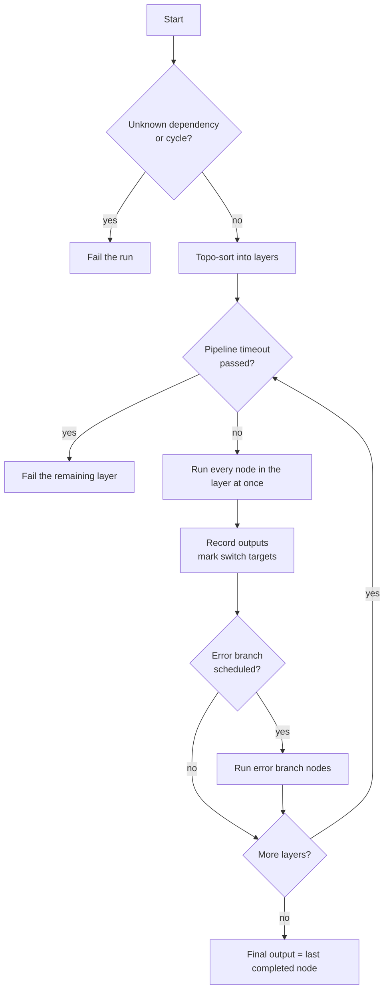

# Pipelines — the DAG engine

> When one agent is not enough, chain tools and agents with conditions, switches, loops, error routing and parallel fan-out. The engine runs the DAG layer by layer.

---

## Why pipelines (and when not to)

A single agent is right when:
- One LLM loop (with a few tool calls) is enough to produce the answer.
- The answer fits in one prompt's context window.
- You don't need branching or retry-per-step semantics.

A pipeline is right when:
- You need to chain multiple agents (`extract_clauses → classify → flag_risks`).
- You need branching based on a step's output (`if classify == 'breach' then escalate else log`).
- You need to fan out over a list (for each clause, run the risk-extractor).
- You need a step that can fail without stopping the rest.

---

## Anatomy of a pipeline

A pipeline is an agent with `mode: pipeline`. Its DAG is stored in the agent's `model_config` JSONB under `pipeline_config`. In a seed YAML keep `pipeline_config` at the top level, next to `model_config`. The 400 that execute returns when `pipeline_config` is missing names nesting it under `model_config` in the seed as the usual cause.

```yaml
mode: pipeline
model_config:
  tools: [database_query, agent_step, human_approval]
  input_variables:
    - {name: case_id, type: string, required: true}
pipeline_config:
  nodes:
    - id: load_case
      type: tool
      tool: database_query
      input:
        sql: "SELECT * FROM cases WHERE id = :case_id"
        params: {case_id: "{{input.case_id}}"}
    - id: qa_review
      type: agent
      agent_slug: resolveai-qa-reviewer
      input: "Case: {{load_case.rows.0}}"
      context:
        case_id: "{{input.case_id}}"
    - id: report
      type: structured
      output:
        score: "{{qa_review.score}}"
        case: "{{input.case_id}}"
```

There are no edges. A node runs after the nodes in its `depends_on`, plus every node its templates name (`{{load_case.x}}` adds `load_case`). Every tool a node calls must be in `model_config.tools`, including `agent_step` for `type: agent` nodes. On agent execute and queued runs a missing tool fails the node with "Unknown tool". `POST /api/pipelines/{id}/execute` and `/execute-saved` reject the run with a 400 before it starts, and both add `agent_step` themselves when the pipeline has agent nodes.

### Node types

`type` picks how a node runs.

| `type` | Runs | Key fields |
|---|---|---|
| `tool` (default) | One tool call, no LLM unless the tool calls one | `tool_name` or `tool`, `arguments`, and `input` (a dict is merged into the arguments, anything else becomes `arguments.input`). `input` is read only when `type: tool` is written out |
| `agent` | A seeded agent through the `agent_step` tool, with that agent's system prompt, model, tools, `max_iterations` and temperature | `agent_slug`, `input` (the message), `context` (appended to the message as a `[Pipeline context]` block). A node with only `agent_id` is not resolved and fails with "system_prompt is required" |
| `structured` | No call. Template-resolves `output` (or `fields`) and returns it as one dict, parsing values that look like JSON | `output` |

Some tool names are built into the engine and never reach the registry:

| `tool_name` | Does | Config |
|---|---|---|
| `__switch__` | Evaluates cases against an upstream field and activates the matching targets | `switch` |
| `__merge__` | Combines upstream outputs | `merge` |
| `wait` | Sleeps `seconds`, at most 300 | `arguments.seconds` |
| `state_get`, `state_set` | Read or write a value in `pipeline_states`, keyed by agent and `key`, kept across runs | `arguments.key`, `arguments.value` |

Any node can also carry these:

| Field | Effect |
|---|---|
| `depends_on` | Nodes that must finish first. An unknown id fails the run before anything starts, with `unknown dependency: <id>` |
| `condition` | `{source_node, field, operator, value}`. Skips the node when false |
| `required_if` | A template. Skips the node when it resolves to empty, `false`, `0`, `none`, `null`, `[]` or `[not available]` |
| `input_mappings` | `{arg: {source_node, source_field}}`. Copies an upstream field into an argument. `source_field` defaults to `__all__` |
| `for_each` | `{source_node, source_field, item_variable, max_concurrency}`. Runs the node once per list item |
| `while_loop` | `{condition, body_nodes, max_iterations}`. Reruns the body nodes while the condition holds, at most 50 times by default |
| `max_retries`, `retry_delay_ms` | Retries a failed node with exponential backoff, `retry_delay_ms × 2^attempt` |
| `timeout_seconds` | Per-node timeout for the tool call |
| `on_error` | `stop` (default), `continue` or `error_branch` |
| `error_branch_node` | The node to run when this one fails and `on_error` is `error_branch` |
| `label` | Display name. `arguments`, `context` and `input_mappings` may name a step by its unique label instead of its id. Use ids in `input`, `output`, `condition` and `required_if` |

Condition operators are `eq`, `neq`, `gt`, `lt`, `gte`, `lte`, `contains`, `not_contains`, `in` and `not_in`. A missing field is false for everything except `eq` and `neq`.

The ad-hoc `POST /api/pipelines/{agent_id}/execute` takes a subset of these fields through a Pydantic schema. It drops `while_loop`, `label`, `required_if`, `input`, `context` and `output`, rejects `type: structured`, and needs `tool_name` on tool nodes. Limits: up to 50 nodes, `max_retries` 0 to 5, `retry_delay_ms` 100 to 30,000, node `timeout_seconds` 1 to 300 and `for_each.max_concurrency` 1 to 50.

### Switch and merge

```yaml
- id: classify
  tool_name: llm_route
  arguments: {message: "{{context.message}}"}
- id: route_switch
  tool_name: "__switch__"
  depends_on: [classify]
  switch:
    source_node: classify
    field: route
    cases:
      - {operator: eq, value: billing, target_node: billing_handler}
      - {operator: eq, value: technical, target_node: technical_handler}
    default_node: technical_handler
- id: billing_handler
  tool_name: llm_call
  depends_on: [route_switch]
  arguments: {prompt: "Draft a billing reply for: {{context.message}}"}
```

Cases are tried in order and the first match activates its target. With no match, `default_node` is activated. A node that depends on a switch and was not activated is skipped. The switch's output is `{route, target_node, actual_value, __switch_targets}`, where `route` is the matched case value or `default`.

`__merge__` modes are `append` (concatenate the `source_nodes` outputs), `zip` and `join` on `join_field`.

### Templating

`{{path}}` resolves against the run's outputs by dotted path. Only letters, digits, `_` and dots are matched, so list indexes are path parts, `{{load_case.rows.0}}`. A bracket index such as `rows[0]` is not a template and is left as text.

| Root | Is |
|---|---|
| `input.*` | The run's input, the same on every execute path. `input.message` falls back to `user_message`, `prompt`, `body`, `ticket_content` or `content`. Every agent-execute path builds its context with `build_run_context()` in `engine/pipeline.py`, and a plain-text `input` in the context never replaces this root |
| `context.*` | The run's context, as sent |
| `<node_id>.*` | That node's output. An agent node's `{"response": "<json>"}` wrapper is looked through, and JSON inside code fences or followed by prose is parsed |
| any context key | Context keys are also available flat, `{{user_message}}` |

A template that is the whole value keeps the type, so a list stays a list. Inside a longer string, lists and dicts are written as JSON. A path that resolves to nothing becomes `[not available]`. Templates are resolved when the node starts.

Arguments named `input_message`, `input`, `message`, `prompt`, `text`, `content` or `user_message` that are still empty or `[not available]` are filled with the run's message.

A pair such as `asset_id_from_node: validate` and `asset_id_field: alarm.asset` is replaced by `asset_id: <resolved value>` before the tool sees it, unless `asset_id` already has a value.

### Declared inputs

`model_config.input_variables` declares a pipeline's inputs, for example `{name, type, required, default, description}`. At run time each declared `default` is put into the context underneath whatever the caller sent, so a caller value always wins. Declared names are valid template targets for the validator, so `{{context.forecast_days}}` passes validation when `forecast_days` is declared. The engine does not reject a run that is missing a required input. The template resolves to `[not available]`.

---

## Execution model

The engine is [`apps/agent-runtime/engine/pipeline.py`](../../apps/agent-runtime/engine/pipeline.py). Queue-routed pipelines run in the agent-runtime consumer, the inline API path runs them in the API process.



Important behaviours:

- **Layers.** Nodes are sorted into layers by dependency. Every node in a layer starts at once. There is no cap on concurrency within a layer. `for_each` caps its items with `max_concurrency` (default 10).
- **Pipeline timeout.** Checked before each layer. A layer that starts late fails all its nodes with "The pipeline ran out of time after Ns (limit Ns), so this step did not run." and the run gets `failure_code: RUNTIME_TIMEOUT`. The streamed paths also stop a step that hangs past the limit, a few seconds over it, and fail the run with "The pipeline ran out of time. It stopped after Ns, the limit set in pipeline.timeout_seconds." See [Pipeline timeout](#pipeline-timeout).
- **Failures.** With `on_error: stop` the node fails and its dependents are skipped with "Dependency '<id>' failed". Other branches keep going. With `continue` the node goes on the execution path and not into `failed_nodes`, and `{__error_continue, error, error_type, status: failed}` is stored as its output. Nodes that `depends_on` it run, and read the failure as `{{<id>.error}}`. With `error_branch` the named node runs after the layer, and can read `__error_from_<id>`.
- **Final output.** The output of the last node that completed, in run order.
- **Cost budget.** The ad-hoc execute endpoint takes `cost_limit`. A node that would start after the budget is used fails with "Cost budget exceeded". The run's cost counts every step, failed and retried ones included, so the budget and analytics see what was really spent.
- **Governance.** A pipeline is a governed run like an agent. Kill switch scope `pipeline` with the pipeline agent's id is checked at start and refuses the run with `failure_code: KILL_SWITCH`. Its starting tier is the higher of the agent's stored tier and the caller's. Nested agents and tools raise it, and the final tier and reasons are written to the execution. See [00-agent-execution](00-agent-execution.md#governance-at-run-start).
- **Self-healing.** A node that fails with `on_error: stop` is captured for the Pipeline Surgeon on every path: queued runs, `/api/pipelines` runs and inline `/api/agents/{id}/execute` runs, streamed or not. Each path passes the execution id, so Diagnose and fix finds the diff whichever path ran the pipeline. Each completed node's output is kept as the last good sample. See [10-pipeline-healing-drift](10-pipeline-healing-drift.md).

Node statuses are `completed`, `failed`, `skipped` and `timeout`, plus `partial` for a `for_each` node where some items failed. The pipeline status is `completed`, `partial` (something failed and something completed) or `failed` (something failed and nothing completed). The queue consumer writes the execution as `completed` only for `completed`. `partial` and `failed` both become a `failed` execution with `PIPELINE_NODE_FAILED`. See [09-state-machines](09-state-machines.md#pipeline-runs).

### Pipeline timeout

| Path | Timeout |
|---|---|
| Queue consumer | Admin setting `pipeline.timeout_seconds`, else `PIPELINE_TIMEOUT_SECONDS`, default 300 |
| `/api/agents/{id}/execute`, streamed or not | Admin setting `pipeline.timeout_seconds`, default 300 |
| `/api/pipelines/{id}/execute`, `/execute-saved`, `/execute-stream` | `timeout_seconds` in the body, 5 to 3600. Left out, the admin setting `pipeline.timeout_seconds` |

---

## Where a run is recorded

There is one row per run, in `executions`. A pipeline's per-node results go on that row:

| Column | Holds |
|---|---|
| `node_results` | Per node: status, tool, duration, error, attempt, metadata, resolved arguments (when under 16,000 characters of JSON), and output for completed nodes (up to 128,000 characters, then cut and flagged `output_truncated`) |
| `tool_calls` | One entry per node, for the trace views |
| `execution_trace` | `pipeline_status`, `execution_path`, `failed_nodes`, `skipped_nodes`, `node_results` and `steps`, one row per node in run order |
| `failure_code`, `risk_tier`, `risk_reasons` | As for an agent run |

Runs through `/api/pipelines/{id}/execute` and `/execute-saved` store only `node_results`. `/execute-stream` stores none of the three.

`pipeline_states` holds the cross-run key-value data that `state_get` and `state_set` use. There are no separate pipeline run tables.

---

## Builder support

The frontend Pipeline Builder ([`apps/web/src/components/builder/pipeline/`](../../apps/web/src/components/builder/pipeline/)) is a React Flow canvas. Nodes drag in from a left palette and edges drag between handles. Edges become `depends_on`. Save serialises to `pipeline_config` JSON.

The builder validates as you edit through [`usePipelineStore`](../../apps/web/src/components/builder/pipeline/usePipelineStore.ts), which refuses a connection that would make a cycle and calls the server validator. The server side is `engine/pipeline_validator.py`, behind `POST /api/pipelines/validate`, `/validate-smart` and `/{agent_id}/validate`.

See [05-ui/01-builder-canvas](../05-ui/01-builder-canvas.md) for the UI patterns.

---

## Common pipeline patterns

### Pattern 1 — Extract → Classify → Route
One pipeline, a classifier, one `__switch__`, one handler per branch.

### Pattern 2 — Map / for-each
Run a node once per item of an upstream list.
```yaml
- id: per_clause
  tool_name: agent_step
  arguments:
    agent_slug: clause-risk-analyzer
  for_each:
    source_node: extract
    source_field: clauses
    item_variable: input_message
    max_concurrency: 5
```
Each item is passed in the argument named by `item_variable`, so name it after an argument the tool reads. Templates do not see the item. The node's output is the list of item outputs.

### Pattern 3 — Parallel fan-out, merge
Nodes that share no dependency run in the same layer, at once. A `__merge__` node recombines them.
```yaml
- {id: legal, type: agent, agent_slug: legal-reviewer, input: "{{input.message}}"}
- {id: risk, type: agent, agent_slug: risk-reviewer, input: "{{input.message}}"}
- id: combined
  tool_name: "__merge__"
  depends_on: [legal, risk]
  merge: {mode: append, source_nodes: [legal, risk]}
```

### Pattern 4 — Human in the loop
A `type: tool` node calling `human_approval` or `approval_gate`. The node blocks until someone decides, and counts against the pipeline timeout like any other node. See [05-approvals-hitl](05-approvals-hitl.md#pipelines).

---

## See also

- [00-agent-execution](00-agent-execution.md) — single-agent loop (an agent node runs one)
- [07-pipeline-data-flow](07-pipeline-data-flow.md) — how data moves between nodes
- [05-approvals-hitl](05-approvals-hitl.md) — approval gates
- [05-ui/01-builder-canvas](../05-ui/01-builder-canvas.md) — drag-drop builder
- [08-howto/02-add-an-agent](../08-howto/02-add-an-agent.md) — agent yaml format used by pipeline steps

---

## Source map

| What | Where |
|---|---|
| **Pipeline executor (DAG engine)** | [`apps/agent-runtime/engine/pipeline.py`](../../apps/agent-runtime/engine/pipeline.py) — `parse_pipeline_nodes`, `PipelineExecutor` |
| **Validator** | [`apps/agent-runtime/engine/pipeline_validator.py`](../../apps/agent-runtime/engine/pipeline_validator.py) |
| **Pipeline schema (Pydantic validation)** | [`apps/api/app/schemas/pipelines.py`](../../apps/api/app/schemas/pipelines.py) |
| **Pipeline REST router** | [`apps/api/app/routers/pipelines.py`](../../apps/api/app/routers/pipelines.py) — execute, execute-saved, execute-stream, state, replay, validate |
| **Input defaults** | [`apps/api/app/routers/agents.py`](../../apps/api/app/routers/agents.py) `_input_defaults`, [`apps/agent-runtime/consumer.py`](../../apps/agent-runtime/consumer.py) |
| **Pipeline state model** | [`packages/db/models/pipeline_state.py`](../../packages/db/models/pipeline_state.py) |
| **Builder canvas** | [`apps/web/src/components/builder/pipeline/`](../../apps/web/src/components/builder/pipeline/) |
| **Tests** | [`apps/agent-runtime/tests/test_pipeline.py`](../../apps/agent-runtime/tests/test_pipeline.py), `test_pipeline_advanced.py` |
| **Workflow shell (JSON-Patch REPL)** | [`apps/api/app/routers/workflow_shell.py`](../../apps/api/app/routers/workflow_shell.py) |
