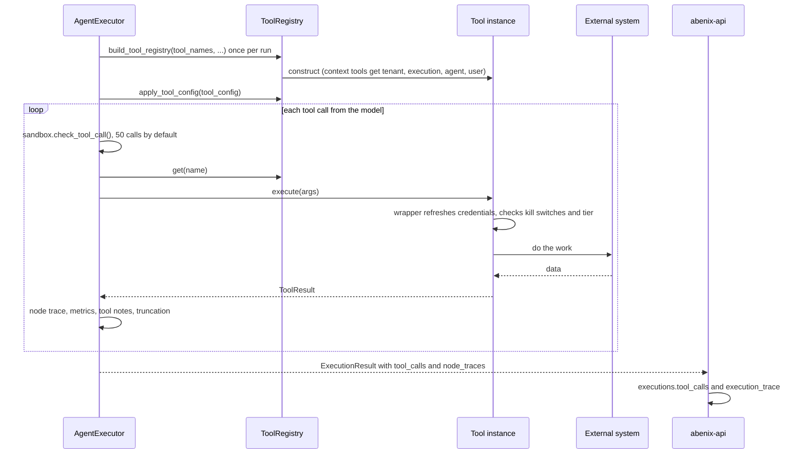

# Tools framework

> A **tool** is the unit of action an agent can take. Database lookup, web search, ML model inference, file write, REST call, rule evaluation. All tools. The runtime holds a registry of them and each agent declares which ones it may call.

---

## What a tool looks like

The `current_time` tool, trimmed:

```python
from datetime import datetime, timezone
from typing import Any
from zoneinfo import ZoneInfo

from engine.tools.base import BaseTool, ToolResult


class CurrentTimeTool(BaseTool):
    name = "current_time"
    risk_tier = "low"
    description = "Get the current date and time in UTC or a specified timezone."
    input_schema: dict[str, Any] = {
        "type": "object",
        "properties": {
            "timezone": {"type": "string", "default": "UTC"},
        },
        "required": [],
    }

    async def execute(self, arguments: dict[str, Any]) -> ToolResult:
        tz_name = arguments.get("timezone", "UTC").strip()
        try:
            tz = ZoneInfo(tz_name)
        except (KeyError, ValueError):
            return ToolResult(content=f"Unknown timezone: {tz_name}", is_error=True)
        now = datetime.now(timezone.utc).astimezone(tz)
        return ToolResult(content=now.isoformat(), metadata={"timezone": tz_name})
```

Every tool subclasses `BaseTool` in [`engine/tools/base.py`](../../apps/agent-runtime/engine/tools/base.py) and defines:

1. **`name`**, the slug. Agents list it in `model_config.tools`. Unique across the registry.
2. **`description`**, what the LLM reads when it decides whether to call the tool. Be precise.
3. **`input_schema`**, a JSON Schema for the arguments. It goes to the model as is. The runtime does not validate arguments against it, so `execute` checks what it needs.
4. **`async def execute(self, arguments) -> ToolResult`**, which does the work.

Two optional class attributes:

| Attribute | Default | Meaning |
|---|---|---|
| `config_fields` | `()` | The keys and settings the tool reads. See [Configuration and credentials](#configuration-and-credentials) |
| `risk_tier` | `"low"` | `low`, `medium`, `high` or `critical`. See [Risk tiers and kill switches](#risk-tiers-and-kill-switches) |

`to_dict()` returns `name`, `description`, `input_schema`, `config_fields` and `risk_tier`. That is what the catalogue API reads.

---

## ToolResult

```python
@dataclass
class ToolResult:
    content: str                                   # what the LLM sees
    is_error: bool = False                         # marks the call as failed
    metadata: dict[str, Any] = field(default_factory=dict)
```

Those are the only three fields.

- **`content`** is what the model reads next. The executor cuts it to 12,000 characters (`MAX_TOOL_RESULT_CHARS`) before it goes into the context, and keeps at most 8,000 characters on the execution row (`TOOL_RESULT_PERSIST_CHARS`).
- **`metadata`** is structured data for the trace. It is stored on the run's node trace and a compact projection goes on the tool call entry as `output_summary`. The model never sees it, except for three keys the executor appends to the content as `[tool notes]`: `warnings`, `sources_skipped` and `needs_configuration`.
- **`is_error=True`** sends the content back as an error tool result. Most agents recover and try another way.

---

## The registry

`ToolRegistry` in [`engine/tools/base.py`](../../apps/agent-runtime/engine/tools/base.py) is a plain dict of tool instances, built once per run:

```python
class ToolRegistry:
    def register(self, tool: BaseTool) -> None: ...
    def get(self, name: str) -> BaseTool | None: ...
    def list_all(self) -> list[dict[str, Any]]: ...
    def names(self) -> list[str]: ...
    def apply_tool_config(self, tool_config, asset_schemas=None) -> None: ...
```

Nothing registers itself at import time and `engine/tools/__init__.py` is empty. The map from slug to class lives in [`engine/agent_executor.py`](../../apps/agent-runtime/engine/agent_executor.py):

- `_ensure_tool_classes()` imports every tool once and fills two dicts. `_TOOL_CLASSES` holds tools built with no arguments. `_CONTEXT_TOOL_FACTORIES` holds tools that need run context (tenant, execution, agent, user), such as `memory_*`, `human_approval`, `ml_model`, `code_asset`, `sandboxed_job`, `meeting_*`, `invoke_agent`, the `atlas_*` tools and every `decision_*` and `source_*` tool.
- `list_tool_classes()` returns both key sets. `get_tool_class(slug)` looks in both. The direct execute API uses them.
- `build_tool_registry(tool_names, kb_ids, agent_id=, tenant_id=, execution_id=, agent_name=, db_url=, acting_subject=, model_config=, user_id=, user_role=, delegation_depth=)` builds the registry for one run. Context tools get their constructor arguments there. A name it does not know is looked up as a saved tool (`saved_tools`) and loaded into the sandbox as a `DynamicTool` only when the row is `approved`. Anything else is logged and skipped.

`build_tool_registry` also adds tools in these cases:

| Condition | Tools added |
|---|---|
| The agent has knowledge bases (`kb_ids`) | `knowledge_search`, `vector_search` and `knowledge_store`, scoped to those KBs |
| Any `atlas_*` tool requested | Each requested Atlas tool, limited to `model_config.atlas_graphs` when set, otherwise every graph in the tenant |
| An acting subject and a `portfolio_<domain>` name | A `SchemaPortfolioTool` for that domain and subject |
| An acting subject and `graph_explorer` | `graph_explorer` on the subject's KB namespace |

MCP tools are added by [`engine/tool_resolver.py`](../../apps/agent-runtime/engine/tool_resolver.py), which wraps each MCP server tool in `MCPToolWrapper` (risk tier `medium`). See [03-mcp](03-mcp.md).

The API catalogue (`GET /api/tools`) reads schemas and config fields straight off these classes. Tools built only inside `build_tool_registry` are reached through `LAZY_TOOL_MODULES` in [`apps/api/app/routers/tools.py`](../../apps/api/app/routers/tools.py): `knowledge_search`, `knowledge_store`, `graph_explorer`, four Atlas tools and `SchemaPortfolioTool`.

### Adding a tool

1. Write the class in `apps/agent-runtime/engine/tools/<name>.py`.
2. Import it in `_ensure_tool_classes()` and add it to `_TOOL_CLASSES`, or to `_CONTEXT_TOOL_FACTORIES` if it needs run context. A context tool also needs a constructor entry in `build_tool_registry`.
3. Add a catalogue entry (category, blurb) to `TOOL_CATALOG` in `apps/api/app/routers/tools.py`. Without one the tool still shows, bucketed by `_guess_category` from its slug prefix.
4. Declare `config_fields` for every value it reads.
5. Run `python scripts/check-tool-config.py`. It fails a tool class the registry and the lazy list cannot reach, unless the class carries `# tool-registry: exempt`.

The full walkthrough is [08-howto/01-add-a-tool](../08-howto/01-add-a-tool.md).

---

## Tool lifecycle in the agent loop



Tool instances live for one run, not one call. Two calls to the same tool in a run hit the same instance, which is how `max_calls` counts. Nothing is shared across runs.

Every subclass's `execute` is wrapped once by `BaseTool.__init_subclass__`. The wrapper:

1. refreshes the credential snapshot (`credentials.ensure_fresh()`),
2. on the outermost call only, refreshes governance and runs the kill switch and tier checks below,
3. sets the tenant context from the tool's own `tenant_id` when nothing else set it,
4. turns a `ToolNeedsConfiguration` raised by `cfg(..., required=True)` into the standard "not configured" result.

The executor sets no per-call timeout. Each tool sets its own on its outbound calls.

Agent runs keep their tool calls on `executions.tool_calls` and node traces on `executions.execution_trace`. The `tool_invocations` table holds direct calls only, `POST /api/tools/{slug}/execute`, which also pass through the runtime gate in [`apps/api/app/core/tool_gate.py`](../../apps/api/app/core/tool_gate.py) (cache, concurrency, rate limit, breaker, tuned at `/api/admin/tool-runtime`).

---

## Schema for the LLM

The executor hands the model `name`, `description` and `input_schema` for each tool. The provider adapters in [`engine/llm_router.py`](../../apps/agent-runtime/engine/llm_router.py) reshape the list:

| Function | Shape |
|---|---|
| `_anthropic_tools_schema` | `{name, description, input_schema}` |
| `_openai_tools_schema` | `{type: "function", function: {name, description, parameters}}` |
| `_google_tools_schema` | Gemini function declarations, with the JSON Schema converted to `google.genai` types |

---

## Configuration and credentials

A tool does not read `os.environ` for anything an admin might set. It declares the value on the class and reads it through the resolver:

```python
from engine.tools.base import BaseTool, ConfigField, ToolResult


class CompaniesHouseTool(BaseTool):
    name = "companies_house"
    config_fields = (
        ConfigField("COMPANIES_HOUSE_API_KEY", label="API key", kind="secret",
                    group="Companies House",
                    signup_url="https://developer.company-information.service.gov.uk/"),
    )

    async def execute(self, arguments):
        api_key = self.cfg("COMPANIES_HOUSE_API_KEY")
```

`ConfigField` is a frozen dataclass:

| Field | Meaning |
|---|---|
| `key` | The name, also the environment variable name. Storage is per key, so a key several tools share is entered once |
| `label` | The row label on the admin screen |
| `kind` | `secret`, `string`, `url`, `int`, `bool` or `select`. Drives the input and the validation on save |
| `required` | The tool cannot run without it. Say it only for single-provider tools |
| `group` | The provider name the admin screen groups by |
| `description`, `signup_url` | Shown on the row. `signup_url` also goes into the "not configured" message |
| `default` | Used when nothing else provides a value |
| `options` | The choices for `kind="select"` |
| `dynamic` | The key is read under a name built at run time, so the lint does not expect a literal `cfg("KEY")` |

`self.cfg(key, required=False, default=None)` reads a value. With `required=True` and nothing set it raises `ToolNeedsConfiguration` and the wrapper returns `KEY is not configured. An admin can add it under Admin -> Tool Configuration.` plus the signup link.

The resolver is [`engine/credentials.py`](../../apps/agent-runtime/engine/credentials.py). Order, highest first:

1. a test override,
2. a `tenant_tool_credentials` row for the tenant of the running agent, written from **Admin -> Tool Configuration** with the scope on "This tenant",
3. a `platform_settings` row `tool.credential.<KEY>`, written from the same screen with the scope on "Platform",
4. the process environment,
5. `packages/db/seeds/tool_defaults.yaml`,
6. the default the tool declared.

The tenant is a context variable the executor sets at run start and the queue consumer sets before it builds an executor. Reads are synchronous against an in-memory snapshot. `ensure_fresh()` reloads it at most every 30 seconds over asyncpg, single flight, serving the old snapshot while it runs, so `execute` never waits on the database. Stored values are AES-GCM under the cluster KEK when one is set.

LLM provider keys are declared once in [`engine/provider_credentials.py`](../../apps/agent-runtime/engine/provider_credentials.py) as `PROVIDER_CONFIG_FIELDS` (Anthropic, OpenAI, Google with its `GEMINI_API_KEY` alias, and Azure OpenAI with its base URL and API version). The router is not a tool, so `llm_call`, `llm_route` and `agent_step` declare those fields on its behalf. That puts the provider keys on the same admin screen, and the router rebuilds a provider client when its key changes.

What the declarations feed:

- the admin screen and its API, `/api/admin/tool-config` ([`routers/admin_tool_config.py`](../../apps/api/app/routers/admin_tool_config.py)),
- the `config` object per tool on `GET /api/tools`, behind the badges on `/tools` and in the builder palette,
- `/settings/integrations`, through `GET /api/integrations/tools`.

The lint [`scripts/check-tool-config.py`](../../scripts/check-tool-config.py) runs in CI, in `deploy.sh` and under pytest. It fails on an `os.environ` or `os.getenv` read under `engine/tools` outside its `INFRA_ENV` list of deployment plumbing (`DATABASE_URL`, `REDIS_URL`, `NATS_URL` and similar), on a `cfg()` key no tool declares, on a declared key nothing reads unless it is `dynamic`, and on a tool class the registry cannot reach.

An optional `config_test(values, key)` classmethod returns `(ok, message)` and gives the admin a Test button for the key. Degraded modes go in `metadata["warnings"]`, skipped sources in `metadata["sources_skipped"]`.

The admin and operator view is [08-howto/08-tool-configuration](../08-howto/08-tool-configuration.md).

---

## Risk tiers and kill switches

Every tool carries `risk_tier`. Most are `low`. Tools that write, send or run code the platform did not write sit higher: `database_writer`, `email_sender`, `github_tool`, `twilio_sms` and `zapier_pass_through` are `high`, and `http_client`, `code_executor`, `code_asset`, `sandboxed_job`, `decision_propose`, `source_check`, MCP tools and saved tools are among the `medium` ones. The catalogue below gives the tier of every tool that is not `low`.

The wrapper runs `_govern()` before the tool, on the outermost call:

1. **Kill switches.** `governance.check(tenant, "tool", name)`, then a check for every run in the current chain (agent, pipeline, nested runs). A tripped switch returns an error result with `metadata.stopped`, so a run already going stops at its next tool call.
2. **Tier.** When the tool's tier is above the run's tier, the tenant's policy for the tool's tier decides, through `tool_call_action`:

| Action | What happens |
|---|---|
| `allow` | The call goes ahead and the run's tier is raised to the tool's, with the reason `tool:<name>` |
| `approval` | A `human_approval` gate opens for the call. On approval the run is raised and the call goes ahead. Otherwise an error result |
| `block` | Error result with `metadata.risk_blocked`. The fix is to raise the agent's tier |

The defaults in [`engine/risk.py`](../../apps/agent-runtime/engine/risk.py) are `allow` for low and medium and `approval` for high and critical. Tenants change them on the governance screen. See [01-architecture/07-governance](../01-architecture/07-governance.md).

---

## Per-agent configuration overrides

An agent's `model_config.tool_config[tool_slug]` changes behaviour without code. `AgentExecutor` calls `ToolRegistry.apply_tool_config`, which wraps a tool in `_DefaultedTool` when any of the first four is set:

| Field | Effect |
|---|---|
| `parameter_defaults` | Pinned arguments. The keys are removed from the schema the model sees and the description gains `(pre-configured: ...)`. On a conflict the pinned value wins |
| `locked_defaults` | Default `true`. Set `false` to let the model's argument win over a default |
| `max_calls` | Cap on calls to this tool per run. The next call returns an error with `max_calls_reached` |
| `require_approval` | Each call goes through the agent's `human_approval` tool first. Without `human_approval` in the agent's tools the call fails with a message saying so |
| `usage_instructions` | Not part of the wrapper. `build_tool_config_prompt` in [`engine/tool_config_prompt.py`](../../apps/agent-runtime/engine/tool_config_prompt.py) appends it to the system prompt under "Tool Usage Guidelines", with a line for each limit above |

When `parameter_defaults` names a `code_asset_id` or a `model_id`, `resolve_asset_schemas` reads that asset's or model's `input_schema` and inlines it as the `input` property, so the model sees the exact shape.

Two agent-level fields sit beside `tool_config`:

| Field | Effect |
|---|---|
| `require_tools` | Tool slugs the run must call. A run that finishes without calling every one is failed with `REQUIRED_TOOLS_VIOLATION`, on the inline and the queued path alike. `require_knowledge_search: true` adds `knowledge_search` |
| `input_variables[].default` | Applied into the pipeline context under what the caller sends, so a seeded pipeline runs with no input and a typed value from the chat page replaces the default |

```yaml
model_config:
  tools:
    - eia_open_data
    - ml_model
  tool_config:
    ml_model:
      parameter_defaults:
        model_name: wingman-mispricing-fairvalue
        operation: predict
      usage_instructions: "Always call predict with the 15-feature vector documented above."
      max_calls: 2
```

See [00-agent-execution](00-agent-execution.md#tool-dispatch).

---

## Built-in tool catalogue

154 built-in tool slugs, one or a few classes per file in [`apps/agent-runtime/engine/tools/`](../../apps/agent-runtime/engine/tools/). Grouped by the category the catalogue API and the builder palette use (`TOOL_CATALOG`, or `_guess_category` for uncatalogued slugs). The tier column is blank for `low`. Keys are the `config_fields` each tool declares. Every key is optional unless the tool's description says otherwise.

### Core

| Tool | Does | Tier | Keys |
|---|---|---|---|
| `academic_search` | Search academic papers and research publications | | |
| `ais_stream` | Sample live vessel positions from AISStream.io | | `AISSTREAM_API_KEY` |
| `calculator` | Evaluate a math expression safely | | |
| `cloud_cost` | Current-month cloud spend by service from AWS, GCP and Azure | | `AWS_ACCESS_KEY_ID`, `AWS_SECRET_ACCESS_KEY`, `AWS_REGION`, `AZURE_SUBSCRIPTION_ID`, `GCP_BILLING_BQ_DATASET`, `GCP_BILLING_PROJECT` |
| `code_executor` | Run Python in-process with an import allow-list and a 30 s limit | medium | |
| `current_time` | Current date and time in any timezone | | |
| `date_calculator` | Date arithmetic, business days, contract terms | | |
| `epa_echo` | Look up a counterparty in EPA ECHO | | |
| `industry_segment_risk` | AML and KYC risk weight for an industry segment | | |
| `kyc_met_pdf_extractor` | Extract a MET-template KYC check PDF into strict JSON | | `ANTHROPIC_API_KEY`, `GOOGLE_API_KEY` |
| `moderation_vet` | Screen text for policy violations | | |
| `news_feed` | Recent news from several providers | | `MEDIASTACK_API_KEY`, `NEWS_API_KEY` |
| `open_meteo` | Weather and marine forecasts from Open-Meteo | | |
| `patents_trademarks` | Search granted US patents in PatentsView | | |
| `phmsa_lookup` | Find a US pipeline operator in PHMSA | | |
| `tavily_search` | Web search with an answer, over Tavily, Brave, SerpAPI or Serper | | `TAVILY_API_KEY`, `BRAVE_SEARCH_API_KEY`, `SERPAPI_API_KEY`, `SERPER_API_KEY` |
| `unit_converter` | Unit conversion across energy, power, length, volume and more | | |
| `weather` | Current weather and forecast for a location | | |
| `web_search` | Search the web | | |

### Data

| Tool | Does | Tier | Keys |
|---|---|---|---|
| `country_cpi_lookup` | Transparency International CPI rank and score for a country | | |
| `csv_analyzer` | Statistics, filters, grouping and pivots over CSV data | | |
| `database_query` | Read-only SQL against PostgreSQL | | |
| `database_writer` | INSERT or UPSERT into PostgreSQL tables | high | |
| `document_extractor` | Structured data from documents | | |
| `document_parser` | Plain text from PDF, DOCX, TXT, CSV, HTML and Markdown | | |
| `file_reader` | Read text from a file | | |
| `file_system` | List directories, read files, match globs | medium | |
| `fred_economic` | US macro time series from FRED | | `FRED_API_KEY` |
| `gov_data_us` | US government data, SEC EDGAR filings lookup | | |
| `json_transformer` | Query and reshape JSON | | |
| `knowledge_store` | Write content into the agent's knowledge base | medium | `OPENAI_API_KEY`, `PINECONE_API_KEY`, `PINECONE_INDEX_NAME` |
| `pii_redactor` | Find and redact PII in text | | |
| `presentation_analyzer` | Content, notes and layout from .pptx files | | |
| `regex_extractor` | Extract data with regular expressions | | |
| `schema_validator` | Validate, infer or coerce JSON against a schema | | |
| `semantic_diff` | Structured diff of two strings or JSON objects | | |
| `sentiment_analyzer` | Market sentiment from text or data | | |
| `spreadsheet_analyzer` | Sheets, ranges and formulas from Excel workbooks | | |
| `structured_extractor` | Extract fields from text against a JSON schema | | |
| `text_analyzer` | Keywords, readability, similarity, entities | | |
| `time_series_analyzer` | Moving averages, anomalies, forecasts, decomposition | | |
| `vector_search` | Vector search over the agent's knowledge base | | `PINECONE_API_KEY`, `PINECONE_INDEX_NAME`, `OPENAI_API_KEY` |
| `world_bank` | Country indicators from the World Bank | | |

### Knowledge, memory and enterprise

| Tool | Does | Tier | Keys |
|---|---|---|---|
| `atlas_as_of` | The Atlas graph as it stood at a past moment, from the newest snapshot at or before it | | |
| `atlas_describe` | Summary of an Atlas graph, counts per kind and the most connected concepts | | |
| `atlas_query` | Find Atlas nodes by label pattern and kind | | |
| `atlas_search_grounded` | KB documents linked to concepts near a term | | |
| `atlas_traverse` | One-hop neighbourhood of a node | | |
| `graph_builder` | Build a DAG from nodes and edges | | |
| `graph_explorer` | Entities and relationships in the Cognify graph (Neo4j) | | |
| `human_approval` | Pause the run until a person approves | | |
| `knowledge_search` | Hybrid vector and graph search over the agent's KBs | | |
| `memory_forget` | Delete a stored memory by key | medium | |
| `memory_recall` | Retrieve stored memories | | |
| `memory_store` | Store a memory for later runs | | |
| `sandboxed_job` | Run a command in an allow-listed image in a one-off container or Job | medium | |
| `scenario_planner` | What-if analysis with parameter sweeps | | |
| `structured_analyzer` | LLM extraction of structured data from any content | | |
| `weather_simulator` | Simulate weather scenarios and their operational impact | | |

### Decisions

These call the rules engine in-process. See [20-decision-service](20-decision-service.md).

| Tool | Does | Tier | Keys |
|---|---|---|---|
| `decision_list` | Published decisions with the facts each needs and their types | | |
| `decision_evaluate` | Evaluate facts against the version in force, with trace and missing facts | | |
| `decision_compare` | The same facts under several versions or dates | | |
| `decision_explain` | Why the result came out as it did, with citations per rule | | |
| `decision_test` | Run a decision's golden tests against a version | | |
| `decision_propose` | Propose rule changes for people to approve. Never publishes | medium | |

### Sources

Read watched sources and their changes. See [17-source-watch](17-source-watch.md).

| Tool | Does | Tier | Keys |
|---|---|---|---|
| `source_list` | Watched sources with when each last changed | | |
| `source_check` | Check a source now and wait up to 120 s for the result | medium | `SOURCE_AUTH_1` to `SOURCE_AUTH_5` (dynamic) |
| `source_diff` | What changed between two snapshots, with a materiality hint | | |
| `source_snapshot_get` | Retained text of a snapshot with citation details | | |

### Finance

| Tool | Does | Tier | Keys |
|---|---|---|---|
| `bundesanzeiger_filings` | Filings for a German counterparty | | |
| `bunker_fuel` | Bunker fuel price proxy and corridor freight estimate | | |
| `credit_risk` | Counterparty credit risk for listed companies | medium | `FMP_API_KEY` |
| `crypto_market` | Spot, change, market cap and OHLC from CoinGecko | | `COINGECKO_API_KEY` |
| `ecb_rates` | FX, inflation and rates from the ECB | | |
| `edgar_filings` | Five years of XBRL financials from SEC EDGAR | | |
| `eex_public_summary` | TTF data with a documented degraded mode | | |
| `eia_open_data` | US EIA energy time series | | `EIA_API_KEY` |
| `ember_climate` | Power-sector generation mix and carbon intensity from Ember | | `EMBER_API_KEY` |
| `entso_e` | European power market data from ENTSO-E | | `ENTSOE_API_KEY` |
| `ferc_elibrary` | FERC eLibrary filings for a counterparty | | |
| `financial_calculator` | NPV, IRR, DCF, LCOE, amortization, bond price and other finance calculations | | |
| `fitch_connect` | Issuer rating from Fitch Connect | | `FITCH_CONNECT_API_KEY`, `FITCH_CONNECT_API_URL` |
| `freight_baltic_blpg` | Baltic BLPG LPG freight indices | | `BALTIC_API_KEY`, `BALTIC_API_URL` |
| `freight_worldscale` | Worldscale freight for clean-products tankers | | |
| `market_data` | Stocks, commodities and energy prices | | `ALPHA_VANTAGE_API_KEY`, `EIA_API_KEY` |
| `monte_carlo_curve` | Forward curve by mean-reverting GBM with seasonality | | |
| `moodys_api` | Issuer rating and outlook from Moody's | | `MOODYS_API_KEY`, `MOODYS_API_URL` |
| `moodys_orbis_lookup` | Counterparty lookup in Moody's Orbis | | |
| `notional_volume_score` | KYC indicator II from contracted volume | | |
| `options_data` | ATM implied vol, risk reversal, put/call ratio | | |
| `port_constraints` | UN/LOCODE ports with berth compatibility checks | | |
| `realized_vol_calc` | Realized vol, momentum and drift from a price series | | |
| `refined_products_forwards` | Refined-products forward curves and cracks | | |
| `risk_analyzer` | Monte Carlo, sensitivity and scenario risk analysis | | |
| `schema_portfolio_tool` | Subject-scoped portfolio data, registered as `portfolio_<domain>` | | |
| `spg_ratings_api` | Issuer rating and outlook from S&P Global | | `SPG_RATINGS_API_KEY`, `SPG_RATINGS_API_URL` |
| `vessel_specs` | Vessel classes, product densities, volume and mass conversion | | |
| `yahoo_finance` | Yahoo Finance prices and history | | `FRED_API_KEY` |

### Integration

| Tool | Does | Tier | Keys |
|---|---|---|---|
| `api_connector` | Slack, Airtable, Notion, Jira and Google Sheets actions | medium | `SLACK_WEBHOOK_URL`, `AIRTABLE_API_KEY`, `GOOGLE_SHEETS_CREDENTIALS`, `NOTION_API_KEY`, `JIRA_URL`, `JIRA_EMAIL`, `JIRA_TOKEN` |
| `browser_automation` | Headless Chromium through Playwright | medium | |
| `cloud_storage` | S3, GCS, Azure Blob or local storage operations | medium | `AWS_ACCESS_KEY_ID`, `AWS_SECRET_ACCESS_KEY`, `AWS_REGION`, `AZURE_STORAGE_CONNECTION_STRING` |
| `connector_call` | Run an operation on one of the tenant's connectors | medium | |
| `data_exporter` | Export to file, email or S3 | medium | `SMTP_HOST`, `SMTP_PORT`, `SMTP_USER`, `SMTP_PASS`, `SMTP_FROM`, `AWS_ACCESS_KEY_ID`, `AWS_SECRET_ACCESS_KEY`, `AWS_REGION` |
| `email_sender` | Send email | high | `SMTP_HOST`, `SMTP_PORT`, `SMTP_USER`, `SMTP_PASS`, `SMTP_FROM` |
| `event_buffer` | Read buffered events from the platform event queue | | |
| `github_tool` | Read repos, code, issues, PRs and CI through the GitHub API | high | `GITHUB_TOKEN` |
| `http_client` | HTTP requests to external APIs | medium | |
| `integration_hub` | Actions on 20+ SaaS services | medium | `AIRTABLE_API_KEY`, `ASANA_TOKEN`, `AWS_ACCESS_KEY_ID`, `GMAIL_API_KEY`, `GOOGLE_SHEETS_KEY`, `HUBSPOT_API_KEY`, `INTERCOM_TOKEN`, `JIRA_EMAIL`, `JIRA_TOKEN`, `JIRA_URL`, `LINEAR_API_KEY`, `NOTION_API_KEY`, `PAGERDUTY_TOKEN`, `SALESFORCE_INSTANCE_URL`, `SALESFORCE_TOKEN`, `SENDGRID_API_KEY`, `SLACK_WEBHOOK_URL`, `SNOWFLAKE_ACCOUNT`, `STRIPE_SECRET_KEY`, `TEAMS_WEBHOOK_URL`, `TWILIO_AUTH_TOKEN`, `ZENDESK_TOKEN` |
| `kafka_consumer` | Consume from Kafka topics | | |
| `mqtt_publish` | Publish JSON to an MQTT topic on the platform broker | medium | |
| `redis_stream_consumer` | Consume from a Redis Stream | | |
| `redis_stream_publisher` | Publish to a Redis Stream | medium | |
| `subscribed_feed` | Latest cached sample of a live feed | | |
| `tsdb_query` | Query the time-series store for a metric | | |
| `twilio_sms` | SMS or WhatsApp through Twilio | high | `TWILIO_ACCOUNT_SID`, `TWILIO_AUTH_TOKEN`, `TWILIO_FROM_NUMBER`, `TWILIO_WHATSAPP_FROM` |
| `windowed_state` | Per-asset sliding-window state | | |
| `zapier_pass_through` | List or run Zapier AI Actions, or fire a catch hook | high | `ZAPIER_NLA_KEY` |

### KYC

| Tool | Does | Tier | Keys |
|---|---|---|---|
| `address_normalize` | Parse an address into fields and a canonical line | | |
| `adverse_media` | Negative-news screening | | `TAVILY_API_KEY` |
| `companies_house` | UK company lookup | | `COMPANIES_HOUSE_API_KEY` |
| `country_risk_index` | Public country-risk signals in one view | | |
| `geocoding` | Forward and reverse geocoding through Nominatim | | |
| `kyc_scorer` | Deterministic KYC risk score | medium | |
| `legal_existence_verifier` | Legal existence, standing and shell indicators | | `COMPANIES_HOUSE_API_KEY`, `OPENCORPORATES_API_KEY` |
| `pep_screening` | Screen a person against PEP lists | medium | `OPENSANCTIONS_API_KEY` |
| `regulatory_enforcement` | Enforcement and litigation lookup | | |
| `sanctions_screening` | Screen a name against the major sanctions lists | medium | |
| `ubo_discovery` | Walk the ownership tree to the beneficial owners | medium | `COMPANIES_HOUSE_API_KEY`, `OPENCORPORATES_API_KEY` |

### Meetings

| Tool | Does | Tier | Keys |
|---|---|---|---|
| `defer_to_human` | Route a question back to the represented user | | |
| `meeting_join` | Join a LiveKit, Teams or Zoom meeting | medium | `LIVEKIT_API_KEY`, `LIVEKIT_API_SECRET`, `LIVEKIT_URL`, `TEAMS_GRAPH_TENANT_ID`, `TEAMS_GRAPH_CLIENT_ID`, `TEAMS_GRAPH_CLIENT_SECRET`, `TEAMS_BOT_CERT_PATH`, `ZOOM_SDK_KEY`, `ZOOM_SDK_SECRET` |
| `meeting_leave` | Leave the meeting | | |
| `meeting_listen` | Transcribe a bounded window of meeting audio | | `OPENAI_API_KEY` |
| `meeting_post_chat` | Post to the meeting chat | medium | |
| `meeting_speak` | Speak text into the meeting | medium | `ELEVENLABS_API_KEY`, `OPENAI_API_KEY` |
| `persona_rag` | Retrieve from the executing user's own persona items, filtered on tenant, owner and scope | | `OPENAI_API_KEY` |
| `scope_gate` | Check a meeting question against the allowed topics | | |

### Multimodal

| Tool | Does | Tier | Keys |
|---|---|---|---|
| `image_analyzer` | Analyse images with vision models | | `ANTHROPIC_API_KEY`, `OPENAI_API_KEY` |
| `mermaid_diagram` | Mermaid source from structured input | | |
| `plotly_chart` | Plotly figure spec from data | | |
| `speech_to_text` | Transcribe audio with Whisper | | `OPENAI_API_KEY` |
| `text_to_speech` | Speech audio from text | | `OPENAI_API_KEY` |
| `translation` | Translate text | | `DEEPL_API_KEY`, `LIBRETRANSLATE_API_KEY`, `LIBRETRANSLATE_URL` |

### Pipeline

| Tool | Does | Tier | Keys |
|---|---|---|---|
| `agent_step` | Run a full agent as a pipeline step | | provider keys |
| `approval_gate` | Pause until one or more people sign off a payload | | |
| `data_merger` | Merge several inputs into one structure | | |
| `invoke_agent` | Call another agent by slug, as the user who started the run | | |
| `llm_call` | One LLM call inside a pipeline | | provider keys |
| `llm_route` | Let an LLM pick one of N named branches | | provider keys |
| `narrate` | Emit a short progress line to the live canvas | | |
| `recall_trajectory` | Past trajectories whose intent overlaps the query | | |
| `sub_pipeline` | Run a nested pipeline as one step | | |

### Code and ML

| Tool | Does | Tier | Keys |
|---|---|---|---|
| `code_asset` | Run an uploaded code asset on a warm runner or a one-off sandbox | medium | |
| `ml_model` | Inference on a registered sklearn, PyTorch, ONNX or XGBoost model | | |

"Provider keys" means `PROVIDER_CONFIG_FIELDS`: `ANTHROPIC_API_KEY`, `OPENAI_API_KEY`, `GOOGLE_API_KEY`, `GEMINI_API_KEY`, `AZURE_OPENAI_API_KEY`, `AZURE_OPENAI_API_BASE` and `AZURE_OPENAI_API_VERSION`.

---

## Atlas tool cookbook

The five Atlas tools live in [`atlas_tools.py`](../../apps/agent-runtime/engine/tools/atlas_tools.py): `atlas_query`, `atlas_traverse`, `atlas_search_grounded`, `atlas_describe` and `atlas_as_of`. Each is tenant-scoped and, when `model_config.atlas_graphs` is set, limited to those graphs. Where `graph_id` is optional it defaults to the agent's primary atlas.

### `atlas_describe`, a map of the graph

```jsonc
{ "graph_id": "9c1e…", "top_n": 10 }
```

Totals of nodes and edges per kind, the top edge labels and the most connected concepts. The first call when the user asks "what do you know about X".

### `atlas_query`, nodes by pattern

```jsonc
{ "patterns": [ { "label_like": "counterparty", "kind": "concept" } ],
  "graph_id": "...",
  "limit": 25 }
```

`label_like` is a case-insensitive substring. `kind` is one of `concept`, `instance`, `document`, `property`. `limit` up to 200.

### `atlas_traverse`, one hop out

```jsonc
{ "label": "ACME Corp", "graph_id": "...", "max_edges": 50 }
```

Pass `label` (exact, case-insensitive) or `node_id`. Returns incoming and outgoing edges and the nodes on the other end, up to 200 edges.

### `atlas_search_grounded`, documents bound to a concept

```jsonc
{ "near_label": "Counterparty", "graph_id": "...", "max_docs": 10 }
```

Finds KB documents linked as document-kind nodes to concepts near the label. Use it over `knowledge_search` when the answer must be bound to a typed concept rather than lexically similar.

### `atlas_as_of`, the graph at a point in time

```jsonc
{ "graph_id": "...",
  "as_of": "2025-01-15T00:00:00Z",
  "label_like": "obligation",
  "kind": "concept",
  "limit": 50 }
```

Shows the graph as it stood at `as_of` (ISO-8601, UTC without an offset, default now). When nothing changed since then it reads the live graph, keeping only nodes and edges created by then and inside their `valid_from` and `valid_to`. Otherwise it reads the newest snapshot in `atlas_snapshots` saved at or before `as_of`. `label_like` keeps nodes whose label contains the text, plus their edges. `kind` is one of `concept`, `instance`, `document`, `property`. `limit` caps nodes and edges, default 100, up to 1,000. With no snapshot that old, or a time before the graph existed, it returns `found: false` and the reason. `source` says `live` or `snapshot`.

See [01-architecture/06-atlas-knowledge-engine](../01-architecture/06-atlas-knowledge-engine.md) for the data model and [15-v2-knowledge-enterprise](15-v2-knowledge-enterprise.md) for the v2.0 capabilities.

---

## Tool authoring patterns

### 1. Validate input

The runtime passes the model's arguments through unchecked.

```python
async def execute(self, arguments):
    op = arguments.get("operation")
    if op not in ("read", "write", "delete"):
        return ToolResult(content=f"Unknown operation '{op}'", is_error=True)
```

### 2. Tenant-filter every DB query

```python
async def execute(self, arguments):
    conn = await asyncpg.connect(self.db_url)
    try:
        rows = await conn.fetch(
            "SELECT * FROM widgets WHERE tenant_id = $1 AND id = $2",
            self.tenant_id, arguments["widget_id"],
        )
    finally:
        await conn.close()
```

### 3. Set timeouts on external calls

```python
async with httpx.AsyncClient(timeout=10.0) as client:
    r = await client.get(url)
```

The executor does not time a tool out, so a call without a timeout can hold the run.

### 4. Put structured data in metadata

```python
return ToolResult(
    content=f"Found {len(rows)} records",
    metadata={"record_count": len(rows), "table": "widgets"},
)
```

It shows on the execution detail page and costs nothing in the model's context.

### 5. Use the logger, not `print()`

```python
import logging
logger = logging.getLogger(__name__)
logger.info("processing %s widgets for tenant %s", count, self.tenant_id)
```

### 6. Design writes to be idempotent

The model may call the same tool twice in different iterations.

```python
await conn.execute("""
    INSERT INTO orders ...
    ON CONFLICT (idempotency_key) DO NOTHING
""")
```

### 7. Never read `os.environ` for configuration

Declare the value in `config_fields` and read it with `self.cfg()`. The lint fails the build otherwise, and an admin has no way to set a value the tool reads privately.

### 8. Set `risk_tier` honestly

A tool that writes, sends or spends is at least `medium`. The tier decides whether a low-tier run can call it without an approval.

---

## Code-running tools

Three tools run code. They isolate it differently.

| Tool | Where the code runs | Limits |
|---|---|---|
| `code_executor` | In the runtime process, in a thread. Imports are checked against an allow-list (`ALLOWED_MODULES`) and `subprocess`, `os.system` and similar are blocked | 30 s (`MAX_EXECUTION_TIME`), output up to 100,000 characters |
| `sandboxed_job` | A one-off container. A Kubernetes Job when the pod has a service account, `docker run` otherwise. The image must be in `SANDBOXED_JOB_ALLOWED_IMAGES` and the tool must be enabled (`SANDBOXED_JOB_ENABLED`, or the tenant's sandbox settings) | `timeout_seconds` 5 to 1800 (default 60), `memory_mb` 64 to 8192 (default 512), `cpu_limit` 0.1 to 4 (default 1). No network unless the host allows it and the call asks for it |
| `code_asset` | A warm code runner over NATS when runners are configured, otherwise a one-off `sandboxed_job`. `CODE_RUNNER_MODE` picks `auto`, `warm` or `job` | Those of the path taken |

Details are in [11-sandboxed-code-execution](11-sandboxed-code-execution.md) and [16-warm-code-runners](16-warm-code-runners.md).

---

## See also

- [08-howto/01-add-a-tool](../08-howto/01-add-a-tool.md), step-by-step walkthrough
- [08-howto/08-tool-configuration](../08-howto/08-tool-configuration.md), credentials, the admin screen, the lint
- [03-mcp](03-mcp.md), MCP servers as a tool source
- [00-agent-execution](00-agent-execution.md), where tools fit in the loop
- [20-decision-service](20-decision-service.md), what the `decision_*` tools call
