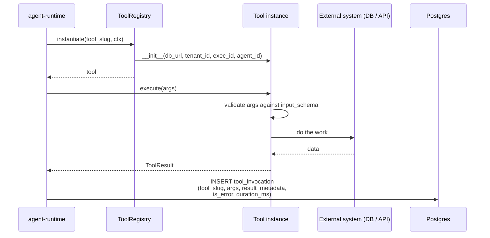

# Tools framework

> A **tool** is the unit of action an agent can take. Database lookup, web search, ML model inference, file write, REST call — all tools. The runtime exposes a registry of them. agents declare which ones they can call.

---

## What a tool looks like

Minimal example — a tool that returns the current time:

```python
from datetime import datetime, timezone
from typing import Any
from engine.tools.base import BaseTool, ToolResult


class CurrentTimeTool(BaseTool):
    name = "current_time"
    description = "Returns the current UTC date and time. Use this to anchor any reasoning that depends on 'today'."
    input_schema: dict[str, Any] = {
        "type": "object",
        "properties": {
            "format": {
                "type": "string",
                "enum": ["iso", "date_only", "epoch"],
                "default": "iso",
            },
        },
    }

    async def execute(self, arguments: dict[str, Any]) -> ToolResult:
        fmt = arguments.get("format", "iso")
        now = datetime.now(timezone.utc)
        if fmt == "iso":
            content = now.isoformat()
        elif fmt == "date_only":
            content = now.date().isoformat()
        else:
            content = str(int(now.timestamp()))
        return ToolResult(content=content, metadata={"format": fmt})


__all__ = ["CurrentTimeTool"]
```

Three things every tool defines:
1. **`name`** — the slug. Agents reference this in their `tools` list. Must be unique across the registry.
2. **`description`** — what the LLM sees when deciding whether to call it. Make this *precise* — a vague description leads to misuse.
3. **`input_schema`** — JSONSchema describing arguments. The LLM uses this to construct the call. The runtime validates against it before dispatch.

And one method:
- **`async def execute(arguments)`** — does the work. returns a `ToolResult`.

---

## ToolResult

```python
@dataclass
class ToolResult:
    content: str                              # what the LLM sees (text)
    metadata: dict | None = None              # structured data for the trace + UI
    is_error: bool = False                    # marks the call as failed
    cost_usd: float = 0.0                     # external-API cost if any
    output_files: list[str] | None = None     # S3 keys if the tool produced artifacts
```

- **`content`** is what the LLM consumes in the next iteration. Keep it under ~4KB. truncate aggressively.
- **`metadata`** is JSONB — appears on the trace page and is queryable via `tool_invocations.metadata`. Stash structured numbers, identifiers, debug info here.
- **`is_error=True`** — the agent sees the content as a tool-result message marked error. Many agents handle this gracefully ("the tool failed, let me try a different approach"). a few abort.
- **`cost_usd`** — for tools that hit paid APIs (tavily, openai-embeddings, etc.).

---

## The registry

Tools self-register at import time. The registry is a singleton in [`apps/agent-runtime/engine/tools/__init__.py`](../../apps/agent-runtime/engine/tools/__init__.py):

```python
class ToolRegistry:
    _classes: dict[str, type[BaseTool]] = {}

    @classmethod
    def register(cls, tool_class: type[BaseTool]) -> None:
        if tool_class.name in cls._classes:
            raise ValueError(f"Tool '{tool_class.name}' already registered")
        cls._classes[tool_class.name] = tool_class

    @classmethod
    def instantiate(cls, name: str, ctx: ExecutionContext) -> BaseTool:
        klass = cls._classes.get(name)
        if not klass:
            raise KeyError(f"Tool '{name}' not registered")
        return klass(
            db_url=ctx.db_url,
            tenant_id=str(ctx.tenant_id),
            execution_id=str(ctx.execution_id),
            agent_id=str(ctx.agent_id),
        )
```

Tools are imported eagerly from [`apps/agent-runtime/engine/tools/__init__.py`](../../apps/agent-runtime/engine/tools/__init__.py) at runtime startup. Adding a new tool means adding an import + a `ToolRegistry.register(YourTool)` line in that file.

---

## Tool lifecycle in the agent loop



Note that the tool is instantiated **per call**. There's no shared state between two calls to the same tool in the same execution. If you need state, put it on the execution context.

---

## Schema for the LLM

Different LLM providers want the tool description in slightly different shapes. The base class produces a provider-neutral form. the provider shim converts to that provider's API shape.

```python
# Provider-neutral, on BaseTool
def schema_for_llm(self, ctx: ExecutionContext) -> dict:
    return {
        "name": self.name,
        "description": self.description,
        "input_schema": self.input_schema,
    }
```

```python
# Anthropic shim
def to_anthropic_tool(tool: BaseTool, ctx: ExecutionContext) -> dict:
    base = tool.schema_for_llm(ctx)
    return {
        "name": base["name"],
        "description": base["description"],
        "input_schema": base["input_schema"],
    }

# OpenAI shim
def to_openai_tool(tool: BaseTool, ctx: ExecutionContext) -> dict:
    base = tool.schema_for_llm(ctx)
    return {
        "type": "function",
        "function": {
            "name": base["name"],
            "description": base["description"],
            "parameters": base["input_schema"],
        },
    }
```

The shims live in [`apps/agent-runtime/engine/llm_router.py`](../../apps/agent-runtime/engine/llm_router.py).

---

## Per-agent configuration overrides

An agent's `model_config.tool_config[tool_slug]` can override behaviour without changing the tool's code:

| Field | Effect |
|---|---|
| `usage_instructions` | Extra text appended to the tool's description, agent-specific. e.g. "Always pass `corridor_id` from the input." |
| `parameter_defaults` | Default args merged with whatever the LLM provided. The LLM's args win on conflict. |
| `max_calls` | Cap on how many times this agent can invoke this tool per execution. |
| `require_approval` | When true, each call pauses on the approval gate. |

```yaml
# Example: in an agent's yaml
model_config:
  tools:
    - eia_open_data
    - ml_model
  tool_config:
    ml_model:
      parameter_defaults:
        model_name: wingman-mispricing-fairvalue
        operation: predict
      usage_instructions: "Always call predict with the 15-feature vector documented above."
      max_calls: 2
```

The runtime applies these per dispatch (see [00-agent-execution](00-agent-execution.md#tool-dispatch)).

---

## Built-in tool catalogue

There are ~100 built-in tools. They live in [`apps/agent-runtime/engine/tools/`](../../apps/agent-runtime/engine/tools/), one file per tool. By category:

| Category | Examples |
|---|---|
| Code & data | `code_executor`, `code_asset`, `file_reader`, `csv_parser`, `pdf_extractor` |
| Web | `tavily_search`, `brave_search`, `web_fetch`, `web_screenshot` |
| AI & analysis | `ml_model`, `llm_route`, `summarize`, `extract_entities`, `embedding_similarity` |
| Knowledge | `kb_search`, `kb_grant_check`, `atlas_describe`, `atlas_query`, `atlas_traverse`, `atlas_search_grounded`, `atlas_cypher`, `atlas_as_of` |
| Integrations | `slack_post`, `gmail_send`, `gcal_create_event`, `github_pr`, `notion_page` |
| Data sources | `eia_open_data`, `yahoo_finance`, `open_meteo`, `ais_stream`, `bunker_fuel`, `freight_baltic_blpg`, `freight_worldscale`, `vessel_specs`, `options_data`, `current_time` |
| Privacy & safety | `redact_pii`, `moderate_text`, `content_safety_check` |
| Financial | `financial_calculator`, `currency_convert`, `option_pricer` |
| Multi-modal | `image_caption`, `image_ocr` |

Many of these have well-defined integration points — see [09-reference/00-rest-api](../09-reference/00-rest-api.md#tool-management).

---

## Atlas tool cookbook

The six Atlas tools live in [`atlas_tools.py`](../../apps/agent-runtime/engine/tools/atlas_tools.py) (four pre-v2) and [`atlas_cypher.py`](../../apps/agent-runtime/engine/tools/atlas_cypher.py) (two added in v2.0). All six are visible in the **canvas tool palette** under the *Knowledge* category and can be picked into any agent or pipeline.

### `atlas_describe` — read a node + its 1-hop neighbourhood

```jsonc
// input
{ "graph_id": "9c1e…", "node_id": "counterparty-acme-corp" }
// output
{
  "node": { "type": "Counterparty", "name": "ACME Corp", "properties": {...} },
  "neighbours": [
    { "edge_type": "PARTY_TO", "node": { "type": "Contract", "id": "..." } },
    ...
  ],
  "citations": [ { "document_id": "...", "page": 4, "chunk_id": "..." } ]
}
```

### `atlas_query` — parameterised typed query

The agent picks an **operation** (`by_property`, `by_relationship`, `aggregate`) — never writes Cypher. Useful when the agent prompt should stay free of database syntax.

```jsonc
{ "graph_id": "...",
  "operation": "by_property",
  "node_type": "Contract",
  "where": { "notional": { ">": 50_000_000 } },
  "limit": 25 }
```

### `atlas_traverse` — N-hop walks

```jsonc
{ "graph_id": "...",
  "start_node_id": "raw-material-XYZ",
  "edge_types": ["TRANSFORMED_INTO", "ASSEMBLED_INTO"],
  "max_hops": 4 }
```

Returns the visited path as an ordered list. The agent can render it as a supply-chain diagram or replay it for a follow-up question.

### `atlas_search_grounded` — hybrid keyword + embedding over node properties

```jsonc
{ "graph_id": "...", "query": "late delivery clause", "node_types": ["Clause"], "limit": 10 }
```

Unlike `kb_search` this never returns free-text paragraphs — only node IDs + the property that matched. The agent then calls `atlas_describe` on the winners.

### `atlas_cypher` — read-only Cypher for power agents *(v2.0)*

```jsonc
{ "graph_id": "...",
  "cypher": "MATCH (a:Counterparty)-[r:PARTY_TO]->(c:Contract) WHERE c.notional > 50000000 AND a.kyc_status = 'unconfirmed' RETURN a.name, c.id",
  "limit": 100 }
```

Server-side validator rejects any token in the write set (`CREATE`, `MERGE`, `DELETE`, `DETACH DELETE`, `SET`, `REMOVE`, `DROP`, `LOAD CSV`, `CALL apoc.*`, `CALL dbms.*`, `CALL db.*`, `FOREACH`, `;`). Length ≤ 8 KB, execution ≤ 10 s, rows ≤ 1000. `$abenix_tenant_id` and `$abenix_graph_id` are auto-injected so a hand-crafted query cannot escape the caller's scope.

### `atlas_as_of` — bi-temporal snapshot *(v2.0)*

```jsonc
{ "graph_id": "...",
  "as_of": "2025-01-15T00:00:00Z",
  "match_clause": "(c:Contract)-[r:HAS_OBLIGATION]->(o)" }
```

Rewrites the WHERE clause to `r.valid_from <= ts AND (r.valid_to IS NULL OR r.valid_to > ts)`. Returns the graph state as it was on that date — answers questions like "what obligations did we recognise on 2025-01-15?" in one hop. Backed by the bi-temporal columns added in the v2.0 migration: `valid_from`, `valid_to`, `recorded_at`, `source_anchors`.

See [`01-architecture/06-atlas-knowledge-engine.md`](../01-architecture/06-atlas-knowledge-engine.md) for the data model behind these tools, and [`02-runtime/15-v2-knowledge-enterprise.md`](15-v2-knowledge-enterprise.md) for the v2.0 capabilities reference.

---

## Tool authoring patterns

### 1. Always validate input
```python
async def execute(self, arguments):
    op = arguments.get("operation")
    if op not in ("read", "write", "delete"):
        return ToolResult(content=f"Unknown operation '{op}'", is_error=True)
```

### 2. Tenant-filter every DB query
```python
async def execute(self, arguments):
    async with asyncpg.connect(self.db_url) as conn:
        rows = await conn.fetch(
            "SELECT * FROM widgets WHERE tenant_id = $1 AND id = $2",
            self.tenant_id, arguments["widget_id"],
        )
```

### 3. Set sensible timeouts on external calls
```python
async with httpx.AsyncClient(timeout=10.0) as client:
    r = await client.get(url)
```
60s is the runtime-level timeout — your tool's internal timeout should be much shorter.

### 4. Emit metadata for the trace
```python
return ToolResult(
    content=f"Found {len(rows)} records",
    metadata={"record_count": len(rows), "table": "widgets"},
)
```
Anything in `metadata` shows on the execution detail page. Spend effort on this — it's the single biggest debugging multiplier.

### 5. Don't `print()` — use the standard logger
```python
import logging
logger = logging.getLogger(__name__)
logger.info("processing %s widgets for tenant %s", count, self.tenant_id)
```
Log lines flow into Loki and are tagged with the OTel trace_id automatically.

### 6. Idempotency
If your tool is mutating, design for at-least-once invocation. The runtime *will* retry on certain network failures, and the agent itself may call the same tool twice in different iterations.

```python
# Bad
await conn.execute("INSERT INTO orders ...")

# Good
await conn.execute("""
    INSERT INTO orders ... 
    ON CONFLICT (idempotency_key) DO NOTHING
""")
```

---

## Sandboxed tools

`code_executor` and `code_asset` run user-supplied code. They use a strict isolation model:

| Aspect | Constraint |
|---|---|
| Network | Disabled unless `network=true` is in the asset's commands |
| Filesystem | Ephemeral overlay. nothing host-mounted. `/tmp/exec` writable |
| Memory | OOM-killed at `memory_mb` (default 512) |
| CPU | Throttled to `cpu_cores` (default 1) |
| Time | `timeout_seconds` (default 30. max 300) |
| Stdout/Stderr | Captured up to 1MB each |
| Egress | `tcpdump`-style audit log (off by default) |

The runtime container that hosts the sandbox is `docker/Dockerfile.code-sandbox`. it uses `gVisor` (`runsc`) on AKS for kernel-level isolation. On local dev (k3d / minikube) we fall back to plain Docker — fine for development, not for prod.

---

## See also

- [08-howto/01-add-a-tool](../08-howto/01-add-a-tool.md) — step-by-step walkthrough
- [02-runtime/03-mcp](03-mcp.md) — MCP servers as a tool source
- [02-runtime/00-agent-execution](00-agent-execution.md) — where tools fit in the loop
