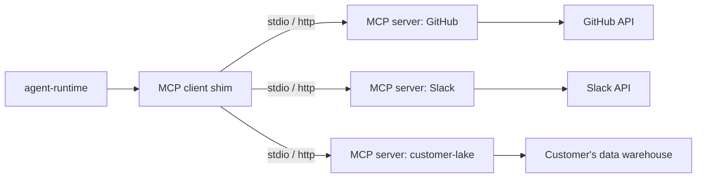

# MCP (Model Context Protocol) integration

> Speak the MCP spec to make any third-party MCP server look like a native tool to an Abenix agent. Used to pull in Slack, GitHub, Notion, internal data lakes, and customer-specific servers without writing per-server tool code.

---

## What MCP gives you

MCP is the Anthropic-led open spec for how LLMs talk to external "servers." Each MCP server exposes a list of tools + resources over a simple JSON-RPC protocol (stdio or HTTP). The Abenix runtime is an MCP **client** — it can discover an MCP server's tools dynamically and call them through the same dispatch path as native tools.



From the agent's perspective, an MCP-exposed tool is indistinguishable from a native tool — same schema-for-LLM, same dispatch, same `tool_invocations` row.

---

## How an agent declares MCP servers

`model_config.mcp_extensions` is the field. Shape:

```yaml
mcp_extensions:
  github:
    transport: http
    endpoint: https://mcp.github.example/v1
    auth:
      type: bearer
      token_env: GITHUB_MCP_TOKEN
  slack:
    transport: stdio
    command: ["npx", "@modelcontextprotocol/server-slack"]
    env:
      SLACK_BOT_TOKEN: "${SLACK_BOT_TOKEN}"
  internal-lake:
    transport: http
    endpoint: http://customer-mcp.internal:8080
    auth:
      type: api_key
      header: X-Customer-Key
      token_env: CUSTOMER_MCP_KEY
    allowlist:
      - query_sales
      - get_inventory
```

Two transports supported:
- **stdio** — spawn a child process. talk to it via stdin/stdout. Standard for `@modelcontextprotocol/server-*` packages.
- **http** — call a remote HTTP endpoint that speaks MCP-over-HTTP.

`allowlist` is optional. When set, only the listed tools from that server are exposed. everything else is hidden.

---

## Discovery + dispatch

On agent startup the runtime:
1. For each entry in `mcp_extensions`, opens a connection (spawn or http handshake).
2. Calls `tools/list` on the server.
3. For each returned tool, registers it under the slug `<server_name>.<tool_name>` (e.g. `github.create_issue`).
4. Adds the slug to the agent's effective tool list for this run.

When the LLM emits a tool_call with one of those slugs, the runtime dispatches via the MCP client instead of the registry:

```python
if slug.startswith(f"{mcp_server}."):
    response = await mcp_client.call_tool(
        server=mcp_server,
        tool=slug[len(mcp_server) + 1:],
        arguments=args,
    )
    return ToolResult(content=response.content, metadata={"mcp_server": mcp_server})
```

The result is logged to `tool_invocations` with `metadata.mcp_server` so traces show which server handled the call.

---

## Lifetime + caching

- For **stdio** servers, the child process is spawned at execution start and killed at execution end. One process per execution. no cross-execution reuse (security).
- For **http** servers, the connection is pooled per pod. Tool listings are cached for 5 minutes (env: `MCP_TOOL_LIST_TTL_SECONDS`).

---

## Built-in MCP server fixtures

For testing in CI and demos, the platform ships a small in-cluster MCP fixture:

| Server | Source | Tools exposed |
|---|---|---|
| `mcp-fixture` | [`apps/api/app/routers/mcp.py`](../../apps/api/app/routers/mcp.py) (test-only) | `echo`, `multiply`, `slow_query` |

Useful for testing the dispatch path without depending on a real external service. The canonical UAT suite uses it. see [08-howto/05-testing](../08-howto/05-testing.md).

---

## Security model

- MCP servers run with the **same network access** as the agent-runtime pod. They are not sandboxed.
- An MCP server can read/write whatever its credentials allow. Treat MCP server config as sensitive.
- Use `allowlist` to limit blast radius — even if the server exposes a `delete_everything` tool, the agent can't call it if it's not in the allowlist.
- The runtime never sends tenant data unless the agent explicitly does. The MCP shim itself does not exfiltrate state.

---

## Production tips

- **Pin server versions**. `npx @modelcontextprotocol/server-slack@latest` is convenient but brittle — pin to a tag.
- **Set timeouts**. Each MCP call gets the global `tool_timeout` (default 60s). If a third-party server hangs, the agent loop hangs too.
- **Monitor `tool_invocations.metadata.mcp_server`**. Add a Grafana panel — sudden latency or error-rate change usually points to the upstream service.

---

## See also

- [02-tools](02-tools.md) — native tool framework (MCP is a parallel mechanism)
- [Anthropic MCP spec](https://modelcontextprotocol.io) (external)

---

## Source map

| What | Where |
|---|---|
| **MCP REST router** | [`apps/api/app/routers/mcp.py`](../../apps/api/app/routers/mcp.py) — `/connections`, `/registry`, `/registry/install`, `/oauth2/start` |
| **MCP connection model** | [`packages/db/models/mcp_connection.py`](../../packages/db/models/mcp_connection.py) — `UserMCPConnection`, `AgentMCPTool`, `MCPRegistryCache` |
| **MCP client / runtime invocation** | [`apps/agent-runtime/engine/tools/mcp/`](../../apps/agent-runtime/engine/tools/) — the per-connection MCP client |
| **Settings UI** | [`/settings/integrations` page](../../apps/web/src/app/(app)/settings/integrations/page.tsx) — surfaces MCP servers under "Identity provider" and "Runtime tools" sections |
| **End-user docs** | [`docs/sso.md`](../sso.md) for the SSO providers, [`docs/06-deployment/05-edge-runtime.md`](../06-deployment/05-edge-runtime.md) for edge MCP fixtures |
