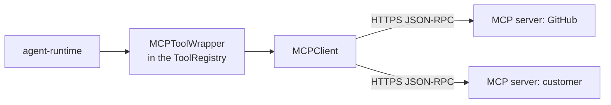

# MCP (Model Context Protocol) integration

> Attach tools from a remote MCP server to an agent, so the agent calls them like built-in tools without per-server tool code.

---

## What it is

MCP is an open spec for how a model talks to external servers. Each server lists tools over JSON-RPC. The Abenix runtime is an MCP **client** over Streamable HTTP (JSON-RPC 2.0, protocol version `2025-11-25`). stdio servers are not supported, and the platform never starts a server process itself.

An attached MCP tool sits in the same `ToolRegistry` as built-in tools, has the same schema for the model, and is recorded on `executions.tool_calls` like any other call.

---

## Connecting a server and attaching tools

1. **Register the server.** On `/mcp` (sidebar **MCP Servers**), or `POST /api/mcp/connections` with `server_name`, `server_url`, `auth_type` (`none`, `api_key` or `oauth2`) and `auth_config`. The credential is always sent as `Authorization: Bearer`. OAuth servers go through `POST /api/mcp/oauth2/start` and `/oauth2/callback`.
2. **Discover its tools.** `POST /api/mcp/connections/{id}/discover` lists what the server offers.
3. **Attach tools to an agent.** `POST /api/mcp/agents/{agent_id}/tools` with `mcp_connection_id`, `tool_name`, and optional `tool_config`, `approval_required` and `max_calls_per_execution`. Only attached tools reach the agent. Every other tool the server offers stays hidden.

`GET /api/mcp/registry` lists known servers to start from, `POST /api/mcp/registry/install` adds one as a connection, and `POST /api/mcp/registry/sync` seeds the curated list.

`model_config.mcp_extensions` is a builder setting (`allow_user_mcp`, `max_mcp_servers`, `suggested_mcp_servers`, `allowed_tool_annotations`). The runtime does not read it.

---

## Discovery and dispatch at run time

For each run, `resolve_tools` in [`engine/tool_resolver.py`](../../apps/agent-runtime/engine/tool_resolver.py):

1. Loads the agent's `agent_mcp_tools` rows and the tenant's enabled `user_mcp_connections` they point at.
2. Opens one `MCPClient` per server, runs `initialize` and `tools/list`.
3. Registers each attached tool as an `MCPToolWrapper` (risk tier `medium`) under its own name, or `<server>__<tool>` when that name is already taken.
4. Skips unreachable servers and tools the server no longer offers, and tells the model about them as warnings in the system prompt.

The executor then dispatches an MCP tool like any built-in tool. The wrapper applies `max_calls_per_execution` and approval, then calls through `MCPSecurityContext`. Clients are closed when the run ends. Nothing is cached across runs.

---

## Limits and safety

| Control | Where |
|---|---|
| Server URL check at registration | http(s) only. Private, loopback, link-local, multicast and cluster-internal hosts are refused. When `MCP_ALLOWED_HOSTS` is set, only those hosts are allowed (Helm `mcpAllowedHosts`) |
| Only attached tools | `agent_mcp_tools` rows decide what an agent sees |
| Approval | A tool annotated `destructiveHint`, or attached with `approval_required`, opens a `human_approval` gate before each call. Without `human_approval` in the agent's tools the call returns an error |
| Timeout | 30 seconds per call (`TOOL_CALL_TIMEOUT_SECONDS`), so a hung server returns a timeout error |
| Call cap | 10 MCP calls per run (`MAX_TOOL_CALLS_PER_EXECUTION`), plus any `max_calls_per_execution` on the tool |

MCP servers run outside the platform and can do whatever their credentials allow. Treat connection credentials as sensitive and attach only the tools an agent needs.

---

## Test fixtures

The UAT suite deploys two small servers from [`e2e/fixtures/mcp_server/`](../../e2e/fixtures/mcp_server/) through `scripts/uat.sh`:

| Server | Source | Tools |
|---|---|---|
| `uat-mcp` | `server.py` | `uat_echo` |
| `custom-mcp` | `custom_server.py` | `inventory_lookup`, `shipping_quote`, `order_status` |

Both hosts must be in `MCP_ALLOWED_HOSTS`. See [08-howto/05-testing](../08-howto/05-testing.md).

---

## See also

- [02-tools](02-tools.md) for the built-in tool framework
- [05-approvals-hitl](05-approvals-hitl.md) for the approval gate MCP tools use
- [MCP spec](https://modelcontextprotocol.io) (external)

---

## Source map

| What | Where |
|---|---|
| **MCP REST router** | [`apps/api/app/routers/mcp.py`](../../apps/api/app/routers/mcp.py) — `/api/mcp/connections`, `/api/mcp/agents/{agent_id}/tools`, `/api/mcp/registry`, `/api/mcp/oauth2/start` |
| **Models** | [`packages/db/models/mcp_connection.py`](../../packages/db/models/mcp_connection.py) — `UserMCPConnection`, `AgentMCPTool`, `MCPRegistryCache` |
| **Client** | [`apps/agent-runtime/engine/mcp_client.py`](../../apps/agent-runtime/engine/mcp_client.py) |
| **Call limits, timeout, destructive-tool approval** | [`apps/agent-runtime/engine/mcp_security.py`](../../apps/agent-runtime/engine/mcp_security.py) |
| **Tool resolution** | [`apps/agent-runtime/engine/tool_resolver.py`](../../apps/agent-runtime/engine/tool_resolver.py) — `resolve_tools`, `MCPToolWrapper`, `load_agent_mcp_connections` |
| **UI** | [`apps/web/src/app/(app)/mcp/page.tsx`](../../apps/web/src/app/(app)/mcp/page.tsx), linked from `/settings/integrations` |
