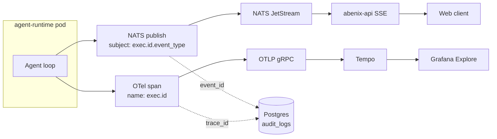

# Streaming events + distributed tracing

> Every execution emits ~5-50 events over its lifetime. Those events drive the live UI, the audit log, and the OTel trace. This is the doc on how they flow.

---

## Two parallel streams, one origin



Two completely separate pipes:
- **NATS events** drive the live UI. Short-lived. the stream retains 24h.
- **OTel traces** drive forensics. Long-lived. Tempo retains 7 days by default.

Both reference the same `execution_id` and `trace_id` so you can jump from one to the other.

**Source map**:
- Event publisher: [`apps/agent-runtime/engine/progress.py`](../../apps/agent-runtime/engine/progress.py)
- SSE bridge endpoint: [`apps/api/app/routers/executions.py`](../../apps/api/app/routers/executions.py) — search for `stream` and `watch`
- OTel setup: [`apps/api/app/core/telemetry.py`](../../apps/api/app/core/telemetry.py) and [`apps/agent-runtime/engine/tracing.py`](../../apps/agent-runtime/engine/tracing.py)
- Frontend SSE consumer: [`apps/web/src/hooks/useExecutionStream.ts`](../../apps/web/src/hooks/) (or similar — the hook that powers `/executions/live`)

---

## Event types

Subjects pattern: `exec.{execution_id}.{event_type}`.

| Type | Payload | Emitted by |
|---|---|---|
| `start` | `{agent_slug, input}` | api on enqueue |
| `picked_up` | `{runtime_pod, runtime_pool}` | runtime on consume |
| `iteration.start` | `{iteration: int}` | runtime per loop |
| `llm.request` | `{provider, model, prompt_tokens_est}` | runtime before LLM call |
| `llm.response` | `{response_tokens, cost_usd, latency_ms}` | runtime after LLM call |
| `tool.start` | `{tool_slug, args_preview}` | runtime before tool call |
| `tool.end` | `{tool_slug, is_error, latency_ms, metadata}` | runtime after tool call |
| `text` | `{text_fragment}` | runtime on text deltas (streaming-aware providers) |
| `approval.requested` | `{approval_id, payload_preview}` | runtime on HITL pause |
| `approval.granted` | `{approval_id, approver}` | api on signoff |
| `approval.denied` | `{approval_id, approver, reason}` | api on deny |
| `resume` | `{from_iteration}` | api after approval |
| `completed` | `{output, cost_usd, duration_ms}` | runtime on success |
| `failed` | `{failure_code, error_message}` | runtime on terminal error |
| `cancelled` | `{cancelled_by}` | api on user cancel |

Web clients subscribe via SSE. backend services subscribe via NATS directly.

---

## The SSE endpoint

`GET /api/executions/{id}/events?since=<timestamp>` returns an SSE stream:

```
event: picked_up
data: {"runtime_pod": "agent-runtime-default-7b8d9c-xyz", "runtime_pool": "default"}

event: iteration.start
data: {"iteration": 1}

event: tool.start
data: {"tool_slug": "eia_open_data", "args_preview": "{\"series\": \"PROPANE_USGC_MB\"}"}

event: tool.end
data: {"tool_slug": "eia_open_data", "is_error": false, "latency_ms": 142}

event: completed
data: {"output": {...}, "cost_usd": 0.0042, "duration_ms": 2417}
```

The connection closes cleanly after `completed` / `failed` / `cancelled`.

### Reconnecting

The client should send `Last-Event-ID` (standard SSE) on reconnect. the server replays events from that point using NATS' deliver-from-sequence semantics. If the gap exceeds the 24h retention window the server sends a `gap` event and replays from the beginning (it can — the events are also stored in `executions.event_log` JSONB).

---

## OpenTelemetry tracing

The platform emits spans for every layer:

```
exec.{id}                                      ← top-level span (API or worker entrypoint)
├── api.request POST /agents/.../execute
├── runtime.consume_message
├── runtime.iteration[0]
│   ├── runtime.llm.chat                       ← Anthropic SDK auto-instrumentation
│   └── runtime.dispatch_tool[eia_open_data]
│       ├── tool.eia_open_data
│       │   └── httpx.GET api.eia.gov
│       └── invocation_log.record
├── runtime.iteration[1]
│   ├── runtime.llm.chat
│   └── (no tool — final text)
└── runtime.persist_completion
```

Every span carries:
- `tenant_id`
- `agent_id`
- `execution_id`
- `tool_slug` (on tool spans)

These are queryable in Tempo. From the executions detail page in the UI there's a **"View Trace"** chip that deep-links to the Tempo Explore view filtered to that trace_id.

### What's instrumented automatically

- FastAPI requests (via `opentelemetry-instrumentation-fastapi`)
- HTTPx outbound calls
- SQLAlchemy queries (debug-only — too noisy in prod)
- Anthropic / OpenAI / Google SDK calls (via `opentelemetry-instrumentation-anthropic` etc.)

### Manual instrumentation pattern

```python
from opentelemetry import trace
tracer = trace.get_tracer(__name__)

async def heavy_compute():
    with tracer.start_as_current_span("compute.fft", attributes={"window_size": 1024}) as span:
        result = do_fft(...)
        span.set_attribute("result.peaks", len(result.peaks))
        return result
```

Use this inside tools and pipeline nodes when the operation is non-trivial and you want a child span.

---

## PII redaction in spans

A `SpanProcessor` in [`packages/agent-sdk/abenix_sdk/tracing.py`](../../packages/agent-sdk/abenix_sdk/tracing.py) masks sensitive attributes before export:

- `llm.prompt`, `llm.response`, `tool.args`, `tool.result`, `agent.system_prompt` → replaced with `sha256:<hash>[:8]:len=<bytes>`.
- Plaintext is logged at DEBUG level only (off in prod).

This means traces are safe to share with support without leaking customer payloads. If you need full payloads for debugging, set `OTEL_PII_REDACT=false` (only in non-prod).

---

## Correlation IDs in logs

Every log line emitted by an instrumented service carries:
- `trace_id` (W3C traceparent)
- `span_id`
- `tenant_id`
- `execution_id` (if applicable)

Sample log line (Loki / kubectl):
```
2026-05-20T15:42:11Z INFO runtime.dispatch tool=eia_open_data tenant=… exec=… trace_id=abc123 span_id=def456 latency_ms=142
```

Loki + Tempo correlate via `trace_id`. From a log line on the alerts page click the trace_id to jump to Tempo. from a Tempo span click the log link to jump back.

---

## See also

- [06-deployment/04-observability](../06-deployment/04-observability.md) — the deployed Tempo/Prom/Grafana stack
- [08-howto/04-debugging](../08-howto/04-debugging.md) — when to look at NATS vs traces vs logs
