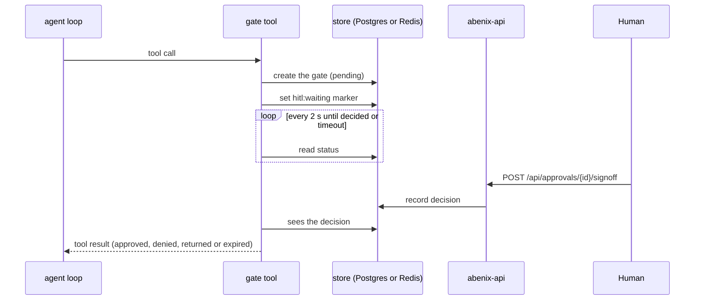
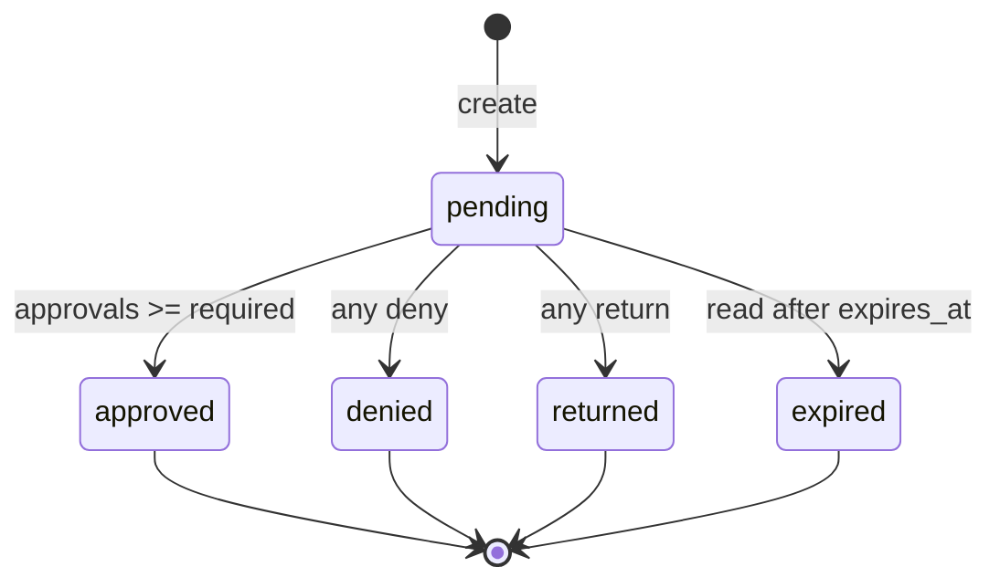
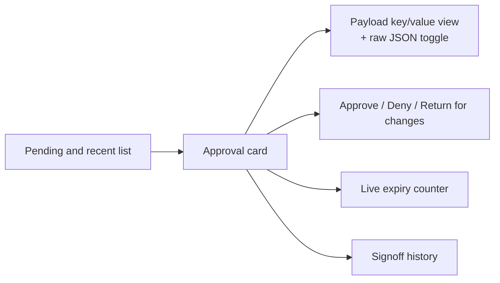

# Approvals + Human-in-the-loop (HITL)

> How an agent stops and waits for people to sign off. Used for irreversible actions, regulated decisions, customer-facing messages and publishing decision versions.

---

## Two kinds of gate

There are two stores behind the `/approvals` queue.

| | `approval_gate` tool and `POST /api/approvals` | `human_approval` tool |
|---|---|---|
| Stored in | Postgres `approvals` table | Redis, `hitl:approval:{execution}:{gate}` listed under `hitl:pending:{tenant}` |
| Sign-offs | 1 to 10 (`required_signoffs`), raised by the tier floor | Exactly one |
| Decisions | approve, deny, return | approve or deny. A return ends it as rejected |
| Expiry | `expires_seconds`, default 86400 on the API, 1800 on the tool, max 7 days | `timeout_seconds`, default 3600, capped at 7200 |
| Row id | UUID | `hitl:{execution_id}:{gate_id}` |
| Used by | Explicit gates, decision publishing (`gate_kind: decision_publish`), SDK-created approvals | Most seeded agents, `tool_config.require_approval`, and the tier policy's `approval` action |

Both show on `/approvals` and in `GET /api/approvals`, and both are signed off through `POST /api/approvals/{id}/signoff`.

## How a run waits

The run waits in place. The tool call blocks inside the runtime and polls every 2 seconds until the gate is decided or times out. Nothing is snapshotted and the pod is not released, so a waiting run holds one slot of the runtime's `AGENT_CONCURRENCY` for as long as it waits.

While it waits the tool sets `hitl:waiting:{execution_id}` in Redis with the gate's timeout as TTL. The stale-run sweeper skips executions that carry this key, so a long wait is not marked `STALE_SWEEP`.



If the runtime pod dies while a run waits, the wait is lost. The approval row stays and can still be signed, but no run is listening for it. Once the waiting marker's TTL runs out the sweeper fails the execution.

### `approval_gate`

The agent calls `approval_gate` with `payload`, plus optional `title`, `required_signoffs` (default 1), `expires_seconds` (default 1800) and `kind` (or `gate_kind`). The tool posts to `POST /api/approvals`, then polls `GET /api/approvals/{id}` until the status leaves `pending`. It returns JSON:

```json
{"status": "approved", "approval_id": "…", "signoffs": [...], "decided_at": "…", "gate_kind": "contract-execute"}
```

The agent should branch on `status`. Anything but `approved` means do not proceed. When the deadline (`expires_seconds` plus 5 s) passes it returns `status: expired`.

Things to know:

- The tool links the approval to the run it is called from and creates it as the run's user with a short-lived token, so `wait="until_gate"` sees it and the waiting marker is set. Explicit `agent_execution_id`, `agent_id` and `auth_token` arguments still win.
- With no run user to mint a token for, auth falls back to `INTERNAL_API_TOKEN`. A token starting `af_` is sent as `X-API-Key`, anything else as a Bearer token. The API base is `INTERNAL_API_URL`, then `API_BASE_URL`, then `ABENIX_API_URL`.
- When the run is above low risk, the tool adds `risk_tier` to the request so the tier floor below applies.

```yaml
# in agent yaml
model_config:
  tools:
    - approval_gate
  tool_config:
    approval_gate:
      parameter_defaults:
        kind: "contract-execute"
        required_signoffs: 2
        expires_seconds: 86400
```

### `human_approval`

`human_approval` takes `action`, plus optional `details`, `risk_level` (low, medium, high, critical, default medium) and `timeout_seconds`. Each call gets a fresh gate id, so a second gate in the same run never reuses an earlier decision.

On approval it returns `Approved by <reviewer>.` with the comment if any. A rejection or a timeout comes back as an error result (`Rejected by …. Reason: …` or `Approval timed out after Ns`), with `metadata.decision` set to `approved`, `rejected` or `timeout`.

The gate needs an execution context. A tool registry built without `execution_id` and `tenant_id` gets an error instead of an invisible wait.

Signing one off through `/api/approvals/{id}/signoff` writes the decision to Redis, which resumes the run, and writes an `approvals` history row with `gate_kind: human_approval` and status `approved` or `denied`, so the decision shows under recent decisions and reaches the notification path. The older `POST /api/executions/{execution_id}/approve?gate_id=…` with `decision: approved | rejected` still works, and `GET /api/executions/approvals` lists the raw Redis gates.

To make an agent fail rather than answer when it skips the gate, set `model_config.require_tools: [human_approval]`. See [00-agent-execution](00-agent-execution.md#required-tools).

### Gating another tool

Three paths wrap an ordinary tool call in a `human_approval` gate. All three live in [`engine/tools/base.py`](../../apps/agent-runtime/engine/tools/base.py).

| Path | Set by | What happens |
|---|---|---|
| `tool_config.<tool>.require_approval: true` | Agent author | Every call to that tool opens a gate first, with `action: "call <tool>"` and the arguments (first 4,000 characters) as details. A denial returns `approval denied: …` as the tool result. `human_approval` must be in the agent's tools, otherwise the call errors. The gate cannot gate itself |
| Tier policy `tool_call_action: approval` | Tenant admin | A call to a tool whose `risk_tier` is above the run's tier opens a gate named `call <tool> (<tier> risk)`. On approval the run's tier is raised to the tool's tier, with the reviewer in the reason |
| Tier policy `tool_call_action: block` | Tenant admin | The same call is refused outright with a message to raise the agent's tier |

The tier defaults are `allow` for low and medium tools, `approval` for high and critical. See [00-agent-execution](00-agent-execution.md#risk-tier-during-a-run).

### Pipelines

There is no dedicated approval node. Put a `type: tool` node that calls `human_approval` or `approval_gate` in the DAG and make the next node depend on it. A rejected `human_approval` is an error result, so the node fails and its dependents are skipped. An `approval_gate` that comes back `denied` is not an error, so gate the next node with a `condition` on `status`.

```yaml
pipeline_config:
  nodes:
    - id: review
      type: tool
      tool: human_approval
      input:
        action: "Send the contract to {{extract.counterparty}}"
        details: "Amount {{extract.amount_usd}} USD"
        timeout_seconds: 3600
    - id: send
      type: tool
      tool: email_sender
      depends_on: [review]
      input:
        to: "{{extract.counterparty_email}}"
        subject: "Contract for signature"
        body: "{{extract.draft}}"
```

The pipeline's wall-clock budget (`PIPELINE_TIMEOUT_SECONDS`, default 300) is checked between layers. A gate that waits longer than that makes every later layer fail with "Pipeline timeout exceeded". See [01-pipelines](01-pipelines.md).

---

## The model

The `approvals` table ([`packages/db/models/approval.py`](../../packages/db/models/approval.py)):

| Column | Meaning |
|---|---|
| `id`, `tenant_id`, `created_at`, `updated_at` | |
| `agent_id`, `agent_execution_id` | Optional links to the agent and run |
| `title` | Card title, up to 255 characters |
| `payload` | JSONB the reviewer sees |
| `required_signoffs` | How many approvals settle it |
| `signoffs` | JSONB array, one entry per signer |
| `status` | `approval_status` enum: `pending`, `approved`, `denied`, `expired`, `returned` |
| `requested_by` | User who created it |
| `expires_at`, `decided_at`, `escalated_at` | |
| `client_token` | Idempotency key. A second create with the same token returns the first row |
| `gate_kind` | Free-form discriminator, filterable with `?kind=` |
| `policy` | Signing rules copied from the tier policy, see [Tier floor](#tier-floor) |

A signoff entry:

```json
{"user_id": "…", "user_email": "…", "decision": "approve", "reason": "", "at": "2026-10-03T09:14:02+00:00",
 "self_approved": false, "client_token": "optional"}
```

### Status transitions



After each signoff the status is worked out from the whole array. A deny wins over everything, then a return, then the approval count. Once terminal, an approval cannot be reopened. A signoff on a settled row gets 409 "Approval is already <status>". A user can sign each approval once, a second attempt gets 409. A retry with the same `client_token` returns the row unchanged.

Expiry is applied when the row is read. `GET /api/approvals` sweeps the tenant's overdue pending rows to `expired` and emits `approval.resolved` for each. `GET /api/approvals/{id}` and the `/wait` long-poll flip a single overdue row. There is no separate expiry job.

---

## Return for changes

A signer can send an approval back instead of denying it. `POST /api/approvals/{id}/signoff` takes `decision: "return"` alongside `approve` and `deny`. A return needs a `reason`, otherwise the call fails with 400 and "Say what needs to change, so the requester can correct it."

- The approval moves to `returned` and `approval.resolved` is emitted with that status.
- For a decision version (`gate_kind: decision_publish`) the version goes back to `draft` with the reviewer's note under `validation.returned` as `{note, at}`. See [Decision service](20-decision-service.md) and [the decisions how-to](../08-howto/09-decisions.md).
- On `/approvals` the button is **Return for changes**. It is not offered on `human_approval` gates. A return sent to one through the API ends the gate as rejected.

## Who may sign

Without a policy on the row, admins and creators sign off. A sign-off by the user who requested it is allowed and recorded with `self_approved: true`, because most tenants have one admin. Users with the `user` role get 403 "Only admins and creators can sign off on approvals".

With a policy, the capability check replaces the role rule. See below.

## Tier floor

An approval raised for tiered work picks up the tenant's tier policy. The tier comes from `risk_tier` on the create request, or from the execution named in `agent_execution_id`. Low tier, or no tier, keeps the plain rules above.

For medium and above the `publish_approvals` block of the tier policy sets a floor:

| Policy field | Effect on the approval |
|---|---|
| `min_approvers` | `required_signoffs` is raised to at least this. A request can ask for more, never fewer |
| `exclude_author` | The requester cannot sign. They get 403 "You requested this change, so someone else has to approve it." |
| `capability` | Signers need it, for example `approvals.sign:legal`. Default `approvals.sign`. Without it the signer gets 403 naming the capability |
| `escalate_after_hours` | When to tell admins nobody has acted. See below |

Defaults from [`engine/risk.py`](../../apps/agent-runtime/engine/risk.py):

| Tier | `min_approvers` | `exclude_author` |
|---|---|---|
| Low | 0 | false |
| Medium | 0 | false |
| High | 1 | true |
| Critical | 2 | true |

These are copied onto the approval's `policy` column as `{exclude_requester, capability, risk_tier, escalate_after_hours}` when it is created, so a later policy change does not move the goalposts on approvals already waiting. The `/approvals` card shows the capability and the exclusion.

The floor applies to Postgres approvals only. A `human_approval` gate always needs one admin or creator.

Signing the approval for a decision version (`gate_kind: decision_publish`) also needs `decisions.review`, on top of the tier's signing capability (`approvals.sign` or `approvals.sign:<group>`). With `exclude_author` the proposer cannot sign. Admins hold both by default. A signer without `decisions.review` gets 403 naming it.

## Escalation

Each tier policy has `escalate_after_hours`. Defaults:

| Tier | `escalate_after_hours` |
|---|---|
| Low | 0 |
| Medium | 0 |
| High | 24 |
| Critical | 4 |

0 means never. Values from 0 to 720 are accepted.

A scheduler job, `escalate_approvals`, runs every 15 minutes, one instance at a time. It picks pending approvals that carry a policy and have not been escalated, and for each one older than its `escalate_after_hours` sends every active admin in the tenant a `system_alert` notification: "Approval waiting over Nh", with how many sign-offs it has so far and a link to `/approvals`. It then sets `escalated_at`, so each approval escalates once.

Escalation does not change the status. The row stays `pending`.

---

## SDK surface

```python
result = await client.execute("contract-flow", "Execute the Acme renewal", wait="until_gate")

if result.status == "paused":
    ref = result.paused_at                      # ApprovalRef
    print(f"Approval needed: {ref.approval_id}")
    approval = await client.approvals.wait_for(ref.approval_id, timeout_seconds=3600)
    print(approval["status"])
else:
    print(result.output)
```

- `wait` takes `"completed"` (default), `"submitted"` or `"until_gate"`. With `until_gate` the API returns as soon as a pending `approvals` row is linked to the execution, or a `human_approval` gate opens for it, with `status: "paused"` and `paused_at` holding `approval_id`, `title`, `payload`, `required_signoffs`, `expires_at` and `gate_kind`. Otherwise it returns the finished run.
- For a `human_approval` gate `paused_at.approval_id` is an `hitl:` id. `approvals.signoff` accepts it like any other approval id.
- `client.approvals` has `list`, `get`, `create`, `signoff`, `approve`, `deny`, `return_for_changes`, `wait_for` (the `/wait` long-poll, up to 120 s per round trip) and `subscribe` (approval notifications as SSE).

TypeScript has the same surface in camelCase (`pausedAt`, `approvals.returnForChanges`, `approvals.waitFor`). See [03-sdk/00-overview](../03-sdk/00-overview.md#hitl-aware-execute) for the Java client.

---

## REST

All under `/api/approvals`.

| Method | Path | Does |
|---|---|---|
| POST | `/api/approvals` | Create. Body: `title`, `payload`, `required_signoffs` (1 to 10), `expires_seconds` (10 to 604800, default 86400), `agent_id`, `agent_execution_id`, `gate_kind`, `client_token`, `risk_tier`. 201, or 200 for a repeated `client_token` |
| GET | `/api/approvals` | List. Filters `status`, `execution_id`, `agent_id`, `kind`, `limit` (1 to 500). Pending `human_approval` gates are merged in when the filters allow |
| GET | `/api/approvals/{id}` | One row. Takes a UUID or a `hitl:` id |
| GET | `/api/approvals/{id}/wait` | Long-poll until the status leaves `pending`, `timeout_seconds` 1 to 120, default 30 |
| POST | `/api/approvals/{id}/signoff` | `decision` (`approve`, `deny`, `return`), `reason` (up to 1,000 characters), `client_token` |
| GET | `/api/approvals/webhooks` | The tenant's approval webhook URL and whether a secret is set |
| PUT | `/api/approvals/webhooks` | Set or clear the URL and secret. Admins only |

---

## UI



The `/approvals` page shows pending and recent rows, including `human_approval` gates from running agents, marked with a gate kind badge. Payload renders as a key/value grid so a reviewer can scan vendor, amount and risk at a glance. **Return for changes** is hidden on `human_approval` gates. See the [page catalogue](../05-ui/03-page-catalogue.md).

---

## Notifications

When a Postgres approval is created, every other active user in the tenant gets an `approval_pending` notification linking to `/approvals`. When it settles, the requester and every earlier signer, except the person who settled it, get `approval_resolved`. Each notification is stored, pushed over the notification WebSocket, and sent to Slack or email by the user's notification settings and the tenant's Slack webhook.

A pending `human_approval` gate is in Redis only, so it sends no `approval_pending` notification. Its decision writes a history row, which sends `approval_resolved`.

The tenant's approval webhook, if set, gets `{"event": "approval_pending" | "approval_resolved", "data": <approval row>}`. With a secret, the request carries `X-Abenix-Signature: sha256=<hex HMAC-SHA256>`. This is separate from the platform events `approval.requested` and `approval.resolved`, see [19-outbound-events](19-outbound-events.md).

---

## See also

- [00-agent-execution](00-agent-execution.md) for the loop the gates run inside
- [09-state-machines](09-state-machines.md#approvals) for the approval states
- [20-decision-service](20-decision-service.md) for decision publishing approvals
- [03-sdk/00-overview](../03-sdk/00-overview.md#hitl-aware-execute) for SDK wait modes

---

## Source map

| What | Where |
|---|---|
| **Approvals REST router** | [`apps/api/app/routers/approvals.py`](../../apps/api/app/routers/approvals.py) — create, list, signoff, wait, webhook config |
| **Status from signoffs** | same router, `_evaluate_status` |
| **Tier floor + escalation** | same router, `_tier_floor` and `escalate_overdue` |
| **Tier policy defaults** | [`apps/agent-runtime/engine/risk.py`](../../apps/agent-runtime/engine/risk.py) — `DEFAULT_POLICIES` |
| **Who may sign, Redis gate helpers** | [`apps/api/app/core/hitl.py`](../../apps/api/app/core/hitl.py) — `approver_denial`, `write_hitl_decision` |
| **Escalation job** | [`apps/api/app/core/scheduler.py`](../../apps/api/app/core/scheduler.py) — `_escalate_approvals` |
| **Approval model** | [`packages/db/models/approval.py`](../../packages/db/models/approval.py) — `Approval`, `ApprovalStatus` |
| **`approval_gate` tool** | [`apps/agent-runtime/engine/tools/approval_gate.py`](../../apps/agent-runtime/engine/tools/approval_gate.py) |
| **`human_approval` tool** | [`apps/agent-runtime/engine/tools/human_approval.py`](../../apps/agent-runtime/engine/tools/human_approval.py) |
| **`require_approval` and tier gates** | [`apps/agent-runtime/engine/tools/base.py`](../../apps/agent-runtime/engine/tools/base.py) — `_DefaultedTool`, `_govern` |
| **`until_gate`** | [`apps/api/app/routers/agents.py`](../../apps/api/app/routers/agents.py) — `_watch_for_gate` |
| **Legacy gate endpoints** | [`apps/api/app/routers/executions.py`](../../apps/api/app/routers/executions.py) — `/approvals`, `/{id}/approve` |
| **/approvals UI** | [`apps/web/src/app/(app)/approvals/page.tsx`](../../apps/web/src/app/(app)/approvals/page.tsx) |
| **SDK** | [`packages/sdk/python/abenix_sdk/__init__.py`](../../packages/sdk/python/abenix_sdk/__init__.py) — `ApprovalsClient`, `execute(wait=...)`. [`packages/sdk/js/src/index.ts`](../../packages/sdk/js/src/index.ts) |
