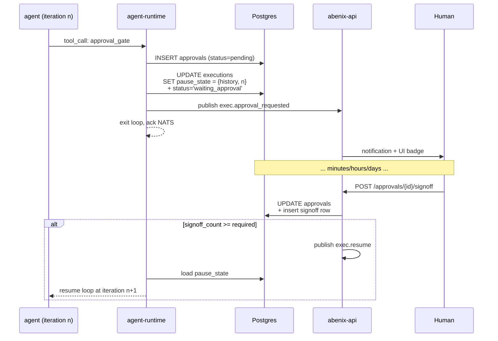
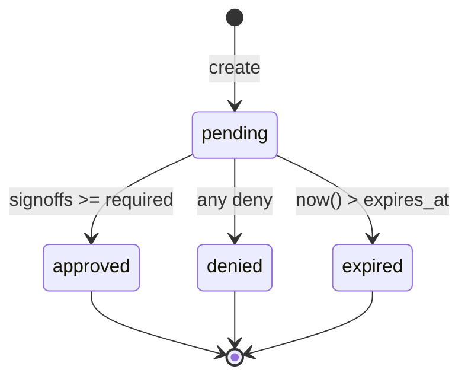
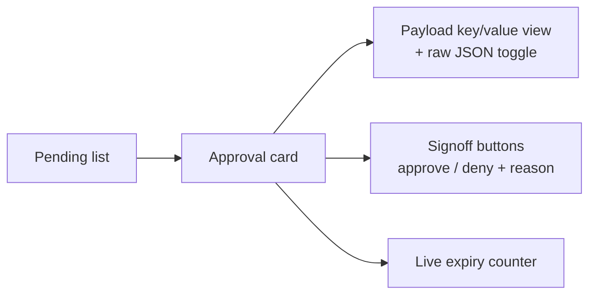

# Approvals + Human-in-the-loop (HITL)

> Durable pause/resume of an agent until N humans sign off. Used for irreversible actions, regulated decisions, and customer-facing communications.

---

## Why durable

An agent that asks for human approval can wait minutes to days. We don't pin a runtime pod for that. The pause/resume mechanism stores the agent's state in Postgres, releases the pod, and re-hydrates a fresh pod when the approval lands.



---

## The model

### Tables

```sql
CREATE TABLE approvals (
  id UUID PRIMARY KEY,
  tenant_id UUID NOT NULL,
  execution_id UUID,                    -- the paused execution (nullable for ad-hoc)
  agent_id UUID,
  title TEXT NOT NULL,
  payload JSONB NOT NULL,
  required_signoffs INT NOT NULL DEFAULT 1,
  status approval_status NOT NULL,      -- pending | approved | denied | expired
  requested_by UUID NOT NULL,           -- user_id
  expires_at TIMESTAMPTZ,
  decided_at TIMESTAMPTZ,
  client_token TEXT,                    -- idempotency key for SDK retries
  gate_kind TEXT,                       -- free-form classifier; useful for analytics
  created_at TIMESTAMPTZ NOT NULL DEFAULT now()
);

CREATE TABLE approval_signoffs (
  id UUID PRIMARY KEY,
  approval_id UUID NOT NULL REFERENCES approvals(id) ON DELETE CASCADE,
  user_id UUID NOT NULL,
  user_email TEXT NOT NULL,
  decision approval_decision NOT NULL,  -- approve | deny
  reason TEXT,
  decided_at TIMESTAMPTZ NOT NULL DEFAULT now()
);
```

### Status transitions



Once terminal, an approval cannot be re-opened. A new approval row is needed.

---

## Two ways to gate

### 1. As a tool inside an agent
The agent calls the `approval_gate` tool (with `require_approval=true` in `tool_config`). The runtime intercepts and creates the approval. The agent's `system_prompt` should mention when to invoke it.

```yaml
# in agent yaml
model_config:
  tools:
    - approval_gate
  tool_config:
    approval_gate:
      parameter_defaults:
        gate_kind: "contract-execute"
        required_signoffs: 2
        expires_seconds: 86400
```

### The `human_approval` tool, the lighter gate

`human_approval` is the in-run gate most seeded agents use. It parks the run on a Redis entry (`hitl:approval:{execution}:{gate}`, listed under `hitl:pending:{tenant}`) with a gate id, an `expires_at` and a `hitl:waiting:{execution}` marker that keeps the stale-run sweeper off the execution while it waits. Since 2.5 these gates are rows on `/approvals` and `GET /api/approvals` too, with ids of the form `hitl:{execution_id}:{gate_id}` and `gate_kind: human_approval`. Signing one off through `/api/approvals/{id}/signoff` writes the decision to Redis, which resumes the run, and writes an `approvals` history row so the decision shows under recent decisions and reaches the notification path. The gate needs an execution context, a tool registry built without `execution_id` gets an error instead of an invisible wait.

Who may sign off: admins and creators. A sign-off by the user who requested it is allowed and recorded with `self_approved: true` on the signoff, because most tenants have one admin. Viewers cannot sign off. To make an agent fail rather than answer when it skips the gate, set `model_config.require_tools: [human_approval]`.

### 2. As an explicit pipeline node
Cleaner — the gate is part of the DAG, not buried in a tool call.

```yaml
pipeline_config:
  nodes:
    - id: review
      type: human
      title: "Approve sending the contract"
      payload:
        counterparty: "{{extract.counterparty}}"
        amount_usd: "{{extract.amount_usd}}"
      required_signoffs: 1
      expires_seconds: 3600
    - id: send
      type: tool
      tool_slug: gmail_send
      arguments:
        to: "{{extract.counterparty_email}}"
        body: "{{extract.draft}}"
  edges:
    - {from: review, to: send}
```

If `review` is denied or expires, `send` never fires.

---

## SDK surface

```python
# Submit knowing it might pause
result = await client.execute("contract-flow", input_data, wait="approval_or_complete")

if result.status == "waiting_approval":
    print(f"Approval needed: {result.approval_ref.id}")
    # wait...
    final = await client.executions.wait(result.execution_id, until="terminal")
else:
    print(f"Final: {result.output}")
```

`wait="approval_or_complete"` returns whichever lands first. Same surface in TypeScript and Java SDKs.

---

## UI



The `/approvals` page shows pending + recent rows, including `human_approval` gates from running agents, marked with a gate kind badge. Payload renders as a key/value grid (not raw JSON) so a compliance reviewer can scan vendor, amount, risk tier at a glance. See [05-ui/02-api-client](../05-ui/02-api-client.md) and the page-catalogue.

---

## Notifications

When an approval lands, the API:
1. Inserts a `notifications` row for each user in the approver group (role-based or explicit list).
2. Increments the sidebar badge count.
3. (Optional) Sends email via the configured SMTP integration.
4. (Optional) Posts to Slack via the per-tenant `slack_webhook_url`.

The recipient resolution lives in [`apps/api/app/core/approval_routing.py`](../../apps/api/app/routers/approvals.py).

---

## Audit

Every approval action — created, signed off, expired, resumed — emits an `audit_logs` row:

```
{action: "approval.signoff",
 actor_id: …,
 resource_type: "approval",
 resource_id: <approval_id>,
 metadata: {decision: "approve", reason: "Counterparty pre-approved by Risk"}}
```

These are immutable and tenant-scoped. Compliance can export them via `GET /api/admin/audit-logs?action=approval.*`.

---

## See also

- [00-agent-execution](00-agent-execution.md) — pause/resume mechanics in detail
- [05-ui/03-page-catalogue](../05-ui/03-page-catalogue.md) — the /approvals page
- [03-sdk/00-overview](../03-sdk/00-overview.md#hitl-aware-execute) — SDK wait modes

---

## Source map

| What | Where |
|---|---|
| **Approvals REST router** | [`apps/api/app/routers/approvals.py`](../../apps/api/app/routers/approvals.py) — create, list, signoff, wait, webhook config |
| **Approval model** | [`packages/db/models/approval.py`](../../packages/db/models/approval.py) — `Approval`, `ApprovalStatus`, signoffs JSONB |
| **Pause / resume mechanics** | [`apps/agent-runtime/engine/agent_executor.py`](../../apps/agent-runtime/engine/agent_executor.py) — search for `pause_state` |
| **Approval webhooks (outbound)** | same router, `PUT /webhooks` — uses `tenant.settings.approval_webhook_url` |
| **/approvals UI** | [`apps/web/src/app/(app)/approvals/page.tsx`](../../apps/web/src/app/(app)/approvals/page.tsx) |
| **SDK wait modes** | [`packages/sdk/python/abenix_sdk/`](../../packages/sdk/python/abenix_sdk/) — `wait_mode` on `agents.execute()` |
