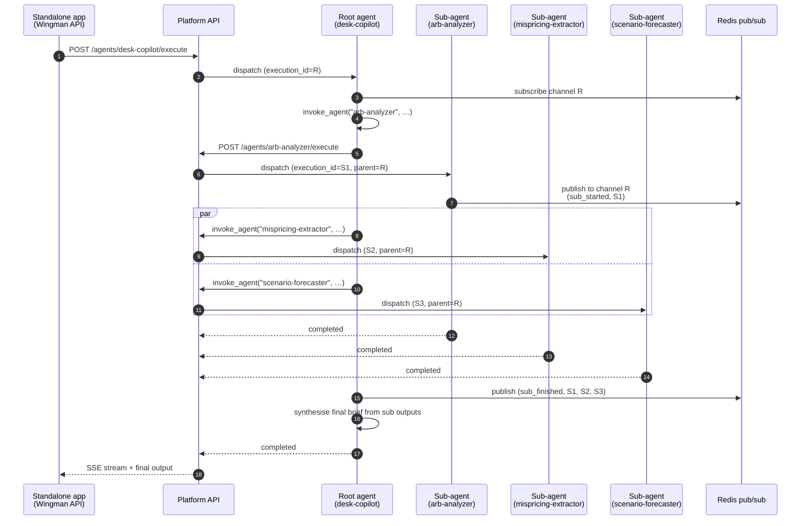

# Agent-to-agent communication

> Multi-agent orchestration sits on top of a single primitive — the `invoke_agent` tool — plus a Redis pub/sub channel that aggregates progress events across the whole call tree. Both pieces are small and worth reading top to bottom.

---

## The shape of a multi-agent call

Most multi-agent flows in this codebase follow a fan-out / fan-in pattern that looks like this.



Five things to notice.

1. The **fan-out** is just three back-to-back `invoke_agent` calls. The tool returns once the sub-agent's execution finishes. Concurrency is the caller's job — wrap them in `asyncio.gather` if you want parallel.
2. Every sub-execution gets a fresh `execution_id` and an explicit `parent_execution_id` pointing at the root.
3. Progress events from every level **publish to the root's channel**. The SSE consumer subscribes once and sees the whole tree.
4. The cost ledger on the root execution accumulates each sub's cost. The dashboard shows one cost number per top-level run.
5. There is no shared memory between sub-agents. They communicate only through their inputs (passed by the root) and their outputs (read by the root).

---

## The `invoke_agent` tool — every load-bearing line

The tool lives in [`apps/agent-runtime/engine/tools/invoke_agent.py`](../../apps/agent-runtime/engine/tools/invoke_agent.py). It does five things in order.

### Identity: the sub-agent runs as the caller

Every API call the tool makes carries a short-lived access token for the user who started the parent run. The token has the same claims as a login token (`sub`, `tenant_id`, `role`, `type: access`, `exp`, `iat`) and lives 5 minutes. A fresh one is signed per request, so a long poll never outlives it.

The runtime signs with the key the API verifies with. For the default `JWT_ALGORITHM=RS256` that is `JWT_PRIVATE_KEY` from the `abenix-secrets` envFrom. An `HS*` algorithm signs with `SECRET_KEY`. Inside the API process (inline runs) the tool falls back to the API's own `create_access_token`.

What this means in practice:

- The sub-execution row is owned by the caller, not by a service account.
- The usual 2.5 access rules apply. The caller must own the agent, be an admin, or hold a share with EXECUTE. Platform agents are open to everyone. Anything else returns `agent slug not found or not shared with you: <slug>`.
- If a token cannot be signed for a known user the call fails. It never quietly switches to the platform key.

Runs with no user behind them (a trigger or system run) fall back to the platform key from `ABENIX_PLATFORM_API_KEY`. That path only resolves agents in the run's own tenant and logs a warning each time.

The user id, role, execution id and depth reach the tool through `build_tool_registry`. The queue consumer reads them from the job payload and the inline API paths pass the authenticated user.

### 1. Resolve the agent by slug

```python
lookup = await client.get("/api/agents", params={"slug": slug, "limit": 5}, headers=...)
```

The lookup is an exact slug match and runs with the caller's token, so it only sees agents the caller can see. A same-tenant agent wins over a platform agent with the same slug. A typo or an agent the caller has no access to returns `agent slug not found or not shared with you: <slug>`. The LLM sees the error and usually self-corrects on the next iteration.

An agent cannot invoke itself directly. That returns `an agent cannot invoke itself: <slug>`.

### Finding a slug

The slug is shown under the agent name on the agent's Info page (`/agents/<id>/info`) with a copy button. It is also the `slug` field on `GET /api/agents` and `GET /api/agents/<id>`. Slugs are lower-case with dashes, for example `arb-analyzer`.

### 2. Submit the sub-execution

```python
submit_body = {
    "message": json.dumps(payload),     # the agent input, JSON-encoded
    "stream": False,
    "wait_mode": "submitted",           # returns immediately with execution_id
    "parent_execution_id": self._execution_id,
    "delegation_depth": self._depth + 1,
}
submit_r = await client.post(f"/api/agents/{agent_id}/execute", ...)
sub_exec_id = submit_data["execution_id"]
```

The API stores `parent_execution_id` on the new execution row and puts the depth into the queue payload (or the inline context), so the child's own `invoke_agent` knows how deep it is. The API also recomputes the depth from the stored parent chain and keeps the larger of the two, so a caller cannot reset it. The parent must be an execution in the caller's tenant.

`wait_mode = "submitted"` is the key flag. The tool does not block on the platform API. It gets an execution_id back, then takes over polling itself. This gives the tool full control over the timeout and lets it emit interim progress events.

### 3. Link the sub-execution to the root channel

```python
root_id = await progress.root_for(self._execution_id)
if root_id:
    await progress.set_parent(sub_exec_id, root_id)
    await progress.publish(self._execution_id, {
        "phase": "sub_started",
        "agent_slug": slug,
        "agent_name": match.get("name") or slug,
        "sub_execution_id": sub_exec_id,
    }, root_execution_id=root_id)
```

`progress.root_for` resolves "what is the *root* execution for the current run?" — if the current run is itself a sub, it walks one hop up. `set_parent` stores the child → root mapping in Redis. From then on, every progress event published by the sub-execution's runtime pod lands on the *root's* SSE channel.

This is what makes nested fan-outs work. A root invokes A. A invokes B. B's events still publish to the root's channel because B's `set_parent` walked up through A and found the root.

### 4. Poll until terminal

```python
deadline = t0 + timeout       # default 240s, max 600s
while time.time() < deadline:
    await asyncio.sleep(2.0)
    poll_r = await client.get(f"/api/executions/{sub_exec_id}", headers=headers)
    status = poll_r.json()["data"].get("status", "running").lower()
    if status in {"completed", "succeeded", "failed", "error", "cancelled"}:
        break
```

Two-second polling. Stops on any terminal state. If the deadline hits first, the tool emits a `sub_timeout` event and returns a tool error to the LLM — which can decide whether to retry, fall back, or give up.

### 5. Parse the output and return the envelope

```python
parsed = json.loads(output) if isinstance(output, str) else output
envelope = {
    "agent_slug": slug,
    "agent_id": agent_id,
    "execution_id": sub_exec_id,
    "parent_execution_id": self._execution_id,
    "status": row.get("status") or "completed",
    "output": parsed,
    "duration_ms": row.get("duration_ms") or duration_ms,
    "cost_usd": row.get("cost"),
}
return ToolResult(content=json.dumps(envelope, default=str),
                  metadata={"agent_slug": slug, "execution_id": sub_exec_id})
```

The envelope is what the calling LLM sees in its tool result. `output` is the sub-agent's parsed JSON. `cost_usd` lets the LLM reason about cost if it has been prompted to. The `metadata` field is for the runtime's accounting — the LLM does not read it.

If the sub's output is markdown-fenced JSON, the parse fallback finds the first balanced `{...}` block and extracts that. If it cannot parse anything sensible it returns `{"raw": "<first 2000 chars>"}` — the calling agent will see a string, not a structured output, and that is enough information for it to decide what to do.

---

## The Redis pub/sub channel — one root, one channel, all levels

The events that drive the live UI come from [`apps/agent-runtime/engine/progress.py`](../../apps/agent-runtime/engine/progress.py). Three primitives.

```python
async def set_parent(child_execution_id: str, root_execution_id: str) -> None:
    """Map child to root. Stored as Redis SET key: progress.parent.<child> -> <root>."""

async def root_for(execution_id: str) -> str:
    """Walk up at most 8 hops to find the root. Returns "" if none."""

async def publish(execution_id: str, event: dict, root_execution_id: str = None) -> None:
    """Publish to the root's channel: progress.<root_execution_id>."""
```

Channel naming is `progress.<root_execution_id>`. The API server's SSE bridge subscribes when a client opens the stream and unsubscribes when the client disconnects. There is no buffering — events that arrive while no subscriber is attached are lost. (Critical paths like terminal `completed` events are *also* persisted to the executions table, so the UI can poll if it missed the live tick.)

### Event types you will see

| Phase | Emitted by | Carries |
|---|---|---|
| `agent_started` | runtime pod | execution_id, agent_slug, model |
| `iteration_start` | runtime pod (each loop) | iteration index, prior tool count |
| `tool_call` | runtime pod | tool name, args (redacted), iteration |
| `tool_result` | runtime pod | tool name, duration, is_error |
| `sub_started` | invoke_agent | sub_execution_id, agent_slug |
| `sub_finished` | invoke_agent | sub_execution_id, status, duration_ms, cost_usd |
| `sub_timeout` | invoke_agent | sub_execution_id, timeout_seconds |
| `agent_finished` | runtime pod | execution_id, status, cost_usd |

Every event has an `execution_id` (the emitter) and a `root_execution_id` (the subscriber's channel). The UI uses `execution_id` to draw the right node on the live DAG. It uses the channel as a coarse filter — every event for this top-level run, regardless of depth.

---

## Cost attribution across the tree

There is no special-case logic for "sum sub-costs into root". Each execution row carries its own `cost`, `anthropic_cost`, `openai_cost`, `google_cost`, `other_cost`. The dashboard's "total cost for top-level run" query is a simple recursive CTE on `parent_execution_id`.

```sql
WITH RECURSIVE tree AS (
  SELECT id, parent_execution_id, cost, agent_id
    FROM executions WHERE id = :root_execution_id
  UNION ALL
  SELECT e.id, e.parent_execution_id, e.cost, e.agent_id
    FROM executions e JOIN tree t ON e.parent_execution_id = t.id
)
SELECT SUM(cost) FROM tree;
```

This is the source of truth for the per-run cost shown on the executions list. If you ever see the dashboard report a smaller number than the sum of LLM provider invoices, the first place to look is whether some sub-execution wrote `cost = NULL` instead of `0`. The trigger that backfills cost from `(input_tokens, output_tokens, model)` only fires on insert — manually-inserted test rows can slip past it.

---

## When to use invoke_agent vs pipeline DAG

Both shapes exist and they overlap a lot. The rule of thumb:

| Use **invoke_agent** when… | Use a **pipeline** when… |
|---|---|
| The orchestration is dynamic — the LLM decides which sub-agents to call based on intent. | The orchestration is static — the same DAG runs every time, just with different inputs. |
| You need a single LLM context to synthesise sub outputs into a brief. | Each step is independent and the merge logic is simple (zip, join, concat). |
| You want full LLM judgement on retries, fallbacks, and "is this answer good enough?". | You want reliable, deterministic behaviour with cheap-and-predictable retries. |
| There are 3–10 calls per run. | There are 10+ calls per run, or any forEach/while loops. |

The Wingman Desk Copilot is the canonical `invoke_agent` example. It looks at the trader's question, decides which 2–5 specialists to call, fires them, and writes a synthesised brief.

The Wingman Mispricing Scan is the canonical pipeline example. It always runs the same six tool calls in the same order with the same merge logic. There's no LLM judgement in the orchestration — the LLM only judges within each step.

Mixing the two is fine and common. A pipeline node with `type: agent` runs an `agent_step` wrapping an LLM call. An LLM step can call `invoke_agent` as a tool. The runtime doesn't care which way the call goes — every execution looks the same from the cost / audit / RBAC perspective.

---

## Trajectory recall — a meta pattern

A subset of multi-agent flows in this codebase use `recall_trajectory` as the first call in a copilot agent. The pattern is:

1. Call `recall_trajectory(query=<user question>)`. Returns up to K past runs whose intent text overlaps the new query.
2. Read what specialists those past runs invoked and what came out.
3. Decide which specialists to invoke this time, possibly adapted from the past plans.
4. Fan out with `invoke_agent`.
5. Synthesise and **write a new trajectory row** keyed by intent + outcome.

Trajectories live in their own table, keyed on `(tenant_id, intent_hash)` with the full plan + structured outputs + cost stored as JSONB. The store is described in [`docs/TRAJECTORY_MEMORY.md`](../TRAJECTORY_MEMORY.md). The recall tool is a thin SQL wrapper.

This is what lets the Wingman Desk Copilot get noticeably better the more it is used by the same desk. It is not RL. It is not fine-tuning. It is structured memory of "the last 200 plans that worked here".

---

## Sub-agent budgets and safeguards

Four hard limits keep multi-agent fan-outs from running away.

### Per-call timeout (240s default, 600s max)

`invoke_agent`'s `wait_timeout_seconds` argument is clamped between 30 and 600. A sub-agent that takes longer than the configured ceiling returns a tool error and frees the parent LLM to retry or fall back. The default of 240s is calibrated for "an agent that does a real KB search plus a couple of tool calls".

### Per-execution iteration budget

Every agent execution has a `max_iterations` ceiling (default 25, configurable per-agent). The runtime stops after that many tool-call rounds, regardless of whether the LLM thinks it is done. This is what stops a buggy LLM that gets stuck in "call this tool again, no really" from burning the whole budget.

### No privilege gain through invoke_agent

The sub-call runs as the same user as the parent, with that user's access. It does not propagate the parent execution's X-Abenix-Subject. The platform looks up the root execution's subject via `parent_execution_id` for audit and collection scoping. A sub-agent can never reach an agent its caller could not run by hand.

### Depth limit of 3

A top-level run is depth 0 and each `invoke_agent` hop adds one. A child at depth 3 is allowed. Anything deeper is refused with `sub-agent depth limit reached (3)`, first by the tool before it calls the API and again by the API, which recomputes depth from the stored chain. An agent invoking itself directly is refused as well. Indirect cycles (A calls B calls A) stop at the depth limit.

---

## Debugging a fan-out

When a multi-agent run goes wrong, the symptoms usually look like "the synthesised brief is missing something important" rather than a hard error. The reliable debugging sequence:

1. Open the top-level run in the **Flight Recorder** (`/executions/<id>`). The **Sub-agent runs** list links every child with its status and duration. A child's page shows **Started by** with a link back to its parent.
2. Click into the slowest or most-failing sub. The sub's own execution detail shows the LLM turns and tool calls.
3. If one sub returned `{"raw": "<text>"}` instead of structured JSON, that is the bug. The sub-agent's system prompt is not constraining its output shape. Fix it there.
4. If a sub succeeded but its output looks fine and the brief is still wrong, the bug is in the root's synthesis prompt — it is mis-reading the structured output. Look at the LLM turn where the root sees the tool result.

The OTel trace ties all of this together. One trace spans root + every sub + every LLM call. Search by `root_execution_id` in Tempo.

---

## See also

- [00-agent-execution](00-agent-execution.md) — single agent run, the building block
- [01-pipelines](01-pipelines.md) — static-DAG alternative
- [04-streaming-tracing](04-streaming-tracing.md) — how the SSE bridge subscribes to the root channel
- [05-approvals-hitl](05-approvals-hitl.md) — what happens when a sub-agent hits a human gate
- [TRAJECTORY_MEMORY](../TRAJECTORY_MEMORY.md) — the recall_trajectory backing store

---

## Source map

| What | Where |
|---|---|
| **`invoke_agent` tool** | [`apps/agent-runtime/engine/tools/invoke_agent.py`](../../apps/agent-runtime/engine/tools/invoke_agent.py) |
| **`recall_trajectory` tool** | [`apps/agent-runtime/engine/tools/recall_trajectory.py`](../../apps/agent-runtime/engine/tools/recall_trajectory.py) |
| **Root-execution walk-up (`root_for`)** | [`apps/agent-runtime/engine/progress.py`](../../apps/agent-runtime/engine/progress.py) — at line 75 |
| **Execution `parent_execution_id` column** | [`packages/db/models/execution.py`](../../packages/db/models/execution.py) |
| **Trajectory memory model** | [`packages/db/models/agent_memory.py`](../../packages/db/models/agent_memory.py) |
