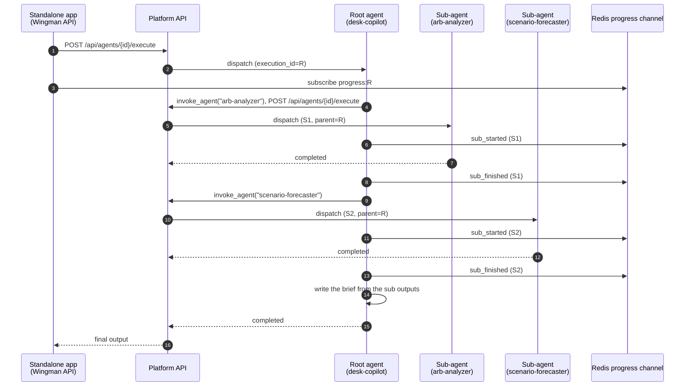
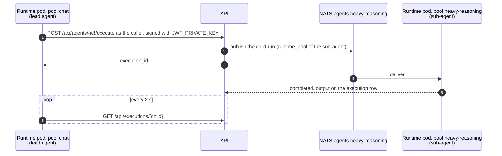

# Agent-to-agent communication

> Multi-agent work rests on one tool, `invoke_agent`, plus an optional Redis pub/sub channel that collects progress events from the whole call tree.

---

## The shape of a multi-agent call

Most multi-agent flows here fan out to specialists and fan back in.



Things to notice.

1. The fan-out is a series of `invoke_agent` calls. The tool returns once the sub-agent finishes, and the executor runs a turn's tool calls one at a time, so the sub-agents run one after another.
2. Every sub-execution gets its own `execution_id` and a `parent_execution_id` pointing at the execution that invoked it.
3. Progress events from every level go to the root's channel, so a subscriber such as Wingman's narration endpoint sees the whole tree.
4. Each execution records only its own cost. Children are listed by `GET /api/executions/{id}/children`.
5. There is no shared memory between sub-agents. They communicate only through their inputs (passed by the root) and their outputs (read by the root).

---

## The `invoke_agent` tool

The tool lives in [`apps/agent-runtime/engine/tools/invoke_agent.py`](../../apps/agent-runtime/engine/tools/invoke_agent.py). It does five things in order.

### Identity: the sub-agent runs as the caller

Every API call the tool makes carries a short-lived access token for the user who started the parent run. The token has the same claims as a login token (`sub`, `tenant_id`, `role`, `type: access`, `exp`, `iat`) and lives 5 minutes. A fresh one is signed per request, so a long poll never outlives it.

The runtime signs with the key the API verifies with. For the default `JWT_ALGORITHM=RS256` that is `JWT_PRIVATE_KEY` from the `abenix-secrets` envFrom. An `HS*` algorithm signs with `SECRET_KEY`. Inside the API process (inline runs) the tool falls back to the API's own `create_access_token`. What the key is, how to make one and how to check every pod has it: [09-reference/06-signing-keys](../09-reference/06-signing-keys.md).

What this means in practice:

- The sub-execution row is owned by the caller, not by a service account.
- The usual 2.5 access rules apply. The caller must own the agent, be an admin, or hold a share with EXECUTE. Platform agents are open to everyone. Anything else returns `agent slug not found or not shared with you: <slug>`.
- If a token cannot be signed for a known user the call fails. It never quietly switches to the platform key.

Runs with no user behind them (a trigger or system run) fall back to the platform key, `ABENIX_PLATFORM_API_KEY`, then `INTERNAL_API_TOKEN`, `ABENIX_INTERNAL_API_KEY` or `PLATFORM_API_KEY`. That path only resolves agents in the run's own tenant and logs a warning each time.

The user id, role, execution id and depth reach the tool through `build_tool_registry`. The queue consumer reads them from the job payload and the inline API paths pass the authenticated user.

### 1. Resolve the agent by slug

```python
lookup = await client.get("/api/agents", params={"slug": slug, "limit": 5}, headers=...)
```

The lookup is an exact slug match and runs with the caller's token, so it only sees agents the caller can see. A same-tenant agent wins over a platform agent with the same slug. A typo or an agent the caller has no access to returns `agent slug not found or not shared with you: <slug>`. The LLM sees the error and usually self-corrects on the next iteration.

An agent cannot invoke itself directly. That returns `an agent cannot invoke itself: <slug>`.

### Finding a slug

The slug is shown under the agent name on the agent's Info page (`/agents/<id>/info`) with a copy button. It is also the `slug` field on `GET /api/agents` and `GET /api/agents/<id>`. Slugs are lower-case with dashes, for example `arb-analyzer`.

### 2. Submit the sub-execution

```python
submit_body = {
    "message": json.dumps(payload),     # the agent input, JSON-encoded
    "stream": False,
    "wait_mode": "submitted",           # returns immediately with execution_id
    "parent_execution_id": self._execution_id,
    "delegation_depth": self._depth + 1,
}
submit_r = await client.post(f"/api/agents/{agent_id}/execute", ...)
sub_exec_id = submit_data["execution_id"]
```

The API stores `parent_execution_id` on the new execution row and puts the depth into the queue payload (or the inline context), so the child's own `invoke_agent` knows how deep it is. The API also recomputes the depth from the stored parent chain and keeps the larger of the two, so a caller cannot reset it. The parent must be an execution in the caller's tenant.

`wait_mode = "submitted"` is the key flag. The tool does not block on the platform API. It gets an execution_id back, then takes over polling itself. This gives the tool full control over the timeout and lets it emit interim progress events.

### 3. Link the sub-execution to the root channel

```python
root_id = await progress.root_for(self._execution_id)
if root_id:
    await progress.set_parent(sub_exec_id, root_id)
    await progress.publish(self._execution_id, {
        "phase": "sub_started",
        "agent_slug": slug,
        "agent_name": match.get("name") or slug,
        "sub_execution_id": sub_exec_id,
    }, root_execution_id=root_id)
```

`progress.root_for` looks up the root of the current run, or returns the run's own id when it has no mapping. `set_parent` stores the child to root mapping in Redis. From then on every progress event the child publishes goes to the root's channel.

Nested fan-outs work because each mapping already points at the root. A root invokes A, A invokes B, and B's mapping is set to A's root.

### 4. Poll until terminal

```python
deadline = t0 + timeout       # wait_timeout_seconds, default 240
while time.time() < deadline:
    await asyncio.sleep(2.0)
    poll_r = await client.get(f"/api/executions/{sub_exec_id}", headers=headers)
    status = poll_r.json()["data"].get("status", "running").lower()
    if status in {"completed", "succeeded", "failed", "error", "cancelled"}:
        break
```

It polls every 2 seconds and stops on any terminal state. If the deadline comes first, the tool publishes `sub_timeout` and returns a tool error, and the model decides whether to retry, fall back or give up.

### 5. Parse the output and return the envelope

```python
parsed = json.loads(output) if isinstance(output, str) else output
envelope = {
    "agent_slug": slug,
    "agent_id": agent_id,
    "execution_id": sub_exec_id,
    "parent_execution_id": self._execution_id,
    "status": row.get("status") or "completed",
    "output": parsed,
    "duration_ms": row.get("duration_ms") or duration_ms,
    "cost_usd": row.get("cost"),
}
return ToolResult(content=json.dumps(envelope, default=str),
                  metadata={"agent_slug": slug, "execution_id": sub_exec_id})
```

The envelope is what the calling model sees. `output` is the sub-agent's parsed JSON. `metadata` goes on the trace and the model does not read it.

When the output is not plain JSON, the tool tries the text from the first `{` to the last `}`. If that fails it returns `{"raw": "<first 2000 chars>"}`, and with no braces at all `output` is the raw string.

---

## Across pods and pools

A sub-agent call never goes from one runtime pod to another directly. It always goes through the API, and the API sends the child wherever the child agent is set to run.



What that means:

- **The child runs on its own agent's pool**, from the `runtime_pool` set on the sub-agent, not on the caller's pool. A chat-pool lead can call a heavy-reasoning specialist, and the specialist's pool scales on its own backlog. An agent set to `inline` runs in an API pod.
- **The pods only need to reach the API.** The runtime calls `ABENIX_INTERNAL_URL`, then `ABENIX_API_URL`, and defaults to `http://abenix-api:8000`. Set one of them when the Helm release is not named `abenix`, since the service name follows the release.
- **Every pool needs the signing key.** All pool Deployments read `abenix-secrets`, so a pool added in values or woken from zero by KEDA starts with it. A pod that started before the key existed has to be restarted, see [09-reference/06-signing-keys](../09-reference/06-signing-keys.md).
- **A waiting lead keeps its slot.** The lead's run holds one of its pool's `concurrency_per_replica` slots while it polls the child. If every slot of a pool is held by leads whose children are queued on the same pool and the pool is at `max_replicas`, the children wait until the leads time out at `wait_timeout_seconds`. Put orchestrating agents and their specialists on different pools, or leave headroom in `max_replicas`.
- **A child on a pool scaled to zero starts cold.** The first run waits for a pod to start, and that time counts against the lead's `wait_timeout_seconds`. Keep `min_replicas` above zero for specialists that leads call often.
- **Progress still reaches the root.** The parent mapping and the `progress:<root>` channel live in Redis, which every pool shares, so a narration endpoint sees the whole tree whichever pods ran it.

---

## The progress channel

[`apps/agent-runtime/engine/progress.py`](../../apps/agent-runtime/engine/progress.py) has three primitives:

| Function | Does |
|---|---|
| `set_parent(child, root)` | Stores Redis key `parent:<child>` with the root id (prefix `PROGRESS_PARENT_KEY_PREFIX`), expiring after `PROGRESS_PARENT_TTL`, default 1800 s |
| `root_for(execution_id)` | One lookup of `parent:<id>`. Returns the mapped root, or the id itself |
| `publish(execution_id, event)` | Publishes to `progress:<root>` (prefix `PROGRESS_CHANNEL_PREFIX`), adding `ts`, `execution_id` and `root_execution_id`. Mirrors to `PROGRESS_LEGACY_CHANNEL_PREFIX` when set |

Consumers such as Wingman's narration endpoint subscribe through `progress.subscribe`. There is no buffering, so events published while nobody listens are lost. The platform's own execution SSE uses the separate `exec:events:<id>` bus, see [04-streaming-tracing](04-streaming-tracing.md).

### Phases

| Phase | Emitted by | Carries |
|---|---|---|
| `tool_call` | Executor | `tool`, `arguments_preview`, `agent_id` |
| `tool_result` | Executor | `tool`, `is_error`, `duration_ms`, `result_preview`, `agent_id` |
| `sub_started` | `invoke_agent` | `agent_slug`, `agent_name`, `sub_execution_id` |
| `sub_finished` | `invoke_agent` | `agent_slug`, `sub_execution_id`, `status`, `duration_ms`, `cost_usd` |
| `sub_timeout` | `invoke_agent` | `agent_slug`, `sub_execution_id` |
| `narration` | `narrate` tool | The narration text |
| `autonomy_waiting` | Earned autonomy | An action waiting for a person |
| `heartbeat` | `subscribe` | Nothing, keeps the stream open |

Wingman's desk canvas uses `execution_id` to draw the right node, and the channel to scope events to one top-level run.

---

## Cost across the tree

Each execution row carries its own `cost`, `anthropic_cost`, `openai_cost`, `google_cost` and `other_cost`. Nothing sums children into the root, and the executions list shows each row's own cost. To total a tree, run a recursive query on `parent_execution_id`:

```sql
WITH RECURSIVE tree AS (
  SELECT id, parent_execution_id, cost
    FROM executions WHERE id = :root_execution_id
  UNION ALL
  SELECT e.id, e.parent_execution_id, e.cost
    FROM executions e JOIN tree t ON e.parent_execution_id = t.id
)
SELECT SUM(cost) FROM tree;
```

---

## When to use invoke_agent vs pipeline DAG

Both shapes overlap. A rule of thumb:

| Use **invoke_agent** when… | Use a **pipeline** when… |
|---|---|
| The orchestration is dynamic — the LLM decides which sub-agents to call based on intent. | The orchestration is static — the same DAG runs every time, just with different inputs. |
| You need a single LLM context to synthesise sub outputs into a brief. | Each step is independent and the merge logic is simple (zip, join, concat). |
| You want full LLM judgement on retries, fallbacks, and "is this answer good enough?". | You want reliable, deterministic behaviour with cheap-and-predictable retries. |
| There are 3–10 calls per run. | There are 10+ calls per run, or any forEach/while loops. |

The Wingman Desk Copilot is the main `invoke_agent` example. It reads the trader's question, picks 2 to 5 specialists, calls them and writes a brief.

The Wingman Mispricing Scan is the main pipeline example. It runs the same steps in the same order every time. The model judges only inside each step.

Mixing the two is common. A pipeline node with `type: agent` runs an `agent_step`, and an agent can call `invoke_agent` as a tool.

---

## Trajectory recall — a meta pattern

A subset of multi-agent flows in this codebase use `recall_trajectory` as the first call in a copilot agent. The pattern is:

1. Call `recall_trajectory(query=<user question>)`. Returns up to K past runs whose intent text overlaps the new query.
2. Read what specialists those past runs invoked and what came out.
3. Decide which specialists to invoke this time, possibly adapted from the past plans.
4. Fan out with `invoke_agent`.
5. Synthesise and **write a trajectory record** for the run, one per execution.

Trajectories are JSON files under `TRAJECTORY_DIR` (`/data/trajectories`), one folder per tenant plus `shared`. Writers and the recall tool use that one setting. The store is described in [`docs/TRAJECTORY_MEMORY.md`](../TRAJECTORY_MEMORY.md).

---

## Sub-agent budgets and safeguards

Four limits keep a fan-out in check.

### Per-call timeout

`wait_timeout_seconds` defaults to 240. The schema allows 30 to 600, but the tool does not clamp it. A sub-agent that runs longer returns a tool error and the parent model can retry or fall back.

### Per-execution iteration budget

Every run has a `max_iterations` ceiling, default 10 from the `agent.max_iterations` platform setting, set per agent in `model_config.max_iterations`. The loop stops after that many rounds. See [The step limit](00-agent-execution.md#the-step-limit).

### No privilege gain through invoke_agent

The sub-call runs as the same user as the parent, with that user's access. It does not pass on the parent's `X-Abenix-Subject`. The child copies the parent's run origin and nothing else. A sub-agent can never reach an agent its caller could not run by hand.

### Depth limit of 3

A top-level run is depth 0 and each `invoke_agent` hop adds one. A child at depth 3 is allowed. Anything deeper is refused with `sub-agent depth limit reached (3)`, first by the tool before it calls the API and again by the API, which recomputes depth from the stored chain. An agent invoking itself directly is refused as well. Indirect cycles (A calls B calls A) stop at the depth limit.

---

## Debugging a fan-out

A multi-agent run usually goes wrong as a brief that misses something, not as a hard error. Work through it like this:

1. Open the top-level run in the **Flight Recorder** (`/executions/<id>`). The **Sub-agent runs** list links every child with its status and duration. A child's page shows **Started by** with a link back to its parent.
2. Click into the slowest or most-failing sub. The sub's own execution detail shows the LLM turns and tool calls.
3. If one sub returned `{"raw": "<text>"}` instead of structured JSON, that is the bug. The sub-agent's system prompt is not constraining its output shape. Fix it there.
4. If every sub looks fine and the brief is still wrong, the root's prompt is misreading the structured output. Look at the turn where the root sees the tool result.

With tracing on, one trace spans the root and every sub, because `invoke_agent` sends `traceparent`. Search Tempo by the root's trace id or by `execution.id`.

---

## See also

- [00-agent-execution](00-agent-execution.md) — single agent run, the building block
- [01-pipelines](01-pipelines.md) — static-DAG alternative
- [04-streaming-tracing](04-streaming-tracing.md) — the execution event bus and traces
- [05-approvals-hitl](05-approvals-hitl.md) — what happens when a sub-agent hits a human gate
- [TRAJECTORY_MEMORY](../TRAJECTORY_MEMORY.md) — the recall_trajectory backing store

---

## Source map

| What | Where |
|---|---|
| **`invoke_agent` tool** | [`apps/agent-runtime/engine/tools/invoke_agent.py`](../../apps/agent-runtime/engine/tools/invoke_agent.py) |
| **`recall_trajectory` tool** | [`apps/agent-runtime/engine/tools/recall_trajectory.py`](../../apps/agent-runtime/engine/tools/recall_trajectory.py) |
| **Progress channel** | [`apps/agent-runtime/engine/progress.py`](../../apps/agent-runtime/engine/progress.py) — `set_parent`, `root_for`, `publish`, `subscribe` |
| **Execution `parent_execution_id` column** | [`packages/db/models/execution.py`](../../packages/db/models/execution.py) |
| **Trajectory store** | JSON files under `TRAJECTORY_DIR`, written by `wingman/api/trajectories.py`, read by `recall_trajectory` |
