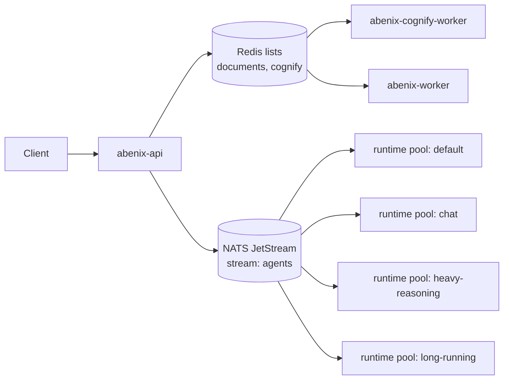

# Queues, pools, and KEDA autoscaling

> Two queue systems carry work: NATS JetStream for agent runs, Celery on Redis for document jobs. Runtime pools consume the NATS side and KEDA scales them on backlog. A Redis-backed gate throttles direct tool calls.

---

## Two queue systems

| System | Carries | Files |
|---|---|---|
| **NATS JetStream** | Agent and pipeline runs, from the API to the runtime pools | [`apps/agent-runtime/consumer.py`](../../apps/agent-runtime/consumer.py), [`engine/queue_backend.py`](../../apps/agent-runtime/engine/queue_backend.py), `infra/helm/abenix/templates/agent-runtime-pools.yaml` |
| **Celery on Redis** | Document ingestion, cognify, KB re-embedding and the Pinecone vacuum | [`apps/worker/`](../../apps/worker/) |
| **Redis (keys, pub/sub, one Stream)** | Tool-gate counters and buckets, the `tools:queue` Stream for runtime-pool tool calls, the WebSocket fan-out channel, execution events | [`apps/api/app/core/tool_gate.py`](../../apps/api/app/core/tool_gate.py), [`apps/agent-runtime/tool_stream_consumer.py`](../../apps/agent-runtime/tool_stream_consumer.py) |

Queued agent runs work only on NATS. With `scaling.queueBackend: celery` the chart refuses `scaling.execRemote` or runtime pools, a pool pod exits at startup saying so, and the API runs the agent inline when it cannot enqueue. Celery still runs the document and cognify jobs.

An upload to `POST /api/knowledge-bases/{kb_id}/upload` enqueues a Celery job. `POST /api/agents/{id_or_slug}/execute` for an agent on a pool publishes a NATS message and answers `{execution_id, task_id, pool, mode: "async"}`. Clients follow the run by polling or SSE, see [04-streaming-tracing](04-streaming-tracing.md).



---

## Celery

Routing lives in [`apps/worker/worker/celery_app.py`](../../apps/worker/worker/celery_app.py):

```python
task_routes={
    "worker.tasks.document_processor.*": {"queue": "documents"},
    "worker.tasks.cognify_task.*":     {"queue": "cognify"},
    "worker.tasks.kb_reembed.*":       {"queue": "documents"},
    "worker.tasks.pinecone_vacuum.*":  {"queue": "documents"},
}
```

The worker image runs `-Q ${CELERY_QUEUES}`, default `documents` (`apps/worker/Dockerfile`). The cognify worker runs `-Q cognify` (`cognifyWorker.queue`) with 2 prefork children (`cognifyWorker.concurrency`). A worker that does not subscribe to a queue never sees its jobs.

Things to know:

1. **Re-runs.** Tasks are acked late and requeued if the worker is lost (`task_acks_late`, `task_reject_on_worker_lost`), so each task must be safe to run twice.
2. **Time limits.** App-wide defaults are soft 1500 s and hard 1800 s (`CELERY_TASK_SOFT_TIME_LIMIT`, `CELERY_TASK_TIME_LIMIT`). `kb_reembed` raises them to 20700 and 21600.
3. **Status.** Progress is kept on the rows the work belongs to, such as `cognify_jobs` and the document row, not in the Celery result backend. Cognify inserts a `pending` row in `cognify_jobs`, sends the task to `cognify`, and `GET /api/knowledge-engines/{kb_id}/cognify-jobs` reads progress.

---

## NATS JetStream and the runtime pools

Each pool is a Deployment that pulls from one durable consumer on the shared `agents` stream:

```
stream: agents
  subjects: ["agents.>"]       # created by the first publisher or consumer, no retention limits

consumer: abenix-<pool>-consumer   (pull, durable, subject agents.<pool>)
  ack_wait: 30s                # renewed by in_progress heartbeats while the run lives
```

The only size bound is the server's `max_file_store` of 5GB (`templates/nats-jetstream.yaml`).

The API publishes to `agents.<runtime_pool>`, using the agent's `runtime_pool` column (default `default`). An agent set to `inline` runs in the API pod. There is no per-run override. Triggers use the same rule.

### At-least-once delivery

The consumer acks a message only after the run ends, is skipped or is given up. While the run lives it sends `in_progress` to JetStream every `CONSUMER_LEASE_SECONDS / 3` seconds, so the 30 s ack window never runs out on a healthy pod.

Each run also holds a lease on its `executions` row: `runner_id`, `lease_expires_at` and `delivery_attempts`. The same heartbeat extends the lease to `CONSUMER_LEASE_SECONDS` (default 25, minimum 6) from now. When a message arrives the consumer tries to claim the row.

| Row state | What the consumer does |
|---|---|
| Not `running` any more | Drops the duplicate and acks |
| `running`, another runner's lease still live | Naks with a delay until that lease runs out, then looks again |
| `running`, no lease or an expired one | Takes over and runs the agent again from the start |
| Picked up `CONSUMER_MAX_ATTEMPTS` (default 3) times already | Fails the run with `STALE_SWEEP` and a message saying it was not retried again |
| Row missing | Publishes an `error` event and acks |

A takeover reruns the whole agent, so tool side effects from the first attempt can happen twice after a pod crash. If a runner finds its lease taken over by another, it cancels its own copy. An undecodable message is terminated, not redelivered. The stale sweeper skips runs whose lease is still live. See [09-state-machines](09-state-machines.md).

### The pools

The base chart defines no pools (`scaling.pools: []`). `values-local.yaml` defines one (`default`). `values-azure.yaml` defines four:

| Pool | min to max replicas | Runs at once per pod | Requests / limits |
|---|---|---|---|
| `default` | 1 to 5 | 3 | 200m, 512Mi / 1 CPU, 1Gi |
| `chat` | 0 to 3 | 6 | 200m, 512Mi / 1 CPU, 1Gi |
| `heavy-reasoning` | 0 to 4 | 2 | 500m, 1Gi / 2 CPU, 2Gi |
| `long-running` | 0 to 3 | 1 | 500m, 1Gi / 2 CPU, 2Gi. Scales on a single queued job |

`concurrency_per_replica` becomes `AGENT_CONCURRENCY` on the pod (template default 3, consumer fallback 8). Pools at 0 replicas start a pod on the first queued run, so that run waits for a pod to start. Agents that need the lowest latency use `runtime_pool: inline`.

The admin screen `/admin/scaling` offers a fixed list of pools (`POOLS` in [`admin_scaling.py`](../../apps/api/app/routers/admin_scaling.py)): `inline`, `default`, `chat`, `heavy-reasoning`, `gpu` and `long-running`, with its own suggested replica counts. The chart deploys none of `gpu`, so an agent set to it waits on `agents.gpu` with no consumer unless you add one.

Isolation is the reason for pools. A 30-minute backtest on `long-running` does not hold a slot a chat agent needs.

### Adding a pool

1. Add an entry to `scaling.pools` in your values file: `key`, `min_replicas`, `max_replicas`, `concurrency_per_replica`, `resources`, and optionally `keda_queue_trigger` and `nodeAffinity`.
2. Add the key to `POOLS` in `apps/api/app/routers/admin_scaling.py`, so the admin screen accepts it.

The chart renders the Deployment, Service and ScaledObject for each entry.

---

## KEDA

With `scaling.keda.enabled`, the chart renders one ScaledObject per pool from `agent-runtime-pools.yaml`:

```yaml
apiVersion: keda.sh/v1alpha1
kind: ScaledObject
metadata:
  name: abenix-agent-runtime-default
spec:
  scaleTargetRef:
    name: abenix-agent-runtime-default
  minReplicaCount: 1          # min_replicas, 0 scales the pool to zero when idle
  maxReplicaCount: 5          # max_replicas, template fallback 10
  pollingInterval: 15
  cooldownPeriod: 300
  triggers:
    - type: nats-jetstream
      metadata:
        natsServerMonitoringEndpoint: "abenix-nats.abenix.svc.cluster.local:8222"
        account: "A"
        stream: "agents"
        consumer: "abenix-default-consumer"
        lagThreshold: "3"     # keda_queue_trigger, default 3
```

Scale-down waits 600 s and drops at most 50 percent or one pod a minute. Scale-up has no wait and can double, or add 4 pods, every 15 s.

`lagThreshold: "3"` targets at most 3 pending messages per replica. With 27 pending, KEDA aims for ⌈27/3⌉ = 9 replicas, capped at `maxReplicaCount`.

`min_replicas: 0` renders as 0. With KEDA on the pool scales to zero and the NATS trigger wakes it when a message lands. With KEDA off the Deployment keeps at least one replica, since nothing would wake it.

When `scaling.keda.prometheusUrl` is set, a second trigger is rendered on `abenix_execution_duration_seconds_bucket{pool=…}` p95 above 90 s. The pool consumer records that histogram for every run it finishes, labelled by `pool` and `status`. The query ends in `or vector(0)`, so an idle pool reads 0 instead of no data. KEDA scales on whichever trigger asks for more replicas.

Check that the trigger has data:

```bash
kubectl -n abenix get scaledobject abenix-agent-runtime-default \
  -o jsonpath='{.status.externalMetricNames}'
kubectl get --raw "/apis/external.metrics.k8s.io/v1beta1/namespaces/abenix/s1-prometheus?labelSelector=scaledobject.keda.sh%2Fname%3Dabenix-agent-runtime-default"
```

| Symptom | Likely cause | What to change |
|---|---|---|
| Replicas swing up and down | Threshold too tight | Raise `keda_queue_trigger` |
| Slow start on bursts | Threshold too loose, or min at 0 | Lower `keda_queue_trigger`, or raise `min_replicas` |
| Pods stay at min while the queue grows | KEDA cannot read the NATS monitoring endpoint | Check that port 8222 is reachable from the KEDA operator |

See [06-deployment/03-keda](../06-deployment/03-keda.md) for install and overrides.

---

## Backpressure

Once a pool is at `max_replicas`, NATS keeps accepting messages and they wait. The API still answers `{execution_id, task_id, pool, mode: "async"}` and the run starts later. There is no queue-depth rejection.

What does refuse work before it is enqueued: the execute handler checks the tenant plan's daily execution limit and the user's monthly token and cost quota and answers 429, the agent's daily spend caps answer 429 `BUDGET_EXCEEDED` (see [Spend caps](00-agent-execution.md#spend-caps)), the agent's `rate_limit_qps` answers 429 `RATE_LIMITED` with a `Retry-After` header, and `RateLimitMiddleware` limits requests per user or per IP.

The per-agent `rate_limit_qps` is a token bucket in Redis keyed by tenant and agent slug, with a one-second burst. When Redis is down it lets the run through and counts `abenix_rate_limit_fail_open_total`. Each refusal counts `abenix_rate_limit_hits_total{tenant_id, agent_slug}`.

Per-agent `min_replicas`, `max_replicas` and `concurrency_per_replica` are stored but not applied. Pools are shared, so their replica bounds and concurrency come from `scaling.pools` in the chart. Admin, Scaling and the builder say so next to those fields.

---

## Metrics

| Metric | Source | Use |
|---|---|---|
| `abenix_execution_duration_seconds{pool, status}` | Pool consumer, histogram, one sample per finished run | KEDA p95 trigger, Scaling Ops dashboard |
| `abenix_queue_depth{pool}` | Pool consumer, gauge, JetStream pending every 15 s | Scaling Ops dashboard |
| `abenix_agent_execution_duration_seconds` | Runtime pods, histogram, no labels (the scrape adds `pool`) | Run latency per pool |
| `abenix_tool_execution_duration_seconds` | Runtime pods, histogram by `tool_name` | Slow tools |
| `abenix_executions_in_flight{pool}` | API, gauge | Inline runs going on now |
| `abenix_executions_completed_total`, `abenix_executions_failed_total` | API and consumer | Outcomes and failure codes |

The chart installs no NATS, Redis or KEDA exporter, so queue depth is read with `nats` CLI or the monitoring endpoint, not Prometheus. The dashboard "Abenix — Scaling Ops" (`infra/observability/dashboards/scaling-ops.json`) has rate-limit, circuit-breaker and cost panels. Its queue-depth and duration panels read `abenix_queue_depth` and `abenix_execution_duration_seconds`, which nothing emits. See [06-deployment/04-observability](../06-deployment/04-observability.md).

---

## The tool gate

Direct tool calls, `POST /api/tools/{slug}/execute` and preset runs, pass through `app.core.tool_gate.acquire()`. Agent-loop and pipeline tool calls do not. `acquire()` returns:

- **ALLOW_CACHED**, a cached result. The tool does not run.
- **ALLOW**, the caller runs the tool, then calls `release()`.
- **DENY**, a reason the API returns as 429.

A disabled tool is denied first. If Redis is down the gate lets the call through with no cache or limits. Otherwise, in order:

1. **Cache.** Key is a SHA-256 of the sorted arguments, cut to 24 hex characters. Scope `global` shares hits across tenants, `per_tenant` does not. `cache_ttl_seconds: 0` (the default) turns it off.
2. **Circuit breaker.** Failure means the tool raised or returned `is_error`. After `circuit_breaker_threshold` failures in `circuit_breaker_window_s` the breaker opens and calls are refused until `circuit_breaker_cooldown_s` passes. Then calls pass again and any success closes it. Threshold 0 (the default) turns it off.
3. **Rate limit.** A token bucket per tool, global and per tenant. Capacity and refill are the qps value. 0 means no limit.
4. **Daily budget.** A counter per tool, tenant and UTC day against `daily_budget_calls_per_tenant`. 0 means no limit.
5. **Concurrency.** Redis counters against `max_inflight_global` (default 50) and `max_inflight_per_tenant` (default 20). The key's TTL is `max(2 × timeout_seconds, 60)` s, set when the first holder takes a slot, so a crashed pod's slot frees itself.

Tools without a row use the `GateConfig` defaults. [`seed_tool_runtime.py`](../../apps/api/app/core/seed_tool_runtime.py) seeds rows for high-traffic tools on startup, for example:

| Tool | Cache | qps global / tenant | In flight global / tenant | Daily budget per tenant | Breaker |
|---|---|---|---|---|---|
| `yahoo_finance` | 60 s global | 8 / 2 | 20 / 5 | none | 8 |
| `tavily_search` | 300 s global | 5 / 1 | 10 / 3 | 1000 | 5 |
| `sanctions_screening`, `pep_screening` | 24 h per tenant | 2 / none | 8 / 20 | 500 | off |
| `llm_call` | none | none / 5 | 30 / 8 | 5000 | off |
| `code_executor` | none | none | 8 / 2 | none | 10 |
| `code_asset` | none | none | 6 / 2 | none | off |

Admins change these at `/admin/tool-scaling` (API `/api/admin/tool-runtime`). Changes apply on the next call.

### Runtime-pool tools

When a tool's row has `pool = 'runtime'`, the API does not run a direct call itself. It:

1. subscribes to `tools:result:{job_id}`,
2. adds a job to the `tools:queue` Stream with the tool, tenant, arguments, config, result channel and `enqueued_at`,
3. waits up to `timeout_seconds` for the reply.

Every runtime pod runs `tool_stream_consumer.py` beside the agent consumer (unless `TOOL_WORKER_ENABLED=0`). It reads `tools:queue` as consumer group `tool-workers`, runs the tool and publishes the result. On a timeout or error the API falls back to running the tool inline.

---

## Pipelines

A pipeline runs in the pod of its own `runtime_pool`. Every node runs there too. Agent nodes run through `agent_step` in-process, they are not queued to the agent's pool. Tool nodes call the tool directly, without the gate. So a slow pipeline is tuned on its own pool and on the tools and providers behind its nodes.

`/admin/pipeline-scaling` shows each pipeline's nodes with the pool and tool config they resolve to.

---

## When users report slow responses

1. Open `/admin/scaling`. If the pool is at `max_replicas`, raise `max_replicas` for that pool in `scaling.pools`, or move the agent to another pool. The per-agent replica fields on that screen are stored but not applied to any Deployment.
2. Look at `abenix_agent_execution_duration_seconds` and `abenix_tool_execution_duration_seconds`. One slow agent can move to `heavy-reasoning` or `long-running`. A slow tool points at its provider.
3. If replicas are not at max but runs wait, lower `keda_queue_trigger` or raise `min_replicas`.
4. If nothing is queued and runs are still slow, the bottleneck is downstream: an LLM provider's rate limit, KB search or an external API.

Raising `max_replicas` alone often moves the problem to the database pool or the provider's rate limit.

---

## See also

- [06-deployment/03-keda](../06-deployment/03-keda.md) for KEDA install and ScaledObjects
- [00-agent-execution](00-agent-execution.md) for what a pool does with a message
- [06-agent-to-agent](06-agent-to-agent.md) for multi-agent flows
- [04-streaming-tracing](04-streaming-tracing.md) for how events flow back to clients

---

## Source map

| What | Where |
|---|---|
| **Queue consumer and lease** | [`apps/agent-runtime/consumer.py`](../../apps/agent-runtime/consumer.py) |
| **Queue backend** | [`apps/agent-runtime/engine/queue_backend.py`](../../apps/agent-runtime/engine/queue_backend.py) |
| **Pools, ScaledObjects** | [`infra/helm/abenix/templates/agent-runtime-pools.yaml`](../../infra/helm/abenix/templates/agent-runtime-pools.yaml), values in `values-azure.yaml` and `values-local.yaml` |
| **Agent pool settings** | model [`packages/db/models/agent.py`](../../packages/db/models/agent.py), API [`apps/api/app/routers/admin_scaling.py`](../../apps/api/app/routers/admin_scaling.py), UI [`apps/web/src/app/(app)/admin/scaling/page.tsx`](../../apps/web/src/app/(app)/admin/scaling/page.tsx) |
| **Tool gate** | config [`packages/db/models/tool_runtime_config.py`](../../packages/db/models/tool_runtime_config.py), gate [`apps/api/app/core/tool_gate.py`](../../apps/api/app/core/tool_gate.py), dispatch [`apps/api/app/core/tool_worker_dispatch.py`](../../apps/api/app/core/tool_worker_dispatch.py), inline or runtime choice in [`apps/api/app/routers/tools.py`](../../apps/api/app/routers/tools.py), runtime worker [`apps/agent-runtime/tool_stream_consumer.py`](../../apps/agent-runtime/tool_stream_consumer.py), UI [`apps/web/src/app/(app)/admin/tool-scaling/page.tsx`](../../apps/web/src/app/(app)/admin/tool-scaling/page.tsx) |
| **Pipeline view** | [`apps/web/src/app/(app)/admin/pipeline-scaling/page.tsx`](../../apps/web/src/app/(app)/admin/pipeline-scaling/page.tsx) |
| **Celery worker** (document ingest, cognify, re-embed, Pinecone vacuum) | [`apps/worker/worker/celery_app.py`](../../apps/worker/worker/celery_app.py), tasks in [`apps/worker/worker/tasks/`](../../apps/worker/worker/tasks/) |
| **Request rate limit per user or IP** | [`apps/api/app/core/middleware.py`](../../apps/api/app/core/middleware.py) (`RateLimitMiddleware`) |
