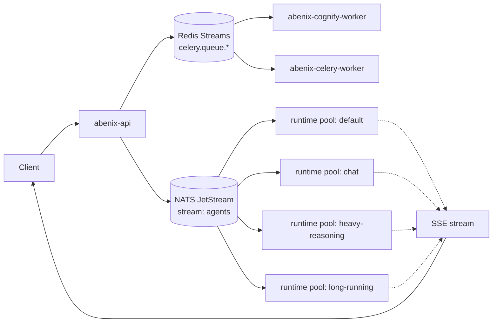
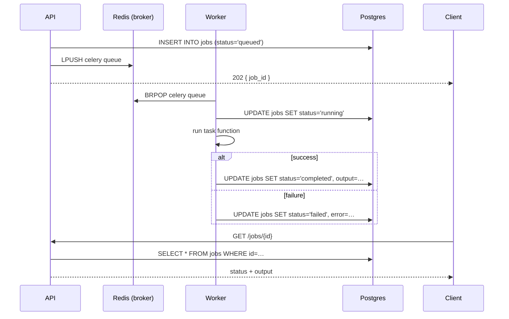
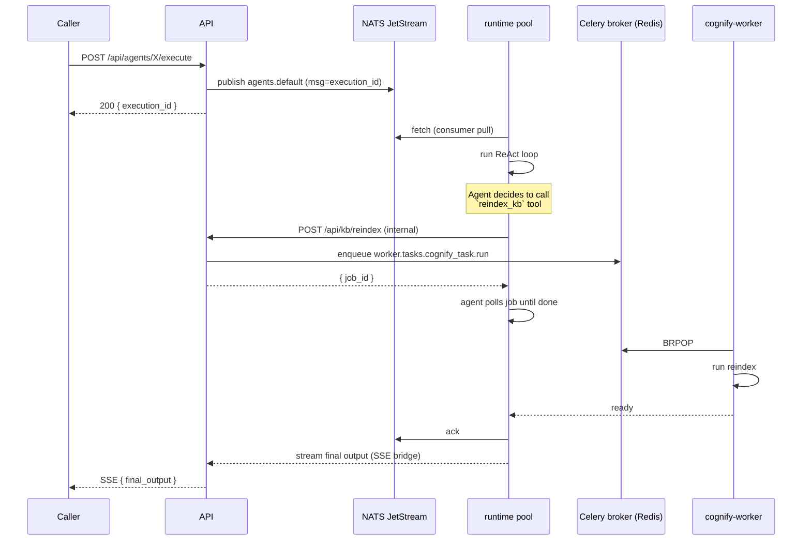

# Queues, pools, and KEDA autoscaling

> Two parallel queue systems carry work in this platform. They look similar from the outside and do very different jobs. Once you know which is which, the rest of the scaling story is mechanical.

**Reader's roadmap.** This doc covers two queue systems (NATS + Celery), four agent runtime pools (KEDA-scaled), three scaling layers (agents / tools / pipelines), and one tool gate (cache + sem + qps + breaker). If you came here for one thing, jump to it:

- Q: when do I use NATS vs Celery? → [Two queue systems](#two-queue-systems-one-platform) decision table
- Q: which pool should my agent live on? → [Pool routing](#pool-routing--cost--latency-matrix) matrix
- Q: how does tool scaling work? → [Three scaling layers](#three-scaling-layers-the-whole-picture)
- Q: my pipeline is slow — where do I look? → [Decision tree](#decision-tree-for-operators) at the end

---

## Two queue systems, one platform

| System | What it carries | Why it exists | Files |
|---|---|---|---|
| **Celery on Redis** | Background jobs — document ingestion, cognify pipelines, exports, scheduled sweepers | Long, durable, often minutes-long. Tasks have predictable shapes. | [`apps/worker/`](../../apps/worker/) |
| **NATS JetStream** | Agent and pipeline executions dispatched from the API to the runtime pools | Sub-second dispatch, ordered delivery, consumer-side flow control. | [`apps/agent-runtime/`](../../apps/agent-runtime/), `infra/helm/abenix/templates/agent-runtime-pools.yaml` |
| **Redis Streams** | Tool-gate semaphore counters, rate-limit token buckets, the `tools:queue` stream when `pool='runtime'`, the WS fan-out channel | Low-latency primitives that need to be visible to every api pod at once. Not a "queue" in the workflow sense. | [`apps/api/app/core/tool_gate.py`](../../apps/api/app/core/tool_gate.py), [`apps/agent-runtime/tool_stream_consumer.py`](../../apps/agent-runtime/tool_stream_consumer.py) |

### Pick the right backend for a new feature

| Work shape | Pick | Why not the others |
|---|---|---|
| LLM agent execution (1-300s, ordered, UI is watching) | NATS | Celery is too coarse for SSE streaming. Redis Streams has no consumer-group ack semantics this code path needs. |
| Document ingestion, Cognify, exports, nightly sweeps (minutes-to-hours) | Celery | NATS retention is bounded (1M messages, ~3h at 100 msg/s). Celery has retry/backoff/idempotency built in. |
| Tool-call dispatch from one pod to another (synchronous round-trip, 100ms-30s) | Redis Streams via `tool_worker_dispatch.py` | NATS would need a per-tool subject explosion. Celery's polling cadence is too slow for the api pod waiting on the reply. |
| Distributed semaphore, rate-limit bucket, breaker state | Redis (plain INCR/Lua) | Not a queue — needs O(1) reads. |

**Default: NATS for agent work, Celery for everything that's not an agent, Redis for primitives.** If you're not sure, NATS — its consumer ack + redelivery handles crash recovery for free.

The API server is the entry point for both. A `POST /api/documents/{id}/process` enqueues a Celery job. A `POST /api/agents/{slug}/execute` publishes a NATS message. Neither client sees the queue — they get a job_id or execution_id back and listen for completion via polling or SSE.



The mental model: **Celery for "this will take a while and can wait"**, **NATS for "the user is watching the SSE stream"**.

---

## Celery — routing by queue name

Celery's routing config lives in [`apps/worker/worker/celery_app.py`](../../apps/worker/worker/celery_app.py).

```python
task_routes={
    "worker.tasks.agent_tasks.*":      {"queue": "agents"},
    "worker.tasks.document_processor.*": {"queue": "documents"},
    "worker.tasks.export_tasks.*":     {"queue": "exports"},
    "worker.tasks.cognify_task.*":     {"queue": "cognify"},
}
```

Each route maps a Python module prefix to a queue name. Workers subscribe to specific queues by name — `celery -A worker.celery_app worker -Q documents,cognify` for the cognify worker, `celery -A worker.celery_app worker -Q exports` for the export pod, and so on. A worker that doesn't subscribe to a queue never sees its jobs.

This pattern is intentional. The cognify pipeline is heavy (loads big embeddings models into RAM and keeps them resident). It runs in its own pod with `memoryLimit: 12Gi`. The export worker is lightweight. Putting them in the same queue would force the export pod to also load the cognify model, which would mean fewer export replicas per node.

### Lifecycle of a Celery task



Three details that bite if you forget them.

1. **Idempotency.** Celery automatically retries a job if a worker dies mid-run. The task function must be safe to re-run with the same args. We achieve this by keying every side-effect on a `job_id`-derived idempotency token.
2. **Soft + hard timeouts.** Tasks declare `soft_time_limit` (raises an exception inside the task — caller can clean up) and `time_limit` (SIGKILL the worker — caller cannot clean up). Almost all our tasks set soft to ~80% of hard.
3. **Result backend.** Celery uses a separate Redis DB for results. We don't rely on it — we write status to the `jobs` table for durable lookup. The result backend is just there because Celery wants one.

---

## NATS JetStream — the runtime dispatch path

The runtime pools are isolated *fleets*. Each pool subscribes to one JetStream consumer that reads from the shared `agents` stream filtered by `subject` (NATS subject, not RBAC subject — different thing entirely).

```
stream: agents
  subjects: ["agents.>"]
  retention: limits   # discard after ack-pending TTL
  max_msgs: 1_000_000
  storage: file

consumer: abenix-default-consumer
  filter_subject: "agents.default"
  ack_policy: explicit
  ack_wait: 10m
  max_ack_pending: 100

consumer: abenix-chat-consumer       (filter: agents.chat)
consumer: abenix-heavy-reasoning-consumer (filter: agents.heavy-reasoning)
consumer: abenix-long-running-consumer    (filter: agents.long-running)
```

The API server picks a subject when it publishes. The picker logic looks at agent metadata.

| Agent characteristic | Routes to subject | Rationale |
|---|---|---|
| `agent_type: "chat"` (low-latency conversation) | `agents.chat` | small pods, scale fast |
| `model_config.preset: "heavy-reasoning"` or `model: "o1-…"` | `agents.heavy-reasoning` | larger memory + longer timeouts |
| `max_iterations > 50` or known long-running tools | `agents.long-running` | very generous wall-clock |
| anything else | `agents.default` | the workhorse |

A pool listens on its own consumer. JetStream guarantees ordered delivery per consumer, exactly-once with explicit ack within the ack_wait window. If a runtime pod dies mid-execution, the message redelivers after the ack window expires (10 minutes) and another pod picks it up. The pipe sees this as "execution timed out and retried" — visible in the executions list.

**What the JetStream settings actually mean:**

- `retention: limits` — drop messages when EITHER the message count cap OR the storage cap is hit. We size the message cap (1M) so the streaming history is ~3 hours of activity at 100 msg/sec. Older executions live in Postgres' `executions` table, so this short retention is intentional. Postgres is the source of truth, JetStream is just the dispatcher.
- `storage: file` — JetStream persists to disk via RocksDB. Overhead ~200 bytes per message. A million-message stream ≈ 200 MB. For dev / test, set `storage: memory` to drop the disk dependency. Production always uses file.
- `ack_wait: 10m` — how long JetStream waits for a `JS.ACK` from the consumer before redelivering. If a pod OOMs or gets killed by k8s mid-execution, the message sits in the unacked queue for 10 minutes, then another pod picks it up. The user sees "retried" in the executions list. Tune up for the long-running pool (3h ack_wait), down for chat (60s) so dead chat sessions don't replay 10 minutes later when the user has moved on.
- `max_ack_pending: 100` — backpressure. If the consumer has 100 unacked messages in flight, JetStream stops delivering more until some are acked. This is what keeps a slow pod from getting buried under more work it can't process.

### Why isolate the pools

Without isolation, one slow long-running execution (a 30-minute back-test) would pin a runtime pod, preventing it from picking up the next chat message. With isolation:

- Chat pool stays warm and small-latency.
- Heavy-reasoning pool runs costly LLM calls on dedicated pods, can scale up to 10 replicas during bursts.
- Long-running pool has 60-minute ack_wait and accepts 1 message per replica at a time.
- A pool maxing out does not affect the others.

Per-pool isolation also means **per-pool cost budgets** are easy. You can set a Prometheus alert on `sum(rate(abenix_llm_cost_usd_provider_total[1h])) by (pool)` and catch one runaway pool before it burns the month's allowance.

### Pool routing — cost / latency matrix

The single most consequential agent field is `runtime_pool`. Pick wrong and the agent either starves (chat agent stuck behind a 30-minute backtest) or wastes money (chat-style agent pinned on 4Gi heavy-reasoning pods). Decision matrix:

| Pool | min/max replicas | Pod CPU/RAM | Typical exec time | LLM cost / exec | Use for | Avoid for |
|---|---|---|---|---|---|---|
| `chat` | 2 → 20 | 250m / 512Mi | 1-3s | $0.005-0.02 | Conversational agents, fast lookups, low-latency triage | Anything with multi-step tool fan-out |
| `default` | 1 → 10 | 500m / 1Gi | 2-10s | $0.02-0.10 | General-purpose agents, single-pass extraction, sentiment | Multi-minute deep reasoning |
| `heavy-reasoning` | 1 → 15 | 1000m / 4Gi | 10-300s | $0.10-2.00 | Pipeline executors, deep extractors, multi-pass valuation | Sub-second chat responses |
| `long-running` | 0 → 8 | 500m / 2Gi | 30min - 6h | $1.00-30.00 | Stress tests, scenario sweeps, backtests, batch document Cognify | Anything UI is actively watching |
| `gpu` (optional) | 0 → 4 | 1000m / 8Gi + 1 GPU | varies | varies | Embedding generation, OCR on PDFs at scale, ASR | Anything that doesn't actually need a GPU |
| `inline` (tools only — NOT a deployment) | n/a | api pod's loop | <100ms | — | Sub-millisecond pure-Python tools (`calculator`, `current_time`) | I/O-bound or LLM-bound work |

**Routing logic** (handled by `dispatch_agent_execution()` in `apps/api/app/routers/agents.py`):
1. Agent row's `runtime_pool` field wins if set.
2. Otherwise inferred from `agent_type`: `chat` → chat pool, `pipeline` → heavy-reasoning, anything else → default.
3. Override per-run with `X-Abenix-Runtime-Pool` header (rare).

**Adding a fifth pool.** Edit `infra/helm/abenix/values.yaml` → `agent-runtime.pools.<name>: { minReplicas, maxReplicas, concurrency, resources }`. Add a matching `ScaledObject` template + `kubectl apply`. Update the routing function above. Most teams never need this — the five existing pools cover ~98% of use cases. If you find yourself adding a pool, ask first whether you really want a different `concurrency_per_replica` on an existing pool instead.

---

## KEDA — what it watches and how

KEDA (Kubernetes Event-Driven Autoscaling) watches queue depth and scales the runtime pool Deployments accordingly. The ScaledObject is generated from `infra/helm/abenix/templates/agent-runtime-pools.yaml` per pool.

```yaml
apiVersion: keda.sh/v1alpha1
kind: ScaledObject
metadata:
  name: abenix-agent-runtime-default
spec:
  scaleTargetRef:
    name: abenix-agent-runtime-default
  minReplicaCount: 1
  maxReplicaCount: 10
  pollingInterval: 15
  cooldownPeriod: 300       # 5 min — keep warm pods for bursts
  triggers:
    - type: nats-jetstream
      metadata:
        natsServerMonitoringEndpoint: http://abenix-nats:8222
        account: "$G"
        stream: "agents"
        consumer: "abenix-default-consumer"
        lagThreshold: "3"   # scale when ack-pending > 3 per replica
    # optional second trigger:
    - type: prometheus
      metadata:
        serverAddress: http://abenix-prometheus:9090
        metricName: abenix_execution_p95_ms
        query: 'histogram_quantile(0.95, sum by(le) (rate(abenix_execution_duration_seconds_bucket{pool="default"}[5m]))) * 1000'
        threshold: "90000"  # 90s p95 triggers scale-up
```

### The lag threshold — what it means and how to tune

`lagThreshold: "3"` means KEDA targets at most 3 pending messages per replica. If the JetStream consumer has 27 pending messages and the deployment has 4 replicas, the effective lag-per-replica is 27/4 = 6.75. KEDA scales up to keep that below 3, so it would scale to ⌈27/3⌉ = 9 replicas (capped at maxReplicaCount).

The formula is roughly:

```
target_replicas = max(min_replicas, ceil(pending_messages / lag_threshold))
```

**Tuning rule of thumb:**

| Symptom | Likely cause | Fix |
|---|---|---|
| Replicas oscillate up and down | Cooldown too short or threshold too tight | Raise cooldown to 600s or threshold to 5 |
| Long latency on bursty traffic | Threshold too loose | Lower threshold to 2 |
| Pods always at min, queue grows | KEDA not picking up the metric | Check NATS monitoring endpoint reachable from KEDA pod |
| Cost spikes overnight | Min replicas too high for off-peak | Add a HPA scheduledScaler or lower min to 0 (cold-start hit) |

### Two triggers — OR semantics

When both NATS and Prometheus triggers are set, KEDA scales **on whichever one demands more replicas**. This is deliberate. The NATS trigger reacts to backlog. The Prometheus p95 trigger reacts to "the work is taking too long even though the queue is short" — a sign that current pods are I/O-bound or rate-limited by the LLM provider.

You almost always want both when a pool runs LLM-heavy work. NATS alone misses the case where 4 pending messages each take 5 minutes — backlog stays low but latency is awful.

### Cold-start cost

KEDA can scale a deployment to zero with `minReplicaCount: 0`. We never do this for the chat pool — cold-start of a runtime pod is ~12 seconds (pull image cache hit + import dependencies + connect to NATS), which is unacceptable for a conversational UI. The heavy-reasoning pool can go to zero overnight if you accept the latency on the first morning call.

---

## How a single execution moves through both queue systems

For a typical agent execution with one cognify step in the middle, the message path looks like this.



NATS carries the *outer* execution. Celery carries the *inner* heavy task. The runtime pod is the bridge that polls Celery on the agent's behalf. This split lets the runtime pool stay responsive (each pod handles 5+ executions at a time, multiplexing on `asyncio`) while the cognify worker stays single-process and memory-stable.

---

## Backpressure — what happens when scaling can't keep up

KEDA's scaling has a ceiling (max_replicas, default 10 for most pools). Once you hit that, NATS keeps accepting publishes — but the consumer's ack-pending counter grows, and JetStream eventually applies pull-based flow control to new messages.

What this looks like in practice:

1. Queue depth grows past `lagThreshold × max_replicas`.
2. KEDA stops scaling (capped). Pods are at max but cannot drain fast enough.
3. New executions land in NATS and wait.
4. The API server keeps returning `200 { execution_id, status: "queued" }` to clients.
5. SSE consumers see a longer time-to-first-event.

The graceful version: the API server can preemptively reject new executions with `503 SERVICE_AT_CAPACITY` when the queue is more than `max_replicas × lagThreshold × 3` deep. That circuit breaker is opt-in via `RUNTIME_BACKPRESSURE_ENABLED=true` and off by default — we'd rather queue than reject.

The hostile version: tenant exceeds their daily execution quota. The rate-limit middleware returns `429 TENANT_QUOTA_EXCEEDED` *before* the message is enqueued. This is preferred over backpressuring at the runtime layer because it's per-tenant fair.

---

## Observability for queue and scaling

| Metric | Source | Use it for |
|---|---|---|
| `abenix_execution_duration_seconds` | runtime pool, histogram | Latency SLO. p95 alert at 60s for default pool. |
| `abenix_executions_in_flight` | runtime pool, gauge | "How saturated is each pod?" |
| `keda_scaledobject_replicas_total{name="…"}` | KEDA metrics | Replica history per pool |
| `nats_jetstream_consumer_num_pending` | NATS exporter | Backlog per pool, the input to KEDA's NATS trigger |
| `celery_queue_length{queue="cognify"}` | Redis exporter | Backlog per Celery queue |

The Grafana dashboard `Abenix → Scaling` panels these side by side. The "is the system healthy?" reading is:

- All in-flight counts < 50% of (replicas × pool concurrency).
- All consumer-pending < `lagThreshold × max_replicas`.
- p95 execution duration < 60s for chat, < 5min for heavy.

Anything red in any column is the first place to look during an incident.

---

## Tuning playbook

If users report slow responses:

1. **Open the Scaling dashboard.** Are replicas at max?
2. If yes, check **what's consuming time** — `abenix_execution_duration_seconds` p95 by `agent_slug`. One slow agent dragging the pool down? Move it to heavy-reasoning. Tool taking forever? Look at `tool_execution_duration_seconds`.
3. If no, but lag is high, the **scaling threshold may be too loose**. Drop from 5 to 3, redeploy, observe.
4. If no and lag is low, the **bottleneck is downstream** — LLM provider rate-limit, KB search latency, or an external tool API. Confirm with provider-specific metrics.

Never just raise `max_replicas` blindly. The next bottleneck (database connection pool, LLM rate limit, downstream API) catches up fast and adding more pods makes things worse — they contend for the same scarce resource and add memory pressure.

---

## See also

- [03-keda](../06-deployment/03-keda.md) — KEDA install + ScaledObject inventory
- [00-agent-execution](00-agent-execution.md) — what happens inside a runtime pool when a message lands
- [06-agent-to-agent](06-agent-to-agent.md) — multi-agent flows that stay within one pool
- [04-streaming-tracing](04-streaming-tracing.md) — how events flow back through SSE

---

## Three scaling layers (the whole picture)

Pool routing + KEDA above only solves *one* of the three bottlenecks. The complete scaling story has three concentric layers. Each addresses a different way the platform can get swamped, and each has its own admin UI.

```
┌──────────────────────────────────────────────────────────────────┐
│  Layer 1 — AGENT + POD SCALING                /admin/scaling     │
│                                                                  │
│  • per-agent runtime_pool, replicas, qps, daily_budget_usd      │
│  • 4 deployments (default/chat/heavy/long-running)               │
│  • KEDA watches Redis stream depth, scales pods 0..max_replicas │
│  ▼ what stops the api pod from doing agent work itself           │
└──────────────────────────────────────────────────────────────────┘
┌──────────────────────────────────────────────────────────────────┐
│  Layer 2 — TOOL SCALING                  /admin/tool-scaling    │
│                                                                  │
│  Tool Gate (Redis-backed, fail-open):                            │
│    cache lookup → breaker check → qps (global + per-tenant)      │
│    → daily budget → semaphore (global + per-tenant)              │
│                                                                  │
│  • per-tool ToolRuntimeConfig row (15 seeded defaults)           │
│  • pool='inline'  → runs on api pod (sub-second tools only)      │
│  • pool='runtime' → XADDs tools:queue, agent-runtime pods consume│
│  ▼ what stops 50 callers from each calling Yahoo at once         │
└──────────────────────────────────────────────────────────────────┘
┌──────────────────────────────────────────────────────────────────┐
│  Layer 3 — PIPELINE SCALING          /admin/pipeline-scaling    │
│                                                                  │
│  Pipelines compose layers 1 + 2. No new primitives.              │
│  Pipeline itself runs on its own runtime_pool (Layer 1).         │
│  Tool nodes inside the pipeline use the gate (Layer 2).          │
│  Agent nodes inside the pipeline enqueue back to Layer 1.        │
│  Control nodes (switch/loop/structured) run in-process on the    │
│    pipeline's pod — no separate scaling.                         │
│  ▼ what makes a 10-node pipeline composable instead of monolithic│
└──────────────────────────────────────────────────────────────────┘
```

### Why three layers and not one

One layer can't solve all three problems because they manifest at different scopes:

| Bottleneck | Scope | Fix lives at |
|---|---|---|
| Pod CPU pegged running 100 agent loops in parallel | per pool | agent runtime_pool + KEDA |
| External API (Yahoo, Tavily) returns 429 because 50 callers slammed it at once | per tool, org-wide | tool gate qps + cache |
| One noisy tenant eating Yahoo's budget | per tool, per tenant | tool gate `*_per_tenant` |
| Cold start latency for chat agents | per pool | min_replicas on chat pool |
| Same gold-price fetched 150 times in 1s by 150 different callers | per (tool, args) | cache TTL |
| External API outage → 50 callers all hang for 15s waiting | per tool | circuit breaker |
| Pipeline node N is slow because its underlying tool is throttled | composed | edit Layer 2 and the pipeline picks it up automatically |

### The tool gate (Layer 2) — in detail

Every direct `tools/{slug}/execute`, every preset run, every agent-loop tool call passes through one function: `app.core.tool_gate.acquire()`. It returns one of:

- **ALLOW_CACHED** — cached result. Tool never runs.
- **ALLOW** — caller must run the tool, then call `release()` to return the semaphore
- **DENY** — `reason` string the caller surfaces as a 429

Order of checks (fail-open if Redis is down):

1. **Cache lookup** — SHA-256 hash of canonical (sorted) `arguments`. Scope `global` for public data (LBMA gold, USDCNY), `per_tenant` for private (sanctions match against a customer's name). Two tenants calling `yahoo_finance(symbol=gold)` share the cache hit because gold's price is universal. Two tenants calling `kb_search(query="acme corp")` do NOT share — each gets their own KB. `cache_ttl_seconds = 0` disables caching entirely.
2. **Circuit breaker** — "failure" means any of: tool raised an exception, `ToolResult.is_error=True`, gate timed out waiting for the tool. Tracked in a sliding window of `circuit_breaker_window_s`. After `circuit_breaker_threshold` failures the breaker **opens** — all calls fast-fail with 429 until `circuit_breaker_cooldown_s` elapses, then it goes **half-open** (one trial call goes through, success closes it, failure re-opens).
3. **Rate limit** — token bucket. Capacity = qps, refill rate = qps tokens/sec. Each call costs 1 token. **Burst behavior:** 10 calls in the same millisecond on a 10-qps tool all succeed on a full bucket, and the 11th gets 429. Then 10 tokens refill over the next second, so steady-state throughput tracks qps. No headroom above capacity.
4. **Daily budget** — Redis counter per `(tool, tenant, UTC-date)`. Increments on each call, resets at UTC midnight. Once over `daily_budget_calls_per_tenant`, all calls from that tenant get 429 until the next day. Use for paid feeds (LBMA = $0.10/call, cap at 5000/day per tenant).
5. **Semaphore** — Redis `INCR` with a TTL of `tool_timeout + 30s buffer`. Bounded by `max_inflight_global` AND `max_inflight_per_tenant` (both must pass). If a pod crashes between `acquire()` and `release()`, the semaphore key auto-expires after TTL and the slot frees up — no manual cleanup. Caveat: if the tool overruns its timeout AND the TTL expires while it's still running, a second caller could squeeze in. Set TTL conservatively (≥ tool timeout + 60s) for non-reentrant tools.

Successful execution caches the result and calls `release()`. Failures record into the breaker's failure window.

**Defaults applied to high-traffic tools** (seeded by `apps/api/app/core/seed_tool_runtime.py` on startup):

| Tool | cache TTL / scope | qps (global / per-tenant) | inflight cap | daily budget / tenant | pool |
|---|---|---|---|---|---|
| `yahoo_finance` | 60s global | 8 / 2 | 20 / 5 | unlimited | inline |
| `tavily_search` | 300s global | 5 / 1 | 10 / 3 | 1000 calls | inline |
| `open_meteo` | 600s global | 10 / unlimited | 20 / 20 | unlimited | inline |
| `ais_stream` | 60s global | 1 / unlimited | 4 / 1 | unlimited | inline |
| `sanctions_screening` | 86400s (24h) per_tenant | 2 / unlimited | 8 / 20 | 500 calls | inline |
| `pep_screening` | 86400s per_tenant | 2 / unlimited | 8 / 20 | 500 calls | inline |
| `ml_model` | 30s per_tenant | unlimited | 40 / 10 | unlimited | inline |
| `llm_call` | no cache | unlimited / 5 | 30 / 8 | 5000 calls | inline |
| `code_executor` | no cache | unlimited | 8 / 2 | unlimited | inline |
| `code_asset` | no cache | unlimited | 6 / 2 | unlimited | **runtime** |

Admins override any of these from `/admin/tool-scaling`. Changes take effect on the next call — no restart needed.

### Pool dispatch (`pool='runtime'`)

When `ToolRuntimeConfig.pool = 'runtime'`, the api pod does NOT execute the tool inline. It:

1. XADDs a job onto `tools:queue` with `{job_id, tool_slug, tenant_id, arguments, config, result_channel}`
2. SUBSCRIBEs to `tools:result:{job_id}`
3. Awaits the worker's reply (timeout = `timeout_seconds`)

Agent-runtime pods (every replica of every pool) run a co-loop in `apps/agent-runtime/tool_stream_consumer.py` that `XREADGROUP`s from `tools:queue`, instantiates the tool, runs it, publishes the result on the per-job channel. KEDA already scales agent-runtime pods on agent queue depth — that capacity is reused for tool work without a separate deployment.

This keeps the api pod's event loop free of blocking tool calls, which is the gap the semaphore alone couldn't close.

### Pipeline composition (Layer 3) — example

```yaml
slug: iot-pump-pipeline
mode: pipeline
runtime_pool: default          # <- Layer 1: where the pipeline pod lives
pipeline_config:
  nodes:
    - id: timestamp
      type: tool
      tool: current_time       # <- Layer 2: inline (sub-ms)
    - id: dsp
      type: tool
      tool: code_asset         # <- Layer 2: runtime (pool='runtime')
    - id: diagnose
      type: agent
      agent_slug: iot-diagnoser # <- Layer 1: enqueues to that agent's pool
    - id: report
      type: structured         # <- Control: in-process on pipeline pod
```

When this pipeline runs, the pipeline pod (in the `default` runtime pool) iterates its nodes. `timestamp` is a sub-ms inline tool call. `dsp` goes through the gate, lands on `tools:queue`, an agent-runtime pod picks it up and runs the user's uploaded code. `diagnose` enqueues to whatever pool the `iot-diagnoser` agent is configured for — possibly `heavy-reasoning`. `report` is a structured-output node, runs in-process. **No new infrastructure** — every primitive already existed.

**Error propagation.** If any tool node fails (gate returns 429, tool raises, agent times out), the pipeline executor checks for an `on_error` edge defined on that node. If present, the failure routes there with the error captured in the node's output. If absent, the pipeline halts and the execution row is marked `failed` with `failed_node_id` set. Downstream nodes never run. The retry policy comes from the *outer* execution's runtime_pool (NATS redelivers after `ack_wait` if the pipeline pod itself crashed. Otherwise the pipeline is considered complete-with-failure and is not retried).

### Decision tree for operators

If users report slow responses, run through this in order:

1. **Open `/admin/scaling`.** Is the relevant pool's replica count pinned at max? If yes → raise `max_replicas` on the loud agent, or move it to a less-contested pool.
2. **Open `/admin/tool-scaling`.** Any tool showing many 24h calls with red circuit-breaker dot? That's where the latency is. Bump qps if the external provider can handle it, or raise cache TTL if results are reusable.
3. **Open `/admin/pipeline-scaling`.** Expand the slow pipeline. Which node is the bottleneck? Tool node → fix in step 2. Agent node → fix in step 1. Control node → it's not the scaling, it's the logic. Profile the pipeline executor.
4. Only after all three show green: it's the external dependency. Add a circuit breaker (Layer 2) and an SLO alert.

---

## Source map

| What | Where |
|---|---|
| **Layer 1 — agent pool config** | model: [`packages/db/models/agent.py`](../../packages/db/models/agent.py), admin UI: [`apps/web/src/app/(app)/admin/scaling/page.tsx`](../../apps/web/src/app/(app)/admin/scaling/page.tsx) |
| **Layer 2 — tool gate** | runtime config: [`packages/db/models/tool_runtime_config.py`](../../packages/db/models/tool_runtime_config.py), gate primitive: [`apps/api/app/core/tool_gate.py`](../../apps/api/app/core/tool_gate.py), dispatcher: [`apps/api/app/core/tool_worker_dispatch.py`](../../apps/api/app/core/tool_worker_dispatch.py), inline-vs-runtime: [`apps/agent-runtime/tool_stream_consumer.py`](../../apps/agent-runtime/tool_stream_consumer.py), admin UI: [`apps/web/src/app/(app)/admin/tool-scaling/page.tsx`](../../apps/web/src/app/(app)/admin/tool-scaling/page.tsx) |
| **Layer 3 — pipeline view** | admin UI: [`apps/web/src/app/(app)/admin/pipeline-scaling/page.tsx`](../../apps/web/src/app/(app)/admin/pipeline-scaling/page.tsx) |
| **KEDA ScaledObjects + NATS subjects** | helm templates: [`infra/helm/abenix/templates/`](../../infra/helm/abenix/templates/), full doc: [06-deployment/03-keda](../06-deployment/03-keda.md) |
| **Celery worker (sweepers, webhooks, KB ingest)** | app: [`apps/worker/worker/celery_app.py`](../../apps/worker/worker/celery_app.py), tasks: [`apps/worker/worker/tasks/`](../../apps/worker/worker/tasks/) |
| **Per-tenant rate-limit** | [`apps/api/app/core/middleware.py`](../../apps/api/app/core/middleware.py) (`RateLimitMiddleware`) |
