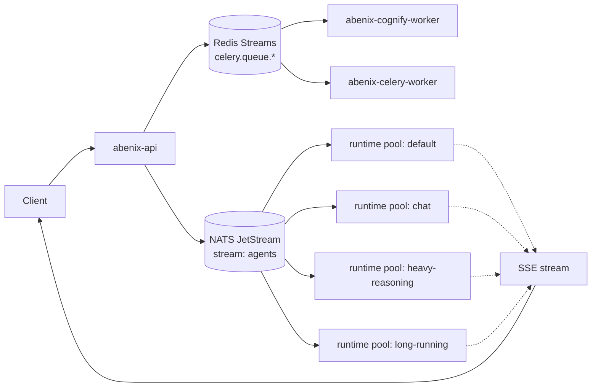
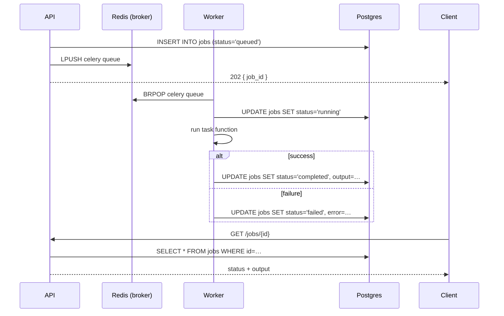
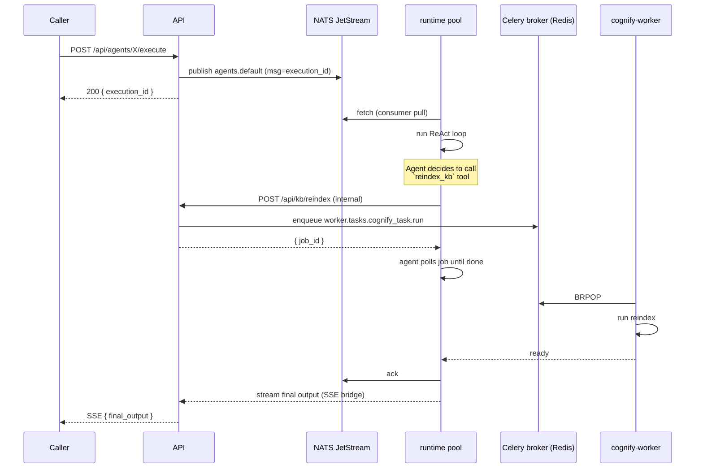

# Queues, pools, and KEDA autoscaling

> Two parallel queue systems carry work in this platform. They look similar from the outside and do very different jobs. Once you know which is which, the rest of the scaling story is mechanical.

---

## Two queue systems, one platform

| System | What it carries | Why it exists | Files |
|---|---|---|---|
| **Celery on Redis** | Background jobs — document ingestion, cognify pipelines, exports, scheduled sweepers | Long, durable, often minutes-long. Tasks have predictable shapes. | [`apps/worker/`](../../apps/worker/) |
| **NATS JetStream** | Agent and pipeline executions dispatched from the API to the runtime pools | Sub-second dispatch, ordered delivery, consumer-side flow control. | [`apps/agent-runtime/`](../../apps/agent-runtime/), `infra/helm/abenix/templates/agent-runtime-pools.yaml` |

The API server is the entry point for both. A `POST /api/documents/{id}/process` enqueues a Celery job. A `POST /api/agents/{slug}/execute` publishes a NATS message. Neither client sees the queue — they get a job_id or execution_id back and listen for completion via polling or SSE.



The mental model: **Celery for "this will take a while and can wait"**, **NATS for "the user is watching the SSE stream"**.

---

## Celery — routing by queue name

Celery's routing config lives in [`apps/worker/worker/celery_app.py`](../../apps/worker/worker/celery_app.py).

```python
task_routes={
    "worker.tasks.agent_tasks.*":      {"queue": "agents"},
    "worker.tasks.document_processor.*": {"queue": "documents"},
    "worker.tasks.export_tasks.*":     {"queue": "exports"},
    "worker.tasks.cognify_task.*":     {"queue": "cognify"},
}
```

Each route maps a Python module prefix to a queue name. Workers subscribe to specific queues by name — `celery -A worker.celery_app worker -Q documents,cognify` for the cognify worker, `celery -A worker.celery_app worker -Q exports` for the export pod, and so on. A worker that doesn't subscribe to a queue never sees its jobs.

This pattern is intentional. The cognify pipeline is heavy (loads big embeddings models into RAM and keeps them resident). It runs in its own pod with `memoryLimit: 12Gi`. The export worker is lightweight. Putting them in the same queue would force the export pod to also load the cognify model, which would mean fewer export replicas per node.

### Lifecycle of a Celery task



Three details that bite if you forget them.

1. **Idempotency.** Celery automatically retries a job if a worker dies mid-run. The task function must be safe to re-run with the same args. We achieve this by keying every side-effect on a `job_id`-derived idempotency token.
2. **Soft + hard timeouts.** Tasks declare `soft_time_limit` (raises an exception inside the task — caller can clean up) and `time_limit` (SIGKILL the worker — caller cannot clean up). Almost all our tasks set soft to ~80% of hard.
3. **Result backend.** Celery uses a separate Redis DB for results. We don't rely on it — we write status to the `jobs` table for durable lookup. The result backend is just there because Celery wants one.

---

## NATS JetStream — the runtime dispatch path

The runtime pools are isolated *fleets*. Each pool subscribes to one JetStream consumer that reads from the shared `agents` stream filtered by `subject` (NATS subject, not RBAC subject — different thing entirely).

```
stream: agents
  subjects: ["agents.>"]
  retention: limits   # discard after ack-pending TTL
  max_msgs: 1_000_000
  storage: file

consumer: abenix-default-consumer
  filter_subject: "agents.default"
  ack_policy: explicit
  ack_wait: 10m
  max_ack_pending: 100

consumer: abenix-chat-consumer       (filter: agents.chat)
consumer: abenix-heavy-reasoning-consumer (filter: agents.heavy-reasoning)
consumer: abenix-long-running-consumer    (filter: agents.long-running)
```

The API server picks a subject when it publishes. The picker logic looks at agent metadata.

| Agent characteristic | Routes to subject | Rationale |
|---|---|---|
| `agent_type: "chat"` (low-latency conversation) | `agents.chat` | small pods, scale fast |
| `model_config.preset: "heavy-reasoning"` or `model: "o1-…"` | `agents.heavy-reasoning` | larger memory + longer timeouts |
| `max_iterations > 50` or known long-running tools | `agents.long-running` | very generous wall-clock |
| anything else | `agents.default` | the workhorse |

A pool listens on its own consumer. JetStream guarantees ordered delivery per consumer, exactly-once with explicit ack within the ack_wait window. If a runtime pod dies mid-execution, the message redelivers after the ack window expires (10 minutes) and another pod picks it up. The pipe sees this as "execution timed out and retried" — visible in the executions list.

### Why isolate the pools

Without isolation, one slow long-running execution (a 30-minute back-test) would pin a runtime pod, preventing it from picking up the next chat message. With isolation:

- Chat pool stays warm and small-latency.
- Heavy-reasoning pool runs costly LLM calls on dedicated pods, can scale up to 10 replicas during bursts.
- Long-running pool has 60-minute ack_wait and accepts 1 message per replica at a time.
- A pool maxing out does not affect the others.

Per-pool isolation also means **per-pool cost budgets** are easy. You can set a Prometheus alert on `sum(rate(abenix_llm_cost_usd_provider_total[1h])) by (pool)` and catch one runaway pool before it burns the month's allowance.

---

## KEDA — what it watches and how

KEDA (Kubernetes Event-Driven Autoscaling) watches queue depth and scales the runtime pool Deployments accordingly. The ScaledObject is generated from `infra/helm/abenix/templates/agent-runtime-pools.yaml` per pool.

```yaml
apiVersion: keda.sh/v1alpha1
kind: ScaledObject
metadata:
  name: abenix-agent-runtime-default
spec:
  scaleTargetRef:
    name: abenix-agent-runtime-default
  minReplicaCount: 1
  maxReplicaCount: 10
  pollingInterval: 15
  cooldownPeriod: 300       # 5 min — keep warm pods for bursts
  triggers:
    - type: nats-jetstream
      metadata:
        natsServerMonitoringEndpoint: http://abenix-nats:8222
        account: "$G"
        stream: "agents"
        consumer: "abenix-default-consumer"
        lagThreshold: "3"   # scale when ack-pending > 3 per replica
    # optional second trigger:
    - type: prometheus
      metadata:
        serverAddress: http://abenix-prometheus:9090
        metricName: abenix_execution_p95_ms
        query: 'histogram_quantile(0.95, sum by(le) (rate(abenix_execution_duration_seconds_bucket{pool="default"}[5m]))) * 1000'
        threshold: "90000"  # 90s p95 triggers scale-up
```

### The lag threshold — what it means and how to tune

`lagThreshold: "3"` means KEDA targets at most 3 pending messages per replica. If the JetStream consumer has 27 pending messages and the deployment has 4 replicas, the effective lag-per-replica is 27/4 = 6.75. KEDA scales up to keep that below 3, so it would scale to ⌈27/3⌉ = 9 replicas (capped at maxReplicaCount).

The formula is roughly:

```
target_replicas = max(min_replicas, ceil(pending_messages / lag_threshold))
```

**Tuning rule of thumb:**

| Symptom | Likely cause | Fix |
|---|---|---|
| Replicas oscillate up and down | Cooldown too short or threshold too tight | Raise cooldown to 600s or threshold to 5 |
| Long latency on bursty traffic | Threshold too loose | Lower threshold to 2 |
| Pods always at min, queue grows | KEDA not picking up the metric | Check NATS monitoring endpoint reachable from KEDA pod |
| Cost spikes overnight | Min replicas too high for off-peak | Add a HPA scheduledScaler or lower min to 0 (cold-start hit) |

### Two triggers — OR semantics

When both NATS and Prometheus triggers are set, KEDA scales **on whichever one demands more replicas**. This is deliberate. The NATS trigger reacts to backlog. The Prometheus p95 trigger reacts to "the work is taking too long even though the queue is short" — a sign that current pods are I/O-bound or rate-limited by the LLM provider.

You almost always want both when a pool runs LLM-heavy work. NATS alone misses the case where 4 pending messages each take 5 minutes — backlog stays low but latency is awful.

### Cold-start cost

KEDA can scale a deployment to zero with `minReplicaCount: 0`. We never do this for the chat pool — cold-start of a runtime pod is ~12 seconds (pull image cache hit + import dependencies + connect to NATS), which is unacceptable for a conversational UI. The heavy-reasoning pool can go to zero overnight if you accept the latency on the first morning call.

---

## How a single execution moves through both queue systems

For a typical agent execution with one cognify step in the middle, the message path looks like this.



NATS carries the *outer* execution. Celery carries the *inner* heavy task. The runtime pod is the bridge that polls Celery on the agent's behalf. This split lets the runtime pool stay responsive (each pod handles 5+ executions at a time, multiplexing on `asyncio`) while the cognify worker stays single-process and memory-stable.

---

## Backpressure — what happens when scaling can't keep up

KEDA's scaling has a ceiling (max_replicas, default 10 for most pools). Once you hit that, NATS keeps accepting publishes — but the consumer's ack-pending counter grows, and JetStream eventually applies pull-based flow control to new messages.

What this looks like in practice:

1. Queue depth grows past `lagThreshold × max_replicas`.
2. KEDA stops scaling (capped). Pods are at max but cannot drain fast enough.
3. New executions land in NATS and wait.
4. The API server keeps returning `200 { execution_id, status: "queued" }` to clients.
5. SSE consumers see a longer time-to-first-event.

The graceful version: the API server can preemptively reject new executions with `503 SERVICE_AT_CAPACITY` when the queue is more than `max_replicas × lagThreshold × 3` deep. That circuit breaker is opt-in via `RUNTIME_BACKPRESSURE_ENABLED=true` and off by default — we'd rather queue than reject.

The hostile version: tenant exceeds their daily execution quota. The rate-limit middleware returns `429 TENANT_QUOTA_EXCEEDED` *before* the message is enqueued. This is preferred over backpressuring at the runtime layer because it's per-tenant fair.

---

## Observability for queue and scaling

| Metric | Source | Use it for |
|---|---|---|
| `abenix_execution_duration_seconds` | runtime pool, histogram | Latency SLO. p95 alert at 60s for default pool. |
| `abenix_executions_in_flight` | runtime pool, gauge | "How saturated is each pod?" |
| `keda_scaledobject_replicas_total{name="…"}` | KEDA metrics | Replica history per pool |
| `nats_jetstream_consumer_num_pending` | NATS exporter | Backlog per pool, the input to KEDA's NATS trigger |
| `celery_queue_length{queue="cognify"}` | Redis exporter | Backlog per Celery queue |

The Grafana dashboard `Abenix → Scaling` panels these side by side. The "is the system healthy?" reading is:

- All in-flight counts < 50% of (replicas × pool concurrency).
- All consumer-pending < `lagThreshold × max_replicas`.
- p95 execution duration < 60s for chat, < 5min for heavy.

Anything red in any column is the first place to look during an incident.

---

## Tuning playbook

If users report slow responses:

1. **Open the Scaling dashboard.** Are replicas at max?
2. If yes, check **what's consuming time** — `abenix_execution_duration_seconds` p95 by `agent_slug`. One slow agent dragging the pool down? Move it to heavy-reasoning. Tool taking forever? Look at `tool_execution_duration_seconds`.
3. If no, but lag is high, the **scaling threshold may be too loose**. Drop from 5 to 3, redeploy, observe.
4. If no and lag is low, the **bottleneck is downstream** — LLM provider rate-limit, KB search latency, or an external tool API. Confirm with provider-specific metrics.

Never just raise `max_replicas` blindly. The next bottleneck (database connection pool, LLM rate limit, downstream API) catches up fast and adding more pods makes things worse — they contend for the same scarce resource and add memory pressure.

---

## See also

- [03-keda](../06-deployment/03-keda.md) — KEDA install + ScaledObject inventory
- [00-agent-execution](00-agent-execution.md) — what happens inside a runtime pool when a message lands
- [06-agent-to-agent](06-agent-to-agent.md) — multi-agent flows that stay within one pool
- [04-streaming-tracing](04-streaming-tracing.md) — how events flow back through SSE
