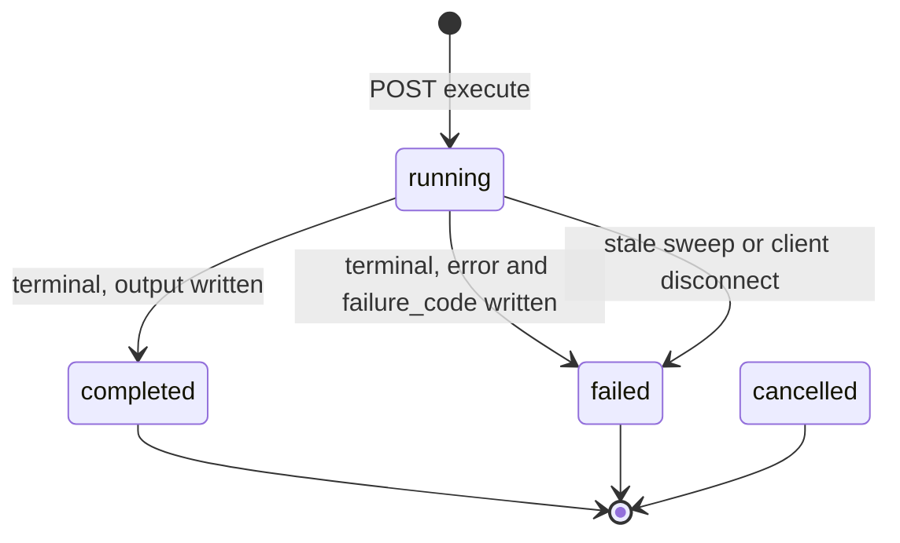
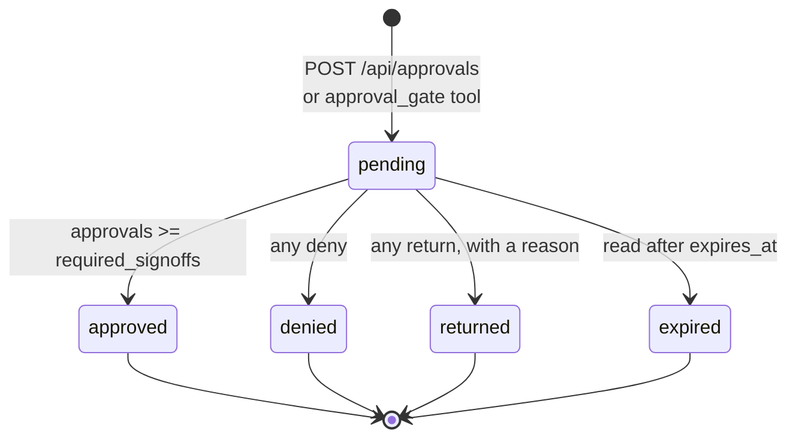
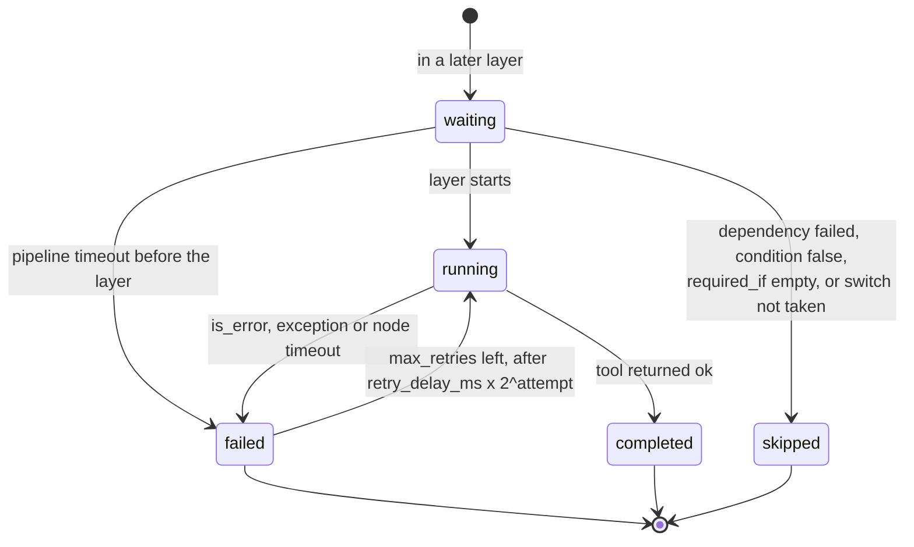
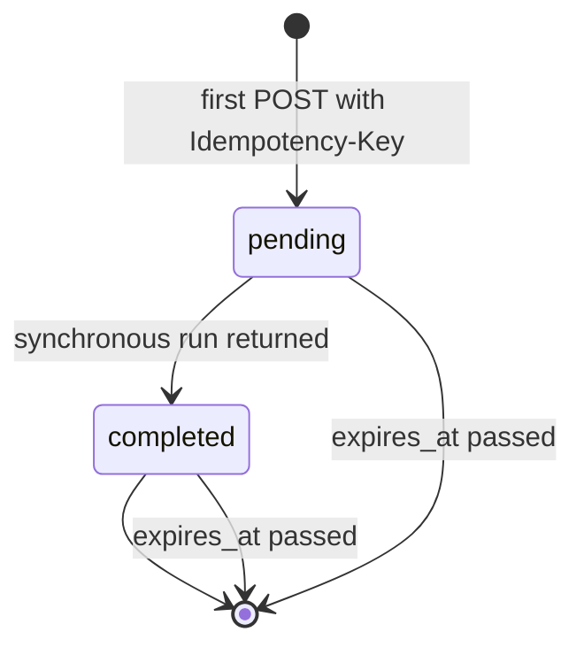
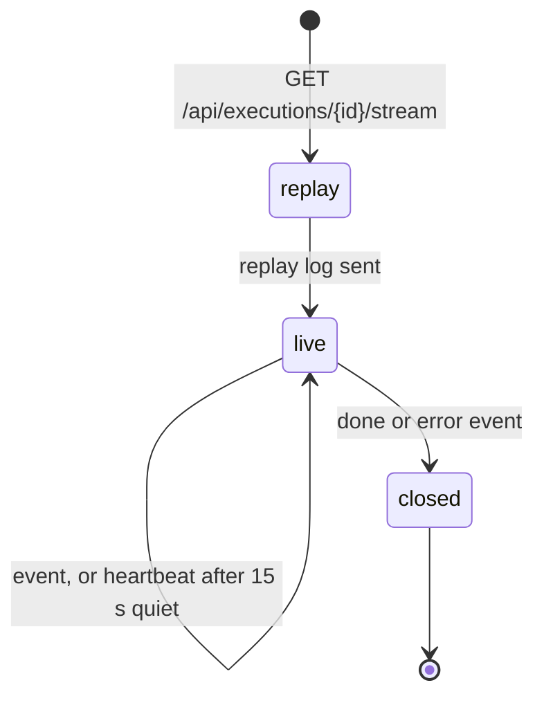

# State machines

> The long-lived things in this platform each carry a status column with a small set of legal values. Knowing them is how you debug "why is this execution stuck on running". This page collects them in one place, taken from the enums and the code that moves between them.

---

## Executions — the central FSM

Defined as `ExecutionStatus` in [`packages/db/models/execution.py`](../../packages/db/models/execution.py), Postgres enum `execution_status`.

| Status | Meaning |
|---|---|
| `running` | Created and queued, or picked up and in progress. There is no separate queued state. `started_at` is stamped when a runtime picks the row up |
| `completed` | The run returned. `output_message` is populated |
| `failed` | `error_message` and a `failure_code` are set. Governance refusals, moderation blocks, required-tool misses and non-completed pipelines all end here |
| `cancelled` | In the enum, and left out of usage counts, but nothing in the API sets it today. There is no cancel endpoint. `DELETE /api/executions/{id}` deletes the row, owner or admin only |

A run never goes back to `running`. Replays create a new row with `parent_execution_id` pointing at the old one.

### How an execution gets from running to terminal

1. **The runtime finishes.** The queue consumer, or the API on the inline path, writes the terminal status, output, tokens, cost, `risk_tier`, `risk_reasons`, `failure_code`, `tool_calls`, `node_results` and `execution_trace` in one update. See [00-agent-execution](00-agent-execution.md).
2. **The runtime raises.** The row is failed with `classify_exception(e)` as the code, and a `dead_letter_executions` row is written for replay.
3. **The client goes away.** A streaming run on the inline path whose client disconnects is failed with `CLIENT_DISCONNECTED`, if it is still `running`.
4. **The stale sweep.** Every 5 minutes the API scheduler job `sweep_stale_executions`, on one replica at a time through an advisory lock, finds `running` rows older than `STALE_EXECUTION_MAX_MINUTES` (default 10) by `created_at` whose runtime lease has lapsed or was never set. Rows whose execution has a `hitl:waiting:<id>` key in Redis are skipped, because they are waiting on an approval gate. The rest are failed with `STALE_SWEEP` and the owners are notified. If the Redis lookup fails, the sweep skips that tick.

So the longest a dead run shows as `running` is about the max age plus the 5 minute interval, unless it was waiting on a gate. A run whose pod is alive and renewing its lease is never swept, however old it is.

Every update that moves `status` to `completed` or `failed` fires the `executions_emit_event` trigger, which writes `execution.completed` or `execution.failed` to the event outbox. See [19-outbound-events](19-outbound-events.md).

### Failure codes

`failure_code` is an indexed string column. Alert rules and `/alerts` group on it.

Set directly by the code:

| failure_code | Set by | Meaning |
|---|---|---|
| `KILL_SWITCH` | runtime, pipeline engine | A kill switch covered the agent, model or pipeline at start |
| `MODEL_NOT_ALLOWED` | runtime | The model is not on the tier policy's `allowed_models` |
| `MODERATION_BLOCKED` | runtime | The moderation gate blocked input or output |
| `GROUNDING_REQUIRED_VIOLATION` | runtime | `knowledge_search` was required and never called |
| `REQUIRED_TOOLS_VIOLATION` | runtime, stream path | Another `require_tools` entry was never called |
| `SANDBOX_TIMEOUT` | runtime | The run's sandbox time budget ran out |
| `PIPELINE_NODE_FAILED` | consumer | A pipeline ended `partial` or `failed`, or the classifier was unavailable |
| `CLIENT_DISCONNECTED` | API | The streaming client left before the run finished |
| `STALE_SWEEP` | API scheduler | Stuck in `running` past the max age |
| `UNKNOWN_ERROR` | consumer | Nothing else matched |

Derived from an error message by `classify_exception` in [`apps/api/app/core/failure_codes.py`](../../apps/api/app/core/failure_codes.py), first match wins:

| failure_code | Matches |
|---|---|
| `STALE_SWEEP` | "stuck in running", "sweep … backfill", "owning process likely crashed" |
| `CONFIG_UNKNOWN_MODEL` | "unknown model", "unrecognised model", "unrecognized model" |
| `RATE_LIMITED` | Our own limits: `RATE_LIMITED`, "by its rate limit" (per-agent `rate_limit_qps`), "rate limit (per-…" (tool gate), "rate limit … user", "too many requests from", "over its limits". Checked before the provider rule, whose bare "rate limit" would match these too |
| `LLM_RATE_LIMIT` | "rate limit", "429", "too many", from the provider |
| `LLM_PROVIDER_ERROR` | Anthropic, OpenAI or Gemini error or exception |
| `LLM_INVALID_RESPONSE` | JSON decode errors, "invalid response", "expecting value" |
| `SANDBOX_OOM` | "oom kill", "memory limit exceeded" |
| `SANDBOX_TIMEOUT` | "deadline exceeded", "timeout", "timed out" |
| `SANDBOX_NONZERO_EXIT` | "exit code 1" and up, "non-zero exit" |
| `SANDBOX_IMAGE_BLOCKED` | "image not allowed", "allow list" |
| `MODERATION_BLOCKED` | "moderation blocked", "policy triggered", "content violation" |
| `KILL_SWITCH` | "stopped by a kill switch" |
| `MODEL_NOT_ALLOWED` | "not on the allowed list for … risk" |
| `TOOL_NOT_FOUND` | "tool not found", "unknown tool" |
| `TOOL_ERROR` | "ToolError", "tool error", "tool exception" |
| `BUDGET_EXCEEDED` | "budget", "quota", "insufficient credit", "spending limit". The daily caps set it directly on runs they refuse |
| `INFRA_CRASH` | "connection refused", "connection reset", "broken pipe", "server disconnect" |
| `LLM_AUTH_ERROR` | "authentication_error", "oauth access token", invalid or revoked API key |
| `INFRA_AUTH_ERROR` | "unauthorized", "forbidden", "401", "403" |

The text matched is `<ExceptionClassName>: <message>`, lowercased, so class names such as `ToolError` count too. Anything else is `UNKNOWN_ERROR`.

Every terminal outcome increments `abenix_execution_outcomes_total` and `abenix_executions_completed_total{status=success|failed}`. Failures also increment `abenix_executions_failed_total{failure_code}`, with `UNKNOWN` when the code is empty.

### Cost columns

`cost` is written on the terminal update. The per-provider columns `anthropic_cost`, `openai_cost`, `google_cost` and `other_cost` are written with it. An agent run splits by the model each LLM call used, a pipeline by each step's model. A writer that sets only the total gets it filed under the provider of `model_used`, through an ORM hook on `Execution`. While a run is going they hold their defaults, so a "spend this hour" view only counts finished runs. A long run adds its whole cost when it ends. A cost of 0 is written as 0, so NULL means it was never recorded.

---

## Approvals

Defined as `ApprovalStatus` in [`packages/db/models/approval.py`](../../packages/db/models/approval.py), Postgres enum `approval_status`: `pending`, `approved`, `denied`, `expired`, `returned`.

The interesting columns:

- `required_signoffs` — 1 to 10 on create, raised to the tier policy's `min_approvers` for tiered work.
- `signoffs` — JSONB array of `{user_id, user_email, decision, reason, at, self_approved, client_token?}`. `decision` is `approve`, `deny` or `return`.
- `expires_at` — set from `expires_seconds` (default 86400).
- `escalated_at` — set once when admins were told it was overdue. Escalation is a flag, not a status, so the row stays `pending`.
- `policy` — signing rules copied from the tier policy at create time.
- `client_token` — idempotency. A second create with the same `(tenant_id, client_token)` returns the first row.
- `gate_kind` — free-form discriminator. `decision_publish` rows drive decision versions, see [Decision service](20-decision-service.md).

### The signoff handler

`POST /api/approvals/{id}/signoff` with `{decision, reason, client_token}`:

1. `decision` must be `approve`, `deny` or `return`. `return` needs a non-empty `reason`. Otherwise 400.
2. A `client_token` already on one of the signoffs returns the row unchanged.
3. A row that is not `pending` gets 409 "Approval is already <status>".
4. The signer must pass `approver_denial`: admin or creator without a policy, the policy's capability with one, and not the requester when the policy excludes them. Otherwise 403.
5. A user who already signed gets 409.
6. The entry is appended and the status is worked out from the whole array: any `deny` gives `denied`, then any `return` gives `returned`, then enough `approve` entries give `approved`, then a passed `expires_at` gives `expired`, else `pending`.
7. On a move out of `pending`, `decided_at` is set, `approval.resolved` is emitted, a `decision_publish` row updates its decision version, and the requester and earlier signers are notified.

The handler reads the row, appends in Python and commits. It takes no row lock.

### Expiry

Expiry is applied when rows are read, not by a timer. `GET /api/approvals` moves every overdue pending row in the tenant to `expired` and emits `approval.resolved` for each. `GET /api/approvals/{id}` and `GET /api/approvals/{id}/wait` flip a single overdue row.

### Runs that wait on an approval

Nothing about a waiting run is persisted. The gate tool blocks inside the runtime and polls every 2 seconds. The execution stays `running`, and its `hitl:waiting:<id>` key keeps the stale sweep away. `human_approval` gates live in Redis, not in this table, with one decision and no `returned` state. See [05-approvals-hitl](05-approvals-hitl.md).

---

## Pipeline runs

A pipeline run is one execution row. Its node results are on that row, in `node_results` and `execution_trace`.

`waiting` and `running` are not stored. A stored node status is one of `completed`, `failed`, `skipped`, `timeout` (a `wait` node over its timeout) or `partial` (a `for_each` node where some items failed).

What a failure does next depends on `on_error`:

| `on_error` | Effect |
|---|---|
| `stop` | Dependents are skipped with "Dependency '<id>' failed". The node is in `failed_nodes` |
| `continue` | The node goes into `execution_path`, not `failed_nodes`. Dependents run and see `{__error_continue, error, status: failed}` |
| `error_branch` | The node is in `failed_nodes`, and `error_branch_node` runs after the layer |

The pipeline status:

| Status | When | Execution row |
|---|---|---|
| `completed` | `failed_nodes` is empty | `completed` |
| `partial` | Some node failed and at least one completed | `failed`, `PIPELINE_NODE_FAILED` |
| `failed` | Some node failed and none completed, or an unknown dependency, a cycle or a kill switch | `failed`, `PIPELINE_NODE_FAILED` or `KILL_SWITCH` |

A `continue` failure on its own leaves the pipeline `completed`. The pipeline status is kept on the row as `execution_trace.pipeline_status`. See [01-pipelines](01-pipelines.md).

---

## Pipeline patches (Surgeon)

`PipelinePatchStatus` in [`packages/db/models/pipeline_healing.py`](../../packages/db/models/pipeline_healing.py), on `pipeline_patch_proposals`:

| Status | Meaning |
|---|---|
| `pending` | Proposed, waiting for review |
| `accepted` | Applied to the pipeline |
| `rejected` | Turned down |
| `superseded` | A newer proposal replaced it |

See [10-pipeline-healing-drift](10-pipeline-healing-drift.md).

---

## Dead letters

`dead_letter_executions` ([`packages/db/models/dead_letter.py`](../../packages/db/models/dead_letter.py)) has no status enum. A row is written once per execution when the runtime raises, or when a queued agent run ends with a platform error such as an unknown model, with `failure_code`, `error_message` and the original input. Moderation blocks, grounding violations and missing required tools are not dead-lettered, a replay would fail the same way. The replay runs on the agent as it is now, so fix the cause first. `POST /api/admin/dlq/{id}/replay` dispatches a new execution, bumps `replay_count`, sets `replay_execution_id`, and sets `resolved` once the replay was dispatched.

---

## Idempotency — collapsing retries on the wire

`execution_idempotency` ([`packages/db/models/idempotency.py`](../../packages/db/models/idempotency.py)) has a unique `(tenant_id, key)`, a `status` string, `cached_response`, `execution_id` and `expires_at`. The execute handler, for non-streaming requests with an `Idempotency-Key` header:

1. Looks up the key. A row past `expires_at` (24 hours after insert) is deleted and treated as new.
2. A row with a `cached_response` returns it with `idempotent_replay: true`.
3. No row: inserts one with status `pending`. If a concurrent request inserted first, the insert is rolled back and the request carries on.
4. When a synchronous run returns, the response is stored as `cached_response`, with `execution_id` and status `completed`.

A retry that arrives while the first request is still `pending` has no cached response yet, so it runs again. Async (`wait: false`) responses are not cached. Streaming requests ignore the header.

---

## SSE event streams

The stream is not stored state. The runtime publishes each event to Redis channel `exec:events:<id>` and appends it to a replay log of the last 500 events, kept for an hour. A subscriber first gets the whole replay log, then live events, with a `heartbeat` event after each 15 seconds without one. The stream ends after a `done` or `error` event. There is no `Last-Event-ID` handling. A client that reconnects gets the replay log again. See [04-streaming-tracing](04-streaming-tracing.md).

---

## Knowledge base documents

`DocumentStatus` and `KBStatus` in [`packages/db/models/knowledge_base.py`](../../packages/db/models/knowledge_base.py):

| Status | Document | Knowledge base |
|---|---|---|
| `processing` | Being extracted, chunked and embedded | Something is still processing |
| `ready` | Searchable | Ready |
| `failed` | Processing failed, the reason is kept on the row | Failed |
| `degraded` | Text extracted and chunked, but no embeddings stored because the embedding provider was unavailable. Not semantically searchable until re-embedded | At least one document is degraded |

---

## Atlas snapshots

`atlas_snapshots` rows have no status. Each is a numbered `version` of a graph with its `payload`, a `label`, `created_by` and an `auto` flag, unique per graph and version. See [06-atlas-knowledge-engine](../01-architecture/06-atlas-knowledge-engine.md).

---

## Other state machines

- **Decision versions** move through their own states, with publishing gated by a `decision_publish` approval. See [Decision service](20-decision-service.md).
- **Watched sources** record a `last_status` per check. See [17-source-watch](17-source-watch.md).
- **Evaluation runs** are `queued`, `running`, `completed`, `failed` or `cancelled`. See [18-evaluation-suites](18-evaluation-suites.md#runs).
- **Webhook deliveries** are `pending`, `retrying`, `delivered` or `dead`. See [19-outbound-events](19-outbound-events.md#retries-dead-letters-and-replay).

---

## Common questions about FSMs

**Q: Can an execution go from `failed` back to `running`?**
No. Terminal is terminal. A replay or a dead-letter replay creates a new execution.

**Q: Can an approval go from `denied` to `approved`?**
No. Create a new approval. The old row stays as history.

**Q: A pipeline execution is `failed` but has output. Did anything work?**
Look at `execution_trace.pipeline_status`. `partial` means some nodes completed. `node_results` has each node's error.

**Q: An execution has been `running` for an hour. What now?**
Check Redis for `hitl:waiting:<id>`. If it is there the run is waiting on an approval, see `/approvals`. If not, check `lease_expires_at`. A live lease means a runtime pod still owns the run. Otherwise the sweeper should fail it within about 10 to 15 minutes, so check that the API scheduler is running.

**Q: Two clients sent the same `Idempotency-Key` at the same time. Which wins?**
The first insert wins. The second sees no cached response yet and runs too. Only a retry after the first run returned gets the cached response.

---

## See also

- [00-agent-execution](00-agent-execution.md) — what happens inside the `running` state
- [05-approvals-hitl](05-approvals-hitl.md) — the approval gate side
- [04-streaming-tracing](04-streaming-tracing.md) — SSE bridge details
- [01-pipelines](01-pipelines.md) — pipeline-specific transitions

---

## Source map

| What | Where |
|---|---|
| **Execution FSM** | [`packages/db/models/execution.py`](../../packages/db/models/execution.py) — `ExecutionStatus` |
| **Terminal writes** | [`apps/agent-runtime/consumer.py`](../../apps/agent-runtime/consumer.py) — `_mark_done` |
| **Stale sweep** | [`apps/api/app/core/scheduler.py`](../../apps/api/app/core/scheduler.py) — `sweep_stale_executions` |
| **Approval FSM** | [`packages/db/models/approval.py`](../../packages/db/models/approval.py) — `ApprovalStatus`. Handler in [`apps/api/app/routers/approvals.py`](../../apps/api/app/routers/approvals.py) — `sign_off`, `_evaluate_status`, `_expire_stale` |
| **Pipeline node and run status** | [`apps/agent-runtime/engine/pipeline.py`](../../apps/agent-runtime/engine/pipeline.py) — `NodeResult`, `PipelineResult` |
| **Pipeline patch FSM (Surgeon)** | [`packages/db/models/pipeline_healing.py`](../../packages/db/models/pipeline_healing.py) — `PipelinePatchStatus` |
| **Idempotency** | [`packages/db/models/idempotency.py`](../../packages/db/models/idempotency.py), handler in [`apps/api/app/routers/agents.py`](../../apps/api/app/routers/agents.py) |
| **Dead letters** | [`packages/db/models/dead_letter.py`](../../packages/db/models/dead_letter.py), [`apps/api/app/routers/admin_dlq.py`](../../apps/api/app/routers/admin_dlq.py) |
| **Failure-code taxonomy** | [`apps/api/app/core/failure_codes.py`](../../apps/api/app/core/failure_codes.py) |
| **SSE bridge** | [`apps/api/app/core/execution_bus.py`](../../apps/api/app/core/execution_bus.py) |
| **KB statuses** | [`packages/db/models/knowledge_base.py`](../../packages/db/models/knowledge_base.py) |
