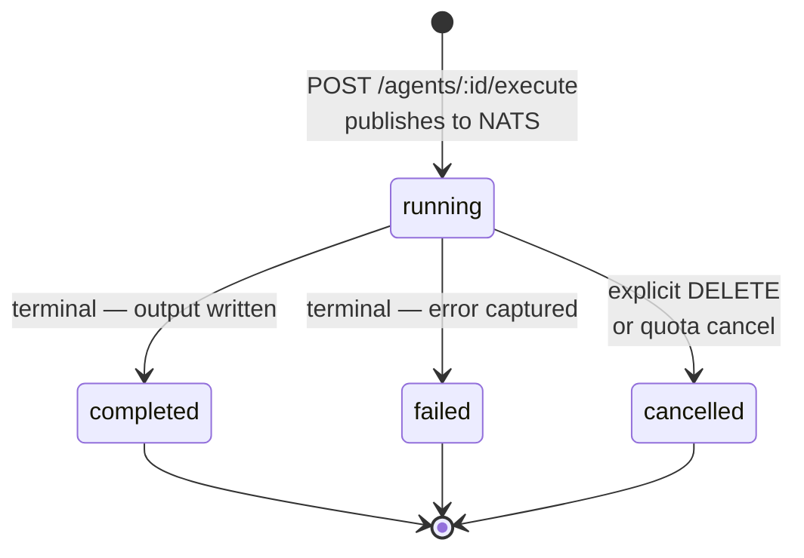
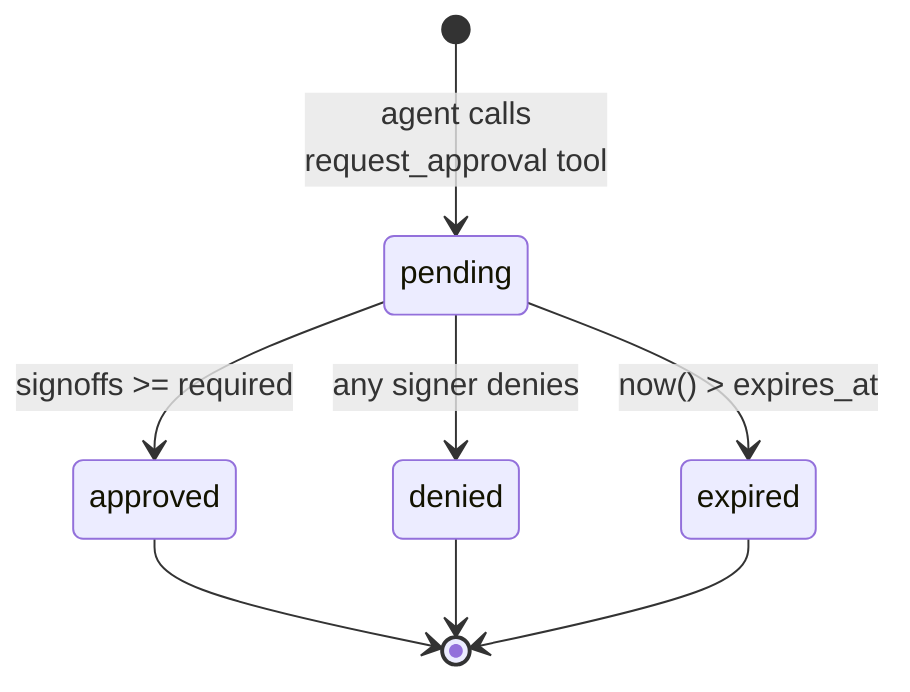
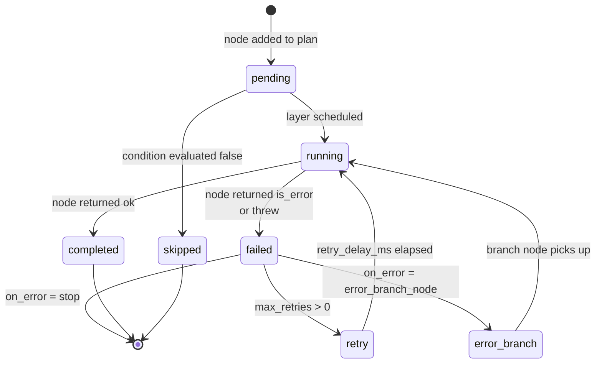
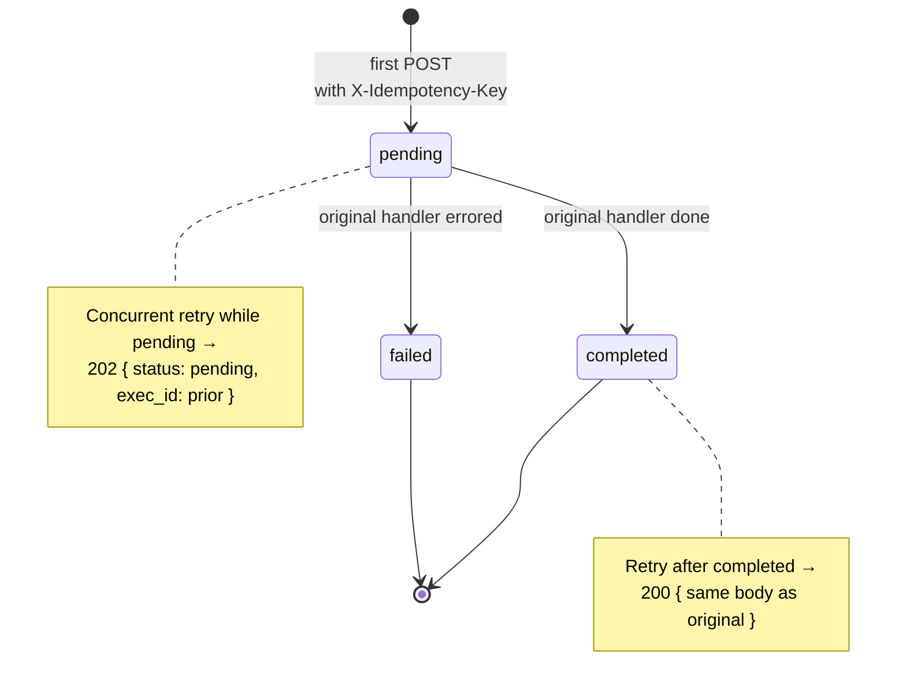
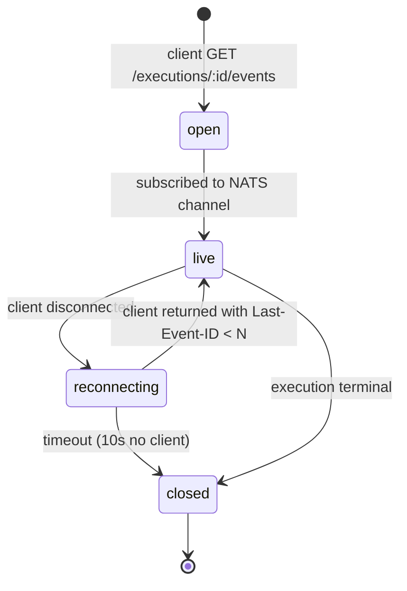
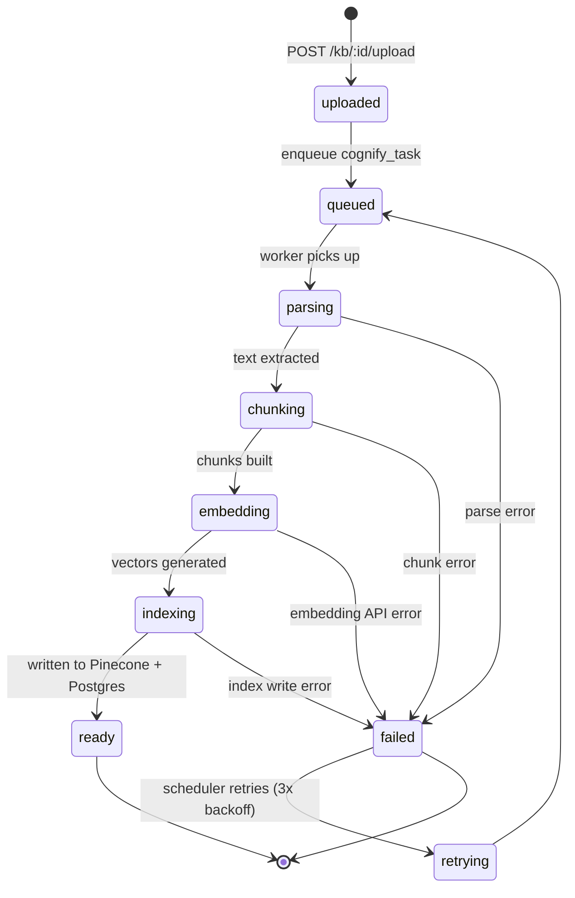
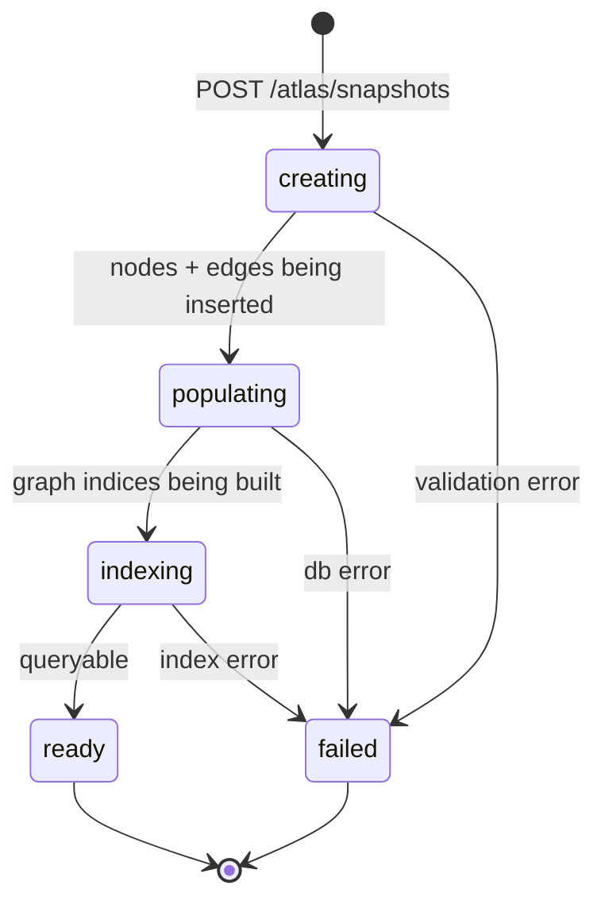

# State machines

> Every long-lived thing in this platform has a finite-state machine on top of it. Knowing the FSMs is the only way to debug "why is this execution stuck on running for 4 days" with confidence. This page collects them in one place.

---

## Executions — the central FSM



Defined as `ExecutionStatus` in [`packages/db/models/execution.py`](../../packages/db/models/execution.py).

Four values. Three terminal. One transient.

| Status | Meaning | Wall clock |
|---|---|---|
| `running` | Picked up by a runtime pod, ReAct loop in progress, or pending pickup. | Created → ack by runtime → first LLM call |
| `completed` | Status set on successful return from the runtime. `output_message` is populated. | Bounded by `max_execution_seconds` (default 600). |
| `failed` | Error captured. `failure_code` is one of the taxonomy values below. | Same bound — failures still hit it. |
| `cancelled` | User-initiated `DELETE` or system-initiated quota cancel. | Immediate. |

### How an execution gets from running → terminal

Three paths.

1. **Normal completion** — runtime finishes the ReAct loop, writes `output_message`, marks status. Most executions.
2. **Failure with code** — runtime catches the exception, maps it to a `failure_code`, marks status `failed`. The runtime tries hard to attribute every failure to a stable, queryable code (see below).
3. **Stuck-running sweep** — every 60s, a Celery beat job (`worker.tasks.sweepers.expire_running_executions`) looks for `running` rows older than `RUNNING_EXECUTION_TTL` (default 1800s). It marks them `failed` with `failure_code = 'sweeper_stuck'`. This catches the rare case where a runtime pod crashed mid-execution before NATS redelivered.

Without the sweeper, a pod death between "started" and "wrote terminal status" would leave executions running forever. With it, the maximum visible "running" age is `running_ttl + sweeper_interval ≈ 30min`.

### Failure code taxonomy

`failure_code` is an indexed string column. The taxonomy is intentional — alert rules group on it.

| failure_code | Source | Meaning |
|---|---|---|
| `llm_timeout` | runtime | LLM provider call did not return within agent's per-call timeout |
| `llm_rate_limit` | runtime | provider returned 429 even after exponential retry |
| `llm_invalid_response` | runtime | response shape did not match the agent's structured-output schema |
| `tool_timeout` | runtime | a tool call exceeded its per-call timeout |
| `tool_error` | runtime | a tool returned `is_error=true` and the agent didn't recover |
| `iteration_limit` | runtime | max_iterations hit before the LLM emitted a `final` action |
| `moderation_blocked` | runtime | content moderation gate fired |
| `sandbox_violation` | runtime | a tool tried to escape the sandbox (network domain not whitelisted) |
| `cancelled_by_user` | API | explicit cancel |
| `cancelled_by_quota` | API | tenant exceeded daily execution cap mid-run |
| `sweeper_stuck` | beat | sweeper rescued a row stuck in running |
| `agent_not_found` | API | slug typo at submission time |
| `permission_denied` | API | RBAC check failed at submission |
| `internal_error` | anywhere | uncategorised — should be rare. Investigate every occurrence. |

The `/alerts` page (and the underlying Grafana alert) groups by `failure_code` so an outage from one cause does not drown out unrelated noise.

### Cost ledger transitions

The cost columns (`anthropic_cost`, `openai_cost`, `google_cost`, `other_cost`, `cost`) are only written on terminal transitions. Mid-execution, they are zero. This means the live "spend this hour" metric is approximate — it sums *terminal* executions in the window. Long-running executions show as zero until they finish, then add their full cost at terminal time.

The trigger that re-checks per-tenant daily caps fires on every terminal write. If the cap is crossed inside one large execution, the next `POST /execute` for that tenant fails with `cancelled_by_quota`. The over-budget execution itself is allowed to finish — we never abort mid-run on cost alone.

---

## Approvals — multi-signoff with expiry



Defined as `ApprovalStatus` in [`packages/db/models/approval.py`](../../packages/db/models/approval.py). The interesting columns:

- `required_signoffs: int` — usually 1, can be 2 or 3 for high-stakes gates.
- `signoffs: jsonb` — append-only array of `{user_id, decision, decided_at, comment}`.
- `expires_at: timestamptz | null` — if set, the cron at midnight UTC flips overdue rows to `expired`.
- `client_token: string | null` — idempotency token. Two requests with the same `(tenant_id, client_token)` collapse to a single approval row.
- `gate_kind: string | null` — free-form discriminator. UIs filter on this to show "all device.remote_reset approvals" or similar.

### Multi-signoff race

When `required_signoffs > 1`, two reviewers can race. The handler in `POST /approvals/{id}/decision` uses an optimistic-concurrency pattern:

```sql
UPDATE approvals
SET signoffs = signoffs || $new_signoff,
    status = CASE
      WHEN jsonb_array_length(signoffs || $new_signoff) >= required_signoffs
        AND $decision = 'approved' THEN 'approved'
      WHEN $decision = 'denied' THEN 'denied'
      ELSE 'pending'
    END,
    decided_at = CASE
      WHEN ... THEN NOW() ELSE decided_at
    END
WHERE id = $approval_id
AND NOT EXISTS (SELECT 1 FROM jsonb_array_elements(signoffs) e WHERE e->>'user_id' = $user_id)
RETURNING *;
```

The `NOT EXISTS` guard makes the second simultaneous signoff from the same user a no-op — returns 0 rows, handler returns 409. The atomic `||` append ensures both signoffs are recorded even if they arrive 1ms apart. A single denial flips the status — no other signoff can revive it.

### Pause and resume — what backs it

When an agent calls `request_approval` mid-execution, the runtime does **not** spin and wait. It writes a pause-state row and exits the pod.

```
executions.status = 'running'           (unchanged)
executions.pause_state = jsonb          (full ReAct loop state + agent input)
approvals.status = 'pending'
approvals.agent_execution_id = <exec_id>
```

The pod is freed. The execution stays `running` in the FSM (it has not failed and has not completed). On approval, an API handler reads the pause_state, repackages it as a NATS message, and re-publishes — a fresh pod picks it up and resumes from the saved state.

This is the only legal in-flight state that lives across pod restarts. Nothing else in the runtime persists ReAct state.

---

## Pipeline executions — derived FSM

A pipeline run is itself an execution row (agent_id points to a synthetic pipeline-agent). But the run produces additional state in `pipeline_step_runs`, one row per node executed.



The terminal states per-node are: `completed`, `failed`, `skipped`, `timeout`. The overall pipeline status is derived:

- `completed` if all non-skipped nodes are `completed`.
- `partial` if any non-skipped node is `failed` *and* `on_error: continue` was set.
- `failed` if any non-skipped node is `failed` with `on_error: stop`.

`partial` is treated as a successful run from the SDK's perspective (output is populated, errors are in `node_errors`). It is a hint to consumers — "look at the report, but be aware some branches did not run."

---

## Idempotency — collapsing retries on the wire



`execution_idempotency` row carries `(tenant_id, key)` unique constraint and a `response_body` JSONB. The handler:

1. Try `INSERT ... ON CONFLICT (tenant_id, key) DO NOTHING RETURNING id` — wins if first.
2. If conflict (row already exists), read the row.
   - `status = pending` → return 202 with the original execution_id. Same execution is in flight.
   - `status = completed` or `failed` → return the stored response verbatim. Same status code.
3. If win, set status = pending, run the handler, write response back, set status terminal.

This is what lets a flaky network retry the same `POST /agents/:id/execute` and not double-count. The key is supplied by the SDK as `client_token`, defaulting to an SDK-generated UUID per call. Standalone apps usually set a stable token derived from their own request ID so multiple SDK calls in one transaction collapse correctly.

Expiry: `expires_at` defaults to 24h from insert. After that, the row is considered free and a new POST with the same key creates a fresh execution.

---

## Connection lifecycle — SSE streams



SSE is not a state machine on the *server*'s data — it is a stream over a still-running execution. But the bridge has its own short-lived FSM. Events the bridge emits:

- `open` → initial connect
- `live` → first event received
- `reconnecting` → client dropped (TCP close), bridge holds for 10s
- `closed` → either execution finished or client gave up

If the client sends `Last-Event-ID` on reconnect, the bridge replays from the event store's persisted tail (last 100 events per execution). After 100 events, replay is best-effort — clients that lag by more than that should poll `/executions/:id` instead and accept they missed live ticks.

---

## Knowledge bases — ingestion FSM

A KB document goes through a multi-step ingestion pipeline.



State is stored in `kb_documents.status`. Failures collect a `failure_reason` string. The retry policy is: 3 retries with exponential backoff (30s, 2min, 10min). After that, `status = failed` is terminal — re-upload to retry.

A common operator question: why is my KB stuck in `embedding`? Almost always because the OpenAI / Cohere embedding API is rate-limiting and the retry budget hasn't fired yet. Wait two minutes, refresh.

---

## Atlas snapshots — graph build FSM



The interesting bit is that snapshots are **immutable once `ready`**. You can mark one as the active snapshot (read by the UI), but you cannot edit it. Edits create a new snapshot. This is what enables "go back to last week's graph for comparison" without conflict-resolving every concurrent edit.

---

## Common questions about FSMs

**Q: Can an execution go from `failed` back to `running`?**
No. Terminal is terminal. To rerun, submit a new execution (with or without an idempotency key).

**Q: Can an approval go from `denied` to `approved`?**
No. Re-approve by creating a new approval row. The old row stays as audit.

**Q: A pipeline shows `partial`. Did it succeed?**
It produced output, some nodes failed but `on_error: continue` was set. Check `node_errors`. Probably you want to alert on this.

**Q: An execution has been `running` for 6 hours. What now?**
Either the agent is genuinely doing something (rare — most agents are sub-minute), or a runtime pod died and the sweeper hasn't caught up yet. If `started_at` is in the last 30 minutes, wait. If older, the sweeper is misbehaving — investigate.

**Q: Two clients sent the same `client_token` simultaneously. Which wins?**
The first INSERT wins (Postgres serialises). The second sees the existing pending row and returns the same execution_id. Both clients end up watching the same SSE stream.

---

## See also

- [00-agent-execution](00-agent-execution.md) — what happens inside the `running` state
- [05-approvals-hitl](05-approvals-hitl.md) — the approval gate UX side
- [04-streaming-tracing](04-streaming-tracing.md) — SSE bridge details
- [01-pipelines](01-pipelines.md) — pipeline-specific transitions

---

## Source map

| What | Where |
|---|---|
| **Execution FSM** | [`packages/db/models/execution.py`](../../packages/db/models/execution.py) — `ExecutionStatus` enum |
| **Approval FSM** | [`packages/db/models/approval.py`](../../packages/db/models/approval.py) — `ApprovalStatus` enum |
| **Pipeline patch FSM (Surgeon)** | [`packages/db/models/pipeline_healing.py`](../../packages/db/models/pipeline_healing.py) — `PipelinePatchStatus` enum |
| **Idempotency FSM** | [`packages/db/models/idempotency.py`](../../packages/db/models/idempotency.py) — `ExecutionIdempotency` |
| **Dead-letter FSM** | [`packages/db/models/dead_letter.py`](../../packages/db/models/dead_letter.py) — `DeadLetterExecution` |
| **Failure-code taxonomy** | [`apps/api/app/core/failure_codes.py`](../../apps/api/app/core/failure_codes.py) — canonical strings |
| **Pause/resume on approval** | [`apps/agent-runtime/engine/agent_executor.py`](../../apps/agent-runtime/engine/agent_executor.py) — search for `pause_state` |
