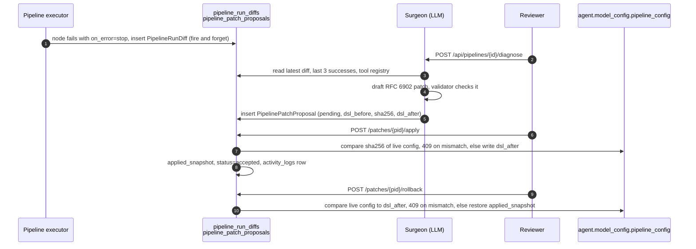

# Pipeline self-healing + drift detection

Two failure-recovery systems sit on top of the agent runtime:

1. **Pipeline Surgeon** turns a node crash inside a pipeline run into a structured failure diff, drafts a JSON-Patch against the pipeline DSL on request, and waits for a human to apply it. Nothing is auto-applied and nothing is auto-drafted.
2. **Drift detection** compares each completed execution against a rolling per-agent baseline (latency, tokens, cost, confidence, output length, tool failure rate) and writes a `drift_alerts` row when a metric moves more than 2σ.

Both are tenant-scoped. Patch decisions leave an `activity_logs` row.

## Where the code lives

| Piece | File |
|---|---|
| Failure capture (runs inside the pipeline executor) | `apps/agent-runtime/engine/healing.py` |
| Surgeon prompt, patch validator | `apps/agent-runtime/engine/pipeline_surgeon.py` |
| Tool registry listing the Surgeon is bounded by | `apps/agent-runtime/engine/tool_resolver.py` (`get_default_registry_descriptions`) |
| Drift detector | `apps/agent-runtime/engine/drift_detection.py` |
| Healing API | `apps/api/app/routers/pipeline_healing.py` |
| Drift API | `apps/api/app/routers/analytics.py` |
| Drift call sites + alert persistence | `apps/api/app/routers/agents.py` (`_persist_drift_alerts`, `_drift_enabled`) |
| Tables | `packages/db/models/pipeline_healing.py`, `packages/db/models/drift_alert.py` |
| UI | `apps/web/src/app/(app)/agents/[id]/healing/page.tsx`, drift section on `/analytics` |

## Pipeline Surgeon

### Routes

All under `/api/pipelines`, registered in `apps/api/app/main.py`. `{pipeline_id}` is the agent id of a pipeline-type agent. A bad UUID returns 404, a bad `?status` returns 400.

| Verb | Path | Who | Purpose |
|---|---|---|---|
| `GET` | `/api/pipelines/{pipeline_id}/diffs?limit=` | any tenant user | captured failure diffs, newest first. `meta.can_edit` says whether the caller may act |
| `GET` | `/api/pipelines/{pipeline_id}/patches?status=` | any tenant user | proposals. `meta.can_edit`, `meta.user_id` drive the UI buttons |
| `POST` | `/api/pipelines/{pipeline_id}/diagnose` | admin or owner | run the Surgeon on the latest diff (or `execution_id` in the body) |
| `POST` | `/api/pipelines/{pipeline_id}/patches/{patch_id}/apply` | admin or owner | compare-and-swap write of `dsl_after` |
| `POST` | `/api/pipelines/{pipeline_id}/patches/{patch_id}/reject` | admin or owner | mark rejected |
| `POST` | `/api/pipelines/{pipeline_id}/patches/{patch_id}/rollback` | admin, owner or the approver (`decided_by`) | compare-and-swap restore of the snapshot apply took |

Owner means `agents.creator_id`. Cross-tenant ids return 404.

### What gets captured in a failure diff

`engine/pipeline.py` calls `healing.capture_failure` when a node fails and its `on_error` is `stop` (the default). Nodes with `on_error: continue` or an error branch are not captured. Capture is fire-and-forget and needs the executor to have `db_url`, `tenant_id` and `agent_id` set, which the API and worker paths do.

Stored on `pipeline_run_diffs`:

- `node_id`, `node_kind` (`tool` or `agent`), `node_target` (tool name or agent slug)
- `error_class`, `error_message`, `error_traceback`
- `observed_shape` and `observed_sample`: the failing node's output, shape is a cheap recursive type signature, not a JSON Schema
- `expected_shape` and `expected_sample`: derived from `last_success_sample`
- `upstream_inputs`: outputs of the nodes this one depends on
- `recent_success_count`, `recent_failure_count`: completed and failed executions of the pipeline in the last 24h

`capture_failure` accepts `last_success_sample` and `error_traceback` (or `exc`, from which it formats the traceback). The call site in `pipeline.py` currently passes neither, so `expected_*` is null and `error_traceback` is null on every row today. Wiring those two arguments is the open item on the executor side.

DLP redaction runs before insert on `observed_sample`, `expected_sample`, `upstream_inputs`, `error_message` and `error_traceback`. It uses the patterns in `engine/dlp.py` (email, US phone, SSN, card number, IP, AWS keys, generic API keys, bearer tokens) applied to every string leaf and key. Samples are then truncated to 8 KB, inputs to 4 KB, tracebacks to 4 KB.

### What the Surgeon is given

- `dsl`: `{"pipeline_config": <agent.model_config.pipeline_config>}`. Nodes live at `pipeline_config.nodes`, so every JSON Pointer starts with `/pipeline_config/nodes/<index>`
- `failure`: the diff row
- `recent_successes`: id, duration and a 600 char output preview of the last 3 completed runs
- `tool_registry`: name and description of every built-in tool class. If the registry cannot be loaded the request fails with 500 rather than drafting blind

The model comes from the platform setting `pipeline_surgeon.model`.

### What a patch may do

The validator in `pipeline_surgeon.validate_patch` runs on every proposal before it is stored. It is an allow-list:

- ops: `add`, `replace`, `test` only, at most 8
- paths: under `/pipeline_config/nodes/<index>` only. The whole node list, pipeline-level keys and anything outside `pipeline_config` are off limits
- no node removal, no node id change, no change of a node's kind (`tool`, `agent`, `structured`)
- entry nodes (no `depends_on`) and exit nodes (nothing depends on them) must be the same set before and after. A new node may be inserted in the middle of the graph
- every `tool` / `tool_name` must be in the registry passed in, or one of the engine-internal names (`agent_step`, `wait`, `state_get`, `state_set`, `__structured__`)
- no dangling `depends_on`, no cycles

A rejected proposal returns 422 from `/diagnose` with the reason. Nothing is written.

### Confidence and risk

- `confidence`: 0.0 to 1.0, clamped. The reviewer sees it, the API does not act on it
- `risk_level`: `low`, `medium`, `high`. Anything the model returns outside those three is stored as `high`

### Apply, reject, rollback

`diagnose` stores `dsl_before_sha256`, the sha256 of the canonical JSON of the live `pipeline_config` at draft time.

- `apply` recomputes the hash of the live config. Mismatch returns 409 `stale_patch` and nothing changes. On match it writes `dsl_after.pipeline_config`, stores the replaced config in `applied_snapshot`, sets `accepted`, `decided_by`, `decided_at`
- `reject` sets `rejected`, `decided_by`, `decided_at`
- `rollback` requires the live config to still hash to `dsl_after.pipeline_config`, else 409 `stale_rollback`. On match it restores `applied_snapshot` (falls back to `dsl_before.pipeline_config` for rows older than the snapshot column) and sets `rolled_back_at`, `rolled_back_by`. Status stays `accepted`

Each of the three writes an `activity_logs` row through `app.core.audit.log_action` with action `pipeline_patch.applied`, `pipeline_patch.rejected` or `pipeline_patch.rolled_back`, the patch id, title and the before/after hashes.

Drafting a new proposal marks any older pending proposals on the same pipeline `superseded`.

### Schema

| Table | Notes |
|---|---|
| `pipeline_run_diffs` | one row per captured node failure |
| `pipeline_patch_proposals` | `dsl_before`, `json_patch`, `dsl_after`, `dsl_before_sha256`, `applied_snapshot`, status enum `pending/accepted/rejected/superseded` |

Migration `1100_f_patch_cas` adds the two compare-and-swap columns. `packages/db/bootstrap_schema.sql` carries them too.

### UI

`/agents/{id}/healing` lists failures, pending proposals, applied patches and history. Apply and Reject show only when `meta.can_edit` is true. Roll back shows for `can_edit` or when the viewer is the approver. A failed load shows the error and a retry, it no longer reads as "no failures". There is no dashboard widget and drift does not appear on `/alerts`.

## Drift detection

There is no scheduler. Detection runs inline in the API process right after an execution completes, in the three execution paths in `routers/agents.py` (streamed, non-streamed, non-streamed pipeline). Runs completed by the queue worker are not scored.

### Toggles

Most specific wins:

1. `agent.model_config.drift_detection: false` turns it off for one agent
2. Redis key `drift:config:enabled:{tenant_id}`, set through `PUT /api/analytics/drift-alerts/config` (admin only)
3. env `DRIFT_DETECTION_ENABLED` (default on)

### Metrics and thresholds

Each metric is compared as a z-score against the baseline mean and population std dev. Warning at 2σ, critical at 3σ.

The sigma used is `max(std, 0.10 * |baseline|, eps)` with a per-metric `eps`, so a flat baseline cannot make noise look like drift, and 0..1 metrics or sub-cent costs can still alert.

| Metric | Source | eps |
|---|---|---|
| `duration_ms` | execution duration | 50 |
| `input_tokens` | summed over nodes | 20 |
| `output_tokens` | summed over nodes | 20 |
| `cost` | summed over nodes, USD | 0.0005 |
| `confidence` | execution confidence (pipelines report 1.0) | 0.02 |
| `output_length` | `len(output_message)` | 20 |
| `tool_failure_rate` | failed tool calls / total tool calls | 0.02 |

Thresholds are constructor arguments on `DriftDetector`, not a tenant setting.

### Baseline

- Each execution is pushed to Redis `drift:recent:{agent_id}` (last 100, 7 day TTL)
- The first baseline is computed once that list has 10 samples and stored at `drift:baseline:{agent_id}` (30 day TTL)
- The baseline is rolling. Every 10 recorded samples it is recomputed:
  - from the `executions` table over the prior 7 days of completed runs when `DATABASE_URL` is set and at least 10 rows exist. `tool_failure_rate` is not on that table so it keeps the Redis window value
  - otherwise from the Redis window, blended into the old baseline as an EMA with alpha 0.3

The DB path is preferred because it sees every completed run, including worker runs, and survives Redis restarts. The EMA path exists so detection still works with Redis alone.

### Alerts

`_persist_drift_alerts` in `routers/agents.py` writes one `drift_alerts` row per metric that crossed a threshold, with `agent_id`, `execution_id`, `severity`, `metric`, `baseline_value`, `current_value`, `deviation_pct`, `acknowledged`.

Acknowledging sets the flag on that row only. It does not suppress future alerts for the same condition. There is no Slack or email fan-out for drift.

| Verb | Path | Who | Purpose |
|---|---|---|---|
| `GET` | `/api/analytics/drift-alerts?agent_id=&severity=&acknowledged=&limit=` | any tenant user | list |
| `POST` | `/api/analytics/drift-alerts/{id}/acknowledge` | any tenant user | mark reviewed, 404 if missing |
| `GET` | `/api/analytics/drift-alerts/config` | any tenant user | effective flag plus the global and tenant values |
| `PUT` | `/api/analytics/drift-alerts/config` | admin | set the tenant override |

## Tests

- `tests/unit/test_drift_detector.py`: sigma floor lets 0..1 metrics and small costs alert, noise does not, baseline is captured then refreshed, DB path wins when available
- `tests/unit/test_pipeline_surgeon.py`: patch applies to the real shape, removal, unknown tool, cycle, entry/exit and id changes are rejected, unknown risk reads as high
- `tests/unit/test_healing_capture.py`: redaction walks nested samples, traceback fallback

## Related

- [`02-runtime/01-pipelines.md`](01-pipelines.md), the DAG engine
- [`02-runtime/05-approvals-hitl.md`](05-approvals-hitl.md), HITL framework (the Surgeon does not use it, approval is the apply endpoint)
- [`04-data-model/00-overview.md`](../04-data-model/00-overview.md)
