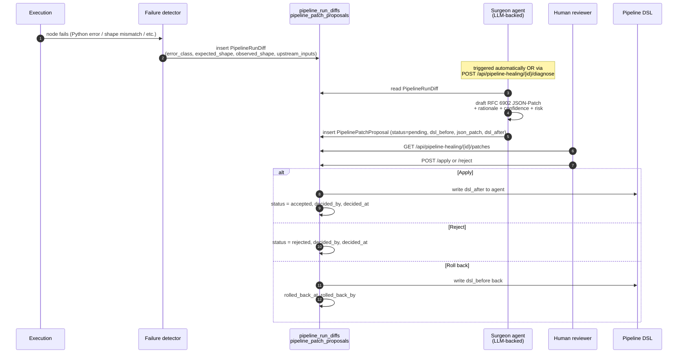

# Pipeline self-healing + drift detection

Two related failure-recovery systems sit on top of the agent runtime:

1. **Pipeline Surgeon** turns a single node crash inside a pipeline run into a structured failure-diff, drafts a JSON-Patch against the pipeline's DSL, and waits for human approval before applying it. Nothing is auto-applied.
2. **Drift detection** compares this-week-vs-last-week production metrics (cost, latency, failure rate, token usage, tool-mix) at the agent level and raises typed alerts when behaviour shifts beyond a threshold.

Both are observable, both are tenant-scoped, both leave an audit trail.

## Pipeline Surgeon — the loop

### What lives where

| Concept | Table | Notes |
|---|---|---|
| The crash, structurally captured | `pipeline_run_diffs` | error class, traceback, expected vs observed shape, sample inputs, recent success/failure counts |
| The proposed fix | `pipeline_patch_proposals` | RFC 6902 JSON-Patch, `dsl_before`, `dsl_after`, confidence, risk_level, status |
| The audit | `activity_log` | one row per apply / reject / rollback |

### The routes

| Verb | Path | Purpose |
|---|---|---|
| `GET` | `/api/pipeline-healing/{pipeline_id}/diffs` | list captured failure diffs for a pipeline |
| `GET` | `/api/pipeline-healing/{pipeline_id}/patches` | list pending and historic patches |
| `POST` | `/api/pipeline-healing/{pipeline_id}/diagnose` | manually trigger the Surgeon on a specific failed run |
| `POST` | `/api/pipeline-healing/{pipeline_id}/patches/{patch_id}/apply` | apply the patch — writes `dsl_after` to the pipeline |
| `POST` | `/api/pipeline-healing/{pipeline_id}/patches/{patch_id}/reject` | reject the patch — keeps the diff for the next attempt |
| `POST` | `/api/pipeline-healing/{pipeline_id}/patches/{patch_id}/rollback` | reverts an accepted patch by writing `dsl_before` back |

### What gets captured in a failure diff

When a pipeline node fails, the runtime captures more than the traceback:

- `error_class`, `error_message`, `error_traceback`
- **Shape diff**: `expected_shape` (what downstream nodes were promised) vs `observed_shape` (what actually arrived). Both are JSON schemas the runtime infers from the upstream nodes and the failing call site.
- **Sample data**: `expected_sample` (what the runtime expected) vs `observed_sample` (the actual payload at the point of failure). Sensitive fields are redacted by the DLP gate before storage.
- **Upstream context**: `upstream_inputs` — the keys the failing node received from its parents in the DAG.
- **Recent base rate**: `recent_success_count` vs `recent_failure_count` for the same node in the last N runs. A patch proposed against a node that just flapped twice in 50 runs gets a lower confidence than one against a node that's failed 10 in a row.

This is the raw material the Surgeon uses to draft a patch.

### What the Surgeon can patch — and what it can't

The Surgeon is allowed to draft patches that:

- Change a tool's input mapping or default values.
- Add a `transform` step before a downstream node when the upstream shape changed.
- Adjust retry / timeout config on a node.
- Add a fallback branch to a `switch` node when a new input value appears.

It is **not** allowed to draft patches that:

- Delete entire nodes or branches.
- Change the pipeline's input or output contract.
- Add new tools that the tenant hasn't already configured.
- Lower the moderation policy or retention floor.

These guardrails are enforced both in the Surgeon's system prompt and post-hoc on the proposed `dsl_after` before it gets written to `pipeline_patch_proposals`.

### Confidence and risk

Every proposal carries:

- `confidence` — 0.0 to 1.0, the Surgeon's own estimate of "this patch makes the run succeed". Below 0.3 the UI marks it as low-confidence by default.
- `risk_level` — `low` / `medium` / `high`. Inferred from blast radius (single node vs. multi-node), data-loss potential, and whether the change crosses a security boundary.

The UI surfaces both. A reviewer can apply a low-confidence patch — the audit row records that they did.

### Rollback

`POST /api/pipeline-healing/{pipeline_id}/patches/{patch_id}/rollback` writes `dsl_before` back to the pipeline. The rolled-back patch keeps its `accepted` status; new fields `rolled_back_at` and `rolled_back_by` distinguish "was applied, was rolled back" from "was rejected outright".

Only the user who originally approved the patch — or a tenant admin — can roll it back. A non-admin user trying to roll back somebody else's accepted patch gets 403.

### Where it surfaces in the UI

- `/agents/{id}/healing` — the per-pipeline healing tab. Lists diffs + proposals + history.
- The "Pipeline Surgeon" widget on `/dashboard` — count of pending proposals across all pipelines.
- The `/alerts` page groups patch-derived alerts under their `failure_code`.

## Drift detection — the loop

Drift detection runs as a scheduled job (interval is tenant-configurable, defaults to every 6h). For each agent, it compares the current rolling-window metrics against a baseline window of the same length immediately prior. When any metric deviates by more than the configured threshold, it inserts a `DriftAlert` row.

### What metrics are tracked

| Metric | Default warning threshold | Default critical threshold |
|---|---|---|
| Cost per execution ($) | +20% | +50% |
| Latency p95 (s) | +25% | +75% |
| Failure rate (%) | +5 pp absolute | +15 pp absolute |
| Tokens per execution | +25% | +75% |
| Tool-mix divergence (KL distance) | 0.05 | 0.15 |

Thresholds are tenant-configurable via the platform admin (not yet a per-agent setting).

### What's stored on a `DriftAlert`

| Column | Notes |
|---|---|
| `agent_id` | which agent drifted |
| `execution_id` | the execution that tripped the alert (NULL if the alert is derived from rolling windows, not a single run) |
| `severity` | `warning` or `critical` |
| `metric` | which metric drifted (`cost_per_run`, `latency_p95`, `failure_rate`, etc.) |
| `baseline_value` | what the metric looked like in the previous window |
| `current_value` | what it looks like now |
| `deviation_pct` | signed percentage change |
| `acknowledged` | reviewer marked it as understood; alerts stop firing for the same condition |

### The routes

| Verb | Path | Purpose |
|---|---|---|
| `GET` | `/api/analytics/drift-alerts` | list drift alerts (filterable by agent, severity, acknowledged) |
| `POST` | `/api/analytics/drift-alerts/{id}/acknowledge` | mark an alert as reviewed |
| `GET` | `/api/analytics/drift-alerts/config` | read the tenant-wide drift-detection enable flag |
| `PUT` | `/api/analytics/drift-alerts/config` | flip the flag (admin only) |

### Where it surfaces in the UI

- `/alerts` page — drift alerts share the alerts inbox with execution-failure alerts; filter chip to switch.
- `/analytics` page — drift trend lines per agent.
- Slack / email fan-out — webhook URL configured in `/settings/notifications` fires on `critical` only.

## How they relate

The two systems compose. A typical week:

1. A drift alert fires: agent `wingman-mispricing-extractor` p95 latency is up 40% vs. last week.
2. The reviewer drills in. The alert page lists the 5 most recent slow executions.
3. One of those executions also failed — captured by the failure detector → `pipeline_run_diffs` row.
4. Reviewer clicks "Diagnose" → Surgeon proposes a patch (e.g. raises a timeout on the tool node that's been getting slow).
5. Reviewer applies the patch. New executions stop tripping the latency threshold. Drift alert auto-resolves on the next check.

## What's tenant-scoped, what's global

Both `pipeline_run_diffs` and `pipeline_patch_proposals` and `drift_alerts` carry `tenant_id`. Cross-tenant reads return 404 (not 403) — same isolation rule as the rest of the platform.

Thresholds, the enable flags, and the check intervals are tenant-scoped too — they live in `tenant.settings` (the JSONB column with `MutableDict.as_mutable`-tracked writes, see [tenant.py](../../packages/db/models/tenant.py)).

## Extending — what a contributor adds

Adding a new drift metric is a four-step change:

1. Surface the new metric on `executions` (or wherever it's measured) and make it queryable.
2. Add a branch in `apps/api/app/services/drift_detector.py` that windows + diffs the new metric.
3. Add the default threshold to the platform admin defaults so existing tenants get sensible behaviour.
4. Add a small test in `tests/unit/test_drift_detector.py`.

Adding a new healing capability — e.g. a Surgeon that can rewrite a tool's argument mapping when the tool's schema changes — requires:

1. Updating the Surgeon's allow-list in `apps/api/app/services/pipeline_surgeon.py`.
2. Adding the patch-shape validator so the new transformation can't be sneaked in.
3. Test in `tests/unit/test_pipeline_surgeon.py` proving the validator accepts the new shape and rejects bad-shape variants.

## Related

- [`02-runtime/01-pipelines.md`](01-pipelines.md) — the DAG engine itself
- [`02-runtime/05-approvals-hitl.md`](05-approvals-hitl.md) — the same HITL framework the Surgeon uses for human review
- [`04-data-model/00-overview.md`](../04-data-model/00-overview.md) — ERD for the healing + drift tables
- [`apps/api/app/routers/pipeline_healing.py`](../../apps/api/app/routers/pipeline_healing.py) — source of truth
