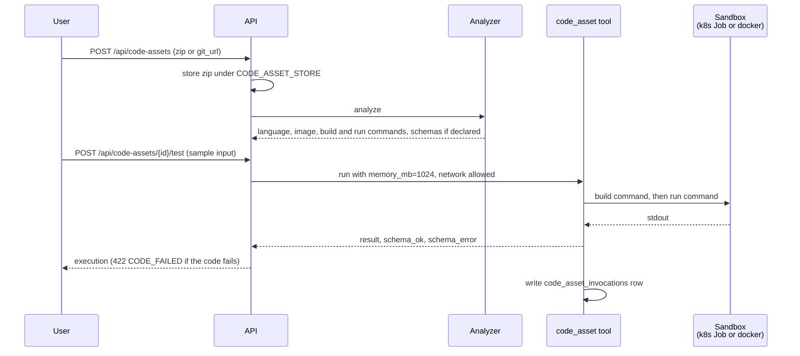

# Sandboxed code execution + Code Assets

A user uploads a zip or points at a git repo, Abenix analyzes it, and an agent or pipeline calls it through the `code_asset` tool. A call runs as a Kubernetes Job in a cluster (local `docker run` in development), or on a warm code runner when those are enabled. See [16-warm-code-runners](16-warm-code-runners.md).

## Where it lives

| Surface | Where |
|---|---|
| Upload UI | `/code-runner` (sidebar **Code Runner**) |
| REST API | [`apps/api/app/routers/code_assets.py`](../../apps/api/app/routers/code_assets.py) |
| Analyzer | [`apps/agent-runtime/engine/code_analyzer.py`](../../apps/agent-runtime/engine/code_analyzer.py), picks language, image, build and run commands, and reads schemas from author files |
| The tool agents call | `code_asset`, [`engine/tools/code_asset.py`](../../apps/agent-runtime/engine/tools/code_asset.py) |
| One-off containers | `sandboxed_job`, [`engine/tools/sandboxed_job.py`](../../apps/agent-runtime/engine/tools/sandboxed_job.py) |
| Warm runners | [`engine/code_runners.py`](../../apps/agent-runtime/engine/code_runners.py) |
| Storage | `code_assets` table. The archive is a zip under `CODE_ASSET_STORE` (default `/data/code-assets`). Uploaded tar.gz files and git clones are repacked as zip |
| Audit | `code_asset_invocations`, one row per call |

Seven languages are detected: Python, Node.js, Go, Rust, Ruby, Java and Perl. Each maps to a stock public image that must be on the image allow-list.

## The lifecycle



## The sandbox

| Constraint | `code_asset` call | Notes |
|---|---|---|
| Network | Off unless the call passes `allow_network: true` and the host or tenant allows it | `SANDBOXED_JOB_ALLOW_NETWORK`, or the tenant's `/settings/sandbox`. Helm sets it to `true` by default (`sandboxedJob.allowNetwork`). `/test` always asks for network |
| Memory | `memory_mb`, default 1024, schema range 128 to 4096 | Per call, not per asset |
| CPU | 2 | Fixed by `code_asset` |
| Timeout | `timeout_seconds`, default 120, schema range 10 to 900 | `/test` defaults to 120 |
| Filesystem | Read-only root, writable `/tmp` (64 MB tmpfs in docker, 64 Mi emptyDir in k8s) | Code runs in `/tmp/app` |
| User | 65534, non-root, on the k8s backend | The docker backend runs as the image's default user and drops all capabilities |
| Images | `SANDBOXED_JOB_ALLOWED_IMAGES` (Helm `sandboxedJob.allowedImages`) | A tenant's `/settings/sandbox` list is added to it, never subtracted |

Called directly, `sandboxed_job` defaults to 60 seconds, 512 MB and 1 CPU. To tighten the image list, set `sandboxedJob.allowedImages` in Helm. `/settings/sandbox` can only add images.

## Input and output

Schemas come from the asset itself: `abenix.yaml`, `examples/input.json` and `examples/output.json`, or JSON blocks in the README. If none are found the schemas stay empty and input is not validated. An upload with an example input runs once to fill `output_schema`. `analysis_notes` holds `{level, message, suggestion}` entries.

In a pipeline, call the tool like any other:

```yaml
nodes:
  - id: extract
    tool_name: code_asset
    arguments:
      code_asset_id: <uuid>
      input: { raw_text: "{{previous_node.output}}" }
```

The tool validates `input` against the asset's `input_schema`, runs it, and returns `{result, schema_ok, schema_error}`.

## Multi-file projects

The runtime runs the asset's build command in the sandbox before the run command, for example `pip install -r requirements.txt` (or poetry, or uv), `go build -o /tmp/bin`, or `javac` (`mvn package` when the project has no `src/main/java`). Build output goes to stderr. The built tree is cached under `CODE_ASSET_BUILD_CACHE` (default `/data/code-asset-cache`).

Sample assets live in `industrial-iot/code-assets/`, `contractiq/code-assets/`, `wingman/code-assets/` and `pharmavigil/code-assets/`.

## Versions

Uploading a new version replaces the code behind an asset. Agents and pipelines keep the same asset id and pick up the new code on their next call. The new archive is analysed first and only goes live if analysis succeeds. If it fails, the current version stays live and the reason comes back.

Each upload bumps `version` and keeps the replaced archive in `version_history`, so any earlier version can be restored from the asset page. Restoring makes it live as a new version number. History keeps `CODE_ASSET_MAX_VERSIONS` entries (20 by default) and deletes archives that fall off the end. Uploads to one asset are serialised with a row lock and every upload and restore is audited.

Endpoints: `POST /api/code-assets/{id}/versions` with a file or a git URL, and `POST /api/code-assets/{id}/versions/{n}/restore`. Both need ownership, an edit share or admin.

## How the sandbox gets the code

Assets up to `CODE_ASSET_MAX_INLINE_BYTES` (default 400,000) are passed into the container as a base64 environment variable, with the input beside it. A larger asset is fetched by the sandbox from `GET /api/code-assets/{id}/fetch`, authorised by a ten-minute token the runtime signs for that one asset. The token is not a user token, so an agent shared with someone works for them without sharing the asset itself. When no token can be signed, the sandbox falls back to `/download` with `CODE_ASSET_DOWNLOAD_TOKEN`.

## Deleting an asset

Delete first lists the agents and pipelines that call the asset (`GET /api/code-assets/{id}/dependents`). The API refuses with `409 IN_USE` unless the caller confirms with `force=true`.

## From a git repo

Send `metadata={"name": "...", "git_url": "https://...", "git_ref": "main"}` instead of a file. `name` is required. The API shallow-clones the repo (https and git only, hosts limited by `CODE_ASSET_GIT_ALLOWED_HOSTS` when set), zips it and runs the same analyzer. Private repos are not supported, the clone has no credentials.

## The AI Builder

The Agent Builder lists the tenant's ready code assets to the model (`_get_code_assets_context` in [`ai_builder.py`](../../apps/api/app/routers/ai_builder.py)), so a generated agent can call one through `code_asset`. It does not write or run code assets itself.

## Adding a language

1. Add `_analyze_<lang>` in `apps/agent-runtime/engine/code_analyzer.py`, setting the image, build and run commands.
2. Add it to `_LANGUAGE_RULES`, keyed on the manifest file that identifies the language.
3. Add the image to `sandboxedJob.allowedImages`.

## Where to look

- REST API: [`apps/api/app/routers/code_assets.py`](../../apps/api/app/routers/code_assets.py)
- Analyzer: [`apps/agent-runtime/engine/code_analyzer.py`](../../apps/agent-runtime/engine/code_analyzer.py)
- Tools: [`code_asset.py`](../../apps/agent-runtime/engine/tools/code_asset.py), [`sandboxed_job.py`](../../apps/agent-runtime/engine/tools/sandboxed_job.py)
- Warm runners: [`apps/agent-runtime/engine/code_runners.py`](../../apps/agent-runtime/engine/code_runners.py)
- Models: `packages/db/models/code_asset.py`, `code_asset_invocation.py`

## Related

- [02-tools](02-tools.md#code-and-ml) for how `code_asset` fits the tool framework
- [Page catalogue](../05-ui/03-page-catalogue.md) for `/settings/sandbox`
- [16-warm-code-runners](16-warm-code-runners.md) for warm per-tenant runners that answer calls over NATS instead of starting a Job each time
