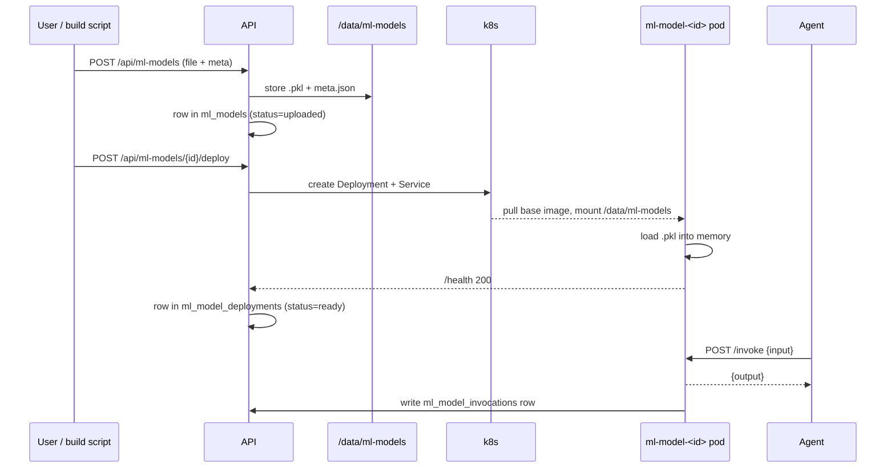

# ML Models — upload, deploy, invoke

Beyond LLMs, Abenix has a first-class slot for classical ML models — sklearn pickles, ONNX, PyTorch state dicts. Agents call them as tools with the same ergonomics as any other tool node. The model itself is versioned, can be hot-deployed without redeploy, and gets per-tenant resource isolation in a dedicated `ml-model-<id>` k8s deployment.

This is what powers Wingman's Bayesian fair-value model, ContractIQ's clause classifier and risk-tier predictor, Industrial-IoT's failure classifier, and Mideast Tourism's demand forecast.

## What a developer ships

```python
# build_my_model.py
from sklearn.ensemble import IsolationForest
import joblib, json

X, y = load_training_data()
model = IsolationForest(contamination=0.05).fit(X)

joblib.dump(model, "my_model.pkl")
json.dump({
  "name": "anomaly-detector-v1",
  "framework": "sklearn",
  "input_schema": {
    "type": "object",
    "properties": {
      "feature_a": {"type": "number"},
      "feature_b": {"type": "number"},
    },
    "required": ["feature_a", "feature_b"],
  },
  "output_schema": {
    "type": "object",
    "properties": {"anomaly_score": {"type": "number"}},
  },
  "training_metrics": {"r2": 0.74, "holdout_size": 8000},
}, open("my_model.meta.json", "w"))
```

Upload via UI at `/ml-models` (drop the `.pkl` + `.meta.json`) or via SDK:

```python
abenix.ml_models.upload("my_model.pkl", meta="my_model.meta.json")
```

That's it. The model is now callable from any agent with the `ml_model` tool.

## How an agent calls a model

```yaml
- id: score
  type: ml_model
  ml_model_name: anomaly-detector-v1
  inputs:
    feature_a: "{n1.output.crude_iv}"
    feature_b: "{n1.output.spread}"
  # output flows to {score.output.anomaly_score}
```

The runtime resolves `ml_model_name` to the active version, validates inputs against `input_schema`, calls the deployed inference endpoint, and writes a row to `ml_model_invocations` for audit.

## The lifecycle



## What's in the box

| Framework | Loader | Inference path |
|---|---|---|
| `sklearn` | `joblib.load` | `model.predict()` / `model.predict_proba()` / `model.decision_function()` (sniffed) |
| `onnx` | `onnxruntime.InferenceSession` | direct |
| `pytorch` | `torch.load` (state dict + class def) | requires accompanying `<name>_model.py` defining the model class |
| `xgboost` | `xgboost.Booster.load_model` | direct |
| `lightgbm` | `lightgbm.Booster.load_model` | direct |

The base inference image is in `docker/Dockerfile.ml-serve`. It's intentionally small (Python + the framework dep + FastAPI). Custom images per model are supported via `meta.json: { "base_image": "abenixacr.../ml-serve-custom:1.2" }`.

## Versioning

Every model has a stable `name` and an auto-incrementing `version`. Re-uploading `anomaly-detector-v1` creates version 2 — version 1 stays available, queryable, and rollback-able. Agents pin to a name (`anomaly-detector-v1`) and resolve to the **active** version unless the agent explicitly pins to a version.

`POST /api/ml-models/{id}/activate` promotes a version to active. `POST /api/ml-models/{id}/deactivate` demotes (agents fall back to the previous active version). Both are admin-only.

## Resource isolation

Each deployed model gets its own k8s Deployment + Service. That means:

- Memory leaks in model A can't crash model B's pod.
- CPU spike in model A doesn't slow model B.
- The crash-loop bisects to one model, not the whole runtime.
- `kubectl logs deploy/ml-model-<id>` is the entire log surface for that model.

This is on purpose. We learned the hard way (project memory: `feedback_ml_model_deploy_traps`) that bundling all models behind one pod produces unpredictable failure modes at scale.

## Hot deploy without platform restart

Models deploy via k8s API from inside the API pod (the API has an in-cluster ServiceAccount with `deployments` create/patch on its own namespace). A model goes from "uploaded" to "callable" in 30-90 seconds depending on the base image's pull state.

The downside: the API pod's ServiceAccount has more cluster privilege than a pure API pod typically needs. For environments where that's unacceptable, set `ML_DEPLOY_MODE=manual` and the API just writes the manifest to a folder for an operator to apply.

## Adding a new framework

Three small changes:

1. New loader module: `apps/api/app/services/ml/loaders/<framework>.py` implementing `load(path) -> model` and `infer(model, input) -> output`.
2. Register in `loaders/__init__.py`.
3. Ensure the base image has the framework installed — either bake into `Dockerfile.ml-serve` or set `base_image` in the model's meta.

## Adding a new model type to an existing framework

Most frameworks support multiple model shapes (sklearn has classifier vs regressor vs clusterer vs outlier-detector). The loader sniffs which by introspecting the model object — `hasattr(model, 'predict_proba')` → classifier, etc. Adding a new shape:

1. Add the detection branch in `loaders/sklearn.py`.
2. Add the inference path.
3. Add a small unit test in `tests/unit/test_ml_loaders.py`.

## Where to look

- REST API: [`apps/api/app/routers/ml_models.py`](../../apps/api/app/routers/ml_models.py)
- The `ml_model` tool: [`apps/agent-runtime/engine/tools/ml_model_tool.py`](../../apps/agent-runtime/engine/tools/ml_model_tool.py)
- Loaders: `apps/api/app/services/ml/loaders/`
- Models: `packages/db/models/ml_model.py`, `ml_model_invocation.py`
- Base inference image: `docker/Dockerfile.ml-serve`

## Reference deployments

- Wingman: `wingman/ml-models/build_*.py` — 3 sklearn models (Bayesian Ridge, Isolation Forest, GaussianNB prior)
- ContractIQ: `contractiq/aimodels/` — 4 sklearn models (clause classifier, risk tier, counterparty default, price anomaly)
- Industrial-IoT: `industrial-iot/aimodels/` — failure classifier + RUL regressor

Reading the build scripts in those folders is the fastest way to learn the contract.
