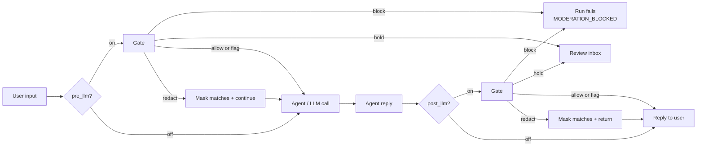
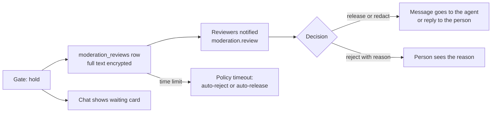

# Moderation gate

Every agent run passes through a moderation gate. It checks the user's message before the model sees it (pre-LLM) and the reply before the person sees it (post-LLM). Tool output can be checked too. The gate is per tenant, writes an event for every check, and combines two checks: the OpenAI moderation endpoint and the tenant's own regex patterns.

## What it gates



Five actions, from least to most severe:

- **`allow`**: pass through.
- **`flag`**: pass through, the event is recorded as `flagged`.
- **`redact`**: replace what matched with the policy's mask (default `█████`) and continue. Custom patterns mask the exact match. A provider category asks the provider about each sentence and masks the ones that hit, or the whole text when it cannot narrow it down.
- **`hold`**: stop the content until a person decides. See [Hold for review](#hold-for-review).
- **`block`**: refuse. The run fails with `failure_code = MODERATION_BLOCKED`.

When several categories trigger, the most severe action wins. Every check writes a `moderation_events` row with an outcome of `allowed`, `flagged`, `redacted`, `held`, `blocked` or `error` (the provider call failed).

## The policy

Policies live in `moderation_policies`. A tenant can have several, but the gate uses only the most recently updated active one. Only tenant admins can create or edit them, at `/moderation`.

| Column | Default | Notes |
|---|---|---|
| `pre_llm` | `true` | check user input before the LLM call |
| `post_llm` | `true` | check the reply before it reaches the caller |
| `on_tool_output` | `false` | also check tool output. Off by default because most tool output is structured data |
| `provider_model` | `omni-moderation-latest` | the OpenAI moderation model |
| `default_threshold` | `0.5` | a provider score at or above this triggers the category |
| `thresholds` | `{}` | per-category override, for example `{"hate": 0.3, "violence": 0.7}` |
| `default_action` | `block` | action for any triggered category with no explicit action, and for every custom-pattern match |
| `category_actions` | `{}` | per-category override, for example `{"harassment": "flag", "sexual": "hold"}` |
| `custom_patterns` | `[]` | a list of regex strings, matched case-insensitively |
| `redaction_mask` | `█████` | text that replaces a match on `redact` |
| `fail_closed` | `false` | block when the provider call fails instead of letting the content through on the pattern check alone |
| `hold_timeout_minutes` | `60` | how long held content waits (1 to 10080) |
| `hold_timeout_action` | `reject` | what happens when nobody decides in time: `reject` or `release` |

The provider needs `OPENAI_API_KEY`. Without it every provider call errors, the event is recorded as `error`, and only the custom patterns apply (unless `fail_closed` is on, then everything is blocked).

## The flow inside the runtime

`AgentExecutor` in [`apps/agent-runtime/engine/agent_executor.py`](../../apps/agent-runtime/engine/agent_executor.py) calls `check()` from [`engine/moderation_gate.py`](../../apps/agent-runtime/engine/moderation_gate.py) on the input, on the reply, and on tool output when `on_tool_output` is on. The API builds the gate config from the active policy in [`app/core/moderation_glue.py`](../../apps/api/app/core/moderation_glue.py). Pipelines have no executor input step, so the execute route checks a pipeline's message itself before the run starts.

`evaluate()` in [`engine/moderation_client.py`](../../apps/agent-runtime/engine/moderation_client.py) does the work:

1. **Custom patterns.** Each regex runs over the text. A match is labelled `custom:<index>` and always uses `default_action`. A pattern shaped like a 16-digit card number only counts when the digits pass the Luhn check.
2. **Provider call.** A category triggers when its score reaches its threshold or the provider marks it flagged. If the call fails the gate carries on with the pattern result.
3. **Pick the action.** The most severe action across all triggered categories wins (block, then hold, redact, flag, allow).

On the streamed path, when the policy could redact, hold or block a reply, the executor buffers the reply until the post-LLM check is done. Such runs also skip the response cache. When the policy cannot withhold, tokens stream as usual and a redaction arrives as a `moderation` event carrying the replacement text, which the chat swaps in. The execution row keeps the redacted text, never the original. The chat shows a notice naming the stage, the outcome and the categories, with a link to the policy.

The `/moderation` page lists recent events and has a box to test text against the active policy (`POST /api/moderation/vet`).

## Hold for review

`hold` stops a message or reply until a person releases it, redacts and releases it, or rejects it with a reason. Held items wait in the review inbox at `/review-queue` (sidebar: **Review inbox**). Block still outranks hold when both match.



Who sees the inbox: the sidebar shows it to anyone holding the `moderation.review` capability or the `review_queue` feature. Admins hold both by default, and an admin can grant `moderation.review` to others through a permission set. Only `moderation.review` holders see the **Held content** tab and can decide. The second tab, **Marketplace submissions**, is for admins approving agents submitted to the marketplace.

What happens when the gate holds:

- The gate raises `ModerationHeld`, a subclass of `ModerationBlocked`. Code that only knows blocks still refuses the content, so no path can leak it.
- The stream sends a `moderation` event with `outcome: "held"` and the `review_id`, then `done` with `moderation_held: true`. The run ends `failed` with `failure_code = MODERATION_HELD`. A held pipeline input returns HTTP 409 with `error_code = MODERATION_HELD`.
- The review row keeps the full text, encrypted with [`app/core/crypto.py`](../../apps/api/app/core/crypto.py) when `ABENIX_DATA_KEY_KEK_BASE64` is set. The chat message and the run record get a stand-in, so the raw text never sits in `messages` or `executions` and never reaches the model as history.
- Reviewers get one notification per batch, filtered by their `moderation_reviews` notification preference. The sidebar count updates over the existing WebSocket.

Deciding:

- Release a user message and the chat sends it on to the agent. The gate lets that exact text through once, within 24 hours, matched by content hash.
- Release a reply and the stand-in message becomes the reply. The run flips to `completed`.
- Redact sends the reviewer's edited text instead of the original.
- Reject needs a reason. The person sees it in the chat and the run's failure code becomes `MODERATION_REJECTED`.
- A claim stops two reviewers working on the same item. Admins can take an item over or unassign it.
- Every step is in the review history, the tenant activity log and the platform events `moderation.held` and `moderation.decided`.

The time limit comes from the policy (`hold_timeout_minutes`, `hold_timeout_action`). A scheduler job applies it every 15 seconds under an advisory lock. The inbox logic lives in [`app/services/moderation_review.py`](../../apps/api/app/services/moderation_review.py).

## What we keep and for how long

Matched spans are masked in every preview, event and log. Custom patterns mask the exact match. Provider categories have no offsets, so a hold or a redact asks the provider about each sentence and only the sentences that hit are masked. A redacted event keeps where it masked (`masked_spans` on `GET /api/moderation/events`), and the events list on `/moderation` says how many parts and characters were masked and for which categories.

| Data | Kept | Setting | Default |
|---|---|---|---|
| Full held text | while pending, then this long after the decision | `held_content_days` (0 to 365) | 30 days |
| Decision record with masked text | this long after the decision | `decision_record_days` (30 to 3650) | 365 days |
| Event previews | this long after the event | `event_preview_days` (1 to 365) | 30 days |

Admins set these on `/moderation` under **What we keep and for how long** (`GET` and `PUT /api/moderation/retention`). Held text cannot be kept longer than the decision record. The values are stored in `tenants.settings.moderation_retention` with who changed them and when, and every change is in the activity log as `moderation_retention_updated`. An hourly job purges in batches of 5000 under an advisory lock. GDPR erasure closes the person's pending reviews and clears their held text, released text and event previews straight away.

## Custom patterns

This is the part a developer most often extends. Two common uses:

- **PII**: SSNs, card numbers, API keys.
- **Internal terms**: a codename such as `project\s+phoenix`, so it never reaches an external model.

Edit them on `/moderation` in **Custom patterns**, one regex per line. Every match uses the policy's `default_action`, so a policy that should mask PII but block a codename needs that split handled by the default action and category overrides. The policy editor shows a match by its pattern index (`custom:0`, `custom:1`).

New tenants start with a built-in set: US SSN, 16-digit card numbers, AWS access and secret keys, bearer tokens and generic `api_key=...` style secrets (`DEFAULT_PII_PATTERNS` in `moderation_glue.py`).

The **DLP / PII Protection** switch under `/settings/data` is a separate scanner ([`engine/dlp.py`](../../apps/agent-runtime/engine/dlp.py)) with its own setting, `tenants.settings.dlp`. The gate carries it so it runs on every execute path, inline, streamed, queued and through the runtime server, even when no moderation policy is active:

| Mode | Message sent to an agent | Answer |
|---|---|---|
| `detect` | logged, sent unchanged | unchanged |
| `mask` | personal data replaced with a label such as `[EMAIL_MASKED]` before the model sees it | masked the same way. A streamed answer is buffered and arrives masked |
| `block` | refused with 422 `DLP_BLOCKED` and a plain message naming what was found | withheld and replaced with a plain message |

Pipelines get the same treatment on their input and their final output, including `/api/pipelines/...` runs and queued pipeline runs. A changed mode applies to the next run. Only an admin can change it.

## Failure semantics

When the gate blocks, the execution row gets:

- `status = "failed"`
- `failure_code = "MODERATION_BLOCKED"` (or `MODERATION_HELD`, later `MODERATION_REJECTED` for a held item)
- an error message naming the stage that blocked

The execute call does not return a 5xx. A blocked agent run returns 200 with the refusal text as the output and an `execution_id`. A blocked pipeline input returns 422 with `error_code = MODERATION_BLOCKED`. To branch on the outcome, read the failure code from the execution:

```python
res = await forge.agents.execute(agent_id, message="...")
run = await forge.executions.get(res.execution_id)
if run.get("failure_code") == "MODERATION_BLOCKED":
    ...  # tell the person the input breaks policy, do not retry
```

The failure code list lives in [`apps/api/app/core/failure_codes.py`](../../apps/api/app/core/failure_codes.py).

## Adding a moderation provider

Only OpenAI's moderation endpoint is wired in. The call is `_call_openai()` in `engine/moderation_client.py`, and `evaluate()` reads its `results[0].category_scores` and `categories`. A new provider means adding a client there that returns the same shape.

The policy's `provider` field is deprecated. The column stays (no migration) with `openai`, the API no longer returns it, and a create or update that sends any value other than `openai` answers 400 `provider_deprecated`. Bring it back as a real choice when a second provider exists.

## Tenant defaults

Every new tenant gets an active "Default Policy", seeded on password registration and on SSO sign-up. A tenant that predates this gets one on its first visit to `/moderation`. The default: pre-LLM and post-LLM on, OpenAI `omni-moderation-latest`, threshold 0.5, `default_action = block`, the built-in PII patterns, and `fail_closed = false` so a deployment with no OpenAI key does not refuse every request.

So the gate is on for every tenant from the first run. Turning it off is an explicit admin action.

## Where to look

- Gate: [`apps/agent-runtime/engine/moderation_gate.py`](../../apps/agent-runtime/engine/moderation_gate.py)
- Provider call, patterns, action choice: [`apps/agent-runtime/engine/moderation_client.py`](../../apps/agent-runtime/engine/moderation_client.py)
- Hold persistence: [`apps/agent-runtime/engine/moderation_hold.py`](../../apps/agent-runtime/engine/moderation_hold.py)
- Policy to gate config, event persistence: [`apps/api/app/core/moderation_glue.py`](../../apps/api/app/core/moderation_glue.py)
- API: [`apps/api/app/routers/moderation.py`](../../apps/api/app/routers/moderation.py)
- Review inbox and retention: [`apps/api/app/services/moderation_review.py`](../../apps/api/app/services/moderation_review.py)
- Models: [`packages/db/models/moderation_policy.py`](../../packages/db/models/moderation_policy.py)
- Tests: `tests/unit/test_moderation.py`, `tests/unit/test_moderation_review.py`, `tests/unit/test_agent_execute_moderation.py`
- UI: `/moderation` for policies, events and retention, `/review-queue` for held items
