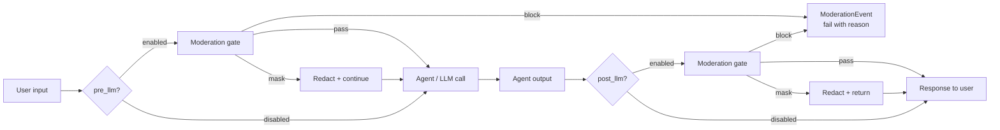

# Moderation gate

Every agent execution passes through a configurable moderation gate. Pre-LLM (filter the user input) and post-LLM (filter the agent's output). It's tenant-scoped, audited per event, and supports both an external provider (OpenAI moderation) and custom regex patterns for PII / proprietary terms.

## What it gates



Three actions per category:

- **`detect`** — pass through, log a `ModerationEvent` row with the category and score
- **`mask`** — replace the offending span with the configured mask string (default `█████`) and let execution continue
- **`block`** — fail the execution with `failure_code = MODERATION_BLOCKED` and surface the reason in the response

## The policy

One row per tenant in `moderation_policies`:

| Column | Default | Notes |
|---|---|---|
| `pre_llm` | `true` | gate runs on user input before the LLM call |
| `post_llm` | `true` | gate runs on agent output before returning to caller |
| `on_tool_output` | `false` | also gate tool-call outputs — off by default because most tool outputs are structured data |
| `provider` | `openai` | external moderation provider |
| `provider_model` | `omni-moderation-latest` | OpenAI's moderation-specific model |
| `default_threshold` | `0.5` | confidence below this means pass |
| `thresholds` | `{}` | per-category override (e.g. `{"hate": 0.3, "violence": 0.7}`) |
| `default_action` | `block` | what to do for any category with no explicit action |
| `category_actions` | `{}` | per-category override (e.g. `{"self-harm": "block", "sexual": "mask"}`) |
| `custom_patterns` | `[]` | a list of `{name, regex, action}` for PII / proprietary terms |
| `redaction_mask` | `█████` | string used for `mask` action |

## The flow inside the runtime

The agent runtime wraps every LLM call with the gate. The pre-LLM step is on the input text and the post-LLM step is on the model's response. Tool outputs go through only if `on_tool_output = true` (off by default — most tool outputs are structured JSON, not free text, and gating them adds cost).

The gate fans out work:

1. **External provider call** (parallel). The provider returns a vector of `(category, score)` tuples.
2. **Custom-pattern scan** (parallel). Each pattern's regex runs over the text.
3. **Decision merger**. Each match becomes an action. If any action is `block`, the highest-priority block wins. If any action is `mask`, the spans are merged and the masked text becomes the new input/output.

All decisions emit a `ModerationEvent` row with `outcome ∈ {allowed, masked, blocked}` and the matching categories + scores. The `/moderation` page is the audit surface — filter by event type, by user, by category.

## The custom-pattern slot

This is the slot a developer most often extends. The two big use cases:

- **PII gates**: `SSN: \d{3}-\d{2}-\d{4}` → mask. `Email: [\w.+-]+@[\w.-]+` → mask. `Credit-card: \d{16}` → block.
- **Proprietary terms**: `Project Phoenix` → block (don't leak internal codenames to external LLMs).

Edit at `/settings/data → DLP & redaction`. Stored as a list of `{name, regex, action, scope: pre_llm|post_llm|both}` under `moderation_policies.custom_patterns`.

## Failure semantics

When the gate blocks, the execution gets:

- `status = "failed"`
- `failure_code = "MODERATION_BLOCKED"`
- `failure_message` = the category that blocked + the mask of the matched span
- HTTP response: 200 with `data.status = "failed"` and `data.error` populated (NOT a 5xx — moderation is a normal failure mode, not a server error)

The failure code is stable, so an SDK caller can do:

```python
res = abenix.agents.execute(agent_id, message="...")
if res.failure_code == "MODERATION_BLOCKED":
    # show a "your input violates policy" message — don't retry
```

The full enumeration of failure codes lives in [`apps/api/app/core/failure_codes.py`](../../apps/api/app/core/failure_codes.py).

## Adding a new moderation provider

Currently we ship OpenAI's moderation endpoint. Adding Anthropic, Perspective, or a self-hosted classifier is a one-module change:

1. New module: `apps/api/app/services/moderation/<provider>.py` implementing the `ModerationProvider` protocol — one method `score(text) -> list[CategoryScore]`.
2. Register in `services/moderation/__init__.py`.
3. The policy's `provider` field starts accepting your new value.

The category vocabulary is normalized to a canonical set (hate, harassment, self-harm, sexual, violence, jailbreak, custom) inside the gate, so a new provider's exotic category names get mapped to one of the canonical ones — see `provider.py` for the mapping table.

## Tenant defaults — when a new tenant is provisioned

Every new tenant gets a default `moderation_policy` row seeded automatically (both via password registration AND via SSO sign-up). The default: `pre_llm + post_llm = true`, `provider = openai`, `default_action = block`. Admins can soften per-category from `/moderation`.

This means **the gate is on by default for every tenant from the first execution**. Turning it off is an explicit admin action, not a missed default.

## Where to look

- Gate evaluator: `apps/api/app/services/moderation/evaluator.py`
- Provider clients: `apps/api/app/services/moderation/openai.py`, etc.
- The pre/post-LLM hook in the agent runtime: `apps/agent-runtime/engine/agent_executor.py` (search for `moderation_gate`)
- Tests: `tests/unit/test_moderation.py` exercises the evaluator + the gate
- UI: `/moderation` for events, `/settings/data` for the policy
