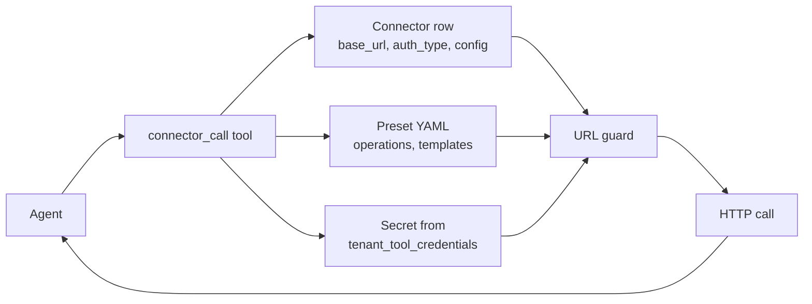

# Connectors and triggers

Two separate features that are often confused:

- **Connectors** let an agent call an outside system (a maintenance system, an HR system, a weather feed). An admin saves the system's address and secret once, and agents call it through the `connector_call` tool.
- **Triggers** start an agent run without anyone in chat: on a schedule, or when another system calls a webhook URL.

Connectors answer "what can the agent reach?". Triggers answer "what wakes the agent up?".

## Connectors

A connector is a row in `connectors` with:

- `kind`: `cmms`, `hris`, `telematics`, `standards`, `weather`, `cost_data` or `custom`
- `preset_key`: which preset supplies its operations
- `base_url`: the system's address
- `auth_type`: `none`, `api_key`, `bearer`, `basic` or `oauth2`
- `config`: extra settings, such as `username` for basic auth or `auth_header_name` for an API key (default `X-API-Key`)
- a write-only secret, see [Secrets](#secrets)

Admins manage them at `/admin/connectors` (sidebar: **Connectors**). The API matches the page. Create, update, delete and test need the `manage_settings` feature (admin by default) and answer 403 otherwise. Listing and reading stay open to every tenant member because the builder's connector picker uses them, and they never return a secret.

### Presets

A preset is a YAML file in [`packages/db/seeds/connector_presets/`](../../packages/db/seeds/connector_presets/). It names the system, gives a base URL template and auth hints, and lists operations. Each operation has a method, a path, its arguments and the query or body templates the arguments fill in. `GET /api/connectors/presets` lists them for the create form.

| Preset key | System |
|---|---|
| `cmms_maximo` | IBM Maximo |
| `cmms_sap_pm` | SAP Plant Maintenance |
| `cmms_servicenow` | ServiceNow |
| `hris_workday` | Workday |
| `telematics_carrier_lynx` | Carrier Lynx |
| `telematics_sensitech` | Sensitech |
| `weather_dtn` | DTN Weather |
| `cost_data_bnef` | BNEF |

### Calling a connector from an agent

The agent calls `connector_call` with `connector_id`, `operation` (an operation name from the preset) and `parameters`. The tool loads the connector for the run's tenant, fills the preset's templates, adds the auth header, sends the request through the URL guard and returns the parsed response. A connector with no preset, or one that is turned off, is refused. An operation whose name starts with `get`, `list`, `read`, `search`, `fetch`, `query`, `find` or `lookup` counts as read-only. Anything else counts as an external write for risk and autonomy checks.

Code: [`apps/agent-runtime/engine/tools/connector_call.py`](../../apps/agent-runtime/engine/tools/connector_call.py).

### Adding a connector for a new system

Add a YAML file to `packages/db/seeds/connector_presets/` following an existing one such as `weather_dtn.yaml`. The preset loader is [`apps/api/app/core/connector_presets.py`](../../apps/api/app/core/connector_presets.py). No Python is needed. The new preset then shows in the create form at `/admin/connectors`.

### The Test button

`POST /api/connectors/{id}/test` sends a GET to the base URL with the connector's auth and reports back in plain words. Only a 2xx or 3xx answer counts as reachable. A 401 or 403 reads "The service refused the credentials". The result is saved as `last_test_at` and `last_test_ok`.

## Secrets

A connector's secret is write-only. The form at `/admin/connectors` has a password field. Once saved it shows "Saved, hidden" with Replace and Remove. The API takes `secret` on create and update and `clear_secret: true` on update, and only ever answers `has_secret`.

The value goes into the tool credentials store, `tenant_tool_credentials`, under the key `CONNECTOR_<connector id hex>_SECRET` for the connector's tenant. It is encrypted with AES-GCM under the cluster key when `ABENIX_DATA_KEY_KEK_BASE64` is set, the same as any tenant tool credential. Without that key it is stored as plain text, so set it on any shared deployment. See [Encryption setup](../08-howto/06-encryption-setup.md).

The Test button and `connector_call` both read the secret for the connector's own tenant, so another tenant never resolves it. Deleting a connector deletes its secret. The key is built at run time, so it is not declared in `config_fields` and does not show on Admin, Tool Configuration.

The `secret_ref` column is legacy. It pointed at an Abenix API key and the key's prefix was sent as the credential. It is no longer read. A connector that still has one and no stored secret reports `needs_secret: true` with "Re-enter this connector's secret, it used to point at an Abenix API key". Until then the test does not run and `connector_call` refuses the call. Saving or removing a secret clears the old pointer.

## URL guard

Connectors only call public addresses. [`engine/url_guard.py`](../../apps/agent-runtime/engine/url_guard.py) refuses:

- a URL that is not `http` or `https`
- `localhost`, `metadata`, `metadata.google.internal`, `host.docker.internal`, `kubernetes.default` and similar internal names
- cluster names ending in `.svc`, `.cluster.local`, `.internal` or `.local`
- any address that is private, loopback, link-local, multicast, reserved or unspecified, including one written as a single number and IPv4 addresses mapped into IPv6
- a host name that resolves to any of those

It runs at three points:

- **On save.** Create and update refuse a base URL that names such a host or resolves to one. A host that does not resolve yet, such as a preset template, is kept.
- **On the test.** The URL is resolved and checked again. Redirects are not followed automatically. At most 3 are followed by hand and each hop is checked before it is called. The `Authorization` header is dropped when a hop moves to another origin. A refusal comes back as `blocked: true` with the reason.
- **In `connector_call`.** The same check and redirect rule apply before the runtime sends anything.

`CONNECTORS_ALLOW_PRIVATE_TARGETS=1` on abenix-api and agent-runtime lifts the check, for dev clusters that point a connector at an in-cluster service. It is off by default.

Other outbound features have their own private-address checks with their own switches: Source Watch (`SOURCE_WATCH_ALLOW_PRIVATE_TARGETS`, see [17](17-source-watch.md)) and event subscriptions (`EVENTS_ALLOW_PRIVATE_TARGETS`, see [19](19-outbound-events.md)).

## Triggers

A trigger belongs to one agent or pipeline and is one of two types:

| `trigger_type` | What fires it | What the run gets |
|---|---|---|
| `schedule` | a cron expression (default `0 * * * *`, hourly) | the trigger's `default_message` and `default_context` |
| `webhook` | a `POST` to `/api/triggers/webhook/{token}` | `message` and `context` from the JSON body, merged over the defaults |

Manage them at `/triggers` (sidebar: **Triggers**). You can only add a trigger to an agent you can run. Each fire creates a normal execution and dispatches it the same way as any other run.

- **Schedule.** A scheduler job checks every 30 seconds for due triggers. It locks each due row, so several API replicas never fire the same trigger twice.
- **Webhook.** The token in the URL is the only credential, so treat the URL as a secret. The call answers 202 with the `execution_id`. A wrong or inactive token answers 404.
- **Run now.** `POST /api/triggers/{id}/run` fires a trigger by hand.

A trigger stops itself when its agent is archived or inactive, its owner is gone or deactivated, or the owner lost run access to the agent. A kill switch on the trigger or its agent makes a webhook call answer 423 so the sender retries later. See [Governance](../08-howto/11-governance.md).

The run records what started it in `trigger_id`, `trigger_kind` and `trigger_name`. A scheduled fire is `schedule`, a webhook call is `webhook` and Run now is `manual`, all with the trigger's id and name. The Triggers page lists each trigger's recent runs and links to the full list at `/executions?trigger={id}`. See [Started by](../04-data-model/02-executions.md#started-by).

If the agent is over its `daily_cost_limit` or `daily_budget_usd` for the UTC day, the execution is written as `failed` with `failure_code: BUDGET_EXCEEDED` and a plain message, the trigger owner is notified, and a webhook or Run now call answers 429 with that code. See [Spend caps](00-agent-execution.md#spend-caps).

Other things that start runs without a person: [Source Watch](17-source-watch.md) (`trigger_kind = source_watch`) and [event subscriptions](19-outbound-events.md) that target an agent (`trigger_kind = event`).

## Inbound and outbound webhooks

This page covers **inbound** webhooks, which start runs. **Outbound** webhooks, where Abenix calls your system when something happens, are covered in [Outbound events](19-outbound-events.md). Inbound ones live on `/triggers`, outbound ones on `/webhooks`.

## Where to look

- Connector API: [`apps/api/app/routers/connectors.py`](../../apps/api/app/routers/connectors.py)
- Connector tool: [`apps/agent-runtime/engine/tools/connector_call.py`](../../apps/agent-runtime/engine/tools/connector_call.py)
- URL guard: [`apps/agent-runtime/engine/url_guard.py`](../../apps/agent-runtime/engine/url_guard.py)
- Secret storage: [`apps/api/app/core/tool_secrets.py`](../../apps/api/app/core/tool_secrets.py)
- Trigger API: [`apps/api/app/routers/triggers.py`](../../apps/api/app/routers/triggers.py)
- Schedule tick: [`apps/api/app/core/scheduler.py`](../../apps/api/app/core/scheduler.py)
- Models: [`packages/db/models/connector.py`](../../packages/db/models/connector.py), [`packages/db/models/agent_trigger.py`](../../packages/db/models/agent_trigger.py)
- Tests: `apps/agent-runtime/tests/test_connector_call_security.py`

## Related

- [Tools](02-tools.md): the tool framework `connector_call` is part of
- [Approvals](05-approvals-hitl.md): pair a connector write with an approval gate
