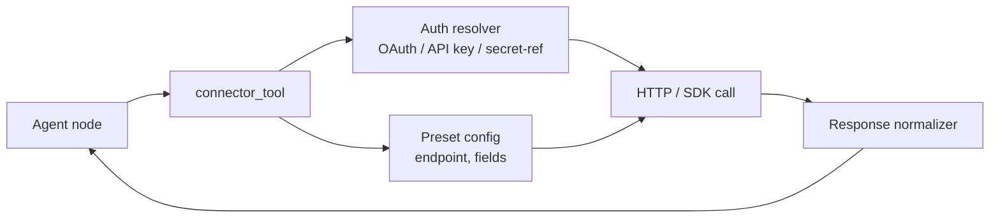

# Connectors + triggers

Two adjacent extensibility surfaces:

- **Connectors** — typed clients for external systems (Slack, Linear, Salesforce, SAP PM, ServiceNow, Maximo, Workday, Sensitech, Carrier Lynx, DTN Weather, BNEF). One tool node per connector plus a `/test` button that proves credentials work before an agent ever calls it.
- **Triggers** — event sources that *start* agent executions. Cron, webhook, Slack mention, GitHub PR comment, email, MQTT topic, file drop. Each trigger has a typed payload schema the agent receives as input.

If "what tools can an agent call?" is the connector question, "what wakes the agent up?" is the trigger question.

## Connector framework



A connector definition has four parts:

1. **Auth contract** — what credentials it needs, what type (`oauth2`, `api_key`, `basic`, `mtls`). The secret comes from the connector's own write-only secret, see [Secrets](#secrets).
2. **Preset config** — endpoints, default fields, common operations. Stored in `connector_presets` so multiple connections to the same system share defaults.
3. **The HTTP / SDK call** — the actual code that talks to the external system. Plain Python.
4. **Response normalizer** — maps the external system's JSON quirks into a clean shape the agent sees. (Salesforce's `attributes` envelope, Slack's `ok: false` wrapping, etc.)

## What ships in the box

| Connector | Auth | Notes |
|---|---|---|
| Slack | bot token | message send, channel list, user lookup |
| Linear | OAuth2 / API key | issue CRUD, project list |
| Salesforce | OAuth2 | SOQL, REST objects |
| SAP PM | basic / OAuth2 | work-order CRUD via SAP Gateway |
| ServiceNow | basic / OAuth2 | incident / change / problem CRUD |
| Maximo | OAuth2 | work-order via Maximo REST |
| Workday | OAuth2 | HCM employee + org structure |
| Sensitech | API key | cold-chain logger reads |
| Carrier Lynx | API key | refrigerated-trailer telemetry |
| DTN Weather | API key | route weather |
| BNEF | API key | energy + emissions data |

The catalogue grows. Adding the next one is roughly an afternoon.

## Adding a new connector

Three files:

1. **Preset definition** in `apps/api/app/services/connectors/presets/<name>.py`:
   ```python
   PRESET = {
       "name": "Stripe",
       "kind": "stripe",
       "auth_type": "api_key",
       "default_endpoints": {
           "charges": "https://api.stripe.com/v1/charges",
           "customers": "https://api.stripe.com/v1/customers",
       },
   }
   ```
2. **Client + normalizer** in `apps/agent-runtime/engine/tools/stripe.py`. Subclass `BaseConnectorTool` and implement `call(operation, args)`.
3. **Register** in `tools/__init__.py` so the registry picks it up.

The new connector shows up in `/settings/integrations`, in the Builder tool palette, and as a callable tool — all automatically.

## The `/test` button

Every connector exposes `POST /api/connectors/{id}/test`. It sends a GET to the base URL with the connector's auth and reports back in plain words. Only a 2xx or 3xx answer counts as ok. A 401 or 403 reads "The service refused the credentials". Use it in your CI smoke tests when bringing up a new tenant.

## Secrets

A connector's secret is write-only. Admin -> Connectors has a password field. Once saved it shows "Saved, hidden" with Replace and Remove. The API takes `secret` on create and update and `clear_secret: true` on update, and only ever answers `has_secret`.

The value goes into the tool credentials store, `tenant_tool_credentials`, under `CONNECTOR_<connector id hex>_SECRET` for the connector's tenant. It is encrypted with the cluster KEK when `ABENIX_DATA_KEY_KEK_BASE64` is set, the same as any tenant tool credential. The test endpoint and the `connector_call` tool both read it with `credentials.get(key, tenant_id=<the connector's tenant>)`, so another tenant never resolves it. Deleting a connector deletes its secret. The key is built at run time, so it is not declared in `config_fields` and does not show on Admin -> Tool Configuration.

The `secret_ref` column is legacy. It pointed at an Abenix API key and the key's prefix was sent as the credential, which leaked part of our own key and never sent a real secret. It is no longer read as a credential. A connector that still has one and no stored secret reports `needs_secret: true` with "Re-enter this connector's secret, it used to point at an Abenix API key". Until then the test does not run and `connector_call` refuses the call. Saving or removing a secret clears the old pointer.

## Address guard

Connectors only call public addresses. `engine/url_guard.py` refuses `localhost`, cloud metadata names, cluster DNS (`*.svc`, `*.cluster.local`, `*.internal`, `*.local`) and any address that is private, loopback, link-local, multicast, reserved or unspecified, including one written as a number. It runs at three points.

- **On save.** Create and update refuse a base URL that names such a host or resolves to one. A host that does not resolve yet, such as a preset template, is kept.
- **On the test.** The base URL is resolved and checked again. Redirects are not followed automatically. At most 3 are followed by hand and each hop is checked before it is called. Auth headers are dropped when a hop moves to another host. A refusal comes back as `blocked: true` with the reason.
- **In `connector_call`.** The same check and the same redirect rule apply before the runtime sends anything.

`CONNECTORS_ALLOW_PRIVATE_TARGETS=1` on abenix-api and agent-runtime lifts the check for dev clusters that point a connector at an in-cluster service. It is off by default.

## Triggers

Triggers are the inverse — they wake agents up on external events. Five kinds ship:

| Trigger kind | What fires it | Payload to the agent |
|---|---|---|
| `cron` | a schedule (cron expression) | the configured static input |
| `webhook` | a `POST` to `/api/triggers/{id}/fire` | the request body |
| `slack` | Slack Events API @-mention or DM | `{text, user, channel, ts}` |
| `github` | GitHub webhook (PR comment, issue, push) | the event payload, normalized |
| `email` | inbound email via configured SMTP / SES | `{from, to, subject, body, attachments[]}` |
| `mqtt` | a configured MQTT topic gets a message | `{topic, payload}` |
| `file_drop` | a file lands in a watched object-store prefix | `{key, size, content_type}` |

Each trigger is bound to an agent. When it fires, the runtime creates an `Execution` with the trigger's payload as input and runs it through the standard pool routing.

The run records what started it in `trigger_id`, `trigger_kind` and `trigger_name`. A scheduled fire is `schedule`, a webhook call is `webhook` and Run now is `manual`, all with the trigger's id and name. The Triggers page lists each trigger's last five runs and links to the full list at `/executions?trigger={id}`. See [Started by](../04-data-model/02-executions.md#started-by).

If the agent is over its `daily_cost_limit` or `daily_budget_usd` for the UTC day, the execution is written as `failed` with `failure_code: BUDGET_EXCEEDED` and a plain message, the trigger owner is notified, and a webhook or Run now call answers 429 with that code. See [Spend caps](00-agent-execution.md#spend-caps).

## Adding a new trigger kind

Two files:

1. **Source adapter** in `apps/api/app/services/triggers/<kind>.py`. Implements `subscribe(trigger_config, callback)` — the runtime calls `callback(payload)` when an event arrives.
2. **Schema + UI** in `apps/web/src/components/triggers/<kind>Form.tsx` — the form that captures the trigger's config (cron expression, Slack channel ID, MQTT topic, etc.).

The dispatcher in `apps/worker/worker/tasks/trigger_dispatch.py` already handles the generic "create execution, route to pool, audit" path.

## Webhooks (outbound vs inbound) — disambiguation

This page is about **inbound** webhooks as triggers — they start executions.

Outbound webhooks — Abenix calling YOUR system when an execution finishes — are a separate surface documented in [19-outbound-events](19-outbound-events.md). Same word, opposite direction. The product avoids conflating them in the UI, so inbound live in `/triggers`, outbound are in `/settings/webhooks`.

## Where to look

- Connector tool base class: `apps/agent-runtime/engine/tools/_connector_base.py`
- Connector REST: [`apps/api/app/routers/connectors.py`](../../apps/api/app/routers/connectors.py)
- Trigger REST: [`apps/api/app/routers/triggers.py`](../../apps/api/app/routers/triggers.py)
- Trigger dispatcher: `apps/worker/worker/tasks/trigger_dispatch.py`
- Models: `packages/db/models/connector.py`, `agent_trigger.py`
- Reference connector that's easy to copy: [`apps/agent-runtime/engine/tools/slack.py`](../../apps/agent-runtime/engine/tools/)

## Related

- [`02-runtime/02-tools.md`](02-tools.md) — the tool framework connectors plug into
- [`02-runtime/05-approvals-hitl.md`](05-approvals-hitl.md) — pair a connector-based action (post to Slack) with an approval gate
