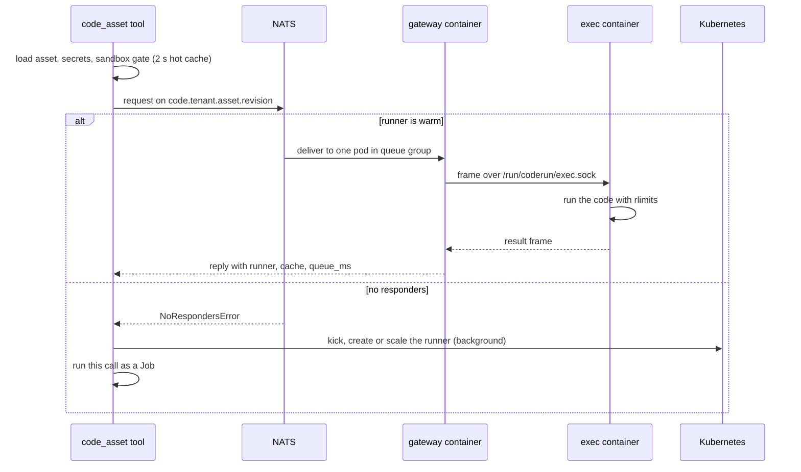

# Warm code runners

> How a `code_asset` call runs in a warm pod that holds one tenant's build of one asset version, called over NATS request/reply instead of a one-off Job.

---

## Why

The Job path in [11-sandboxed-code-execution](11-sandboxed-code-execution.md) starts a pod, fetches the archive and runs the build on every call. A warm runner does that once per asset version and then answers calls over NATS.

Measured on the cluster:

| Case | Time |
|---|---|
| Warm call p50 | 17.9 ms, of which 2.9 ms is platform overhead |
| Warm call p99 | 21.6 ms |
| Throughput, one runner with 1 CPU | about 57 calls/s |
| First call after scale to zero | about 3.5 s, served as a Job |

Everything the Job path enforces still applies. The sandbox switch, the image allow-list and the tenant's network setting are checked before a warm call, with the same settings the Job path reads.

## Modes

`CODE_RUNNER_MODE` picks the behaviour. An unknown value is read as `auto`.

| Mode | Behaviour |
|---|---|
| `auto` | Try the warm runner. Fall back to the Job when there is none yet, it refuses, NATS is unavailable, or the asset has no warm pool |
| `warm` | Try the warm runner. Return the error instead of falling back |
| `job` | Never try NATS. The Job path only |

When `codeRunners.enabled` is false the chart sets `CODE_RUNNER_MODE=job`.

Some failures never fall back, even in `auto`, because the code may already have run:

- the runner did not reply within `timeout_s + 20` seconds
- the NATS request failed for a reason other than no responders
- the reply could not be parsed

These return an error with `runner_reason` in the tool metadata.

## How a call flows



1. The tool works out the runner revision, `v<version>-<6 hex chars>`. The hash covers `suggested_image`, `suggested_build_command`, `suggested_run_command` and `storage_uri`.
2. It sends a request to `code.<tenant_id>.<asset_id>.<revision>`, or that subject plus `.net` when the call sets `allow_network`.
3. Runner pods subscribe in a queue group named after the runner, `coderun-<tenant8>-<asset8>-<revision>`, with `-net` on the network variant. One pod takes each request.
4. The gateway forwards it to the exec container over a unix socket and replies with the result.

The request body:

```json
{"v": 1, "id": "<hex>", "tenant_id": "...", "asset_id": "...", "revision": "v3-a1b2c3",
 "input": {...}, "env": {...}, "timeout_s": 120, "memory_mb": 1024}
```

`timeout_s` and `memory_mb` come from the tool's `timeout_seconds` and `memory_mb` arguments, 120 and 1024 by default. `env` holds the asset's secrets plus caller env, secrets winning.

A request larger than `CODE_RUNNER_MAX_PAYLOAD` bytes is not sent over NATS and goes to the Job.

### Busy and draining

The gateway refuses a request with `busy` when its queue is full, `draining` while shutting down, and `revision mismatch` when the request names another revision. On `busy` or `draining` the tool retries up to 3 times, after 0.1, 0.2 and 0.4 s. Any other refusal, or a refusal on the last try, falls back to the Job in `auto` mode.

### What the tool returns

A warm call adds these to the tool metadata:

| Key | Meaning |
|---|---|
| `runner` | `warm` |
| `runner_name` | Deployment name |
| `runner_pod` | Pod that served the call |
| `runner_mode` | `process` or `handler` |
| `cache` | `hit`, or `miss` when a handler process had to start |
| `duration_ms` | Round trip seen by the tool |
| `run_ms` | Time inside the exec container |
| `queue_ms` | Time the request waited in the gateway |

### Hot cache and last-test writes

A burst of warm calls would otherwise queue on the database pool. The tool keeps the asset row, its secrets and the sandbox gate result in a per-process cache for `CODE_ASSET_CACHE_SECONDS`, 2 by default. Concurrent misses for the same key load once. Set it to `0` to turn the cache off.

The asset's `last_test_*` columns are written in the background, at most once every 5 seconds per asset.

## Cold start

When nobody listens on the subject, NATS answers with no responders. The tool then:

1. Starts a background kick that creates the runner, or scales it to at least one replica. A kick for the same runner happens at most once every 20 seconds per process.
2. Runs the current call on the Job path.

The kick mints a fetch token, writes it to the Secret `<runner>-fetch`, creates the Deployment, then the scaler. Calls after the pod is ready go warm.

`python -m engine.code_runners warm <asset_id> [--net]` does the same kick by hand.

## Inside a runner pod

| Container | User | Does |
|---|---|---|
| `prepare` (init) | per-tenant uid | Fetches the archive with the scoped token, unpacks it, runs the build command once |
| `exec` | per-tenant uid | Runs the code for each request. The built workspace is mounted read-only at `/ws` |
| `gateway` | 10001 | Holds the NATS login, forwards requests to `exec` over `/run/coderun/exec.sock`, serves `/healthz` and `/metrics` on 9464 |

The per-tenant uid is `20000 + (sha256(tenant_id) mod 10000)`. User code never shares a process or a uid with the NATS login.

`prepare` fetches `GET /api/code-assets/{asset_id}/fetch?version=<n>` with `Authorization: Bearer <token>`. The token has type `code_asset_fetch`, names one asset, and the endpoint also checks the tenant. Archives over `CODERUN_MAX_ZIP_MB` are refused. Paths that escape the unpack directory fail the build.

Each run gets:

- a private `HOME` and `TMPDIR` under `/scratch`, removed after the run
- the input on stdin and in `$ABENIX_INPUT_FILE`
- its own process group, killed at the timeout and after exit, so background children die too
- rlimits on CPU seconds, address space, process count and file size
- an environment holding only the request's env plus `PATH`, `HOME`, `TMPDIR`, `LANG` and a few language paths. `PATH`, `LD_PRELOAD`, `LD_LIBRARY_PATH` and the other reserved names cannot be set by the caller

Paths under `/tmp` are symlinked to the read-only build, so code written for the Job path finds its files in the same place.

Code that reads the shared `/tmp/input.json`, in the run command or in any project file under 1 MB, is detected at start and run one request at a time.

Runtimes that reserve a lot of address space up front (Node, Go, Java) get no address-space rlimit. The container memory limit still applies.

## Process and handler mode

**Process mode** is the default. It starts the run command for every request.

**Handler mode** keeps one long-lived process per slot. Opt in with `abenix-runner.json` at the project root:

```json
{"mode": "handler", "handler_command": "python handler.py", "concurrency": 2}
```

The handler reads one JSON line per request on stdin and answers with one JSON line on stdout:

```
in:  {"id": "<id>", "input": {...}}
out: {"id": "<id>", "output": <any JSON>}
out: {"id": "<id>", "error": "message"}
```

- Any other stdout line is kept as a log line.
- A handler that times out or exits is killed and restarted on the next request.
- The process is also restarted when the request env changes, so rotated secrets reach it.
- `handler_command` defaults to the asset's run command.

### Other manifest keys

| Key | Effect |
|---|---|
| `risk_tier` | `low`, `medium`, `high` or `critical`. Sets the minimum warm replicas through `codeRunners.minWarmByTier` |
| `min_warm` | Minimum warm replicas, never below what the tier asks for |
| `network` | The reaper pre-warms the `-net` variant instead of the closed one |
| `concurrency` | Parallel runs in the exec container |

## Scaling and scale to zero

Each runner gets a scaler next to its Deployment.

- **With KEDA** (`CODE_RUNNER_KEDA` true and `CODE_RUNNER_PROMETHEUS_URL` set) a `ScaledObject` scales on `sum(abenix_coderunner_load{runner="<name>"})`, in-flight plus queued. The target per replica is `CODE_RUNNER_CONCURRENCY`. Polling is every 10 s, scale-down waits 300 s, and `cooldownPeriod` is `CODE_RUNNER_IDLE_SECONDS`.
- **Without KEDA** a CPU `HorizontalPodAutoscaler` targets 70% utilisation, from 1 to `CODE_RUNNER_MAX_REPLICAS`.

### The reaper

A CronJob runs `python -m engine.code_runners reap`, every 2 minutes by default. For each runner Deployment it reads the last use and the call count from Redis (`coderun:last:<name>`, `coderun:calls:<name>`) and decides:

| Action | When |
|---|---|
| `scale` up | Fewer replicas than the minimum warm count |
| `scale` to 0 | Minimum is 0, replicas above 0, idle for `CODE_RUNNER_IDLE_SECONDS` |
| `refresh` | Running and less than half the fetch-token TTL left. Mints a new token into the Secret |
| `drain` | Not the current revision of a ready asset, idle under `CODE_RUNNER_DRAIN_SECONDS` |
| `delete` | Not current and idle for `CODE_RUNNER_DRAIN_SECONDS` |
| `keep` | Anything else |

Idle time counts from the latest of last use, last kick and creation.

The minimum warm count is the higher of the tier's value and `min_warm`, then at least 1 when the runner took `CODE_RUNNER_HOT_CALLS_PER_HOUR` calls in the current hour window, capped at `CODE_RUNNER_MAX_REPLICAS`. Assets without a tier use `CODE_RUNNER_DEFAULT_TIER`.

The reaper also pre-warms ready assets whose minimum is above 0 and that have no runner yet.

`python -m engine.code_runners scale-zero <asset_id> [--net]` scales one runner to zero by hand.

## Version drain

A new asset version, or any change to image, commands or archive, gives a new revision. That means a new subject and a new Deployment. The old runner stops getting requests at once, because callers only address the new subject.

The reaper deletes the old Deployment after `CODE_RUNNER_DRAIN_SECONDS` without traffic.

When a pod is told to stop, the gateway unsubscribes, refuses new requests with `draining`, and waits for in-flight runs for `CODERUN_DRAIN_SECONDS` (the grace period minus 15 s, at least 30). The exec container exits once it has been idle for 2 s. `terminationGracePeriodSeconds` is `CODE_RUNNER_GRACE_SECONDS`.

## Security posture

### Pod

- Every container runs non-root with `allowPrivilegeEscalation: false`, a read-only root filesystem, all capabilities dropped and the `RuntimeDefault` seccomp profile.
- `automountServiceAccountToken: false` and `enableServiceLinks: false`.
- `runtimeClassName` is set from `CODE_RUNNER_RUNTIME_CLASS` when given, for example gVisor.
- Writable space is `emptyDir` only, with size limits: workspace `CODE_RUNNER_WS_SIZE`, scratch `CODE_RUNNER_SCRATCH_SIZE`, `/tmp` 256Mi, gateway `/tmp` 16Mi, socket 1Mi in memory.
- The fetch token reaches only `prepare`, through the Secret. `prepare` removes it from its env before running the build. The gateway removes the NATS login from its env after connecting.

### Network

The chart ships two NetworkPolicies, one per `abenix.io/network` label (`none` and `open`), unless `codeRunners.networkPolicy` is false.

| Direction | Allowed |
|---|---|
| Ingress | Port 9464 only, from Prometheus pods and the `keda` namespace |
| Egress | DNS on 53, the API on 8000 for the code fetch, NATS on 4222 |
| Egress, `open` only | Internet, except 10.0.0.0/8, 172.16.0.0/12 and 192.168.0.0/16 |

When `networkPolicy.enabled` is on, a further policy lets runner pods reach the API on 8000.

### NATS

Runners log in as their own NATS user, `coderun` by default, in the same account as the platform's `abenix` user. It may subscribe only to `code.>` and publish only to `_INBOX.>`, with responses allowed. The user exists only while `codeRunners.enabled` is on. The password comes from the `<release>-code-runner-nats` Secret, which takes `codeRunners.nats.password` or, when that is empty, keeps the live Secret's password or generates a random 32-character one.

`codeRunners.enabled` needs `scaling.queueBackend=nats`. The chart fails to render otherwise.

### Kubernetes access

The runtime's role gains `create`, `patch` and `delete` on Secrets (no read), plus HPAs and KEDA `ScaledObjects`. It already manages Deployments for model deploys.

## Metrics

The gateway serves these on `:9464/metrics`, labelled `runner` and `pool`:

| Metric | Type |
|---|---|
| `abenix_coderunner_inflight` | gauge |
| `abenix_coderunner_pending` | gauge |
| `abenix_coderunner_load` | gauge, inflight plus pending |
| `abenix_coderunner_runs_total{outcome}` | counter, `ok`, `error`, `timeout`, `refused` |
| `abenix_coderunner_cache_total{result}` | counter, `hit`, `miss` |
| `abenix_coderunner_duration_seconds` | histogram |

`/healthz` is ready when NATS is connected, the gateway is not draining and the exec socket exists.

## Settings

### Agent runtime

Read by `engine/code_runners.py` and the `code_asset` tool.

| Variable | Default in code | Helm value |
|---|---|---|
| `CODE_RUNNER_MODE` | `auto` | `codeRunners.mode` |
| `CODE_RUNNER_IMAGES` | `{}`, JSON pool to image. Empty means not configured | built from `registry`, `pools`, `imageTag` |
| `CODE_RUNNER_PULL_POLICY` | `IfNotPresent` | `pullPolicy` |
| `CODE_RUNNER_NAMESPACE` | empty, then `SANDBOXED_JOB_NAMESPACE`, then the pod's namespace, then `abenix` | none |
| `CODE_RUNNER_CONCURRENCY` | `4` | `concurrency` |
| `CODE_RUNNER_MAX_REPLICAS` | `5` | `maxReplicas` |
| `CODE_RUNNER_EXEC_RESOURCES` | requests 100m / 256Mi, limits 2 / 2Gi | `resources.exec` |
| `CODE_RUNNER_GATEWAY_RESOURCES` | requests 50m / 64Mi, limits 500m / 256Mi | `resources.gateway` |
| `CODE_RUNNER_RUNTIME_CLASS` | empty | `runtimeClassName` |
| `CODE_RUNNER_KEDA` | false | `keda.enabled` |
| `CODE_RUNNER_PROMETHEUS_URL` | empty | `keda.prometheusUrl` |
| `CODE_RUNNER_IDLE_SECONDS` | `900` | `idleSeconds` |
| `CODE_RUNNER_DRAIN_SECONDS` | `120` | `drainSeconds` |
| `CODE_RUNNER_GRACE_SECONDS` | `930` | `graceSeconds` |
| `CODE_RUNNER_MIN_WARM` | `low=0,medium=0,high=1,critical=1` | `minWarmByTier` |
| `CODE_RUNNER_HOT_CALLS_PER_HOUR` | `30` | `hotCallsPerHour` |
| `CODE_RUNNER_DEFAULT_TIER` | `medium` | `defaultTier` |
| `NATS_URL` | empty. Required for warm calls | set by the chart |
| `CODE_RUNNER_NATS_URL` | `NATS_URL` | `nats://<release>-nats.<ns>.svc.cluster.local:4222` |
| `CODE_RUNNER_NATS_SECRET` | empty | `<release>-code-runner-nats` |
| `CODE_RUNNER_FETCH_TTL` | `21600` | `fetchTokenTtl` |
| `CODE_RUNNER_API_URL` | `CODE_ASSET_DOWNLOAD_BASE_URL`, else `http://abenix-api.abenix.svc.cluster.local:8000` | `apiUrl`, else `http://<release>-api.<ns>.svc.cluster.local:8000` |
| `CODE_RUNNER_MAX_PAYLOAD` | `900000` bytes | none |
| `CODE_RUNNER_WS_SIZE` | `2Gi` | `workspaceSize` |
| `CODE_RUNNER_SCRATCH_SIZE` | `1Gi` | `scratchSize` |
| `CODE_RUNNER_PULL_SECRET` | empty | none |
| `CODE_ASSET_CACHE_SECONDS` | `2` | none |

The agent runtime's own NATS login comes from `NATS_USER` and `NATS_PASSWORD`. Usage tracking needs `REDIS_URL`, and the reaper reads `DATABASE_URL` and `REDIS_URL`.

### Runner pod

Set on the containers by `build_deployment`. The defaults below are the ones in `runner.py`.

| Variable | Container | Default |
|---|---|---|
| `CODERUN_BUILD_ROOT` | prepare | `/tmp` |
| `CODERUN_REVISION` | prepare, gateway | empty |
| `CODERUN_FETCH_URL` | prepare | empty |
| `CODERUN_FETCH_TOKEN` | prepare | empty, from the `<runner>-fetch` Secret |
| `CODERUN_BUILD_CMD` | prepare | `true` |
| `CODERUN_BUILD_TIMEOUT` | prepare | `900` |
| `CODERUN_MAX_ZIP_MB` | prepare | `200` |
| `CODERUN_WS` | exec | `/ws` |
| `CODERUN_TMP` | exec | `/tmp` |
| `CODERUN_SCRATCH` | exec | `/scratch` |
| `CODERUN_RUN_CMD` | exec | empty |
| `CODERUN_CONCURRENCY` | exec, gateway | `4` |
| `CODERUN_MAX_STDOUT` | exec | `1000000` |
| `CODERUN_AS_MULTIPLIER` | exec | `1`. The runtime sets `0` for Node, Go and Java |
| `CODERUN_MAX_PROCS` | exec | `512` |
| `CODERUN_MAX_FILE_MB` | exec | `256` |
| `CODERUN_PATH` | all | `/tmp/.pyuser/bin:/tmp/.npm-global/bin:/usr/local/sbin:/usr/local/bin:/usr/sbin:/usr/bin:/sbin:/bin` |
| `CODERUN_SOCKET` | exec, gateway | `/run/coderun/exec.sock` |
| `CODERUN_NAME` | gateway | `coderun`. Set to the runner name, also the queue group |
| `POD_NAME` | gateway | `CODERUN_NAME` |
| `CODERUN_TENANT`, `CODERUN_ASSET` | gateway | empty |
| `CODERUN_NETWORK` | gateway | `false` |
| `CODERUN_IMAGE` | gateway | empty. The asset image, used for the `pool` label |
| `CODERUN_MAX_PENDING` | gateway | `0`, meaning concurrency x 64 |
| `CODERUN_METRICS_PORT` | gateway | `9464` |
| `CODERUN_DRAIN_SECONDS` | gateway | `900`. The runtime sets grace minus 15 |
| `NATS_URL` | gateway | `nats://abenix-nats:4222` |
| `NATS_USER`, `NATS_PASSWORD` | gateway | empty |

### Helm values

Chart defaults in `values.yaml`, under `codeRunners`:

| Value | Default |
|---|---|
| `enabled` | `false` |
| `mode` | `auto` |
| `registry` | empty, the configmap falls back to `localhost:5000/abenix` |
| `imageTag` | `latest` |
| `pullPolicy` | `IfNotPresent` |
| `pools` | `[{name: python-3.12, image: code-runner-python}]` |
| `networkPolicy` | `true` |
| `keda.enabled`, `keda.prometheusUrl` | `false`, empty |
| `nats.user`, `nats.password` | `coderun`, empty. An empty password is generated on install and kept across upgrades |
| `reaper.schedule` | `*/2 * * * *` |

The rest map one to one to the variables above.

Per environment:

| Value | `values-local.yaml` | `values-azure.yaml` |
|---|---|---|
| `enabled` | `true` | `true` |
| `mode` | `auto` | `auto` |
| `registry` | `localhost:5000/abenix` | not set |
| `pullPolicy` | `Never` | `Always` |
| `pools` | python-3.12 | python-3.12 |
| `maxReplicas` | 2 | 5 |
| `idleSeconds` | 600 | 900 |
| `resources.exec` | requests 50m / 128Mi, limits 1 / 1Gi | chart default |
| `resources.gateway` | requests 20m / 48Mi, limits 250m / 128Mi | chart default |
| `keda.enabled` | `false` | `true`, Prometheus at `http://abenix-prometheus.abenix.svc.cluster.local:9090` |

## Pools

An asset's `suggested_image` maps to a pool by `pool_for_image`. Only pools listed in `CODE_RUNNER_IMAGES` run warm. Others always use the Job.

| Image | Pool |
|---|---|
| `python:3.12-slim` | `python-3.12` |
| `node:20` | `node-20` |
| `golang:1.22-alpine` | `go-1.22` |
| `ruby:3.3` | `ruby-3.3` |
| `eclipse-temurin:21` | `java-21` |

`apps/code-runner/` ships `Dockerfile.python` and `Dockerfile.node`. The README there covers adding a pool.

## Source map

| What | Where |
|---|---|
| Runner roles (prepare, exec, gateway) | [`apps/code-runner/runner.py`](../../apps/code-runner/runner.py) |
| Runner images and pool how-to | [`apps/code-runner/`](../../apps/code-runner/), [`README.md`](../../apps/code-runner/README.md) |
| Deployments, scalers, warm call, reaper | [`apps/agent-runtime/engine/code_runners.py`](../../apps/agent-runtime/engine/code_runners.py) |
| Warm path in the tool, hot cache, last-test throttle | [`apps/agent-runtime/engine/tools/code_asset.py`](../../apps/agent-runtime/engine/tools/code_asset.py) |
| Fetch token | [`apps/agent-runtime/engine/tools/invoke_agent.py`](../../apps/agent-runtime/engine/tools/invoke_agent.py) (`mint_asset_fetch_token`) |
| Fetch endpoint | [`apps/api/app/routers/code_assets.py`](../../apps/api/app/routers/code_assets.py) (`GET /api/code-assets/{asset_id}/fetch`) |
| NATS login, NetworkPolicies, reaper CronJob | [`infra/helm/abenix/templates/code-runners.yaml`](../../infra/helm/abenix/templates/code-runners.yaml) |
| Runtime env | [`infra/helm/abenix/templates/configmap.yaml`](../../infra/helm/abenix/templates/configmap.yaml) |
| NATS user permissions | [`infra/helm/abenix/templates/nats-jetstream.yaml`](../../infra/helm/abenix/templates/nats-jetstream.yaml) |
| RBAC | [`infra/helm/abenix/templates/sandboxed-job-rbac.yaml`](../../infra/helm/abenix/templates/sandboxed-job-rbac.yaml) |
| Values | [`values.yaml`](../../infra/helm/abenix/values.yaml), [`values-local.yaml`](../../infra/helm/abenix/values-local.yaml), [`values-azure.yaml`](../../infra/helm/abenix/values-azure.yaml) |
| The Job path | [11-sandboxed-code-execution](11-sandboxed-code-execution.md) |
