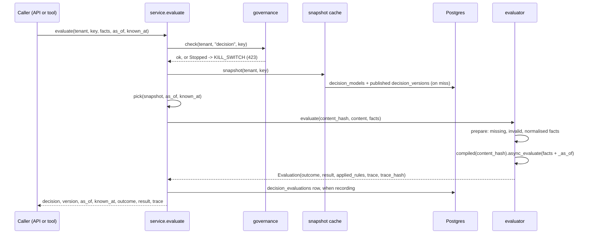

# Decision service

> How a decision is resolved and evaluated at run time, by the API and by the `decision_*` tools, and what gets recorded. For writing, testing and publishing rules see [08-howto/09-decisions](../08-howto/09-decisions.md).

---

## Where it runs

There is no separate decision pod. The service is a library, [`apps/agent-runtime/engine/decisions/`](../../apps/agent-runtime/engine/decisions/), imported in-process by two callers:

| Caller | Entry point | Session |
|---|---|---|
| abenix-api | [`routers/decisions.py`](../../apps/api/app/routers/decisions.py), `/api/decisions/*` | The request's async session |
| agent-runtime | The `decision_*` tools in [`engine/tools/decision_tools.py`](../../apps/agent-runtime/engine/tools/decision_tools.py) | A small pool in `engine/decisions/db.py` over `DATABASE_URL` (`DECISION_DB_POOL` 5, `DECISION_DB_OVERFLOW` 5) |

The API image puts `apps/agent-runtime` on `PYTHONPATH`, and both images pin `zen-engine==2.1.2`.

| Module | Does |
|---|---|
| `service.py` | Loads a decision, picks the version in force, evaluates, records, proposes. Shared by both callers |
| `evaluator.py` | Checks and normalises facts, runs the compiled ZEN decision, builds the trace and trace hash |
| `authoring.py` | The rule builder document, its validation and its compilation to a ZEN model |
| `validation.py`, `interchange.py` | Checks run before propose, typed JSON import and export |

---

## One evaluation

1. **Kill switch.** `governance.check(tenant, "decision", key)` runs first. A stopped decision raises `DecisionError("KILL_SWITCH")`, status 423. Batch evaluation stops the whole batch on it.
2. **Snapshot.** The model row and every version with a `published_at` are loaded once and cached per process for `DECISION_RESOLVE_TTL` seconds (30). An archived model is not found. A missing key gets `NOT_FOUND` with up to three close matches.
3. **Pick the version.** See below. Nothing in force gives `NO_VERSION_IN_FORCE` (404). A caller may instead pin `version`.
4. **Check facts.** `prepare` reads each required fact by its dotted path and coerces values to the declared fact types. A missing fact gives `missing_facts`, a wrong type gives `invalid_facts`, and the engine is not run. ZEN treats a missing fact as a rule that did not match, and a bad input must never look like "nothing applies".
5. **Run.** The compiled decision is cached per process by content hash (`DECISION_CACHE_SIZE`, 512, least recently used out). The evaluation date goes in as the reserved fact `_as_of`. The outcome is `decided` or `no_match`.
6. **Hash.** `trace_hash` is the SHA-256 of the canonical JSON of the checked facts, the version's content hash, the result and the applied rules. Equal hashes mean the same answer for the same reason.

---

## As of and as known

Each version has two clocks:

| Column | Clock |
|---|---|
| `valid_from`, `valid_to` | Valid time, when the rules apply to the activity |
| `published_at`, `superseded_at` | Recorded time, when the platform held the version in force |
| `valid_to_history` | Each later change to `valid_to` as `{from, to, at, by_version}` |

`pick(snapshot, as_of, known_at)` takes `as_of` (default now) and `known_at` (default now) and keeps a version only when:

- it was published at or before `known_at`,
- it was not superseded at or before `known_at`,
- `as_of` is on or after `valid_from`,
- `as_of` is before its end, where the end is `valid_to` as it was recorded at `known_at`. `valid_to_at` walks `valid_to_history` back past any change made after `known_at`.

Of the versions left, the one published last wins. So `as_of` asks "which rules applied on that date" and `known_at` asks "as we knew it then". An answer given last year is repeated exactly by passing last year's date as `known_at`.

Publishing keeps that history intact. `plan_publish` compares the new version's period with the versions in force:

| Overlap | Effect |
|---|---|
| Old period inside the new one | Old version `superseded`, `superseded_at` set |
| Old period starts before and ends inside the new one | Old `valid_to` closed on the new start, the change appended to `valid_to_history` |
| Old period would be split in two, or starts inside and runs past | Refused with `VALID_PERIOD_CONFLICT` and the fix |

Version states run `draft`, `proposed`, `approved` or `rejected`, `published`, then `superseded` or `retired`. Retiring sets `superseded_at` now, so the version stops applying for questions known from now on and still answers for earlier `known_at`.

---

## Recording evaluations

`evaluate` writes a `decision_evaluations` row when any of these holds:

| Trigger | Set by |
|---|---|
| `persist=True` | `persist: true` on the API, `record` on `decision_evaluate` |
| An `idempotency_key` | API callers |
| `log_mode = "all"` on the decision model | The decision's settings |
| `log_mode = "sampled"` and the trace hash falls in the sample | About one evaluation in ten, picked by the first byte of the hash, so the same inputs are always in or out |

The default `log_mode` is `none`. Inside an agent or pipeline run, `decision_evaluate` keeps the record unless the call passes `record: false`. Outside a run it keeps one only when asked or when `log_mode` says so.

The row holds the version id and content hash, outcome, facts, result, applied rules, trace hash, `as_of`, `known_at` when one was given, the idempotency key and `caller`. From the API `caller` is the user id and email. From a tool it is the execution id, agent name, user id, tool name and whether the run is an agent or a pipeline. The response carries `evaluation_id`.

An idempotency key is unique per tenant. Repeating it with the same trace hash returns the first `evaluation_id`. Repeating it with different facts or a different result fails with `IDEMPOTENCY_CONFLICT` (409).

Recorded evaluations are read back with `GET /api/decisions/{key}/evaluations` and `/evaluations/{evaluation_id}`. The Check step compares a draft with the published version over recent recorded evaluations, so recording is what gives that comparison real traffic to work on.

The list takes `limit`, `offset`, `outcome`, `execution_id` and `version`, needs `decisions.view` and is scoped to the tenant. Each row carries the version number, `execution_id` and `caller`. The response meta has the total, a count per outcome and the decision's `log_mode`. The detail endpoint adds the applied rules with their citations and a trace. The table does not store the trace or the missing and invalid facts, so the endpoint re-runs the stored version on the stored facts and date and says whether the trace hash matches the stored one.

### In the run record and the Flight Recorder

`decision_evaluate` and `decision_explain` put a summary on the tool result under `metadata.decision_record`: key, name, version number and id, outcome, outputs, applied rules with key, description and citations, missing and invalid facts with the explanation, facts, trace hash, evaluation id, evaluation time and dates. Outputs and facts are capped at 4 KB each. The summary is copied onto the run's saved tool calls for agent runs and comes through node metadata for pipeline steps, so it is not cut down to the 500 character result preview. The older flat metadata keys (`decision`, `outcome`, `trace_hash`, `version`) are still there.

The Flight Recorder at `/executions/{id}` renders a tool call or pipeline step with a `decision_record` as a decision card. The card shows the outcome, the outputs, the rules that applied with citations, missing or invalid facts, a link to the version, the trace hash, the evaluation id and **Open in Try with these facts**. Try is preloaded through a `try=` query parameter on the decision page, falling back to sessionStorage for large facts. Runs made before this change have no `decision_record` and keep the generic view.

The decision workspace has an **Evaluations** tab over the list and detail endpoints, with deep links of the form `/decisions/{key}?tab=evaluations&evaluation={id}`.

In a run, a failed write of the evaluation record fails the tool call. A governed decision the run cannot account for is treated as not made.

---

## The tools

The executor builds every `decision_*` tool with the run's `tenant_id`, `execution_id`, `user_id` (or the acting subject's) and `agent_name`. Each opens a session from the runtime pool and turns a `DecisionError` into an error result carrying `error_code`.

| Tool | Calls |
|---|---|
| `decision_list` | Reads non-archived `decision_models` and their published versions, with required facts and types |
| `decision_evaluate` | `service.evaluate`. Adds a `next_step` naming the facts to gather or correct |
| `decision_compare` | `service.evaluate` once per target (version, `as_of`, `known_at`), without traces |
| `decision_explain` | `service.evaluate` with the trace, then the applied rules with their descriptions and cited sources |
| `decision_test` | Runs the decision's `decision_tests` against the latest or a named version with `validation.run_tests`, the same check the API runs before propose |
| `decision_propose` | `service.create_proposal`. Saves a draft, runs the golden tests, and proposes it for sign-off only when they pass |

All are `low` risk except `decision_propose`, which is `medium`. It writes a proposal and never publishes. Signing off a proposal is an approval with `gate_kind: decision_publish`, see [05-approvals-hitl](05-approvals-hitl.md). Proposing and publishing emit `decision.proposed` and `decision.published`, see [19-outbound-events](19-outbound-events.md).

Tools see only the tenant's own decisions. Capabilities (`decisions.view`, `decisions.evaluate` and the rest) guard the API routes, not the tools. Giving an agent the tools is the grant.

---

## Cache invalidation

Two caches per process, the snapshot cache keyed by `(tenant, key)` and the compiled-decision cache keyed by content hash. Content hashes never change meaning, so only the snapshot cache needs invalidating.

Publish, retire and model updates call `service.announce(tenant, key)`. It drops the local entry and publishes `tenant|key` on the Redis channel `abenix:decisions:changed`. Every process that has evaluated a decision runs a listener on that channel and drops its entry too. Without `REDIS_URL` there is no listener and other processes catch up within the 30 second TTL.

---

## Limits

| Limit | Value |
|---|---|
| Facts per call | 256,000 bytes of canonical JSON (`MAX_FACTS_BYTES`), 413 above |
| Batch size | 1,000 items (`MAX_BATCH`) |
| Compare targets | 2 to 10 |
| Snapshot TTL | `DECISION_RESOLVE_TTL`, 30 s |
| Compiled cache | `DECISION_CACHE_SIZE`, 512 decisions |

---

## See also

- [08-howto/09-decisions](../08-howto/09-decisions.md), writing, testing, publishing and calling decisions
- [02-tools](02-tools.md#decisions), the tool catalogue
- [01-architecture/07-governance](../01-architecture/07-governance.md), risk tiers and kill switches
