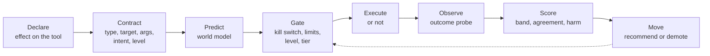

# Earned autonomy

> How an agent earns the right to act on its own, one action type at a time, from measured evidence. Every consequential tool call is declared, predicted, gated, executed, observed and scored, and the score moves the agent up or down a five step ladder. For setting it up see [08-howto/13-earned-autonomy](../08-howto/13-earned-autonomy.md). Tables are in [04-data-model/08-autonomy](../04-data-model/08-autonomy.md).

---

## Where it lives

| Part | File |
|---|---|
| Tool declaration (`Effect`, `READ_ONLY`, `effect_for`) and the gate hook in `_govern` | [`engine/tools/base.py`](../../apps/agent-runtime/engine/tools/base.py) |
| Runtime gate, snapshot, ledger writes, ask-first wait, what the model sees | [`engine/autonomy.py`](../../apps/agent-runtime/engine/autonomy.py) |
| Scoring and ladder rules, pure functions | [`app/services/autonomy_ladder.py`](../../apps/api/app/services/autonomy_ladder.py) |
| Grants, reviews, outcomes, promotion, demotion, SDK proposals, the scheduler tick, the sample plant | [`app/services/autonomy.py`](../../apps/api/app/services/autonomy.py) |
| REST routes, `/api/autonomy/*` | [`app/routers/autonomy.py`](../../apps/api/app/routers/autonomy.py) |
| Edited arguments and promotion sign-off | [`app/routers/approvals.py`](../../apps/api/app/routers/approvals.py) |
| Sample plant tool | [`engine/tools/sample_plant.py`](../../apps/agent-runtime/engine/tools/sample_plant.py) |
| Tables | [`packages/db/models/autonomy.py`](../../packages/db/models/autonomy.py), migration `auton0my0001` |
| UI | `apps/web/src/app/(app)/autonomy/**`, `apps/web/src/components/autonomy/**` |

---

## Words

| Term | Meaning |
|---|---|
| Action | A tool call that changes the world: write, send, publish, control, trade, delete |
| Action type | A kind of action, a row in `action_types`. Tool name plus an optional argument match, key such as `sample_plant.set_setpoint` or `mqtt_publish:controls.write` |
| Grant | One agent's level for one action type, optionally narrowed by a scope |
| Prediction | What should happen, `{metric, value, low, high, horizon_s}` |
| Outcome | What did happen, read later by a probe, sent by an app or typed by a person |
| Track record | Accuracy, agreement, rejects, unknowns and harm for one grant |
| Limits | A decision model that can block an action at every level |

---

## Levels

| Level | Key | Label | What happens |
|---|---|---|---|
| 0 | `off` | Off | The call is refused |
| 1 | `watching` | Watching | Recorded, not executed. A person later says whether they agree |
| 2 | `asks_first` | Asks first | An approval with the action card. Runs only when approved, with any edits |
| 3 | `within_limits` | Acts within limits | Runs alone when the limits pass and the prediction is present and narrow enough. Otherwise asks first |
| 4 | `acts_reports` | Acts and reports | Runs and notifies the grant owner after |

Kill switches and limits apply at every level. A tool with an effect that no grant covers keeps its old behaviour and is recorded as `unmanaged`.

---

## Flow

1. **Declare.** A tool class sets `effect = Effect(kind, label, target_param, magnitude_param, reversible)`. A tool whose operations differ overrides `effect_for(arguments)` and returns `READ_ONLY` for reads. Standalone apps declare actions through the SDK instead.
2. **Contract.** At call time the gate resolves the effect, finds the action type (tool name plus `match`), finds the agent's grant (scope match first) and works out the level that applies now.
3. **Predict.** The action type's `world_model` produces the prediction. Kinds are `agent_stated` (the agent's `_prediction` argument), `decision` (a decision model, inputs rendered from `{{args.x}}`), `ml_model` (a registered model) and `none`. Default timeout 10 s. A failure or timeout leaves no prediction and a note on the card.
4. **Gate.** See the order below.
5. **Execute or not.** Watching returns a plain result so the agent never believes it acted. Asks first waits on an approval. Levels 3 and 4 run the tool.
6. **Observe.** After the call, `outcome_due_at = now + outcome_probe.after_s`. The `observe_actions` job runs the probe when due.
7. **Score.** Within band or not, agreed or not, harm or not.
8. **Move.** The ladder recommends a promotion or demotes on its own. Promotion always needs a person who did not build the agent.

---

## The gate inside `_govern`

`BaseTool.__init_subclass__` wraps every `execute`, so built-in, MCP, dynamic and wrapper tools all pass through `_govern` once, at the outermost call. Agents and pipelines take the same path.

| Step | Check | Outcome when it fails |
|---|---|---|
| 1 | `governance.check` on the tool, then on every run in the chain (agent, pipeline, nested runs) | Error result naming the kill switch |
| 2 | `resolve_effect`. No effect or `READ_ONLY` | Not an action, skip to step 8 |
| 3 | Match action type and grant. None found | Ledger row `unmanaged`, `recorded`, then `executed` or `failed`. Skip to step 8 |
| 4 | Effective level. Lowest of grant level, grant ceiling and action type ceiling. A paused grant and an agent whose config hash changed since the grant are capped at 2. Arguments outside every scope cap at 2 | |
| 5 | Level 0 | Error: "This agent is not allowed to ... (Off). An owner can change this on the Autonomy page" |
| 6 | Limits, when `limits_decision_key` is set. Facts are the arguments plus `target`. 5 s timeout. A timeout or error counts as a breach | Ledger `blocked`, error listing the reasons and the link to the grant |
| 7 | Prediction, then the level | Watching, ask first, run (see Levels) |
| 8 | Existing risk tier logic (`_tier_check`). When a person already approved this call at step 7, the tier's approval is not asked again | Tier block or tier approval as before |

The strictest answer wins. Autonomy can only make a call stricter than the tier policy, never looser.

If the gate itself throws, an unmanaged call goes ahead unchanged and a managed call is refused with "The autonomy check for this action failed, so it did not run". Ledger writes are queued behind the call and never block or fail it. When the ledger table is missing the runtime skips recording for 60 s at a time.

### Snapshot

Action types, active and paused grants and agent config hashes are held in memory and refreshed every 5 s, like `engine/governance.py`. A call never waits on the database to learn its level. The ask-first path writes its ledger row synchronously (3 s cap) before creating the approval so the card can link to it.

---

## What the agent sees

When the run's agent holds a grant on a tool, `ToolRegistry.list_all` passes the tool through `autonomy.describe`:

- The description gets one line: `Autonomy for this action: <label>. <help>. Pass _intent (why) and _prediction {metric,value,low,high} with the call.`
- The input schema gains optional `_intent` (string) and `_prediction` (object with `metric`, `value`, `low`, `high`, `horizon_s`).

Nothing changes for unenrolled tools. `_intent` and `_prediction` are stripped before the tool runs (`strip_autonomy_args`).

Results by level:

| Level | `is_error` | Content |
|---|---|---|
| Watching | false | "Recorded in watching mode, not executed. A person will compare it with what they would do. Do not tell the user it was done." |
| Asks first, approved | from the tool | The tool's own result, run with the edited arguments when a reviewer changed them |
| Asks first, rejected | true | "Not done. <reviewer> rejected this action: <reason>. Do not tell the user it was done." |
| Asks first, expired | true | "Not done. Nobody approved this action within N minutes, so it expired." |
| Blocked | true | The limit reasons or the Off message, with the link |

Every result carries `metadata.autonomy` with `action_id`, `level`, `level_label`, `mode`, `status`, `grant_id`, `action_key`, `link` and, for watching, `proposed`. The executor copies it onto the tool call so chat and the flight recorder show a level badge. While waiting on an approval the run publishes a progress event with `phase: autonomy_waiting`, and a streaming run emits `action_pending`.

---

## Asks first

The runtime creates the approval through the internal API, the same way `approval_gate` does:

| Field | Value |
|---|---|
| `gate_kind` | `action:<key>` |
| `title` | `<agent> wants to <label>` |
| `payload` | The action card: action type, agent, level, target, arguments, intent, prediction, limits, `fallback_reason`, `record`, `editable_arguments: true` |
| `required_signoffs` | 1 |
| `expires_seconds` | `action_types.policy.approval_expires_s`, default 1800 |
| `risk_tier` | The higher of the run tier and the tool tier, when not low |

The run waits on the approval and the execution is marked waiting so the stale sweeper skips it. A reviewer may approve with `edited_arguments` (only keys the agent sent, see [the REST reference](../09-reference/00-rest-api.md#earned-autonomy)). The ledger row becomes `approved` or `edited`, then `executed`.

Level 3 falls back to asking first with a `fallback_reason` when there is no prediction, when the band is wider than `max_band_width`, or when the arguments are outside the grant's scope.

---

## Pipelines

Pipeline tool nodes take the same hook. A watching node's output becomes `{"status": "watching", "proposed": {...}}`, so a downstream condition can branch on it like an approval status. Rejected and blocked calls fail the node with the error content. The pipeline run context carries `agent_id` and `agent_config_hash` of the pipeline.

---

## Scoring

From `autonomy_ladder.score_action` and `compute_stats`.

| Signal | Rule |
|---|---|
| Within band | Outcome between `low` and `high`. A categorical prediction must match, case-insensitive |
| Band honesty | `(high - low) / abs(value)` above the action type's `max_band_width` counts as no prediction. An action holds only when within band and the band was honest |
| Agreement, watching | Agree 1, Different 0, Not sure left out |
| Agreement, asks first | Approved 1, edited 0.5, rejected 0 |
| Harm | A person flags it. Harm outweighs any number of correct calls (see demotion) |
| Confidence | Accuracy and agreement use the Wilson lower bound at 95 percent over the last `window` scored actions, 50 by default |
| Unknown | An outcome that never arrives is `unknown`, not correct. `unknown_rate` counts against promotion |
| Rejected | Rejections have no outcome. `reject_rate` is its own requirement |

Only rows with `outcome_status` `observed` or `manual` and a score count as scored.

---

## Ladder rules

Defaults in `DEFAULT_POLICY`. An action type's `policy` overrides any of them key by key. The sample plant uses much lower numbers.

| Move | Needs (defaults) |
|---|---|
| Watching to Asks first | 20 reviews, agreement lower bound at least 70 percent |
| Asks first to Acts within limits | 50 scored actions, accuracy lower bound 85 percent, approved without edits 80 percent, no harm for 30 days, 14 days at the level, unknown outcomes at most 20 percent, rejects at most 30 percent, eval suite passing when the agent has one |
| Acts within limits to Acts and reports | 200 scored actions, accuracy lower bound 95 percent, no harm for 60 days, 14 days at the level, unknown at most 20 percent, rejects at most 20 percent |

Also in the policy: `window` 50, `demote_margin` 0.10, `revision_recheck` 10, `approval_expires_s`.

Each requirement comes back as a plain sentence with progress and, when unmet, a fix link. For example "34 of 50 scored actions", "Accuracy 91% (needs 85%)", "No harm for 9 days (needs 30)". After an agent change, levels above 2 also need "N of 10 correct actions since the agent changed".

Ceilings by the agent's risk tier (`model_config.risk_tier`):

| Tier | Highest level |
|---|---|
| critical | 2, Asks first |
| high | 3, Acts within limits |
| medium, low | 4, Acts and reports |

The effective ceiling is the lowest of the tier ceiling, `action_types.ceiling` and `autonomy_grants.ceiling`. The API only lets you lower a ceiling. A paused grant cannot be promoted.

### Promotion

`POST /grants/{id}/promote` checks `autonomy.grant` and refuses the agent's creator with `AUTHOR_CANNOT_GRANT`, apart from the two self-approval cases below. When not ready it returns 409 `NOT_READY` with the requirements. When ready it opens an approval with `gate_kind = autonomy.promote`, payload `{grant_id, from, to, evidence, requirements, record, self_approval}` and a 7 day expiry. Signing it applies the same author rule. On approval the level moves, `granted_by` and `agent_config_hash` are set, an `autonomy_changes` row is written with the evidence and `autonomy.promoted` is emitted. Turning an Off grant back on to Watching needs no sign-off.

### Self-approval

The author may approve their own promotion in two cases only (`self_approval_reason` in the service):

| Case | Check | Reason shown |
|---|---|---|
| The sample | `action_types.is_sample` | "This is the sample, so you can approve it yourself. In real use someone else approves promotions." |
| A solo builder | No other active user in the tenant holds `autonomy.grant` (`someone_else_can_grant`) | "You are the only person in this workspace who can approve promotions, so you can approve it yourself. It is recorded as self-approved." |

The author still needs `autonomy.grant` to promote and to sign. When allowed, the reason goes into the approval payload as `self_approval`, and the grant page and the Approvals promotion row show it with an **Approve now** button. The rule runs again when the approval is signed, so if a teammate with `autonomy.grant` joined in between, the author is refused with `AUTHOR_CANNOT_GRANT`. A self-approved promotion writes "Self-approved by <name>" as the change reason and `self_approved: true` in the evidence. Otherwise `self_approved` is false.

### Demotion

Never needs an approval. The strictest rule wins.

| Trigger | New level | Where |
|---|---|---|
| Harm flagged | `min(level, 2)` at once | `POST /actions/{id}/harm` |
| Harm since the level was granted, at level 3 or 4 | 2 | ladder re-evaluation |
| Accuracy lower bound more than `demote_margin` under the threshold that granted the level, with at least 5 scored | level - 1 | ladder re-evaluation |
| Agent config hash changed (prompt, model, tools), at level 3 or 4 | 2 until `revision_recheck` actions on the new hash hold | runtime caps at once, ladder writes the change |
| Ceiling lowered below the level | the ceiling | `PATCH` grant or action type |
| A person picks a lower level or Turn off | their choice | `POST /grants/{id}/demote` |
| Kill switch | treated as Off at run time, the grant row is unchanged | `_govern` |

A world model change never demotes. It writes an `autonomy_changes` row with the same level so the chart shows a marker.

---

## Scheduler

`observe_actions` runs every 30 s in the API scheduler under advisory lock `ACTN` (`0x4143544E`).

1. Picks up to 100 actions with `outcome_status = pending` and `outcome_due_at <= now`, `FOR UPDATE SKIP LOCKED`.
2. `tool` probes run through the same path as `POST /api/tools/{slug}/execute`, as the agent's creator (else the action type's author). Arguments render `{{args.x}}` and `{{target}}`. `path` reads one value out of the result (`a.b[0].c`).
3. A probe that finds nothing retries 30 s later. After 3 attempts, or 24 h past due, the outcome is `unknown`. `manual` and `api` probes wait for a person or an app and turn `unknown` after 24 h.
4. Re-evaluates every grant it touched, plus every grant with an action in the last 10 minutes: automatic demotions, `attention`, and one `autonomy.recommended` per level.
5. Tells owners about unanswered watching actions, at most hourly per grant.

---

## Events, notifications, capabilities

Events in the catalog, see [19-outbound-events](19-outbound-events.md):

| Event | Emitted by |
|---|---|
| `action.proposed` | `POST /actions/propose` |
| `action.executed` | `POST /actions/{id}/executed` |
| `action.outcome_recorded` | Any scored outcome, from a probe, an app or a person |
| `autonomy.recommended` | Ladder re-evaluation, once per level |
| `autonomy.promoted` | A promotion approval signed |
| `autonomy.demoted` | Any demotion, user or system |

Action gates and promotions also raise the usual `approval.requested` and `approval.resolved`.

Notifications go to the grant owner (`granted_by`) and the agent's creator. `autonomy_recommended`, `autonomy_demoted` and `action_pending_review` map to the `autonomy_updates` preference. At level 4 the runtime sends `action_reported` after each run.

| Capability | Lets you | Default roles |
|---|---|---|
| `autonomy.view` | See the Autonomy pages, grants and the ledger | user, creator, admin |
| `autonomy.manage` | Enrol, configure action types, demote, pause, unenrol, install and run the sample | creator, admin |
| `autonomy.grant` | Approve promotions, never for an agent you built | admin |
| `actions.review` | Answer watching reviews, record outcomes, flag harm | user, creator, admin |

Separation of duties: the agent's creator cannot request or sign its promotion, except for the sample and for a solo builder (see [Self-approval](#self-approval)), both labelled as self-approved. Reviews and harm flags are open to the creator.

---

## Limitations

Agent tool calls write their ledger rows from the runtime. The `observe_actions` job emits `action.proposed` and `action.executed` for those rows within 30 s, so webhooks see agent actions and SDK actions alike. Thresholds can be set for a whole tier with an `autonomy` block in `PUT /api/governance/risk/{tier}`, and per action type through `policy`, which wins. A limits model where no rule matches counts as inside the limits on both paths.

- Ledger rows are not linked into the hash-chained audit log. Level changes by a person are audited as `autonomy.level_changed`.
- No `twin` world model yet, and no `code_asset` or `pipeline` world model or probe.
- Long-horizon outcomes (weeks) turn `unknown` after 24 h past due. Use `manual` or `api` with a matching `after_s`.
- `autonomy.hide_until_answered` in tenant settings hides the proposal from reviewers until they answer. It is off by default.

---

## See also

- [05-approvals-hitl](05-approvals-hitl.md)
- [20-decision-service](20-decision-service.md) for limits models
- [01-architecture/07-governance](../01-architecture/07-governance.md)
- [08-howto/13-earned-autonomy](../08-howto/13-earned-autonomy.md)
