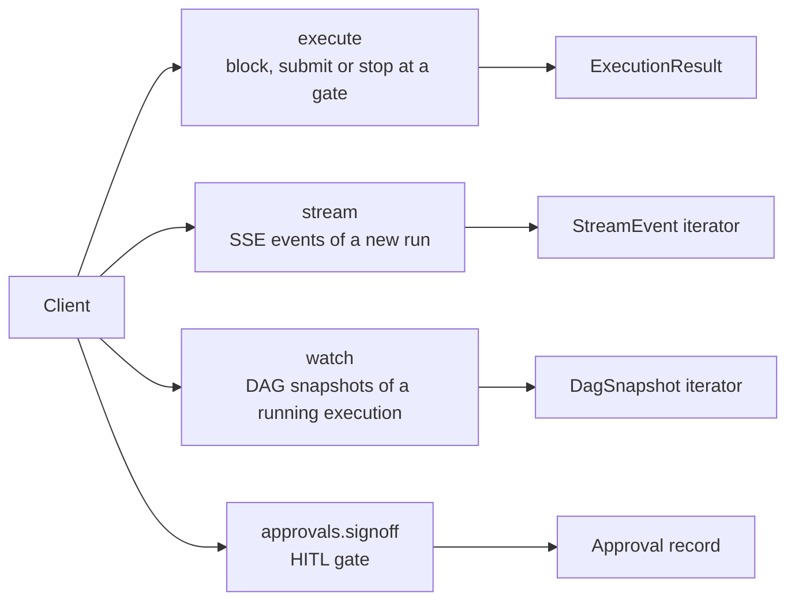

# SDK overview

> Three SDKs (Python, TypeScript, Java) wrap the same REST surface and the same error envelope. Python has the most methods, TypeScript and Java cover a subset. Pick whichever language your app speaks.

---

## Why three SDKs

The platform's callers are written in different languages:
- **Standalone vertical apps** (Wingman, E&C-Copilot) — Python backends.
- **Customer integrations** — usually TypeScript or Java.
- **CI / scripts** — Python or shell.
- **JVM apps** (ClaimsIQ) — Java.

Each SDK saves callers from writing HTTP and SSE handling, slug lookup and the actAs header by hand.

The Python SDK is the reference implementation. TypeScript and Java share its execute and approvals shape but not every client. The decisions, sources and events clients exist in Python and TypeScript only.

---

## The mental model

Four primary operations:



### `execute(slug_or_id, message, act_as=None, *, wait=None, **kwargs)`
The big one. `message` is the text prompt. Input variables go in `context={...}`. Returns an `ExecutionResult`.

| `wait` value | Returns |
|---|---|
| omitted or `"completed"` (default) | Blocks until the run ends, `status` is `completed` or `failed` |
| `"submitted"` | Returns at once with `execution_id` and `status="running"` |
| `"until_gate"` | Blocks, but returns early with `status="paused"` and `paused_at` if a HITL gate opens |

TypeScript takes `wait` in its options object. Java uses `ExecuteOptions.defaults().waitMode(WaitMode.SUBMITTED)` and the other `WaitMode` values.

### `stream(slug_or_id, message)`
Starts a run and yields its SSE events (`token`, `tool_call`, `tool_result`, `node_start`, `node_complete`, `done`, `error`). Other events the server sends, such as `moderation`, `reply_checking` and `node_trace`, come through under their own name and are not errors. `done` carries the run's `execution_id`, so you can read the run back with `executions.get`. Every event also has its raw payload in `data`. Python and TypeScript. Java follows a run through `watch`.

### `watch(execution_id)`
Subscribes to the DAG snapshot stream of an existing execution. Useful when the run was kicked off by a different process (webhook, scheduler, etc.). Python and Java.

### `approvals.signoff(approval_id, decision, reason=..., client_token=...)`
Records an approval signoff. `approve`, `deny` and (Python, TypeScript) `return_for_changes` wrap it. Used by HITL workflow apps.

Smaller surfaces cover agents, knowledge bases, chat threads, tools, presets, ML models, executions, actions and autonomy, and feedback and lessons. The four above are most of the usage.

---

## The actAs pattern

Lets a service-account client act **on behalf of** an end user, so each run is recorded against that user.

```python
from abenix_sdk import Abenix, ActingSubject

client = Abenix(api_key=service_account_key, base_url=api_url)

trader = ActingSubject(
    subject_type="wingman",
    subject_id="trader-42",
    email="alice@yourcorp.com",
    display_name="Alice — Crude Desk",
)

# this run is attributed to trader-42
result = await client.execute(
    "wingman-mispricing-extractor",
    "Scan the USGC-NWE corridor",
    act_as=trader,
    context={"corridor": "USGC-NWE"},
)
```

The SDK sends `X-Abenix-Subject` with a JSON object: `{"subject_type": "wingman", "subject_id": "trader-42", "email": ..., "display_name": ...}`. The API key needs the `can_delegate` scope, checked in `get_current_user` ([`apps/api/app/core/deps.py`](../../apps/api/app/core/deps.py)), or the call is refused. The platform stamps the subject on the execution row (`executions.subject_id`, `subject_type`) and passes it to the agent run, where tools use it, for example to pick the per-subject KB collection. The audit log (`activity_logs`) has no subject columns and still records the service account.

Pass the subject per call, or set a default (`act_as=` on the constructor, or `set_act_as`). Not every call sends it. In Python it goes out on `execute`, `stream`, `chat`, `tools` and `presets`. In TypeScript only on `execute` and `stream`. In Java a default subject goes out on every call.

### Why this matters
Without actAs, every run looks like it came from the wingman service account. With actAs, executions carry the end-user identity, so runs can be listed and scoped per user even though the wire-level auth is the service's API key.

See [01-architecture/01-tenants-rbac](../01-architecture/01-tenants-rbac.md#actas--the-delegation-chain) for the platform side.

---

## HITL-aware `execute`

When an agent might pause on an approval gate, use `wait="until_gate"`:

```python
result = await client.execute(
    "contract-execute-flow",
    "Execute the Acme renewal",
    wait="until_gate",
    context={"counterparty_id": cp.id, "amount_usd": 2_400_000},
)

if result.status == "paused":
    print(f"Pending: {result.paused_at.approval_id}")
    print(f"Payload: {result.paused_at.payload}")
    # ... go do something else, the reviewer gets a notification ...
    approval = await client.approvals.wait_for(result.paused_at.approval_id, timeout_seconds=3600)
    row = await client.executions.get(result.execution_id)   # the run resumes after sign-off
    print(approval["status"], row["status"])
elif result.status == "completed":
    print(result.output)
else:
    print(f"Ended as {result.status}")
```

TypeScript returns `pausedAt` with the same fields in camelCase. Java returns `pausedAt()` on the `ExecutionResult` record.

---

## Error envelope

Every non-2xx response from the API carries the same envelope:

```json
{"data": null, "error": {"message": "...", "code": 409, "error_code": "STALE_DRAFT", "details": {}}}
```

`code` is the HTTP status. `error_code` and `details` are only there when the endpoint sets them, and most endpoints don't, so branch on the HTTP status first.

How each SDK surfaces it differs:

| SDK | Newer clients | Older methods |
|---|---|---|
| Python | `AbenixError` / `AbenixDecisionError` with `status`, `code`, `details`, message via `str(e)` | `httpx.HTTPStatusError`, read `e.response` |
| TypeScript | `AbenixError` / `AbenixDecisionError` with `status`, `code`, `details`, `message` | plain `Error` with the server message. `executions` and `agents` do not check the status |
| Java | n/a | `AbenixException` (unchecked), status and body in the message only |

Codes you may see:

| `error_code` | Meaning |
|---|---|
| `VALIDATION_ERROR` | 422, the body failed schema validation. `details.errors` lists the fields |
| `BUSY` | 503, every DB connection is in use. `Retry-After: 2` |
| `STALE_DRAFT` | 409, someone saved the decision draft after you read it |
| `INVALID_REPLICAS` / `INVALID_RESOURCE_PRESET` | ML model deploy validation |
| `IN_USE` | 409, the agent or code asset has dependents. `details.dependents` lists them |
| `EVAL_GATE` | 409, eval suites block the agent change. `details.suites` |
| `AGENT_DELETED` | 410 on execute, the agent was archived |

A rate-limited call gets a 429 with a `Retry-After` header and no `error_code`.

---

## Retries + idempotency

None of the SDKs retry. Handle 429 (honour `Retry-After`) and 502 / 503 / 504 yourself. Don't retry other 4xx responses, they are caller errors.

`client_token` gives idempotency on approvals. On `approvals.create`, a token already used in the tenant returns the existing approval. On `approvals.signoff` (and `approve`, `deny`, `return_for_changes`), a token already recorded on that approval returns it unchanged. `execute` takes no `client_token`. For decisions, `decisions.evaluate` takes `idempotency_key`.

```python
await client.approvals.signoff(
    approval_id,
    "approve",
    reason="Checked against the contract",
    client_token=f"signoff-{approval_id}-{user_id}",   # stable across retries
)
```

---

## Tracing propagation

None of the SDK clients touch OpenTelemetry themselves. Trace context reaches the platform when the HTTP library underneath is instrumented, which then sends the W3C `traceparent` header:

- Python: `abenix_sdk.tracing.init_tracing(service_name, fastapi_app=None)` sets up OTel and instruments `httpx`. It needs `OTEL_EXPORTER_OTLP_ENDPOINT` (or `OTEL_TEMPO_ENDPOINT`) and the OTel packages, see [01-python](01-python.md#opentelemetry-integration).
- TypeScript: instrument `fetch` yourself.
- Java: run with the OpenTelemetry Java agent, which instruments `java.net.http.HttpClient`.

With that in place, the platform-side execution joins the same trace and you see one connected trace in Grafana Explore (or your own Tempo / Jaeger backend).

---

## Clients and server areas

Each sub-client on `Abenix` wraps one area of the REST API. Python has the most methods, see [02-typescript](02-typescript.md#platform-clients) and [03-java](03-java.md#other-clients) for what each lacks.

| Client | Server area | Python | TypeScript | Java |
|---|---|---|---|---|
| `me()`, `permissions()` | `/api/me`, `/api/me/permissions` | both | both | both |
| `agents` | `/api/agents` | list, get, `find_by_slug`, `by_slug`, `create`, `update` | list, get, `bySlug`, `create`, `update` | list, get, `findBySlug`, `bySlug`, `create` |
| `decisions` | `/api/decisions`, `/api/decision-reference-sets` | 27 methods | 18 methods | none |
| `sources` | `/api/sources` | 16 methods | 12 methods | none |
| `events` | `/api/webhooks` | 9 methods incl. `redeliver`, `verify_signature` | 7 methods, no `test` or `redeliver` | none |
| `approvals` | `/api/approvals` | 10 methods | 10 methods | 8 methods, no `return_for_changes` or `subscribe` |
| `executions` | `/api/executions` | live, list, get, replay, tree, pending approvals, raw watch | same minus raw watch | live, list, get, replay, tree, pending approvals |
| `knowledge` | `/api/knowledge-engines`, `/api/knowledge-bases`, `/api/knowledge-projects` | project bootstrap, subject collection, upload, documents, cognify, search, graph, jobs | project bootstrap, upload, documents, cognify, search, graph, jobs | project bootstrap, upload, documents, cognify, search, graph, jobs |
| `chat` | `/api/conversations` | 7 methods | none | 7 methods |
| `tools`, `presets` | `/api/tools`, `/api/tool-presets` | yes | none | yes |
| `ml_models` | `/api/ml-models` | list only | none | list only |
| `actions` | `/api/autonomy/actions` | propose, wait, executed, report outcome, flag harm, get | same | same, `wait` is `waitFor` |
| `autonomy` | `/api/autonomy` | overview, grant, grant actions | same | same |
| `feedback`, `lessons`, `improvements` | `/api/improvements` | give, report, list, get | same | same, plus `feedback().giveOnMessage` |

Detail pages: decisions in [08-howto/09-decisions](../08-howto/09-decisions.md), sources in [02-runtime/17-source-watch](../02-runtime/17-source-watch.md), events in [02-runtime/19-outbound-events](../02-runtime/19-outbound-events.md), approvals in [02-runtime/05-approvals-hitl](../02-runtime/05-approvals-hitl.md).

No SDK wraps evaluation suites, governance (permission sets, risk tiers, kill switches, audit, run replay) or tool configuration. Call those routes from the [REST reference](../09-reference/00-rest-api.md) directly, in Python through `client.http`.

The newer calls (`me`, `permissions`, `agents.by_slug/create/update`, `decisions`, `sources`, `events`, `actions`, `autonomy`, `improvements`, `lessons`, `feedback`) raise a typed error on any 4xx or 5xx. Decision calls raise `AbenixDecisionError`, the rest raise `AbenixError`. Both carry `status` (HTTP status), `code` (the server's `error_code`, such as `STALE_DRAFT`), `details` and the message. In Python the message is `str(e)`. In TypeScript it is `e.message`. `AbenixDecisionError` subclasses `AbenixError` in Python only.

---


## Versions

The SDK version follows the platform. Major and minor match the Abenix release the SDK was built and tested against, the patch number is the SDK's own. Abenix 2.5.x ships `abenix-sdk` 2.5.5 (Python), `@abenix/sdk` and `@abenix/react` 2.5.5 (TypeScript and React) and `com.abenix:sdk` 2.5.5 (Java). An SDK works against any platform with the same major and minor. A call added in a later minor needs that platform.

When the platform moves to a new minor, every SDK manifest moves with it in the same release: `packages/sdk/python/pyproject.toml`, `packages/sdk/js/package.json`, `packages/sdk/react/package.json` and `claimsiq/sdk/build.gradle.kts`.

---

## Testing the SDKs against a live platform

`bash scripts/sdk-e2e.sh` runs every SDK the way an app uses it. It signs in to the web UI and generates an API key on Settings, API keys, then runs the same journey in each language: run, stream and read a run back, approvals, autonomy propose, wait and outcome, lessons and feedback, and knowledge upload and search.

| Suite | What runs |
|---|---|
| `python` | `e2e/sdk/python_sdk_e2e.py` with pytest |
| `js` | builds `@abenix/sdk`, packs it, installs the tarball into `e2e/sdk/js` and runs `node --test` |
| `react` | `AgentChat` and `useAgentStream` rendered in jsdom with the real `fetch`, through vitest |
| `java` | the SDK's JUnit suite and `e2e/sdk/java/LiveSmoke.java` in a `gradle:8.7-jdk21` container, no local JDK needed |

Pass suite names to run a subset, for example `bash scripts/sdk-e2e.sh python js`. `ABENIX_URL` and `BASE` point it at another API and web UI. The autonomy checks use the sample plant from the Autonomy page.

---

## Language-specific docs

- [01-python](01-python.md) — install, the `Abenix` client, execute, streaming, errors, platform clients
- [02-typescript](02-typescript.md) — install, execute, streaming, the `AgentChat` React component, platform clients
- [03-java](03-java.md) — install, blocking execute, watch, approvals, Spring integration

The wire format is identical across languages. The method sets are not, each page says what its SDK lacks.

---

## Picking a wait mode

| Scenario | Use |
|---|---|
| "Just run it and tell me the answer." | default (`"completed"`), bounded by the client timeout and at most 1800 s server-side. |
| "Run it and show the user updates in the UI." | `stream(...)`, render each event. |
| "Long-running batch — fire and check on a job board." | `wait="submitted"`, then `executions.get(id)` or `watch(id)` later. |
| "Compliance flow that might pause." | `wait="until_gate"`. |

> **Trap** — never block on a run inside a webhook handler. Webhook providers (Slack, Stripe, GitHub) time out after 3-10 s, and a run often takes longer. Submit with `wait="submitted"`, return 200, then follow the run from a background task.

---

## See also

- [01-python](01-python.md) — Python SDK reference
- [02-typescript](02-typescript.md) — TS/JS SDK reference
- [03-java](03-java.md) — Java SDK reference
- [01-architecture/01-tenants-rbac](../01-architecture/01-tenants-rbac.md) — actAs on the server side
- [02-runtime/05-approvals-hitl](../02-runtime/05-approvals-hitl.md) — what happens when the agent pauses

---

## Source map

| What | Where |
|---|---|
| **Canonical Python SDK source** | [`packages/sdk/python/abenix_sdk/`](../../packages/sdk/python/abenix_sdk/) — copied into `packages/agent-sdk/` and every standalone app's `api/sdk/` |
| **SDK sync verifier** | [`scripts/sync-sdks.sh`](../../scripts/sync-sdks.sh) — `--check` fails when a copy drifts from canonical, run by `dev-local.sh` and `deploy-azure.sh` |
| **TypeScript SDK** | [`packages/sdk/js/`](../../packages/sdk/js/) — `@abenix/sdk` |
| **React component** | [`packages/sdk/react/`](../../packages/sdk/react/) — `@abenix/react`, `AgentChat` and `useAgentStream` |
| **Live SDK suites** | [`scripts/sdk-e2e.sh`](../../scripts/sdk-e2e.sh) and [`e2e/sdk/`](../../e2e/sdk/) |
| **Java SDK** | [`claimsiq/sdk/`](../../claimsiq/sdk/) — `com.abenix.sdk` |
| **REST surface the SDKs wrap** | [`09-reference/00-rest-api`](../09-reference/00-rest-api.md) |
| **Error envelope** | [`apps/api/app/core/responses.py`](../../apps/api/app/core/responses.py) — `success()` / `error()` |
| **OTel setup for Python apps** | [`packages/sdk/python/abenix_sdk/tracing.py`](../../packages/sdk/python/abenix_sdk/tracing.py) — `init_tracing` |
